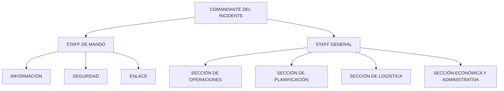

# Mandos

### I. Introducción al Sistema de Protección Civil y los Servicios de Emergencia

El 21 de enero de 1985 se promulgó la Ley de Protección Civil (LPC) a nivel nacional, con el propósito de establecer un marco competencial unificado para la gestión de emergencias. Esta ley sentó las bases para un modelo de estructura operativa que se alinea con la Constitución Española y los Principios e Intereses Generales del Estado, así como con las entidades locales.

La LPC define la Protección Civil como la salvaguarda física de individuos y bienes en situaciones de riesgo colectivo grave, calamidad pública o catástrofe extraordinaria, donde la seguridad y la vida humana se ven seriamente amenazadas. Se concibe como una parte integral de una política de seguridad más amplia, cuyo objetivo es la defensa del derecho a la vida y la integridad física, promoviendo la obligación, unión y coordinación de las diversas Administraciones Públicas.

Este enfoque establece un sistema transversal que idealmente debe integrarse en la respuesta global de todas las instituciones públicas, tanto las que colaboran directa como indirectamente en la protección de los ciudadanos. El Título II de la LPC destaca la necesidad imperante de organización para una resolución efectiva de emergencias en el ámbito de Protección Civil, dada la "extraordinaria heterogeneidad y amplitud de las solicitudes de emergencia, así como de las necesidades que generan y de los recursos humanos y naturales que han de ser movilizados para hacerles frente". Este imperativo resalta la Protección Civil como un problema de organización fundamental.

Con base en estos principios, se estructuran, reorganizan y crean nuevos Servicios de Emergencia que, al conformar el Sistema de Protección Civil, persiguen finalidades comunes. El Artículo 15 de la Constitución Española establece la misión estratégica y el objetivo primordial de estos servicios: garantizar el derecho a la vida y a la integridad física como derechos fundamentales.

El estudio presente aborda la estructura y organización de los Servicios de Emergencia que integran el Sistema Español de Protección Civil, comenzando por la definición de emergencia y los mecanismos para su atención.

### II. Fases del Ciclo de Vida de la Emergencia

El ciclo de vida de una emergencia comprende las siguientes etapas:

1.  **Previsión:**
    *   Análisis de los riesgos potenciales, sus causas, efectos y las áreas que podrían verse afectadas, documentado en un "Inventario de Riesgos".
    *   Implementación de mecanismos para anticipar eventos catastróficos, como la predicción meteorológica.
2.  **Prevención:**
    *   Adopción de medidas destinadas a evitar, mitigar el riesgo o minimizar sus consecuencias una vez que el evento ha ocurrido. Esto se basa en un estudio pormenorizado de los riesgos, su probabilidad de ocurrencia y el impacto potencial.
3.  **Planificación:**
    *   Definición de los planes y directrices de actuación necesarios para abordar las emergencias.
4.  **Alerta:**
    *   Activación formal de los mecanismos de alerta ante la presencia inminente de un riesgo que se ha materializado y que demanda una intervención específica.
5.  **Intervención:**
    *   Ejecución de actividades y acciones de respuesta de forma inmediata después del suceso, incluyendo control, mitigación y salvamento.
6.  **Rehabilitación:**
    *   Restauración de los servicios públicos esenciales y de las condiciones socioeconómicas y ambientales necesarias para normalizar la vida de las zonas afectadas.

Estas fases conforman un enfoque integral para la gestión de cualquier emergencia (seguridad, sanitaria, salvamento, extinción de incendios, etc.), independientemente de su naturaleza.

### III. Agentes Intervinientes en Emergencias

En el ciclo de vida de una emergencia, intervienen principalmente tres tipos de agentes:

1.  **El Alertante:** Es el ciudadano que informa sobre el incidente. Será entrevistado por el Servicio de Atención de Llamadas de Urgencia o por el servicio local directo para recabar datos que permitan movilizar los recursos necesarios. Frecuentemente, el alertante es también el beneficiario y, debido al nerviosismo o la inexperiencia en estas situaciones, puede ofrecer información imprecisa.
2.  **El Servicio de Atención de Llamadas de Urgencia (SAU) 112:** Constituye el medio más accesible e inmediato para canalizar las solicitudes de ayuda de los ciudadanos en situaciones de riesgo personal o colectivo. Es un número único de urgencia, gratuito y prefijado, implementado en Europa y otros países. Los operadores de telefonía están obligados a garantizar su implantación en todo el territorio nacional, según el Real Decreto 903/1997.

    Detrás del 112 opera un Centro de Comunicaciones, gestionado por cada Comunidad Autónoma, que puede funcionar como un "call center" para redirigir llamadas o como un centro de coordinación que activa capacidades remotas de mando y control para la gestión integrada de operaciones de Protección Civil. El sistema informático de este centro está diseñado para cubrir todo el ciclo de la emergencia, desde la recepción y gestión de la demanda y recursos hasta la coordinación global de los servicios implicados, así como las tareas de prevención, planificación, evaluación y rehabilitación. Sus objetivos son:
    *   Captar información en tiempo real.
    *   Ajustar los recursos a las situaciones.
    *   Administrar los recursos humanos y materiales.
    *   Fomentar la conciencia situacional para la toma de decisiones.
    *   Promover la integración y coordinación de los agentes y servicios involucrados.

    Debe contar con sistemas mínimos para la atención, despacho y gestión de incidentes en alta disponibilidad; integración y grabación de comunicaciones (telefónicas y de radio); y registro y almacenamiento de información georreferenciada (capas topográficas, medios, recursos, riesgos).
3.  **Los Servicios de Emergencia:** Aparte de las Fuerzas del Orden, la dependencia administrativa de los Servicios de Emergencia en España es compleja, heterogénea y a menudo solapada. El Real Decreto 407/1992, de 24 de abril, estableció la Norma Básica de Protección Civil (NBPC), que desarrolla la Ley de Protección Civil y detalla actuaciones y medidas para una respuesta organizada. Las medidas de socorro se agrupan para atender situaciones como:
    *   Personas desaparecidas.
    *   Personas sepultadas o aisladas bajo ruinas.
    *   Personas heridas o contaminadas.
    *   Personas enfermas debido a condiciones ambientales e higiénicas.

    Los servicios que reciben una petición de auxilio movilizan los medios necesarios al lugar del siniestro, de forma telemática o presencial, dentro de su ámbito competencial.

### IV. Otros Agentes y Colaboración Estratégica

Además de los agentes principales, existen otras entidades que contribuyen al soporte de las operaciones de emergencia:
*   Escuelas de Protección Civil.
*   Asociaciones de profesionales y federaciones de la Emergencia.
*   Servicios de vías y obras.
*   Empresas privadas de mantenimiento, maquinaria pesada, investigación, suministro y formación.
*   ONG de asistencia en catástrofes.

Un sistema de Protección Civil ideal aspira a una estrecha interrelación entre todos estos agentes para establecer una estrategia nacional única, fundamentada en:
*   **Enfoque integral:** Integración de todas las dimensiones de la seguridad hacia objetivos comunes y reconocimiento de las interrelaciones.
*   **Coordinación:** Colaboración entre Administraciones Públicas, el Estado y empresas privadas (dada la implicación de estas en infraestructuras críticas), y participación ciudadana y de organizaciones sociales para optimizar recursos.
*   **Eficiencia en el uso de los recursos:** Mejora continua de los mecanismos de coordinación entre entidades públicas y privadas para asegurar una respuesta óptima en prevención y ante catástrofes.
*   **Anticipación y prevención:** Desarrollo de medios para alertar y prevenir amenazas, evitando o minimizando peligros para la seguridad nacional y ciudadana.
*   **Capacidad de resistencia y recuperación:** Establecimiento de sistemas e instrumentos flexibles y robustos para afrontar desafíos imprevisibles.

### V. Situación de los Servicios de Bomberos en España

La gestión de emergencias representa un reto organizativo y una responsabilidad administrativa compleja, exacerbada en España por la descentralización del Estado hacia las Comunidades Autónomas. Actualmente, no existe una ley nacional que garantice la cobertura de los Servicios de Bomberos ni que establezca una estructura y organización mínimas uniformes. Las "Leyes de Emergencia" existentes en algunas Comunidades Autónomas (como Andalucía, Comunidad Valenciana, Cataluña y Galicia) no están completamente desarrolladas en aspectos cruciales para los Servicios de Bomberos.

Ante esta falta de regulación general, las distintas Administraciones (Estatal, Regional, Provincial y Municipal) y otras entidades han implementado diversos modelos de servicios (públicos, privados, municipales, provinciales, comarcales, etc.).

**1. Antecedentes Normativos:**

*   **Reglamento de Servicios de las Corporaciones Locales (1955):** Establecía la obligatoriedad de un servicio propio de extinción de incendios para municipios con más de 5.000 habitantes. En esa época, solo las grandes ciudades y capitales de provincia disponían de ellos, siendo inalcanzables para municipios más pequeños.
*   **Ley 7/1985, de 2 de abril, Reguladora de las Bases del Régimen Local (LRBRL):** Atribuyó a los municipios la competencia en Protección Civil, prevención y extinción de incendios, y mantuvo la obligatoriedad de servicios propios para poblaciones superiores a 20.000 habitantes (Artículo 26.1). Esta normativa llevó a que, durante periodos de crecimiento demográfico y económico, numerosas poblaciones crearan sus servicios de bomberos por imperativo legal. La gestión de estos servicios se canalizó progresivamente a través de las Diputaciones Provinciales y de Consorcios.
*   **Ley 27/2013, de 27 de diciembre, de Racionalización y Sostenibilidad de la Administración Local:** Modificó parcialmente la LRBRL de 1985. Instauró la asunción de competencias por cada administración, evitando solapamientos, e introdujo los principios de "eficiencia, estabilidad y sostenibilidad financiera" en la gestión de los Servicios de Bomberos. Se concretó en tres puntos:
    1.  La competencia municipal sobre prevención y extinción de incendios se mantiene para todos los municipios, sin importar su tamaño (Artículo 25.2.f). La legislación sectorial, enmarcada en la eficiencia, estabilidad y sostenibilidad financiera, definirá estas competencias, especialmente al evaluar la conveniencia de nuevos servicios. Las Comunidades Autónomas retienen competencias en el ámbito forestal.
    2.  Se mantiene la obligación para municipios con más de 20.000 habitantes de prestar el servicio de prevención y extinción de incendios (Artículo 26.1.c).
    3.  Se incorpora un nuevo actor: las Diputaciones Provinciales. Estas ejercerán una competencia subsidiaria (no directa) en prevención y extinción de incendios para municipios con menos de 20.000 habitantes que no presten el servicio (Artículo 36.1.c).

El proceso de reducción del número de Servicios de Bomberos, iniciado a finales de los años 90 en busca de mayor eficiencia, se ha estancado. No se han producido cambios significativos en el número o la gestión de estos servicios en España. Las razones de esta situación incluyen:
*   Una crisis económica generalizada que ha provocado inmovilismo en el sector, a pesar del amplio margen de actuación que permite la ley en cuanto a competencias y control del gasto público.
*   La imposibilidad de las Administraciones Públicas para realizar contrataciones.
*   Una falta general de conocimiento y concienciación política en la gestión de los Servicios de Emergencia, con contadas excepciones.

La gestión de situaciones de emergencia representa una problemática organizativa y administrativa compleja, involucrando múltiples sectores y organismos. En el contexto español, esta complejidad se acentúa por la alta descentralización inherente al modelo de Estado de las Autonomías. Actualmente, no existe una ley estatal que asegure una cobertura universal de los Servicios de Bomberos en España, ni una normativa mínima común para su estructura y organización en prevención y extinción de incendios. Las “Leyes de Emergencia” autonómicas (presentes en Andalucía, Comunidad Valenciana, Cataluña, Galicia, entre otras) carecen de desarrollo en aspectos cruciales para los Servicios de Bomberos.

Ante esta falta de regulación general, las Administraciones (estatal, regional, provincial y municipal) y otras entidades han optado por implementar diversos modelos de servicio: públicos, privados, municipales, provinciales o comarcales.

**1. Antecedentes**

El **Reglamento de Servicios de las Corporaciones Locales de 1955** estableció la obligatoriedad de que los municipios con más de 5.000 habitantes dispusieran de un Servicio de Extinción de Incendios propio. En ese momento, solo las grandes ciudades y capitales de provincia contaban con estos servicios, siendo inviable para los municipios de menor población.

La **Ley 7/1985, de 2 de abril, Reguladora de las Bases del Régimen Local (LRBRL)**, asigna a los municipios la competencia en protección civil, prevención y extinción de incendios, exigiendo un servicio propio para poblaciones superiores a 20.000 habitantes (Artículo 26.1).

Durante el periodo de crecimiento demográfico, industrial y turístico, muchas poblaciones se vieron obligadas a crear sus propios Servicios de Bomberos, conforme a la LRBRL. La gestión de estos servicios evolucionó, pasando a ser coordinada por Diputaciones Provinciales y Consorcios.

La **Ley 27/2013, de 27 de diciembre, de Racionalización y Sostenibilidad de la Administración Local**, modificó parcialmente la LRBRL de 1985, estableciendo la asunción de competencias por cada administración (evitando solapamientos) y aplicando principios de "eficiencia, estabilidad y sostenibilidad financiera" a la gestión de los Servicios de Bomberos, lo cual se concreta en tres puntos:

1.  La competencia de prevención y extinción de incendios se mantiene como propia de los municipios, independientemente de su población (Artículo 25.2.f). La legislación sectorial definirá estas competencias según los principios de eficiencia, estabilidad y sostenibilidad financiera, especialmente al evaluar la implantación de nuevos servicios. Las Comunidades Autónomas conservan las competencias en el ámbito forestal.
2.  Se mantiene la obligatoriedad para municipios con más de 20.000 habitantes de prestar el servicio de prevención y extinción de incendios (Artículo 26.1.c).
3.  Se introduce a las Diputaciones Provinciales como un nuevo actor con competencia subsidiaria (no directa) en prevención y extinción de incendios, aplicable cuando municipios con menos de 20.000 habitantes no presten el servicio (Artículo 36.1.c).

El proceso de reducción de Servicios de Bomberos, iniciado a finales de los años 90 con el fin de mejorar la eficiencia, se ha estancado. No se han producido cambios significativos en el número ni en la forma de gestión de estos servicios en España. Las razones de este estancamiento incluyen:

*   Una crisis económica generalizada que ha provocado inmovilismo en el sector, a pesar de su amplio margen de actuación bajo la ley (competencias y control de gasto público).
*   La incapacidad de las Administraciones Públicas para realizar contrataciones.
*   Una falta de conocimiento y concienciación política en la gestión de los Servicios de Emergencia, con contadas excepciones.

**2. Tipología y ámbito de los Servicios de Bomberos**

En España coexisten diversas tipologías de entidades y formas de prestación de los Servicios de Bomberos, ya sean públicas o privadas.

**2.1. Estatales**

Los servicios de prevención y extinción de incendios estatales dependen directamente de Ministerios o de la Administración del Estado. Ejemplos incluyen:

*   **Aeropuertos Españoles y Navegación Aérea (AENA):** Una Entidad Pública Empresarial adscrita al Ministerio de Defensa, con bomberos dedicados exclusivamente a emergencias aeroportuarias dentro de sus instalaciones. Actualmente, AENA cuenta con **48** servicios aeroportuarios de bomberos.
*   **Ministerio de Defensa:** Las Bases Militares Aéreas y de la Armada disponen de servicios propios de bomberos, cuya actividad se restringe a su base. Actualmente, existen **10** de estos servicios.
*   **Unidad Militar de Emergencias (UME):** Integrada por soldados del ejército español, formados en labores de lucha contra incendios y salvamento, rescate, etc. Proporciona apoyo en emergencias de gran magnitud (catástrofes, grave riesgo), pero no responde a emergencias diarias.

El número de parques de bomberos estatales ha evolucionado de la siguiente manera:

| Año  | Parques |
| :--- | :------ |
| 1993 | 40      |
| 2005 | 50      |
| 2010 | 63      |

**2.2. Autonómicos**

Las Comunidades Autónomas también cuentan con Servicios de Bomberos, si bien su desarrollo no es uniforme ni homogéneo a nivel nacional, dada la marcada descentralización de la Protección Civil. Las CCAA asumen la mayoría de los instrumentos de planificación e intervención en Protección Civil y gestión de emergencias, lo que se refleja en leyes autonómicas con estructuras homogéneas, aunque con distintos grados de desarrollo (Castilla-La Mancha, Extremadura y Murcia carecen de Ley de Protección Civil, pero tienen Plan Territorial y Comisión de Protección Civil; Asturias y Madrid no tienen ley general, pero sí regulación para el 112 y disposiciones parciales).

Las competencias autonómicas en Protección Civil y Emergencias abarcan la elaboración de Planes de Emergencia, la coordinación de servicios intervinientes y el apoyo técnico y material a organizaciones. La heterogeneidad en la organización de estos servicios es notable:

*   Competencias atribuidas al Consejo de Gobierno y a una Consejería o Departamento (ej. Administraciones Públicas, Seguridad, Presidencia).
*   Creación de centros directivos específicos (Dirección General de Protección Civil o de Emergencias).
*   Vinculación con áreas de seguridad (Dirección General de Seguridad y Emergencias).
*   Dilución en Centros Directivos de competencia genérica (Interior o similar).
*   Creación de organismos públicos específicos (Agencias).

Desde la década de 1980, las transferencias de competencias en desarrollo legislativo, administración y gestión de espacios forestales y naturales recayeron en las Comunidades Autónomas. En este marco, las CCAA despliegan elementos de prevención y extinción de incendios. España posee una vasta experiencia en la elaboración de planes forestales autonómicos (Estrategias y Planes forestales aprobados y revisados) que incluyen la defensa frente a incendios forestales, con planes específicos de Protección Civil (INFO) que cubren análisis de riesgo, zonificación, niveles de incendio, estructura organizativa para la extinción y protocolos de coordinación.

Los mecanismos de coordinación en la gestión de incendios forestales se distinguen en tareas de prevención y en tareas de vigilancia, detección y extinción. Las Comunidades Autónomas gestionan los Servicios de Prevención y Extinción de Incendios Forestales mediante dispositivos adaptados al grado de peligrosidad, según lo dispuesto en el Plan de Emergencia por incendio forestal.

**2.3. Provinciales / comarcales**

Los servicios de prevención y extinción de incendios de titularidad provincial o comarcal se manifiestan principalmente a través de:

*   **Servicios de Diputaciones Provinciales:** Numerosas Diputaciones provinciales ofrecen servicios de prevención y extinción de incendios, aunque con variaciones en su desarrollo. Van desde Servicios profesionales de Bomberos con estructuras administrativas y operativas avanzadas, hasta acuerdos con entidades municipales, voluntarios o privadas.
*   **Consorcios:** Este modelo de gestión ha sido el de mayor crecimiento en el sector público, pasando de **13 consorcios en 1993 a 28 en 2014**. La flexibilidad y operatividad de los Consorcios, junto con la participación de las Diputaciones Provinciales, han sido claves. Este sistema, basado en la cooperación entre administraciones de distintos niveles (estatal, regional, provincial, municipal) y otras entidades (privadas, mixtas), permite una distribución proporcional y solidaria de las aportaciones económicas.

Según la opinión de diversos expertos, el modelo de Consorcio es el más recomendable para prestar servicios de prevención y extinción de incendios debido a su eficiencia operativa y por fomentar la participación de las Diputaciones y municipios interesados. Se considera la mejor forma asociativa para la auto-organización municipal (los Consorcios son entidades locales con naturaleza administrativa, personalidad jurídica propia e independiente de las entidades que los integran, y plena capacidad jurídica para sus fines) y para asumir competencias en prevención y extinción de incendios en municipios con más de 20.000 habitantes.

Aunque existen casos de gestión indirecta, la modalidad habitual en Consorcios es la gestión directa, con personal funcionario y recursos propios.

La mayoría de los Consorcios nacionales (actualmente 21, con 121 parques, que atienden a más de 2.275 municipios y a más de 12.700.000 habitantes) están afiliados a la **Asociación Española de Consorcios y Servicios de Bomberos de España (ConBé)**. El objetivo principal de ConBé es "la defensa, promoción y proyección pública de los servicios que gestionan, así como la defensa y representación de sus intereses comunes", actuando como "interlocutor ante diferentes organismos de la Administración General del Estado, la Federación Española de Municipios y Provincias (FEMP) y de otros entes públicos y privados" (www.conbe.es).

**2.4. Municipales**

El modelo de titularidad municipal es el más extendido en España. Su origen radica en la obligación impuesta por diversas leyes a municipios con más de 20.000 habitantes de prestar servicios de prevención y extinción de incendios. Aunque con menor frecuencia, algunos servicios municipales han extendido su cobertura territorial mediante convenios de colaboración para suplir la ausencia de bomberos en ámbitos provinciales o comarcales.

La consolidación de Consorcios ha contribuido a reducir el número de casos de servicios municipales y ha permitido que municipios con más de 20.000 habitantes se integren en los servicios provinciales. Actualmente, hay **85 servicios municipales** en España, que representan el **58% del total**.

**2.5. Bomberos de empresa**

Los servicios de bomberos de empresa tienen una gran relevancia en la protección de grandes riesgos industriales a nivel nacional. Este sistema es una modalidad privada o externalizada de servicio, donde los bomberos dependen administrativamente de las empresas que los contratan para operar dentro de las instalaciones de la propia empresa.

Es un sistema común en:

*   Centrales nucleares
*   Refinerías
*   Empresas automovilísticas
*   Aeropuertos privados
*   Industrias químicas

Actualmente, **68 empresas españolas** cuentan con servicios de bomberos privados, empleando a más de **1.200 bomberos**.

**2.6. Bomberos voluntarios**

La figura del bombero voluntario no ha alcanzado el mismo nivel de desarrollo en España que en otros países de Europa occidental a finales del siglo XX (como Inglaterra, Alemania o Portugal), y carece de una regulación específica para sus funciones. La ratio en España es de **1 bombero voluntario por cada 9.500 habitantes**, en contraste con Alemania, que tiene **1 bombero voluntario por cada 62 habitantes**. La Comunidad Autónoma de Cataluña es la que presenta el mayor número de voluntarios.

En la siguiente tabla se muestra el porcentaje de tipos de servicios de bomberos a nivel nacional (Estadística Nacional de los Servicios de Bomberos 2013):

| Tipo de Servicio | Porcentaje |
| :--------------- | :--------- |
| Municipal        | 58%        |
| Provincial-Insular | 20%        |
| Comarcal         | 13%        |
| Consorcio        | 3%         |
| Empresa          | 3%         |
| Estatal          | 2%         |
| Voluntario       | 1%         |

A continuación, se presenta un desglose del número de parques de bomberos de empresa y voluntarios por Comunidad Autónoma, según la Estadística Nacional de los Servicios de Bomberos (2013):

**Parques de bomberos de empresa:**

*   Andalucía: 14
*   Aragón: 2
*   Asturias: 1
*   Baleares: 1
*   Canarias: 2
*   Cantabria: 1
*   Castilla La Mancha: 3
*   Castilla y León: 2
*   Cataluña: 12
*   Comunidad Valenciana: 17
*   Extremadura: 3
*   Galicia: 7
*   La Rioja: 1
*   Madrid: 3
*   Murcia: 2
*   Navarra: 2
*   País Vasco: 8
*   Ceuta: 0
*   Melilla: 0
*   Total: 68 estaciones, 3 vehículos (los vehículos se muestran en el gráfico de la página 25, indicando que hay muy pocos para los parques de empresa).

**Bomberos voluntarios en España:**

*   Andalucía: 142
*   Aragón: 64
*   Asturias: 80
*   Baleares: 21
*   Canarias: 31
*   Cantabria: 21
*   Castilla La Mancha: 20
*   Castilla y León: 240
*   Cataluña: 2496
*   Comunidad Valenciana: 240
*   Extremadura: 36
*   Galicia: 128
*   La Rioja: 53
*   Madrid: 32
*   Murcia: 132
*   Navarra: 81
*   País Vasco: 0
*   Ceuta: 0
*   Melilla: 0
*   Total: 2496 bomberos voluntarios.

La expansión de los consorcios de bomberos ha facilitado la integración de municipios con más de 20.000 habitantes en los servicios provinciales, lo que ha llevado a que España cuente actualmente con 85 servicios municipales, constituyendo el 58% del total de servicios de bomberos.

**2.5. Bomberos de empresa**
Los servicios de bomberos de empresa desempeñan un rol crucial en la salvaguarda de grandes riesgos industriales a nivel nacional. Este esquema opera como un modelo de gestión privada o subcontratada, donde los bomberos dependen administrativamente de las empresas que los emplean y su función se circunscribe a las instalaciones de la compañía. Es común en instalaciones como centrales nucleares, refinerías, industrias automotrices, aeropuertos privados e industrias químicas. En España, 68 empresas disponen de servicios de bomberos privados, que suman más de 1.200 profesionales.

**2.6. Bomberos voluntarios**
La figura del bombero voluntario no ha alcanzado en España el mismo desarrollo que en países de Europa occidental a finales del siglo XX, como Inglaterra, Alemania o Portugal. Además, carece de una regulación específica para sus funciones. La proporción en Alemania es de 1 bombero voluntario por cada 62 habitantes, mientras que en España es de 1 bombero voluntario por cada 9.500 habitantes. Cataluña es la comunidad autónoma con el mayor número de voluntarios.

En relación con el **tipo de servicio de bomberos voluntarios** en España, según la Estadística Nacional de los Servicios de Bomberos (2013), la distribución porcentual es la siguiente:
*   Municipal: 58%
*   Provincial/Comarcal: 17%
*   Consorcio: 9%
*   De Empresa: 3%
*   Estatal: 2%
*   Autonómico: 1%

**3. Objeto y competencias de los servicios de bomberos**

**3.1. Objeto y Competencias**
En España, no existe un organismo nacional que haya establecido de manera unívoca los objetivos y competencias de los Servicios de Bomberos. Sin embargo, el Real Decreto 1547/1980, de 24 de julio, referente a la reestructuración de la Protección Civil, instauró un sistema que delegó ciertas competencias en materia de Seguridad Pública y Privada a diferentes niveles administrativos: municipal, supramunicipal, insular, autonómico y estatal.

Posteriormente, el Real Decreto 1378/1985, de 1 de agosto, sobre medidas provisionales para la actuación en emergencias por riesgo grave, catástrofe o calamidad pública, en su artículo 5, establece que la dirección y coordinación de las actuaciones de Protección Civil en emergencias corresponde a:
*   Los Alcaldes, siempre que la emergencia no exceda el límite municipal.
*   Los Gobernadores Civiles o Delegados del Gobierno en las Comunidades Autónomas uniprovinciales.
*   Los Delegados del Gobierno, el Ministro del Interior o la persona designada por el Gobierno.

El artículo 7 de la misma norma detalla que los servicios, unidades, entidades o particulares intervinientes en una emergencia llevarán a cabo las misiones y actividades que les correspondan por su especialización funcional, normas constitutivas, reglamentos o estatutos aplicables. Para los Servicios de Bomberos, esto incluye las actuaciones básicas de "ataque del siniestro, así como el rescate y salvamento de las víctimas", sin perjuicio de otras tareas que las autoridades competentes puedan encomendar en circunstancias extraordinarias.

Esta amplia definición ha resultado en la creación de múltiples perfiles competenciales y organizativos en las administraciones responsables de la extinción de incendios. La unificación de las competencias de bomberos, un desafío no exclusivo de España, ha sido abordada mediante proyectos europeos como el FIRECOMP (European Fire and Rescue Competence-based Project).

El proyecto FIRECOMP define las responsabilidades y tareas de diversas categorías jerárquicas de bomberos, de las cuales se derivan las competencias de los Servicios de Bomberos, que incluyen:
*   Lucha contra incendios.
*   Salvamento y rescate.
*   Intervenciones técnicas, abarcando:
    *   Control y reducción de riesgos en incidentes con sustancias peligrosas.
    *   Intervención en desastres.
    *   Apoyo técnico a la comunidad y a otros Servicios Públicos.
*   Prevención de incendios y participación en campañas y acciones de divulgación para la comunidad dentro de su ámbito.
*   Análisis e investigación de incidentes y de las acciones operativas aplicadas.

Las competencias son, en esencia, la autorización o reconocimiento legal que permite a un Servicio actuar en un determinado asunto. Estas atribuciones se derivan de leyes o normativas que pueden ser de dos tipos principales.

a) Las que provienen del propio Servicio, cuya finalidad es justificar su creación y existencia como utilidad pública. Adquieren diferentes formas y niveles jerárquicos según la entidad jurídica y su dependencia administrativa.

b) Las que provienen de normativas externas a la entidad que forma o de la que depende el Servicio, pero que le afectan por ser establecidas desde un orden jurídico superior. Dentro de estas se encuentran, por lo general, los Planes de Protección Civil, que asignan diferentes competencias (vinculadas a distintos ámbitos operativos) a cada Servicio de Emergencias.

**3.2. Carta de servicios**
De las competencias que asume un Servicio, se deriva la Carta de Servicios, un documento oficial que elabora y publica dicho Servicio de Bomberos. Su propósito es informar a los ciudadanos y usuarios sobre los servicios encomendados, los derechos asociados y los compromisos de calidad en su prestación. El origen de este documento está ligado a la búsqueda de la mejora de los servicios públicos, atendiendo a las demandas ciudadanas.

La Carta de Servicios es un elemento de transparencia y compromiso con la calidad del servicio público y típicamente incluye:
*   Derechos y responsabilidades de los ciudadanos en relación con emergencias de bomberos, destacando la obligación de colaboración ciudadana, según la Ley de Protección Civil, para la defensa del interés público.
*   Canales de participación normalizados a disposición de ciudadanos y usuarios para sugerencias, preguntas y reclamaciones.
*   Servicios ofrecidos a la ciudadanía, tanto en el ámbito preventivo como en el operativo.
*   Un Plan de Calidad que establece compromisos con el ciudadano en aspectos que impactan directa o indirectamente en la calidad del servicio, como la garantía de un tiempo máximo de respuesta o la tramitación de sugerencias y reclamaciones en un plazo determinado.

**3.3. Los valores del servicio**
Es fundamental definir una estrategia organizacional que establezca los valores que deben guiar el Servicio y conformar su cultura, entendida como el conjunto de valores, hábitos, costumbres y actitudes que definen su identidad y orientan el logro de objetivos. Estos valores deben ser conocidos por todo el personal, ya que son el pilar de las acciones y el compromiso con el Servicio y la ciudadanía. Además, deben regir los procedimientos internos, tanto operativos como administrativos.

Algunos de los valores que todo Servicio de Bomberos debería cumplir son:
*   Compromiso.
*   Eficacia.
*   Eficiencia.
*   Efectividad.
*   Respeto.
*   Colaboración.
*   Sigilo.

**4. La comunicación en el servicio**
La comunicación es una herramienta fundamental para el funcionamiento de una organización. Se refiere al intercambio de información entre dos o más personas utilizando un lenguaje común, lo que permite establecer cómo se interactúa.

**4.1. Elementos de comunicación**
De forma simplificada, el proceso de comunicación consta de los siguientes elementos:
*   Emisor
*   Mensaje o información
*   Canal o vía
*   Receptor

**4.1.1. Emisor / Receptor**
La naturaleza del receptor determina el tipo de comunicación:
*   Si el receptor es personal del propio Servicio, se trata de comunicación interna.
*   Si el receptor es un tercero ajeno al Servicio (ciudadanos, otros servicios de emergencia, medios de comunicación), se trata de comunicación externa.

**4.1.2. Mensaje e información**
La información, que comprende los conocimientos transmitidos o adquiridos, es un componente crítico del proceso de comunicación. Una gestión adecuada de la información es esencial para el control organizacional, la toma de decisiones y, en última instancia, la calidad del servicio.

Para gestionar eficazmente la información, la organización debe asegurar:
*   Que la información se transmita correctamente.
*   Que el proceso de transmisión de la información no genere retrasos.
*   Que sea bidireccional y se retroalimente del propio sistema organizacional.
*   Que permita la integración de contenidos en las distintas áreas funcionales y de respuesta.
*   Que sea fidedigna y provenga de una fuente reconocida.

El cumplimiento de estos criterios ofrece varias ventajas:
*   Automatización de los procesos organizativos y operativos.
*   Uso de la información como base para la toma de decisiones y como apoyo para los niveles medio y alto de mando y gestión.
*   Optimización del rendimiento de la organización, mejorando significativamente la calidad del servicio prestado.

**4.1.3. Canal o vía**
Dentro de la comunicación organizacional, se distinguen dos tipos de canales: formal e informal.
*   **Canal formal:** Se utiliza para transmitir información a través de toda la escala jerárquica, ya sea desde la dirección o desde la base operativa. Es el canal oficial establecido por la organización, y el acceso para generar contenidos debe estar controlado. Generalmente se basa en un formato escrito y en un soporte duradero (habitualmente informático) que permite su consulta permanente.
    *   En un puesto de mando o durante una intervención, el canal formal puede incluir mensajes predefinidos (para un uso eficiente del espectro radiológico) o esquemas con un lenguaje preestablecido (como el SITAC - Situación Táctica), que representa las funciones y la evolución de los incidentes.

Los elementos clave de la comunicación en los servicios de emergencia son esenciales para su funcionamiento. Un proceso riguroso de gestión documental interna complementa la comunicación, sentando las bases para una respuesta operativa eficiente y un marco normativo claro.

### 4. La Comunicación en el Servicio

La comunicación es una herramienta fundamental para el funcionamiento organizacional. Se refiere al intercambio de información o correspondencia entre dos o más personas mediante un lenguaje común, definiendo así el modo de interacción.

#### 4.1. Elementos de Comunicación

Los elementos simplificados de la comunicación son: Emisor → Mensaje o Información → Canal o Vía → Receptor.

##### 4.1.1. Emisor / Receptor

La clasificación de la comunicación como interna o externa depende de si el receptor pertenece o no a la organización o servicio que emite la información. La comunicación interna se dirige al personal propio del servicio, mientras que la externa va dirigida a terceros ajenos, incluyendo ciudadanos, otros servicios de emergencia y medios de comunicación.
*(Imagen 14: Bomberos informando)*

##### 4.1.2. Mensaje e Información

El mensaje o información comprende los conocimientos transmitidos o adquiridos. Su adecuada gestión es crucial para la organización, ya que facilita el control necesario para la administración y la calidad del servicio. Para el manejo efectivo de la información, la organización debe asegurar:
*   Una transmisión correcta.
*   La ausencia de demoras en su traslado.
*   Un flujo bidireccional con retroalimentación del sistema organizacional.
*   La integración de contenidos en

## Tema: Estructura, Regulación, Competencias y Organización de los Servicios de Bomberos

### Fichas Técnicas de Material y de Prevención Operativa

Es esencial y muy provechoso digitalizar toda la información referente a certificados, garantías y manuales de uso y mantenimiento de los equipos y vehículos adquiridos. Además, para aquellos elementos que puedan presentar consideraciones especiales o riesgos en su uso o mantenimiento, es posible crear una ficha específica que compile la información relevante que a menudo no se detalla claramente en los manuales del fabricante.

**Fichas de Prevención Operativa (FPO)**

Las Fichas de Prevención Operativa (FPO) permiten recolectar datos sobre edificios, industrias, residencias de ancianos, municipios y otras zonas de riesgo. Esta información es útil para una consulta rápida antes de una intervención. La documentación adicional sobre medios y recursos de apoyo (aerogeneradores, gasolineras, hidrantes, puntos de acceso a vías férreas, gasoductos, estrechamientos y puentes que impiden el acceso de autobombas, accesos a ríos y embarcaderos, etc.) se proporciona a las dotaciones a través de un Sistema de Información Geográfica (SIG) interno, facilitando el acceso y consulta antes y durante los trayectos hacia un incidente.

### 4.2.7. Planes de Autoprotección

Similar a las FPO, se redactan y archivan Planes de Autoprotección y Emergencia en áreas que lo requieren, ya sea por imperativo legal o para aumentar la seguridad de una zona, área, población o urbanización. La presentación de estos planes en formato de ficha incrementa su utilidad para el personal operativo en caso de intervención.

### 4.2.8. Notas Internas

Las notas internas constituyen un canal de comunicación vertical y formal para transmitir al personal información de la dirección del Servicio con carácter transitorio o temporal. A través de ellas se comunica información específica, como la convocatoria o el cierre de plazos para solicitar un curso. Cada nota debe estar claramente redactada y firmada por el responsable para asegurar su carácter oficial, y ser expuesta en un tablón de anuncios.

### 4.2.9. Documentación de Formación

El archivo documental de formación contiene todas las presentaciones y demás documentación relevante de los cursos impartidos por el Servicio.

### 4.2.10. Registros de Actividades

Es imperativo que toda actividad del Servicio sea monitorizada y registrada de forma fidedigna. Esto implica mantener un registro detallado y actualizado de las intervenciones realizadas, las incidencias en las revisiones de material, las horas y jornadas de trabajo de cada efectivo, y los accidentes ocurridos. El análisis de estos registros permite elaborar memorias de actividad, obtener estadísticas y datos para evaluar el estado de diversos indicadores, facilitando así la gestión y el control del Servicio.

### 4.2.11. Otra Documentación

Existen otros documentos de gran importancia para el funcionamiento legal de la estructura organizacional, como el Acuerdo Marco (convenio social) y la Relación de Puestos de Trabajo (RPT).

### 5. Organización Administrativa del Servicio

El concepto de "organización administrativa del Servicio" se refiere a la estructuración de las funciones organizativas necesarias para que el personal del Servicio pueda llevar a cabo sus tareas asignadas correctamente.

### 5.1. El Personal

Las funciones del Servicio requieren indispensablemente el apoyo de su personal. Este se clasifica en dos categorías profesionales distintas:
*   **Personal de administración:** Se encarga de las labores de gestión y apoyo burocrático a la escala técnica.
*   **Personal operativo:** Incluye las escalas técnica y operativa, cuyas categorías están fijadas por el Real Decreto 861/1986, de 25 de abril, en su disposición adicional segunda, para Policías y Bomberos, de la siguiente manera:
    *   **Grupo A:** Comprende Inspector, Subinspector y Oficial.
    *   **Grupo B:** Incluye Suboficial y Sargento.
    *   **Grupo C:** Abarca Cabo, Guardia o Bombero.

La nomenclatura de estos puestos varía significativamente entre los distintos Servicios debido a la descentralización. 

El personal operativo de guardia se organiza en dotaciones, entendidas como un conjunto de efectivos operativos que, junto con un mando, constituyen una unidad o equipo operativo. Algunos Servicios emplean dotaciones reducidas, ordinarias y ampliadas. La figura de "mínimos de guardia" establece un criterio autoimpuesto por el Servicio para asegurar la seguridad del personal y la calidad del servicio ofrecido a la ciudadanía. Este concepto cuantitativo debe aplicarse a cada parque con una visión global del Servicio.

### 5.2. El Acceso

El acceso a puestos de mando intermedio en servicios públicos de bomberos generalmente se rige por los procesos de selección establecidos en la Ley 7/2007, de 12 de abril, del Estatuto Básico del Empleado Público (EBEP). Aunque algunas Administraciones implementan leves modificaciones o regulan el acceso a través de sus propios Estatutos, Reglamentos o normativas similares.

Para los puestos de mando intermedio, el acceso se realiza comúnmente mediante promoción interna o a través de sistemas de oposición o concurso-oposición. Excepcionalmente, también puede proveerse de forma provisional mediante una Comisión de Servicios o por accidentalidad.

Los requisitos de acceso para un puesto de mando intermedio suelen incluir:
*   Una antigüedad determinada en el Servicio.
*   El cumplimiento de los requisitos iniciales de acceso al puesto (ej. edad mínima, nacionalidad española, permiso para conducir vehículos pesados).
*   La titulación académica requerida para el nivel del puesto.
*   Una aptitud médica específica, verificada mediante examen o reconocimiento.
*   Otros requisitos.

Una vez finalizado el proceso selectivo, la idoneidad del candidato se desarrollará mediante el trabajo diario y la formación, adquiriendo las competencias necesarias para el ejercicio de sus funciones.

### 5.2.1. Aptitud Médica

En España, la Asociación de Bomberos (ASBE) realizó en 1992 un estudio multidisciplinar con especialistas en Traumatología, Medicina de la Educación Física y el Deporte, Otorrinolaringología, Cardiología, Oftalmología, Ortopedia y Medicina del Trabajo, entre otras áreas. El objetivo fue redactar cuadros de aptitud para el ingreso y la permanencia en los Cuerpos de Bomberos. Veinte años después, se revisaron estos cuadros y se recopilaron estudios sobre los puestos de trabajo y sus riesgos laborales. Se constató que la mayoría de los estudios científicos se centran en la lucha contra incendios, que es solo una de las actividades desempeñadas por los bomberos.

Para ser bombero, se requiere estar libre de enfermedades orgánicas, secuelas de accidentes, deficiencias psíquicas (incluyendo enfermedades mentales según el DSM-IV-TR) o físicas (oftalmología, otorrinolaringología, aparato locomotor, digestivo, cardiovascular, etc.) que puedan dificultar la práctica profesional.

### 5.3. La Carrera Profesional

Actualmente, pocos Servicios de Bomberos tienen una carrera profesional establecida, a pesar de los avances desde 2005, cuando el Instituto Nacional de las Cualificaciones Profesionales (INCUAL) incluyó la Cualificación Profesional de EXTINCIÓN DE INCENDIOS Y SALVAMENTO en el Catálogo Nacional de Cualificaciones Profesionales.

La definición del INCUAL para esta Cualificación Profesional establece 4 módulos formativos:
*   Operaciones de Salvamento.
*   Control y Extinción de Incendios.
*   Fenómenos Naturales y Antrópicos, para actuar en situaciones descontroladas con amenazas a personas o al medio ambiente.
*   Operaciones de Ayudas Técnicas, para el control de emergencias con las ayudas técnicas apropiadas.

En 2011, el trabajo del INCUAL resultó en la publicación de la cualificación profesional de "Gestión y coordinación en Protección Civil y emergencias" para el mando intermedio. Esta define 5 módulos formativos:
*   Planificación de Protección Civil.
*   Riesgos en Protección Civil y emergencias, para intervenir en el catálogo de riesgos y promover su estudio en entidades públicas o privadas.
*   Prevención de riesgos en Protección Civil, para difundir y proponer medidas preventivas y de autoprotección corporativa y ciudadana.
*   Intervención operativa en emergencias, durante y conforme a los planes establecidos.
*   Rehabilitación de servicios básicos en catástrofes.

### 5.4. Derechos y Deberes del Personal

La pertenencia al Servicio de Bomberos implica una responsabilidad considerable, que se traduce legalmente en una serie de derechos y deberes alineados con los valores de la organización.

Los derechos y deberes del mando intermedio se dividen en dos categorías principales:
*   Los relacionados con funciones técnico-administrativas.
*   Los relacionados con funciones operativas.

**Tabla: Derechos y Deberes del Mando Intermedio**

| DERECHOS                                                                                                                                                                                                                                                                                                            | DEBERES                                                                                                                                                                                                                                                                                                                                                                                                                                                                    |
| :---------------------------------------------------------------------------------------------------------------------------------------------------------------------------------------------------------------------------------------------------------------------------------------------------------------- | :--------------------------------------------------------------------------------------------------------------------------------------------------------------------------------------------------------------------------------------------------------------------------------------------------------------------------------------------------------------------------------------------------------------------------------------------------------------------------- |
| Acceso a la formación profesional continua (teórica, práctica y física).                                                                                                                                                                                                                                            | No incurrir en incompatibilidad.                                                                                                                                                                                                                                                                                                                                                                                                                                             |
| Derecho a la promoción profesional.                                                                                                                                                                                                                                                                                  | Obedecer órdenes siempre que no sean delito manifiesto o infrinjan el ordenamiento jurídico.                                                                                                                                                                                                                                                                                                                                                                                   |
| Suministro de vestuario y equipo técnico adecuado al puesto.                                                                                                                                                                                                                                                        | Mantener la uniformidad y el buen estado de conservación de material, instalaciones y maquinaria.                                                                                                                                                                                                                                                                                                                                                                          |
| Cobertura de riesgos personales, responsabilidad civil y asistencia jurídica en procedimientos por el ejercicio de funciones.                                                                                                                                                                                        | Participar en la formación profesional (teórica, práctica y física) de forma continua para mantener la aptitud requerida en el trabajo.                                                                                                                                                                                                                                                                                                                                 |
| Remuneración equitativa según las funciones y responsabilidades asociadas al puesto.                                                                                                                                                                                                                                 | Cumplir el horario de trabajo en su totalidad.                                                                                                                                                                                                                                                                                                                                                                                                                                |
|                                                                                                                                                                                                                                                                                                                     | Guardar sigilo profesional.                                                                                                                                                                                                                                                                                                                                                                                                                                                  |
|                                                                                                                                                                                                                                                                                                                     | Otras obligaciones.                                                                                                                                                                                                                                                                                                                                                                                                                                                          |

### 5.5. Las Áreas Funcionales

El trabajo de gestión del personal técnico-operativo se organiza frecuentemente en Departamentos o Áreas Funcionales Técnicas. La estructura de estas áreas se determina por factores como la cantidad de recursos disponibles, la cualificación técnica necesaria, el estado de evolución del Servicio y del área específica, la carga de trabajo de los técnicos y el atractivo del área para el personal. El objetivo es fusionar o fragmentar funciones o tareas unitarias entre áreas para mejorar la eficiencia y eficacia del trabajo.

Las áreas funcionales implementadas en un Servicio de Bomberos con madurez operacional son:
*   Formación.
*   Prevención y preparación.
*   Operativa.
*   Compras e inversiones.
*   Mantenimiento y almacén.
*   Prevención de riesgos laborales.

**5.5.1. Formación**
Esta área gestiona un plan de formación anual que debe ser desarrollado, ejecutado, supervisado y evaluado por el responsable asignado. La formación continua del personal es esencial y obligatoria, dada la complejidad y el alcance de las funciones de los bomberos. Se busca mejorar las aptitudes profesionales a través de diversos ámbitos y formatos.

Tipos de formación:
*   **Formación de acceso:** Imparte los conocimientos básicos para la incorporación a un nuevo puesto.
*   **Formación corporativa:** Realizada en jornada laboral, diseñada para unificar criterios de actuación y adquirir conocimientos sobre nuevos equipos, evitando interferencias con las disponibilidades operativas.
*   **Formación permanente:** Se lleva a cabo mediante las maniobras programadas diariamente durante la guardia.
*   **Formación de reciclaje:** Consiste en cursos para actualizar y refrescar conocimientos de nivel básico-medio en las funciones habituales.
*   **Formación avanzada o de especialización:** Se organiza mediante jornadas dedicadas a temáticas complejas.

Las tareas específicas de esta área incluyen:
*   Programación y ejecución del Plan de Formación interno del Servicio, coordinando los cursos e integrándolos con los procedimientos operativos.
*   Coordinación de la comisión de formación para la participación del personal en decisiones clave como la demanda de cursos, encuestas de valoración y planificación.
*   Regulación y coordinación de la habilitación de formadores, evaluando méritos y cualificaciones para la impartición de cursos internos.
*   Recopilación de documentos de formación generados por los cursos y mantenimiento actualizado de la documentación y actas del área.
*   Gestión del almacén de material de formación.
*   Dirección, regulación y planificación de la formación permanente a través de maniobras diarias, incluyendo la elaboración de documentación de referencia como fichas de maniobra, fichas de material, videomanióbras y el archivo digital de manuales.
*   Organización y control de maniobras voluntarias fuera de jornada si el personal lo solicita y se dispone de material.

**5.5.2. Prevención y Preparación**
La prevención se divide en dos enfoques:
1.  **Prevención estructural o arquitectónica:** Basada en la supervisión del cumplimiento normativo y el asesoramiento especializado.
2.  **Prevención para la ciudadanía:** Dirigida a fortalecer la capacidad de autoprotección y respuesta ante emergencias mediante actividades formativas y divulgativas.

Complementariamente, este área incluye actividades de preparación, también conocidas como prevención operativa, para anticiparse a riesgos significativos como los asociados a edificios complejos, industrias de alto riesgo, residencias de ancianos, así como riesgos activos (retenes preventivos) y siniestros recurrentes.

En su sentido más amplio, la prevención es la segunda función principal del Servicio de Extinción, buscando prever situaciones de riesgo, localizar áreas vulnerables, implementar medidas para evitar siniestros o, si no es posible, limitar al máximo sus daños y consecuencias.

Las tareas y ámbitos específicos de esta área son:
*   **Inspección y asesoramiento:** Se realizan visitas (no urgentes, pues las urgentes son por personal técnico y operativo de guardia) que culminan en un informe técnico. Este informe evalúa el cumplimiento normativo (CTE, RSCIEI, IPCI, etc.) y propone recomendaciones para asegurar la seguridad de la instalación o área.
*   **Divulgación:** Busca mejorar el conocimiento ciudadano sobre prevención de siniestros, autoprotección, activación de medios externos y limitación de daños. Se manifiesta en:
    *   Campañas de prevención y otros eventos.
    *   Charlas y sesiones formativas para ciudadanos.
    *   Atención y visitas a colegios.
*   **Preparación o prevención operativa:** Incluye:
    *   Recopilación y estudio de Planes y normativas aplicables para mantener al personal actualizado sobre novedades y cambios del Servicio.
    *   Diseño y elaboración de Protocolos externos para coordinarse con entidades de alta complejidad o riesgos intrínsecos.
    *   Elaboración y mantenimiento de las Fichas de Prevención Operativa (FPO) para consolidar la documentación operativa relevante y maximizar su utilidad en emergencias.
    *   Revisión y elaboración de Planes de Emergencia y Autoprotección para empresas, industrias, urbanizaciones, residencias de ancianos y otros lugares que lo requieran.
    *   Gestión y seguimiento de los servicios especiales de retén preventivo para prevenir riesgos excepcionales (eventos deportivos, fuegos artificiales, exhibiciones).
    *   Diseño e implementación de cursos (en colaboración con el Área de Formación), simulacros y otros eventos de preparación para personal externo.
    *   Acopio y custodia de datos operativos relevantes (planos, rutas, hidrantes, puntos de captación de agua, estrechamientos, zonas inaccesibles para autobombas, maquinaria pesada, cuevas, simas) en un catálogo propio.
    *   La actividad preventiva, en ocasiones, requiere una Comisión para organizar los trabajos con la participación de todos los estamentos.

**5.5.3. Operativa**
El área operativa se enfoca en el estudio y organización de la mejor forma de actuar coordinadamente ante cada tipo de situación y siniestro. Este estudio culmina en la elaboración de un protocolo operativo que debe ser conocido y puesto a prueba por el personal.

El protocolo operativo es un documento que establece un procedimiento de trabajo, pero permite y exige su adaptación a las situaciones específicas de cada intervención.
Se puede establecer un protocolo "cero" para la elaboración de otros protocolos, cuyas fases son:
1.  **Conformación de un grupo de trabajo:** Integrado por técnicos y especialistas en la materia a protocolizar. Puede incluir una jornada formativa previa para revisar documentación y elaborar el primer borrador.
2.  **Exposición pública del primer borrador:** Para que esté disponible para sugerencias del personal, que el grupo de trabajo reestudiará para elaborar el segundo borrador.
3.  **Prueba en terreno del segundo borrador:** Mediante maniobras que revelen posibles problemas operativos, extrayendo conclusiones para la siguiente fase.
4.  **Preparación del tercer borrador:** Basado en las conclusiones de las maniobras, buscando eliminar ineficiencias y ajustar el contenido textual a la realidad práctica.
5.  **Exposición pública del tercer borrador:** Para que todo el personal pueda hacer sugerencias y exponer dudas, lo que culmina en la elaboración del documento definitivo.
6.  **Aprobación formal del primer texto definitivo:** Por el órgano competente, lo que le confiere oficialidad. De esta aprobación se derivan las siguientes tareas:
    *   Revisión de la adecuación de herramientas necesarias y corrección de deficiencias.
    *   Incorporación al plan de formación interna y, si es posible, externa, así como al programa de maniobras.
    *   Reevaluación mediante el análisis de siniestros en los que se active el protocolo, considerándolo un documento vivo y sujeto a modificaciones si se detectan deficiencias relevantes.
7.  **Revisión periódica:** Cada tres años, por ejemplo, para asegurar su actualización y cumplimiento de su función original.

Es una buena práctica solicitar la participación de personal externo con experiencia y conocimientos específicos (sanitarios, Consejo de Seguridad Nuclear, empresas de diseño y construcción de aerogeneradores, compañías eléctricas, empresas de ascensores) para validar ciertos protocolos de actuación.

Esta área funcional también debe incluir la evaluación *a posteriori* de siniestros y la investigación de incendios. Aunque son tareas complejas y requieren personal especializado, es crucial valorar técnicamente el origen y las causas de los siniestros y los resultados de las actuaciones, para aprender y mantener los protocolos actualizados, útiles, eficaces y eficientes.

**5.5.4. Compras e Inversión**
La compra de material es un ámbito crítico, ya que cada adquisición puede requerir formación específica e impactar tanto la operativa como la estrategia del Servicio (por ejemplo, el tipo de vehículos y su dotación de personal). Es un área transversal que requiere la contribución de todas las partes para garantizar el éxito de las compras y la adecuación del material a las expectativas de uso. La prueba previa del material a adquirir es fundamental.

Algunas de las tareas más relevantes de este ámbito funcional son:
a)  **Establecer un Plan de Inversiones** (ordinarias y extraordinarias): Este plan debe cuantificar las necesidades económicas del Servicio, los plazos de amortización de cada material y un listado de precios. Esto permite planificar la actividad inversora con antelación y responder ágilmente a imprevistos.

b)  **Organización y ejecución de compras:** Para garantizar la continuidad del servicio con un equipamiento material adecuado a las labores encomendadas, se deben organizar y ejecutar las compras de vehículos, material de reposición y necesidades anuales. El proceso de ejecución del plan debe estar procedimentado y conocido por todos los técnicos. Las compras de menor entidad pueden quedar a cargo de los técnicos para darles autonomía y evitar la saturación del área de inversión.

c)  **Compras de vestuario y equipos de intervención:** Merecen una mención especial debido a su complejidad, ya que son consumibles y afectan directamente la seguridad del personal. Dentro de esta gestión se incluyen, al menos, las siguientes funciones:
    *   Elaboración del listado de material mínimo por efectivo.
    *   Análisis del material individual y colectivo.
    *   Estudio de homologaciones, certificaciones y normativa de los equipos, así como las opciones de mercado.
    *   Valoración y prueba de las distintas opciones comerciales (tallajes, prestaciones).
    *   Estudio de costes, plazos y empresas de postventa para la revisión o certificación del vestuario.
    *   Elaboración del procedimiento de entrega, reposición y recogida de vestuario.

d)  **Proyección y control de la ejecución de obra nueva de infraestructura:** También corresponde al área de inversión (nuevos parques, campos de maniobras, etc.).

**5.5.5. Mantenimiento y Almacén**
Esta área garantiza que todos los equipos y vehículos estén operativos en todo momento, asegurando la capacidad de respuesta del Servicio. Conviene que el área funcional de mantenimiento aglutine los siguientes aspectos:

a)  **Mantenimiento preventivo:** Su objetivo es alargar la vida útil de los equipos y mantenerlos en condiciones de funcionamiento óptimo, actuando antes de que ocurran fallos y evitando reparaciones más costosas. Puede requerir la contratación de servicios técnicos externos. Es importante considerar factores como las revisiones predeterminadas por el fabricante, la posibilidad de realizarlas internamente o externamente, la emisión de certificados de aptitud y la época del año. Es aconsejable tener datos sobre las revisiones y ofertas de servicios postventa antes de la compra, ya que pueden condicionar la elección de equipos.

b)  **Mantenimiento correctivo:** Su propósito es reparar equipos que han sufrido un mal funcionamiento, necesitan calibración o reconfiguración. Puede contratarse junto al mantenimiento preventivo o derivarse según el fallo.

c)  **Inventario:** Documento que define la ubicación del material. Las revisiones de inventario comprueban la correspondencia entre lo planificado y lo existente, registran discrepancias e inician acciones para la reposición o adecuación del material.

d)  **Almacén:** Se recomienda definir y mantener un pequeño almacén en cada parque y un almacén central para abastecerlos. El almacén central debe prever y guardar el número y tipo de equipos necesarios para asegurar el funcionamiento del Servicio, incluso en situaciones críticas de desabastecimiento o retrasos en el suministro. La gestión del almacén debe integrarse con la gestión del inventario.

En ocasiones, esta área también incluye el mantenimiento y reparación de infraestructuras (calderas, humedades, climatización, repintado, limpiezas industriales, desratización, desinsectación, etc.).

**5.5.6. Prevención de Riesgos Laborales**
Este área funcional coordina todas las acciones de gestión necesarias para implementar una política adecuada de Prevención de Riesgos Laborales, con el fin de garantizar, en la medida de lo posible, la seguridad y salud del personal del Servicio en el ejercicio de sus funciones. Debido a su envergadura y complejidad, este tema requiere un tratamiento específico y se abordará en una parte posterior de este manual.

El presente manual profundiza en la estructura y organización de los servicios de emergencia, el ciclo de vida de una emergencia, la tipología de los servicios de bomberos, el objeto y las competencias de estos servicios, la comunicación interna y externa, la organización administrativa y operativa, y el mantenimiento de equipos e instalaciones, incluyendo la prevención de riesgos laborales.

**5.5.5. Mantenimiento y Almacén**

El mantenimiento del material es crucial para asegurar que todos los equipos y vehículos se encuentren siempre operativos, garantizando la capacidad de respuesta del Servicio. El área funcional de mantenimiento debe agrupar los siguientes aspectos:

*   **Mantenimiento preventivo**: Su propósito es prolongar la vida útil de los equipos y mantener su operatividad, interviniendo antes de que ocurran fallos y evitando reparaciones más costosas. Este mantenimiento puede requerir la contratación de un servicio técnico externo. Es importante considerar si las revisiones están predeterminadas por el fabricante (como en vehículos y equipos que requieren calibración), si pueden realizarse internamente o requieren envío a fábrica (lo que puede implicar interrupción del servicio), y si se emiten certificados de aptitud. También es relevante conocer la época del año en que se realizan las revisiones.
    *   Es conveniente disponer de información sobre el número y tipo de revisiones exigidas por el fabricante antes de la compra, y comparar ofertas de precios. El servicio postventa es un factor fundamental que puede influir en la decisión de compra de ciertos equipos.
*   **Mantenimiento correctivo**: Consiste en la reparación de equipos que han fallado, necesitan calibración o reconfiguración. Puede contratarse junto al mantenimiento preventivo o de forma independiente según se presenten los fallos.
*   **Inventario**: Este documento define la ubicación de cada material. Las revisiones de inventario verifican la correspondencia entre lo previsto y lo existente, registrando las discrepancias para proceder a la reposición o adecuación del material.
*   **Almacén**: Es fundamental establecer un pequeño almacén en cada parque y un almacén central para abastecerlos. El almacén central debe contener el número y tipo de equipos suficientes para garantizar el funcionamiento del Servicio, previendo situaciones críticas de desabastecimiento o retrasos en el suministro. Es lógico que el almacén se gestione junto con el inventario, ya que es la fuente principal de material para la reposición.

En ocasiones, esta área también gestiona el mantenimiento y reparación de la infraestructura, lo que incluye revisiones de calderas, humedades, climatización, repintado y limpiezas industriales periódicas, así como desratización y desinsectación de los parques de bomberos y otras instalaciones del Servicio.

**5.5.6. Prevención de Riesgos Laborales**

Todas las acciones de gestión destinadas a implementar una política adecuada de Prevención de Riesgos Laborales, que asegure la seguridad y salud del personal del Servicio en el ejercicio de sus funciones, deben coordinarse a través de un área funcional específica.

Esta área, debido a su envergadura y complejidad, que intercala aspectos administrativos y operativos, requiere un tratamiento independiente en el manual.

**6. Organización Operativa del Servicio**

**6.1. Diseño y Alcance del Servicio**

Este epígrafe describe consideraciones estratégicas y tácticas para la implementación de la respuesta operativa de un Servicio de Bomberos. El punto de partida esencial para este diseño es el análisis del riesgo.

**6.1.1. Análisis del Riesgo**

El análisis del riesgo es un método sistemático que implica la recopilación, evaluación, registro y difusión de la información necesaria para formular recomendaciones. Estas recomendaciones se orientan a la adopción de una postura o medidas específicas en respuesta a un peligro determinado. Es una fase clave y crucial para diseñar el alcance y la cobertura que debe ofrecer un Servicio de Bomberos en un territorio concreto.

Idealmente, se debería realizar un estudio exhaustivo de todos los riesgos que potencialmente amenazan un territorio específico, antes de dimensionar cuantitativa y cualitativamente el sistema de respuesta deseado. Para ello, se deben recopilar y estudiar parámetros como la población, el tipo y magnitud de las industrias presentes, la climatología predominante, la masa forestal y su tipología, la orografía, y el historial de catástrofes y accidentes registrados. Esta información permite planificar cómo debe estructurarse el Servicio de Bomberos, en qué tipo de actuaciones debe centrarse su respuesta, qué vehículos son necesarios y cómo deben formarse específicamente sus dotaciones de personal.

**6.1.2. Áreas Operativas e Isócronas**

Siguiendo el sistema de diseño ideal basado en el análisis de riesgos, es fundamental determinar la ubicación de los parques de bomberos para minimizar los tiempos de respuesta. Esto, sin embargo, debe ser económicamente viable y no implicar un Servicio desmesurado. Se establecen así "zonas operativas" a las que cada parque da servicio de manera automática, conocido como "despacho automático".

Una vez definidas las ubicaciones de los parques, se debe evaluar la envergadura requerida para cada uno de ellos. Algunos Servicios clasifican sus parques con distintas nomenclaturas (Central, Comarcal, Parque de apoyo, etc.) para asignarles una capacidad de respuesta (vehículos, material) acorde con el número y envergadura de las emergencias que previsiblemente atenderán.

Cuando los tiempos de respuesta son adecuados, la "simultaneidad de actuaciones" se convierte en una nueva variable. Basándose en la baja probabilidad de ocurrencia simultánea de sucesos, se puede reducir ligeramente la capacidad de respuesta operativa de los parques afectados, optando por un apoyo sistemático del parque más próximo. En estos casos, el Servicio define una "zona ampliada" a la que el parque acudirá cuando el siniestro exceda una cierta envergadura.

Se han llevado a cabo estudios para determinar la forma más eficiente y rentable de cubrir un territorio. Uno de los más importantes en España es el método OTA (Organización Topométrica para Actuaciones), desarrollado por Javier Otálora San Agustín en su tesis doctoral y aplicado a la provincia de Cádiz. Este método consta de cinco fases:

1.  **Establecimiento de los niveles de calidad**: Se analiza la calidad del servicio ofrecido a los ciudadanos mediante índices que consideran los tiempos máximos de respuesta que el Servicio busca para la mayoría de los municipios que cubre, incluyendo núcleos de población de menor entidad.
2.  **Tipo de Servicio a prestar**: La elección del tipo de servicio dependerá del ámbito territorial, el modelo de gestión adoptado y otras decisiones de índole política.
3.  **Ubicación de los parques necesarios**: Este paso se subdivide en varias etapas:
    *   **a) Definición de los núcleos de población a considerar**: Se incluyen aquellos que superen el censo establecido en la fase 1.
    *   **b) Ubicar parques**: Inicialmente, se sitúan en los núcleos urbanos mayores (con más de 20.000 habitantes), verificando los niveles de calidad (isócrona) que estos parques proporcionan para cada municipio del territorio propuesto y el conjunto. Para el cálculo de la isócrona, se consideran la habitualidad del tráfico (especialmente en zonas interurbanas) y las velocidades medias de los vehículos de bomberos según el tipo de carretera.
    *   **c) Primera iteración**: Se añaden nuevos parques en las áreas donde no se cumplen los niveles de calidad establecidos.
    *   **d) Siguientes iteraciones**: Se repite el paso anterior hasta que, con el menor número posible de parques, se alcancen los tiempos máximos de respuesta definidos (que coinciden con los niveles de calidad fijados).

**4. Determinación de los Recursos**

Una vez ubicados los parques, se procede a determinar los recursos necesarios para cada uno. Esto permite dimensionar la respuesta para afrontar los riesgos detectados en su área de cobertura u zona operativa. Se definen conceptos como "salida mínima", "salida reducida", "salida normal" y "salida de apoyo", asociando a cada uno capacidades operativas específicas.

Para analizar el riesgo, se propone un estudio a posteriori basado en las intervenciones atendidas en los últimos 3 o 4 años en la zona. De este estudio se obtienen los siguientes resultados:

*   **a) Índice Ponderado de Intervención Anual (IPA)**: Se calcula para cada tipo de intervención, según el número de intervenciones.
*   **b) Coeficiente corrector**: Se aplica a este IPA en función de la potencia de la salida requerida para cada tipo de intervención (con valores de 0 a 1, donde 1 corresponde a un incendio de vivienda, entre otros).
*   **c) IPA diario**: Se obtiene sumando los IPA corregidos y dividiendo el total por 365 días. Este índice proporciona una indicación del número de intervenciones diarias asimilables a un incendio de vivienda que cada parque debe cubrir.
*   **d) Número de salidas y personal mínimo**: En función del IPA diario, se tabulan el número de salidas (mínima, reducida, normal y de apoyo) y el personal mínimo requerido permanentemente en cada parque, diferenciando si es municipal o supramunicipal.

**5. Propuesta de Diseño**

Con toda la información anterior, se definen los tipos de vehículos necesarios, el tamaño previsto para el parque (dependencias y cocheras) y otras variables que ayudan a prever el tipo de Servicio a implementar.

Este planteamiento se basa en los siguientes principios:

*   La calidad del Servicio depende principalmente de los tiempos de respuesta.
*   Para que la solución final sea abordable, se debe definir una población mínima que no se incluirá en los cálculos.
*   No se puede diseñar un Servicio adecuadamente sin considerar los riesgos de cada zona.
*   Los ámbitos municipales y supramunicipales deben abordarse de forma similar, pero reconociendo diferencias en sus necesidades de cobertura.

Existen otros métodos de diseño menos precisos que basan sus cálculos en índices como el número de habitantes por bombero.

**6.1.3. Organización Redundante de los Medios**

Los medios del Servicio, tanto personales como materiales, deben organizarse para cumplir los objetivos y las competencias asignadas, partiendo de un estudio de las ventajas e inconvenientes de la organización implementada. La planificación de medios debe regirse por el criterio de redundancia, que implica la "repetición" necesaria para evitar malentendidos, ineficacias y fallos imprevistos. Al igual que para un ascensor de emergencia, la Ley prevé un doble sistema de alimentación de corriente; los Servicios de Emergencia deben estar preparados para responder cuando los sistemas habituales fallen o ante situaciones imprevisibles.

Para lograr una "alta disponibilidad" en los medios y recursos, se debe considerar:

*   **Medios materiales**: La redundancia se logra mediante una estrategia que permita la interoperabilidad de medios, como sustituir un camión averiado por otro con las mismas capacidades, o radios y equipos intercambiables. Esto requiere un estudio exhaustivo de los vehículos y equipos adquiridos para asegurar características y funcionamiento homogéneos, y garantizar que los servicios de mantenimiento no sean únicos.
*   **Medios personales**: La redundancia se consigue con la disponibilidad de personal, estableciendo un sistema que garantice la cobertura de ausencias y, si es necesario, refuerzos para la respuesta operativa. Aunque esta disponibilidad es exigible por Ley, el Servicio debe articular cómo llevarla a cabo y fomentar la disposición del personal.

**a) Medios Materiales**

La cantidad de intervenciones que un bombero debe resolver determina la necesidad de una gran cantidad de material, que debe ser conocido y mantenido en perfectas condiciones de uso. La envergadura de este tema ha requerido un manual específico y monográfico.

La elección de los medios materiales de un Servicio de Bomberos depende de diversos factores, tales como:

*   **Tipos de siniestro**: Relacionados con los riesgos potenciales.
*   **Entorno**: Geografía, climatología o accesibilidad específica, que pueden condicionar los medios requeridos.
*   **Número de efectivos**: Influye en el número y tipología de vehículos del parque móvil (cabina simple/doble).
*   **Tiempos de reparación y burocracia administrativa**: Pueden generar retrasos en el suministro, lo que a veces requiere almacenaje de reposición.
*   **Distancia entre parques**: Determina el nivel de autosuficiencia necesario.
*   **Habitualidad de los refuerzos**: Requiere material y vehículos adicionales para grandes siniestros.

Históricamente, los Servicios de Bomberos cubrían un amplio abanico de servicios y actividades con un vehículo dedicado a cada una (desagües, hidropolvo, achiques, apeos, demolición, altura, extinción, inspecciones, químico, subacuático, etc.). Esto garantizaba la especificidad de los medios, pero dificultaba la redundancia.

Actualmente, especialmente en Servicios de Bomberos más pequeños, se tiende a simplificar el material, estudiando la utilidad real de muchos equipos históricos. Se da mayor relevancia al remolque (más económico y de mantenimiento más sencillo) frente al vehículo, buscando la polivalencia.

Con este enfoque, se busca elaborar un inventario estándar que, al mantener el material en la autobomba de primera salida, logre máxima eficiencia y polivalencia. Esto permite que el ahorro económico se reinvierta en una segunda autobomba de reemplazo, carrozada de la misma forma que la primera pero con menor equipamiento. Así, se rentabiliza el material, se consigue la redundancia deseada y se homogeneiza la forma de trabajar al encontrar el mismo material en la misma ubicación, independientemente del parque.

**b) Medios Personales. Organización Operativa del Personal: Jerarquía y Mando**

*   Dentro de las organizaciones o Servicios de Bomberos, es indispensable crear una estructura formal para el personal que sustente la estrategia del Servicio.
*   La estructura formal más común en los Servicios de Bomberos es la piramidal, donde una figura superior ostenta el cargo más alto y, sucesivamente, se desciende hasta la base de la organización, generando una jerarquía de mando.

## Temario de Oposiciones: Estructura y Organización de los Servicios de Bomberos

### 5.5.5. Mantenimiento y Almacén

El mantenimiento del material es fundamental para asegurar la operatividad constante de todos los equipos y vehículos, garantizando así la capacidad de respuesta del Servicio. Esta área funcional debe integrar los siguientes aspectos:

*   **Mantenimiento Preventivo:** Su objetivo principal es extender la vida útil de los equipos y asegurar su correcto funcionamiento, interviniendo antes de que se produzcan fallos y evitando reparaciones que podrían ser más costosas. En ocasiones, puede requerir la contratación de un servicio técnico especializado. La planificación de este mantenimiento considera factores como las revisiones predeterminadas por el fabricante (aplicable a vehículos y equipos que necesitan calibración), la posibilidad de realizar las tareas en el centro de trabajo o la necesidad de enviar equipos a fábrica (lo que puede afectar la continuidad del servicio), la emisión de certificados de aptitud y la estación del año en que se realizan las intervenciones. Antes de adquirir material, es conveniente disponer de datos sobre el número y tipo de revisiones requeridas por el fabricante y comparar ofertas de precios, ya que el servicio postventa puede ser un factor decisivo en la compra de ciertos equipos.
*   **Mantenimiento Correctivo:** Se enfoca en la reparación de equipos que ya han sufrido un mal funcionamiento, que requieren calibración o reconfiguración. Este servicio puede contratarse de forma conjunta con el mantenimiento preventivo o de manera individualizada, según la naturaleza del fallo.
*   **Inventario:** Consiste en un documento que detalla la ubicación específica de cada material. Durante las revisiones de inventario, se verifica la correspondencia entre lo planificado y lo existente, se registran las discrepancias y se emprenden acciones para la reposición y adecuación del material conforme a lo previsto.
*   **Almacén:** Se recomienda establecer un pequeño almacén en cada parque y un almacén central o general desde el cual se abastecen los demás. El almacén central debe prever y custodiar una cantidad y tipología de equipos suficientes para garantizar el funcionamiento del Servicio, incluso ante situaciones críticas como desabastecimientos o retrasos prolongados en el suministro. La gestión del almacén está estrechamente ligada a la del inventario, ya que es el punto de origen del material faltante detectado.

Esta área también abarca las labores de mantenimiento y reparación de la infraestructura, lo que incluye la conservación de los parques de bomberos y otras instalaciones del Servicio. Esto implica revisiones de calderas, atención a humedades, sistemas de climatización, repintados, limpiezas industriales periódicas, y control de plagas como desratización y desinsectación.

### 5.5.6. Prevención de Riesgos Laborales

Esta área funcional coordina todas las acciones de gestión destinadas a implementar una política adecuada de Prevención de Riesgos Laborales (PRL). Su objetivo es garantizar, en la mayor medida posible, la seguridad y salud del personal del Servicio durante el ejercicio de sus funciones. La gestión de PRL, al igual que las inversiones, entrelaza aspectos administrativos y operativos, lo que le confiere una complejidad y envergadura que justifican un tratamiento específico en este manual.

### 6. Organización Operativa del Servicio

#### 6.1. Diseño y Alcance del Servicio

Este apartado aborda las consideraciones para la implementación de la respuesta operativa de un Servicio de Bomberos desde una perspectiva estratégico-táctica. El punto de partida esencial para su diseño es el análisis del riesgo.

#### 6.1.1. Análisis del Riesgo

El análisis del riesgo es un método sistemático para recopilar, evaluar, registrar y difundir la información necesaria. Su finalidad es formular recomendaciones que guíen la adopción de una postura o medidas específicas ante un peligro determinado. Es un componente crucial para definir el alcance y la cobertura que un Servicio de Bomberos debe ofrecer en un área geográfica específica.

Idealmente, se debería realizar un estudio exhaustivo de los riesgos potenciales que amenazan un territorio. Este estudio incluiría parámetros como la población, el tipo y magnitud de industrias presentes, la climatología predominante, la masa forestal y su tipología, la fauna, la orografía, y el historial de catástrofes y accidentes registrados. Con esta información, se podría planificar de manera precisa cómo debería estructurarse el Servicio de Bomberos, qué tipo de actuaciones debería priorizar, qué vehículos serían necesarios, cómo deberían configurarse las dotaciones de personal e, incluso, en qué áreas temáticas deberían recibir formación especializada.

Un principio fundamental en el diseño de los Servicios de Emergencia es que deben estar disponibles para todos, asegurando que nadie quede sin atención. Aunque el concepto de "desatención" puede ser subjetivo, es crucial establecer un sistema que garantice una cobertura mínima en áreas con riesgos reducidos, como carreteras y poblaciones pequeñas o poco transitadas.

El análisis de riesgos es la piedra angular del diseño del Servicio, ya que su propósito es brindar atención a las emergencias donde se manifiestan los riesgos. El diseño del Servicio de Bomberos, por lo tanto, se concibe como un plan de gestión de riesgos que implica identificar y aplicar la estrategia más efectiva para reducir o eliminar la probabilidad de que un riesgo cause un daño. Este es un proceso continuo que debe ser revisado periódicamente para asegurar su adaptación a los riesgos cambiantes del territorio.

A pesar de lo anterior, la implementación de los Servicios de Emergencia a menudo difiere de este modelo ideal, adaptándose a realidades diversas. Los riesgos son dinámicos y los Servicios de Bomberos existentes se crearon, en la mayoría de los casos, para atender grandes ciudades, basándose en la población como único factor. Con el tiempo, especialmente en provincias con mayor desarrollo, estos servicios se han adaptado para cubrir un ámbito más amplio (típicamente provincial) o se han fusionado con Servicios provinciales para satisfacer demandas de atención no cubiertas.

#### 6.1.2. Áreas Operativas e Isócronas

Partiendo del diseño ideal y una vez realizado el análisis de riesgos, se debe determinar la ubicación óptima de los parques para minimizar los tiempos de respuesta, sin que ello implique la creación de un Servicio de Bomberos desproporcionado económicamente. Así, se establecen "zonas operativas" a las que cada parque presta servicio de forma automática, conocido como "despacho automático".

Tras definir las ubicaciones de los parques, es necesario estudiar la envergadura requerida para cada uno. Algunos Servicios clasifican sus parques con distintas nomenclaturas (por ejemplo, Central, Comarcal, Parque de apoyo) para asociarles una capacidad de respuesta (vehículos, material, etc.) acorde con el número y la magnitud de las emergencias que previsiblemente atenderán.

Cuando los tiempos de respuesta son favorables, entra en juego la variable de la simultaneidad de actuaciones. Basándose en la baja probabilidad de que un suceso ocurra, se puede reducir ligeramente la capacidad de respuesta operativa de los parques afectados, priorizando el apoyo sistemático del parque más cercano. En estos casos, el Servicio también delimita una zona ampliada a la que el parque se movilizará si el siniestro supera una determinada envergadura, como apoyo a otro parque.

En el ámbito nacional, se han realizado estudios para determinar la forma más eficiente y rentable de cubrir un territorio. Uno de los más relevantes es la tesis doctoral de Javier Otálora San Agustín, titulada “Método para el diseño de un Servicio de Bomberos público y rentable: aplicación a la provincia de Cádiz”.

Este estudio detalla el método OTA (Organización Topométrica para Actuaciones) en cinco fases:

1.  **Establecimiento de los niveles de calidad:** En esta fase se analiza la calidad del servicio ofrecido a los ciudadanos mediante índices, centrándose en los tiempos máximos de respuesta que el Servicio busca para la mayoría de las poblaciones cubiertas. Se define también el núcleo de población de menor entidad a considerar.
2.  **Tipo de Servicio a prestar:** Este dependerá principalmente del ámbito territorial, el modelo de gestión elegido y otras decisiones de carácter político.
3.  **Ubicación de los parques necesarios:**
    *   **a) Definición de los núcleos de población a tener en cuenta:** Aquellos que superen el censo establecido en el punto 1.
    *   **b) Ubicación inicial de parques:** En una primera aproximación, los parques se sitúan en los núcleos urbanos mayores (aquellos con más de 20.000 habitantes). Se comprueban los niveles de calidad (isócrona) que estos parques proporcionan a cada municipio y al conjunto del territorio. Para el cálculo de la isócrona, se deben considerar la habitualidad del tráfico (especialmente en zonas interurbanas) y las velocidades medias de los vehículos de bomberos según el tipo de carretera.
    *   **c) Primera iteración:** Se añaden nuevos parques en aquellas zonas donde no se cumplen los niveles de calidad previstos.
    *   **d) Iteraciones posteriores:** Se repite el paso anterior hasta lograr los tiempos máximos de respuesta establecidos con el menor número posible de parques.
    *   **e) Análisis de la solución alcanzada:** Una vez determinada la ubicación teórica ideal, se procede a analizar esta solución para realizar modificaciones puntuales. El objetivo es generar un mayor beneficio, considerando aspectos no contemplados inicialmente y fundamentándose en un conocimiento profundo del territorio.

#### 4. Determinación de los Recursos

Una vez ubicados los parques, se procede a determinar los recursos necesarios para cada uno. Esto permite dimensionar la respuesta frente a los riesgos detectados en su área de cobertura o zona operativa. Se definen conceptos como "salida mínima", "salida reducida", "salida normal" y "salida de apoyo", asociando a cada uno capacidades operativas específicas.

Para el análisis del riesgo, se propone un estudio retrospectivo basado en las intervenciones atendidas en los últimos 3 o 4 años en la zona. Los resultados de este estudio son:

*   **a) Índice Ponderado de Intervención Anual (IPA):** Se calcula por cada tipo de intervención, basándose en el número total de intervenciones.
*   **b) Coeficiente corrector:** Se aplica al IPA en función de la potencia de salida requerida para cada tipo de intervención (con valores de 0 a 1, siendo 1 para un incendio de vivienda).
*   **c) IPA Diario (IPAD):** Se obtiene sumando los IPA corregidos y dividiendo el resultado entre 365 días. Este índice indica el número de intervenciones asimiladas a un incendio de vivienda que cada parque debe cubrir diariamente.
*   **d) Tabulación de salidas:** En función del IPAD, se tabula el número de salidas (mínima, reducida, normal y de apoyo) para cada parque (municipal o supramunicipal) y se determina el personal mínimo que debe estar permanentemente en cada parque.

#### 5. Propuesta de Diseño

A partir de toda la información anterior, se definen los tipos de vehículos necesarios, el tamaño previsto del parque (incluyendo dependencias y cocheras) y otras variables relevantes para prever el tipo de Servicio a implementar.

Este planteamiento se fundamenta en los siguientes principios básicos:

*   La calidad del Servicio está intrínsecamente ligada a los tiempos de respuesta.
*   Para evitar soluciones inviables, se debe definir una población mínima que no se incluirá en los cálculos.
*   Un diseño adecuado del Servicio debe considerar previamente los riesgos específicos de cada zona.
*   Los ámbitos municipales y supramunicipales deben abordarse de manera similar, aunque reconociendo diferencias en sus necesidades de cobertura.

Existen otros métodos de diseño, menos precisos, que basan sus cálculos en índices como el número de habitantes por bombero.

#### 6.1.3. Organización Redundante de los Medios

La organización de los medios del Servicio, tanto personales como materiales, debe orientarse al cumplimiento de los objetivos y a la respuesta a las competencias asignadas, considerando las ventajas e inconvenientes de la organización implementada. La redundancia es un criterio principal en la planificación de medios. Este concepto se refiere a la "repetición" de sistemas para evitar malentendidos, ineficacias y fallos imprevistos, similar a la doble alimentación de corriente en un ascensor de emergencia. Los Servicios de Emergencia deben estar preparados para responder incluso cuando los sistemas habituales fallen o surjan imprevistos.

Para lograr una "alta disponibilidad" en los medios y recursos:

*   **a) Medios Materiales:** La redundancia se consigue mediante una estrategia de interoperabilidad, permitiendo, por ejemplo, sustituir un camión averiado por otro con las mismas capacidades, o radios y equipos similares. Esto requiere un estudio exhaustivo de vehículos y equipos para asegurar la homogeneidad de sus características y funcionamiento, y que los servicios de mantenimiento no sean únicos. La cantidad de intervenciones que un bombero debe gestionar determina la necesidad de disponer de una gran cantidad de material, que debe conocerse y mantenerse en perfecto estado de uso. La envergadura de este tema justifica su desarrollo en un manual específico y monográfico.

## Temario de Oposiciones de Bomberos y Emergencias: Aspectos de Gestión y Organización

### 5.5.5. Mantenimiento y Almacén

El mantenimiento del material es fundamental para asegurar la operatividad constante de todos los equipos y vehículos, garantizando así la capacidad de respuesta del Servicio. El área funcional de mantenimiento se organiza en torno a los siguientes aspectos:

**a) Mantenimiento preventivo:**
Tiene como objetivo prolongar la vida útil de los equipos y mantenerlos en óptimas condiciones de funcionamiento, actuando antes de que se produzcan fallos que requieran reparaciones más costosas. Este tipo de mantenimiento puede requerir la contratación de servicios técnicos externos.
Es crucial considerar:
*   La determinación de las revisiones por parte del fabricante.
*   La capacidad de realizar el mantenimiento en el centro de trabajo o la necesidad de enviarlo a fábrica, lo que podría afectar la continuidad del servicio.
*   La emisión de certificados que acrediten la aptitud del equipo.
*   La época del año en que se realizan las revisiones.
Es recomendable disponer de datos sobre el número y tipo de revisiones estipuladas por el fabricante antes de la compra, y de ofertas relacionadas con su coste. El servicio postventa es un factor clave que puede influir en la decisión de compra de ciertos equipos.

**b) Mantenimiento correctivo:**
Su propósito es reparar equipos que han sufrido fallos, necesitan calibración o reconfiguración. Puede contratarse junto al mantenimiento preventivo o de forma puntual según el fallo.

**c) Inventario:**
Es un documento esencial que especifica la ubicación de cada material. Las revisiones de inventario verifican la correspondencia entre lo previsto y lo existente, con el fin de registrar discrepancias y tomar acciones para reponer o ajustar el material según lo planificado.

**d) Almacén:**
Es necesario establecer y gestionar un pequeño almacén en cada parque y un almacén central o general desde el cual se abastecen los demás. El almacén central debe prever y guardar un número y tipo suficiente de equipos para garantizar el funcionamiento del Servicio, considerando situaciones críticas de desabastecimiento o retrasos en el suministro. El almacén complementa la gestión del inventario, siendo la fuente principal de reposición de material faltante.

En ocasiones, esta área también abarca las tareas de mantenimiento y reparación de infraestructuras, como revisiones de calderas, humedades, climatización, repintado, limpiezas industriales periódicas, desratización y desinsectación en parques de bomberos y otras instalaciones del Servicio.

### 5.5.6. Prevención de Riesgos Laborales

Todas las acciones de gestión dirigidas a implementar una política adecuada de Prevención de Riesgos Laborales (PRL) que garantice, en la medida de lo posible, la seguridad y salud del personal del Servicio en el ejercicio de sus funciones, deben coordinarse a través de un área funcional específica. Esta área, que entrelaza continuamente aspectos administrativos y operativos, presenta una envergadura y complejidad que justifican su tratamiento en un apartado propio del manual.

### 6. Organización Operativa del Servicio

#### 6.1. Diseño y Alcance del Servicio

Para implementar la respuesta operativa de un Servicio de Bomberos desde una perspectiva estratégico-táctica, el punto de partida fundamental es el análisis del riesgo.

**6.1.1. Análisis del riesgo:**
El análisis del riesgo es una metodología sistemática para recopilar, evaluar, registrar y difundir la información necesaria. Su objetivo es formular recomendaciones para la adopción de una postura o medidas ante un peligro específico. Constituye la pieza clave para definir el alcance o cobertura que un Servicio de Bomberos debe ofrecer en un territorio determinado.

Idealmente, se debería realizar un estudio exhaustivo de los riesgos que potencialmente amenazan una zona geográfica específica antes de dimensionar cuantitativa y cualitativamente el sistema de respuesta. Para ello, se recopilarían y estudiarían parámetros como:
*   Población.
*   Tipo y envergadura de industrias existentes.
*   Climatología imperante.
*   Masa forestal y su tipología.
*   Fauna.
*   Orografía.
*   Histórico de catástrofes y accidentes registrados.
Con base en esta información, se planificaría cómo debe operar el Servicio de Bomberos, en qué tipo de actuaciones se centrará su respuesta, qué vehículos necesita, cómo deben ser las dotaciones de personal y en qué temas deben formarse específicamente.

### 6.1.2. Áreas operativas e isócronas

El diseño de los Servicios de Bomberos parte del análisis de riesgos para establecer una atención de emergencias donde estas se producen y los riesgos se materializan. El diseño de un Servicio de Bomberos es un plan para la gestión del riesgo, que implica la identificación y aplicación de la mejor opción para reducir o eliminar la probabilidad de que el riesgo cause daño. Es un proceso continuo que debe revisarse periódicamente para asegurar su adaptación a los riesgos del territorio que cubre.

A pesar de lo anterior, la implementación de los Servicios de emergencia a menudo responde a una realidad diferente. Los riesgos evolucionan y, en la mayoría de los casos, los Servicios de Bomberos existentes se crearon para atender grandes ciudades, considerando la población como único factor. Muchos Servicios municipales españoles han evolucionado para cubrir un ámbito mayor (típicamente provincial) o se han fusionado con Servicios provinciales para satisfacer la demanda de atención.

Siguiendo el sistema de diseño ideal, después del análisis de riesgos, se deben definir las ubicaciones de los parques para minimizar los tiempos de respuesta, evitando un Servicio de Bomberos desproporcionado o económicamente inviable. Así, se crean zonas operativas a las que cada parque da servicio de forma automática, conocido como “despacho automático”.

Una vez establecidas las ubicaciones de los parques, se debe determinar la envergadura requerida para cada uno. Algunos Servicios clasifican sus parques (Central, Comarcal, Parque de apoyo, etc.) para asociarles una capacidad de respuesta (vehículos, material, etc.) acorde con el número y envergadura de las emergencias previsibles.

Cuando los tiempos de respuesta son adecuados, la simultaneidad de actuaciones entra en juego. Basándose en la baja probabilidad de que un suceso se materialice, la capacidad de respuesta operativa de los parques afectados puede reducirse ligeramente, apostando por un apoyo sistemático del parque más cercano. En estos casos, el Servicio también define una zona ampliada a la que el parque acudirá si el siniestro supera una determinada envergadura, en apoyo a otro parque.

Un estudio relevante a nivel nacional, realizado por Javier Otálora San Agustín, propuso un “Método para el diseño de un Servicio de Bomberos público y rentable: aplicación a la provincia de Cádiz”. Este método, también llamado OTA (Organización Topométrica para Actuaciones), consta de cinco fases:

1.  **Establecimiento de los niveles de calidad:** Analiza la calidad que el Servicio ofrece a los ciudadanos mediante índices centrados en los tiempos máximos de respuesta deseados para la mayoría de las poblaciones cubiertas, definiendo el núcleo de población de menor entidad a considerar.
2.  **Tipo de Servicio a prestar:** Dependerá del ámbito territorial, el modelo de gestión elegido y otras decisiones políticas.
3.  **Ubicación de los parques necesarios:** Se realiza mediante los siguientes pasos:
    a) **Definición de los núcleos de población:** Se consideran aquellos que superen el censo establecido en el punto 1.
    b) **Ubicación aproximada de parques:** Se sitúan inicialmente en los núcleos urbanos mayores (>20.000 habitantes) y se comprueban los niveles de calidad (isócrona) que estos prestan para cada municipio y el conjunto del territorio. Para el cálculo de la isócrona se deben considerar la habitualidad del tráfico (especialmente en zonas interurbanas) y las velocidades medias de los vehículos de bomberos según el tipo de carretera.

El Servicio de Bomberos documenta sus operaciones internas con notas para la dirección, registros de actividades y documentación de formación.

El personal de los Servicios de Bomberos se clasifica en dos categorías principales:
*   **Personal de administración**: Realiza tareas de gestión y burocráticas de soporte a la escala técnica.
*   **Personal operativo**: Incluye las escalas técnica y operativa con categorías establecidas por el Real Decreto 861/1986, de 25 de abril, sobre el régimen de retribuciones de los funcionarios de Administración Local, en su disposición adicional segunda para Policías y Bomberos.

Las categorías jerárquicas son:

| Grupo | Nivel           |
| :---- | :-------------- |
| A     | Inspector       |
|       | Subinspector    |
|       | Oficial         |
| B     | Suboficial      |
|       | Sargento        |
| C     | Cabo            |
|       | Guardia o Bombero |

El personal operativo de guardia se organiza en dotaciones, cada una compuesta por un grupo de efectivos y un mando, formando una unidad o equipo operativo. Algunos servicios utilizan dotaciones reducidas, ordinarias y ampliadas, o definen "mínimos de guardia" para establecer un criterio de seguridad y calidad del servicio para cada parque, con una perspectiva global.

El Servicio debe organizar sus recursos, tanto humanos como materiales, de forma redundante para evitar errores, ineficacias y fallos imprevistos.

La jerarquía es un pilar en la estructura piramidal del Servicio de Bomberos. Las operaciones internas esenciales incluyen:
*   **Relevo diario**: Mecanismo para asegurar la continuidad de los trabajos entre turnos de guardia.
*   **Revisión de vehículos, material y equipos**: Su objetivo es comprobar el estado y funcionamiento de los recursos materiales del Servicio.
*   **Orden y limpieza general**: Tareas relacionadas con vehículos, maquinaria e instalaciones.
*   **Maniobra**: Ejercicios teóricos y prácticos diarios para que el personal de guardia adquiera y homogeneice conocimientos, técnicas y habilidades.
*   **Inventario de material**: Recuento, control y verificación semanal del estado y ubicación del equipamiento operativo.

Los Departamentos o Áreas Funcionales Técnicas se encargan de:
*   Formación
*   Prevención y preparación
*   Operativa
*   Compras e inversión
*   Mantenimiento y almacén
*   Prevención de riesgos laborales

El **análisis de riesgos** es un método sistemático para recopilar, evaluar, registrar y difundir información, permitiendo formular recomendaciones para adoptar medidas frente a un peligro específico. Es fundamental para definir el alcance y cobertura de un Servicio de Bomberos en un territorio. El diseño del servicio es, por tanto, un plan de gestión de riesgos, buscando identificar y aplicar la mejor opción para reducir o eliminar la probabilidad de daño.

Para definir un servicio territorial, se deben establecer los niveles de calidad (tiempo máximo de respuesta), el tipo de servicio, la ubicación de los parques, los recursos necesarios y el diseño del servicio.

En España, la Ley de Prevención de Riesgos Laborales (LPRL) (Ley 31/1995, de 8 de noviembre, y Ley 54/2003, de 12 de diciembre) y la normativa comunitaria han establecido un enfoque integral de la "Seguridad y Salud Laboral". Esta abarca especialidades como:
*   Seguridad en el Trabajo
*   Higiene Industrial
*   Ergonomía y Psicosociología aplicada
*   Medicina del Trabajo

Estas especialidades se centran en las condiciones de trabajo para proteger la seguridad y salud de las personas. La Constitución Española (Art. 43 y Art. 40.2) reconoce el derecho a la protección de la salud y encomienda a los poderes públicos velar por la seguridad e higiene en el trabajo. El Art. 15 de la Constitución establece el derecho a la vida e integridad física y moral.

**Conceptos Básicos en Prevención de Riesgos Laborales:**
*   **Trabajo**: Toda actividad social organizada que, mediante la combinación de recursos diversos (humanos, materiales, energía, tecnología, organización), permite alcanzar objetivos y satisfacer necesidades.
*   **Salud (OMS 1946)**: Estado de bienestar físico, mental y social completo, no meramente la ausencia de enfermedad o dolencia.
*   **Prevención**: Conjunto de actividades o medidas planificadas en todas las fases de la actividad de la empresa para evitar o reducir los riesgos laborales.
*   **Riesgos laborales**: La probabilidad de que un trabajador sufra daños derivados del trabajo.
*   **Daño derivado del trabajo**: Enfermedades, patologías o lesiones sufridas a causa o con ocasión del trabajo.

**Principios de la Acción Preventiva (Art. 15 LPRL):**
La prevención de riesgos laborales es un deber del empresario. Ante cualquier peligro para la salud en el trabajo, la prioridad es:
1.  Evitar, evaluar y combatir los riesgos.
2.  Planificar la prevención.
3.  Informar y formar a los trabajadores.

**Campo de actuación de las condiciones de trabajo para preservar la seguridad y salud:**

| Campo General de la Prevención | Accidente de Trabajo | Enfermedad Profesional | Disconfort |
| :------------------------------ | :------------------- | :---------------------- | :-------- |
| Ambiente y Entorno Físico     | Seguridad            | Higiene Industrial      | Ergonomía |
| Hombre / Mujer                  | Condiciones Físicas  | Medicina del Trabajo    |           |
|                                 | Condiciones Psíquicas | Psicosociología Aplicada, Motivación, Formación, Adiestramiento |           |

**Consecuencias de los Riesgos:**
*   **Accidente laboral**: Suceso anormal, no deseado, brusco e inesperado, generalmente evitable, que interrumpe la continuidad normal del trabajo y puede causar lesiones. Incluye lesiones en el centro de trabajo y accidentes *in itinere* (trayecto habitual entre trabajo y domicilio). Combatir estos accidentes es el primer paso de la actividad preventiva.
*   **Enfermedad profesional**: La OMS utiliza el término "enfermedades relacionadas con el trabajo" para referirse tanto a las profesionales como a aquellas en las que las condiciones laborales son un factor causal.

### Temario de Oposiciones de Bomberos y Emergencias: Prevención de Riesgos Laborales

**1. Introducción a la Prevención de Riesgos Laborales**

La implementación de la Ley de Prevención de Riesgos Laborales (LPRL) en España ha transformado la perspectiva sobre la seguridad y salud en el ámbito laboral. Esta normativa adopta un enfoque integral, conocido como "Seguridad y Salud Laboral", que abarca diversas especialidades: Seguridad en el Trabajo, Higiene Industrial, Ergonomía y Psicosociología aplicada, y Medicina del Trabajo.

La seguridad en el contexto laboral se refiere a la protección de la integridad física del personal frente a los riesgos inherentes al puesto de trabajo. La salud, según la definición de la Organización Mundial de la Salud (OMS) de 1946, implica un estado de completo bienestar físico, mental y social, trascendiendo la mera ausencia de enfermedades.

El ámbito de acción de estas especialidades se concentra en las condiciones laborales, buscando preservar la seguridad y la salud de los trabajadores.

La Constitución Española (CE) es un pilar fundamental en esta materia, reconociendo en su artículo 43 el derecho a la protección de la salud de los ciudadanos. Además, el artículo 40.2 de la CE encarga a los poderes públicos la vigilancia de la seguridad e higiene en el trabajo. El artículo 15 de la CE establece el derecho a la vida y a la integridad física y moral.

**1.1. Conceptos Básicos**

*   **Trabajo:** Se entiende como toda actividad social organizada que, mediante la combinación de recursos diversos (humanos, materiales, energéticos, tecnológicos y organizacionales), permite alcanzar objetivos y satisfacer necesidades.
*   **Salud (OMS 1946):** Definida como un estado de completo bienestar físico, mental y social, no solo la ausencia de enfermedad o dolencia.
*   **Prevención de Riesgos Laborales:** Incluye los siguientes conceptos fundamentales de la ley:
    *   **Prevención:** Conjunto de actividades y medidas adoptadas en todas las etapas de la actividad empresarial para evitar o reducir los riesgos derivados del trabajo.
    *   **Riesgos laborales:** La posibilidad de que un trabajador sufra un daño específico a causa del trabajo.
    *   **Daño derivado del trabajo:** Se refiere a enfermedades, patologías o lesiones sufridas con motivo u ocasión del desempeño laboral.

**2. Principios de la Acción Preventiva**

La Ley de Prevención de Riesgos Laborales (LPRL), en su artículo 15, establece los principios de la acción preventiva que el empresario debe aplicar para salvaguardar la salud de los trabajadores:

*   Evitar, evaluar y combatir los riesgos.
*   Planificar las actividades preventivas.
*   Informar y formar al personal.

**3. Consecuencias de los Riesgos**

Las principales consecuencias de los riesgos son:

**3.1. Accidente Laboral**

Desde una perspectiva técnico-preventiva, un accidente laboral se define como un suceso anormal, no deseado e inesperado, que interrumpe la continuidad normal del trabajo y puede causar lesiones. Esto incluye:

*   Lesiones sufridas en el centro de trabajo.
*   Lesiones ocurridas durante el trayecto habitual entre el centro de trabajo y el domicilio del trabajador (accidentes *in itinere*).

La lucha contra estos accidentes es el punto de partida de la actividad preventiva.

**3.2. Enfermedad Profesional**

La OMS define las "enfermedades relacionadas con el trabajo" para englobar tanto las enfermedades profesionales como aquellas donde las condiciones laborales actúan como factores causales.

**Tabla 3. Campo de actuación de las condiciones de trabajo para preservar la seguridad y salud**

| Campo General de la Prevención | Accidente de Trabajo | Enfermedad Profesional | Disconfort |
| :------------------------------ | :-------------------- | :---------------------- | :-------- |
| Ambiente y Entorno Físico     | Seguridad             | Higiene Industrial      | Ergonomía |
| Hombre / Mujer                  | Condiciones Físicas   | Medicina del Trabajo    |           |
|                                 | Condiciones Psíquicas | Psicosociología Aplicada, Motivación, Formación, Adiestramiento |           |

**4. Marco Normativo de Referencia en PRL**

**4.1. Derechos y Deberes Básicos**

La Constitución Española, en sus artículos 40.2 y 43.1, establece la obligación de los poderes públicos de velar por la seguridad y salud en el trabajo, reconociendo el derecho a la protección de la salud.

La LPRL especifica los siguientes derechos y deberes:

*   **Del empresario:** Garantizar la seguridad y salud de los trabajadores en todos los aspectos laborales.
*   **Del trabajador:** Velar por su propia seguridad y salud, y la de otras personas afectadas por su actividad profesional, siguiendo las instrucciones del empresario.
    *   **Derechos específicos del trabajador:**
        *   Ser informado y formado en materia preventiva.
        *   Ser consultado y participar en cuestiones de prevención de riesgos.
        *   Interrumpir la actividad si existe un riesgo grave e inminente.
        *   Recibir vigilancia de su estado de salud.

**4.2. Las Directivas Comunitarias**

La Unión Europea, a través de su política social, incluye la "Seguridad y Salud de los trabajadores en el lugar de trabajo", buscando establecer niveles mínimos de protección uniformes en todos los estados miembros y armonizar las legislaciones. Para ello, se elaboran "Directivas" que fijan "disposiciones mínimas". La Directiva Marco 89/391/CEE, que establece el marco jurídico general de la política preventiva comunitaria, fue transpuesta al derecho español mediante la Ley 31/1995, de 8 de noviembre de 1995 (LPRL), convirtiéndose en la norma nacional de referencia.

**4.3. Legislación Básica de Aplicación**

**4.3.1. Ley de Prevención de Riesgos Laborales**

La LPRL se desarrolla técnicamente y reglamentariamente mediante su propia normativa, disposiciones complementarias y cualquier otra norma que contenga prescripciones preventivas en seguridad y salud laboral.

**Imagen 37. Pirámide de la legislación básica de aplicación**
*   **OIT:** Ratificación, Convenio 155 sobre Seguridad y Salud y Medio Ambiente de Trabajo.
*   **UE:** Reglamentos Directivas (89/391 LPRL), Programas Comunitarios.
*   **España:** CE, LPRL, Reales Decretos (Reglamentos).

**4.3.2. El Reglamento de los Servicios de Prevención (RD 39/1997, de 17 de enero)**

Este reglamento, aprobado al amparo del artículo 6.1, apartados d) y e) de la LPRL, desarrolla la normativa complementaria en prevención de riesgos laborales. Establece que la prevención debe ser una actividad integrada en la empresa y en todos sus niveles jerárquicos, basándose en la planificación, la técnica, la organización y las condiciones de trabajo, bajo los principios de eficacia, coordinación y participación.

**4.3.3. Normativa Emanada de las Comunidades Autónomas (CC.AA.)**

Las distintas Comunidades Autónomas, dentro de sus competencias, han desarrollado legislación complementaria en materia de prevención de riesgos, que se ha incorporado a su marco jurídico.

**4.3.4. Otras Disposiciones**

Además de la legislación, existen otras disposiciones y documentos considerados de obligado cumplimiento, aunque no posean rango normativo superior:

*   Normas UNE.
*   Certificaciones AENOR.
*   Interpretaciones del Instituto Nacional de Seguridad y Salud en el Trabajo (INSST).
*   Convenios colectivos.
*   Instrucciones técnicas del fabricante.

**Sistema de Gestión de la Seguridad y Salud en el Trabajo (OHSAS 18001:1999)**

La especificación técnica OHSAS 18001:1999 define los requisitos para un sistema de gestión de seguridad y salud en el trabajo, permitiendo a las organizaciones optimizar su rendimiento y controlar eficazmente los riesgos. Se utiliza para evaluar y certificar el sistema, facilitando la integración de los requisitos de seguridad y salud ocupacional con los de calidad. AENOR es la Asociación Española de Normalización y Certificación.

**5. La LPRL en los Servicios de Prevención y Extinción de Incendios**

La LPRL es aplicable tanto a trabajadores como a funcionarios públicos. Sin embargo, existen excepciones para actividades con particularidades que impiden su aplicación, rebajando el carácter "obligatorio" de su contenido a "inspirador". Estas excepciones incluyen:

*   Policía, seguridad y resguardo aduanero.
*   Servicios operativos de Protección Civil y peritaje forense en casos de grave riesgo, catástrofe y calamidad.

Estas excepciones se basan en el artículo 2.2 de la Directiva 391/89, que excluye la aplicación de la Directiva cuando las particularidades de ciertas actividades de la función pública se oponen de manera concluyente.

Históricamente, los servicios de prevención y extinción de incendios se consideraban exentos, especialmente en las actividades de intervención. La doctrina jurídica del Tribunal de Justicia de la Comunidad Europea (TJCCEE) sobre la Directiva 391/89/CEE ha establecido que:

*   El ámbito de aplicación de la Directiva debe interpretarse de forma amplia, buscando mejorar la seguridad y salud de los trabajadores.
*   Las excepciones deben interpretarse de forma restrictiva.
*   Los servicios de Protección Civil no están excluidos completamente, sino solo "determinadas actividades específicas" de "excepcional gravedad y magnitud" (como catástrofes) que no permiten una planificación del tiempo de trabajo de los equipos.

El Tribunal de Justicia en el Asunto C-132/04, Apartado 26, condenó a España por no adaptar su ordenamiento jurídico interno a los artículos 2, apartados 1 y 2, y 4 de la Directiva.

La excepción prevista en el artículo 2.2 de la Directiva y en el 3.2 de la LPRL solo se aplica a "acontecimientos excepcionales" donde la protección de la población en situaciones de grave riesgo colectivo requiere que el personal priorice absolutamente el objetivo de dichas medidas.

Un informe aclaratorio del Ministerio de Trabajo y Asuntos Sociales (de fecha 30 de marzo de 2007) sobre la aplicación de la LPRL en la lucha contra incendios forestales concluyó:

*   La LPRL se aplica a todas las actividades de los bomberos, incluso las de intervención en el terreno, siempre que se realicen en "condiciones habituales" conforme a la misión del servicio. (Apartado 52 del Auto).
*   El principio de aplicación de la LPRL solo cederá en "situaciones de grave riesgo colectivo" (catástrofes naturales o tecnológicas, accidentes graves, etc.) que, por su gravedad y magnitud, exijan medidas para proteger la vida, la salud y la seguridad colectiva, y donde la observancia de todas las normas europeas se vería comprometida. Aún así, las autoridades deben asegurar la seguridad y salud de los trabajadores en la mayor medida posible.

Como consecuencia de estos pronunciamientos judiciales, se han promulgado, por ejemplo, los Reales Decretos 179/2005 (de 18 de febrero) y 2/2006 (de 16 de enero), aplicables a miembros de la Guardia Civil y Fuerzas Armadas (Dirección General del Cuerpo), y Policía Nacional, respectivamente. Estos decretos:

*   Excluyen actividades sin características específicas de policía, seguridad o Protección Civil, rigiéndose por sus normas específicas.
*   Remiten las actividades sin características militares, policiales, aduaneras o de Protección Civil a la normativa general de prevención de riesgos laborales (Art. 2), desarrollada por el RD 1488/1998 y el RD 67/2010.

El Real Decreto 67/2010 (de 29 de enero), en su artículo 2.6, especifica que en los "servicios operativos de Protección Civil y peritaje forense en casos de grave riesgo, catástrofe y calamidad pública", la exclusión solo busca garantizar el funcionamiento de los servicios esenciales para la seguridad, salud y orden público en circunstancias de excepcional gravedad, mientras que el resto de actividades se rigen por la normativa general de prevención.

En resumen, la LPRL es plenamente aplicable a los servicios de prevención y extinción de incendios. Esto implica que todas las obligaciones de dicha norma, incluyendo actividades de intervención, evaluaciones de riesgos, investigación de accidentes y vigilancia de la salud, son de obligado cumplimiento.

**6. Identificación de las Técnicas Preventivas Orientadas a la Mejora de las Condiciones de Trabajo**

Para abordar y mitigar los problemas del ambiente laboral, la prevención integra varias técnicas:

a) Medicina en el trabajo.
b) Seguridad en el trabajo.
c) Higiene Industrial.
d) Ergonomía y Psicosociología aplicada.

El Reglamento de los Servicios de Prevención (RSP) clasifica las funciones preventivas en tres niveles (básico, intermedio y superior) para determinar las capacidades necesarias en la evaluación de riesgos y el desarrollo de la actividad preventiva.

En el nivel superior se distinguen dos tipos de especialidades o disciplinas preventivas:

*   **Médicas:** Medicina del trabajo.
*   **Técnicas:** Seguridad en el trabajo, Higiene Industrial, Ergonomía y Psicosociología aplicada.

Estas técnicas no son independientes, y el trabajo multidisciplinar entre ellas es crucial para mejorar las condiciones laborales. Las especialidades técnicas son realizadas por técnicos superiores en prevención de riesgos laborales, quienes pueden ser asistidos por técnicos intermedios y poseer una o varias de las especialidades mencionadas.

A continuación, se describen las especialidades:

a) **Medicina en el Trabajo:** Esta especialidad médica se dedica al estudio de enfermedades y accidentes laborales.
    *   **Objetivos:** Lograr el máximo bienestar físico, psíquico y social de los trabajadores, considerando su capacidad, los riesgos laborales, el ambiente de trabajo y su influencia. También busca proponer o establecer medidas preventivas para evitar o reducir enfermedades y accidentes.
    *   **Profesionales:** Médicos especialistas en medicina del trabajo (o diplomados en medicina de empresa) o enfermeros especialistas en enfermería del trabajo (o diplomados en enfermería de empresa). Sus funciones se detallan en el RSP.
    *   **Evaluación:** Se realiza mediante exámenes de salud que incluyen historia clínica (examen médico) y laboral (puesto, tiempo de permanencia, riesgos), junto con los riesgos detectados en el análisis de las condiciones de trabajo y las medidas preventivas implementadas.

b) **Seguridad en el Trabajo:** Esta especialidad técnica analiza los riesgos de accidentes laborales, identificando sus causas y proponiendo medidas preventivas para corregir los factores que contribuyen a los accidentes y controlar sus consecuencias.
    *   **Técnicas de seguridad:**
        *   **Analítica o de prevención:** Se enfoca en las causas que originan los accidentes, no en la aplicación directa de la seguridad. Sus actuaciones incluyen:
            *   Inspecciones de seguridad.
            *   Análisis de trabajos.
            *   Análisis estadístico.
            *   Análisis de moral de trabajo.
            *   Notificación y registro de accidentes.
            *   Investigación de accidentes.
        *   **Operativa o de protección a los trabajadores:** Su objetivo es eliminar las causas y corregir el riesgo. Estas técnicas aportan seguridad y se aplican correctamente una vez que se conocen las causas.

c) **Higiene Industrial:** Especialidad técnica dedicada a la protección de la integridad física y mental del trabajador. Su función es reconocer, analizar, evaluar y controlar los factores contaminantes físicos (ruido, vibraciones), químicos y biológicos provenientes del puesto de trabajo, para corregir y controlar sus consecuencias.
    *   **Ramas:**
        *   **Teórica:** Estudio de contaminantes y sus efectos.
        *   **Campo:** Encuesta higiénica y toma de muestras.
        *   **Analítica:** Análisis cuantitativo y cualitativo de las muestras.
        *   **Operativa:** Recomienda y aplica medidas para minimizar riesgos.

d) **Ergonomía y Psicosociología Aplicada:** Es la especialidad técnica que busca adaptar el puesto de trabajo al trabajador, mediante el estudio de las relaciones entre el individuo, las herramientas y el ambiente laboral, analizando las capacidades y limitaciones.

## Prevención de Riesgos Laborales

### 6. Identificación de Técnicas Preventivas para la Mejora de las Condiciones Laborales

En respuesta a los desafíos del entorno de trabajo y con el fin de eliminar o mitigar los riesgos, se aplican diversas técnicas de prevención:
*   Medicina del trabajo.
*   Seguridad en el trabajo.
*   Higiene Industrial.
*   Ergonomía y Psicosociología aplicada.

Para determinar las capacidades y aptitudes necesarias en la evaluación de riesgos y el desarrollo de la actividad preventiva, el Reglamento de los Servicios de Prevención (RSP) clasifica las funciones en tres niveles: básico, intermedio y superior.

El nivel superior incluye dos tipos de especialidades o disciplinas preventivas:
*   **Médicas:** medicina del trabajo.
*   **Técnicas:** seguridad en el trabajo, higiene industrial, y ergonomía y psicosociología aplicada.

Es crucial destacar que estas técnicas no son independientes, y el trabajo multidisciplinar entre los técnicos de las diferentes especialidades es fundamental para mejorar las condiciones de trabajo. Las especialidades técnicas son realizadas por técnicos superiores en prevención de riesgos laborales, quienes pueden ser asistidos por técnicos intermedios. Los técnicos superiores pueden poseer una o varias de las especialidades mencionadas.

Las especialidades son:

**a) Medicina del Trabajo**
Esta especialidad médica se enfoca en el estudio de enfermedades y accidentes laborales, con los siguientes objetivos:
*   Lograr el máximo bienestar físico, psíquico y social para los trabajadores, considerando sus capacidades, las características y riesgos de su puesto, el ambiente laboral y su influencia.
*   Proponer o implementar medidas preventivas para evitar o reducir la incidencia de enfermedades o accidentes.
Los profesionales que cubren esta especialidad son médicos (especialistas en medicina del trabajo o diplomados en medicina de empresa) o enfermeros (especialistas o diplomados en enfermería del trabajo). Sus funciones están detalladas en el RSP.
La evaluación se realiza mediante exámenes de salud (historia clínica, examen médico) y exámenes laborales (puesto de trabajo, tiempo de permanencia, riesgos), así como los riesgos identificados en el análisis de las condiciones de trabajo y las medidas preventivas adoptadas.

**b) Seguridad en el Trabajo**
Esta especialidad técnica se dedica a analizar los riesgos de accidentes laborales, identificar sus causas y establecer las medidas preventivas necesarias para corregir los factores de riesgo y controlar sus consecuencias.
Se desarrollan principalmente dos técnicas de seguridad:
*   **Analítica o de Prevención:** No aplica seguridad directamente. Se enfoca en las causas de los accidentes. Incluye:
    *   Inspecciones de seguridad.
    *   Análisis de trabajos.
    *   Análisis estadístico.
    *   Análisis de moral de trabajo.
*   **Operativa o de Protección a los Trabajadores:** Su objetivo es eliminar las causas y corregir el riesgo, proporcionando seguridad. Se aplica una vez que las causas han sido identificadas.

**c) Higiene Industrial**
Esta especialidad técnica protege la integridad física y mental del trabajador. Su función es reconocer, analizar, evaluar y controlar los factores contaminantes físicos (ruido, vibraciones, etc.), químicos y biológicos que provienen del puesto de trabajo y pueden causar enfermedades o deteriorar la salud de los trabajadores, con el fin de corregir y controlar sus consecuencias.
Esta especialidad se subdivide en:
*   **Teórica:** Estudio de contaminantes y sus efectos.
*   **Campo:** Realización de encuestas higiénicas y toma de muestras.
*   **Analítica:** Análisis cuantitativo y cualitativo de las muestras recogidas en campo.
*   **Operativa:** Recomendación y aplicación de medidas para minimizar los riesgos.

**d) Ergonomía y Psicosociología Aplicada**
Esta especialidad técnica busca adaptar el puesto de trabajo a la persona, mediante el estudio de las relaciones entre factores como el hombre-máquina-ambiente, analizando las capacidades y limitaciones personales, los efectos del entorno laboral, la organización y el diseño del puesto de trabajo, con el objetivo de optimizar el bienestar del trabajador.
La psicosociología aplicada, por sí misma, es una técnica de prevención basada en la Psicología y la Sociología, que busca eliminar las patologías originadas por aspectos conflictivos en el ámbito laboral, como el estrés, la insatisfacción laboral, el agotamiento psíquico o las actuaciones hostiles.

### 7. Estructura Organizativa de la Prevención

La organización de los recursos para el desarrollo de actividades preventivas es responsabilidad de los órganos competentes y puede adoptarse mediante alguna de las siguientes modalidades:
*   Designación de uno o varios empleados públicos para asumir la gestión de la prevención.
*   Constitución de un servicio de prevención propio.
*   Contratación de uno o varios servicios de prevención ajenos.
*   Constitución de un servicio de prevención mancomunado.

Las modalidades organizativas para la Administración son similares a las de la Ley de Prevención de Riesgos Laborales (LPRL), con la excepción de que la asunción directa por el empresario no se contempla debido a las particularidades administrativas.

**7.1. Designación de uno o varios trabajadores**
Esta opción es viable si la constitución de un servicio de prevención no es obligatoria, o si se recurre a un servicio externo para asegurar el seguimiento de las actuaciones preventivas. Los empleados designados deben tener la capacidad y formación adecuadas para las funciones a desempeñar, según lo establecido en el Capítulo VI del Reglamento de los Servicios de Prevención (RSP) en cuanto a funciones y nivel de cualificación. El número de empleados y el tiempo invertido deben ser suficientes para la actividad preventiva. Esta designación debe consultarse con los órganos de representación del personal, conforme al Artículo 33 de la LPRL.

**7.2. Constitución de un servicio de prevención propio**
Es obligatoria para entidades con más de 500 trabajadores. Debe contar con las instalaciones, recursos humanos y materiales necesarios para sus funciones, y sus integrantes deben dedicarse exclusivamente a la actividad preventiva. Este servicio debe tener, como mínimo, dos especialidades o disciplinas preventivas de nivel superior, según lo especificado en el Artículo 34 del RSP y los apartados anteriores.

**7.3. Contratación de uno o varios servicios de prevención ajenos**
En la Administración, se puede recurrir a servicios de prevención ajenos cuando las particularidades organizativas lo requieran y se dé alguna de las siguientes circunstancias:
*   La designación de trabajadores es insuficiente y no existe obligación de constituir un servicio de prevención propio.
*   No se ha optado por un servicio de prevención propio, en el supuesto del párrafo c) del artículo 14.
*   Se ha realizado una asunción parcial de la actividad preventiva, conforme a lo previsto en el apartado 2 del artículo 11 y el apartado 4 del artículo 15 de esta disposición.
Los Servicios de Prevención Ajenos deben estar acreditados por la Autoridad Laboral competente y cumplir con los requisitos mínimos establecidos en la LPRL. Sus funciones incluyen asesorar y asistir a la entidad, a los trabajadores, a sus representantes y a los órganos especializados en prevención.

### 7.4. Constitución de un servicio de prevención mancomunado

Este tipo de servicio es una modalidad del servicio de prevención propio, pero su actividad preventiva se limita a las Corporaciones participantes o adheridas. En cuanto a recursos humanos y materiales, y la gestión del servicio mancomunado, tendría similitudes con un servicio de prevención ajeno, buscando sus ventajas a menor coste. El funcionamiento adecuado de este servicio dependerá de la correcta gestión de los recursos humanos y materiales, que deben determinarse considerando:
*   El tipo, extensión y frecuencia de los servicios preventivos a prestar.
*   La ubicación de los centros de trabajo donde se realizará dicha prestación.

### 8. La Auditoría o Evaluación Externa

La auditoría o evaluación externa se define como un instrumento de gestión que debe incluir una evaluación sistemática, documentada y objetiva de la eficacia del sistema de prevención, realizada conforme a las normas técnicas establecidas o que puedan establecerse, y considerando la información recibida de los trabajadores.

Los objetivos de estas auditorías son:
*   Verificar la realización de las evaluaciones de riesgos iniciales y periódicas, y analizar/confirmar sus resultados.
*   Comprobar que el tipo y la planificación de las actividades preventivas se ajustan a la normativa general y a la específica de riesgos aplicable, teniendo en cuenta los resultados de la evaluación.
*   Analizar la adecuación entre los procedimientos, los medios necesarios para las actividades preventivas y los recursos (propios o concertados), considerando su organización o coordinación.

Están obligados a realizarla:
*   Las empresas que no hayan contratado el servicio de prevención con una entidad especializada.
*   Cuando la Autoridad Laboral lo requiera.

### Capítulo 2. Evaluación y Factores de Riesgo

La prevención de riesgos laborales debe integrarse en el sistema general de gestión de la entidad, mediante la implementación, aplicación y gestión de un plan de prevención de riesgos laborales.
En este contexto, la evaluación de riesgos es la fase inicial y más crucial de la prevención activa. Es el proceso por el cual los responsables de prevención identifican el alcance de los riesgos no eliminados y adoptan las medidas preventivas o de otro tipo necesarias.

La información obtenida de esta evaluación permite decidir sobre la necesidad y el tipo de medidas preventivas. La Ley de Prevención de Riesgos Laborales (LPRL) y su Reglamento de los Servicios de Prevención (RSP) establecen como obligación del empresario:
*   Planificar la acción preventiva a partir de una evaluación inicial de riesgos.
*   Evaluar los riesgos al seleccionar equipos de trabajo, sustancias o preparados químicos, y acondicionar los lugares de trabajo.

La evaluación inicial de riesgos debe realizarse para todos los puestos de trabajo, considerando:
*   Las condiciones de trabajo existentes o previstas.
*   La posibilidad de que el trabajador sea especialmente sensible por sus características personales o estado biológico conocido.

Será necesario realizar una nueva evaluación si los puestos de trabajo se ven afectados por:
*   La selección de equipos de trabajo, sustancias o preparados químicos, la introducción de nuevas tecnologías, o la modificación en el acondicionamiento de los lugares de trabajo.
*   El cambio en las condiciones de trabajo.
*   La incorporación de un trabajador con características personales o estado biológico conocido que lo hagan especialmente sensible a las condiciones del puesto.

Si la evaluación de riesgos demuestra la necesidad de medidas preventivas, estas deben documentarse y estar disponibles para la Autoridad Laboral.

La evaluación de riesgos debe cumplir las siguientes características:
**a) Ser dinámica:** La evaluación inicial debe revisarse cuando:
*   Lo determine una disposición específica.
*   Se detecten daños a la salud de los trabajadores.
*   Las actividades de prevención resulten inadecuadas o insuficientes.
Para ello, se deben considerar los resultados de:
*   La investigación sobre las causas de los daños para la salud de los trabajadores.
*   Las actividades para la reducción y el control de los riesgos.
*   El análisis de la situación epidemiológica.
Además, las evaluaciones deben revisarse periódicamente con la frecuencia acordada entre la entidad y los representantes de los trabajadores.

**b) Estar documentada:** Se requiere documentar, conservar y poner a disposición de la autoridad laboral la evaluación de riesgos. Para los puestos de trabajo donde la evaluación indique la necesidad de una medida preventiva, deben constar, como mínimo, los siguientes datos:
*   Identificación del puesto de trabajo.
*   Los riesgos existentes en cada puesto de trabajo.
*   La relación de trabajadores afectados.
*   El resultado de la evaluación y las medidas preventivas resultantes.
*   La referencia a los criterios y procedimientos de evaluación, así como los métodos de medición, análisis o ensayo utilizados, si procede.

### 1. Tipos de Evaluación de Riesgos

La valoración cuantitativa de los riesgos requiere la realización de mediciones necesarias (ruido, iluminación, temperatura, contaminantes, dimensiones, etc.) utilizando los métodos de valoración adecuados (Normas UNE, guías del INSHT, normas internacionales, guías apropiadas). Según la documentación reguladora, se establecen las siguientes tipologías de evaluaciones de riesgo:
*   **Impuesta por legislación específica (ej. industria):** Para riesgos regulados por legislación nacional, autonómica y local. El cumplimiento de estas legislaciones implica que los riesgos derivados de las instalaciones o equipos están controlados.
*   **Para los que no existe legislación específica:** (ej. exposición a campos electromagnéticos). Existen normas (UNE) o guías técnicas de Organismos Oficiales u otras entidades de reconocido prestigio (AENOR) que establecen el procedimiento de evaluación e incluso, en algunos casos, los niveles máximos de exposición recomendados.

A continuación, se detalla un temario exhaustivo y original basado en el texto proporcionado:

**Prevención de Riesgos Laborales**

**Capítulo 1: Trabajo y Salud**

**1. Conceptos Básicos**

La prevención de riesgos laborales se integra en un sistema general de gestión, implementándose a través de un plan de prevención de riesgos laborales. La evaluación de riesgos constituye la fase inicial y más crucial de la prevención activa. Este proceso permite a los responsables identificar el alcance de los riesgos no eliminados y determinar las medidas preventivas o de otra índole necesarias.

Según la Ley de Prevención de Riesgos Laborales (LPRL) de 1995 y la normativa comunitaria, la materia se aborda de forma integral, abarcando la Seguridad y Salud Laboral con especialidades en:
*   Seguridad en el Trabajo.
*   Higiene Industrial.
*   Ergonomía y Psicosociología aplicada.
*   Medicina del Trabajo.

La Constitución Española (CE), en su artículo 43, garantiza el derecho a la protección de la salud de los ciudadanos, sean o no trabajadores. Además, el artículo 40.2 de la CE encarga a los poderes públicos la vigilancia de la seguridad e higiene en el trabajo. El artículo 15 de esta norma fundamental establece que "todos tienen derecho a la vida y a la integridad física y moral".

*Definiciones Clave:*
*   **Trabajo:** Actividad social organizada que persigue objetivos y satisface necesidades mediante la combinación de recursos humanos, materiales, energía, tecnología y organización.
*   **Salud (según la OMS en 1946):** Estado de bienestar físico, mental y social completo, no meramente la ausencia de enfermedad o dolencia.
*   **Prevención de Riesgos Laborales:**
    *   **Prevención:** Conjunto de actividades o medidas planificadas en todas las fases de la actividad empresarial para evitar o reducir riesgos laborales.
    *   **Riesgos laborales:** Posibilidad de que un trabajador sufra un daño derivado del trabajo.
    *   **Daño derivado del trabajo:** Enfermedades, patologías o lesiones ocasionadas por el trabajo.

**2. Principios de la Acción Preventiva**

El artículo 15 de la LPRL establece los principios que el empresario debe aplicar en la acción preventiva para salvaguardar el derecho a la salud de los trabajadores. Ante cualquier riesgo para la salud, la prioridad es:
1.  Evitar los riesgos.
2.  Evaluar los riesgos.
3.  Combatir los riesgos en su origen.
4.  Planificar la prevención.
5.  Informar y formar a los trabajadores.

**3. Consecuencias de los Riesgos**

Las consecuencias de los riesgos laborales incluyen:

**3.1. Accidente Laboral**
Desde una perspectiva técnico-preventiva, se define como "todo suceso anormal, no querido ni deseado, que se produce de forma brusca e inesperada, aunque normalmente es evitable, que rompe la normal continuidad del trabajo y puede causar lesiones a las personas". Esto abarca:
*   Lesiones ocurridas en el centro de trabajo.
*   Lesiones sufridas durante el trayecto habitual entre el centro de trabajo y el domicilio del trabajador (accidentes *in itinere*).
La lucha contra los accidentes laborales es la primera etapa de la actividad preventiva.

**3.2. Enfermedad Profesional**
La Organización Mundial de la Salud (OMS) utiliza el término "enfermedades relacionadas con el trabajo" para incluir tanto las enfermedades profesionales como aquellas condiciones en las que el ambiente laboral contribuye como un factor causal.

**Tabla 3: Campo de actuación de las condiciones de trabajo para preservar la seguridad y salud**

| CAMPO GENERAL DE LA PREVENCIÓN | ACCIDENTE DE TRABAJO | ENFERMEDAD PROFESIONAL | DISCONFORT |
| :------------------------------- | :-------------------- | :------------------------ | :--------- |
| AMBIENTE Y ENTORNO FÍSICO      | SEGURIDAD             | HIGIENE INDUSTRIAL      | ERGONOMÍA  |
| HOMBRE / MUJER                 | CONDICIONES FÍSICAS   | MEDICINA DEL TRABAJO    |            |
|                                | CONDICIONES PSÍQUICAS | PSICOSOCIOLOGÍA APLICADA, MOTIVACIÓN, FORMACIÓN, ADIESTRAMIENTO |            |

Los **factores que determinan la enfermedad profesional** son:
*   Tiempo de exposición.
*   Características personales del trabajador.
*   Concentración o intensidad del contaminante.
*   Presencia simultánea de varios contaminantes.
La **Higiene Industrial** actúa en estos campos, previniendo enfermedades profesionales mediante el estudio, valoración y modificación del ambiente físico, químico o biológico del trabajo.

Otras enfermedades profesionales son:
*   **Enfermedades relacionadas con el trabajo:** Aquellas con conexión epidemiológica al trabajo, pero sin consideración legal de enfermedades profesionales.
*   **Enfermedades del trabajo:** Patologías influidas por el trabajo, pero no determinadas por él (ej., trastornos psicosociales como fatiga mental, estrés laboral), donde influyen variables personales y condiciones de vida.
Las disciplinas técnicas que actúan en estos casos son:
*   **Ergonomía:** Técnicas para adecuar el trabajo a la persona.
*   **Psicosociología aplicada a la PRL:** Estudio de factores psicosociales y organizativos que afectan la salud del trabajador.
*   **Medicina en el trabajo:** Promoción de la salud, prevención de la pérdida de salud, curación de enfermedades y rehabilitación.

**4. Marco Normativo de Referencia en PRL**

**4.1. Derechos y Deberes Básicos**
La Constitución Española (art. 40.2) encarga a los poderes públicos asegurar la seguridad e higiene en el trabajo, y el art. 43.1 reconoce el derecho a la protección de la salud. La LPRL establece derechos y deberes para empresarios y trabajadores:
*   **Empresario:** Debe garantizar la seguridad y salud de los trabajadores en todos los aspectos laborales.
*   **Trabajador:** Debe velar por su propia seguridad y salud, y la de terceros afectados por su actividad profesional, siguiendo la formación e instrucciones del empresario.
    *   Debe usar adecuadamente máquinas, equipos, sustancias peligrosas y medios de transporte.
    *   Debe utilizar correctamente los equipos de protección proporcionados.
    *   No debe anular o usar incorrectamente dispositivos de seguridad.
    *   Debe informar de inmediato a su superior jerárquico o al servicio de prevención sobre cualquier riesgo.
    *   Debe contribuir al cumplimiento de las obligaciones de seguridad y salud.
    *   Debe cooperar con el empresario para condiciones de trabajo seguras.
El incumplimiento de estas obligaciones se considera incumplimiento laboral (art. 58.1 ET) o falta (art. 29.3 LPRL para AAPP).
Además, los trabajadores tienen derecho a:
*   Ser informados y formados en prevención.
*   Ser consultados y participar en la prevención de riesgos.
*   Interrumpir la actividad si existe riesgo grave e inminente.
*   Recibir vigilancia de su estado de salud.

**4.2. Las Directivas Comunitarias**
La política social de la Unión Europea incluye la seguridad y salud en el trabajo, buscando niveles mínimos de protección uniformes. Sus objetivos son:
*   Aumentar la protección de todos los trabajadores.
*   Armonizar la seguridad y salud en el trabajo entre estados miembros.
Las Directivas son el medio para adoptar "disposiciones mínimas" y unificar criterios. La Directiva Marco 89/391/CEE, sobre la aplicación de medidas para mejorar la seguridad y salud en el trabajo, fue transpuesta a la legislación española por la Ley 31/1995, de 8 de noviembre, de Prevención de Riesgos Laborales (LPRL), que se convirtió en la norma de referencia nacional.

**4.3. Legislación Básica de Aplicación**

**4.3.1. Ley de Prevención de Riesgos Laborales**
La LPRL se desarrolla técnicamente a través de su propia norma, sus disposiciones de desarrollo o complementarias, y cualquier otra norma con prescripciones preventivas en seguridad y salud laboral.
La LPRL permite que sus disposiciones laborales y reglamentarias sean mejoradas y desarrolladas en convenios colectivos (art. 2.2 LPRL).

**4.3.2. El Reglamento de los Servicios de Prevención**
El Real Decreto 39/1997, de 17 de enero, aprueba el Reglamento de los Servicios de Prevención (RSP), desarrollando el artículo 6.1 de la LPRL. Este reglamento establece que la prevención de riesgos laborales debe ser una actividad integrada en todas las actuaciones y niveles jerárquicos de la empresa, basada en una planificación que incluya la técnica, organización y condiciones de trabajo, bajo los principios de eficacia, coordinación y participación.

**4.3.3. Normativa Emanada de las CCAA**
Las Comunidades Autónomas, en el ámbito de sus competencias, han desarrollado legislación complementaria en prevención de riesgos laborales.

**4.3.4. Otras Disposiciones**
Existen otras disposiciones y documentos no normativos pero de obligado cumplimiento, como:
*   Normas UNE.
*   Certificaciones AENOR.
*   Interpretaciones del INSHT.
*   Convenios colectivos.
*   Instrucciones técnicas del fabricante.

El **Sistema de Gestión de la Seguridad y Salud en el Trabajo** se establece según la especificación técnica OHSAS 18001:1999, que define los requisitos para optimizar el rendimiento y controlar eficazmente los riesgos. Este sistema sirve para evaluar y certificar la gestión de seguridad y salud ocupacional, facilitando su integración con los requisitos de calidad.

**5. La LPRL en los Servicios de Prevención y Extinción de Incendios**

La LPRL es aplicable tanto a trabajadores de empresas como a funcionarios públicos. Sin embargo, existen excepciones para actividades con particularidades que impiden la aplicación estricta de la norma, considerándola "inspiradora" en lugar de "obligatoria". Estas excepciones incluyen:
*   Policía, seguridad y resguardo aduanero.
*   Servicios operativos de Protección Civil y peritaje forense en casos de grave riesgo, catástrofe y calamidad.
Estas excepciones se basan en el artículo 2.2 de la Directiva 391/89/CEE, que permite no aplicar la Directiva si sus particularidades son concluyentemente opuestas. Los servicios de prevención y extinción de incendios se han considerado tradicionalmente bajo esta excepción, especialmente en actividades de intervención.

El Tribunal de Justicia de las Comunidades Europeas (TJCCEE) ha interpretado la Directiva 391/89/CEE:
*   Su ámbito de aplicación debe entenderse ampliamente.
*   Las excepciones deben interpretarse restrictivamente.
*   No excluye los servicios de Protección Civil como tales, sino "determinadas actividades específicas" de "excepcional gravedad y magnitud" (ej. catástrofes) que no permiten una planificación del tiempo de trabajo de los equipos de intervención y socorro.

El Tribunal condenó a España por incumplir la Directiva al no adaptar su ordenamiento jurídico a los artículos 2 (apartados 1 y 2) y 4. La excepción del artículo 2.2 de la Directiva solo es aplicable a "acontecimientos excepcionales" donde la protección de la población en situaciones de grave riesgo colectivo exija prioridad absoluta a tales medidas.

El **informe aclaratorio del Ministerio de Trabajo y Asuntos Sociales** de 30 de marzo de 2007, sobre la aplicación de la LPRL en la lucha contra incendios, determinó:
*   La LPRL se aplica a todas las actividades de los bomberos, incluso en intervención y sin importar el objetivo (combatir incendios o socorrer), siempre que se realicen en condiciones habituales (Apartado 52 del Auto).
*   El principio general de aplicación de la LPRL cede solo ante "situaciones de grave riesgo colectivo" (ej. catástrofes naturales, atentados, accidentes graves) donde la seguridad y salud de los trabajadores puedan comprometerse si se observan todas las normas.

Como consecuencia de los pronunciamientos judiciales y el art. 3.2 de la LPRL, se promulgaron los Reales Decretos 179/2005 (de 18 de febrero) y 2/2006 (de 16 de enero) para la Guardia Civil y Policía Nacional, respectivamente. Estos decretos establecen que:
*   Se excluyen las actividades sin características exclusivas de policía, seguridad y servicios operativos de Protección Civil, que se regirán por sus normas específicas.
*   Las actividades que no presentan características exclusivas de policía, seguridad, resguardo aduanero y servicios operativos de Protección Civil (art. 2) se remiten a la normativa general de prevención de riesgos laborales. Esta adaptación se realizó conforme al Real Decreto 1488/1998, de 10 de julio.

El Real Decreto 67/2010, de 29 de enero, establece en su art. 2.6, respecto a la exclusión del art. 3.2 de la LPRL, que:
*   La exclusión para "servicios operativos de Protección Civil y peritaje forense en casos de grave riesgo, catástrofe y calamidad pública" se refiere a asegurar el buen funcionamiento de servicios esenciales en circunstancias de excepcional gravedad y magnitud, mientras que el resto de actividades se rigen por la normativa general de prevención.

En resumen, la Directiva 391/89/CEE es aplicable a los servicios de prevención y extinción de incendios porque sus cometidos se realizan en "condiciones habituales", incluso si son imprevisibles o exponen a riesgos. La excepción del artículo 2.2 de la Directiva y el 3.2 de la LPRL solo aplica a acontecimientos excepcionales donde la prioridad absoluta sea proteger a la población.

Así, la LPRL es de aplicación total a los servicios de prevención y extinción de incendios. Todas las obligaciones de la norma, incluyendo actividades de intervención, evaluaciones de riesgos, investigación de accidentes y vigilancia de la salud, son de cumplimiento obligatorio para estos servicios.

**Tabla 4: Actuaciones de prevención**

| Previas al accidente           | Posteriores al accidente      |
| :----------------------------- | :----------------------------- |
| Inspecciones de seguridad      | Notificación y registro de accidentes |
| Análisis de trabajos           | Investigación de accidentes  |
| Análisis estadístico           |                                |
| Análisis de moral de trabajo   |                                |
| Operativa o de protección a los trabajadores: Eliminan causas, corrigen el riesgo, aportan Seguridad. |                                |

**6. Identificación de las Técnicas Preventivas Orientadas a la Mejora de las Condiciones de Trabajo**

Para abordar y mitigar los problemas del ambiente laboral, se emplean diversas técnicas de prevención:
a)  **Medicina en el trabajo:** Especialidad médica que estudia enfermedades y accidentes laborales con el fin de:
    *   Promover el máximo bienestar físico, psíquico y social de los trabajadores, considerando su capacidad, riesgos laborales y el ambiente.
    *   Proponer medidas preventivas para evitar enfermedades/accidentes o minimizar sus consecuencias.
    Profesionales: médicos o enfermeros especialistas en medicina del trabajo. Sus funciones se describen en el RSP. La evaluación se realiza mediante exámenes de salud (historia clínica, laboral) y análisis de riesgos laborales.
b)  **Seguridad en el trabajo:** Especialidad técnica que analiza riesgos de accidentes laborales, detecta causas y establece medidas de prevención para corregir factores y controlar consecuencias. Se desarrollan dos técnicas:
    *   **Analítica o de prevención:** Actúa sobre las causas de los accidentes (inspecciones de seguridad, análisis de trabajos, estadístico, moral de trabajo). No aplica la seguridad directamente.
    *   **Operativa o de protección a los trabajadores:** Busca eliminar causas y corregir el riesgo, aportando seguridad. Se aplica después de analizar las causas.
c)  **Higiene industrial:** Especialidad técnica que protege la integridad física y mental del trabajador. Reconoce, analiza, evalúa y controla contaminantes físicos (ruido, vibraciones), químicos y biológicos provenientes del puesto de trabajo. Ramas:
    *   **Teórica:** Estudio de contaminantes y sus efectos.
    *   **Campo:** Encuesta higiénica y toma de muestras.
    *   **Analítica:** Análisis cuantitativo y cualitativo de muestras.
    *   **Operativa:** Recomienda y aplica medidas para minimizar riesgos.
d)  **Ergonomía y psicosociología aplicada:** Especialidad técnica que adapta el puesto de trabajo al trabajador, analizando relaciones (hombre-máquina-ambiente), capacidades y limitaciones.
    *   **Riesgos derivados de la ergonomía ambiental:** Consecuencias: fatiga y disconfort. Factores: iluminación, temperatura, ruido, ventilación, superficie, volumen, limpieza, servicios.
    *   **Riesgos derivados de la ergonomía geométrica:** Consecuencias: fatiga física. Factores: dimensiones del puesto, esfuerzo físico, postura, movimientos repetitivos.
    *   **Riesgos derivados de la ergonomía psicosocial:** Consecuencias: fatiga mental, desequilibrio del bienestar social. Factores: iniciativa, estatus social, comunicación, cooperación, identificación con el producto, organización del trabajo, horario, apremio de tiempo, atención, minuciosidad, rapidez.

Estas técnicas operan de manera diferente en el análisis de riesgos, pero comparten una sistemática establecida que debe incluir aspectos normativos de obligado cumplimiento. Son desarrolladas por técnicos cualificados.

**Tabla 8: Riesgos asociados al personal operativo de los servicios de prevención y extinción de incendios**

| Seguridad en el trabajo     | Higiene Industrial        | Ergonomía              | Psicosociología        |
| :-------------------------- | :------------------------ | :--------------------- | :--------------------- |
| Caída al mismo nivel        | Exposición a contactos químicos | Sobreesfuerzos         | Burn out               |
| Caída a distinto nivel      | Exposición a productos de la combustión | Trastornos músculo-esqueléticos | Trastornos por estrés laboral |
| Caída de objetos por desplome | Otros riesgos respiratorios no asociados a la combustión | Alteración en el equilibrio postural | Estrés postraumático |
| Pisadas sobre objetos       | Exposición a derrames y fugas |                        | Fatiga                 |
| Exposición por contactos eléctricos | Exposición a temperaturas ambientales extremas |                        |                        |
| Explosiones                 | Accidentes causados por seres vivos |                        |                        |
|                             | Exposición a agentes biológicos |                        |                        |

La gestión de riesgos laborales requiere la integración dentro del sistema de gestión general de la entidad mediante la implementación, aplicación y manejo de un plan de prevención de riesgos laborales. El punto de partida y más relevante de una acción preventiva activa es la evaluación de riesgos, que permite a los responsables de prevención identificar la magnitud de los riesgos no eliminados y establecer las medidas preventivas necesarias.

Las técnicas preventivas se orientan a la mejora de las condiciones de trabajo y engloban:
*   Medicina del trabajo.
*   Seguridad en el trabajo.
*   Higiene Industrial.
*   Ergonomía y Psicosociología aplicada.

Para definir las capacidades y aptitudes necesarias para la evaluación de riesgos y el desarrollo de la actividad preventiva, el Reglamento de los Servicios de Prevención (RSP) clasifica las funciones en tres niveles: básico, intermedio y superior. El nivel superior incluye dos tipos de especialidades o disciplinas preventivas:
*   **Médicas**: medicina del trabajo.
*   **Técnicas**: seguridad en el trabajo, higiene industrial, y ergonomía y psicosociología aplicada.

Estas especialidades no son independientes, sino que un enfoque multidisciplinar entre sus técnicos, preferentemente superiores en prevención de riesgos laborales (quienes pueden ser asistidos por técnicos intermedios), es la forma correcta de mejorar las condiciones laborales. Los técnicos superiores pueden poseer una o varias de las especialidades.

**1. Medicina del Trabajo:**
Esta especialidad médica estudia las enfermedades y accidentes laborales con los siguientes objetivos:
*   Alcanzar el máximo bienestar físico, psíquico y social para los trabajadores, considerando su capacidad, las características y riesgos del trabajo, el ambiente laboral y su influencia.
*   Proponer o establecer medidas preventivas para evitar enfermedades o accidentes, o minimizar sus consecuencias.
Los profesionales que cubren esta especialidad son médicos especialistas en medicina del trabajo o diplomados en medicina de empresa, y enfermeros especialistas en enfermería del trabajo o diplomados en enfermería de empresa, cuyas funciones se describen en el RSP. La evaluación se realiza mediante exámenes de salud que incluyen historia clínica, examen médico, historial laboral (puesto de trabajo, tiempo de permanencia, riesgos) y riesgos detectados en el análisis de condiciones de trabajo y medidas preventivas.

**2. Seguridad en el Trabajo:**
Esta especialidad técnica analiza los riesgos de accidentes laborales, identificando sus causas y proponiendo medidas preventivas para corregir los factores de riesgo y controlar sus consecuencias. Principalmente, desarrolla dos técnicas de seguridad:
*   **Analítica o de prevención**: Se enfoca en las causas que originan los accidentes, no en la seguridad directa. Incluye:
    *   Inspecciones de seguridad.
    *   Análisis de trabajos.
    *   Análisis estadístico.
    *   Análisis de moral de trabajo.
*   **Operativa o de protección a los trabajadores**: Busca eliminar las causas y corregir el riesgo. Aporta seguridad y se aplica una vez identificadas las causas.

**3. Higiene Industrial:**
Esta especialidad técnica se dedica a proteger la integridad física y mental del trabajador. Su función es reconocer, analizar, evaluar y controlar factores contaminantes físicos (ruido, vibraciones), químicos y biológicos que provienen del puesto de trabajo y pueden causar enfermedades o deteriorar la salud, con el fin de corregir y controlar sus consecuencias. Se puede desglosar en:
*   **Teórica**: estudio de contaminantes y sus efectos.
*   **Campo**: encuestas higiénicas y toma de muestras.
*   **Analítica**: análisis cuantitativo y cualitativo de muestras.
*   **Operativa**: recomienda e implementa medidas para minimizar riesgos.

**4. Ergonomía y Psicosociología Aplicada:**
Esta especialidad técnica adapta el puesto de trabajo estudiando las relaciones entre trabajador, herramientas y ambiente. Analiza las capacidades y limitaciones humanas, los efectos del medio laboral, la organización del trabajo y el diseño del puesto, buscando el mayor bienestar del trabajador.
La psicosociología aplicada, basada en la Psicología y Sociología, busca eliminar patologías originadas por aspectos conflictivos laborales como estrés, insatisfacción o agotamiento psíquico.

Todas estas técnicas requieren un enfoque sistemático que incluya aspectos normativos de obligado cumplimiento, desarrollados por técnicos especializados.

**Riesgos Destacables para el Personal Operativo de Servicios de Prevención y Extinción de Incendios:**

| Seguridad en el trabajo     | Higiene Industrial                        | Ergonomía                         | Psicosociología                   |
| :-------------------------- | :---------------------------------------- | :-------------------------------- | :-------------------------------- |
| Caída al mismo nivel        | Exposición a contactos químicos           | Sobreesfuerzos                    | Burn out                          |
| Caída a distinto nivel      | Exposición a productos de la combustión   | Trastornos músculo-esqueléticos   | Trastornos por estrés laboral     |
| Caída de objetos por desplome | Otros riesgos respiratorios no asociados a la combustión | Alteración en el equilibrio postural | Estrés postraumático              |
| Pisadas sobre objetos       | Exposición a derrames y fugas             |                                   | Fatiga                            |
| Exposición por contactos eléctricos | Exposición a temperaturas ambientales extremas |                                   |                                   |
| Explosiones                 | Accidentes causados por seres vivos       |                                   |                                   |
|                             | Exposición a agentes biológicos           |                                   |                                   |

**Capítulo 3. La información y formación de los trabajadores**

**1. La Información**
La Ley de Prevención de Riesgos Laborales (LPRL) en su artículo 18 establece el derecho de todo trabajador a recibir información sobre la evaluación de riesgos laborales que puedan afectarle. Esta información debe incluir:
*   Riesgos sanitarios y aquellos que comprometan la seguridad, tanto generales de la empresa como específicos del puesto o función.
*   Medidas preventivas y de protección implementadas.
*   Medidas y acciones relativas a primeros auxilios, lucha contra incendios y normas de evacuación, según el plan de evacuación.
Para riesgos o situaciones específicas del puesto, el trabajador debe recibir información particular. Aunque la LPRL no exige que la información sea escrita, es recomendable hacerlo para establecer un compromiso de seguridad, con el trabajador confirmando su recepción. Los representantes de los trabajadores son responsables de transmitir esta información a sus compañeros.

La información debe dirigirse a:
*   La totalidad de la plantilla para riesgos generales y medidas preventivas aplicables.
*   Trabajadores específicos para riesgos de su puesto, incluyendo las medidas de control.

La información debe comunicarse en momentos concretos:
*   **Inicialmente**: al incorporarse a un nuevo puesto.
*   **Constantemente**: a través de un canal que actualice la información sobre posibles cambios.
*   **Inmediatamente**: ante modificaciones importantes como nuevos métodos de trabajo, equipos o productos.

La organización puede utilizar notas internas en un tablón de anuncios como canal constante de información, las cuales deben ser claras, firmadas por el responsable y con carácter oficial.

**2. La Formación**
El artículo 19 de la LPRL regula el período de formación para la prevención de riesgos laborales. El objetivo es mejorar la conducta del trabajador, capacitándolo para realizar tareas que antes no podía y motivándolo.

Las características principales de la formación son:
*   **Adaptación**: centrada en el puesto de trabajo o adaptada al trabajador.
*   **Evolutiva**: debe reflejar la evolución de riesgos y prever nuevos conflictos.
*   **Periódica**: puede repetirse para asentar conceptos y medidas preventivas.
*   **Habilitante**: debe capacitar al trabajador para desempeñar su puesto o función sin riesgos, o con riesgos identificados y controlados. Siempre debe seguir las instrucciones y metodología de la empresa.

La formación debe abarcar los siguientes bloques:
a) **Formación preventiva general**:
*   Conceptos globales y genéricos de prevención.
*   Marco legal de la prevención (normativa básica, organismos y entidades).
*   Plan de Prevención de la empresa (política preventiva, modalidad técnica, responsabilidades, estructura jerárquica).
*   Visión general de los riesgos empresariales.

b) **Formación preventiva ajustada a cada puesto de trabajo**:
*   No solo se deben conocer los riesgos y medidas de control, sino comprender su relación para justificar su adopción y aumentar la motivación.
*   Focos de daño existentes.
*   Riesgos asociados a fuentes de peligro, con clasificación por gravedad.
*   Medidas de control previstas, enfatizando la implicación del trabajador.

c) **Formación práctica**:
*   Uso de equipos y realización de maniobras. Cada trabajador debe practicar el manejo adecuado de los medios y equipos de protección.

El contenido de cada formación debe estar directamente vinculado a la evaluación de riesgos actualizada de la empresa. La normativa española exige que el formador tenga un alto grado de formación, siendo al menos un especialista de grado intermedio, que puede ser personal interno o de un servicio de prevención externo.

Es beneficioso que los mandos intermedios se involucren en la formación, pero primero deben formarse ellos mismos. Deben coordinarse con el especialista en prevención de riesgos laborales, dada la criticidad del sector de emergencias, y conocer el nivel de formación de sus subordinados y las medidas preventivas a aplicar.

Para una formación preventiva adecuada, deben establecerse y actualizarse procedimientos para:
*   Detectar carencias formativas y establecer un plan de formación.
*   Impartir formación correcta y adecuada.

Las necesidades de formación de los trabajadores varían según el puesto, riesgos, gravedad, dificultad, implicación y formación previa de los responsables. El empresario tiene la obligación de formar a los responsables de prevención, aunque esta formación difiere de la impartida a los trabajadores.

La formación debe actualizarse ante cambios en:
*   La evolución de los riesgos.
*   La investigación de daños a la salud.
*   La implementación de nuevos métodos de trabajo, equipos o productos.

### Parte 2: Prevención de Riesgos Laborales

**Trabajo y Salud**

**1. Los Trabajadores y la Prevención de Riesgos Laborales**

La Ley de Prevención de Riesgos Laborales (LPRL), en su artículo 14, establece el derecho fundamental de todos los trabajadores a una protección efectiva en materia de seguridad y salud en el ámbito laboral. Esta disposición implica, a su vez, un deber correlativo por parte del empresario y las Administraciones Públicas de salvaguardar a sus empleados frente a los riesgos ocupacionales.

El artículo 29 de la LPRL detalla las obligaciones de los trabajadores en prevención de riesgos laborales:

1.  Cada trabajador es responsable de velar por su propia seguridad y salud, así como por la de otras personas afectadas por su actividad profesional, de acuerdo con sus posibilidades y cumpliendo las medidas preventivas y las instrucciones del empresario.
2.  Específicamente, los trabajadores deben:
    *   Utilizar adecuadamente máquinas, aparatos, herramientas, sustancias peligrosas, equipos de transporte y cualquier otro medio necesario para su actividad, según su naturaleza y los riesgos previsibles.
    *   Emplear correctamente los equipos de protección individual proporcionados por el empresario, siguiendo sus instrucciones.
    *   No desactivar o usar incorrectamente los dispositivos de seguridad o sistemas instalados en los equipos o lugares de trabajo.
    *   Informar de inmediato a su superior jerárquico o al personal/servicio de prevención sobre cualquier situación que, a su juicio, represente un riesgo para la seguridad y salud.
    *   Contribuir al cumplimiento de las obligaciones establecidas por la autoridad competente para proteger la seguridad y salud de los trabajadores.
    *   Cooperar con el empresario para asegurar condiciones de trabajo seguras y libres de riesgos.

El incumplimiento de estas obligaciones se considera infracción laboral (artículo 58.1 del Estatuto de los Trabajadores) o falta, en el caso de empleados públicos (artículo 29.3 LPRL).

El artículo 18.2 de la LPRL reconoce el derecho de los trabajadores a ser consultados y a participar, mediante propuestas, en todas las cuestiones relativas a la seguridad y salud en el trabajo, con el fin de mejorar los niveles de protección en la empresa. Este derecho a la información, consulta y participación se canaliza prioritariamente a través de los delegados de prevención en organizaciones con representación de trabajadores. No obstante, la información sobre los riesgos del puesto y las medidas preventivas y de emergencia debe proporcionarse también de forma individual a cada trabajador.

**2. Los Delegados de Prevención**

La figura del Delegado de Prevención, regulada en el artículo 35 de la Ley 31/1995, de 8 de noviembre, de Prevención de Riesgos Laborales, se define como el representante de los trabajadores con funciones específicas en prevención de riesgos laborales, elegido por y entre los representantes legales de los trabajadores.

La distribución de Delegados de Prevención según el número de trabajadores en la empresa es la siguiente:

| Nº Trabajadores Empresa | Nº Delegados de Prevención |
| :---------------------- | :-------------------------- |
| De 6 a 30               | 1\*                       |
| De 31 a 49              | 1\*                       |
| De 50 a 100             | 2                         |
| De 101 a 500            | 3                         |
| De 501 a 1000           | 4                         |
| De 1001 a 2000          | 5                         |
| De 2001 a 3000          | 6                         |
| De 3001 a 4000          | 7                         |
| De 4001 en adelante     | 8                         |

\*En empresas con hasta 30 trabajadores, el Delegado de Personal asume la función de Delegado de Prevención. En empresas de 31 a 49 trabajadores, un Delegado de Prevención es elegido por y entre los Delegados de Personal.

Las competencias de los Delegados de Prevención incluyen:

*   Colaborar con la dirección de la empresa en la mejora de las acciones preventivas.
*   Fomentar la cooperación de los trabajadores en la prevención.
*   Ser consultados por el empresario sobre la adopción de medidas preventivas.
*   Verificar el cumplimiento de la normativa de prevención.

Los delegados de prevención tienen la obligación de guardar sigilo profesional sobre la información a la que tengan acceso debido a su función en la empresa. Los órganos competentes deben proporcionar a los Delegados de Prevención los medios y la formación necesaria para el ejercicio de sus funciones, previa consulta a los representantes del personal.

**3. El Comité de Seguridad y Salud**

El Comité de Seguridad y Salud es un órgano de participación interno y paritario de la empresa, creado para la consulta regular y periódica de la política de prevención. Es obligatorio constituirlo en todas las empresas o centros de trabajo que cuenten con 50 o más trabajadores.

Está compuesto por un número igual de Delegados de Prevención y representantes designados por el empresario. Su naturaleza es colegiada y paritaria. Se reúne, como mínimo, trimestralmente, o cuando lo solicite alguna de las dos partes que lo componen, para consultar las actuaciones preventivas de la empresa.

La LPRL le otorga un carácter principalmente consultivo, lo que significa que puede emitir opiniones pero no tomar decisiones o acuerdos vinculantes para las partes representadas. Su función es facilitar el diálogo y el intercambio de puntos de vista, sin interferir en la capacidad de organización del trabajo del empresario.

Las funciones y facultades del Comité de Seguridad y Salud son:

*   Participar en la elaboración, desarrollo y evaluación de los planes y programas de prevención.
*   Debatir, antes de su implementación, los proyectos sobre organización del trabajo, nuevas tecnologías, y las actividades de protección y prevención (Art. 16 LPRL), así como la formación preventiva.
*   Discutir los criterios para la selección de servicios de prevención ajenos y sus características técnicas.
*   Promover iniciativas para mejorar las condiciones de trabajo y la prevención de riesgos.
*   Informarse sobre la memoria y la programación anual de los Servicios de Prevención.
*   Visitar el centro de trabajo para conocer la situación de prevención de riesgos.
*   Analizar los daños a la salud para valorar sus causas y proponer medidas preventivas.

**4. El Empresario**

El artículo 14.2 de la LPRL, modificado por la Ley 54/2003, establece que las obligaciones de los trabajadores, la asignación de funciones preventivas y el recurso a entidades especializadas complementan las acciones del empresario, pero no lo eximen de su deber principal.

La normativa de prevención de riesgos laborales impone al empresario el deber de:

*   Proteger y garantizar la seguridad y salud de sus trabajadores en todos los aspectos relacionados con el trabajo.
*   Aplicar las medidas que componen el deber general de prevención.
*   Adoptar las acciones preventivas necesarias.

**5. Mandos Intermedios**

El empresario o la dirección puede delegar en los trabajadores con mando, en diferentes niveles de responsabilidad, la ejecución de tareas empresariales relacionadas con la organización, planificación, ejecución y control en materia de prevención. En la medida de esta delegación, el mando intermedio asume la responsabilidad correspondiente.

Las funciones fundamentales del mando intermedio son ejecutar, controlar, informar a la Dirección y asegurar la seguridad de los trabajadores a su cargo.

Los cometidos específicos de los mandos intermedios incluyen:

*   Participar en la información, consulta y participación de los trabajadores según lo exijan los procedimientos establecidos en la empresa.
*   Participar en las actuaciones de emergencia, ya sea directamente como parte de un equipo de intervención o indirectamente apoyando la labor de dichos equipos.
*   Tomar decisiones ante situaciones de riesgo grave e inminente, impartiendo instrucciones al personal a su cargo.
*   Difundir a sus trabajadores las medidas a adoptar en caso de riesgo grave e inminente.
*   Identificar y comunicar situaciones de inadaptación entre persona y puesto, implementando medidas dentro de sus atribuciones.
*   Respetar y hacer cumplir los procedimientos de trabajo establecidos, incluyendo los que rigen con contratistas.
*   Formar a sus trabajadores en aspectos de prevención de riesgos laborales relacionados con su tarea.
*   Asignar tareas compatibles con sus condiciones especiales a trabajadores especialmente protegidos, conforme a las normas de la empresa.
*   Garantizar el cumplimiento de las normativas de prevención vigentes en la empresa por parte de sus trabajadores.

**6. El Recurso Preventivo (NTP 94/2013 INSHT)**

Con la promulgación de la Ley 54/2003, se introduce la figura del "Recurso Preventivo" en el ámbito de la seguridad y salud laboral. Su propósito es mitigar problemas preexistentes, asegurando su presencia en operaciones o actividades que requieran la aplicación de medidas de evaluación de riesgos y planificación preventiva para evitar desviaciones.

El marco legal no lo define de forma exhaustiva, pero se considera "Recurso Preventivo" a una o varias personas designadas o asignadas por la empresa, con la formación y capacidad adecuadas, y los medios y recursos suficientes en número para vigilar el cumplimiento de las actividades preventivas que lo requieran. Esta figura es una medida preventiva complementaria y no debe sustituir ninguna medida preventiva o de protección preceptiva.

La presencia del recurso preventivo es preceptiva, independientemente del modelo de organización preventiva (recursos propios, o externos), cuando se dé alguno de los siguientes supuestos (Art. 32 LPRL y desarrollados por el RD 604/2006, e incorporados como artículo 22 bis en el RD 39/1997 del RSP):

*   Cuando los riesgos puedan agravarse o modificarse durante el desarrollo del proceso o actividad, debido a la concurrencia de diversas operaciones que hagan necesario controlar la correcta aplicación de los métodos de trabajo.
*   Cuando se realicen actividades o procesos que la reglamentación clasifique como peligrosos o con riesgos especiales.
*   Cuando la Inspección de Trabajo y Seguridad Social, debido a las condiciones de trabajo detectadas, lo requiera explícitamente.

Los tipos de Recurso Preventivo pueden ser:

*   **Personal Designado:**
    *   Uno o más trabajadores designados de la empresa (según el artículo 30 de la LPRL).
    *   Miembros del servicio de prevención propio de la empresa.
    *   Miembros de los servicios de prevención ajenos concertados.
*   **Personal Asignado:** El empresario puede asignar expresamente la presencia a uno o varios trabajadores de la empresa que, aunque no formen parte del servicio de prevención propio ni sean trabajadores designados, actúen como recurso preventivo.

No existe una limitación legal para nombrar temporal o indefinidamente a los Recursos Preventivos. En cualquier caso, deben haber recibido previamente la formación preventiva correspondiente, ser conscientes de su nombramiento y conocer las situaciones en que deben cumplir sus funciones.

En sectores como la prevención y extinción de incendios, donde la simultaneidad de múltiples actividades puede requerir la presencia de Recursos Preventivos, la empresa debe prever un número suficiente de ellos. El método para la determinación automática del Recurso Preventivo debe establecerse en la planificación preventiva o en los procedimientos de seguridad. También se debe fijar un criterio de prioridad cuando la actividad requiera la presencia de un Recurso Preventivo y puedan actuar dos o más miembros.

La planificación de la actividad preventiva, así como la evaluación de riesgos laborales, deben identificar los riesgos que requieren la presencia del Recurso Preventivo y especificar cómo se llevará a cabo dicha presencia.

Las funciones del Recurso Preventivo, detalladas en el apartado 4 del artículo 22 bis del Reglamento de los Servicios de Prevención (RSP), son:

*   Vigilar el cumplimiento de las actividades preventivas relacionadas con los riesgos que determinan su necesidad, para asegurar un control adecuado de dichos riesgos.
*   Si, como resultado de la vigilancia, se observa un cumplimiento deficiente de las actividades preventivas, el Recurso Preventivo *hará las indicaciones necesarias para el correcto e inmediato cumplimiento de las actividades preventivas, lo que deberá comunicar al empresario.*

El Recurso Preventivo debe recibir instrucciones precisas de la entidad sobre:

*   Los puestos, lugares o centros de trabajo que debe vigilar.
*   Las operaciones concretas sometidas a su vigilancia.
*   Las medidas preventivas establecidas en la planificación de la actividad preventiva o en el Plan de Seguridad y Salud.

El empresario debe identificar al trabajador asignado o designado como Recurso Preventivo ante los demás trabajadores. El Recurso Preventivo debe estar presente durante todo el tiempo que la situación lo requiera, y esta labor de vigilancia no es incompatible con otras actividades productivas, siempre que no menoscabe su función principal. Si no realiza tareas de vigilancia, puede desempeñar otras funciones productivas o preventivas. Es fundamental que el recurso preventivo cuente con la formación teórica y práctica necesaria en prevención.

## Temario de Oposiciones de Bomberos y Emergencias: Prevención de Riesgos Laborales

### 6. Identificación de Técnicas Preventivas para la Mejora de las Condiciones de Trabajo

La Ley 54/2003 introdujo la figura del “Recurso Preventivo” en el ámbito de la seguridad y salud laboral. Su finalidad es mitigar problemas preexistentes y asegurar la presencia de recursos en operaciones o actividades que exijan la aplicación de medidas de evaluación de riesgos y la planificación de la actividad preventiva, controlando desviaciones.

El Recurso Preventivo se define como una o varias personas designadas o asignadas por la empresa, con formación y capacidad adecuadas, y con los medios y recursos suficientes para supervisar el cumplimiento de las actividades preventivas cuando sea necesario. Se trata de una medida preventiva complementaria y no debe reemplazar ninguna medida preventiva obligatoria.

La presencia del Recurso Preventivo es preceptiva en los siguientes casos:
*   Cuando los riesgos puedan agravarse o modificarse durante el proceso o actividad, debido a la concurrencia de diversas operaciones que requieran un control estricto de la aplicación de los métodos de trabajo.
*   Cuando se realicen actividades o procesos considerados peligrosos o con riesgos especiales según la normativa.
*   Cuando la Inspección de Trabajo y Seguridad Social lo solicite, basándose en las condiciones de trabajo detectadas.

El Recurso Preventivo puede ser:
*   **Personal Designado**: Trabajadores designados por la empresa (según el artículo 30 de la LPRL), miembros del servicio de prevención propio o de servicios de prevención ajenos concertados.
*   **Personal Asignado**: Trabajadores de la empresa asignados expresamente, incluso si no forman parte del servicio de prevención ni son trabajadores designados.

No existe una limitación legal para el nombramiento temporal o indefinido de los Recursos Preventivos. El personal debe haber recibido formación preventiva previa y estar consciente de su nombramiento y de sus funciones. No hay impedimento para que todos los trabajadores de la empresa puedan desarrollar esta función.

En sectores como la prevención y extinción de incendios, donde es común la coincidencia de múltiples actividades u operaciones que requieren la presencia simultánea de Recursos Preventivos, la empresa debe prever un número suficiente de ellos. La planificación preventiva o los procedimientos de seguridad deben establecer el método para la determinación automática del Recurso Preventivo. Si la actividad requiere la presencia de un Recurso Preventivo y actúan dos o más miembros, la empresa debe fijar un criterio de prioridad.

La normativa que sustenta esta figura incluye el artículo 32 de la Ley de Prevención de Riesgos Laborales (LPRL) y el Real Decreto 604/2006, que incorpora el artículo 22 bis en el Real Decreto 39/1997, por el que se aprueba el Reglamento de los Servicios de Prevención (RSP).

Las funciones del Recurso Preventivo, según el apartado 4 del artículo 22 bis del RSP, son:
*   Vigilar el cumplimiento de las actividades preventivas en relación con los riesgos derivados de la situación para asegurar un control adecuado.
*   En caso de deficiente cumplimiento:
    *   Impartir las indicaciones necesarias para el correcto e inmediato cumplimiento.
    *   Comunicar las circunstancias al empresario para que adopte medidas correctoras si las deficiencias persisten.
    *   Participar en la elaboración, implementación y evaluación de los planes y programas de prevención.

El Recurso Preventivo debe recibir instrucciones detalladas de la entidad sobre:
*   Los puestos, lugares o centros de trabajo sujetos a vigilancia.
*   Las operaciones específicas.
*   Las medidas preventivas establecidas en la planificación de la actividad o en el Plan de Seguridad y Salud.

El empresario debe identificar claramente al trabajador asignado o designado como Recurso Preventivo. Este debe estar presente durante el tiempo que la situación lo requiera y puede realizar otra actividad productiva o preventiva siempre que no menoscabe su función de vigilancia. La formación teórica y práctica en materia preventiva es obligatoria para el Recurso Preventivo. No se le atribuye responsabilidad administrativa.

### Resumen: Marco Normativo y Prevención de Riesgos Laborales

**Legislación Básica Aplicable:**
*   **Ley de Prevención de Riesgos Laborales (LPRL)**: Norma principal en prevención de riesgos, complementada por el **Reglamento de los Servicios de Prevención**.
*   **Normativas Autonómicas**: Legislación complementaria desarrollada por las Comunidades Autónomas.
*   **Otras Disposiciones**: Normas UNE, certificaciones AENOR, interpretaciones del INSST, convenios colectivos, instrucciones técnicas del fabricante.

**Técnicas Preventivas para la Mejora de las Condiciones de Trabajo:**
*   Medicina del trabajo.
*   Seguridad en el trabajo.
*   Higiene industrial.
*   Ergonomía y psicosociología aplicada.

**Organización de los Recursos Preventivos:** Se puede optar por las siguientes modalidades:
*   Designación de uno o varios empleados públicos de forma voluntaria.
*   Constitución de un servicio de prevención propio.
*   Contratación de uno o varios servicios de prevención ajenos.
*   Constitución de un servicio de prevención mancomunado.

**Evaluación de Riesgos:** Proceso esencial para identificar el alcance de riesgos no eliminados y determinar medidas preventivas.
*   **Carácter:** Dinámica y documentada.
*   **Origen:** Puede ser impuesta por legislación específica o basarse en la gestión interna para limitar riesgos.
*   **Fases:** Clasificación de actividades, análisis de riesgos (identificación de peligros, estimación y valoración), elaboración y revisión del plan de control.

**Factores de Riesgo (según la OMS):** Condiciones laborales que pueden generar riesgos para la seguridad y salud del trabajador.
*   **Factores de Seguridad**: Conducen a accidentes.
*   **Factores Higiénicos**: Provocan enfermedades laborales.
*   **Factores Ergonómicos y Psicosociológicos**: Causan fatiga física y mental, o malestar social.

**Derechos y Participación del Trabajador:** Todo trabajador tiene derecho a formación e información en prevención. La participación en seguridad y salud se canaliza a través de trabajadores, delegados de prevención, Comité de Seguridad y Salud, el empleador y el recurso preventivo (personas con formación, capacidad, medios y recursos adecuados para la vigilancia).

**Aspectos Clave a Evaluar en Operativa de Riesgos:**
*   Instalaciones.
*   Equipos.
*   Secciones (lugares de trabajo).
*   Puestos.
*   Riesgos ligados a la instalación, al medio ambiente o a la carga de trabajo.

**Estructura del Plan de Prevención de Riesgos:** Debe seguir una secuencia de pasos:
1.  Identificación de la entidad.
2.  Definición de la actividad y características del servicio.
3.  Establecimiento de la política preventiva, objetivos y metas.
4.  Diseño del sistema de prevención (estructura, funciones y responsabilidades).
5.  Prácticas y procedimientos organizativos (consulta a trabajadores, adquisición de material, coordinación de actividades, formación, información, análisis de daños a la salud).
6.  Implantación y revisión/mejora del sistema.
7.  Aprobación y asunción del compromiso del Plan.

### 2.3. Diseño del Sistema de Prevención

#### 2.3.1. Estructura organizativa del servicio. Funciones y responsabilidades

El Plan de Prevención de Riesgos Laborales incluye la sistemática de actuación de la empresa, que detalla la relación del personal con funciones preventivas según los niveles establecidos en el Plan de Prevención de Riesgos Laborales. Es fundamental comunicar, con acuse de recibo, las funciones y responsabilidades a todos los empleados.

La organización y funcionamiento del servicio, ya sea un consorcio, servicio municipal o supramunicipal, junto con el régimen del personal, se regirá por documentos como Estatutos, Reglamento de Régimen Interno, o Relación de Puestos de Trabajo (RPT), aprobados por el órgano competente. Estos documentos identifican las figuras mostradas en el organigrama del servicio, el cual es un instrumento eficaz para indicar el flujo de comunicación y, por lo tanto, debe anexarse al Plan de Prevención.

##### Niveles indicados en el Plan de Prevención de Riesgos Laborales.

El plan debe considerar:
*   **Dirección / Gerencia**: Se incluirá el nombre y apellidos del responsable, junto con su DNI.
*   **Responsables Operativos / Técnicos**: Se incluirá el nombre y apellidos de los responsables operativos/técnicos, junto con su DNI.
*   **Mandos Intermedios**: Se incluirá el nombre y apellidos de los mandos intermedios, junto con su DNI.
*   **Trabajadores (Bomberos)**:
    *   Deben velar por su seguridad y salud, y por la de terceros, cumpliendo las medidas preventivas y las instrucciones del empresario.
    *   Usar adecuadamente máquinas, aparatos, herramientas, sustancias peligrosas y equipos, así como los equipos de protección facilitados.
    *   No anular ni utilizar incorrectamente los dispositivos de seguridad.
    *   Informar de inmediato a su superior jerárquico o al servicio de prevención sobre cualquier situación de riesgo.
    *   Contribuir al cumplimiento de las obligaciones de la autoridad competente.
    *   Cooperar con el empresario para garantizar condiciones de trabajo seguras.
    *   Mantener el entorno de trabajo limpio y ordenado, y ubicar equipos y materiales.
    *   Sugerir medidas para mejorar la calidad, seguridad y eficacia.
    *   Comunicar cualquier estado que merme su capacidad para desarrollar tareas con seguridad.

##### Modalidad preventiva.

La empresa, en cumplimiento de la normativa vigente, debe definir la modalidad preventiva elegida (art. 11 a 16 del RSP) para integrar la Prevención de Riesgos Laborales en el sistema general de gestión empresarial.

**Tabla 15. Modalidad preventiva**

| Tipo de Servicio             | Seguridad en el trabajo | Higiene industrial | Ergonomía y Psicosociología aplicada | Vigilancia de la salud |
| :--------------------------- | :---------------------- | :----------------- | :----------------------------------- | :--------------------- |
| Asunción por parte del empresario |                         |                    |                                      |                        |
| Designación de trabajadores   |                         |                    |                                      |                        |
| Servicio de prevención propio |                         |                    |                                      |                        |
| Servicio de prevención ajeno  |                         |                    |                                      |                        |
| Servicio de prevención mancomunado |                         |                    |                                      |                        |

Dependiendo de la forma de prestación del servicio, puede incluirse un documento firmado por la dirección de la entidad asumiendo la actividad preventiva, una carta de nombramiento del trabajador designado, un escrito de constitución de un servicio de prevención propio, un concierto de actividades preventivas con un servicio de prevención ajeno, o una combinación de modalidades.

### 2.4. Adquisición de Productos

La empresa debe definir la sistemática de actuación para la adquisición de productos, considerando:
*   Designar al responsable de la gestión de adquisición de productos.
*   Definir los requisitos de compra de máquinas, equipos de trabajo, productos químicos y equipos de protección individual.
*   Comprobar el cumplimiento de los requisitos al recibir los productos.
*   Informar al servicio de prevención de situaciones que puedan requerir actualizar la Evaluación de Riesgos.

Es recomendable anexar una relación de las máquinas utilizadas y sus manuales de instrucciones y fichas técnicas.

#### a) Requisitos de adquisición de equipos de trabajo

Al recibir un equipo de trabajo, se debe asegurar que cumple con la legislación vigente.

#### b) Requisitos de adquisición de productos químicos

*   Designar al trabajador encargado de disponer de las fichas de seguridad de los productos químicos (previo a su uso) y de analizar su idoneidad.
*   Trasladar la información de las fichas de seguridad a los trabajadores que utilicen los productos.
*   Facilitar las fichas de seguridad a los responsables de la adquisición y de la implantación de medidas preventivas y de protección.

El presente temario aborda la evaluación de riesgos en los servicios de prevención y extinción de incendios, así como la información y formación de los trabajadores en esta materia.

**CAPÍTULO 2: EVALUACIÓN Y FACTORES DE RIESGO**

**1. Tipos de Evaluación de Riesgos**

La prevención de riesgos laborales debe integrarse en el sistema general de gestión de la entidad, mediante la implementación, aplicación y gestión de un plan específico. La evaluación de riesgos es la fase inicial y más importante de la prevención activa. Consiste en un proceso donde los responsables de prevención identifican la magnitud de los riesgos no eliminados, permitiendo la adopción de medidas preventivas o de otra índole.

A partir de la información recabada en la evaluación, se determinará la necesidad y el tipo de medidas preventivas a implementar. La Ley de Prevención de Riesgos Laborales (LPRL) y su Reglamento de los Servicios de Prevención (RSP) establecen como obligación del empleador:

*   Planificar las acciones preventivas basándose en una evaluación inicial de riesgos.
*   Evaluar los riesgos al seleccionar equipos de trabajo, sustancias químicas y en el acondicionamiento de los lugares de trabajo.

La evaluación inicial de riesgos debe llevarse a cabo para cada puesto de trabajo, considerando:

*   Las condiciones de trabajo actuales o previstas.
*   La posible sensibilidad especial del trabajador debido a sus características personales o estado biológico.

Se requerirá una nueva evaluación si los puestos de trabajo se ven afectados por:

*   La elección de nuevos equipos, sustancias químicas, tecnologías, o modificaciones en el acondicionamiento de los lugares de trabajo.
*   Cambios en las condiciones de trabajo.
*   La incorporación de un trabajador con características o estado biológico que lo hagan especialmente sensible a las condiciones del puesto.

Si la evaluación de riesgos revela la necesidad de medidas preventivas, estas deben documentarse y estar disponibles para la Autoridad Laboral.

Las evaluaciones de riesgos poseen las siguientes características:

*   **Ser dinámica**: La evaluación inicial debe revisarse en los siguientes casos:
    *   Si una disposición específica así lo exige.
    *   Si se detectan daños a la salud de los trabajadores.
    *   Si las actividades preventivas son inadecuadas o insuficientes.
    *   Para ello, se considerarán los resultados de la investigación de las causas de los daños a la salud de los trabajadores, las actividades de reducción y control de riesgos, y el análisis epidemiológico.
    *   Además, las evaluaciones deben revisarse periódicamente, según lo acordado entre la entidad y los representantes de los trabajadores.
*   **Estar documentada**: Es obligatorio documentar, conservar y poner a disposición de la autoridad laboral la evaluación de riesgos. Cuando se requiera una medida preventiva, deben constar al menos los siguientes datos:
    *   Identificación del puesto de trabajo.
    *   El riesgo o riesgos presentes en el puesto de trabajo.
    *   Relación de trabajadores afectados.
    *   Resultado de la evaluación y las medidas preventivas.
    *   Referencia a los criterios, procedimientos y métodos de evaluación, medición, análisis o ensayo utilizados.

La valoración cuantitativa de los riesgos implica realizar las mediciones necesarias (ruido, iluminación, temperatura, contaminantes, dimensiones, etc.) con métodos adecuados (Normas UNE, guías del INSHT, normas internacionales). Según la documentación reguladora, se establecen distintas tipologías de evaluaciones de riesgo:

*   **Impuesta por legislación específica**: Para riesgos regulados por normativas nacionales, autonómicas o locales. El cumplimiento de estas legislaciones asegura el control de los riesgos asociados a instalaciones o equipos.
*   **Para los que no existe legislación específica**: Para riesgos no regulados (ej. campos electromagnéticos). Normas UNE o guías técnicas de organismos oficiales (como AENOR) establecen procedimientos de evaluación y niveles máximos de exposición recomendados.
*   **Precisa métodos especializados de análisis**: Existe legislación para el control de riesgos de accidentes graves (CORAG), como incendios, explosiones o emisiones industriales con graves consecuencias internas y externas.
*   **Evaluación general de riesgos**: Para cualquier riesgo no cubierto por los tipos anteriores, se utiliza un método general de evaluación.

**2. Las Fases de la Evaluación de Riesgos**

El proceso general de evaluación de riesgos se compone de las siguientes fases:

**2.1. Clasificación de las actividades de trabajo**
Consiste en agrupar las actividades de forma racional y manejable. No existe un modelo único de clasificación, pero es crucial conocer la mayor cantidad de información posible para una clasificación adecuada. En casos donde el riesgo no es cuantificable objetivamente, se utiliza una metodología que proporciona una medida orientativa del nivel de riesgo.

**2.2. Análisis de riesgos**
Permite determinar la magnitud del riesgo.

**2.2.1. Identificación de peligros existentes en el habitual desarrollo de la actividad de la empresa**
El puesto de trabajo (operaciones, máquinas, sustancias) es la unidad básica de estudio. Tres preguntas clave para identificar y categorizar peligros son:

*   ¿Existe una fuente de daño?
*   ¿Quién, o qué, puede ser dañado?
*   ¿Cómo puede ocurrir el daño?

Para facilitar la identificación, los peligros se pueden categorizar por tipo de riesgo. También se pueden elaborar listas de preguntas específicas para las actividades y lugares de trabajo de la empresa.

**2.2.2. Estimación del riesgo**
Para cada riesgo identificado, se debe determinar la probabilidad y las consecuencias de su materialización.

*   **a) Severidad del daño**: Se consideran:
    *   Partes del cuerpo afectadas.
    *   Naturaleza del daño (ligeramente dañino, dañino, extremadamente dañino).
*   **b) Probabilidad de que ocurra el daño**: Se gradúa según criterios de exhaustividad (alta, media, baja).

Para establecer la probabilidad de daño, se deben considerar las medidas de control existentes, los requisitos legales y códigos de buenas prácticas, además de la información sobre las actividades de trabajo:

*   Trabajadores especialmente sensibles (características personales o estado biológico).
*   Frecuencia de exposición al peligro.
*   Fallos en el servicio.
*   Fallos en instalaciones, máquinas o dispositivos de protección.
*   Exposición a los elementos.
*   Protección de EPI y tiempo de uso.
*   Actos inseguros (errores no intencionados, violaciones de procedimientos).

Las siguientes tablas proporcionan un método simplificado para estimar los niveles de riesgo según la probabilidad y las consecuencias:

**Tabla 5. Niveles de riesgo de acuerdo a su probabilidad estimada y a sus consecuencias (I)**

| Probabilidad | Leves (1) | Graves (2) | Muy Graves (3) |
| :----------- | :-------- | :--------- | :-------------- |
| Baja (1)     | 1         | 2          | 3               |
| Media (2)    | 2         | 4          | 6               |
| Alta (3)     | 3         | 6          | 9               |

**Tabla 6. Niveles de riesgo de acuerdo a su probabilidad estimada y a sus consecuencias (II)**

| PROBABILIDAD | Leves         | Graves          | Muy Graves        |
| :----------- | :------------ | :-------------- | :---------------- |
| Baja         | Riesgo trivial | Riesgo tolerable | Riesgo moderado   |
| Media        | Riesgo tolerable | Riesgo moderado | Riesgo importante |
| Alta         | Riesgo moderado | Riesgo importante | Riesgo intolerable |

**2.2.3. Valoración de riesgos**
Esta fase permite establecer la tolerabilidad de un riesgo comparando su valor con el riesgo tolerable. Los niveles de riesgo de las tablas anteriores sirven para decidir si se requieren mejoras o nuevas medidas de control, y la temporalización de las acciones. Los esfuerzos para controlar los riesgos y la urgencia de las medidas deben ser proporcionales al riesgo.

**Tabla 7. Valoración de riesgos**

| Riesgo      | Acción y temporización

### PARTE 2: PREVENCIÓN DE RIESGOS LABORALES

**Capítulo 2: Evaluación y factores de riesgo**

**2.3. Diseño del sistema de prevención**

**2.3.1. Estructura organizativa del servicio. Funciones y responsabilidades**

Para alcanzar los objetivos anuales del sistema de gestión de la prevención, es fundamental que se enfoque en la reducción de la siniestralidad y la mejora de los niveles de riesgo existentes, como se detalla en la Tabla 12.

**Índice de Incidencia:** Este indicador mide el número de accidentes con baja por cada cien trabajadores en la empresa. Se calcula mediante la fórmula: `(Número de accidentes x 100) / Número de trabajadores`. Alternativamente, puede expresarse por mil si se multiplica por 1000 en lugar de 100. El objetivo es reducir la siniestralidad por debajo de los promedios del sector.

Cada ejercicio debe fijar una mejora cuantificada para las condiciones y riesgos evaluados, conforme a la Tabla 13. Tras cada evaluación o revisión de riesgos, se valorará la eficacia de la gestión preventiva, analizando la conveniencia de implementar nuevas acciones y planificando su ejecución.

A continuación, se describe la sistemática de actuación de la empresa:

*   **Relación de personal:** Completar el modelo de relación de personal con funciones preventivas, de acuerdo con los niveles definidos en el Plan de Prevención de Riesgos Laborales.
*   **Comunicación de funciones y responsabilidades:** Notificar formalmente (con acuse de recibo) las funciones y responsabilidades a todo el personal.
*   **Marco regulatorio:** La organización y funcionamiento del servicio, así como el régimen del personal, se regirán por documentos como Estatutos, Reglamento de Régimen Interno o Relación de Puestos de Trabajo (RPT), aprobados por el órgano competente. Estos documentos deben identificar claramente las distintas figuras y su jerarquía.
*   **Organigrama:** El organigrama de la empresa es una herramienta eficaz que indica el flujo de comunicación y, por lo tanto, es recomendable anexarlo al Plan de Prevención.

**Tabla 12. Objetivo de reducción de la siniestralidad**

| Índice incidencia actual | Objetivo 1º año | Índice incidencia 1º año | Objetivo 2º año | Índice incidencia 2º año | Objetivo 3º año | Índice incidencia 3º año |
| :----------------------- | :-------------- | :---------------------- | :-------------- | :---------------------- | :-------------- | :---------------------- |
| Empresa                  |                 |                         |                 |                         |                 |                         |
| Centro 2                 |                 |                         |                 |                         |                 |                         |
| Centro 3                 |                 |                         |                 |                         |                 |                         |
| Centro 4                 |                 |                         |                 |                         |                 |                         |
| Centro 5                 |                 |                         |                 |                         |                 |                         |

**Tabla 13. Objetivos de mejora de los niveles de riesgo: Año Nº 1**

| Ámbito | Nº de condiciones calificadas con MUY DEFICIENTE | Nº de condiciones calificadas con DEFICIENTE / IMPORTANTE |
| :----- | :--------------------------------------------- | :------------------------------------------------------ |
|        | Situación actual | Objetivo de mejora | Situación final | % de cumplimiento | Situación actual | Objetivo de mejora | Situación final | % de cumplimiento |
| Empresa |                  |                    |                 |                   |                  |                    |                 |                   |
| Centro 1 |                  |                    |                 |                   |                  |                    |                 |                   |
| Centro 2 |                  |                    |                 |                   |                  |                    |                 |                   |
| Centro 3 |                  |                    |                 |                   |                  |                    |                 |                   |
| Centro 4 |                  |                    |                 |                   |                  |                    |                 |                   |

**Modalidad preventiva**

La empresa debe definir la modalidad preventiva (artículos 11 a 16 del Reglamento de los Servicios de Prevención - RSP) en cumplimiento de la normativa vigente, con el fin de integrar la prevención de riesgos laborales en su sistema general de gestión.

**Tabla 15. Modalidad preventiva**

| TIPO DE SERVICIO         | Seguridad en el trabajo | Higiene industrial | Ergonomía y Psicosociología aplicada | Vigilancia de la salud |
| :----------------------- | :---------------------- | :----------------- | :----------------------------------- | :--------------------- |
| Asunción por parte del empresario |                         |                    |                                      |                        |
| Designación de trabajadores |                         |                    |                                      |                        |
| Servicio de prevención propio |                         |                    |                                      |                        |
| Servicio de prevención ajeno |                         |                    |                                      |                        |
| Servicio de prevención mancomunado |                         |                    |                                      |                        |

Según la forma de prestación del servicio, se puede incluir un documento firmado por la dirección que asuma la actividad preventiva, la carta de nombramiento del trabajador designado, el documento de constitución de un servicio de prevención propio, el contrato de actividades preventivas con un servicio externo, o una combinación de estas modalidades.

**Tabla 14. Relación de personal con funciones preventivas**

| DIRECCIÓN / GERENCIA |                                |
| :------------------- | :----------------------------- |
| NOMBRE Y APELLIDOS   | DNI                            |
|                      |                                |
| RESPONABLES OPERATIVOS / TÉCNICOS |                                |
| NOMBRE Y APELLIDOS   | DNI                            |
|                      |                                |
| MANDOS INTERMEDIOS   |                                |
| NOMBRE Y APELLIDOS   | DNI                            |
|                      |                                |
|                      |                                |
|                      |                                |

| Efectuado por: | Fecha: |
| :------------- | :----- |
| Cuadro de control |        |
| Plan efectuado por |        |
| Fecha de 1ª revisión: | Fecha de 2ª revisión: | Fecha de 3ª revisión: |
| Fecha de 4ª revisión: | Fecha de 5ª revisión: | Fecha de 6ª revisión: |

**1. Consulta a los Trabajadores**

De acuerdo con la Ley de Prevención de Riesgos Laborales (LPRL), la consulta a los trabajadores es un elemento clave y un derecho adquirido para la prevención de riesgos laborales. En servicios con representantes de trabajadores, estos actuarán como interlocutores.

**2. Adquisición de Productos**

La sistemática de adquisición de productos implica:

*   Designar al responsable de la gestión de adquisición de productos.
*   Definir los requisitos de compra de máquinas, equipos, productos químicos y equipos de protección individual.
*   Verificar el cumplimiento de los requisitos al recibir los productos.
*   Informar al servicio de prevención sobre situaciones que puedan requerir actualizar la Evaluación de Riesgos.

Es recomendable anexar una relación de máquinas, sus manuales de instrucciones y fichas técnicas.

**a) Requisitos de adquisición de equipos de trabajo**

Asegurarse de que el equipo cumpla la legislación vigente al recibirlo.

**b) Requisitos de adquisición de productos químicos**

*   Designar al trabajador responsable de disponer de las fichas de seguridad (previo al uso) y de analizar la idoneidad del producto.
*   Transmitir la información de las fichas de seguridad a los trabajadores que utilicen los productos.
*   Facilitar las fichas de seguridad a los responsables de adquisición y de implantación de medidas preventivas y de protección.

**3. Coordinación de actividades empresariales**

Es fundamental desarrollar una sistemática de actuación que coordine la forma de proceder ante actividades realizadas por empresas o entidades relacionadas contractualmente (limpieza, mantenimiento, construcción, etc.).

**4. Vigilancia de la salud de los trabajadores**

En este ámbito, el servicio debe:

*   Disponer de un plan anual de actividades de vigilancia de la salud.
*   Comunicar al servicio de prevención los cambios de puesto de trabajo que afecten los riesgos de los trabajadores.
*   Disponer de los informes de aptitud de los exámenes de salud y del seguimiento de las recomendaciones de Medicina del Trabajo.
*   Archivar la documentación de Medicina del Trabajo.
*   Comunicar las bajas por motivos de salud al servicio de prevención para valorar su posible relación con los riesgos.

**5. Mantenimiento/revisión de equipos e instalaciones. Control periódico de las condiciones de trabajo**

El objetivo es establecer los cauces para realizar controles periódicos conforme a la normativa de prevención de riesgos laborales y los criterios técnicos de actuación preventiva y de protección.

**6. Incorporación de nuevos trabajadores, cambios de puesto de trabajo, cambios en las instalaciones**

Los aspectos clave para la empresa son:

*   Asegurarse de que los cambios de puesto/funciones y la incorporación de nuevos trabajadores estén precedidos por la comprobación de su idoneidad en formación, información, EPIs y exigencias de Vigilancia de la Salud.
*   Cualquier modificación sustancial en el diseño de lugares de trabajo o instalaciones debe ser precedida por la preceptiva evaluación de riesgos.

**7. Formación e información**

La empresa debe:

*   Disponer de un plan de formación e información en prevención de riesgos laborales.
*   Designar a la persona encargada de la gestión del plan de formación.

**8. Análisis de los daños a la salud**

La sistemática para el análisis de daños a la salud incluye:

*   Notificar los daños a la Autoridad competente mediante sistemas reglamentarios.
*   Realizar seguimiento de las medidas correctoras o preventivas adoptadas tras la investigación de daños a la salud.

**9. Prevención en el diseño**

Este apartado se refiere a las acciones del servicio cuando se prevé la necesidad de cambios en instalaciones, materiales, herramientas, etc., asegurando el cumplimiento de todas las garantías de seguridad y salud de los trabajadores.

**10. Recursos preventivos**

Si se requieren recursos preventivos, estos deben tener capacidad, medios y número suficientes para vigilar el cumplimiento de las actividades preventivas y permanecer en el centro de trabajo mientras la situación lo determine.

**11. Otros**

Las funciones, obligaciones y responsabilidades adicionales para las personas designadas por la empresa para gestionar los aspectos mencionados deben incorporarse al apartado 2.2 del Plan de prevención.

**2.3.3. Implantación y revisión/mejora del sistema de prevención**

El servicio de prevención (SP) evaluará anualmente la efectividad de la integración de la prevención de riesgos laborales en el sistema general de gestión del servicio. Si la valoración indica la necesidad de modificar o implantar el Sistema, se adoptarán las medidas necesarias, considerándolas una acción más en la programación anual de actividades preventivas. El SP facilitará la información necesaria al empresario para que desarrolle adecuadamente las actividades preventivas.

**2.3.4. Aprobación y asunción del compromiso de asunción del Plan de PRL**

El Real Decreto 604/2006, en su artículo 2.1, establece que el Plan de Prevención de Riesgos Laborales debe ser aprobado por la dirección de la empresa, asumido por toda su estructura organizativa y conocido por todos los trabajadores.

A continuación se presenta un temario detallado y original, elaborado a partir del contenido técnico proporcionado:

**2. PREVENCIÓN DE RIESGOS LABORALES**

**CAPÍTULO 1. TRABAJO Y SALUD**

**7. Estructura Organizativa de la Prevención**

La organización de los recursos destinados a las actividades preventivas se efectuará por los entes competentes, empleando alguna de las siguientes modalidades:

*   **Designación de uno o varios empleados públicos:** Posibilidad aplicable si la constitución de un servicio de prevención no es obligatoria, o si se recurre a un servicio externo y se desea un seguimiento adicional. Los empleados designados deben poseer la cualificación y capacidad requeridas, conforme al Capítulo VI del Reglamento de los Servicios de Prevención (RSP). La cantidad de personal y el tiempo dedicado a la prevención deben ser suficientes para la actividad preventiva, y la designación debe consultarse con los órganos de representación del personal, según el artículo 33 de la Ley de Prevención de Riesgos Laborales (LPRL).
*   **Constitución de un servicio de prevención propio:** Obligatorio para entidades con más de 500 trabajadores. Este servicio debe disponer de las instalaciones, recursos humanos y materiales necesarios, y sus integrantes deben dedicarse exclusivamente a la actividad preventiva. Debe contar, como mínimo, con dos especialidades o disciplinas preventivas de nivel superior, según lo previsto en el artículo 34 del RSP.
*   **Contratación de uno o varios servicios de prevención ajenos:** Modalidad viable en la Administración si las particularidades organizativas lo requieren y se dan circunstancias como:
    *   La insuficiencia de uno o varios trabajadores designados para la actividad preventiva.
    *   No se ha optado por un servicio de prevención propio en los casos aplicables.
    *   Existe una asunción parcial de la actividad preventiva conforme a los artículos 11.2 y 15.4 de la disposición actual.
    Los Servicios de Prevención Ajenos deben estar acreditados por la Autoridad Laboral competente y cumplir los requisitos mínimos de la LPRL. Sus funciones incluyen asesorar y asistir a la entidad, a los trabajadores, a sus representantes y a los órganos especializados en prevención.
*   **Constitución de un servicio de prevención mancomunado:** Esta opción, similar al servicio de prevención propio, limita su actividad preventiva a las Corporaciones adheridas o participantes. La gestión de los recursos humanos y materiales del Servicio Mancomunado debe ser definida considerando:
    *   El tipo, extensión y frecuencia de los servicios preventivos a prestar.
    *   La ubicación de los centros de trabajo donde se realizará dicha prestación.

**8. Auditoría o Evaluación Externa**

La auditoría o evaluación externa es una herramienta de gestión que implica una evaluación sistemática, documentada y objetiva de la eficacia del sistema de prevención, siguiendo las normas técnicas establecidas y la información proporcionada por los trabajadores. Sus objetivos son:

*   Verificar la correcta realización y resultados de las evaluaciones de riesgos iniciales y periódicas.
*   Confirmar que las actividades preventivas y su planificación se ajustan a la normativa general y a las específicas sobre riesgos, considerando los resultados de la evaluación.
*   Analizar la idoneidad entre los procedimientos, los medios requeridos para las actividades preventivas y los recursos (propios o concertados), así como su organización y coordinación.

Están obligadas a realizarla las empresas que no han concertado el servicio de prevención con una entidad especializada, o cuando la Autoridad Laboral lo exija.

**CAPÍTULO 2. EVALUACIÓN Y FACTORES DE RIESGO**

**2. La Evaluación**

Un Plan de Prevención de Riesgos Laborales (PRL) para un servicio de prevención y extinción de incendios (bomberos) debe incluir los siguientes apartados básicos:

El Plan de Prevención integra la actividad preventiva en el sistema de gestión de la organización, definiendo la política de PRL. Su contenido mínimo está establecido en el artículo 16 de la Ley 31/95 de Prevención de Riesgos Laborales y desarrollado reglamentariamente por el RD 39/1997 en su artículo 2. Es fundamental que las entidades de bomberos integren la prevención a todos los niveles jerárquicos y en todo el proceso productivo.

A continuación, se propone un modelo básico de Plan de Prevención de Riesgos para servicios públicos de prevención y extinción de incendios, adaptable a las características de cada servicio.

**2.1. Identificación de la Entidad**

El Plan de Prevención de Riesgos Laborales debe incluir la información necesaria para identificar la entidad evaluada, así como el cuadro de control de quienes gestionan el Plan de PRL.

Tabla 10. Datos identificativos del Plan de Prevención de Riesgos Laborales

| PLAN DE PREVENCIÓN DE RIESGOS LABORALES |
| :-------------------------------------- |
| **Datos identificativos**                 |
| EMPRESA (nombre empresa):               |
| DOMICILIO (domicilio empresa):          |
| Ref. del contrato (Nº del contrato):    |
| Ref. (referencia):                      |
| Fecha (fecha actual):                   |
| **Cuadro de control**                     |
| Plan efectuado por          | Plan recibido por          | Plan Aprobado por          |
| Nombre y apellidos:         | Nombre y apellidos:        | Nombre y apellidos:        |
| Entidad que presenta el Plan:| Cargo:                      | Cargo:                      |

**2.2. Información General del Servicio**

**2.2.1. Actividad y Características del Servicio**

La actividad productiva de la empresa, así como el número y características de los centros de trabajo y de los trabajadores, se define considerando:

*   Descripción del servicio ofrecido.
*   Enumeración de las dependencias e instalaciones del servicio.
*   Relación del personal del servicio, indicando su destino, puesto (Bombero, Cabo, Sargento, Oficial técnico, etc.) y características relevantes para la prevención.
*   Relación de empresas externas que prestan servicios en las instalaciones.
*   Documento interno (generalmente el Reglamento) que regula la estructura orgánica y funcional del servicio.

En cuanto a las características del servicio, se puede describir la tipología básica de daños a la salud más comunes (accidentes en actos de servicio, lesiones deportivas, caídas y resbalones en el parque, etc.).

Tabla 11. Características del servicio

| Centros             | Nº Trab. | Actividad                                                                                                                              | Contratas de propia actividad | ETT    | Trabajadores con discapacidad reconocida | Menores de edad |
| :------------------ | :------- | :------------------------------------------------------------------------------------------------------------------------------------- | :---------------------------- | :----- | :--------------------------------------- | :-------------- |
| Edif. Administrativo | X        | Administración                                                                                                                         | SI/NO                         | SI/NO  | SI/NO                                    | SI/NO           |
| Relación parques    | X        | Servicio Público cuya misión es el auxilio, rescate, salvamento y la protección contra incendios y otros peligros que amenacen la seguridad de las personas y sus bienes. | NO                            | NO     | NO                                       | NO              |
| Centro comunicaciones | X        | Comunicaciones                                                                                                                         | SI/NO                         | SI/NO  | SI/NO                                    | SI/NO           |
| Otras instalaciones | X        |                                                                                                                                        | SI/NO                         | SI/NO  | SI/NO                                    | SI/NO           |

**2.2.2. Política Preventiva, Objetivos y Metas**

La política de prevención tiene como fin mejorar las condiciones de trabajo para proteger la seguridad y salud de los trabajadores. La dirección del servicio, en colaboración con los empleados, debe establecer y documentar su política de PRL, comunicándola a toda la organización. Los requisitos de esta política son:

*   Adecuación a la actividad de la empresa y considerar la prevención como parte integral de la gestión.
*   Incluir el compromiso de cumplir la legislación vigente y mejorar continuamente la acción preventiva.
*   Involucrar a todos los niveles jerárquicos del servicio en la gestión de la prevención.
*   Ser conocida, comprendida, desarrollada y mantenida actualizada por todos los niveles jerárquicos del servicio.
*   Coherencia con otras políticas de recursos humanos.
*   Garantizar la consulta, participación e información de todos los trabajadores.
*   Actualizarse periódicamente.
*   Establecer objetivos y metas anuales en prevención.
*   Garantizar la formación teórica y práctica adecuada para los trabajadores.

Estos principios guiarán la determinación de objetivos anuales de mejora continua.

A continuación, se ofrece un modelo de declaración:

La Dirección de la empresa, consciente de que la actividad que desarrolla puede ocasionar daños a la seguridad y salud de los trabajadores y a la de terceras personas que puedan permanecer en las instalaciones, ha determinado el desarrollo de un sistema de gestión de la prevención de riesgos laborales integrado en su actividad, conforme a los siguientes principios:

*   La actividad preventiva se orientará a evitar los riesgos y a evaluar aquellos que no se hayan podido eliminar.
*   La determinación de las medidas preventivas se efectuará intentando actuar sobre el origen de los riesgos y en su caso, anteponiendo la protección colectiva a la individual y considerará los riesgos adicionales que pudieran implicar y sólo podrán adoptarse cuando la magnitud de dichos riesgos, sea sustancialmente inferior a los que se pretende controlar y no existan alternativas más seguras.
*   La elección de los equipos y los métodos de trabajo y de producción se efectuará con miras en particular a atenuar el trabajo, monótono y repetitivo y a reducir los efectos del mismo en la salud de los trabajadores.
*   La planificación de la prevención buscará un conjunto coherente que integre la técnica, la organización del trabajo, las condiciones de trabajo, las relaciones sociales y la influencia de los factores ambientales en el trabajo.
*   Sólo los trabajadores que hayan recibido información suficiente podrán acceder a una zona con riesgo grave y específico.
*   Antes de encomendar a un trabajador una tarea, se considerará su capacidad profesional en materia de seguridad y salud para poder desarrollarla.
*   Al evaluar la peligrosidad de los procesos, deberá analizarse las consecuencias que podrían ocasionar las posibles distracciones o imprudencias no temerarias que pudieran cometer los trabajadores al efectuarlas.
*   Los trabajadores tienen derecho a participar activamente en cuestiones relacionadas con la prevención de riesgos en el trabajo, para lo que se dispondrán de los cauces representativos establecidos legalmente en el Capítulo V de la Ley de Prevención de Riesgos Laborales.
*   Considerar la seguridad vial como una prioridad de la empresa.
*   Para ello nos comprometemos tanto al cumplimiento de la legislación aplicable, tanto a la prevención de daños y al deterioro de la salud, como a la mejora continua de la gestión de la seguridad y salud en el trabajo.

A continuación, se presenta un temario exhaustivo y original sobre la intervención y prevención en servicios de bomberos y emergencias, basado en el contenido proporcionado.

### PREVENCIÓN DE RIESGOS LABORALES

**Capítulo 2. Evaluación y factores de riesgo**

**2.3.3. Implementación y revisión/mejora del sistema de prevención**

El servicio de prevención (SP) es responsable de evaluar anualmente la efectividad de la integración de la prevención de riesgos laborales en el sistema general de gestión del servicio. Para ello, se analiza el nivel de implementación y la aplicación del plan de prevención de riesgos laborales en relación con las actividades preventivas llevadas a cabo.

**2.3.4. Aprobación y asunción del compromiso del Plan de Prevención de Riesgos Laborales (PRL)**

Si la evaluación determina la necesidad de modificar el diseño o la implementación del sistema de prevención, deberán adoptarse las medidas correspondientes. Estas acciones se integrarán en la programación anual de actividades preventivas. El servicio de prevención (SP) debe proporcionar la información necesaria al empleador para que este, con su asesoramiento, pueda desarrollar adecuadamente las actividades que le corresponden.

Actualmente, el **Real Decreto 604/2006**, que desarrolla el Plan de Prevención, establece en su **artículo 2.1** que dicho Plan debe ser aprobado por la dirección de la empresa, asumido por la totalidad de su estructura organizativa, incluyendo todos los niveles jerárquicos, y conocido por todo el personal.

**CONVIENE RECORDAR**

La legislación fundamental en prevención de riesgos laborales es la **Ley de Prevención de Riesgos Laborales (LPRL)**. De ella se derivan el **Reglamento de los Servicios de Prevención**, las normativas autonómicas y otras disposiciones como las normas UNE y certificaciones AENOR.

Las metodologías preventivas para la mejora de las condiciones laborales comprenden:
*   Medicina del trabajo.
*   Seguridad en el trabajo.
*   Higiene industrial.
*   Ergonomía y psicosociología aplicada.

La organización de los recursos para las actividades preventivas debe ser realizada por los órganos competentes mediante una de las siguientes opciones:
*   Asignación de uno o varios empleados públicos para la gestión de la prevención.
*   Creación de un servicio de prevención propio.
*   Contratación de un servicio de prevención externo.
*   Establecimiento de un servicio de prevención mancomunado.

La evaluación de riesgos es el procedimiento mediante el cual el personal encargado de prevención identifica la magnitud de los riesgos no eliminados, permitiendo la adopción de medidas preventivas. Este proceso debe ser dinámico y documentado.
*   Puede ser requerido por legislación específica o no, pero su objetivo principal es siempre la mitigación de riesgos.
*   Sus fases incluyen: clasificación de las actividades laborales, análisis de riesgos (identificación de peligros, estimación y valoración), y elaboración de un plan de control.

Los factores de riesgo se definen como las condiciones laborales que pueden comprometer la seguridad y salud del trabajador, clasificándose en:
*   Factores de seguridad, relacionados con accidentes.
*   Factores higiénicos, vinculados a enfermedades laborales.
*   Factores ergonómicos y psicosociológicos, asociados a fatiga física y mental, o malestar social.

Todo trabajador tiene derecho a recibir información y formación sobre prevención de riesgos laborales.

La participación en las actividades relacionadas con la seguridad y salud en el trabajo involucra a trabajadores, delegados de prevención, el Comité de Seguridad y Salud, el empleador, los mandos intermedios y el recurso preventivo. Un recurso preventivo es una o varias personas designadas o asignadas por la empresa, con la formación y capacidad adecuadas, que cuentan con los medios necesarios para supervisar el cumplimiento de las actividades preventivas.

Los aspectos a evaluar en una operativa de riesgos abarcan: las instalaciones, los equipos, las secciones (lugares de trabajo) y los puestos. Los riesgos identificados pueden estar asociados a la instalación, al medio ambiente o a la carga de trabajo.

La Evaluación de Riesgos debe:
*   Determinar la valoración del riesgo.
*   Investigar la existencia de procedimientos internos que regulen la actividad.

Un Plan de Prevención de Riesgos para un servicio de Prevención y Extinción de Incendios debe seguir una secuencia que incluye:
*   Identificación de la entidad.
*   Definición de la actividad y características del servicio.
*   Identificación de la política preventiva, objetivos y metas.
*   Diseño del sistema de prevención (estructura, funciones, responsabilidades).
*   Prácticas y procedimientos organizativos (consulta a trabajadores, adquisición de material, coordinación de actividades, formación e información, análisis de daños a la salud).
*   Implantación y revisión/mejora del sistema.
*   Aprobación y asunción del compromiso del Plan.

### ASPECTOS LEGALES DE LA INTERVENCIÓN

**Capítulo 1. Aspectos legales**

**1. El bombero desde una perspectiva jurídica**

El funcionario público que ocupa el puesto de bombero se caracteriza por:
*   Pertenencia a la operativa de Seguridad Pública.
*   Un interés general encomendado, por encima del particular, que debe salvaguardar.
*   Condición de testigo cualificado, presumiéndose la veracidad de sus declaraciones con carácter pericial.
*   Mantenimiento de la condición de bombero en todo momento, incluso fuera de guardia o sin uniforme.
*   Función de solución a corto plazo (urgencias) e información/supervisión para soluciones a largo plazo.
*   Alto grado de exigencia en su trabajo, que implica no dejarse llevar por la situación, verificar la capacidad profesional, y comunicar cualquier circunstancia o indisposición que pueda afectar su labor.
*   Consideración de agente de la autoridad en el cumplimiento de sus funciones. Algunas Comunidades Autónomas, como Madrid y Andalucía, lo han recogido en su legislación de emergencias.

En Comunidades Autónomas donde esta condición no está explícitamente estipulada, pueden surgir dudas sobre la protección penal de dicho personal. El Código Penal, en su **artículo 550**, se refiere a la autoridad, sus agentes o funcionarios públicos, mientras que el **artículo 556** se refiere únicamente a la autoridad y sus agentes.

Para los miembros profesionales de los cuerpos de bomberos que son funcionarios públicos:
*   Se les reconoce la consideración de agente de la autoridad en el desempeño de sus funciones y competencias durante una intervención, con el fin de asegurar la protección de personas y bienes en peligro.
*   Administrativamente, no se les considera agentes de la autoridad con capacidad sancionadora, como sí ocurre con la policía; por lo tanto, deben hacer valer su condición de bombero.
*   Cuando los bomberos no son funcionarios públicos, no se les aplica el estatus de agente de la autoridad, lo que se atribuye a la ausencia de una ley específica.
La consideración de agente de la autoridad proporciona un respaldo legal adecuado para muchas de sus acciones en cumplimiento de un deber.

**2. Tres ámbitos de responsabilidad**

Los bomberos, de forma similar a otros funcionarios o agentes públicos, están sujetos a responsabilidades en tres esferas: civil, penal y disciplinaria. La distinción entre ellas reside en los bienes o valores jurídicos que cada tipo de responsabilidad protege.

**2.1. Responsabilidad administrativa o disciplinaria**

Esta responsabilidad surge cuando un funcionario comete una falta administrativa. Se basa en la necesidad de la Administración, como proveedora de servicios públicos, de mantener la disciplina interna y asegurar que sus miembros cumplan con sus obligaciones. Es de carácter personal y se rige por el **Título VII del Estatuto Básico del Empleado Público (EBEP)** para funcionarios y personal laboral. En Comunidades Autónomas con leyes de emergencias, se aplica lo dispuesto en estas normativas sobre el régimen disciplinario.

**2.2. Responsabilidad civil o patrimonial**

Esta responsabilidad se produce por un comportamiento incorrecto conforme a la ley y busca el resarcimiento económico del daño causado. El **artículo 1902 del Código Civil** establece que "El que por acción u omisión causa daño a otro, interviniendo culpa o negligencia, está obligado a reparar el daño causado".
Para que exista responsabilidad civil, deben concurrir tres elementos:
*   Una acción u omisión.
*   Un nexo de causalidad entre la acción u omisión y el daño.
*   Un daño efectivo.

El **artículo 1903 del Código Penal** extiende esta obligación a los actos propios y ajenos (por ejemplo, daños causados por hijos bajo guarda, menores o incapacitados bajo tutela, alumnos de colegios por sus directores, o empleados por propietarios de empresas).

En cuanto al sujeto de la responsabilidad civil, la tendencia es a la impersonalización, recayendo sobre la empresa o empleador, salvo en los siguientes casos:
*   **Responsabilidad profesional**: si hay dolo (intención de causar daño) o negligencia grave (omisión de diligencia o previsión en un aspecto fundamental del ámbito profesional). En estos casos, la empresa o Administración puede repercutir la sanción en el trabajador.
*   **Responsabilidad penal**: se deriva de la comisión de delitos o faltas.

La responsabilidad de las Administraciones Públicas, conocida como responsabilidad patrimonial, se regula en los **artículos 139-146 de la Ley 30/1992** (Régimen Jurídico de las Administraciones Públicas y del Procedimiento Administrativo Común) y su reglamento, el **Real Decreto 429/1993, de 26 de marzo**.

Las características de la responsabilidad patrimonial son:
*   Obligación de la administración de reparar los daños causados por el funcionamiento normal o anormal de sus servicios.
*   Presupone la existencia de un daño en el patrimonio de un sujeto y un derecho o interés protegido. Un ejemplo sería la rotura de una barandilla por un vehículo de servicio durante la revisión de hidrantes.
*   Las Administraciones Públicas responderán subsidiariamente por los daños de delitos dolosos o culposos cuando los responsables sean autoridad, agentes, contratados o funcionarios en el ejercicio de sus cargos o funciones, y la lesión sea consecuencia directa del funcionamiento de los servicios públicos.
*   Afecta a las administraciones, no a personas físicas.
*   Si se exige en el proceso penal, la acción contra la autoridad, agentes, contratados o funcionarios debe dirigirse simultáneamente contra la Administración o ente público responsable civil subsidiario.
*   Es una responsabilidad objetiva: todos los perjudicados tienen derecho a una indemnización por daños que, provocados por la Administración, no tenían el deber jurídico de soportar. El pago de estas indemnizaciones suele estar cubierto por pólizas de seguro.

**2.3. Responsabilidad penal**

La responsabilidad penal busca imponer una sanción personal por las acciones u omisiones cometidas, sin que un seguro o entidad pueda asumirla. Esta se aplica en caso de una falta o delito tipificado en el Código Penal. Es crucial conocer los delitos más relevantes para la profesión de bombero y las eximentes de responsabilidad, dado que a veces están habilitados para actuar fuera de las reglas ordinarias.
La **Ley Orgánica 10/1995, de 23 de noviembre**, que aprueba el Código Penal, aborda aspectos que afectan al personal interviniente en emergencias, incluyendo las obligaciones de actuación, las causas de su incumplimiento, las conductas delictivas y las coberturas legales disponibles. La actuación del personal de emergencias puede incurrir en delitos tipificados en el Código Penal (como allanamiento de morada, daños, seguridad del tráfico, entre otros), pero no implicará una sanción penal si las conductas se realizan bajo ciertas condiciones. La concepción genérica establece que "todo aquel que tenga alguna posibilidad de evitar un mal [...] y no lo haga, es responsable de éste".

**3. Obligaciones de la actuación profesional**

La forma de actuación del bombero está ligada a la situación. Las pautas fundamentales para la actuación profesional son:
*   Actuar con la diligencia exigible, siendo razonable y sensato, aunque no adscrito a normativa estricta.
*   Realizar acciones profesionales que sean proporcionales, oportunas y rápidas.
*   Mantener el sigilo profesional e informar a los superiores.
*   Siempre que sea posible, adecuar la acción profesional a la técnica normal requerida, actuando de una forma que sería aceptada por el colectivo de bomberos.

**3.1. Conocer nos obliga a actuar, siempre que podamos**

Esta consideración genérica implica la obligación de investigar indicios (relativos a la existencia o no de una emergencia específica) y, basándose en ellos, desarrollar un "criterio técnico coherente".

El funcionamiento operativo de los servicios de emergencias se centra en la resolución de incidentes, que se inician con una llamada al teléfono de emergencias de la central, desencadenando la respuesta. La intervención se aborda desde una perspectiva jurídico-legal. Para comprender estos aspectos, es fundamental conocer los conceptos jurídicos aplicables al personal de emergencias, como los bomberos, y los ámbitos de responsabilidad que les incumben.

**El Bombero desde una Perspectiva Jurídica**

El bombero, como funcionario público, posee las siguientes características y atribuciones jurídicas:
1.  Forma parte del cuerpo operativo de Seguridad Pública.
2.  Tiene encomendado un interés general, por el cual debe velar.
3.  Es considerado un testigo cualificado con presunción de veracidad en asuntos periciales.
4.  Mantiene su condición de bombero, independientemente de estar o no de guardia, uniformado o identificado.
5.  Su labor principal es la resolución de urgencias a corto plazo y la función de informar y supervisar para soluciones a largo plazo.
6.  Su profesión implica una alta exigencia, requiriendo capacidad profesional, comunicación de circunstancias excepcionales y evitar la ofuscación en emergencias.
7.  Actúa como agente de la autoridad en el ejercicio de sus funciones.

A nivel estatal, no existe una ley que defina explícitamente a los bomberos como agentes de la autoridad, a diferencia de las Fuerzas y Cuerpos de Seguridad del Estado. No obstante, algunas Comunidades Autónomas, como Madrid y Andalucía, han incluido esta designación en su legislación de emergencias. El Código Penal establece diferentes tratamientos (Art. 550 para autoridad, sus agentes o funcionarios públicos, y Art. 556 exclusivamente para autoridad y sus agentes).

Los miembros profesionales de los cuerpos de bomberos que son funcionarios públicos tienen reconocida la condición de agentes de la autoridad durante el desempeño de sus funciones y en el ámbito de su competencia (en intervención), a fin de garantizar la protección eficaz de personas y bienes en situaciones de peligro. Administrativamente, no poseen la capacidad sancionadora de la policía, por ejemplo, y deben hacer valer su condición de bombero. Si no son funcionarios públicos, no se les aplica el estatus de agente de la autoridad, lo que significa que carecen del respaldo legal asociado a esta condición. La consideración como agente de la autoridad proporciona el necesario respaldo legal para las acciones que deben realizar en cumplimiento de su deber.

**Tres Ámbitos de Responsabilidad**

Los bomberos, al igual que otros funcionarios o agentes públicos, pueden ser objeto de responsabilidad en tres ámbitos distintos: civil, penal y disciplinario. La distinción entre ellos se basa principalmente en los bienes o valores jurídicos que cada tipo de responsabilidad busca proteger.

*   **Responsabilidad Administrativa o Disciplinaria:** Esta responsabilidad se activa cuando un funcionario comete una falta tipificada en la normativa administrativa. Su fundamento radica en la necesidad de la Administración, como entidad prestadora de servicios públicos, de mantener la disciplina interna y asegurar que sus miembros cumplan las obligaciones inherentes a su cargo.
*   **Responsabilidad Civil o Patrimonial:** Se origina por un comportamiento incorrecto desde el punto de vista legal, y su objetivo es la reparación o resarcimiento económico del daño causado al perjudicado. El artículo 1902 del Código Civil establece que "el que por acción u omisión causa daño a otro, interviniendo culpa o negligencia, está obligado a reparar el daño causado." Para que exista responsabilidad civil, deben concurrir tres elementos: una acción u omisión, un nexo de causalidad entre la acción/omisión y el daño, y el daño resultante. El artículo 1903 del Código Penal extiende esta obligación a los actos propios y a aquellos de personas de las que se debe responder, como hijos bajo guarda, menores, incapacitados, alumnos de centros educativos o empleados de empresas. La tendencia actual es la impersonalización de la responsabilidad civil, recayendo sobre la empresa o empleador, salvo en casos de responsabilidad profesional (por dolo o negligencia grave) o penal. En la Administración Pública, esta se denomina responsabilidad patrimonial y está regulada por los artículos 139-146 de la Ley 30/1992, de 25 de noviembre, de Régimen Jurídico de las Administraciones Públicas y del Procedimiento Administrativo Común, y el Real Decreto 429/1993, de 26 de marzo.

**Características de la Responsabilidad Patrimonial:**
*   Las Administraciones Públicas son responsables subsidiariamente de los daños causados por aquellos penalmente responsables (por dolo o culpa), siempre que sean autoridades, agentes o funcionarios públicos en el ejercicio de sus funciones y que la lesión sea consecuencia directa del funcionamiento de los servicios públicos encomendados. Esto no menoscaba la responsabilidad patrimonial derivada del funcionamiento normal o anormal de los servicios.
*   La responsabilidad patrimonial recae sobre las Administraciones, no sobre las personas físicas.
*   Si se exige responsabilidad civil en un proceso penal a una autoridad, agente o funcionario público, la pretensión debe dirigirse simultáneamente contra la Administración o entidad pública subsidiariamente responsable.
*   Es una responsabilidad objetiva: todos los perjudicados tienen derecho a indemnización por daños causados por la Administración que no están legalmente obligados a soportar. Estas indemnizaciones suelen estar cubiertas por pólizas de seguros.

*   **Responsabilidad Penal:** Busca la imposición de una sanción a los individuos por sus acciones u omisiones. No puede ser asumida por un seguro u otra entidad.
    *   **Faltas (daño menor):** Generalmente, la sanción es una multa, sin generar antecedentes penales.
    *   **Delitos (daño mayor):** La sanción puede incluir prisión, multa o privación de derechos (por ejemplo, inhabilitación para cargo público), con la consecuente generación de antecedentes penales.

La doctrina establece que una misma conducta puede generar múltiples tipos de responsabilidad, ya que protegen distintos intereses jurídicos, valores y principios, y estas no son excluyentes entre sí. Es crucial destacar que la responsabilidad del bombero no es delegable; en España, la exención por "yo lo hago bajo mi responsabilidad" no está contemplada en los códigos civil ni penal.

**Obligaciones de la Actuación Profesional**

La conducta del bombero se adapta en gran medida a la situación. Las pautas más relevantes para la actuación profesional, basadas en valores fundamentales, incluyen:
*   **Diligencia:** Actuar de manera razonable y sensata, sin estar necesariamente adscrito al cumplimiento normativo estricto.
*   **Profesionalidad:** Las acciones deben ser proporcionales, oportunas y rápidas.
*   **Sigilo y Comunicación:** Mantener el sigilo profesional y cumplir con el deber de informar a los superiores.
*   **Técnica Normal:** Siempre que sea posible, el acto profesional debe adecuarse a la técnica normal requerida y a las formas de proceder válidas en el colectivo de bomberos.

**Conocimiento que Obliga a Actuar, Siempre que Sea Posible:**
Esta consideración general implica la obligación de investigar indicios para recopilar información sobre una emergencia y, con base en ella, elaborar un "criterio técnico coherente."

La responsabilidad penal se aplica en casos de comisión de faltas o delitos tipificados en el Código Penal. La Ley Orgánica 10/1995, de 23 de noviembre, del Código Penal, aborda aspectos que inciden en las actuaciones profesionales del personal de emergencias. En su articulado, se establece que "la actuación del personal de emergencias puede incurrir en la comisión de alguno de los delitos tipificados en el Código Penal (allanamiento de morada, daños, seguridad del tráfico, etc.) y ha de analizarse bajo qué condiciones y en qué circunstancias la realización de esas conductas realmente no implica que sobre el bombero recaiga una sanción penal."

**Observancia de las Órdenes:**
Algunas consideraciones jurídicas respecto a la articulación, emisión y cumplimiento de órdenes:
*   Una orden verbal tiene la misma validez que una escrita, diferenciándose en la necesidad de un testigo para la prueba.
*   Si una orden recibida constituye un delito manifiesto, no debe cumplirse. En caso contrario, si el trabajador no la acepta o comparte, debe cumplirla y reclamar posteriormente.
*   El incumplimiento de una orden puede tener consecuencias penales, pero la sanción suele pertenecer al régimen disciplinario (responsabilidad administrativa).
*   Ni el subordinado queda exento por cumplir una orden, ni el mando por ordenar algo sin supervisar su cumplimiento.

**Omisión de Socorro y Denegación de Auxilio:**
El artículo 195 del Código Penal impone la obligación de socorrer a personas desamparadas y en peligro manifiesto (evidente, visible, grave riesgo para la vida o integridad física), siempre que sea posible sin riesgo para terceros o para el propio interviniente.

Aunque esta obligación podría parecer no aplicable al ámbito profesional de emergencias debido a los riesgos inherentes, el principio jurídico de "no exigibilidad de otro comportamiento" prioriza la vida y seguridad del interviniente sobre la de la víctima. Sin embargo, esta interpretación debe ser cautelosa, ya que el bombero debe asumir un grado de riesgo propio de su oficio. Además, la "posición de garante" (Art. 11 del Código Penal) obliga a los profesionales de emergencias a prestar auxilio a terceros y bienes, incluso con riesgo personal. Si un bombero omite el socorro, será juzgado con mayor severidad debido al conocimiento que se presupone de la situación.

La prestación obligatoria de auxilio, según la ley, se realiza de las siguientes formas:
1.  Socorriendo personalmente, si es posible (asumiendo riesgos propios).
2.  Solicitando urgentemente auxilio externo si no se pueden prestar los servicios a una persona "desamparada y en visible peligro."
3.  Si la víctima se niega a ser socorrida:
    *   Debe socorrerse si afecta la seguridad de terceros (el interés general prevalece sobre el particular).
    *   Debe socorrerse si hay peligro para la víctima (ya que la situación se considera de emergencia).
    *   Debe socorrerse si una norma de derecho público lo exige.
    *   Debe socorrerse si el criterio técnico coherente, basado en indicios objetivos, lo aconseja.

**Relación con la Administración de Justicia:**
El ordenamiento jurídico exige al personal de emergencias prestar el auxilio debido a la Administración de Justicia cuando esta lo requiera. En este ámbito, se consideran intervenciones específicas como:
*   Las que involucran a menores, donde el juez puede adoptar medidas y es fundamental recurrir a él si es necesario, ya que el juez dispone de todo el poder estatal.

## Parte 3: Aspectos Legales de la Intervención

### 2. Ámbitos de Responsabilidad

Un mismo acto o comportamiento puede generar diversas responsabilidades que protegen intereses y principios jurídicos distintos, y estas no son mutuamente excluyentes. En el contexto de los bomberos, la responsabilidad no puede delegarse, es decir, no se puede eludir invocando la frase "yo lo hago bajo mi responsabilidad", ya que ni el código civil ni el código penal español contemplan esta asunción o derivación de responsabilidades.

A continuación, se detallan los diferentes ámbitos de responsabilidad.

#### 2.1. Responsabilidad Administrativa o Disciplinaria

Esta responsabilidad surge cuando un funcionario incurre en una falta tipificada en la normativa administrativa. Su existencia se justifica por tres objetivos principales:
*   Superar disfunciones e implementar medidas operativas para el correcto funcionamiento de la Administración.
*   Corregir la conducta del funcionario infractor para evitar reincidencias.
*   Actuar como medida ejemplarizante para prevenir futuros incumplimientos.

Esta responsabilidad tiene carácter personal y su aplicación se rige por el Título VII del Estatuto Básico del Empleado Público (EBEP), que regula el régimen disciplinario tanto para funcionarios como para personal laboral. En Comunidades Autónomas con leyes de emergencia propias, se aplicará lo establecido en dicha legislación respecto al régimen disciplinario del personal integrado y su ámbito de aplicación.

#### 2.2. Responsabilidad Civil o Patrimonial

La responsabilidad civil es la obligación

## Parte 3: Aspectos Legales de la Intervención

### Capítulo 1: Aspectos Legales

#### 1. El bombero desde una perspectiva jurídica

Las acciones justificadas por imperativo legal no conllevan responsabilidad jurídica (penal, civil o administrativa) para quien las ejecuta, ya que las competencias del personal y del servicio son distintas, aunque complementarias, y la responsabilidad es acumulativa, no excluyente.

Desde un punto de vista jurídico, el funcionario público que ejerce como bombero posee las siguientes consideraciones y características:

*   Forma parte del operativo de Seguridad Pública.
*   Le ha sido encomendado un interés general, por encima del particular, debiendo velar por este.
*   Es considerado un testigo cualificado de lo observado, presumiéndose la veracidad de su testimonio pericial.
*   Siempre ostenta la condición de bombero, independientemente de si está de guardia, uniformado o si se ha identificado como tal.
*   Su función primordial es resolver situaciones a corto plazo (urgencias) e informar o supervisar (si es posible) para que otros solucionen a largo plazo.
*   Su labor implica un alto grado de exigencia: no debe obnubilarse ni actuar de forma desmesurada ante una emergencia, debe practicar y verificar su capacidad profesional de forma constante, y siempre comunicar cualquier circunstancia o indisposición extraordinaria que pueda afectar su trabajo.
*   Es un agente de la autoridad en el ejercicio de sus funciones.

Respecto al último concepto, a nivel estatal no existe una ley específica que defina a los bomberos como agentes de la autoridad, a diferencia de los Cuerpos y Fuerzas de Seguridad del Estado. Sin embargo, algunas Comunidades Autónomas (como Madrid y Andalucía) sí lo han incluido en su legislación de emergencias.

Esta falta de una normativa clara a nivel nacional puede generar incertidumbre en la protección penal de dicho personal, a diferencia de las Comunidades Autónomas donde sí está estipulado. Esta distinción se refleja en el Código Penal:

*   El Artículo 550 se refiere a la autoridad, sus agentes o funcionarios públicos.
*   El Artículo 556 se refiere únicamente a la autoridad y sus agentes.

Aun así, los bomberos profesionales que son funcionarios públicos tienen reconocida la consideración de agente de la autoridad cuando desempeñan sus funciones y actúan dentro de su competencia (en una intervención) para garantizar eficazmente la protección de personas y bienes en peligro.

Desde una perspectiva administrativa, los bomberos no son considerados agentes de la autoridad con capacidad sancionadora (por ejemplo, ante el incumplimiento de normativas de seguridad de instalaciones o actividades). En tales casos, deben hacer valer su condición de bombero. Cuando los bomberos no son funcionarios públicos, la consideración de agente de la autoridad no se aplica, lo que sugiere la ausencia de una ley que lo establezca.

La consideración de agente de la autoridad confiere el respaldo legal adecuado para las acciones que deben realizarse en cumplimiento de un deber.

#### 2. Tres ámbitos de responsabilidad

Los bomberos, al igual que otros funcionarios o agentes públicos, están sujetos a responsabilidades en tres ámbitos distintos: administrativo/disciplinario, civil y penal. Las diferencias entre estos radican principalmente en los bienes o valores jurídicos que cada tipo de responsabilidad busca proteger.

*   **Responsabilidad administrativa o disciplinaria**: Surge cuando un funcionario comete una falta tipificada en la normativa administrativa. Su propósito es que la Administración, como entidad prestadora de servicios públicos, mantenga la disciplina interna y asegure que sus miembros cumplan sus obligaciones.
*   **Responsabilidad civil o patrimonial**: Se genera cuando se causa un daño a la Administración o a terceros. No busca una sanción, sino la compensación económica del daño.
    *   El Artículo 1902 del Código Civil establece que "El que por acción u omisión causa daño a otro, interviniendo culpa o negligencia, está obligado a reparar el daño causado".
    *   Para que exista responsabilidad civil, deben concurrir tres elementos: una acción u omisión, un nexo de causalidad (la acción u omisión que causa el daño) y el daño.
    *   El Artículo 1903 del Código Penal extiende esta obligación no solo a actos propios, sino también a aquellos por los que se debe responder (ej. daños causados por hijos bajo guarda, menores o incapacitados bajo autoridad/tutela, alumnos por directores de centros, o dependientes por propietarios de empresas).
    *   La responsabilidad civil tiende a la impersonalización, recayendo en la empresa o el empleador, excepto en casos de responsabilidad profesional (por dolo o negligencia grave, con la empresa repercutiendo la sanción al trabajador) o responsabilidad penal (derivada de delitos o faltas).
    *   En la Administración Pública, la responsabilidad civil se denomina responsabilidad patrimonial y está regulada por los artículos 139 a 146 de la Ley 30/1992, de 25 de noviembre, de Régimen Jurídico de las Administraciones Públicas y del Procedimiento Administrativo Común, y su reglamento aprobado por el Real Decreto 429/1993, de 26 de marzo.
    *   La responsabilidad penal busca una sanción personal por las acciones u omisiones cometidas, no pudiendo ser asumida por seguros o entidades.

.
.
.
.
**Page 107 - Left Column (Continues from 106):**
- **CONVIENE RECORDAR (continued).**
    - **Responsabilidad administrativa o disciplinaria**: Es de carácter personal, derivada de faltas administrativas.
    - **Responsabilidad civil**: Obligación de resarcimiento económico por comportamiento incorrecto, recae generalmente en el empleador, salvo dolo, negligencia grave o responsabilidad penal.
    - **Responsabilidad penal**: Sanción personal por acciones u omisiones delictivas, no cubrible por seguros.
    - **Obligaciones en la actuación profesional**: Relativas al cumplimiento de órdenes, al deber de actuar y a la no omisión de socorro.
        - **Sobre las órdenes**:
            - Una orden verbal posee la misma validez que una escrita; la prueba es la única diferencia, resoluble con un testigo.
            - Si una orden constituye un delito manifiesto, no debe ser cumplida. Si no es un delito y el trabajador no la comparte, debe cumplirla y luego reclamar.
            - El incumplimiento de una orden conlleva una sanción del régimen disciplinario.
            - Ni el subordinado queda exento por cumplir una orden, ni el mando por ordenar sin supervisar su cumplimiento.
        - **Sobre el deber de actuar**:
            - Existe la obligación de socorrer a personas en peligro manifiesto, grave y desamparadas (visible, evidente, riesgo para vida/integridad física), siempre que se pueda hacer sin riesgo para terceros ni para el propio interviniente (Artículo 195 del Código Penal).
            - En caso de omisión de socorro por parte de un bombero, la pena es más severa debido al conocimiento de la situación.
        - **En relación con la justicia**: El bombero debe considerar las intervenciones críticas (menores involucrados, certeza de muerte) y situaciones de abandono de servicio. También la información en accidentes con mercancías peligrosas y la custodia de pruebas/indicios en siniestros.
    - El desarrollo normal del servicio es una obligación del personal de emergencias. Para funcionarios públicos, la pena de multa se complementa con la suspensión de empleo o cargo público.
        - **Accidentes con mercancías peligrosas**: Se debe informar si se han infringido normas de seguridad o si se ha puesto en peligro la vida, integridad física o salud de personas o el medio ambiente.
        - **Pruebas e indicios**: Si en una intervención se observan indicios determinantes de un delito, el personal está obligado a preservarlos y a informar inmediatamente a la autoridad competente.
    - Existen tres eximentes de responsabilidad:
        - **Legítima defensa**: Permite actos violentos proporcionales contra un agresor en delito flagrante (contra sí mismo, un tercero o el medio ambiente), con notificación inmediata a las autoridades competentes. Menos aplicable a bomberos.
        - **Estado de necesidad**: Permite actuar de forma proporcionada y justificada contra un bien jurídico para salvar otro de mayor importancia (ej. vida > propiedad). Requiere que no haya otra forma de salvar el bien jurídico, que el mal causado no sea mayor que el evitado, que la situación no haya sido provocada intencionadamente por el sujeto, y que el necesitado no tenga, por su oficio o cargo, obligación de sacrificarse. Los bomberos, por su profesión, tienen una obligación de sacrificio que limita la aplicación de esta eximente.
        - **Cumplimiento de un deber**: Justifica una conducta típica realizada en cumplimiento de un deber legal o contractual, incluso si lesiona bienes jurídicos penalmente protegidos (Artículo 20.7 del Código Penal). La responsabilidad es acumulativa, no excluyente.
    - **Conductas delictivas en la intervención**:
        - **Daños provocados**: Romper una puerta o causar una fractura en un rescate son técnicamente justificados por el ejercicio legítimo del oficio o el estado de necesidad para evitar un mal mayor.
        - **Accidentes laborales**: Es delito poner en peligro la seguridad del trabajador al no facilitar medios de seguridad e higiene obligatorios. Infringir normas de seguridad en construcciones que puedan causar catástrofes también es delito. Se distinguen accidentes en actividades "no de emergencia" y durante "intervención."
        - **Allanamiento de morada**: No se puede entrar o permanecer en un domicilio ajeno contra la voluntad del morador/titular. Puede haber consentimiento tácito (excluye delito) o falta de consentimiento (se invoca estado de necesidad o cumplimiento de deber).
        - **Descubrimiento y revelación de secretos**: Descubrir secretos o vulnerar la intimidad (Artículo 197 del Código Penal) o revelar secretos profesionales.
        - **Seguridad en el tráfico**: Conducir bajo la influencia de sustancias o con temeridad manifiesta es delito, no cubierto por eximentes. Causar grave riesgo a la circulación (obstáculos, derrames, señalización) o no restablecer la seguridad de la vía es también delito. Pueden justificarse por estado de necesidad o cumplimiento de deber para evitar males mayores, sin perjuicio de sanciones administrativas.

### PARTE 4: EL MANDO INTERMEDIO EN LA GESTIÓN Y DIRECCIÓN DE LOS SERVICIOS DE EMERGENCIAS

El mando intermedio es una pieza fundamental en la estructura de los Servicios de Bomberos. En este manual se profundiza en su rol y características, especialmente en los niveles de mayor jerarquía organizacional, destacando sus habilidades para la formación de equipos, la comunicación con terceros, la toma de decisiones, la resolución de conflictos y la gestión de recursos. El propósito es mejorar su desempeño profesional y la gestión de operaciones.

**1. Necesidad del Mando**

La **Ley 2/85 de PC** subraya la exigencia de establecer un "mando único" que funcione como coordinador, gestor, planificador y controlador del sistema de Protección Civil. Este mando único es crucial para asegurar una coordinación efectiva, prevenir problemas de gestión, organización y comunicación, y garantizar la priorización y resolución de emergencias.

La aplicación de la teoría de la división del trabajo, propuesta por Adam Smith, en los servicios de emergencia, permite establecer diversos niveles y jerarquías. Esto facilita la descentralización de tareas y la centralización de decisiones en figuras de mando, aumentando la eficiencia y efectividad.

La necesidad del mando en los Servicios de Bomberos se justifica en dos vertientes principales:

*   **Operativa:** Relacionada con la resolución de emergencias e intervenciones. Constituye aproximadamente el 20% del tiempo anual de un mando intermedio.
*   **No operativa:** Centrada en la gestión, formación, organización y coordinación del Servicio y de su personal. En estas tareas, la estructura jerárquica es primordial. Constituye aproximadamente el 80% del tiempo anual de un mando intermedio.

**2. Concepto y Tipos de Mando**

Un mando de bomberos debe ser una figura con la capacidad de tomar decisiones, asumir responsabilidades y estar adecuadamente informado y formado, poseyendo las aptitudes necesarias para su desempeño. La organización le confiere la autoridad legal y moral para el ejercicio de estas funciones.

Aunque el mando ejerce autoridad, no debe ser autoritario a menos que la situación lo demande. Es esencial que logre el respeto y aprecio de sus subordinados, sin disimular faltas, e inspirando dedicación al servicio y rigor en el cumplimiento de las obligaciones. Debe mantener una postura firme pero amable en su dirección, amonestación y sanción, según lo establecido en las Reales Ordenanzas del Mando.

Un Mando de Bomberos, como norma general, debe desempeñar su rol con:

*   **Respeto, cautela y anticipación.**
*   **Consideración del máximo número de variables posibles.**
*   **Consciencia y coherencia** con la realidad y sus acciones.
*   **Actuación con recursos adecuados**, ponderando para evitar excesos o deficiencias que puedan generar nuevos riesgos.
*   **Protección de la vida y la integridad** de los afectados y del personal interviniente.
*   **Garantía de seguridad** en las operaciones.
*   **Cumplimiento de la normativa interna y reglamentos**, incluyendo la Ley de Prevención de Riesgos Laborales.

El mando es la referencia dentro de la organización, asegurando el cumplimiento legal en sus propias funciones y las de su personal. Debe actuar con firmeza, justicia e imparcialidad, evitando arbitrariedades y promoviendo un entorno de responsabilidad, satisfacción, respeto mutuo y lealtad. Sus órdenes deben ser mantenidas con determinación, pero adaptadas si la evolución de los acontecimientos lo aconseja.

Dentro del concepto de mando, se integran otras figuras vinculadas a la circunstancia de su ejercicio:

*   **Mando Jerárquico:** Establecido en la organización, sustenta la estructura piramidal.
*   **Mando Único:** Implementado en emergencias donde concurren múltiples instituciones o dotaciones. Esta figura asume la dirección.
*   **Mando Natural:** Figura de mayor rango en la organización, que canaliza la información y las órdenes de otras entidades. En emergencias con la participación de otros cuerpos, solo los mandos naturales de cada entidad reciben y emiten órdenes a sus integrantes.
*   **Puesto de Mando:** Lugar o persona física que dirige y coordina una emergencia. Compuesto por los mandos de los diferentes grupos de acción, conocido como mando unificado en los modelos del **ICS (Incident Command System)**.

**3. Misión y Funciones del Mando Intermedio**

La misión primordial del mando intermedio de bomberos es supervisar y coordinar las actividades y actuaciones de cada turno y dotación bajo su responsabilidad. Esto debe hacerse siempre conforme a las órdenes de los superiores jerárquicos, la normativa interna del Servicio y la legislación vigente, con el fin de garantizar un servicio eficaz, eficiente, seguro y de calidad, tanto para el personal interviniente como para los ciudadanos.

A modo de ejemplo, las funciones de un mando intermedio (Sargento - Cabo) en un Consorcio de Extinción de Incendios y Salvamento incluyen:

*   **Gestión Interna:** Ordenar, supervisar y colaborar en la ejecución de la organización interna del ámbito asignado (parque, almacén, área funcional, personal, material e instalaciones), gestionando administrativamente y resolviendo incidencias para garantizar su funcionamiento óptimo.
*   **Gestión de Recursos:** Programar, ordenar, supervisar y colaborar en todas las tareas relacionadas con inventario, mantenimiento, puesta a punto, revisión, limpieza general y cuidado diario. Esto incluye la comprobación post-relevo e intervención del equipamiento personal, vehículos, maquinaria e instalaciones del parque para asegurar su perfecto estado de conservación y correcta utilización.
*   **Colaboración Técnica:** Colaborar en la realización de tareas propias de la Jefatura Técnica del CEIS (Suboficiales, Oficiales Técnicos y Oficial-Jefe de Servicio) que le sean encomendadas, independientemente del área (prevención, formación, operativas, compras, servicios especiales).
*   **Apoyo Estratégico:** Colaborar en la toma de decisiones y en la gestión de aspectos estratégicos para el funcionamiento y desarrollo óptimo de las actividades.
*   **Documentación:** Supervisar y elaborar informes, estudios técnicos, partes de trabajo, partes de intervención, maniobra y relevo, para informar a los superiores y proporcionar la documentación de soporte necesaria para la toma de decisiones, validación y registro de actuaciones e incidencias.
*   **Coordinación Diaria:** Coordinar, supervisar y colaborar en la ejecución de todos los aspectos (personal, material e instalaciones) que afectan a la operatividad inmediata diaria y la gestión administrativa urgente del Servicio, resolviendo las incidencias que surjan antes, durante y después de cada intervención.
*   **Formación Continua:** Programar, planificar e impartir formación teórica y práctica continuada al personal a su cargo, para homogeneizar y difundir conocimientos, técnicas y habilidades, manteniendo y mejorando la cualificación requerida para un desempeño óptimo.
*   **Dirección Operativa:** Dirigir, coordinar y supervisar los medios operativos propios del CEIS bajo su responsabilidad, y coordinar y movilizar otros servicios (Guardia Civil, Bomberos, Sanitarios, Policía Local, Policía Nacional, etc.), en todas las áreas de actividad (actuaciones, maniobras, servicios ordinarios y extraordinarios), para garantizar un control y registro informativo preciso de la situación operativa, el cumplimiento de los servicios y actividades programadas y una actuación óptima en cada intervención.
*   **Extinción y Salvamento:** Supervisar y realizar las tareas de extinción de incendios en su turno, coordinando al personal a su cargo para proteger personas, animales y bienes, y minimizar daños. También supervisar y realizar las tareas de búsqueda, rescate y salvamento en cualquier medio o circunstancia (derrumbes, incendios, accidentes, riesgo eléctrico, nuclear, bacteriológico, químico, tráfico, montaña, acuático, espeleosocorro, ferroviario, etc.), analizando el entorno y la acometida, y coordinando al personal para la protección e integridad.
*   **Auxilio Ciudadano:** Supervisar y realizar el auxilio al ciudadano cuando sea necesario y requerido por Protección Civil, coordinando al personal para una resolución óptima.
*   **Control de Desplazamientos:** Controlar y supervisar los desplazamientos a los siniestros, el manejo, estacionamiento y maniobra de los vehículos, los reconocimientos de ruta, el análisis de itinerarios óptimos y la ordenación de salidas con vehículos adecuados, con celeridad y seguridad para terceros y ocupantes.
*   **Gestión de Comunicaciones:** Atender y canalizar las llamadas recibidas, resolver dudas, informar a la ciudadanía, verificar el estado y alcance del siniestro, preparar el plan de acometida, alertar al Jefe de Guardia si es necesario y movilizarse si se requiere.
*   **Gestión de Personal:** Controlar y verificar la uniformidad, asistencia en condiciones óptimas y puntualidad del personal. Estudiar las causas de ausencias o incumplimientos para garantizar la asistencia y el cumplimiento de obligaciones.
*   **Desarrollo Profesional:** Realizar formación teórica y práctica continua, y asistir a cursos relacionados con la actividad para mantener y mejorar la cualificación.
*   **Divulgación y Prevención:** Realizar acciones divulgativas para la autoprotección ciudadana, labores de prevención en municipios, edificios públicos, industrias, simulacros y retenes preventivos, con el fin de sensibilizar, concienciar, informar y ampliar conocimientos del ciudadano, conocer la provincia, controlar riesgos potenciales e intervenir si se actualizan.
*   **Condición Física:** Realizar ejercicio físico continuado para mantener la cualificación física requerida.
*   **Cumplimiento Normativo:** Realizar todas las actividades y funciones que impliquen el cumplimiento exacto de los deberes, horario de trabajo, órdenes de superiores, la Normativa interna del CEIS (estatutos, reglamento, directrices, protocolos, notas internas, etc.) y la Legislación vigente, para asegurar el mejor funcionamiento del CEIS.
*   **Comunicación a Superiores:** Informar al superior sobre la marcha general de las actividades, el personal y los equipamientos, mediante informes y asistencia a reuniones, proporcionando la documentación de soporte necesaria para la toma de decisiones y el registro de incidencias.
*   **Conducción de Vehículos:** Conducir y maniobrar vehículos de emergencia para desempeñar las funciones pertinentes con total normalidad.

El Mando Intermedio en la Gestión y Dirección de los Servicios de Emergencias

**4. Valores, competencias y cualidades del mando**

**4.1. Valores**

Los "valores del mando" son principios morales y legales que deben guiar al mando en el desempeño de sus funciones. Estos valores actúan como ejemplo e inspiración para el personal y deben estar alineados con los de la organización de bomberos. Un Mando de Bomberos debe actuar con:

*   **Honestidad:** Dado que el servicio es público.
*   **Compromiso:** Hacia la tarea, los compañeros y la ciudadanía.
*   **Integridad:** Para no dejarse corromper.
*   **Transparencia:** Ante la organización y la sociedad.
*   **Conducta Intachable:** En sus acciones y quehacer diario.
*   **Excelencia:** Buscando la mejora continua de sus propias facultades y las de sus colaboradores.
*   **Lealtad:** Entendida como el máximo respeto hacia la organización.
*   **Responsabilidad Ciudadana:** Como premisa fundamental al actuar en emergencias.

**4.2. Competencias**

Cada unidad de competencia requiere el desarrollo de dos conceptos esenciales: "saber" (conocer) y "hacer" (aplicar). El mando intermedio debe ser capaz de aplicar sus conocimientos de mando, procesos y herramientas organizacionales, e información y comunicación interna y externa en el ejercicio diario de su puesto.

Las competencias profesionales para el mando y sus Unidades de Competencia se agrupan en las siguientes áreas:

| MANDO Y CONTROL                 | COMUNICACIÓN E INFORMACIÓN        | PLANIFICACIÓN Y COORDINACIÓN      |
| :------------------------------ | :-------------------------------- | :-------------------------------- |
| Tolerancia a la presión         | Asertividad                       | Resolución de problemas           |
| Liderazgo                       | Empatía                           | Capacidad analítica               |
| Resiliencia                     | Comprensión oral                  | Compromiso con la Organización    |
| Respeto                         | Escucha activa                    | Orientación al logro              |
| Toma de decisiones              | Comprensión interpersonal         | Organización                      |
| Autoconfianza                   | Desarrollo de interrelaciones     | Anticipación                      |
| Impacto e influencia            |                                   | Desarrollo de personas            |
| Gestión del miedo               |                                   | Trabajo en equipo                 |
| Intuición                       |                                   | Gestión de recursos               |
| Tolerancia al estrés            |                                   |                                   |

El origen de estas competencias se remonta a trabajos como "The Competent Manager" (1982) de Boyatzis y el artículo "Testing for competence rather than for intelligence" (1973) de McClelland, que definía la competencia como una característica personal evaluable que diferencia a los empleados de rendimiento superior. Las competencias profesionales del Mando de Bomberos son aspectos que pueden trabajarse y mejorarse con la voluntad del individuo y el apoyo organizacional formal.

**4.2.1. Competencias relativas a la unidad de competencia de mando y control**

*   **Tolerancia a la presión:** Capacidad para mantener la eficacia en situaciones de alta exigencia, presión temporal, oposición o diversidad. Implica responder y trabajar con un rendimiento superior.
*   **Liderazgo:** Implica la intención de asumir el rol de líder de un grupo o equipo, guiando a otros. No siempre se asocia a una posición de autoridad formal. El "equipo" se refiere a cualquier grupo donde una persona asume el papel de líder, diferenciándose de la competencia "Trabajo en Equipo y Cooperación".
*   **Resiliencia:** Capacidad para superar crisis, problemas o inconvenientes, fortaleciéndose.
*   **Respeto:** Hacia colaboradores, compañeros, superiores y cualquier persona con la que se interactúe.
*   **Toma de decisiones:** Habilidad para elegir entre alternativas viables para alcanzar objetivos, basándose en un análisis exhaustivo de posibles efectos, riesgos y posibilidades de implementación.
*   **Autoconfianza:** Convicción de la propia capacidad para ejecutar una tarea, elegir el enfoque adecuado o resolver un problema. Implica mostrar seguridad en las propias capacidades, decisiones y opiniones, incluso ante dificultades nuevas.
*   **Impacto e influencia:** Intención de persuadir, convencer, influir o impresionar a otros para que contribuyan a los objetivos propios, buscando generar un efecto específico, una impresión o una acción concreta.
*   **Gestión del miedo o manejo de la incertidumbre:** Capacidad para discernir, evaluar objetivamente y tomar decisiones efectivas en escenarios de riesgo, incertidumbre y complejidad.
*   **Intuición:** Habilidad para percibir una idea, situación o generar soluciones a problemas sin necesidad de un proceso razonado, estableciendo conceptos a través del pensamiento lógico.
*   **Tolerancia al estrés:** Habilidad para actuar eficazmente bajo presión de tiempo, desacuerdo, oposición y diversidad. En bomberos, se añade la activación del SNC asociada a la supervivencia.

**4.2.2. Competencias relativas a la unidad de competencia de comunicación e información**

*   **Asertividad:** Capacidad de expresar pensamientos de forma respetuosa, aun estando en desacuerdo. Requiere madurez, experiencia y gestión de la inteligencia emocional.
*   **Empatía:** Capacidad de ponerse en la situación de otra persona en contextos difíciles, de conflicto o que exigen cambio de actitud. Implica pensar, sentir y hablar como la otra persona para comprender mejor la situación. Es un rasgo esencial para quienes gestionan recursos humanos y líderes. Goleman (1998) lo define como la capacidad de captar sentimientos, necesidades e intereses ajenos. Oxford lo describe como bondad, respeto y compasión, aceptando el riesgo de cometer errores en situaciones de confusión. También implica reconocer los propios errores y aceptar críticas constructivas. Criterios del National Institute of Mental Health (EE. UU.) incluyen: tener un buen concepto de la gente, dar afecto, construir relaciones personales satisfactorias y duraderas, esperar simpatía y confianza, y respetar las diferencias. Sin esta capacidad, sería difícil ponerse en el lugar de los damnificados, entender sus necesidades, o evitar conflictos en la distribución de la ayuda y la planificación de descansos para el equipo.
*   **Comprensión oral:** Capacidad de entender un mensaje oral procesando la información recibida.
*   **Escucha activa:** Disposición y capacidad para recibir y comprender información oral importante de múltiples fuentes.
*   **Comprensión interpersonal:** Habilidad para entender pensamientos, sentimientos y preocupaciones de los demás, incluso si no se expresan verbalmente o de forma parcial. Mide la creciente complejidad y profundidad de la comprensión, incluyendo la sensibilidad intercultural.
*   **Desarrollo de interrelaciones:** Capacidad de generar nuevas relaciones o fortalecer las existentes mediante la comunicación para mejorar la transferencia y procesamiento de información.

**4.2.3. Competencias relativas a la planificación y coordinación**

*   **Resolución de problemas o gestión de conflictos:** Habilidad para resolver eficazmente situaciones, hechos o conflictos que involucren intereses contrapuestos, afectando relaciones personales, objetivos o la imagen organizacional.
*   **Capacidad analítica:** Aptitud para identificar, comprender y evaluar las variables que influyen en la consecución de un objetivo, determinando alternativas viables y considerando su impacto en la calidad y eficiencia.
*   **Compromiso con la organización:** Implica conocer, asumir, defender y promover los valores y elementos culturales de la empresa. Se refiere a la disposición del trabajador para defender los intereses de la empresa y priorizar los objetivos organizacionales, contribuyendo a su consecución.
*   **Orientación al logro:** Preocupación por realizar el trabajo con excelencia o superar un estándar. Los estándares pueden ser el rendimiento pasado, una medida objetiva (orientación a resultados), la competitividad, metas personales o logros únicos (innovación).
*   **Organización:** Capacidad para gestionar el tiempo, las tareas y las personas de manera ordenada, eficaz y eficiente.
*   **Anticipación:** Habilidad para identificar necesidades y generar procedimientos de resolución, previendo situaciones, problemas o acontecimientos diarios del funcionamiento organizacional.
*   **Desarrollo de personas:** Esfuerzo constante para mejorar el aprendizaje y desarrollo de otros mediante un análisis adecuado de sus necesidades y las de la organización, centrándose en el desarrollo personal, no solo en la capacitación.
*   **Trabajo en equipo y cooperación:** Intención de colaborar con otros, formar parte de un grupo y trabajar juntos, en contraste con el trabajo individual o competitivo. Requiere una intención genuina. "Equipo" se define ampliamente como un grupo de personas que trabajan con procesos, tareas u objetivos compartidos, dentro o entre departamentos.
*   **Gestión de recursos:** Capacidad para optimizar y rentabilizar los recursos humanos, técnicos y económicos disponibles, con el fin de mejorar procesos, procedimientos y métodos de trabajo, y contribuir a la eficacia y agilidad de los sistemas de gestión.

**4.3. Cualidades**

Las cualidades del mando son la síntesis de las competencias profesionales y los valores. Una cualidad describe o define un comportamiento o conducta. La conducta, a su vez, es la suma del pensamiento y la actitud con la que se actúa. Ser competente no implica ser eficiente.

**5. Habilidades directivas y estilos de dirección**

El mando debe dominar el arte de liderar, ya que el funcionamiento organizacional se basa en este concepto. El **RD 96/2009** establece el liderazgo como un reto, indicando que el mando debe "conseguir el apoyo y cooperación de sus subordinados por el prestigio adquirido con su ejemplo, preparación y capacidad de decisión."

Existen diversas definiciones de liderazgo, como el "proceso de motivar y ayudar a los demás a trabajar con entusiasmo para alcanzar objetivos" (Keith Davis y John Newstrom, 1989) o la "capacidad para inspirar y guiar a grupos e individuos" (Daniel Goleman, 1998), ubicándolo en las habilidades sociales. El liderazgo permite transformar el potencial humano y físico en una realidad palpable para el cumplimiento exitoso de la misión.

Dirigir grupos humanos con liderazgo y autoridad moral es una tarea compleja debido a las múltiples variables que influyen en el buen gobierno y funcionamiento de la empresa. Requiere conocimientos, habilidades e instrumentos de gestión basados en el diálogo y la confianza mutua con todos los interlocutores (trabajadores, ciudadanos, otros servicios y el entorno social). La dirección es fundamental en la construcción y desarrollo de una nueva cultura de servicio, requiriendo convicción en sus beneficios, recursos y ejemplaridad. El líder auténtico, no solo el mando, se caracteriza por la competencia profesional, honestidad-transparencia y la capacidad de ofrecer una visión clara de futuro.

Los estilos de liderazgo más comunes, según las teorías organizacionales, se describen a continuación. Es fundamental que el mando conozca cada uno de estos modelos y sus consecuencias, adaptando su comportamiento a las necesidades del momento, los recursos y los resultados esperados. Esto se denomina **Liderazgo Situacional**.

**5.1. Liderazgo autocrático**

*   Es un estilo extremo con poder absoluto sobre los trabajadores.
*   Utiliza un lenguaje autoritario, magistral y conclusivo.
*   Los subordinados tienen poca o ninguna posibilidad de elaborar sugerencias.
*   Genera absentismo y altos niveles de rotación.
*   Puede ser efectivo para tareas de muy baja cualificación, priorizando el resultado sobre la forma.

**5.2. Liderazgo burocrático**

*   Es un sistema basado estrictamente en normas.
*   Utiliza un lenguaje referenciado, expositivo y argumentativo.
*   Permite al mando basar su ejercicio en el cumplimiento riguroso de normas escritas o leyes.
*   Produce buenos resultados en trabajos que involucran maquinaria, riesgos específicos o elementos especiales.

A continuación, se presenta un temario original y exhaustivo sobre la formación del mando intermedio en servicios de bomberos y emergencias, basado en la información proporcionada.

### Habilidades Directivas y Estilos de Dirección del Mando Intermedio

El mando intermedio juega un papel crucial en la organización de los Servicios de Bomberos, siendo fundamental su capacidad para liderar. Este manual se enfoca en las características y habilidades necesarias para que el mando intermedio, especialmente en niveles superiores, pueda formar a su equipo, comunicarse eficazmente, tomar decisiones, resolver conflictos y gestionar los recursos disponibles, optimizando así el desempeño profesional y las operaciones.

**1. Cualidades del Mando**
Las cualidades de un mando se configuran como la síntesis de sus competencias profesionales y sus valores. Una cualidad se entiende como el atributo que describe o define un comportamiento o conducta, donde la conducta es la combinación de pensamiento y actitud. Es importante señalar que la competencia por sí sola no garantiza la eficiencia.

**2. Habilidades Directivas y Estilos de Dirección**
El manejo del liderazgo es esencial para el mando, ya que el funcionamiento organizacional se articula en torno a este concepto. El Real Decreto 96/2009 subraya el liderazgo como un desafío, indicando que el mando debe "conseguir el apoyo y cooperación de sus subordinados por el prestigio adquirido con su ejemplo, preparación y capacidad de decisión".

Según Keith Davis y John Newstrom (1989), el liderazgo es "el proceso de motivar y ayudar a los demás a trabajar con entusiasmo para alcanzar objetivos". Daniel Goleman (1998) lo vincula a la inteligencia emocional, definiéndolo como "la capacidad para Inspirar y guiar a grupos e individuos" y lo sitúa dentro de las habilidades sociales. El liderazgo permite transformar el potencial humano y físico en una realidad observable que conduce al éxito de la misión.

Dirigir equipos humanos con liderazgo y autoridad moral es una tarea compleja que exige conocimientos, habilidades e instrumentos de gestión fundamentados en el diálogo y la confianza mutua con todos los interlocutores (trabajadores, ciudadanos, otros servicios y el entorno social). La dirección debe estar convencida de los beneficios de esta cultura de servicio, movilizando los recursos necesarios y actuando con ejemplaridad para que todos los miembros de la organización la asuman. Un líder auténtico se caracteriza por su competencia profesional, honestidad-transparencia y la capacidad de ofrecer una visión clara de futuro.

**2.1. Liderazgo Situacional**
Dado que no existe un estilo de liderazgo único y universalmente definido, el mando debe conocer los diferentes modelos y sus implicaciones. La capacidad de un mando para adaptar su comportamiento a las necesidades del momento, los recursos disponibles y los resultados esperados se conoce como Liderazgo Situacional.

**2.1.1. Estilos de Liderazgo Comunes:**
*   **Liderazgo Autocrático:**
    *   Se caracteriza por un poder absoluto sobre los subordinados.
    *   Utiliza un lenguaje autoritario, magistral y concluso.
    *   Los subordinados tienen limitada capacidad para elaborar sugerencias.
    *   Puede generar absentismo y altos niveles de rotación.
    *   Es efectivo para tareas de baja cualificación, priorizando el resultado sobre la forma.
*   **Liderazgo Burocrático:**
    *   Se basa en sistemas normativos, leyes y procedimientos escritos.
    *   Utiliza un lenguaje referenciado, expositivo y argumentado.
    *   Permite al mando fundamentar su ejercicio en el cumplimiento estricto de normas.
    *   Produce buenos resultados en tareas que implican maquinaria, riesgos específicos o elementos especiales.
*   **Liderazgo Carismático:**
    *   Es muy energético e impulsor de la organización y sus componentes.
    *   Promueve cambios y confía en las capacidades propias y ajenas para impulsar la organización.
    *   Se expresa con un lenguaje pragmático, positivo y alentador.
    *   Puede generar problemas de colapso organizacional.
*   **Liderazgo Participativo o Democrático:**
    *   Las decisiones suelen someterse a participación y votación del equipo.
    *   Genera un sentimiento de pertenencia e implicación en el personal ("staff").
    *   Emplea un lenguaje comprensivo, reflexivo y abierto.
    *   Prioriza la calidad de las decisiones, no la rapidez, si no es estrictamente necesario.
*   **Liderazgo Laissez-faire (dejar hacer):**
    *   Implica un alto nivel de delegación.
    *   Utiliza un lenguaje paternalista, protector y delegativo.
    *   Requiere un alto nivel de desempeño por parte del subordinado.
    *   Puede generar problemas derivados de la responsabilidad del mando.
*   **Liderazgo Orientado a las Personas o a las Relaciones:**
    *   Se enfoca en potenciar a los equipos y empoderar a las personas.
    *   Resulta muy efectivo si se complementa con un liderazgo orientado a la tarea.
    *   Utiliza un lenguaje comprensivo, motivante y retador.
    *   Promueve el desarrollo individual de las personas.
*   **Liderazgo Natural:**
    *   No está formalmente reconocido por la organización.
    *   El líder formal puede coincidir con el informal.
    *   Surge cuando el mando no ejerce un control estricto.
*   **Liderazgo Orientado a la Tarea:**
    *   Prioriza los resultados.
    *   Se centra en la tarea, la organización y la ejecución.
    *   Utiliza un lenguaje ordenante, instruyente y conciso.
    *   Tiende a dejar de lado el aspecto personal, siendo ideal si se combina con un estilo orientado a las personas.
*   **Liderazgo Transaccional:**
    *   Los subordinados aceptan seguir al líder mientras la tarea lo requiera.
    *   Se basa en una transacción donde el esfuerzo se compensa.
    *   Se considera más un tipo de gestión que un estilo de liderazgo, enfocándose en la ejecución de tareas a corto plazo.
*   **Liderazgo Transformacional:**
    *   Considerados los líderes auténticos por muchos teóricos del liderazgo.
    *   Inspiran y transmiten entusiasmo a sus equipos de forma permanente.
    *   Necesitan el apoyo de ciertos empleados.
    *   Caracterizado por un "ida y vuelta" emocional.
    *   Muchas organizaciones deben combinar liderazgo transformacional y transaccional.
    *   Los líderes transaccionales mantienen la rutina, mientras los transformacionales buscan nuevas iniciativas y valor añadido.

Los dos últimos modelos, transaccional y transformacional, son los que mejor se adaptan a la figura de un mando intermedio de bomberos.

**3. Dificultades en el Ejercicio del Mando**
Es esencial conocer las dificultades principales en el ejercicio del mando para poder abordarlas eficazmente:

**3.1. Roles Conflictivos**
Surgen cuando el cumplimiento de un conjunto de presiones u órdenes dificulta, objeta o imposibilita el cumplimiento de otro conjunto de presiones.
*   **En emergencias y desastres:** Se evidencian cuando múltiples jefes de equipo u oficiales imparten órdenes contradictorias a un mismo equipo, comprometiendo la cadena de mando.
*   También ocurren cuando las órdenes y procedimientos formales chocan con los deseos o intereses individuales de los efectivos. Un ejemplo es la reticencia de los equipos de rescate o extinción a abandonar su trabajo, incluso estando agotados, si la orden de relevo entra en conflicto con su percepción de la necesidad de continuar.
*   Los conflictos de rol afectan negativamente la satisfacción laboral, la calidad de las decisiones y la creatividad. Identificar el problema en el rol o las competencias, en lugar de personalizar las acciones, es clave para su resolución.

**3.2. Ambigüedad del Rol**
Se refiere a la falta de claridad sobre el papel desempeñado, los objetivos del trabajo y el alcance de las responsabilidades individuales.
*   **En emergencias y desastres:** Una organización deficiente o una mala coordinación de los equipos de primera respuesta pueden llevar a que sus integrantes no tengan claros los objetivos de su presencia, percibiendo un desperdicio de recursos o una duplicación de funciones.
*   La ambigüedad de rol reduce la autoestima, disminuye la motivación y puede generar resentimiento (Margolis, Kroes y Quinn, 1974; Caplan y Jones, 1975).
*   Como medida preventiva, es fundamental adiestrar al personal en la formación para que entiendan sus funciones y tareas específicas, permitiendo que las aborden incluso sin conocer todo el plan de acción general. Esto previene la ambigüedad de rol.

**3.3. Sobrecarga de Trabajo**
Puede ser cuantitativa o cualitativa (Ivancevich, Matteson, 1985).
*   **Sobrecarga cuantitativa:** Los equipos de primera respuesta están habituados a un gran volumen de trabajo pesado y poco tiempo en emergencias y desastres, lo que es habitual.
*   **Sobrecarga cualitativa:** Ocurre cuando el personal no se siente preparado o cualificado para la misión encomendada, o carece de los medios técnicos mínimos necesarios para ejecutarla.
*   Esta situación puede provocar el deterioro de las relaciones interpersonales, un aumento del índice de accidentes, falta de confianza en uno mismo y una disminución en la calidad de la toma de decisiones.

Como medida preventiva frente a la sobrecarga, es importante desarrollar programas y planes formativos de carrera que aborden las fortalezas y debilidades del equipo. Además, se deben implementar acciones para gestionar elementos externos que puedan ser un obstáculo para la organización (empresas, zonas de riesgo forestal, poblaciones complejas, accesos, etc.). Elaborar un pre-planning puede mitigar esta carga de trabajo.

**3.4. Responsabilidad por Otros**
La responsabilidad aumenta con el nivel jerárquico, abarcando no solo la gestión de equipos y recursos, sino también la administración del personal.
*   **En operaciones de emergencias y desastres:** La responsabilidad no es solo administrativa, sino que recae sobre los líderes (del ámbito que sea) la integridad física de los bomberos y dotaciones que obedecen sus órdenes en situaciones de trabajo altamente inestables y peligrosas.
*   Estas circunstancias exigen a los líderes y jefes que forman parte del "Puesto de Mando" un conocimiento profundo de los procedimientos técnicos actualizados, que aseguren el empleo racional del equipo adecuado para cada tipo de emergencia, y una administración eficiente de los recursos logísticos y humanos disponibles.

**4. Delegación y Empowerment**
**4.1. Delegación**
La delegación de funciones es un elemento clave en la gestión, ya que influye directamente en la capacidad de gestión y en el resultado. La delegación de autoridad por parte del mando es un instrumento esencial en cualquier modelo de gestión.

La delegación refuerza el sistema de control interno, clarificando las responsabilidades sobre tareas y decisiones críticas.
*   **Procesos críticos delegables por el mando:**
    *   **Procesos operacionales:** Gestión de la Información, Movilización y desmovilización de Medios, Seguridad, Logística y Comunicaciones.
    *   **Procesos gerenciales:** Compras y Mantenimientos, Procedimientos y Planificación, Prevención y Riesgos Laborales, Formación y Recursos Humanos.
*   Estos procesos son considerados críticos debido a su volumen e intensidad, trascendencia para la organización, importancia en el resultado final, capacidad de los recursos para gestionarlos y su dificultad. Todos ellos son delegables, siempre respetando la jerarquía y la cadena de mando. Cuando la asignación de tareas se realiza a personal del mismo rango, escala o categoría, se considera una reasignación, no una delegación.
*   **Requisitos para una delegación efectiva:**
    *   Asignar la tarea a personal de un nivel jerárquico inferior.
    *   El delegado debe poseer la capacidad, formación y posibilidad de asumir la tarea o proceso delegado.
    *   Debe existir un sistema de control por parte del delegante que garantice la correcta ejecución de las tareas.
    *   Debe existir un sistema de comunicación interna que informe a todo el personal de la organización y, si es necesario, al personal externo, sobre la delegación.
    *   La delegación debe tener un principio y un fin establecidos por el delegante.
*   **Niveles de autoridad en la delegación:**
    *   **Nivel Bajo:** "Pregúntame - Ejecuta - Infórmame del resultado".
    *   **Nivel Medio:** "Ejecuta - Infórmame del resultado".
    *   **Nivel Alto:** "Ejecuta y Continúa".

La elección del nivel de delegación está condicionada por la preparación y capacitación del delegado, así como por la confianza del delegante. La delegación a menudo genera más desafíos para el delegante que para el delegado, requiriendo del primero altos niveles de autoconfianza, autoestima y amplios conocimientos en la materia, además de confianza en las capacidades de sus subordinados. Es fundamental entender que la delegación de autoridad no implica la delegación de responsabilidad; el delegante sigue siendo el último responsable. Sin embargo, el delegado asume ciertos porcentajes de responsabilidad en la ejecución. Ambas partes deben reconocer y manifestar su compromiso mutuo antes de que la delegación se materialice.

**4.2. Empowerment**
El *empowerment* es el componente principal de la delegación y una herramienta que permite potenciar, capacitar y dotar al personal de la organización con las capacidades, cualidades y competencias necesarias para lograr un mayor rendimiento en sus tareas habituales y en aquellas que puedan ser delegadas. Por ejemplo, el rol de ojeador-informante en incendios forestales, delegado por el Jefe de Extinción, permite una mejor gestión de la información en un siniestro. El empoderamiento del bombero a través de formación, maniobras y otras acciones, mejora el desempeño de esa delegación, aumentando el poder del miembro del personal para elevar los niveles de acción en la organización de bomberos.

### Gestión del Mando Intermedio: Talento y Cambio en Servicios de Emergencia

La figura del mando intermedio es un componente esencial en la organización de los Servicios de Bomberos. Este manual se enfoca en las características y habilidades de los mandos de alto nivel, incluyendo la capacidad de formar equipos, interactuar con terceros, tomar decisiones, gestionar conflictos y recursos. El objetivo es potenciar la labor profesional del mando.

**1. Necesidad y Concepto del Mando**

La Ley 2/85 de Protección Civil (PC) establece la necesidad de un "mando único" para coordinar, gestionar, planificar y controlar el sistema activado de Protección Civil. Esta figura es crucial para asegurar una coordinación efectiva, una gestión organizada, una comunicación fluida y el establecimiento adecuado de prioridades y actuaciones en situaciones de emergencia.

Siguiendo la teoría de la división del trabajo de Adam Smith, la descentralización de tareas y la centralización de decisiones en mandos específicos contribuyen a una mayor eficiencia y efectividad. El mando en los Servicios de Bomberos se justifica por dos facetas principales:

*   **Operativa:** Relacionada con la resolución de emergencias e intervenciones, abarcando el 20% del tiempo anual de un mando intermedio.
*   **No Operativa:** Centrada en la gestión, formación, organización y coordinación del servicio y su personal, ocupando el 80% del tiempo anual del mando intermedio.

En ambas facetas, el mando de bomberos es fundamental para cumplir las funciones directivas basadas en el proceso de gestión de Demming (1900-1993), que incluye: Planificar, Ejecutar, Valorar y Optimizar.

**2. Definición y Tipos de Mando**

Un mando de bomberos debe ser una persona con capacidad de decisión, responsabilidad, información y formación adecuadas para su rol. La organización le confiere la capacidad legal y moral para ejercer la autoridad.

El ejercicio de la autoridad por parte del mando no debe ser autoritario (salvo excepciones necesarias). Se espera que genere respeto y afecto en sus subordinados, corrija faltas sin disimulo, fomente el amor al servicio y la exactitud, y actúe con firmeza. (Según Reales Ordenanzas del Mando).

Un Mando de Bomberos debe operar con:
*   **Respeto, cautela y anticipación.**
*   Consideración del mayor número de **variables posibles.**
*   **Consciencia y coherencia** en sus actos.
*   Utilización de **medios apropiados** para evitar nuevos riesgos.
*   **Protección** de la vida e integridad del personal y afectados.
*   Garantía de la **seguridad** en la intervención.
*   Cumplimiento de las **normas internas** y la **legislación de Prevención de Riesgos Laborales (PRL).**

El mando es el punto de referencia organizacional, asegurando la conformidad legal de sus funciones y las de su personal, actuando con firmeza, justicia y equidad, sin arbitrariedades, y promoviendo un ambiente de responsabilidad y lealtad. Las órdenes deben ser firmes, pero adaptables a la evolución de los acontecimientos.

Existen diversas figuras del ejercicio del mando, vinculadas a la situación o circunstancia:
*   **Mando Jerárquico:** Basado en la estructura piramidal de la organización.
*   **Mando Único:** Establecido para emergencias complejas con múltiples instituciones o dotaciones; en el Sistema de Mando de Incidentes (ICS) se denomina "mando unificado".
*   **Mando Natural:** Figura de mayor rango que gestiona la información y emite órdenes entre entidades en un siniestro, recibiendo y transmitiendo directrices de los mandos naturales de cada institución.
*   **Puesto de Mando:** Lugar o persona física que centraliza la dirección y coordinación de una emergencia, integrado por los mandos de los grupos de acción.

**Gestión del Talento y Gestión del Cambio. Nuevos Paradigmas en los Servicios de Emergencia**

**1. Gestión del Talento**

La Gestión del Talento es un factor distintivo de la calidad del servicio en las organizaciones de bomberos. El proceso selectivo para acceder al Cuerpo de Bomberos es parte fundamental de esta gestión.
El proceso de gestión del talento se articula en cuatro fases:
*   **Fase 1 - Reclutamiento:** Se buscan habilidades y cualidades específicas en los aspirantes para asegurar su contribución al servicio. El mando intermedio es central en la movilización de recursos humanos.
*   **Fase 2 - Evaluación del Desempeño:** El mando actúa como supervisor, identificando las cualidades, recursos, habilidades y competencias del personal a su cargo.
*   Una vez conocidas estas habilidades, el mando reasigna puestos y reorganiza tareas para optimizar la ejecución según el talento de cada individuo.
*   **Fase 3 - Desarrollo:** El mando gestiona activamente los recursos y el talento, impulsando la formación, motivación y desarrollo del equipo a partir del conocimiento del personal.
*   Según la Real Academia Española (RAE), "talento" es la capacidad para desempeñar una ocupación. La función del mando intermedio es asegurar este talento en todas las funciones del equipo y en tareas específicas.
*   **Fase 4 - Retención del Talento:** Es una función organizacional para garantizar la continuidad del servicio de calidad, mediante la motivación del personal, sistemas retributivos o promoción profesional.

**2. Gestión del Cambio**

La gestión del cambio se define como la capacidad de las organizaciones para adaptarse a transformaciones internas o externas mediante el aprendizaje, resultando en nuevos comportamientos organizacionales. El cambio puede originarse de dos sistemas:
*   **Externo:** Por ejemplo, nuevas edificaciones que influyen en la extinción de incendios.
*   **Interno:** Por ejemplo, la introducción de nuevas técnicas de intervención y equipos.
El cambio organizacional impacta a todos los miembros de la organización y sus interacciones internas y externas, especialmente en emergencias.

El mando intermedio desempeña un papel doble como impulsor del cambio: es un recurso organizacional afectado por los cambios y debe gestionarlos, controlarlos, procesarlos e implementarlos.
La "Resistencia al Cambio" es una realidad en cualquier proceso organizacional. Para minimizar sus efectos, se recomienda:
*   Fomentar la **participación democrática** de los miembros en la planificación.
*   Disponer de **personal adecuado.**
*   Capacitar al personal para los **nuevos cambios.**
*   Los mandos deben **monitorear incidencias** y posibles contratiempos derivados de decisiones.
*   Realizar un **seguimiento** de los cambios y comparar los resultados esperados.

Algunas situaciones de cambio que el mando intermedio debe gestionar incluyen:
*   **En Intervención:**
    *   Implementación de nuevas técnicas, equipos o procedimientos operativos.
    *   Gestión de la interfaz entre planes de emergencia y autoprotección.
    *   Desarrollo e implementación de protocolos conjuntos con otros servicios.
    *   Emergencias que involucren a miembros del staff.
*   **En Gestión:**
    *   Bajas de personal.
    *   Implementación de nuevos procedimientos o protocolos.
    *   Gestión de la interfaz entre planes de emergencia y autoprotección.
    *   Desarrollo e implementación de protocolos conjuntos.
    *   Introducción de nuevas tareas o funciones al personal o al mando.
    *   Cambios de turno o relevos de personal.

Para el mando en intervención, al dar órdenes, se aconseja:
*   Practicar el **autoconocimiento** y realizar un análisis DAFO (Debilidades, Amenazas, Fortalezas, Oportunidades) para potenciar fortalezas al comunicar órdenes.
*   Ser **accesible** para el equipo y mantenerles informados sobre objetivos y rendimiento.
*   Fomentar las **preguntas** sin que derive en un debate improductivo.
*   Reconocer la importancia de la **comunicación no verbal** (gestos, entonaciones) para transmitir seguridad y confianza.
*   **Convencer en lugar de imponer.**
*   Ser **empático y proactivo** al reaccionar.
*   Desplegar el "poder personal" para **fomentar buenas relaciones.**
*   Recordar el carácter **profesional** de las órdenes (no personal).
*   Fomentar **relaciones emocionales positivas** y evitar conflictos.
*   Construir un **ambiente de trabajo mutuamente beneficioso.**
*   Establecer **metas claras, concisas y centradas** y fijar patrones de seguimiento.
*   Involucrar a los miembros del equipo en el **reconocimiento del éxito.**
*   **Celebrar el éxito**, sin centrarse solo en el fracaso; comunicar aspectos positivos y negativos por igual.
*   **Recopilar información** del personal durante el proceso de toma de decisiones para enriquecer y hacer más eficaz la orden y su ejecución posterior.

**5. Herramientas Facilitadoras para la Toma de Decisiones**

Se proponen diversas herramientas para asistir a los mandos de bomberos en la toma de decisiones, especialmente para aquellas no relacionadas con emergencias directas, sino con gestión de personal, formación, compras o mantenimiento, y que tienen un carácter más estratégico:

*   **5.1. Análisis D.A.F.O. (Debilidades, Amenazas, Fortalezas, Oportunidades):**
    *   Una herramienta para analizar los factores internos (debilidades, fortalezas) y externos (oportunidades, amenazas) de una organización.
    *   Desarrollada por Albert S. Humphrey en los años 70 para identificar fallos en la planificación.
    *   Tras completar el análisis DAFO, el mando debe:
        *   Crear planes de acción para potenciar las fortalezas y explotar las oportunidades.
        *   Desarrollar planes de mitigación de amenazas y de eliminación o mejora de las debilidades.

*   **5.2. Lluvia de Ideas o _Brainstorming_:**
    *   Técnica eficaz para generar soluciones a problemas sencillos con participación grupal. Consta de las siguientes fases:
        1.  Descripción del problema y puesta en común.
        2.  Generación de ideas (todas válidas).
        3.  Recopilación de la mayor cantidad de ideas posible.
        4.  Depuración y selección de las ideas más relevantes.
        5.  Clasificación de las ideas y su integración en el plan de acción.

*   **5.3. El Diagrama de Causa y Efecto (Espina de Pescado):**
    *   Se utiliza para analizar problemas claros y evidentes con múltiples circunstancias o efectos.
    *   Creado por Ishikawa en 1959 para unificar criterios entre los responsables de tomar decisiones sobre procesos.

*   **5.4. Árbol de Decisión:**
    *   Herramienta que simplifica la toma de decisiones repetitivas y permanentes a largo plazo.
    *   Parte de un problema o idea inicial y desarrolla acciones en función de condicionantes hasta llegar al resultado final.

*   **5.5. Procedimiento Lineal de Toma de Decisiones:**
    *   Estructura de manera ordenada y lógica los elementos de información, opciones, acciones y tareas.
    *   Fases:
        1)  Definición del problema.
        2)  Recopilación, análisis o evaluación de información.
        3)  Elaboración del Plan.
        4)  Establecimiento de Acciones y Control.

*   **5.6. Procedimiento Razonado para la Toma de Decisiones:**
    *   Basado en el razonamiento táctico, considera factores como Situación, Riesgo y Objetivo.
    *   Responde a preguntas como: ¿Estoy? ¿Veo? ¿Preveo? ¿Qué riesgo? ¿Dónde? ¿A quién? ¿Cómo evoluciona? ¿Vidas? ¿Bienes?
    *   El mando establece prioridades y elabora el planteamiento táctico.

## Temario de Oposiciones de Bomberos y Emergencias: Gestión y Dirección en el Mando Intermedio

### **CAPÍTULO 3: TOMA DE DECISIONES**

#### 1. Definición del Proceso de Toma de Decisiones

La toma de decisiones constituye un proceso cognitivo orientado a la resolución de situaciones, problemas o cuestiones, mediante el análisis de información previa, la reflexión y la formulación de soluciones prácticas que deriven en un modelo deseado. En el contexto de los servicios de bomberos, este proceso es dinámico y se asemeja a un ciclo de gestión que requiere entradas (*inputs*) y produce salidas (*outputs*), implicando fases de planificación, ejecución, evaluación y ajuste.

Para el mando intermedio, la capacidad de tomar decisiones es una competencia intrínseca y parte de sus funciones diarias, debiendo regirse por parámetros de prudencia, análisis situacional y valoración de la información disponible. Una premisa fundamental es que toda decisión debe salvaguardar la seguridad y el correcto funcionamiento del servicio.

El mando se enfrenta a la complejidad de la toma de decisiones en diversas circunstancias, todas ellas con consecuencias relevantes. En situaciones de emergencia, la rapidez y la precisión son cruciales, a menudo bajo presión de tiempo, estrés y alta implicación operativa, lo que puede afectar la claridad de la percepción del mando.

Las decisiones deben ser:
*   **Abiertas**: Deben permitir expansión, reversión o complementación.
*   **Seguidas de un plan de acción**: La decisión debe materializarse en un plan.
*   **Activas**: No tomar una decisión es, en sí misma, una decisión.
*   **Ejercidas por el mando**: Si el mando no decide, otro lo hará.

Para una toma de decisiones eficaz en el manejo de la información, el mando debe:
*   Diferenciar entre suposiciones y hechos.
*   Reconocer que la información inicial es a menudo incompleta y se completa con el tiempo.

La toma de decisiones es un proceso ineludible para el mando, requiriendo destreza para asegurar su eficacia en la aplicación y su impacto en el funcionamiento diario del Servicio.

#### 2. Clasificación de las Decisiones

Las decisiones que afectan al mando intermedio en los Cuerpos de Bomberos pueden clasificarse atendiendo a diferentes criterios:

##### 2.1. Según el Nivel Organizacional Afectado

*   **Nivel Estratégico**: Son aquellas decisiones que inciden en la estructura global y el funcionamiento de la organización. Competencia de la alta jefatura.
*   **Nivel Táctico**: Comprenden decisiones que, sin ser estratégicas, abordan la implementación de procedimientos, la cultura y las dinámicas operativas, trasladando la estrategia a los niveles inferiores de la organización.
*   **Nivel Operativo**: Referentes al ámbito cotidiano, enfocadas en el resultado final de las operaciones y asociadas a los niveles medio y bajo de la organización.

Esta clasificación por nivel se interrelaciona con las siguientes tipologías.

##### 2.2. Según el Ámbito de Aplicación de la Decisión

Las decisiones se distinguen por el método de aplicación requerido:

*   **Decisiones en situaciones de no emergencia**:
    *   Funcionamiento diario.
    *   Formación.
    *   Asuntos de personal.
    *   Gestión administrativa.
    *   Organización (ej. limpieza, mantenimiento).
*   **Decisiones en situaciones de emergencia**:
    *   Movilización de recursos.
    *   Establecimiento de zonas operativas.
    *   Control de incidentes.
    *   Elaboración de planes o planteamientos operacionales.
    *   Priorización de tareas.

##### 2.3. Según el Impacto sobre la Organización

El impacto de una decisión se valora por su dificultad, dedicación, atención y recursos necesarios, priorizando el resultado. Se clasifican en:

*   **Bajo impacto**.
*   **Medio impacto**.
*   **Alto impacto**.

En general, las decisiones que conciernen al ámbito operacional en emergencias se consideran de Alto Impacto. Por ejemplo, una decisión sobre el uso de un Equipo de Protección Individual (EPI) en una emergencia se clasifica como de Alto Impacto por su implicación en la seguridad, independientemente de la aparente menor envergadura. De igual forma, planificar una maniobra formativa diaria también se considera de Alto Impacto, ya que influye en el desarrollo profesional del bombero, en la mejora de los procesos internos y en la aplicación de técnicas de intervención.

El mando debe ser consciente del tipo de ejercicio que realiza y de la decisión táctica a adoptar, asegurando la correcta ejecución de las decisiones operativas y comunicando los resultados a la jerarquía y al personal. Es fundamental que el mando tenga la capacidad de interpretar el tipo de decisión involucrada y enfatizar el resultado.

Cada organización establece en su régimen de funcionamiento el nivel de impacto de las decisiones, lo que subraya la necesidad de procedimentar y protocolarizar aspectos como la movilización de recursos en siniestros, el vestuario o los horarios de actividad mediante información interna.

#### 3. Modelos de Toma de Decisiones en Emergencias para Mandos de Bomberos

El propósito principal de un Servicio de Bomberos, a través de sus mandos, es resolver emergencias. En 1985, Gary Klein y su equipo desarrollaron un modelo de toma de decisiones basado en el reconocimiento, tras estudiar cómo los bomberos abordaban estas situaciones. Concluyeron que los mandos de bomberos utilizan principalmente dos formas de decisión:

*   **De manera intuitiva.**
*   **Mediante un análisis de problemas y un razonamiento táctico fundamentalmente basado en el ensayo y error.**

En ambos casos, la toma de decisiones es un proceso complejo y condicionado por varios factores:
*   La necesidad imperativa de tomar una decisión; la inacción es una decisión que deja la emergencia al azar.
*   La toma de decisiones implica la elaboración de un plan de acción.
*   Las decisiones no se comunican de forma aislada, sino a través del plan de acción.
*   La responsabilidad de la decisión recae exclusivamente en el mando, siendo indelegable.
*   La toma de decisiones se perfecciona mediante entrenamiento.

##### 3.1. Método Intuitivo

El método intuitivo de toma de decisiones no es tan espontáneo como parece, y a menudo se solapa o combina con el razonado. Desde una perspectiva mental, este modelo se basa en la suposición de que la acción planificada funcionará. La estructura mental que se genera es compleja y a menudo conduce a decisiones tácticas y técnicas operativas acertadas, fundamentándose en los siguientes factores:

*   **Formación**: Conocimientos teóricos y prácticos adquiridos.
*   **Experiencia general**: Conjunto de vivencias acumuladas.
*   **Experiencias similares en situaciones pasadas**: Lecciones aprendidas de incidentes previos.
*   **Conocimiento de los medios propios y ajenos**: Saber con qué recursos se cuenta y cuáles están disponibles externamente.
*   **Conocimiento del entorno**: Información sobre el contexto operativo.

Estos elementos se interrelacionan en la toma de decisiones intuitiva, estructurándose mentalmente para proyectar un plan de acción. Este proceso es mayormente inconsciente, donde el individuo simula secuencias de acción basadas en modelos mentales y experiencia (Klein, 1985).

Además de la intuición, el mando debe poseer cualidades específicas para elaborar y ejecutar planteamientos mentales exitosos, complementando así la toma de decisiones intuitiva:

*   **Confianza**: Seguridad en las propias capacidades.
*   **Claridad**: Capacidad de entender la situación sin ambigüedades.
*   **Seguridad**: Percepción de control sobre la situación.
*   **Visión clara de la situación**: Comprensión integral de lo que acontece.
*   **Firmeza en la ejecución**: Determinación para llevar a cabo las acciones.
*   **Flexibilidad en la evolución**: Adaptabilidad ante cambios imprevistos.
*   **Liderazgo**: Capacidad de guiar al equipo.

El entrenamiento diario mediante maniobras, simulacros y experiencias reales de intervención es la única vía para potenciar y desarrollar estas habilidades, reforzando la intuición como un elemento fiable para la toma de decisiones. No obstante, el método intuitivo presenta limitaciones, especialmente ante información incompleta en emergencias, lo que hace necesario recurrir al método razonado.

##### 3.2. Método de Razonamiento

Este modelo se basa en el análisis de problemas y el razonamiento. La elaboración de la solución es un resultado del proceso, no una parte de la toma de decisiones en sí. El mando utiliza un proceso mental consciente, dividido en dos componentes esenciales: la gestión de la información y la evaluación de variables. Los fundamentos de este método incluyen:

*   **Conocimientos técnicos**.
*   **Formación**.
*   **Experiencia**.
*   **Conocimiento del entorno**.
*   **Capacidad analítica**.
*   **Capacidad estratégica y táctica**.

Para operar eficazmente con este modelo, se requiere una estructura mental que permita procesar la mayor cantidad posible de elementos. La comprensión de este proceso cognitivo se facilita a través de una serie de fases.

###### 3.2.1. Recopilación de la Información

En esta fase se adquiere, procesa y elabora la información que servirá para el análisis situacional. El mando debe priorizar rápidamente los objetivos y resolver problemas, lo que exige una acumulación, registro y organización efectiva de la información. Se debe considerar que la información puede estar sesgada, incompleta o incierta, lo que influye en la decisión posterior. La recopilación de información es un proceso continuo, integrado en las fases de evaluación y reevaluación del incidente, y está condicionada por la calidad, veracidad y velocidad de su llegada al mando.

A continuación, se detalla el contenido de las páginas 126 a 128, siguiendo las instrucciones de extracción y redacción:

### CAPÍTULO 3: TOMA DE DECISIONES

#### 1. Definición del Proceso de Toma de Decisiones

La toma de decisiones se concibe como un proceso mental destinado a la resolución de situaciones, problemas o cuestiones, generando soluciones a través del análisis de información previa, el razonamiento y la formulación de propuestas prácticas que conduzcan a un modelo deseado.

Este proceso es dinámico y, en el contexto del mando de bomberos, se gestiona de manera similar a cualquier proceso de gestión, con una serie de entradas (*inputs*) y salidas (*outputs*). Al igual que otros procesos de gestión, la toma de decisiones requiere planificación, ejecución, evaluación y ajuste.

El proceso decisorio es intrínseco a la figura del mando y debe guiarse por parámetros de prudencia, analizando la situación y valorando la información disponible. Esta competencia es inherente al puesto de mando intermedio y forma parte de sus funciones diarias.

La toma de decisiones es uno de los procesos más complejos que enfrentan los mandos en las organizaciones. Una premisa fundamental es que toda decisión debe asegurar la seguridad y el correcto funcionamiento del Servicio.

Como se ha señalado previamente, la trayectoria profesional del bombero lo expone a diversas circunstancias que lo obligan a tomar decisiones de distinta índole, importancia y ámbito, con consecuencias relevantes. El perfil del mando exige la habilidad de tomar decisiones rápidas, concretas y concisas, a menudo bajo factores de tiempo, estrés y alta implicación operativa en emergencias, lo que puede afectar la capacidad de visión y percepción de la realidad.

Como norma general, para todas las decisiones que el mando debe abordar diariamente, tanto en el servicio como en emergencias, se deben considerar las siguientes cuestiones:

*   Las decisiones deben ser abiertas, permitiendo su expansión, reversión y complementación.
*   Una vez tomada la decisión, el mando debe iniciar el plan de acción.
*   No tomar una decisión equivale a tomar una decisión.
*   El mando debe decidir; de lo contrario, otro lo hará.
*   Para que la toma de decisiones sea efectiva, es fundamental que el mando maneje la información considerando:
    *   La distinción entre suposiciones y hechos.
    *   La información inicial es a menudo incompleta y se completa progresivamente.

En resumen, la toma de decisiones es un proceso ineludible para el mando, que requiere desenvoltura. Su eficacia influye directamente en el resultado de las intervenciones y en el funcionamiento diario del Servicio.

#### 2. Clasificación de las Decisiones

Las decisiones que afectan a los mandos intermedios de los Cuerpos de Bomberos pueden clasificarse según distintos criterios:

##### 2.1. En Función del Nivel Organizacional al que Afecta la Decisión

*   **Nivel Estratégico**: Decisiones que impactan en toda la estructura y la organización. Típicamente corresponden a la alta jefatura.
*   **Nivel Táctico**: Decisiones no estratégicas, pero que abordan la implementación de procedimientos, la cultura y el funcionamiento, trasladando la estrategia a los niveles inferiores de la organización.
*   **Nivel Operativo**: Decisiones que conciernen al ámbito cotidiano y se relacionan con el resultado final de las operaciones. Corresponden a los niveles medio y bajo de la organización.

Esta clasificación por nivel se relaciona con las decisiones por ámbito y por impacto.

##### 2.2. En Función del Ámbito de Aplicación de la Decisión

Aquí se diferencian dos grandes grupos por el método de aplicación:

*   **Decisiones en situaciones de no emergencia**:
    *   Funcionamiento diario.
    *   Formación.
    *   Personal.
    *   Tareas administrativas.
    *   Organización (ej. limpieza, mantenimientos).
*   **Decisiones en situaciones de emergencia**:
    *   Movilización de medios.
    *   Establecimiento de zonas operativas.
    *   Control de siniestros.
    *   Elaboración de planteamientos o planes operacionales.
    *   Priorización de tareas.

##### 2.3. En Función del Impacto sobre la Organización

El impacto de una decisión se mide por su dificultad, dedicación, atención y recursos requeridos, siendo el resultado final el factor determinante. Este apartado incluye decisiones de:

*   **Bajo impacto**.
*   **Medio impacto**.
*   **Alto impacto**.

Como norma general, todas las decisiones que afectan a la operativa en emergencias se consideran de Alto Impacto. Por ejemplo, una decisión relacionada con el personal en emergencias, como el uso específico de un equipo de protección individual (EPI), siempre se categoriza como de Alto Impacto debido a su relevancia para la seguridad en la intervención. Del mismo modo, en un contexto no emergencial, la decisión sobre el tipo de maniobra formativa a realizar en una guardia tendría un Alto Impacto, ya que influye en el desarrollo formativo de los bomberos, la evolución de los procesos internos de la organización y la aplicación de técnicas de intervención.

El mando intermedio debe ser capaz de interpretar el tipo de decisión implicada y centrarse en el resultado. Cada organización establece sus propios niveles de impacto, lo que subraya la necesidad de procedimentar, protocolarizar o informar sobre aspectos que deben considerarse en decisiones específicas (ej. movilización de recursos en siniestros, vestuario, horarios de actividad).

#### 3. Modelos de Toma de Decisiones en Emergencias para Mandos de Bomberos

El objetivo primordial de un Servicio de Bomberos es la resolución de emergencias. En 1985, Gary Klein y su equipo comenzaron a investigar cómo los bomberos tomaban decisiones, desarrollando un modelo basado en el reconocimiento. Concluyeron que los mandos de bomberos utilizaban principalmente dos formas de decisión:

*   **De manera intuitiva.**
*   **Mediante un análisis de problemas y un razonamiento táctico básico, generalmente basado en el ensayo y error.**

En ambos casos (intuitivo o razonado), la toma de decisiones es un proceso complejo y condicionado por:

*   La necesidad ineludible de tomar una decisión; no decidir es dejar la emergencia al azar.
*   La implicación de elaborar un plan de acción tras la decisión.
*   Las decisiones no se comunican de forma aislada, sino el plan de acción resultante.
*   La responsabilidad de la decisión recae exclusivamente en el mando, siendo indelegable.
*   La capacidad de toma de decisiones se entrena.

##### 3.1. Método Intuitivo

Al analizar este método, se observa que no es tan espontáneo como podría parecer, y en muchas situaciones se solapa y combina con el método razonado. Desde una perspectiva mental, el modelo se basa en la suposición de que "lo que se va a hacer funcionará". Sin embargo, la estructura mental que se genera es mucho más compleja, llevando a decisiones tácticas y operativas acertadas, fundamentada en los siguientes factores:

*   **Formación**.
*   **Experiencia general**.
*   **Experiencias similares en situaciones pasadas**.
*   **Conocimiento de los medios propios y ajenos**.
*   **Conocimiento del entorno**.

Estos elementos se entremezclan en la decisión intuitiva, estructurándose en la mente para proyectar una imagen clara de la acción necesaria, un proceso en gran parte inconsciente. El individuo, al tomar una decisión, simula secuencias de acción basadas en sus modelos mentales y experiencia (Klein, 1985).

La intuición, como suma de estos elementos, requiere que el mando posea una serie de cualidades para elaborar y ejecutar planteamientos mentales exitosos. La toma de decisiones intuitiva del mando intermedio debe complementarse con:

*   **Confianza**.
*   **Claridad**.
*   **Seguridad**.
*   **Visión clara de la situación**.
*   **Firmeza en la ejecución**.
*   **Flexibilidad en la evolución**.
*   **Liderazgo**.

La única forma de potenciar y desarrollar estas habilidades es mediante el trabajo diario en maniobras, escenarios y ejercicios prácticos, así como en intervenciones reales. Esto refuerza la intuición del mando, convirtiéndola en un elemento fiable para la toma de decisiones. No obstante, esta herramienta potente no siempre puede utilizarse, ya que en muchas ocasiones se opera con información incompleta en emergencias. De ahí surge la necesidad del método razonado para la toma de decisiones, a fin de cubrir los vacíos que la intuición pueda dejar.

##### 3.2. Método de Razonamiento

Este modelo se fundamenta en el análisis de problemas y el razonamiento. La elaboración de la solución es el resultado del proceso, no una fase de la toma de decisiones. El mando construye la decisión a través de un proceso mental consciente, que consta de dos partes: gestión de la información y evaluación de variables. Este método se basa principalmente en:

*   **Conocimientos técnicos**.
*   **Formación**.
*   **Experiencia**.
*   **Conocimiento del medio**.
*   **Capacidad analítica**.
*   **Capacidad estratégica y táctica**.

Para operar con este modelo, es crucial generar una estructura mental que permita trabajar cada una de sus partes, obteniendo el mayor número posible de elementos. Para facilitar la comprensión del proceso de toma de decisiones, es fundamental entender cómo operamos cognitivamente, lo que se concreta en una serie de fases:

###### 3.2.1. Recopilación de la Información

En esta fase se adquiere, procesa y elabora la información que posteriormente se utilizará para el análisis situacional. El mando debe priorizar rápidamente los objetivos y resolver problemas, lo que requiere la acumulación efectiva, el registro y la organización de la información. Es importante considerar que la información obtenida puede ser sesgada, incompleta o incierta, lo cual influirá en la decisión subsiguiente. La recopilación de información es un proceso continuo que se integra en las fases de evaluación y reevaluación del propio siniestro, y su calidad, veracidad y rapidez de llegada al mando están condicionadas por diversos elementos.

A continuación, se presenta la reescritura exhaustiva del contenido de las páginas 126 a 128:

### **CAPÍTULO 3: TOMA DE DECISIONES**

#### 1. Definición del Proceso de Toma de Decisiones

La toma de decisiones se conceptualiza como una operación mental orientada a la resolución de situaciones, problemas o cuestiones, generando acciones mediante el análisis de datos previos, el razonamiento y la formulación de soluciones prácticas para alcanzar un estado deseado.

Este es un proceso dinámico en el que el mando de bomberos debe gestionar un conjunto de entradas (*inputs*) y generar un conjunto de salidas (*outputs*). Como todo proceso de gestión, la toma de decisiones requiere fases de planificación, ejecución, evaluación y ajuste.

La toma de decisiones es una competencia inherente al puesto de mando intermedio y forma parte de sus funciones diarias, debiendo regirse por parámetros de prudencia, con un análisis adecuado de la situación y la información disponible. Una premisa esencial es que toda decisión debe velar por la seguridad y el correcto funcionamiento del Servicio.

Los mandos se enfrentan a una serie de circunstancias que los obligan a tomar decisiones de distinta índole, importancia y ámbito, todas ellas con consecuencias significativas. En situaciones de emergencia, el perfil del mando demanda la habilidad de tomar decisiones rápidas, concretas y concisas, a menudo bajo presión temporal, estrés y con un alto nivel de implicación operativa, lo que puede afectar su visión y percepción de la realidad.

En general, para cualquier tipo de decisión que el mando deba afrontar en su día a día, tanto en el servicio como en una emergencia, se deben considerar los siguientes principios:

*   Las decisiones deben ser **abiertas**, permitiendo su expansión, reversión y complementación.
*   Una vez tomada la decisión, el mando debe **implementar el plan de acción**.
*   **No tomar una decisión es una decisión** en sí misma.
*   El mando debe tomar la decisión, ya que, de lo contrario, **otro la tomará por él**.
*   Para que una toma de decisiones sea eficaz, es fundamental que el mando considere en el manejo de la información:
    *   Distinguir entre **suposiciones y hechos**.
    *   Que la **información inicial** es usualmente incompleta y se irá completando a medida que avanza el tiempo.

Así, la toma de decisiones es un proceso ineludible para el mando, quien debe desenvolverse con soltura, ya que su eficacia impacta no solo en las intervenciones, sino también en el funcionamiento diario del Servicio.

#### 2. Clasificación de las Decisiones

Las decisiones que afectan a los mandos intermedios en los Cuerpos de Bomberos pueden clasificarse según diversas formas:

##### 2.1. En Función del Nivel Organizacional al que Afecta la Decisión

*   **Nivel Estratégico**: Aquellas decisiones que impactan la totalidad de la estructura y el conjunto de la organización. Generalmente corresponden a la alta jefatura.
*   **Nivel Táctico**: Decisiones que, sin ser estratégicas, abordan aspectos relacionados con la implementación de procedimientos, la cultura y el funcionamiento, trasladando la estrategia a los niveles inferiores de la organización.
*   **Nivel Operativo**: Decisiones que afectan el ámbito cotidiano, relacionadas principalmente con el resultado final de las operaciones que se llevan a cabo en la organización. Corresponden al nivel medio/bajo de la organización.

Esta clasificación afecta a las dos anteriores (nivel y ámbito de aplicación). Por norma general, todas las decisiones que atañen al ámbito operacional en emergencias se considerarán de Alto Impacto.

##### 2.2. En Función del Ámbito de Aplicación de la Decisión

Se distinguen principalmente dos grandes grupos por el método a aplicar:

*   **Decisiones en situaciones de no emergencia**:
    *   Funcionamiento diario.
    *   Formación.
    *   Personal.
    *   Administrativas.
    *   Organización (limpieza, mantenimientos...).
*   **Decisiones en situaciones de emergencia**:
    *   Movilización de medios.
    *   Establecimiento de zonas operativas.
    *   Control de siniestros.
    *   Elaboración de planteamientos o planes operacionales.
    *   Priorización de tareas.

##### 2.3. En Función del Impacto sobre la Organización

El grado de dificultad, dedicación, atención y recursos asociados a una decisión dentro de la organización determina su impacto final. Se clasifican en:

*   **Bajo impacto**.
*   **Medio impacto**.
*   **Alto impacto**.

En general, todas las decisiones operacionales en emergencias se consideran de Alto Impacto. Por ejemplo, una decisión sobre el personal en emergencias que afecte al nivel de protección, por mínima que sea, siempre tendrá un Alto Impacto debido a la seguridad en la intervención. Otra decisión de Alto Impacto en un contexto no emergencial sería planificar una maniobra formativa diaria, ya que influye en el desarrollo de los bomberos, la mejora de procesos internos y la aplicación de técnicas de intervención.

Este último ejemplo demuestra que el mando debe ser consciente del tipo de ejercicio, tomar decisiones tácticas sobre cómo ejecutarlo y todas las decisiones operativas necesarias para su correcta implementación, comunicando los resultados al resto del personal operativo y a las escalas jerárquicas. El mando intermedio debe tener la capacidad de interpretar el tipo de decisión y enfocarse en el resultado.

Cada organización define los niveles de impacto de sus decisiones, lo que genera la necesidad de documentar y protocolarizar aspectos relevantes mediante información interna (

El concepto de mando intermedio es fundamental en la estructura de los Servicios de Bomberos. Este apartado del manual profundiza en las características del mando intermedio, especialmente en los niveles superiores, abordando su capacidad para formar equipos, gestionar la comunicación con terceros, tomar decisiones, resolver conflictos y administrar recursos. El propósito es mejorar el desempeño de los mandos en su rol profesional y en la gestión de operaciones.

**1. Necesidad del Mando**

La Ley 2/85 de Protección Civil subraya la importancia de establecer un "mando único" que funcione como coordinador, gestor, planificador y controlador del sistema de Protección Civil activado. Para asegurar una coordinación efectiva, una gestión sin problemas, una comunicación fluida, y para orientar las prioridades y acciones hacia la resolución de la emergencia, es indispensable contar con una figura de mando unificada.

Basándose en la teoría de la división del trabajo de Adam Smith, que aboga por niveles y jerarquías diversas para optimizar la eficiencia y efectividad laboral, se busca descentralizar tareas y centralizar la toma de decisiones en figuras de mando específicas.

El rol del mando en los Servicios de Bomberos se justifica por dos aspectos clave:
*   **Operativo**: Relacionado con la resolución de emergencias, intervenciones y situaciones similares. Aproximadamente el 20% del tiempo anual de un mando intermedio se dedica a labores operativas.
*   **No Operativo**: Centrado en la gestión, formación, organización y coordinación del servicio y su personal. Alrededor del 80% del tiempo anual del mando intermedio se destina a actividades no operativas.

En ambos escenarios, el mando de bomberos es esencial para llevar a cabo las funciones principales de mando, que se fundamentan en el proceso de gestión de Deming (1900-1993):
*   Planificar
*   Ejecutar
*   Valorar
*   Optimizar

**2. Concepto y Tipos de Mando**

Un mando de bomberos es una persona capacitada para tomar decisiones, asumir responsabilidades, estar completamente informada y formada en su rol, y poseer las competencias necesarias para su desempeño. La organización le otorga la autoridad legal y moral para ejercer esta función.

Aunque el mando posee autoridad, su ejercicio no debe ser autoritario, a menos que la situación lo exija. Se espera que el mando sea respetado y genere respeto entre sus subordinados, fomente el amor por el servicio y la exactitud en el cumplimiento de las obligaciones.

Como regla general, un Mando de Bomberos debe actuar con:
*   **Respeto, cautela y anticipación.**
*   Consideración de la **mayor cantidad posible de variables.**
*   **Consciencia y coherencia con la realidad y las acciones.**
*   Uso adecuado de los **medios disponibles**, ponderando para evitar excesos o deficiencias que puedan generar nuevos riesgos.
*   **Protección de la vida y la integridad** del personal afectado y del propio personal interviniente a través de sus acciones y omisiones.
*   Adopción de las **medidas necesarias** para garantizar la seguridad en la intervención.
*   Aseguramiento del **cumplimiento de normas internas** y reglamentos que rigen el funcionamiento del servicio.
*   Aplicación de **medidas** para cumplir la Ley de Prevención de Riesgos Laborales.

El mando, como figura de referencia en la organización, debe asegurar el cumplimiento de la legislación en sus funciones y en las de su personal. Debe actuar con **firmeza, justicia y equidad**, evitando arbitrariedades y promoviendo un ambiente de responsabilidad, satisfacción personal, respeto mutuo y lealtad. Sus órdenes deben ser mantenidas con determinación, pero adaptadas si la evolución de los acontecimientos lo requiere.

El concepto de mando engloba otras figuras relacionadas con su ejercicio, vinculadas a las circunstancias específicas en que se ejerce la autoridad:
*   **Mando Jerárquico**: Estructura piramidal de mando establecida en la organización.
*   **Mando Único**: Figura designada para emergencias que involucran múltiples instituciones o dotaciones, asumiendo la dirección de todas ellas.
*   **Mando Natural**: Figura de mayor rango en la organización que centraliza la información y las órdenes de entidades externas. En emergencias con la participación de otros bomberos o cuerpos de seguridad, solo se reciben y emiten órdenes a través de los mandos naturales de cada entidad.
*   **Puesto de Mando**: Lugar o persona física que establece la dirección y coordinación de una emergencia. En el Incident Command System (ICS), se denomina mando unificado.

**3. Misión y Funciones del Mando Intermedio**

La misión principal del mando intermedio en bomberos es **supervisar y coordinar** las actividades y acciones de cada turno y dotación bajo su responsabilidad, siempre en conformidad con las órdenes de los superiores jerárquicos, la normativa interna del Servicio y la legislación vigente. Su objetivo es garantizar un servicio eficaz, eficiente, seguro y de calidad tanto para el personal interviniente como para el ciudadano.

Un ejemplo de funciones para un mando intermedio (Sargento - Cabo) en un Consorcio de Extinción de Incendios y Salvamento incluye:
*   **Ordenar, supervisar y colaborar** en la ejecución de la organización interna (parque, almacén, área funcional), incluyendo personal, material e instalaciones, y gestionar la administración, resolviendo incidencias para garantizar un funcionamiento óptimo.
*   **Programar, ordenar, supervisar y colaborar** en tareas de inventario, mantenimiento, puesta a punto, revisión, limpieza diaria y verificación tras relevos e intervenciones de equipos, vehículos e instalaciones para asegurar su perfecto estado.
*   **Colaborar** en las tareas de la jefatura técnica del CEIS (Suboficiales, Oficiales Técnicos y Oficial-Jefe de Servicio) relacionadas con prevención, formación, operaciones y compras, sin importar el área.
*   **Controlar y supervisar** los desplazamientos a siniestros, el manejo y estacionamiento de vehículos, los reconocimientos de trayecto, el análisis de rutas óptimas y las salidas, para garantizar celeridad y seguridad.
*   **Atender y canalizar** las llamadas, resolviendo dudas, informando a la ciudadanía, comprobando el estado del siniestro, preparando el plan de acción y alertando al Jefe de Guardia si es necesario.
*   **Controlar y verificar** la uniformidad, asistencia y puntualidad del personal, e investigar causas de ausencias o incumplimientos para garantizar el servicio.
*   **Realizar formación** teórica y práctica continua y asistir a cursos para mantener la cualificación.
*   **Realizar acciones divulgativas** para la autoprotección ciudadana, prevención en municipios, edificios e industrias, y simulacros para sensibilizar y concienciar.
*   **Realizar ejercicio físico** para mantener la cualificación física.
*   **Cumplir deberes**, horario, órdenes, normativa interna y legislación vigente para el funcionamiento óptimo del CEIS.
*   **Informar al superior** sobre la situación general de actividades, equipos y personal bajo su responsabilidad, asistiendo a reuniones y proporcionando documentación.
*   **Conducir y maniobrar** vehículos de emergencia con normalidad.

**4. Valores, Competencias y Cualidades del Mando**

**4.1. Valores**

Los "valores del mando" son principios morales y legales que deben guiar al mando en sus funciones. Sirven de ejemplo e inspiración para el personal y deben estar alineados con los valores generales de la organización de bomberos.

El Mando de Bomberos debe actuar con:
*   **Honestidad**: esencial en un servicio público.
*   **Compromiso**: con la tarea, los compañeros y la ciudadanía.
*   **Integridad**: para evitar la corrupción.
*   **Transparencia**: ante la organización y la sociedad.
*   **Conducta intachable**: en su quehacer diario y acciones.
*   **Excelencia**: buscando la mejora continua personal y de sus colaboradores.
*   **Lealtad**: máximo respeto hacia la organización.
*   **Responsabilidad ciudadana**: premisa principal en emergencias.

**4.2. Competencias**

Una unidad de competencia requiere el desarrollo de dos conceptos fundamentales: **saber (conocer)** y **hacer (aplicar)**. El mando intermedio debe conocer las técnicas de mando, procesos y herramientas organizacionales, y los sistemas de comunicación, y ser capaz de aplicar estos conocimientos en su puesto.

Las competencias profesionales se asocian a cada Unidad de Competencia:

| MANDO Y CONTROL            | COMUNICACIÓN E INFORMACIÓN | PLANIFICACIÓN Y COORDINACIÓN |
| :------------------------- | :-------------------------- | :--------------------------- |
| Tolerancia a la presión    | Asertividad                 | Resolución de problemas      |
| Liderazgo                  | Empatía                     | Capacidad analítica          |
| Resiliencia                | Comprensión oral            | Compromiso con la Organización |
| Respeto                    | Escucha activa              | Orientación al logro         |
| Toma de decisiones         | Comprensión interpersonal   | Organización               |
| Autoconfianza              | Desarrollo de interrelaciones | Anticipación                 |
| Impacto e influencia       |                             | Desarrollo de personas       |
| Gestión del miedo          |                             | Trabajo en equipo            |
| Intuición                  |                             | Gestión de recursos          |
| Tolerancia al estrés       |                             |                              |

El origen de estas competencias se remonta a Boyatzis (1982) y McClelland (1973), quien las definió como características personales evaluables que distinguen el rendimiento superior. El Mando de Bomberos debe desarrollar y mejorar estas competencias a lo largo del tiempo con el apoyo organizacional.

**4.2.1. Competencias relativas a la unidad de competencia de mando y control**
*   **Tolerancia a la presión**: Capacidad de actuar eficazmente bajo presión de tiempo, oposiciones y diversidad, respondiendo con alto desempeño a situaciones exigentes.
*   **Liderazgo**: Intención de asumir el rol de guía de un grupo o equipo de trabajo, no siempre asociado a autoridad formal. El "equipo" incluye cualquier grupo donde una persona asuma el liderazgo.
*   **Resiliencia**: Capacidad de superar crisis y problemas, saliendo fortalecido.
*   **Respeto**: Hacia colaboradores, pares, superiores y cualquier persona con la que se interactúe.
*   **Toma de decisiones**: Capacidad de elegir alternativas viables para lograr objetivos, basándose en el análisis de efectos, riesgos y posibilidades de implementación.
*   **Autoconfianza**: Convicción de la propia capacidad para realizar tareas, elegir enfoques y resolver problemas con éxito, incluyendo la confianza en las decisiones y opiniones.
*   **Impacto e influencia**: Intención de persuadir, convencer o influir en otros para alcanzar objetivos, buscando un efecto, impresión o acción específica.
*   **Gestión del miedo o manejo de la incertidumbre**: Capacidad para discernir, evaluar objetivamente y tomar decisiones efectivas en escenarios de riesgo, incertidumbre y complejidad.
*   **Intuición**: Capacidad de percibir ideas, situaciones o generar soluciones sin un proceso razonado, estableciendo conceptos basados en el pensamiento lógico.
*   **Tolerancia al estrés**: Habilidad para mantener la eficacia bajo presión de tiempo, desacuerdo, oposición y diversidad. En bomberos, se suma la activación del SNC asociada a la supervivencia.

**4.2.2. Competencias relativas a la unidad de competencia de comunicación e información**
*   **Asertividad**: Capacidad de expresar pensamientos y sentimientos de forma respetuosa, incluso en desacuerdo, requiriendo madurez, experiencia e inteligencia emocional.
*   **Empatía**: Capacidad de comprender la situación de otra persona en contextos difíciles, de conflicto o de cambio, pensando, sintiendo y comunicándose como lo haría el otro para una mejor comprensión de la situación. Es crucial para quienes gestionan recursos humanos y debe ser desarrollada por los líderes. Goleman (1998) la relaciona con la capacidad de entender los sentimientos y necesidades ajenas; Oxford la describe como bondad, respeto y compasión. Implica aceptar los riesgos de cometer errores y el reconocimiento de los propios, así como aceptar la crítica constructiva. Según el National Institute of Mental Health, una persona empática tiene una buena concepción de la gente, da afecto, considera intereses ajenos, tiene relaciones satisfactorias y duraderas, espera simpatía mutua y confía en los demás, y respeta las diferencias.

Para que el mando intermedio evite el abuso o ser abusado, debe sentirse parte del grupo que lidera y experimentar responsabilidad por el equipo y las personas. Sin empatía, sería difícil comprender las necesidades de los afectados o exigir demasiado a los equipos sin considerar sus necesidades básicas.

*   **Comprensión oral**: Capacidad de entender mensajes orales, procesando la información recibida más allá de la simple escucha.
*   **Escucha activa**: Disposición y capacidad para recibir y entender información oral relevante de una o varias personas.
*   **Comprensión interpersonal**: Habilidad para escuchar y comprender pensamientos, sentimientos y preocupaciones de otros, incluso si no se expresan verbalmente o lo hacen parcialmente. Mide la creciente complejidad de entender a los demás e incluye la sensibilidad intercultural.
*   **Desarrollo de interrelaciones**: Capacidad de crear nuevas relaciones o fortalecer las existentes mediante la comunicación para mejorar el traslado y procesamiento de la información.

**4.2.3. Competencias relativas a la planificación y coordinación**
*   **Resolución de problemas o gestión de conflictos**: Capacidad para resolver eficazmente situaciones, hechos o conflictos que involucren intereses personales, pongan en riesgo objetivos o la imagen de la organización.
*   **Capacidad analítica**: Habilidad para identificar, comprender y evaluar variables que afectan un objetivo, determinando alternativas viables y considerando su impacto en la calidad y eficiencia.
*   **Compromiso con la organización**: Conocer, asumir, defender y promulgar los valores y elementos culturales de la empresa, dando prioridad a los intereses organizacionales para lograr los objetivos.
*   **Orientación al logro**: Preocupación por realizar bien el trabajo o superar un estándar, ya sea el propio rendimiento, un objetivo cuantificable, la competitividad o la innovación.
*   **Organización**: Capacidad para gestionar tiempo, tareas y personas para maximizar el rendimiento con la mayor eficacia y eficiencia.
*   **Anticipación**: Identificar necesidades y generar procedimientos para su resolución, previendo situaciones, problemas o eventos del funcionamiento diario.
*   **Desarrollo de personas**: Esfuerzo constante para mejorar el aprendizaje o desarrollo de otros mediante el análisis de necesidades y la organización, enfocado en el desarrollo personal más que en la formación.
*   **Trabajo en equipo y cooperación**: Intención de colaborar y cooperar con otros, formando parte de un grupo y trabajando juntos. Para ser efectiva, la intención debe ser genuina. El "equipo" se define como un grupo de personas que trabajan en procesos, tareas u objetivos compartidos dentro o entre departamentos.
*   **Gestión de recursos**: Capacidad para optimizar y rentabilizar los recursos humanos, técnicos y económicos disponibles para mejorar procesos, procedimientos y métodos de trabajo, contribuyendo a la eficacia y agilidad de los sistemas de gestión.

**5. Habilidades Directivas y Estilos de Dirección**

El mando debe dominar el arte de liderar, concepto central para el funcionamiento de la organización. El Real Decreto 96/2009 establece el liderazgo como un reto, señalando que el mando debe "conseguir el apoyo y cooperación de sus subordinados por el prestigio adquirido con su ejemplo, preparación y capacidad de decisión".

El liderazgo se define como "el proceso de motivar y ayudar a los demás a trabajar con entusiasmo para alcanzar objetivos" (Keith Davis y John Newstrom, 1989). Daniel Goleman (1998) lo vincula a la inteligencia emocional, como "la capacidad para inspirar y guiar a grupos e individuos", situándolo dentro de las habilidades sociales. El proceso de liderar transforma el potencial en una realidad observable mediante el cumplimiento exitoso de la misión.

Dirigir grupos humanos con liderazgo y autoridad moral es una tarea compleja que exige conocimientos, habilidades e instrumentos de gestión basados en el diálogo y la confianza mutua con todos los interlocutores. La dirección es fundamental para construir y desarrollar una cultura de servicio, con el líder convencido de sus beneficios, invirtiendo los recursos necesarios y siendo ejemplar.

El líder auténtico debe poseer competencia profesional, honestidad-transparencia y una clara visión de futuro.

Los estilos de liderazgo más comunes, basados en diversas teorías organizacionales, son:

**5.1. Liderazgo Autocrático**
*   Caracterizado por un poder absoluto sobre los trabajadores.
*   Lenguaje autoritario, magistral y concluso.
*   Los subordinados tienen poca capacidad para hacer sugerencias.
*   Genera absentismo y altos niveles de rotación.
*   Puede ser efectivo para tareas de baja cualificación, priorizando el resultado.

**5.2. Liderazgo Burocrático**
*   Basado en normas.
*   Lenguaje referenciado, expositivo y argumentativo.
*   Permite al mando fundamentar su ejercicio en el cumplimiento estricto de leyes y normas escritas.
*   Produce buenos resultados en trabajos con maquinaria, riesgos específicos o elementos especiales.

**5.3. Liderazgo Carismático**
*   Muy energético e impulsor de la organización y sus componentes.
*   Promueve cambios y cree en las posibilidades propias y ajenas para impulsar la organización.
*   Lenguaje pragmático, positivo y alentador.
*   Puede generar problemas de colapso en la organización.

**5.4. Liderazgo Participativo o Democrático**
*   Las decisiones suelen someterse a participación y votación.
*   Genera sentimiento de pertenencia e implicación en el personal.
*   Lenguaje comprensivo, reflexivo y abierto.
*   Preferible cuando no se necesitan decisiones rápidas y se prioriza la calidad.

**5.5. Liderazgo Laissez-faire**
*   También conocido como "dejar hacer".
*   Requiere un alto nivel de delegación.
*   Lenguaje paternalista, protector y delegativo.
*   Exige un alto nivel de desempeño por parte del subordinado.
*   Puede causar problemas relacionados con la responsabilidad del mando.

**5.6. Liderazgo Orientado a las Personas o Liderazgo Orientado a las Relaciones**
*   Basado en potenciar equipos y empoderar a las personas.
*   Muy efectivo cuando se combina con el liderazgo orientado a la tarea.
*   Lenguaje comprensivo, motivante y retador.
*   Promueve el desarrollo personal.

**5.7. Liderazgo Natural**
*   No reconocido formalmente por la organización.
*   El líder formal puede ser también el informal.
*   Surge cuando el mando no manda.

**5.8. Liderazgo Orientado a la Tarea**
*   Focalizado en los resultados.
*   Prioriza la tarea, la organización y la ejecución.
*   Lenguaje ordenante, instructivo y conciso.
*   Minimiza el aspecto humano, ideal si se combina con el liderazgo orientado a las personas.

**5.9. Liderazgo Transaccional**
*   Los subordinados aceptan seguir al líder mientras la tarea lo comprometa.
*   La relación se basa en el pago por el esfuerzo realizado.
*   Considerado un tipo de gestión, no un estilo de liderazgo auténtico, con foco en tareas de corto plazo.

**5.10. Liderazgo Transformacional**
*   Considerados los verdaderos líderes por la mayoría de los teóricos del liderazgo.
*   Inspiran y transmiten entusiasmo a sus equipos de forma permanente.
*   Requieren apoyo de ciertos empleados.
*   Es un proceso "de ida y vuelta" emocional.
*   Muchas organizaciones requieren tanto el liderazgo transformacional como el transaccional.
*   Los líderes transaccionales aseguran la rutina, mientras que los transformacionales buscan nuevas iniciativas y añadir valor.

Los modelos de liderazgo transaccional y transformacional son los que mejor se ajustan al rol de un mando intermedio de Bomberos.

**6. Dificultades en el Ejercicio del Mando**

Es crucial conocer las principales dificultades del ejercicio del mando para poder afrontarlas. Se estudian brevemente:

**6.1. Roles Conflictivos**

Surgen cuando el cumplimiento de un conjunto de presiones (órdenes) dificulta, objeta o imposibilita el cumplimiento de otro conjunto de presiones. En emergencias, esto se evidencia cuando dos o más jefes de equipo u oficiales emiten órdenes contradictorias al mismo equipo, comprometiendo la cadena de mando. También ocurre cuando las órdenes y procedimientos formales entran en conflicto con los deseos o intereses individuales de los efectivos (ej., reticencia a dejar una tarea de rescate por agotamiento). El conflicto de rol afecta la satisfacción laboral, la calidad de las decisiones y la creatividad. Identificar el problema en el rol, no en la persona, ayuda a gestionarlo.

**6.2. Ambigüedad del Rol**

Se refiere a la falta de claridad sobre el papel desempeñado, los objetivos del trabajo y el alcance de las responsabilidades individuales. En emergencias y desastres, una mala organización o descoordinación de los equipos de primera respuesta puede llevar a que los integrantes no entiendan su objetivo, sintiendo un desperdicio de recursos o una duplicación de funciones. Esto reduce la autoestima, la motivación y genera resentimiento (Margolis, Kroes y Quinn 1974, Caplan y Jones, 1975). Es importante que la formación prepare a los equipos para entender sus funciones específicas, incluso sin conocer el plan completo.

**6.3. Sobrecarga de Trabajo**

Puede ser cuantitativa o cualitativa (Ivancevich, Matteson, 1985). La **sobrecarga cuantitativa** es común en emergencias y desastres, donde hay mucho trabajo pesado y poco tiempo para salvar vidas. La **sobrecarga cualitativa** ocurre cuando el personal se siente insuficientemente preparado o cualificado, o carece de los medios técnicos mínimos para la misión. Esto puede deteriorar las relaciones interpersonales, aumentar los accidentes, generar falta de autoconfianza y disminuir la calidad de las decisiones. Como medida preventiva, es vital desarrollar programas de formación que aborden las fortalezas y debilidades del equipo, y elaborar pre-planes para mitigar la carga de trabajo en relación con elementos externos como empresas o zonas de riesgo forestal.

**6.4. La Responsabilidad por Otros**

A medida que se asciende en la jerarquía, aumenta la responsabilidad no solo por los recursos asignados, sino también por la gestión del personal. En las operaciones de emergencias, la responsabilidad por la integridad física de los bomberos y dotaciones que obedecen órdenes recae sobre los líderes (independientemente de su ámbito), especialmente en condiciones de trabajo inestables y peligrosas. Esta complejidad exige que los líderes y jefes en el "Puesto de Mando" tengan conocimientos técnicos actualizados para garantizar el uso racional de equipos y una administración adecuada de los recursos logísticos y humanos.

**7. Delegación y Empowerment**

**7.1. Delegación**

La delegación de funciones es un pilar fundamental en la gestión, impactando directamente en la capacidad de gestión y en el resultado. La delegación de autoridad es una herramienta esencial para el desarrollo de cualquier modelo de gestión. Esta herramienta, implementada para fortalecer el control interno de las organizaciones, clarifica quién es responsable de cada tarea y decisión crítica.

Los procesos críticos delegables por el mando se clasifican en:
*   **Gestión de procesos operacionales**:
    *   Gestión de la Información.
    *   Movilización y desmovilización de Medios.
    *   Seguridad.
    *   Logística.
    *   Comunicaciones.
*   **Gestión de procesos gerenciales**:
    *   Compras y Mantenimientos.
    *   Procedimientos y Planificación.
    *   Prevención y Riesgos Laborales.
    *   Formación y RRHH.

Estos procesos se consideran críticos por su volumen e intensidad, trascendencia para la organización, porcentaje de importancia en el resultado final, capacidad de los recursos para gestionarlos y dificultad del proceso. La delegación de estos procesos por el mando al personal subalterno debe respetar la cadena de mando. Cuando se asignan tareas a personal del mismo rango, se considera una reasignación, no delegación.

Para que se considere delegación, se deben cumplir los siguientes requisitos:
*   Asignación a personal de jerarquía inferior a la del delegante.
*   El delegado debe poseer la capacidad, formación y posibilidad para asumir la tarea.
*   Debe existir un sistema de control por parte del delegante.
*   Debe existir un sistema de comunicación interna que informe a todo el personal y, si es necesario, a externos, de la delegación.
*   La delegación debe tener un principio y un fin establecidos por el delegante.

La delegación implica el traspaso de cierto grado de autoridad, con tres niveles:
*   **Nivel Bajo**: "Pregúntame - Ejecuta - Infórmame del resultado".
*   **Nivel Medio**: "Ejecuta - Infórmame del resultado".
*   **Nivel Alto**: "Ejecuta y Continúa".

La elección del nivel depende de la preparación y capacitación del delegado y la confianza del delegante. La delegación suele generar más desafíos para el delegante debido a la necesidad de autoconfianza, autoestima, conocimientos amplios y confianza en las capacidades de los subordinados. La delegación de autoridad no implica delegación de responsabilidad; esta última siempre recae en el delegante. Ambas partes deben reconocer y manifestar el compromiso mutuo de ser conscientes de lo que se delega.

**7.2. Empowerment**

El *empowerment*, componente principal de la delegación, potencia, capacita y dota al personal de la organización de las capacidades, cualidades y competencias para mejorar su rendimiento en tareas habituales y delegadas (ej., el rol de ojeador-informante en incendios forestales, delegado por el Jefe de Extinción, para gestionar la información en un siniestro). Al empoderar al bombero mediante formación y maniobras, se mejora su desempeño en la delegación, incrementando los niveles de acción en la organización de bomberos.

### Capítulo 3: Toma de Decisiones

**1. Definición del Proceso de Toma de Decisiones**

La toma de decisiones se concibe como un proceso mental que busca resolver situaciones, problemas o cuestiones, generando cursos de acción mediante el análisis de información, el razonamiento y la formulación de soluciones prácticas para alcanzar un estado deseado. Este proceso es dinámico y, en el contexto de un mando de bomberos, implica gestionar tanto insumos como resultados. Como cualquier proceso de gestión, requiere planificación, ejecución, evaluación y ajuste.

Para el mando, la toma de decisiones es una competencia intrínseca a su puesto y una función diaria. Es fundamental que sus decisiones se basen en parámetros que garanticen una autoridad prudente, analizando la situación y la información disponible. La decisión principal debe asegurar la seguridad y el correcto funcionamiento del servicio.

El perfil del mando exige la capacidad de tomar decisiones rápidas, específicas y concisas, a menudo bajo presión de tiempo, estrés y alta implicación operativa en emergencias. Esto implica que la visión y percepción de la realidad del mando pueden verse afectadas.

En general, las decisiones del mando, tanto en el servicio diario como en emergencias, deben ser:
*   **Abiertas**: Deben permitir expansión, reversión y complementación.
*   Una vez adoptada, el mando debe **implementar el plan de acción**.
*   **No tomar una decisión equivale a tomar una decisión**.
*   El mando debe decidir, ya que, si no lo hace, otro lo hará por él.

Para que la toma de decisiones sea eficaz, el mando debe considerar en la gestión de la información:
*   La distinción entre suposiciones y hechos.
*   La información inicial suele ser incompleta y se completa progresivamente.

La toma de decisiones es un proceso ineludible para el mando, que debe dominar con soltura, pues su eficacia impacta no solo en las intervenciones, sino también en el funcionamiento diario del Servicio.

**2. Clasificación de las Decisiones**

Las decisiones del mando intermedio de los Cuerpos de Bomberos pueden clasificarse de diversas maneras:

**2.1. Según el Nivel Organizacional al que Afecta la Decisión**
*   **Nivel Estratégico**: Afectan la totalidad de la estructura y organización. Generalmente corresponden a la alta jefatura.
*   **Nivel Táctico**: Abordan aspectos relacionados con la implementación de procedimientos, la cultura y el funcionamiento, trasladando la estrategia a niveles inferiores.
*   **Nivel Operativo**: Afectan el ámbito cotidiano y se relacionan principalmente con el resultado final de las operaciones. Corresponden al nivel medio/bajo de la organización.

**2.2. Según el Ámbito de Aplicación de la Decisión**
Se distinguen dos grupos principales, según el método a emplear:

*   **Decisiones en situaciones de no emergencia**:
    *   Funcionamiento diario.
    *   Formación.
    *   Personal.
    *   Administrativas.
    *   Organización (incluyendo limpieza, mantenimientos).
*   **Decisiones en situaciones de emergencia**:
    *   Movilización de medios.
    *   Establecimiento de zonas operativas.
    *   Control de siniestros.
    *   Elaboración de planteamientos o planes operacionales.
    *   Priorización de tareas.

**2.3. Según el Impacto sobre la Organización**
El impacto de una decisión se mide por su grado de dificultad, dedicación, atención y recursos requeridos. Se clasifican en:

*   **Bajo impacto**.
*   **Medio impacto**.
*   **Alto impacto**.

Todas las decisiones que afecten la parte operacional en emergencias se consideran de Alto Impacto. Por ejemplo, una decisión sobre el uso de un Equipo de Protección Individual (EPI), por pequeña que sea, se considera de Alto Impacto debido a la relevancia de la seguridad en la intervención. De igual forma, una decisión formativa sobre las maniobras de una guardia se considera de Alto Impacto al afectar el desarrollo formativo de los bomberos, el crecimiento organizacional y la mejora de procesos internos.

El mando debe ser consciente del tipo de decisión y poner énfasis en el resultado. Cada organización define el nivel de impacto de las decisiones en su régimen de funcionamiento, lo que genera la necesidad de procedimentar y protocolizar aspectos específicos como la movilización de medios, vestuario y horarios.

**3. Modelos de Toma de Decisiones en Emergencias para Mandos de Bomberos**

El objetivo principal de un Servicio de Bomberos y sus mandos es resolver las emergencias. Gary Klein y otros, desde 1985, desarrollaron un modelo de toma de decisiones basado en el reconocimiento, estudiando cómo los bomberos las adoptaban. Concluyeron que se toman de dos formas principales:
*   De manera intuitiva.
*   Mediante un análisis de problemas y un razonamiento táctico básico, generalmente basado en ensayo y error.

En ambos casos, la toma de decisiones es un proceso complejo y condicionado por factores como:
*   La necesidad de tomar siempre una decisión, evitando dejar la emergencia al azar.
*   La implicación de elaborar un plan de acción.
*   Las decisiones no se comunican, sino el plan de acción.
*   La responsabilidad única del mando.
*   La toma de decisiones no es delegable.
*   La toma de decisiones se entrena.

**3.1. Método Intuitivo**

El método intuitivo de toma de decisiones no es tan espontáneo como parece, y a menudo se solapa y combina con el método de razonamiento.
Desde una perspectiva mental, este modelo tiene una estructura simple, a menudo basada en la suposición de que "funcionará lo que se va a hacer". Sin embargo, la estructura mental generada es compleja y fundamental para la precisión de las decisiones tácticas y técnicas operativas. Se fundamenta en:
*   **Formación**.
*   **Experiencia general**.
*   **Experiencias Similares** en situaciones pasadas.
*   **Conocimiento** de los medios propios y ajenos.
*   **Conocimiento** del entorno.

Estos elementos se entrelazan en la mente, estructurándose inconscientemente, proyectando una imagen clara de la acción requerida. La persona que decide simula la secuencia de acción basándose en sus modelos mentales y experiencia (Klein, 1985).

La intuición, para el mando intermedio, debe complementarse con cualidades como:
*   **Confianza**.
*   **Claridad**.
*   **Seguridad**.
*   **Visión clara** de la situación.
*   **Firmeza** en la ejecución.
*   **Flexibilidad** en la evolución.
*   **Liderazgo**.

El entrenamiento diario mediante maniobras, escenarios, ejercicios y en intervenciones reales refuerza la intuición, convirtiéndola en un elemento fiable para la toma de decisiones. No obstante, este método no es siempre aplicable debido a la frecuente disponibilidad de información incompleta en emergencias, lo que lleva a la necesidad de recurrir al método razonado.

**3.2. Método de Razonamiento**

Este modelo implica el análisis de problemas y el razonamiento. La solución resultante es el objetivo, no una parte intrínseca de la toma de decisiones. El mando elabora la decisión de forma consciente, gestionando la información y evaluando variables.

Se basa principalmente en:
*   **Conocimientos técnicos**.
*   **Formación**.
*   **Experiencia**.
*   **Conocimiento del medio**.
*   **Capacidad analítica**.
*   **Capacidad estratégica y táctica**.

Para su operatividad, es crucial generar una estructura mental que permita procesar el mayor número posible de elementos. Para comprender este proceso, se distinguen las siguientes fases cognitivas:

**3.2.1. Recopilación de la información**
En esta fase, la información se conoce, procesa y elabora para el análisis situacional posterior. El mando debe priorizar rápidamente los objetivos y resolver problemas, lo que exige una acumulación, registro y organización efectiva de la información, que puede ser sesgada, incompleta o incierta. La recopilación es un proceso continuo que se integra en las evaluaciones y reevaluaciones del siniestro, e incluye elementos que afectan la calidad, veracidad y velocidad de la información.

**3.2.2. Toma de consciencia**
Esta es la fase más crucial, ya que condiciona la respuesta. A través de la toma de consciencia, el cerebro extrae toda la información relevante. Es una responsabilidad exclusiva del mando.

La toma de consciencia puede ser alterada u obstaculizada por factores externos (como una persona gritando en un accidente de tráfico) o internos (como un trauma previo ante una situación similar). La emocionalidad y la autogestión del mando son cruciales en este momento.

El mando debe formular mentalmente una serie de preguntas para centrar su atención y estructurar la información procesada:
*   ¿Qué está pasando?
*   ¿Dónde está pasando?
*   ¿A quién afecta?
*   ¿Cómo evoluciona?
*   ¿Cuál es el riesgo?
*   ¿Vidas?
*   ¿Bienes?

Debe responder a todas estas preguntas.

**3.2.3. Procesamiento de la información**
Con toda la información y una clara consciencia de la situación, el mando procesa mentalmente los datos, ordenándolos por prioridad. La prioridad puede venir determinada por protocolos o procedimientos (salvar vidas, rescates, mitigación de causas) o, tras la toma de consciencia, por la valoración de riesgos y problemas. Por ejemplo, en un incidente con mercancías peligrosas y víctimas atrapadas, la prioridad es el riesgo y el objetivo de preservar la vida. En esta fase se produce una comparación mental inconsciente entre lo que se debe hacer y lo que es realmente posible, influenciada por el instinto de supervivencia.

**3.2.4. Proceso de razonamiento**
En esta etapa, el mando elabora de manera consciente un proceso mental que incluye:
*   **Experiencia**: ¿Cómo se ha actuado en situaciones similares?
*   **Conocimientos teóricos**: ¿A qué se enfrenta y cómo se resuelve?

**4. Eficiencia en la Toma de Decisiones en Emergencias – Protocolos y Procedimientos**

Los protocolos y procedimientos son herramientas fundamentales para establecer pasos estándar ante situaciones tipo, facilitando la rápida elaboración de planteamientos tácticos. Son dos herramientas que agilizan la toma de decisiones en situaciones concretas y delimitadas. Aunque no todas las situaciones pueden protocolizarse completamente, sí pueden serlo parcialmente.

Estas herramientas son especialmente útiles en los Servicios de Bomberos en la parte operativa, donde la capacidad de reflexión del mando es más limitada. Los procedimientos establecen el modo de actuación en un caso determinado, mientras que los protocolos son el conjunto de dichos procedimientos.

La elaboración de estos documentos reduce el tiempo de procesamiento mental en la toma de decisiones, especialmente en la fase de razonamiento táctico.

Otras medidas para mejorar la eficiencia incluyen la gestión y control del estrés por parte del mando, lo que le permite operar con mayor consciencia y claridad, dejando a un lado la emocionalidad como un factor limitante, y reservando el instinto para la seguridad. El autocontrol, el manejo de emociones y el autoliderazgo eficaz son esenciales.

Es crucial que el mando, antes de decidir, especialmente en situaciones complejas, identifique los valores morales y legales en juego. Esto proporciona claridad en la decisión y guía la línea de actuación para el planteamiento táctico, el plan de acción y el resultado deseado. La toma de decisiones debe estar alineada con los valores, misión y visión de la organización y el servicio, ya que cada decisión del mando y de sus miembros representa la estrategia y jerarquía institucional.

El tratamiento de conflictos requiere que el mando intermedio considere una serie de aspectos para su resolución. Es fundamental cuidar la comunicación no verbal, prestando atención al contacto visual y la proximidad, ya que estos elementos pueden contradecir el mensaje hablado. El problema debe despersonalizarse, enfocándose en las causas y comportamientos en lugar de en los individuos. Las peticiones deben formularse como tales, no como exigencias. Se deben realizar preguntas y sugerencias en lugar de acusaciones para fomentar actitudes constructivas. La escucha activa es crucial para evitar asumir los pensamientos de otros. Es importante hablar sobre las acciones realizadas por otros, en vez de definirlos por lo que son, para promover el cambio de conductas. La discusión debe centrarse en el tema actual, sin sacar a relucir problemas pasados. Los problemas deben plantearse y no acumularse para evitar que el resentimiento genere una explosión en momentos inoportunos. Se debe escuchar al otro sin interrupciones y aceptar las responsabilidades propias, sin culpar a terceros. Ofrecer soluciones y estar dispuesto a ceder para llegar a un acuerdo. Es beneficioso expresar también lo que se valora del otro, superando el ego que a menudo impide esta acción. Se debe evitar la crítica inadecuada, los comentarios negativos, el sarcasmo o la ironía, ya que estas actitudes buscan castigar o humillar, generando mayor disfuncionalidad. Por el contrario, preguntar al otro qué puede hacer para mejorar las cosas impulsa el avance y el compromiso. Se debe buscar un ambiente adecuado, tranquilo, íntimo y neutral para facilitar la conversación.

En la resolución de conflictos, la resiliencia es esencial, entendida como la capacidad de superar situaciones adversas saliendo fortalecido, lo que añade valor al personal y a la organización. Otras competencias clave para la resolución de conflictos incluyen: la **negociación**, para agrupar posturas y generar acuerdos; la **comunicación**, para transmitir y recibir información verbal y no verbal que acerque posturas; la **empatía**, para argumentar y dar a conocer opiniones de manera que la otra parte no se sienta al margen; el **compromiso**, para generar un modelo de funcionamiento futuro que promueva el cambio mutuo y la evolución conjunta; la **asertividad**, para manifestar inconvenientes y malestar con respeto; y el **liderazgo**, para guiar el proceso de manera positiva hacia la funcionalidad. Se requiere un alto nivel de conocimiento en la gestión de estos procesos.

**Conducción de Conflictos**
Se opta por conducir un conflicto cuando se identifican variables como la mejora de procesos, la mejora de relaciones, el establecimiento de nuevas normas, la reestructuración de personal y el aprendizaje. Los conflictos en esta categoría, ya sean funcionales o disfuncionales, o independientemente de la escala jerárquica, suponen un "modo de trabajo" temporal dentro de la organización. Esto requiere altos niveles de desempeño en habilidades de dirección. Un ejemplo es la implementación de nuevo equipo, como nuevas lanzas. La incorporación de nuevos elementos materiales es un proceso que puede generar críticas, cambios, modificaciones y una instalación definitiva, convirtiéndose en un "conflicto continuado" hasta su aceptación.

En estos casos, el mando debe entender la crítica como una recogida de información, relevante o no, que debe ser considerada sin juzgarla de primera mano, ya que forma parte de la gestión de este tipo de conflictos. Al conducir un conflicto durante un tiempo, se debe:
*   Recopilar toda la información posible sobre el "posible problema".
*   Escuchar a todas las personas implicadas.
*   Someter el "problema" a prueba o estudio para generar soluciones, solicitando paciencia.
*   Abrir vías de comunicación (correo, charlas divulgativas, reuniones) que no sean definitivas inicialmente.
*   Realizar un seguimiento del proceso (pros y contras) durante un tiempo.
*   Establecer una batería de conclusiones.
*   Elaborar un plan de acción enfocado en la resolución.

Es crucial evitar que el conflicto prolongado desemboque en una "crisis". La interdependencia de los miembros del grupo, equipo o turno es vital para la consecución de objetivos y la seguridad. Para conducir conflictos, el mando necesita un proceso sistemático de diagnóstico, anticipación ante un posible deterioro, planificación de una estrategia adecuada, preparación y acción. Esto exige un gran autoconocimiento y autoestima.

**Liderazgo Situacional como Herramienta de Gestión de Conflictos**
El Liderazgo Situacional implica la modulación de estilos de dirección para adaptar conductas y comportamientos a la gestión del conflicto en sus diferentes fases. No hay un modelo único, y la resolución de un conflicto puede requerir la adopción de distintos modelos a lo largo de su desarrollo. El mando de bomberos debe acompañar el conflicto de manera sutil y transversal hasta su resolución final para evitar una "crisis".

A continuación, se presenta una tabla con modelos de mando adaptables a diferentes tipos de conflicto o situaciones:

| Tipo de conflicto o situación | Modelo de mando más adaptable |
| :--------------------------- | :---------------------------- |
| **Delegativo**               |                               |
| Alto grado de desconfianza en el personal. |                               |
| Posturas no confrontadas.    |                               |
| Conflictos promovidos.       |                               |
| **Dejar hacer**              |                               |
| Conflictos menores.          |                               |
| Conflictos esporádicos.      |                               |
| No merece la pena enfrentar el problema. |                               |
| Alto riesgo si no se soluciona. |                               |
| Otros pueden resolver mejor el problema. |                               |
| **Autoritario**              |                               |
| El mando tiene la solución.  |                               |
| Elemento comprometido en conflicto (seguridad, valores organizacionales, funcionamiento del Servicio). |                               |
| Pérdidas de respeto.         |                               |
| Posturas muy enquistadas.    |                               |
| **Colaborativo**             |                               |
| Intereses comunes.           |                               |
| Solución enriquecida por diferentes opiniones. |                               |
| Acercamiento de posturas a nivel personal. |                               |
| Enfocado a la negociación y la mediación. |                               |

- I have processed pages 137 to 140, extracted all data, and rewritten it in a technical and plagiarism-free manner.
- I used lists and a Markdown table for clarity.
- The double-column reading rule was followed.
- The closure tag is added.El tratamiento de conflictos requiere que el mando intermedio considere una serie de aspectos para su resolución. Es fundamental cuidar la comunicación no verbal, prestando atención al contacto visual y la proximidad, ya que estos elementos pueden contradecir el mensaje hablado. El problema debe despersonalizarse, enfocándose en las causas y comportamientos en lugar de en los individuos. Las peticiones deben formularse como tales, no como exigencias. Se deben realizar preguntas y sugerencias en lugar de acusaciones para fomentar actitudes constructivas. La escucha activa es crucial para evitar asumir los pensamientos de otros. Es importante hablar sobre las acciones realizadas por otros, en vez de definirlos por lo que son, para promover el cambio de conductas. La discusión debe centrarse en el tema actual, sin sacar a relucir problemas pasados. Los problemas deben plantearse y no acumularse para evitar que el resentimiento genere una explosión en momentos inoportunos. Se debe escuchar al otro sin interrupciones y aceptar las responsabilidades propias, sin culpar a terceros. Ofrecer soluciones y estar dispuesto a ceder para llegar a un acuerdo. Es beneficioso expresar también lo que se valora del otro, superando el ego que a menudo impide esta acción. Se debe evitar la crítica inadecuada, los comentarios negativos, el sarcasmo o la ironía, ya que estas actitudes buscan castigar o humillar, generando mayor disfuncionalidad. Por el contrario, preguntar al otro qué puede hacer para mejorar las cosas impulsa el avance y el compromiso. Se debe buscar un ambiente adecuado, tranquilo, íntimo y neutral para facilitar la conversación.

En la resolución de conflictos, la resiliencia es esencial, entendida como la capacidad de superar situaciones adversas saliendo fortalecido, lo que añade valor al personal y a la organización. Otras competencias clave para la resolución de conflictos incluyen: la **negociación**, para agrupar posturas y generar acuerdos; la **comunicación**, para transmitir y recibir información verbal y no verbal que acerque posturas; la **empatía**, para argumentar y dar a conocer opiniones de manera que la otra parte no se sienta al margen; el **compromiso**, para generar un modelo de funcionamiento futuro que promueva el cambio mutuo y la evolución conjunta; la **asertividad**, para manifestar inconvenientes y malestar con respeto; y el **liderazgo**, para guiar el proceso de manera positiva hacia la funcionalidad. Se requiere un alto nivel de conocimiento en la gestión de estos procesos.

**Conducción de Conflictos**
Se opta por conducir un conflicto cuando se identifican variables como la mejora de procesos, la mejora de relaciones, el establecimiento de nuevas normas, la reestructuración de personal y el aprendizaje. Los conflictos en esta categoría, ya sean funcionales o disfuncionales, o independientemente de la escala jerárquica, suponen un "modo de operación" temporal dentro de la organización. Esto requiere altos niveles de desempeño en habilidades de dirección. Un ejemplo es la implementación de nuevo equipo, como nuevas lanzas. La incorporación de nuevos elementos materiales es un proceso que puede generar críticas, cambios, modificaciones y una instalación definitiva, convirtiéndose en un "conflicto continuado" hasta su aceptación.

En estos casos, el mando debe entender la crítica como una recogida de información, relevante o no, que debe ser considerada sin juzgarla de primera mano, ya que forma parte de la gestión de este tipo de conflictos. Al conducir un conflicto durante un tiempo, se debe:
*   Recopilar toda la información posible sobre el "posible problema."
*   Escuchar a todas las personas implicadas.
*   Someter el "problema" a prueba o estudio para generar soluciones, solicitando paciencia.
*   Establecer vías de comunicación (correo, charlas divulgativas, reuniones) que no sean necesariamente definitivas inicialmente.
*   Realizar un seguimiento del proceso (pros y contras) durante un tiempo.
*   Establecer una batería de conclusiones.
*   Desarrollar un plan de acción enfocado en la resolución.

Es crucial evitar que el conflicto prolongado desemboque en una "crisis". La interdependencia de los miembros del grupo, equipo o turno es vital para la consecución de objetivos y la seguridad. Para conducir conflictos, el mando necesita un proceso sistemático de diagnóstico, anticipación ante un posible deterioro, planificación de una estrategia adecuada, preparación y acción. Esto exige un gran autoconocimiento y autoestima.

**Liderazgo Situacional como Herramienta de Gestión de Conflictos**
El Liderazgo Situacional implica la modulación de estilos de dirección para adaptar conductas y comportamientos a la gestión del conflicto en sus diferentes fases. No hay un modelo único, y la resolución de un conflicto puede requerir la adopción de distintos modelos a lo largo de su desarrollo. El mando de bomberos debe acompañar el conflicto de manera sutil y transversal hasta su resolución final para evitar una "crisis."

A continuación, se presenta una tabla con modelos de mando adaptables a diferentes tipos de conflicto o situaciones:

| Tipo de conflicto o situación | Modelo de mando más adaptable |
| :--------------------------- | :---------------------------- |
| **Delegativo**               |                               |
| Alto grado de desconfianza en el personal. |                               |
| Posturas no confrontadas.    |                               |
| Conflictos promovidos.       |                               |
| **Dejar hacer**              |                               |
| Conflictos menores.          |                               |
| Conflictos esporádicos.      |                               |
| No merece la pena enfrentar el problema. |                               |
| Alto riesgo si no se soluciona. |                               |
| Otros pueden resolver mejor el problema. |                               |
| **Autoritario**              |                               |
| El mando tiene la solución.  |                               |
| Elemento comprometido en conflicto (seguridad, valores organizacionales, funcionamiento del Servicio). |                               |
| Pérdidas de respeto.         |                               |
| Posturas muy enquistadas.    |                               |
| **Colaborativo**             |                               |
| Intereses comunes.           |                               |
| Solución enriquecida por diferentes opiniones. |                               |
| Acercamiento de posturas a nivel personal. |                               |
| Enfocado a la negociación y la mediación. |                               |

## Temario de Oposiciones de Bomberos y Emergencias: Gestión de Servicios

### **5.5.5. Mantenimiento y Almacén**

El mantenimiento del equipo tiene como propósito asegurar la operatividad constante de todos los vehículos y herramientas, garantizando así la capacidad de respuesta del Servicio. Esta área funcional se estructura en los siguientes componentes:

**a) Mantenimiento Preventivo:**
Tiene como objetivo prolongar la vida útil de los equipos y mantenerlos en óptimas condiciones de funcionamiento, actuando antes de que se produzcan averías que requieran reparaciones más costosas. Este proceso puede requerir la contratación de servicios técnicos externos. Es crucial considerar factores como las revisiones estipuladas por el fabricante, la necesidad de calibración, la posibilidad de realizar reparaciones internas o externas, la obtención de certificados de aptitud y la estacionalidad de las revisiones. Se recomienda recopilar datos sobre el número y tipo de revisiones del fabricante antes de la compra, y solicitar presupuestos. El servicio postventa puede ser un factor determinante en la adquisición de equipos.

**b) Mantenimiento Correctivo:**
Su finalidad es reparar los equipos que han experimentado un funcionamiento defectuoso, requieren calibración o reconfiguración. Este servicio puede ser contratado junto con el mantenimiento preventivo o de forma puntual, según surja la necesidad.

**c) Inventario:**
Es un documento fundamental para registrar la ubicación del material. Las revisiones de inventario verifican la concordancia entre el stock planificado y el real, documentando cualquier discrepancia e iniciando las acciones necesarias para la reposición o adecuación del material.

**d) Almacén:**
Se aconseja establecer un pequeño almacén en cada parque y un almacén central para abastecerlos. El almacén central debe disponer de una cantidad y variedad de equipos suficientes para asegurar la operatividad del Servicio, anticipándose a situaciones críticas de desabastecimiento o retrasos en el suministro. La gestión del almacén está intrínsecamente ligada a la gestión del inventario.

Complementariamente, esta área también abarca las tareas de mantenimiento y reparación de infraestructuras, incluyendo parques de bomberos y otras instalaciones del Servicio. Esto implica revisiones de calderas, control de humedad, sistemas de climatización, repintado, así como limpiezas industriales periódicas, desratización y desinsectación.

### **5.5.6. Prevención de Riesgos Laborales**

Esta área funcional coordina todas las acciones de gestión dirigidas a implementar una política adecuada de Prevención de Riesgos Laborales (PRL). Su objetivo es garantizar la seguridad y salud del personal del Servicio en el desempeño de sus funciones, en la medida de lo posible.
Debido a su complejidad y alcance, y al combinar aspectos administrativos y operativos, esta área requiere un tratamiento específico y exhaustivo dentro del manual.

### **6. Organización Operativa del Servicio**

#### **6.1. Diseño y Alcance del Servicio**

Este epígrafe examina las consideraciones para la implementación de la respuesta operativa de un Servicio de Bomberos desde una perspectiva estratégico-táctica. El punto de partida esencial para este diseño es el análisis del riesgo.

#### **6.1.1. Análisis del Riesgo**

El análisis de riesgos se define como un método sistemático para recopilar, evaluar, registrar y divulgar la información necesaria. Su objetivo es formular recomendaciones para la adopción de medidas o posturas en respuesta a un peligro determinado. Este análisis es crucial para definir el alcance y la cobertura que un Servicio de Bomberos debe ofrecer en un territorio específico.

Idealmente, se debería realizar un estudio exhaustivo de los riesgos potenciales que amenazan un territorio antes de dimensionar cualitativa y cuantitativamente el sistema de respuesta. Los parámetros a recopilar y estudiar incluyen:
*   La población.
*   El tipo y envergadura de las industrias presentes.
*   La climatología predominante.
*   La masa forestal y su tipología.
*   La orografía del terreno.
*   El histórico de catástrofes y accidentes registrados.

Con base en esta información, se planifica cómo debe operar el Servicio de Bomberos, qué tipo de actuaciones se centrará, qué vehículos necesitará, cómo deben ser las dotaciones de personal y en qué áreas específicas debe capacitarse.

### **6.1.2. Áreas Operativas e Isócronas**

El diseño de un Servicio de Bomberos parte del análisis de riesgos, lo que justifica su función de atención a emergencias. Históricamente, la creación de servicios de emergencia ha respondido a realidades muy diversas, centrándose a menudo en la población de grandes ciudades como único factor. Con el tiempo, muchos servicios municipales se adaptaron para cubrir áreas provinciales más amplias o se fusionaron con servicios provinciales.

Una vez realizado el análisis de riesgos y definidas las ubicaciones óptimas para los parques (evitando un servicio sobredimensionado económicamente), se establecen zonas operativas donde cada parque presta servicio de forma automática, conocido como “despacho automático”, buscando tiempos de respuesta mínimos.

La envergadura de cada parque se determina en función del tipo y magnitud de las emergencias que previsiblemente deba atender, asociando una capacidad de respuesta (vehículos, material, etc.) a nomenclaturas como Central, Comarcal o Parque de apoyo.

Si los tiempos de respuesta son adecuados, la simultaneidad de actuaciones se convierte en una variable adicional. Se puede reducir la capacidad operativa de los parques afectados, priorizando el apoyo sistemático del parque más cercano, especialmente cuando la baja probabilidad de un suceso justifica esta medida. El Servicio también define una zona ampliada para cubrir siniestros de mayor envergadura, en apoyo a otro parque.

En el ámbito nacional, se han realizado estudios para determinar la forma más rentable de dar cobertura a un territorio. Un ejemplo relevante es el método OTA (Organización Topométrica para Actuaciones), propuesto en la tesis doctoral de Javier Otálora San Agustín, el cual contempla cinco fases:

**1. Establecimiento de los Niveles de Calidad:**
En esta fase, se analiza la calidad del servicio a los ciudadanos mediante una serie de índices. Estos índices se enfocan en los tiempos máximos de respuesta que el Servicio busca garantizar para la mayoría de las poblaciones cubiertas, incluyendo la definición de núcleos de población de menor entidad a considerar.

**2. Tipo de Servicio a Prestar:**
La definición del servicio a prestar dependerá fundamentalmente del ámbito territorial, el modelo de gestión seleccionado y otras decisiones de índole política.

**3. Ubicación de los Parques Necesarios:**
La determinación de los parques necesarios se realiza mediante los siguientes pasos:

**a) Definición de los núcleos de población a tener en cuenta:** Se consideran aquellos núcleos que superan el umbral censal establecido en la fase 1.

**b) Ubicación inicial de los parques:** Se realiza una primera aproximación colocando los parques en los núcleos urbanos con más de 20.000 habitantes. Luego, se verifican los niveles de calidad (isócronas) que estos parques proporcionan para cada municipio del territorio propuesto y para el conjunto total.
Para el cálculo de las isócronas, deben considerarse los siguientes factores:
*   La habitualidad del tráfico, especialmente en zonas interurbanas.
*   Las velocidades medias de los vehículos de bomberos, según el tipo de carretera.

**c) Primera iteración:** Se añaden nuevos parques en aquellas zonas donde no se cumplen los niveles de calidad establecidos y se vuelve a comprobar la cobertura.

**d) Siguientes iteraciones:** El paso anterior se repite hasta que se consigan los tiempos máximos de respuesta definidos (equivalentes a los niveles de calidad fijados) con el menor número de parques posible.

**e) Finalizado el diseño teórico ideal,** se efectúa un análisis de la solución alcanzada para realizar ajustes puntuales, si procede. Estas modificaciones deben generar un mayor beneficio y considerar aspectos no contemplados inicialmente, basados en un conocimiento profundo del territorio.

**4. Determinación de los Recursos:**
Una vez ubicados los parques, se definen los recursos necesarios para cada uno, dimensionando la respuesta para hacer frente a los riesgos detectados en su zona operativa o de cobertura. Se establecen conceptos como salidas mínimas, reducidas, normales y de apoyo, asociando a cada una capacidades operativas específicas.

Para analizar el riesgo, se propone un estudio a posteriori basado en las intervenciones atendidas en la zona durante los últimos 3 o 4 años. Este estudio de registros permite obtener:

**a) Índice ponderado de intervención anual (IPA):** para cada tipo de intervención, según el número de intervenciones.
**b) Coeficiente corrector:** se aplica a este IPA en función de la potencia de salida requerida por tipo de intervención (valores de 0 a 1, donde 1 corresponde a una intervención en incendios de vivienda).
**c) IPA diario (IPAD):** se obtiene sumando los IPA corregidos y dividiendo entre 365 días, lo que indica el número de intervenciones diarias equivalentes a un incendio de vivienda para cada parque.
**d) Número de salidas:** en función del IPAD, se tabulan las salidas (mínima, reducida, normal y de apoyo) para cada parque, diferenciando si es municipal o supramunicipal, y el personal mínimo requerido permanentemente en cada parque.

**5. Propuesta de Diseño:**
Finalmente, se definen los tipos de vehículos requeridos, el tamaño previsto del parque (dependencias y cocheras) y otras variables que ayudan a prever el tipo de Servicio a implementar.

Este planteamiento se basa en los siguientes principios:
*   La calidad del Servicio depende, principalmente, de los tiempos de respuesta.
*   Para evitar soluciones inabordables, se debe definir una población mínima que no se incluirá en los cálculos.
*   Un Servicio no puede diseñarse adecuadamente sin considerar previamente los riesgos de cada zona.
*   Las zonas municipales y supramunicipales deben abordarse de forma similar, pero admitiendo diferencias en sus necesidades de cobertura.

Existen otros métodos de diseño menos precisos que emplean índices como el número de habitantes por bombero.

### **6.1.3. Organización Redundante de los Medios**

Los medios del Servicio, tanto materiales como humanos, deben organizarse para cumplir los objetivos, respondiendo a las competencias asignadas y considerando las ventajas y desventajas de la organización implementada.

La redundancia es un principio fundamental en la planificación de medios para evitar malentendidos, ineficacias y fallos imprevistos, similar al sistema de doble alimentación eléctrica en ascensores de emergencia. El objetivo es lograr una “alta disponibilidad” de recursos.

Para conseguir esta alta disponibilidad:

*   **Para los medios materiales:**
    *   La estrategia implica la interoperabilidad de medios, permitiendo la sustitución de un equipo por otro con capacidades similares (ej., un camión en reparación por otro con las mismas prestaciones, radios intercambiables).
    *   Requiere un estudio exhaustivo de vehículos y equipos para asegurar características y funciones homogéneas, y que los servicios de mantenimiento no sean exclusivos.

*   **Para los medios personales:**
    *   Se logra mediante la disponibilidad del personal, estableciendo un sistema que garantice la cobertura constante de efectivos ante ausencias y, si es necesario, refuerzos para la respuesta operativa ordinaria.
    *   Esta disponibilidad es un requisito legal, y el Servicio debe articular su implementación y fomentar la disposición del personal.

**a) Medios Materiales**
La cantidad de intervenciones que un bombero debe atender determina la necesidad de un volumen significativo de material, el cual debe ser conocido y mantenerse en perfecto estado de uso. La complejidad de este tema ha motivado el desarrollo de un manual monográfico específico.

### PARTE 4: EL MANDO INTERMEDIO EN LA GESTIÓN Y DIRECCIÓN DE LOS SERVICIOS DE EMERGENCIAS

**Capítulo 5. Formación y Comunicación**

**1. Formación**

**1.1. El rol del mando como formador**

En los cuerpos de bomberos, el mando intermedio es responsable de planificar, programar e impartir la formación teórica y práctica continua del personal a su cargo. Su objetivo es adaptar y difundir conocimientos, recursos, técnicas y habilidades específicas de su especialidad para mantener y mejorar la cualificación necesaria que permita la óptima ejecución de sus funciones.

La organización debe participar activamente en el desarrollo de este rol, facilitando su implementación práctica. Las acciones específicas incluyen:
*   Fomentar y potenciar el liderazgo de los mandos intermedios.
*   Concienciar sobre la relevancia de su función como gestores de recursos humanos y técnicos.
*   Facilitar el acceso a conocimientos y herramientas de gestión y motivación eficaces.
*   Mejorar su capacidad para optimizar el trabajo de los subordinados, estimular la adquisición de conocimientos y desarrollar competencias. Se busca que los subordinados alcancen los niveles de compromiso necesarios para lograr los objetivos.
*   Facilitar las funciones docentes y comunicadoras de los mandos intermedios para aumentar el interés y la implicación de los subordinados en la asimilación de conocimientos, habilidades y destrezas, y para generar actitudes y comportamientos positivos.

**1.2. El papel del formador interno**

El mando, en su rol de formador interno, desempeña cuatro funciones principales:

a) **Preparación de un estudio de las necesidades detectadas:** Se realiza en función de la materia a impartir y del nivel del grupo a formar.
b) **Preparación y planificación de la acción formativa:** Se deben responder las siguientes preguntas clave:
    *   ¿Qué objetivos se buscan?
    *   ¿Qué contenidos se impartirán?
    *   ¿Qué metodología se aplicará?
    *   ¿De qué temporización se dispone y cuánto tiempo se cuenta?
    *   ¿Qué recursos y medios se utilizarán para alcanzar los objetivos?

Al analizar cómo los alumnos asimilan la información, se distinguen tres tipos de recursos:
*   **Visuales:** Aprendizaje a través de la vista. Ayudan a establecer relaciones conceptuales y a clarificar ideas.
*   **Auditivos:** Aprendizaje a través del oído. Permite registrar conceptos de forma secuencial y cronológica. La memoria auditiva es lineal.
*   **Kinestésicos:** Aprendizaje a través de la acción. Requiere tiempo, pero genera un aprendizaje muy arraigado y difícil de olvidar (ej. nadar, montar en bici).

La mayoría de los alumnos utiliza los tres sistemas de recepción de información, pero suele predominar uno, lo que implica que no todos asimilan los contenidos de la misma forma.

c) **Impartición adecuada de las clases:** Al inicio del curso, se debe informar a los alumnos sobre los objetivos, contenidos y metodología. Es fundamental una comunicación efectiva (verbal y no verbal), tan importante como el programa de contenidos.
    *   El proceso de aprendizaje incluye:
        *   **Recepción:** Asimilación de información seleccionada, recibida de forma visual, auditiva o kinestésica.
        *   **Organización:** Catalogación, estructuración y relación de la información con otros conceptos.
        *   **Uso:** Aplicación de la información organizada por el alumno.

d) **Evaluación:** Sirve para verificar la asimilación de contenidos y si el aprendizaje se ajusta a los objetivos. Puede ser un fin en sí misma (comprobación de conocimientos adquiridos) o un medio (valorar la metodología formativa).

Un proceso de aprendizaje óptimo debe considerar la actitud del alumno, que se determina por tres factores:
*   **Conocimiento:** El deseo de saber, relacionado con los conocimientos cognitivos adquiridos.
*   **Aptitud:** La capacidad de hacer, relacionada con la aplicación práctica de los conocimientos.
*   **Actitud:** La forma emocional en que el individuo actúa, influenciada por el pensamiento, experiencias pasadas y escala de valores.

La fórmula que resume el rendimiento completo del personal es: **Rendimiento = conocimientos + aptitud + actitud**.

Para el formador, los principios pedagógicos más importantes en la formación de adultos son:
*   Preferencia por el descubrimiento autónomo sobre las instrucciones. La participación es crucial para un buen aprendizaje.
*   Uso de preguntas para descubrir y comprender conocimientos, activando la capacidad de pensamiento.
*   La repetición de actividades facilita el aprendizaje, ayudando a perfeccionar y a automatizar la respuesta.
*   El reconocimiento del esfuerzo y los logros en el aprendizaje facilitan el proceso.
*   Identificar la causa o consecuencia de algo (causa-efecto) mejora la comprensión.
*   El formador no debe ser el protagonista exclusivo del aprendizaje, evitando referencias excesivas a su propia experiencia.
*   Es beneficioso reconocer errores y debilidades para enseñar.
*   El alumno debe percibir la utilidad práctica de lo que aprende y poder aplicarlo en su trabajo para asistir motivado y voluntariamente a las sesiones.

**1.3. La acción formativa**

Toda acción formativa debe considerar varios puntos para responder a las necesidades que justifican su impartición y resolver las necesidades de desarrollo para las que fue creada.

**1.3.1. Análisis del alumno**

Es fundamental analizar el grupo al que se dirigen las clases y sus contenidos, adaptándolos al nivel inicial de los alumnos. Un temario para expertos no es adecuado para quienes carecen de conocimientos previos.

Para que el formador conozca el puesto de trabajo del alumno, debe considerar las siguientes preguntas:
*   ¿Qué tareas, actividades y operaciones desempeña en su puesto?
*   ¿Cómo realiza su trabajo y qué material, equipos e instrumentos utiliza?
*   ¿En qué condiciones desarrolla su labor?
*   ¿Qué requisitos, conocimientos, destrezas y actitudes son necesarios para su tarea?

Además de los requisitos del puesto, se deben considerar la edad, el número de alumnos, la experiencia, el nivel formativo y los motivos de asistencia.

**1.3.2. Objetivos**

Se distingue un objetivo general y objetivos específicos:
*   **Objetivo general:** La meta final que se pretende alcanzar con la acción formativa.
*   **Objetivos específicos:** Los logros parciales que, sumados, permiten alcanzar el objetivo general. Es recomendable fijar al menos tres objetivos específicos: uno por cada clase de contenido (teórico, práctico y aplicación profesional).

Los objetivos deben redactarse de forma clara, ordenada, concreta y lógica, utilizando el verbo en infinitivo. Deben ser específicos, medibles, alineados, realistas y temporalizables. El objetivo final debe implicar un cambio en la actividad del trabajador.

En cada acción formativa participan tres agentes: la empresa, el formador y el alumno. Aunque sus objetivos pueden ser diferentes, es crucial encontrar la manera de satisfacer a todos. El alumno siempre busca la utilidad de la formación.

**1.3.3. Contenidos**

Una vez definidos los objetivos, se elabora un listado de contenidos, organizados en módulos y unidades didácticas. Estos deben tener una denominación, una descripción y una estimación de las horas requeridas.

La naturaleza de los contenidos puede ser:
*   **Teórica:** Relativa a conocimientos, descrita sin verbos en infinitivo, como un índice o esquema, y ordenada lógicamente.
*   **Práctica:** Relativa a procedimientos, expresada con verbos sustantivados y ordenada de lo más fácil a lo más difícil.
*   **Profesionalizadora:** Relativa a actitudes, expresada con verbos sustantivados, de forma esquemática y detallada.

Los aspectos más importantes de los contenidos son que sean actuales, adecuados al nivel de los alumnos, comiencen con conocimientos cercanos y progresen hacia los más lejanos, se relacionen con la función a enseñar, sean objetivos, se adapten a la programación del curso y estén ordenados lógicamente.

**1.3.4. Metodología**

La metodología es la forma de aplicar la labor formativa y de impartir las clases. Existen varios métodos didácticos que pueden combinarse. La eficacia depende de la adecuada conjunción de métodos.

**1. Método expositivo o magistral:**
Es el método más frecuente. El formador es el protagonista, exponiendo el contenido de forma clara, concisa y unidireccional. Los alumnos son receptores pasivos. Al inicio, el formador desglosa los objetivos y propone una temporización.
*   Es aconsejable usar pizarra u otros recursos visuales para mantener la atención.
*   Se recomienda plantear preguntas, detallar ejemplos, usar humor o experiencias personales para evitar monotonía.
*   Al finalizar, se debe recapitular los puntos importantes y abrir un turno de preguntas para verificar la comprensión.

**2. Método demostrativo:**
El formador realiza una demostración práctica y los alumnos asimilan el conocimiento mediante la repetición. Consta de cuatro fases:
1) Explicación del objetivo de la sesión práctica.
2) Descripción de los pasos de la tarea.
3) Realización de la tarea por el instructor de forma práctica y visual.
4) Repetición de la tarea por parte de todos los alumnos.
Este método es muy práctico, motiva al alumno y refuerza el vínculo docente-alumno.

**1.3.5. Programación**

Una vez estructurada la programación didáctica en módulos y unidades, se debe distribuir el tiempo total disponible. Los condicionantes a considerar son:
*   Número de horas disponibles.
*   Volumen de materia a impartir.
*   Grado de dificultad de la materia.
*   Necesidad de actividades o ejercicios prácticos para mejor asimilación.
*   Importancia de la materia.
*   Imprevistos que puedan surgir durante el curso.

La temporización debe realizarse en función de la experiencia y la importancia asignada a cada punto del temario.

**1.3.6. Recursos didácticos y actividades**

Los recursos didácticos son imprescindibles para el docente y para la asimilación del alumno, facilitando el proceso de enseñanza-aprendizaje. Deben ser atractivos, llamativos, motivadores y relevantes para los objetivos.

Se pueden emplear recursos como:
*   Pizarra.
*   Libros de texto, recortes de periódicos, fragmentos de artículos.
*   Proyector y transparencias.
*   Fotografías.
*   Conexiones a internet y enlaces a recursos web.
*   Videos u otros materiales audiovisuales.

Las actividades tienen como finalidad que los alumnos aprendan de manera activa y relacionen contenidos con sus conocimientos previos. Incluyen dinámicas de grupo, juegos de rol y tormentas de ideas. Se deben diseñar más actividades de las que se impartirán para asegurar recursos si el curso se acelera.

**1.4. Evaluación**

La evaluación no se limita a un examen, sino que se refiere a una encuesta que valora el acto formativo. Permite obtener información fiable sobre los resultados de cada alumno, comparar objetivos y analizar razones de posibles desviaciones, facilitando acciones correctoras. Para los alumnos, es una herramienta útil que informa sobre su progreso y áreas de mejora.

Una evaluación correcta debe ser:
*   **Planificada y definida:** Establecer objetivos, momento e instrumentos de evaluación, y reflejarlo en el programa del curso.
*   **Continuada y flexible:** Es un instrumento para obtener información sobre el proceso de enseñanza-aprendizaje, permitiendo ajustar la formación. No es un fin, sino un medio para un objetivo.
*   **Con criterio:** Preestablecido en función de los objetivos marcados.

**2. Comunicación externa. Relación con los medios de comunicación**

**2.1. El mando comunicador**

El mando intermedio tiene entre sus atribuciones la de comunicador o transmisor de información. Debe utilizar técnicas de comunicación en diversas situaciones (ejercicios, reuniones, emergencias con carga emocional). El ciudadano tiene derecho a la información, y los periodistas actúan como sus representantes. La gestión de la información debe ser adecuada, conveniente y no restringida, salvo en situaciones muy especiales. El Servicio de Bomberos debe cubrir esta necesidad gestionando correctamente la información hacia los medios y el público.

La comunicación externa es el proceso de transmitir información y contenidos informativos desde el Servicio de Bomberos hacia la opinión pública a través de los medios de comunicación y las redes sociales.

**2.2. La importancia de la comunicación en emergencias**

Cualquier emergencia con impacto humano o ambiental es atractiva para los medios de comunicación, generando interés y noticias. Los Servicios de Bomberos deben saber cómo tratar con los medios, qué transmitir, cuándo y cómo, para beneficiar tanto al ciudadano como al propio Servicio. La desconfianza o el miedo a equivocarse llevan a menudo a evitar los medios, perdiendo una herramienta valiosa para gestionar la información, tranquilizar y orientar. Se debe aprovechar para cumplir objetivos, directamente (medios audiovisuales, escritos) o a través de redes sociales. En un siniestro, la información es crucial para la toma de decisiones.

### 2. Comunicación Externa: Relación con los Medios de Comunicación

Para el mando intermedio, la labor de comunicación o transmisión de información es una atribución fundamental. Esto implica la aplicación de técnicas de comunicación en diversos contextos, como ejercicios formativos, maniobras, reuniones organizativas e intervenciones de emergencia de alta carga emocional.

Los ciudadanos tienen derecho a ser informados, y los periodistas actúan como sus representantes. La gestión de la información debe ser adecuada, conveniente y, salvo en situaciones excepcionales, no restrictiva. Los servicios de bomberos deben satisfacer esta necesidad mediante una gestión apropiada de la información y las comunicaciones dirigidas a los medios y al público general.

La comunicación externa representa el proceso mediante el cual el Servicio de Bomberos difunde información y contenidos informativos a la opinión pública a través de los medios de comunicación y las plataformas de redes sociales.

#### 2.2. La Importancia de la Comunicación en Situaciones de Emergencia

Cualquier emergencia que impacte a personas o al medio ambiente atrae el interés de los medios de comunicación, convirtiéndose en una fuente de noticias. Esto requiere que los Servicios de Bomberos desarrollen la capacidad de interactuar con estos medios, determinando qué información pueden o deben difundir y cuándo hacerlo. El objetivo es beneficiar tanto a los ciudadanos como al propio Servicio.

Es común la tendencia a la desconfianza y el alejamiento de los medios, por temor a cometer errores. Sin embargo, esto desaprovecha una herramienta valiosa para la gestión de la información durante el incidente, que podría servir para informar, calmar y orientar sobre las acciones a seguir. Por ello, es crucial encontrar la mejor manera de utilizar estos medios, ya sea directamente (audiovisuales, escritos) o a través de redes sociales.

En una emergencia, la información es de gran valor. El conocimiento sobre lo que sucede, lo que se está haciendo y lo que se planea hacer es esencial para la toma de decisiones.

La comunicación en la gestión de emergencias debe ser profesional, apoyada por especialistas cualificados, una planificación previa, medios técnicos y humanos adecuados, y la colaboración de autoridades sanitarias y de control civil. Para facilitar este proceso, es necesario que los equipos de intervención cuenten con especialistas en comunicación capaces de gestionar la información.

#### 2.3. Cómo Comunicar a los Medios

Actualmente, los medios de comunicación alcanzan al 99% de la población y son esenciales para la percepción de la realidad social. Los grandes medios de comunicación privados en España operan bajo parámetros comerciales (audiencias de televisión, sintonías de radio, ejemplares de prensa escrita). Para maximizar su alcance, utilizan informativos y noticias, buscando ser los primeros en ofrecer información (primicia y exclusiva) e imágenes impactantes o declaraciones emotivas. La atención mediática se ve impulsada por el morbo, la curiosidad o la sensibilidad ante tragedias, confirmando el dicho periodístico: «Las buenas noticias, son las malas noticias».

Los medios de comunicación principales incluyen:

*   **Medios Escritos:** Periódicos, diarios, revistas y agencias de prensa. Suelen publicar noticias con un día de retraso y requieren fotografías e información detallada.
*   **Radio:** Prioriza la inmediatez de la información, narrando los hechos en tiempo real. Las encuestas indican que es el medio con mayor credibilidad.
*   **Televisión:** Es el medio audiovisual de mayor impacto. Su complejidad tecnológica a veces limita la inmediatez, pero su amplia difusión le confiere gran relevancia pública.

Es importante recordar que los medios suelen tener una imagen favorable de los bomberos, considerándolos héroes comunitarios. Una mala relación con la prensa puede deteriorar esta imagen.

### 2.4. La Autorización y el Portavoz de Emergencias

En situaciones normales, el Servicio de Bomberos debe designar un responsable para la comunicación con los medios, generalmente Jefes de Guardia u Oficiales-Jefe de Servicio. En circunstancias excepcionales, como catástrofes naturales, incendios de gran envergadura o accidentes con múltiples víctimas, el mando responsable no puede atender a la prensa hasta que la emergencia esté completamente controlada, lo que puede dejar a los medios sin atención.

Esta situación es perjudicial, ya que puede generar rumores y especulaciones no verificadas. Por ello, es conveniente disponer de un efectivo especializado en comunicación, conocido como portavoz de emergencias.

En intervenciones de emergencia o crisis mayores, donde participan múltiples cuerpos y medios, es crucial coordinar la información con los responsables de comunicación de estos servicios para asegurar la exactitud. Es ideal acordar la designación de una única persona como portavoz del evento, en lugar de que cada medio tenga su propio responsable.

Las funciones principales del portavoz de emergencias son:

*   Ser la imagen institucional del cuerpo de bomberos ante la comunidad.
*   Servir de enlace entre el mando de la operación y los medios de comunicación.
*   Organizar y coordinar una oficina de prensa temporal (puede ser un vehículo, remolque, local multiusos o una oficina física). En esta oficina, se deben garantizar:
    *   Control de acceso y seguridad para evitar filtraciones y difusión de datos no contrastados.
    *   Acreditación y registro de todos los periodistas y medios de comunicación.
    *   Autorización de acceso a las zonas afectadas solo cuando sea seguro y conveniente.
    *   Comunicar a la prensa que la oficina de prensa es la fuente de información oficial e idónea, y que se coopera con ellos en la medida de lo posible. Si esta percepción no se logra, un periodista podría incumplir las directrices de seguridad y buscar noticias exclusivas, con el riesgo que ello conlleva.

En relación con el suceso, el portavoz debe:

*   Elaborar una lista detallada de víctimas, heridos, fallecidos, daños y pérdidas. Los nombres de las personas afectadas solo se pueden divulgar a los medios tras comunicar a los parientes cercanos y obtener su autorización. Los nombres de los heridos y el hospital de traslado se pueden dar de forma controlada.
*   Determinar la extensión de los daños.
*   Establecer la causa general de la emergencia, si las investigaciones lo permiten.
*   Asegurar que la información difundida por la oficina de prensa llegue por igual a todos los medios y esté actualizada.
*   Combinar todos los hechos conocidos en una noticia o declaración escrita.

### 2.5. Recomendaciones Básicas en la Comunicación

Para una comunicación eficaz, se sugieren las siguientes recomendaciones:

1.  **Mantener la calma:** Tratar a los periodistas con cortesía y diligencia. El reportero, al hacer preguntas, tomar notas, fotografías o grabar, está cumpliendo su función, por lo que se le debe ofrecer toda la ayuda posible.
2.  **No mostrar emociones:** Los periodistas suelen formular preguntas para que el interlocutor revele sus pensamientos y opiniones sobre la situación. No hay que enfrentarse a ellos. La información contrastada evita conflictos y especulaciones.
3.  **Actualizar la información:** En las declaraciones, se deben exponer los hechos básicos del suceso antes de que los reporteros busquen especulaciones. Es crucial estar al corriente de todos los cambios para transmitir información actualizada.
4.  **Ser amable:** La credibilidad se logra con cortesía y cooperación. Los medios necesitan historias; brindarles la oportunidad de narrar las implicando positivamente al Servicio de Bomberos es beneficioso.
5.  **Responder todas las preguntas:** No ofrecer opiniones personales ni juicios de valor. Limitarse a los hechos y dejar que el periodista realice su trabajo.
6.  **No especular ni aceptar especulaciones:** El responsable de prensa debe confirmar los hechos. Para zanjar preguntas inconvenientes, respuestas firmes pero amables como "No puedo hacer comentarios por el momento", "No se poseen datos suficientes, la investigación está en proceso" o "No estoy autorizado para dar esa información" suelen ser suficientes.
7.  **Regular la información:** La información debe gestionarse. En ocasiones, los reporteros pueden hacer preguntas incómodas; las respuestas deben ser del tipo "No puedo hacer comentarios por el momento" o "No se poseen datos suficientes al respecto, la investigación está en proceso" o "No estoy autorizado para entregar esa información". Estas frases, expresadas con firmeza pero amabilidad, suelen ser suficientes para cerrar el tema.
8.  **Cumplir los compromisos:** Si para responder a preguntas el responsable necesita datos adicionales, debe comunicarlo con naturalidad y comprometerse a entregar la información solicitada. La credibilidad aumenta al cumplir los compromisos.
9.  **Precisión:** Al comunicar cifras, cantidades o estadísticas, se debe asegurar la exactitud de los datos. No se deben realizar estimaciones de daños, ya que esto corresponde a peritos o compañías de seguros. Si los daños no se pueden precisar, se puede decirlo así. Es fundamental ser extremadamente cuidadoso al dar nombres, firmas comerciales, títulos, números de teléfono.
10. **Contar con testigos:** Es aconsejable tener siempre una tercera persona presente en las entrevistas con periodistas, de forma amistosa, sin necesidad de que participe.
11. **Hablar con firmeza:** Usar un tono de voz claro y alto, vocalizando y sin apresurarse. Conceder tiempo a los reporteros para tomar notas.
12. **Revisar la información proporcionada:** Siempre que sea posible, se debe revisar la información. Una táctica útil es ofrecer resúmenes y titulares para facilitar el trabajo de los reporteros, por ejemplo: "Ahora, les vamos a informar las causas del siniestro...".
13. **Cooperar con fotografías o grabaciones de vídeo:** Los medios gráficos necesitan imágenes. Se debe permitir tomarlas cuando no haya peligro, pero con cautela para evitar imágenes que puedan perjudicar al servicio. Una buena fotografía de bomberos trabajando puede valer más que mil palabras de apoyo institucional.
14. **No dudar al responder:** Las respuestas deben ser concisas y precisas, especialmente en radio o televisión, donde el tiempo es limitado. Es recomendable dar respuestas breves y claras para que puedan usarlas sin necesidad de modificarlas.
15. **Elegir el lugar de la entrevista:** Si es posible, convocar a los medios y conceder entrevistas en lugares favorables, como la oficina de prensa o un parque de bomberos, para expresarse con mayor seguridad.

### 1. La Gestión Administrativa

La gestión, entendida como la realización de diligencias para alcanzar un objetivo, es una competencia inherente al mando. Implica dirigir hacia el logro, superando los posibles obstáculos. La gestión es un proceso pormenorizado con fases críticas que impactan directamente a la organización, incluyendo la planificación, ejecución, evaluación y ajuste.

El rol del mando como gestor se manifiesta en la elaboración de planes de resultados. En un servicio de bomberos, existen procesos organizacionales que aseguran la prestación oportuna del servicio ante "entradas" o "requerimientos" mediante "salidas" o respuestas. Por ejemplo, si un equipo se avería (entrada), el mando intermedio comunica y ordena su reparación o baja (salida), lo cual es gestión administrativa y de recursos materiales. En intervenciones, un aviso (entrada) lleva al mando a procesar datos y despachar medios (salida).

El mando es, por tanto, un gestor dentro de los procesos organizacionales, con funciones principales de:

*   Reconocer y analizar problemas.
*   Generar y ordenar soluciones.

Para este proceso, el mando debe resolver conflictos y tomar decisiones.

Los ámbitos de gestión de un mando intermedio en un Servicio de Bomberos incluyen:

1.  Gestión administrativa.
2.  Gestión de recursos internos.
3.  Gestión operativa.

#### 1. La Gestión Administrativa

La mayoría de las tareas de gestión administrativa ya han sido abordadas en el manual al hablar de la organización de la guardia y las áreas funcionales. El mando intermedio es un componente esencial en la gestión administrativa de estos procesos.

Se destacan los siguientes aspectos no desarrollados:

*   El parte de relevo.
*   El parte de intervención.
*   Los informes.

##### 1.1. El Parte de Relevo

Es el documento principal que estructura la guardia. Sus elementos incluyen:

*   Transmisión de información entre turnos.
*   Información sobre el personal entrante y saliente.
*   Noticias o información formal que debe ser conocida por todo el personal adscrito al servicio.
*   Información sobre equipos operativos y vehículos disponibles, así como la previsión de su disponibilidad si no funcionan correctamente o están en uso.
*   Información sobre tareas cotidianas que deben acometerse, sirviendo como documento de comprobación de la correcta ejecución (maniobras, limpieza, tareas de parque, recepción de material, etc.).

A continuación, se presenta un temario original y exhaustivo sobre la gestión en servicios de bomberos y emergencias, basado en el texto proporcionado.

## PARTE 4: EL MANDO INTERMEDIO EN LA GESTIÓN Y DIRECCIÓN DE LOS SERVICIOS DE EMERGENCIAS

### Capítulo 1. El Mando Intermedio

El mando intermedio ocupa un lugar crucial en la estructura de los Servicios de Bomberos. En este manual, se profundiza en la figura y atributos del mando intermedio, especialmente en los niveles superiores de la organización, destacando su capacidad para la formación de equipos, la comunicación con terceros, la toma de decisiones, la resolución de conflictos y la gestión de recursos. El objetivo es proporcionar al mando herramientas para optimizar las operaciones y mejorar el desempeño profesional.

#### 1. Necesidad del Mando

La Ley 2/85 de Protección Civil enfatiza la necesidad de un "mando único" para coordinar, gestionar, planificar y controlar el sistema de Protección Civil activado. Este mando es esencial para asegurar una coordinación efectiva, resolver problemas de gestión y organización, optimizar la comunicación y orientar las prioridades y actuaciones hacia la resolución de la emergencia.

La aplicación de la teoría de la división del trabajo, propuesta por Adam Smith, establece la existencia de diferentes niveles jerárquicos para incrementar la eficiencia y efectividad. Esto permite descentralizar tareas y centralizar la toma de decisiones en figuras de mando.

En los Servicios de Bomberos, el mando se justifica por dos roles principales:
*   **Operativo:** Implica la resolución de emergencias e intervenciones. Representa el 20% del tiempo anual de un mando intermedio.
*   **No operativo:** Se centra en la gestión, formación, organización y coordinación del servicio y su personal. Constituye el 80% del tiempo anual de un mando intermedio.

En ambos roles, el mando de bomberos es indispensable para ejecutar las funciones gerenciales básicas, que, según Demming (1900-1993), incluyen:
*   Planificación.
*   Ejecución.
*   Evaluación.
*   Optimización.

#### 2. Concepto y Tipos de Mando

Un mando de bomberos debe ser una persona con capacidad para decidir, asumir responsabilidades, estar informada y formada en su rol, y poseer las habilidades necesarias para su desempeño. Su autoridad deriva de las atribuciones organizacionales y legales.

Aunque la autoridad es inherente a su posición, el mando no debe ser autoritario, a menos que la situación lo requiera. Se espera que el mando sea respetado por sus subordinados, fomente el servicio y la exactitud, y actúe con determinación.

En general, un Mando de Bomberos debe:
*   Actuar con respeto, cautela y anticipación.
*   Considerar el mayor número de variables posibles.
*   Ser consciente y consecuente con la realidad y sus acciones.
*   Emplear los medios apropiados, evitando excesos o deficiencias que puedan generar riesgos.
*   Proteger la vida y la integridad de los afectados y de su propio personal.
*   Garantizar la seguridad en la intervención mediante las medidas necesarias.
*   Asegurar el cumplimiento de las normas y reglamentos internos, que rigen el funcionamiento legal del Servicio.
*   Asegurar el cumplimiento de la Ley de Prevención de Riesgos Laborales.

El mando es una figura de referencia organizacional, cuya labor es garantizar el cumplimiento de la legislación en el ejercicio de sus funciones y las de su personal. Debe actuar con firmeza, justicia y equidad, evitando arbitrariedades y promoviendo un ambiente de responsabilidad, satisfacción, respeto mutuo y lealtad. Sus órdenes deben mantenerse con determinación, pero adaptándose si la evolución de los acontecimientos lo aconseja.

Dentro del concepto de mando, se distinguen las siguientes figuras:
*   **Mando Jerárquico:** Establecido por la organización, fundamentado en su estructura piramidal.
*   **Mando Único:** Establecido para emergencias complejas con múltiples instituciones o dotaciones, asumiendo el control de todas ellas.
*   **Mando Natural:** Figura asociada al mando de mayor rango organizacional, canalizando información y órdenes entre entidades y sus integrantes.
*   **Puesto de Mando:** Es el lugar o persona física que dirige y coordina una emergencia. Incluye mandos de los distintos grupos de acción y, en el modelo ICS (Incident Command System), se denomina mando unificado.

#### 3. Misión y Funciones del Mando Intermedio

La misión principal del mando intermedio en bomberos es supervisar y coordinar las actividades y actuaciones de cada turno y dotación bajo su responsabilidad. Esto se realiza en conformidad con las órdenes de los superiores, la normativa interna del Servicio y la legislación vigente, con el objetivo de asegurar un servicio eficaz, eficiente, seguro y de calidad tanto para el personal interviniente como para los ciudadanos.

Las funciones de un mando intermedio (ejemplo: Sargento o Cabo en un Consorcio de Extinción de Incendios y Salvamento) incluyen:
*   **Organización Interna:** Ordenar, supervisar y colaborar en la ejecución de la organización interna (parque, almacén, área funcional), gestionando el personal, material e instalaciones, y resolviendo incidencias administrativas para garantizar su funcionamiento óptimo.
*   **Gestión de Recursos:** Programar, ordenar, supervisar y colaborar en todas las tareas de inventario, mantenimiento, puesta a punto, revisión, limpieza general y cuidado diario del equipamiento personal, vehículos, maquinaria e instalaciones del parque. Esto asegura su conservación y funcionamiento correcto.
*   **Colaboración Técnica:** Colaborar en las tareas de la jefatura técnica del CEIS (Suboficiales, Oficiales Técnicos y Oficial-Jefe de Servicio) que le sean encomendadas, independientemente del área (prevención, formación, operativas, compras, servicios especiales).
*   **Control de Desplazamientos:** Supervisar los movimientos hacia los siniestros, el manejo, estacionamiento y maniobra de vehículos. Realizar reconocimientos de ruta y análisis de itinerarios óptimos, y ordenar las salidas de vehículos adecuados con celeridad y seguridad para terceros y ocupantes.
*   **Gestión de Llamadas:** Atender y canalizar llamadas, resolver dudas, informar a la ciudadanía, verificar el estado y alcance del siniestro, preparar el plan de actuación en emergencias y alertar al Jefe de Guardia si es necesario, movilizándose si se requiere.
*   **Control de Personal:** Supervisar y verificar la uniformidad, asistencia y puntualidad del personal. Investigar causas de ausencias o incumplimientos para asegurar la asistencia prevista y el cumplimiento de obligaciones.
*   **Formación Continua:** Realizar formación teórica y práctica continua y asistir a cursos relacionados con la actividad, garantizando el mantenimiento y mejora de la cualificación.
*   **Divulgación y Prevención:** Realizar acciones divulgativas para la autoprotección ciudadana, labores de prevención en municipios, edificios públicos, industrias y simulacros. Sensibilizar, concienciar e informar a los ciudadanos, conocer la provincia y los riesgos, e intervenir si se actualizan los riesgos.
*   **Ejercicio Físico:** Realizar ejercicio físico continuo para mantener la cualificación física requerida.
*   **Cumplimiento de Normativa:** Ejecutar todas las actividades según deberes, horario y funciones, órdenes superiores, normativa interna del CEIS (estatutos, reglamento, directrices, protocolos, notas internas) y legislación vigente, buscando eficacia, eficiencia, seguridad y calidad.
*   **Informes:** Informar al superior sobre el progreso general de actividades, personal y equipos, presentando informes y asistiendo a reuniones para documentar decisiones e incidencias.
*   **Conducción y Maniobras:** Operar vehículos de emergencia para desempeñar funciones con normalidad.

#### 4. Valores, Competencias y Cualidades del Mando

##### 4.1. Valores

Los "valores del mando" son principios morales y legales que deben guiar el desempeño de sus funciones. Deben ser un ejemplo e inspiración para el personal ("staff") y estar alineados con los valores generales de la organización de bomberos.

El Mando de Bomberos debe actuar con:
*   **Honestidad:** Es un servicio público.
*   **Compromiso:** Con la tarea, los compañeros y la ciudadanía.
*   **Integridad:** Para no dejarse corromper.
*   **Transparencia:** Ante la organización y la sociedad.
*   **Conducta Intachable:** En su quehacer diario y acciones.
*   **Excelencia:** Buscando la mejora continua personal y de sus colaboradores.
*   **Lealtad:** Respeto máximo hacia la organización.
*   **Responsabilidad Ciudadana:** Primordial en las emergencias.

##### 4.2. Competencias

Cada unidad de competencia requiere el desarrollo de dos conceptos clave: "saber" (conocimiento) y "hacer" (aplicación). El mando intermedio debe dominar las técnicas de mando, los procesos y herramientas organizacionales, y la información y comunicación interna y externa, para aplicar eficazmente sus conocimientos en su puesto de trabajo.

Las competencias profesionales se asocian a cada Unidad de Competencia. El origen de estas competencias se remonta al autor Boyatzis (1982) y McClelland (1973), quien las definió como características personales evaluables que diferencian el rendimiento superior.

Las competencias profesionales del Mando de Bomberos pueden agruparse en las siguientes áreas:

**Tabla 17. Competencias Profesionales**

| Mando y Control             | Comunicación e Información  | Planificación y Coordinación   |
| :-------------------------- | :-------------------------- | :----------------------------- |
| Tolerancia a la presión     | Asertividad                 | Resolución de problemas        |
| Liderazgo                   | Empatía                     | Capacidad analítica            |
| Resiliencia                 | Comprensión oral            | Compromiso con la Organización |
| Respeto                     | Escucha activa              | Orientación al logro           |
| Toma de decisiones          | Comprensión interpersonal   | Organización                   |
| Autoconfianza               | Desarrollo de interrelaciones | Anticipación                   |
| Impacto e influencia        |                             | Desarrollo de personas         |
| Gestión del miedo           |                             | Trabajo en equipo              |
| Intuición                   |                             | Gestión de recursos            |
| Tolerancia al estrés        |                             |                                |

Las competencias profesionales son aspectos que el Mando de Bomberos puede desarrollar y mejorar con el tiempo, con el apoyo organizacional formal.

###### 4.2.1. Competencias relativas a la unidad de competencia de mando y control

*   **Tolerancia a la presión:** Habilidad para mantener la eficacia en situaciones de alta presión (tiempo, oposición, diversidad), demostrando alto desempeño.
*   **Liderazgo:** Intención de asumir el rol de guía de un grupo o equipo, promoviendo el deseo de influir en los demás. El liderazgo puede estar asociado a la autoridad formal, pero no siempre. El "equipo" se define ampliamente como cualquier grupo liderado.
*   **Resiliencia:** Capacidad de superar crisis, problemas e inconvenientes, saliendo fortalecido.
*   **Respeto:** Hacia colaboradores, pares, superiores y cualquier persona con la que se interactúe.
*   **Toma de decisiones:** Capacidad para elegir entre alternativas viables, basándose en un análisis exhaustivo de efectos, riesgos y posibilidades de implementación.
*   **Autoconfianza:** Convicción de la propia capacidad para realizar tareas con éxito, elegir el enfoque adecuado o resolver problemas. Incluye mostrar confianza en las propias capacidades, decisiones y opiniones.
*   **Impacto e influencia:** Intención de persuadir, convencer o impresionar a otros para lograr objetivos. Se basa en el deseo de causar un efecto específico.
*   **Gestión del miedo o manejo de la incertidumbre:** Capacidad para discernir, evaluar con objetividad y tomar decisiones efectivas en escenarios de riesgo, incertidumbre y complejidad.
*   **Intuición:** Capacidad de percibir ideas, situaciones o generar soluciones sin un proceso razonado, estableciendo conceptos desde el pensamiento lógico.
*   **Tolerancia al estrés:** Habilidad para actuar eficazmente bajo presión de tiempo, desacuerdo, oposición y diversidad. En bomberos, se relaciona con la activación del SNC y los receptores de supervivencia.

###### 4.2.2. Competencias relativas a la unidad de competencia de comunicación e información

*   **Asertividad:** Capacidad de expresar pensamientos de manera respetuosa, incluso ante desacuerdo. Requiere madurez, experiencia e inteligencia emocional.
*   **Empatía:** Capacidad de comprender la situación de otros en momentos difíciles o de conflicto. Implica pensar, sentir y hablar como la otra persona. Es esencial para quienes gestionan recursos humanos y para los líderes. Goleman (1998) la define como la capacidad de captar sentimientos, necesidades e intereses ajenos; Oxford como bondad, respeto y compasión. Implica respeto al sufrimiento ajeno, aceptación de errores y la crítica constructiva. El National Institute of Mental Health de Estados Unidos sugiere que una persona empática tiene un buen concepto de la gente, sabe dar afecto, considera los intereses de los demás, tiene relaciones personales satisfactorias y duraderas, espera simpatía y confía en los demás, y respeta las diferencias.

A continuación, se presenta un temario riguroso y técnico sobre la gestión del mando intermedio en servicios de emergencias y la prevención de riesgos laborales, basado en la información proporcionada:

**2.2.4. Gestión de la Seguridad y Confianza en los Equipos de Bomberos: El Miedo**

El miedo, entendido como una perturbación anímica ante situaciones de peligro (reales o imaginarias), constituye un factor limitante fundamental en los equipos de bomberos. Esta limitación se debe a dos razones principales: la existencia de un sistema de supervivencia grupal dentro de las organizaciones, paralelo a la jerarquía formal, y la exposición de los miembros de los cuerpos de bomberos a factores como la incertidumbre, la falta de formación o los riesgos que amenazan su supervivencia durante las intervenciones.

Es crucial que el mando de bomberos no solo gestione sus propios temores, sino que también fomente un clima de equipo unificado y de confianza, ya que esto influye directamente en la eficiencia y eficacia de los resultados operativos. La percepción del peligro en el trabajo de un bombero está condicionada por cuatro factores interrelacionados y proporcionales entre sí: la experiencia, la formación, el autoconocimiento y la confianza.

El miedo es una emoción adaptativa que, en su justa medida, es útil para la supervivencia, la anticipación y el crecimiento. Sin embargo, si se vuelve irracional, excesivo o destructivo, bloquea las capacidades y requiere control. Es complejo identificar el miedo como la emoción subyacente a ciertas acciones, ya que puede manifestarse con diferentes intensidades (desde un malestar leve hasta ansiedad anticipatoria, temor, pánico, fobia o terror) y traducirse en comportamientos como tristeza, agresividad, aislamiento, celos, culpa o vergüenza. El miedo "tóxico" tiene graves consecuencias para la salud física, mental y relacional, pudiendo generar violencia, bloquear el progreso personal y dañar la autoestima. La creencia de que "si crees que puedes, puedes; si no puedes, no puedes" (John Ford) se traslada a los grupos, donde los elementos compartidos influyen en el pensamiento, la acción y el sentimiento colectivo. El miedo también puede obstaculizar la creatividad.

La "captura emocional" se produce cuando el diálogo interno se enfoca en buscar indicadores que refuercen una lectura amenazante de las situaciones, dificultando la generación de alternativas y la ampliación de perspectivas.

Existen dos miedos básicos y profundos que se interconectan:
*   **Miedo al fracaso**: Asociado a la necesidad de controlar el entorno y la anticipación de perder lo conseguido. Puede manifestarse como la “felicidad aplazada”, donde el disfrute se pospone a la consecución de un nuevo objetivo.
*   **Miedo al rechazo**: Relacionado con la necesidad de ser aceptado, lo que puede conducir a relaciones tóxicas basadas en control y dependencia mutua, generando sufrimiento.

Estos miedos más básicos, a su vez, derivan en el miedo a ser uno mismo y el miedo a la libertad, que a menudo justifican la búsqueda de respaldo en grupos sociales para mitigar la soledad, aunque esto restrinja la libertad individual.

El mando, consciente de estos tipos de miedo, debe enfocarse en soluciones que:
*   Traten el fracaso individual o grupal como un medio de aprendizaje y crecimiento, no como un elemento crítico. Este proceso debe ser trabajado y entrenado a través de formación, experiencia y puesta en común de soluciones.
*   Promuevan el respeto, el diálogo y la comunicación dentro de los grupos, evitando pérdidas de respeto, aislamientos o comportamientos que generen rechazo.

**2.2.5. El Liderazgo Situacional como Modelo de Gestión de Recursos Humanos**

Para una gestión eficaz del personal a su cargo, el mando debe conocer a su equipo y su capacidad de respuesta ante diversas situaciones (de intervención o no). De este conocimiento se derivan los factores principales del Liderazgo Situacional, la madurez del personal y la complejidad de la situación.

Conceptos íntimamente ligados a la gestión de recursos humanos incluyen:
*   **Empatía**: Capacidad de comprender las emociones y necesidades de los demás.
*   **Inteligencia emocional**: Habilidad para manejar las emociones propias y ajenas.
*   **Autoestima**: Confianza en las propias capacidades.
*   **Confianza**: Creencia en la fiabilidad del personal.

**Tabla 21. Características a Conocer por el Mando**

| Ámbito | CONJUNTO (Mando General) | GRUPO (Mando de Grupo) | EQUIPO (Mando de Equipo) |
| :---- | :-------------------------- | :----------------------- | :----------------------- |
| **Liderazgo y Gestión** | Requiere alto nivel de dirección y coordinación. | Alto grado de comunicación entre sus miembros. | Nivel de delegación alto. |
| **Tareas** | Supervisión de todas o casi todas las tareas encomendadas. | Resolución constante de conflictos con enfoque al crecimiento. | Se puede empoderar al equipo y dar responsabilidades comunes. |
| **Relaciones** | Refuerzo positivo constante en cada acción para la mejora. | Interacción constante del mando con los miembros del grupo. | Alto nivel de compromiso, mando exigente y retador. |
| **Comunicación** | Trato cercano y directo. | Nivel de delegación medio, requiere feedback. | El mando es un colaborador más. |
| **Personalización** | Requiere refuerzo de interrelaciones. | Formación orientada al desarrollo de habilidades trabajando con otros. | No es necesaria mucha comunicación para establecer acciones, equipo autónomo. |
| **Delegación** | Asignación de tareas por nivel de desempeño individual. | Empoderamiento y responsabilidades a nivel individual. | El equipo genera sus propias soluciones. |
| **Formación** | Nivel de delegación bajo, todo o casi todo debe ser consultado con el mando. | Funciona bien para trabajos puntuales. | Alto nivel de autoestima grupal. |
| **Respuesta a Problemas** | Formación orientada al desarrollo individual. | Se deja dirigir y necesita de cierta autoridad. | Sentido de pertenencia. |
| **Autoestima/Motivación** | No hay empoderamiento. | | Puede generar conflictos con la organización si no está alineado con ella. |
| **Fuente de Conocimiento** | Se paraliza ante problemas. | | Fuente de conocimiento para el resto de la organización. |
| **Estilo de Mando** | Requiere de un mando con carisma y fuertes convicciones. | | Mando estilo *coaching* - desarrollador. |
| **Preparación** | Requiere de un mando técnicamente muy preparado para suplir carencias. | | |

**5.3. La Gestión Operativa. Herramientas para la Dirección Operativa y Control de Emergencias**

**3.1. El Mando y Control. Concepto y Necesidad**

Históricamente, muchos siniestros se abordaban con ataques ofensivos, rápidos y poco estructurados, lo que generaba problemas en emergencias de gran envergadura debido a la falta de una estructura de trabajo sistematizada.

Cuando un riesgo se materializa, como en una catástrofe o un siniestro, se produce una situación caótica inicial que requiere la creación de orden para retornar a la estabilidad. Esta tarea es compleja por varias razones: la diversidad de tipologías de emergencia, la dinámica y rápida evolución de los siniestros, el entorno a menudo desconocido y el comportamiento humano que puede ser extraño e irracional en estas situaciones.

La implementación de un sistema de mando y control permite gestionar las emergencias de forma unificada, ordenada y racional, consolidándose como un estándar de calidad en la prestación de servicios de emergencia. La norma UNE-ISO 22320 establece que una respuesta eficaz a un incidente requiere un mando y control estructurado, además de coordinación y cooperación, para definir y facilitar el flujo de información entre las organizaciones y partes implicadas.

Los sistemas de mando y control tienen su origen en el planeamiento de operaciones militares, que sigue un proceso continuo desde el nivel político hasta el estratégico, operacional y táctico. Su objetivo es asegurar que las operaciones sean coherentes y orientadas a una meta común: el cumplimiento de la misión. La adaptación de estos métodos militares al ámbito de emergencias se ha logrado a través de los sistemas de gestión de emergencias.

**3.2. La Gestión de Emergencias**

La gestión de emergencias se basa en un enfoque global que permite tanto la prevención como la gestión eficaz de los incidentes.
El ámbito general de la gestión de emergencias abarca:
*   **Prevención**.
*   **Preparación** ante emergencias.
*   **Respuesta** a los incidentes.
*   **Recuperación** posterior a los sucesos.

Estos procesos buscan abordar sucesos potencialmente desestabilizadores o disruptivos. La gestión de emergencias, por lo tanto, integra la gestión de operaciones mediante sistemas de mando y control.

Según la norma UNE 22320, un sistema de mando y control es aquel que "apoya la gestión eficaz de la emergencia de todos los bienes disponibles en la preparación para un incidente, en la respuesta a éste, y en el proceso de continuidad y/o de recuperación". Este sistema debe ser escalable, adaptable a cualquier tipo de incidente, capaz de integrar diferentes organizaciones y flexible a la evolución del incidente.

El sistema de mando y control consta de tres elementos fundamentales:
*   Una estructura de mando y control.
*   Un proceso de mando y control.
*   Recursos que permitan implementar la estructura y el proceso.

**3.2.1. La Estructura**

La estructura del mando y control se establece en base a tres niveles de respuesta, que ocasionalmente pueden ser gestionados por el mismo mando:
*   **Nivel estratégico**: Define los objetivos de la misión.
*   **Nivel táctico**: Establece la forma en que deben ejecutarse las operaciones.
*   **Nivel operativo u operacional**: Determina quién debe realizar cada tarea.

Por ejemplo, en un accidente de tráfico leve con una dotación de 4 efectivos (Cabo + 3 bomberos), el mando debe ejercer los tres niveles operacionales (estratégico, táctico, operativo) a pesar de la actuación conjunta con otros servicios. En un incendio de gran magnitud (forestal o industrial), puede ser necesario establecer un mando que asuma los niveles estratégico y táctico, y un segundo mando operativo (a pie de siniestro) para gestionar todos los procesos de ese nivel.

**3.2.2. El Proceso**

El proceso de mando y control es aplicable a todos los niveles de la estructura e incluye las siguientes actividades:
*   Observación, recopilación, procesamiento y distribución de información.
*   Evaluación de la situación, incluyendo el pronóstico.
*   Planificación.
*   Organización: toma de decisiones y comunicación de las decisiones.
*   Dirección: implementación de las decisiones.
*   Control: recopilación de información sobre resultados y medidas de control.

El proceso de mando y control se refiere a la aplicación del sistema establecido durante una intervención, comúnmente llamado "mando y control" (MYC). Los demás elementos del sistema deben estar predefinidos y organizados previamente para que el proceso pueda ejecutarse.

**3.2.3. Los Recursos**

Para implementar un proceso y una estructura de mando y control, se requieren recursos humanos y materiales. En cuanto a los recursos humanos, se consideran las dotaciones operativas, de apoyo o refuerzo, siendo fundamental que el personal comprenda su rol en la estructura operacional y posea las competencias adecuadas (a través de formación y maniobras) para manejar los medios bajo su control.

## Estructura y Organización de los Servicios de Emergencia

### 3. La Gestión Operativa: Herramientas para la Dirección Operativa y Control de Emergencias

**3.1. El Mando y Control: Concepto y Necesidad**

El mando tiene la responsabilidad de distribuir eficazmente los recursos humanos para intervenir en incidentes con el menor riesgo posible y la máxima efectividad. Para ello, es crucial que el mando anticipe y planifique rotaciones de personal, descansos y, si es necesario, realice redistribuciones de efectivos tanto en el lugar del incidente como en la demarcación o áreas operativas bajo su responsabilidad.

Es fundamental que todo el personal implicado en estas operaciones comprenda su rol dentro de la estructura operacional general y posea las competencias adecuadas, obtenidas mediante formación y pruebas, para gestionar los recursos a su cargo.

Cuando se diseñan interfaces entre sistemas y personas, los factores clave a considerar incluyen las aptitudes del personal, las características, limitaciones, conocimientos y necesidades de las tareas. Si los sistemas electrónicos o mecánicos forman parte de la estructura de mando y control, el operador humano debe tener la máxima autoridad en este sistema, a menos que existan prohibiciones específicas.

Es necesario adoptar medidas apropiadas para gestionar el impacto espiritual, emocional y psicológico que experimenta el personal involucrado (UNE 22320). Como señaló Sun Tzu en "El Arte de la Guerra", si un plan carece de una estrategia de retirada o posterior al ataque, y se confía únicamente en la fuerza de los soldados, subestimando al adversario, se corre el riesgo de caer prisionero.

Hasta hace poco, la mayoría de los incidentes se abordaban con ataques ofensivos, rápidos y poco estructurados. Esta práctica generaba problemas, especialmente en siniestros de gran envergadura o con alta concurrencia de medios, donde el mando encargado de la intervención se enfrentaba a una situación difícil de reestructurar debido a la falta de un método de trabajo sistematizado.

Cuando un riesgo se materializa, provocando una situación catastrófica o un siniestro, se produce una confusión y caos iniciales. Restablecer el orden para retornar a un estado estable es una tarea compleja que conlleva varias dificultades, incluyendo:
*   La gran diversidad tipológica de las situaciones de emergencia.
*   La naturaleza dinámica de los siniestros, que a menudo evolucionan rápidamente.
*   El desconocimiento frecuente del entorno de desarrollo.
*   El comportamiento humano, que tiende a ser extraño y poco racional en situaciones de emergencia.

La implementación de un sistema de mando y control permite gestionar las emergencias de manera unificada, ordenada y racional, consolidándose como un estándar de calidad en la prestación de servicios de emergencia. La norma UNE-ISO 22320 establece que "una respuesta eficaz a un incidente requiere un mando y control estructurados, así como coordinación y cooperación, para establecer la coordinación y cooperación, llevar a cabo procesos de mando y facilitar el flujo de información entre organizaciones, agencias y otras partes implicadas".

Los sistemas de mando y control se originan en la planificación de operaciones militares, que sigue un proceso continuo desde el nivel político hasta los niveles estratégico, operacional y táctico. Su propósito es asegurar que las operaciones formen un conjunto coherente orientado a un objetivo común: el cumplimiento de la misión. La adaptación de estas metodologías de planificación al ámbito de la emergencia se ha realizado a través de los sistemas de gestión de emergencias.

**3.2. La Gestión de Emergencias**

La gestión de emergencias implica un enfoque integral para prevenir y gestionar eficazmente los incidentes.

### 3. La Gestión Operativa: Herramientas para la Dirección Operativa y Control de Emergencias (Continuación)

**3.2. La Gestión de Emergencias (Continuación)**

En un sentido amplio, la gestión de emergencias abarca las siguientes etapas:
*   Prevención.
*   Preparación.
*   Respuesta.
*   Recuperación.

Estas etapas se aplican antes, durante y después de eventos potencialmente desestabilizadores o disruptivos.

La gestión de emergencias, por tanto, integra la gestión de operaciones mediante sistemas de mando y control. De acuerdo con la norma UNE 22320, un sistema de mando y control es aquel que "apoya la gestión eficaz de la emergencia de todos los recursos disponibles para la preparación y respuesta a un incidente, así como para el proceso de continuidad y/o recuperación".

Este sistema de mando y control, que debe ser adaptable, escalable a cualquier tipo de incidente, capaz de integrar diversas organizaciones y flexible a la evolución del incidente, se compone de tres elementos fundamentales:
*   Una estructura de mando y control.
*   Un proceso de mando y control.
*   Recursos que permitan implementar la estructura y el proceso de mando y control.

**3.2.1. La Estructura**

La estructura de mando y control se organiza en tres niveles de respuesta, los cuales pueden ser gestionados por el mismo mando:
*   **Nivel Estratégico**: Se definen los objetivos de la misión.
*   **Nivel Táctico**: Se determina la forma de ejecutar los objetivos.
*   **Nivel Operativo u Operacional**: Se establece quién y cómo realiza cada tarea.

Por ejemplo, en un accidente de tráfico menor, una dotación con 4 efectivos (un Cabo y 3 bomberos) puede resolverlo. El mando deberá operar en los tres niveles: estratégico (¿qué hay que hacer?), táctico (¿cómo hacerlo?) y operativo (¿quién lo hace y cuándo?). Sin embargo, en un incendio de gran magnitud (forestal o industrial), podría ser necesario establecer un mando que asuma los niveles estratégico y táctico, y un segundo mando operativo (en el lugar del siniestro) que abarque todos los procesos de mando de este nivel.

**3.2.2. El Proceso**

El proceso de mando y control se aplica en todos los niveles de la estructura e incluye las siguientes actividades:
*   Observación, recopilación, procesamiento y distribución de la información.
*   Evaluación de la situación, incluyendo el pronóstico.
*   Planificación.
*   Organización: toma de decisiones y comunicación de las decisiones tomadas.
*   Dirección: implementación de las decisiones.
*   Control: recogida de información sobre resultados y medidas de control.

Este proceso de mando y control, en el contexto de una intervención, se denomina "mando y control" (MYC). Los demás elementos del sistema de mando y control deben estar predefinidos y organizados previamente para una ejecución fluida del proceso.

**3.2.3. Los Recursos**

Para implementar eficazmente un proceso y una estructura de mando y control, se requieren recursos humanos y materiales. En cuanto a los recursos humanos, se consideran:
*   **Dotaciones operativas**: Incluyen las de apoyo o refuerzo. Es esencial que todo el personal implicado entienda su rol dentro de la estructura operacional y posea las competencias adecuadas (a través de formación y maniobras) para manejar los recursos bajo su control.
*   **Centros de recepción de medios, zonas de descanso, puesto de mando**: La organización debe establecer ubicaciones e instalaciones adecuadas para facilitar la toma de decisiones y el uso de equipos, así como asegurar la disponibilidad y operatividad de los recursos según las necesidades.

La norma UNE 22320 enfatiza la importancia de considerar el factor humano para que las organizaciones funcionen y cumplan los objetivos de la misión sin fallos por limitaciones humanas. Se refiere al control de:
*   La distribución de las cargas de trabajo.
*   La rotación del personal.
*   La seguridad e higiene.
*   El diseño de la interfaz sistema-máquina-persona, que concierne a la configuración de dispositivos (como emisoras, ordenadores) que interconectan al personal con el sistema de mando y control.

La planificación del plan de acción se realiza comparando la valoración del siniestro (inicial y detallada) con las prioridades de actuación y las limitaciones de los medios disponibles. Con esta información, el mando debe establecer una estrategia que permita resolver el incidente con el menor riesgo posible y la máxima eficiencia en el uso de los recursos.

**3.3. Fases de la Intervención**

Desde una perspectiva general, una intervención se compone de las siguientes fases:

**3.3.1. Acciones Previas al Siniestro**

Esta fase, aunque no es parte de la emergencia en sí, es crucial para la respuesta y debe ser contemplada y desarrollada. Se basa principalmente en la recopilación y transformación de información en inteligencia operativa u operacional. Esta información puede cargarse en un Sistema de Información Geográfica (SIG), que sirve como repositorio central de datos y fichas de prevención operativa.

Los elementos correspondientes a este nivel de la emergencia son:
*   **Rutas de prevención**: Reconocimiento de zonas, locales, industrias, edificios de interés, etc.
*   **Fichas de prevención operativa**: Documentos detallados.
*   **Datos operativos relevantes**: Hidrantes, puntos de agua, pasos estrechos, túneles, aerogeneradores, accesos a vías férreas, etc.
*   **Formación del personal**.
*   **Preparación y revisión de camiones y equipos operativos** para la intervención.
*   **Estudio de intervenciones y emergencias anteriores** para extraer lecciones aprendidas y realizar modificaciones en la documentación y procedimientos.
*   **Investigación y desarrollo de nuevas técnicas y procedimientos** a través de la ingeniería, computación y otras tecnologías.

**3.3.2. Recepción de Llamada**

La activación del sistema operativo ocurre con la entrada de una llamada de emergencia al Servicio de Bomberos. Generalmente, el mando de mayor graduación en guardia es el encargado de recibir estas llamadas en el teléfono de emergencias del parque.

En esta llamada, se recibe información sobre el tipo de siniestro reportado por el alertante al Servicio de Atención de Llamadas de Urgencia (112), información que a menudo es dudosa. El Servicio debe utilizar esta llamada para confirmar datos relevantes y verificar los medios adicionales movilizados o que deberían movilizarse según el tipo de intervención.

Es recomendable disponer de una ficha de recepción de datos para registrar la información necesaria y evitar errores o la pérdida de datos relevantes.

Como norma general, cada aviso registrado debe incluir los siguientes datos:
*   **Tipo de incidente**: Incendio, rescate, riesgo químico, etc.
*   **Lugar y ubicación**: Calle, municipio, carretera, punto kilométrico, sentido, local, etc.
*   **Víctimas implicadas**: Número, ubicación y estado.
*   **Otros servicios movilizados**: Si son necesarios y no están movilizados, este es el momento de solicitar su incorporación.

Estos datos se comunican de inmediato al personal para que preparen equipos y vehículos predeterminados según el tipo de salida, ya que no siempre son los mismos. La dotación prepara y recoge el material necesario (emisoras, linternas, cámara de fotos, etc.) y toda la información sobre el destino (mapas, informes, etc.).

El mando, con apoyo de la dotación, añade, revisa y confirma otros datos relevantes como:
*   **Estado de las vías de acceso, carreteras o municipios.**
*   **Climatología.**
*   **Orografía.**
*   **Época del año en que se produce el siniestro.**
*   **Ruta y tiempo de desplazamiento al lugar**: Condicionada por el siniestro, por ejemplo, evitando vías cortadas o buscando acceso por barlovento en siniestros NRBQ.
*   **¿Tiene ficha de prevención operativa?**
*   **Hidrante más cercano.**

Si el parque se queda sin personal, el teléfono de emergencias se desviará al móvil de la dotación.

**3.3.3. Tren de Ataque o de Salida**

La movilización de medios o trenes de salida implica la asignación de vehículos y la distribución del personal de las dotaciones para los diferentes tipos de siniestros. El mando, basándose en la información recibida y analizada, ordena el tren de salida correspondiente. El bombero asignado a la conducción arrancará el vehículo y lo preparará para la salida.

El tren de salida o tren de ataque está predeterminado por el tipo de siniestro, pero puede variar según el parque, los vehículos disponibles, y la activación o no de apoyos de otros parques.

Disponer de protocolos para el tren de ataque ofrece varias ventajas:
*   Reduce el tiempo de toma de decisiones.
*   Simplifica el proceso de movilización.
*   Es un proceso conocido por todo el personal interviniente, que se preparará y montará automáticamente en el vehículo adecuado.

Es función del mando modificar o adaptar el protocolo según las características específicas del siniestro. En situaciones que requieran movilizar varios parques o dotaciones para un mismo siniestro, la reorganización operativa del servicio confiere a estos protocolos una mayor relevancia debido al volumen de movimientos y cambios en un tiempo muy limitado.

La movilización no solo incluye medios internos, sino también externos. Los medios externos más comunes son:
*   Fuerzas y Cuerpos de Seguridad del Estado (FFSS).
*   Policía Local.
*   Guardia Civil.
*   Servicios Sanitarios (UVI, Helicóptero, Soporte Vital Básico).
*   Servicio de mantenimiento de vías y carreteras.
*   Personal técnico de mantenimiento.
*   Otros Servicios de Bomberos.
*   Extinción de Incendios Forestales / Agentes Medioambientales.
*   Protección Civil, Cruz Roja.
*   Otros medios y logísticos (Grúas, cisternas de abastecimiento, maquinaria pesada, etc.).

Aunque la movilización se justifica por las funciones propias y competencias legales asignadas, es común que el Mando de Bomberos asuma la dirección de la intervención conjunta. En estos casos, los servicios o medios externos movilizados actuarán bajo sus mandos naturales, coordinados por el mando de bomberos.

Cuando el Jefe de Guardia coordina un siniestro, se encarga de las comunicaciones, contactando al Servicio de Atención de Llamadas de Urgencia 112 para que todas las comunicaciones del incidente se realicen a través de este, actuando como nexo de comunicación entre las dotaciones y otros agentes. Todas estas comunicaciones deben pasar por el 112 para asegurar el registro telefónico por un tercero y para mantener un conocimiento constante de la situación del siniestro y la cobertura de la zona.

Al incorporar recursos o medios externos al siniestro, el mando de la intervención debe priorizar dos aspectos: la tarea y la ubicación. Si el servicio externo ejecuta funciones similares, se enfatiza la ubicación. El Incident Command System (ICS) y otras herramientas de mando y control ofrecen múltiples soluciones; la forma más sencilla es que el mando intermedio sectorice el siniestro y asigne una tarea a cada servicio interviniente en su zona o ámbito de actuación, trabajando en conjunto pero organizadamente. Si el servicio externo ejecuta funciones diferentes, se enfatiza la asignación de tareas o se decide conjuntamente, y se les informa de las acciones propias.

El mando de bomberos, a través de los mandos naturales de los medios externos, debe asignar ubicaciones y/o funciones específicas para que trabajen en sincronía con el staff de bomberos, aplicando las medidas estratégico-tácticas de la emergencia. Cuanto mejor se conozcan estos servicios externos (jerarquía, estructura, comunicaciones, competencias, e incluso a nivel personal), mejor será su integración y rendimiento en la intervención.

La norma UNE 22320, en caso de que múltiples organizaciones o partes de una organización estén implicadas en la respuesta a un incidente, sugiere:
*   Buscar consenso sobre los objetivos generales de la misión entre las organizaciones implicadas.
*   Diseñar estructuras y procesos que permitan tomar decisiones operacionales al nivel más bajo posible, y que la coordinación y el apoyo se ofrezcan desde el nivel necesario más alto.
*   Asegurar que la autoridad y los recursos sean apropiados para la misión.
*   Estimular la participación comunitaria en el desarrollo y la implementación de las medidas de respuesta a incidentes.

**c) Seguridad en la Intervención. La Preparación**

La seguridad es un proceso continuo durante toda la intervención, afectando todas las acciones desde la salida de los camiones hasta la recogida de material post-siniestro, incluyendo la equipación, los EPI, las zonificaciones y la ubicación de vehículos.

En esta fase, el mando tiene un papel activo en la seguridad y debe realizar tareas cuya profundidad depende de la duración del trayecto. Estas tareas son las siguientes:
*   Elaborar un planteamiento mental de las posibles variables al llegar (riesgos conocidos, estado de víctimas, evolución del siniestro) para prever medidas generales de protección y seguridad. Esto implica anticipar la valoración inicial de la situación, considerando:
    *   Elementos clave a los que prestar atención e indicadores a buscar.
    *   Cómo acceder a ellos, dónde buscarlos y cómo interpretarlos.
    *   Determinar los riesgos específicos y elementos de complejidad.
    *   Prioridades y primeras acciones.
*   Establecer el nivel de protección (ordinario o específico).
*   Confirmar la disponibilidad y buen funcionamiento de equipos y elementos de seguridad (EPI, emisoras, detectores de gases, etc.).
*   Estudiar la zonificación prevista o solicitarla remotamente, pidiendo el respeto de la primera zonificación teórica (alejamiento, corte de tráfico). Todo ello bajo un prisma de seguridad y adaptado al personal o Servicio que lo ejecuta.
*   Repasar la intervención prevista y los roles asignados para generar confianza, seguridad y preparación mental en la dotación, transmitiéndolo mediante el propio comportamiento del mando.

El personal se equipará según las necesidades del siniestro durante el trayecto. El desplazamiento se realizará respetando las normas de circulación, con la señalización acústica y luminosa necesaria, ejerciendo el derecho de prioridad si es compatible con la seguridad propia y ajena.

**3.3.5. Llegada al Siniestro y Posicionamiento de Vehículos**

Esta fase se subdivide en tres aspectos:

**a) Comunicación con el 112 y el Jefe de Guardia**

Al llegar al siniestro, el mando a cargo del operativo comunicará al 112 los datos sobre el itinerario y el siniestro, de forma concisa y con datos concretos.

**b) Precaución al Llegar al Siniestro**

Durante la aproximación, se observarán las condiciones del entorno y la situación de otros medios actuantes para elegir la mejor ubicación de los recursos. Es crucial prestar atención en situaciones como:
*   Intervenciones de riesgo NRBQ con derrames importantes susceptibles de explosión.
*   Accidentes de tráfico que requieran movimientos inusuales y pongan en peligro a terceros.
*   Grandes aglomeraciones de personas cerca del siniestro.

**c) Posicionamiento de Vehículos**

La ubicación de los vehículos debe cumplir con las siguientes directrices:
*   Situarse en un lugar seguro que domine la zona afectada, protegido del siniestro (caída de objetos, incendio, choque).
*   Facilitar la accesibilidad de otros vehículos, priorizando los de rescate y menor maniobrabilidad (autoescalas, brazo articulado) y la salida de vehículos de traslado de víctimas (ambulancias, UVI).
*   Ubicar de forma ordenada para permitir entrada y salida de otros medios (noria sanitaria, bomba, nodriza).
*   Utilizar los vehículos como autoprotección y parapeto para crear una zona de trabajo segura (protección contra colisiones).
*   Evitar movimientos o recolocaciones durante la intervención para no ralentizarla.

### 3. La Gestión Operativa: Herramientas para la Dirección Operativa y Control de Emergencias (Continuación)

**3.3.5. Llegada al Siniestro y Posicionamiento de Vehículos (Continuación)**

*   Facilitar la evacuación si es necesario, previendo una vía de escape si la evolución del siniestro lo aconseja.

**3.3.6. Plan de Acción**

El plan de acción es específico para cada siniestro y se elabora tras valorar las características del incidente y las prioridades de intervención. Esta es una de las fases más complejas, y su éxito o fracaso depende en gran medida del mando y control. Incluye las siguientes subfases:
1.  Valoración del siniestro.
2.  Elaboración del Plan de Acción.
3.  Comunicación del Plan de Acción.
4.  Control y seguimiento del Plan de Acción.

Estas subfases, aunque cronológicas, se solapan y entrelazan durante el siniestro, requiriendo una revisión constante que reinicie el ciclo de subfases. Existen numerosas herramientas y sistemas mnemotécnicos para ayudar a establecer un sistema completo en esta fase y evitar omisiones.

**Análisis del Planteamiento Situacional:**
*   **Estoy**: Ubicación, entorno, orografía, componentes del lugar.
*   **Veo**: Riesgos, víctimas, estado de evolución del siniestro.
*   **Preveo**: Otros riesgos futuros, evolución prevista, peligros inminentes.
*   **Hago**: Zonificación, medidas cautelares, rescate rápido, confinamiento, evacuación.
*   **Solicito**: Más medios, plan de ataque, quema de ensanche.

**Procedimiento REDOC:**
*   **Reconocimiento**: De lo observado *in situ* en el primer momento.
*   **Evaluación**: De la situación basada en la información recopilada.
*   **Decisiones**: Para establecer prioridades y acciones que guíen el siniestro hacia el control y la mitigación.
*   **Órdenes**: Para ejecutar las acciones decididas.
*   **Control**: Verificación continua de que el trabajo se realiza de forma segura y de que las acciones ordenadas conducen a la resolución del siniestro como se había previsto.

El temario de oposiciones de bomberos y emergencias se presenta a continuación, elaborado a partir del análisis riguroso de documentos técnicos:

**PARTE 1: ESTRUCTURA, REGULACIÓN, COMPETENCIAS Y ORGANIZACIÓN DE LOS SERVICIOS DE BOMBEROS**

**Capítulo 6. El Mando Gestor**

**3.3.4. Acercamiento y Preparación del Siniestro**

La fase de aproximación y preparación ante un siniestro se subdivide en tres etapas principales:

**a) Confirmación de datos en remoto**
Durante el trayecto hacia el siniestro, el mando de mayor graduación o el Cabo se informarán sobre la evolución del evento a través del 112 o de otros servicios ya activados, como las Fuerzas del Orden. Es fundamental confirmar los datos iniciales y, si es necesario, establecer contacto telefónico directo con el alertante para obtener información adicional. La verificación de la ubicación del siniestro es crucial para evitar retrasos significativos en la respuesta.
En esta etapa, el mando puede emitir directrices operativas para el alertante o el servicio presente en el lugar, tales como:
*   Realizar el corte de la carretera.
*   Establecer una distancia de seguridad mínima de N metros desde la zona.
*   Instruir para salir de la vivienda si no se detecta humo.
*   Preparar la evacuación del edificio.
Con la información obtenida, se deben consultar las Fichas de Prevención Operativa (FPO), los hidrantes cercanos y otros datos relevantes para preparar el acercamiento y la intervención.

**b) Activación de nuevos medios**
Basándose en la información confirmada, es posible que se requiera solicitar recursos adicionales (propios o externos) o transmitir información a entidades superiores. Si una zona queda sin cobertura y se prevé un siniestro de larga duración, se puede activar el refuerzo con recursos propios o alertar a servicios colindantes.
La movilización de medios externos es un proceso continuo durante todo el siniestro. Esta se rige por programas preestablecidos (trenes de salida y protocolos de activación del 112) y se confirma o modifica una vez que el primer servicio en el lugar actúa como testigo cualificado de la situación. Se pueden movilizar nuevos recursos según la necesidad y la evolución de la emergencia.

**c) Seguridad en la intervención. La preparación**
La seguridad es un proceso constante durante toda la intervención, desde la salida de los vehículos del parque hasta la recogida de material post-siniestro, incluyendo la equipación, los EPI, las zonificaciones y la ubicación de vehículos.
En esta fase, el mando tiene un rol activo en la seguridad y debe realizar tareas cuya profundidad depende de la duración del trayecto. Estas tareas incluyen:
*   Elaborar una planificación mental de posibles variables al llegar (riesgos conocidos, estado de víctimas, evolución del siniestro) para anticipar medidas generales de protección y seguridad. Esto implica:
    *   Identificar los elementos clave y los indicadores a buscar.
    *   Determinar cómo y dónde acceder a ellos.
    *   Interpretar la información visual.
    *   Dirimir riesgos específicos, elementos de complejidad y prioridades.
*   Establecer el nivel de protección (ordinario o específico).
*   Confirmar la disponibilidad y operatividad de equipos clave para la seguridad (EPI, emisoras, detectores de gases).
*   Estudiar la zonificación prevista o solicitarla remotamente, pidiendo el respeto de la zona, el corte de tráfico, etc., siempre bajo un prisma de seguridad y adaptado al personal o servicio ejecutor.
*   Repasar la intervención planificada y los roles asignados, creando un clima de confianza y preparación mental.
Cada efectivo se equipará durante el trayecto según las necesidades del siniestro, respetando las normas de circulación, usando señalización acústica y luminosa, y ejerciendo el derecho de prioridad solo si es compatible con la seguridad.

**3.3.5. Llegada al Siniestro y Posicionamiento de Vehículos**

Esta fase se subdivide en tres puntos:

**a) Comunicación con el 112 y el jefe de guardia**
Al llegar al siniestro, el mando operativo lo comunicará al 112, informando sobre el itinerario y los datos relevantes del siniestro de forma concisa.

**b) Precaución al llegar al siniestro**
Al aproximarse, se deben observar las condiciones del entorno y los medios presentes para elegir la mejor ubicación de los vehículos. Se prestará especial atención a situaciones de riesgo NRBQ con derrames y explosiones, accidentes de tráfico con movimientos inusuales y peligro para terceros, y grandes aglomeraciones de personas.

**c) Posicionamiento de vehículos**
La ubicación de los vehículos debe cumplir las siguientes directrices:
*   Situarse en un lugar seguro, dominando la zona afectada y protegido del siniestro (caída de objetos, incendio, choque).
*   Facilitar la accesibilidad de otros vehículos.
*   Priorizar vehículos de rescate y con menor capacidad de maniobra (autoescalas, brazo articulado).
*   Priorizar la salida de vehículos de traslado de víctimas (ambulancias, UVI).
*   Ubicar de forma ordenada para permitir la entrada y salida de otros recursos (noria sanitaria, bomba, nodriza).
*   Servir como autoprotección para los intervinientes, creando una zona de trabajo segura frente a posibles colisiones.
*   Evitar movimientos o recolocaciones innecesarias durante la intervención, que podrían retrasarla.
*   Facilitar la evacuación si es necesario, previendo una vía de escape en caso de evolución del siniestro.

**3.3.6. Plan de Acción**

El plan de acción es específico para cada siniestro y se elabora tras valorar las características y condicionantes de la intervención en curso y las prioridades de actuación. Es una fase compleja, y su éxito o fracaso depende en gran medida del mando y control. Incluye las siguientes subfases:
1.  **Valoración del siniestro:** Incluye la recopilación de información del siniestro (color del humo, tipo de llama, altura de evacuación, productos implicados), información previa del mando, interrogación a terceros (afectados, vecinos, testigos) y estudio de documentación disponible (planos, plan de autoprotección). Esta valoración es dinámica y se compone de identificación y valoración del riesgo.
    *   **III.1. Identificación del riesgo:** Los riesgos son predecibles desde el inicio de la llamada. Durante el desplazamiento, se dan consignas de seguridad. La identificación de riesgos proporciona seguridad intrínseca. Se realiza en dos vertientes: riesgos propios de la intervención (afectando a víctimas) y riesgos de las tareas del bombero.
    *   **III.2. Valoración del riesgo:** Es clave para el éxito de la intervención y la planificación de tareas. Requiere conocer los límites del personal, vehículos, equipos y el campo de influencia del riesgo.

    El análisis de riesgo sigue el esquema: **Riesgo (R) = Consecuencias (C) x Probabilidad (P)**.
    *   **Consecuencias (C):**
        1.  Sin lesiones
        2.  Primeros auxilios
        3.  Lesiones menores (hasta 3 días de baja)
        4.  Lesiones moderadas (3 días a 1 mes de baja)
        5.  Lesiones graves (más de 1 mes de baja)
        6.  Lesiones muy graves (discapacidad permanente)
        7.  Muerte
        8.  Muerte múltiple
    *   **Probabilidad (P):**
        1.  No sucederá (<2%)
        2.  Muy improbable (<10%)
        3.  Improbable (<20%)
        4.  Poco probable (<30%)
        5.  Probable (<50%)
        6.  Bastante probable (<60%)
        7.  Muy probable (<80%)
        8.  Sucederá (<98%)

    **Tabla de Niveles de Riesgo (según probabilidad y consecuencias):**
    | PROBABILIDAD | Leves (1) | Graves (2) | Muy Graves (3) |
    |--------------|-----------|------------|----------------|
    | Baja (1)     | 1         | 2          | 3              |
    | Media (2)    | 2         | 4          | 6              |
    | Alta (3)     | 3         | 6          | 9              |

    **Valoración del riesgo:**
    | RIESGO    | ACCIÓN Y TEMPORIZACIÓN                                                                                                                                                                                                                                                                                                                                                           |
    |-----------|----------------------------------------------------------------------------------------------------------------------------------------------------------------------------------------------------------------------------------------------------------------------------------------------------------------------------------------------------------------------------------|
    | BAJO      | **Trivial (1-9):** No se requiere acción específica.                                                                                                                                                                                                                                                                                                                                |
    |           | **Tolerable (1-9):** No es necesario mejorar la acción preventiva, pero considerar soluciones más rentables o mejoras sin carga económica. Requiere comprobaciones periódicas para mantener la eficacia del control.                                                                                                                                                                |
    | MODERADO  | **Moderado (10-19):** Esfuerzos para reducir el riesgo con inversiones precisas. Medidas a implantar en un período determinado. Si se asocia a consecuencias extremadamente dañinas, se requiere acción posterior para establecer la probabilidad de daño y la necesidad de mejora.                                                                                                   |
    | ALTO      | **Importante (20-29):** No iniciar trabajo hasta reducir el riesgo. Puede requerir recursos considerables. Si el trabajo está en curso, remediar el problema en menos tiempo que los riesgos moderados.                                                                                                                                                                            |
    | MUY ALTO  | **Intolerable (30-64):** No iniciar ni continuar el trabajo hasta reducir el riesgo. Si no es posible, incluso con recursos ilimitados, el trabajo debe prohibirse.                                                                                                                                                                                                                  |

    **Ejemplo de Riesgos Comunes:**
    | RIESGOS           | | | |
    |-------------------|-------------------|-------------------|-------------------|
    | 01 Caída > 3m     | 06 Electrocución  | 11 Quemaduras     | 11 Quemaduras     |
    | 02 Caída < 3m     | 07 Ahogamiento    | 07 Ahogamiento    | 07 Ahogamiento    |
    | 03 Caída muro     | 08 Intoxicación por contacto | 08 Intoxicación por contacto | 08 Intoxicación por contacto |
    | 04 Colapso estructural | 09 Intoxicación por inhalación | 09 Intoxicación por inhalación | 09 Intoxicación por inhalación |
    | 05 Desprendimiento | 10 Radiación      | 10 Radiación      | 10 Radiación      |

### Parte 1: Estructura, Regulación, Competencias y Organización de los Servicios de Bomberos

**Capítulo 1: Estructura y organización de los servicios de emergencia**

**2.2. Agentes**

**f) Rehabilitación**
Esta fase se enfoca en el restablecimiento de los servicios públicos esenciales, así como de las condiciones socioeconómicas y ambientales, que son imprescindibles para la normalización de la vida de las zonas afectadas. Las etapas mencionadas (previsión, prevención, planificación, alerta, intervención, rehabilitación) constituyen la metodología más completa para gestionar cualquier tipo de emergencia, sin importar la naturaleza de la respuesta requerida (seguridad, sanidad, salvamento, extinción de incendios, etc.).

Los agentes involucrados en el ciclo de vida de una emergencia son principalmente tres:

**a) El Alertante**
El ciudadano que avisa de una emergencia es el alertante. Este individuo será interrogado por el Servicio de Atención de Llamadas de Urgencia o, si contacta directamente con el servicio local, para recabar datos que permitan movilizar los recursos necesarios para atender el incidente. Frecuentemente, el alertante es también el beneficiario de la actuación. Dada la poca familiaridad con estas situaciones y el posible nerviosismo, la información inicial puede ser imprecisa.

**b) El Servicio de Atención de Llamadas de Urgencia 112**
El 112 es el número único de urgencias establecido en Europa y otros países, diseñado para canalizar de forma sencilla e inmediata las solicitudes ciudadanas ante riesgos personales o colectivos. Este número es gratuito y los operadores de telefonía deben asegurar su implementación técnica en todo el territorio nacional, conforme al Real Decreto 903/1997.

Detrás del 112, cada Comunidad Autónoma gestiona un Centro de Comunicaciones que puede actuar como *call center* (redirigiendo llamadas al servicio competente) o coordinar y activar recursos de mando y control para la gestión integral de operaciones de emergencia en el ámbito de Protección Civil. El sistema informático de este centro está diseñado para lograr cinco objetivos:
*   Captación de información en tiempo real.
*   Adaptación de los medios a las circunstancias.
*   Administración de recursos humanos y materiales.
*   Conocimiento de la situación para facilitar la toma de decisiones.
*   Integración y coordinación de los diversos agentes o servicios implicados.

Este sistema debe cubrir todas las fases de una emergencia, desde la recepción y gestión de la demanda, recursos y coordinación de servicios, hasta las fases previas y posteriores (prevención, planificación, evaluación y rehabilitación), asegurando la calidad del servicio. Por tanto, debe incluir:
*   Funcionalidad de atención, despacho y gestión de incidentes con alta disponibilidad.
*   Integración y registro de comunicaciones telefónicas y de radio para despacho y coordinación de incidentes.
*   Registro y almacenamiento georreferenciado de datos topográficos, medios, recursos y riesgos.

**c) Los Servicios de emergencia**
Aparte de las Fuerzas del Orden, la mayoría de los Servicios de Emergencia españoles tienen una dependencia administrativa compleja, a menudo heterogénea y solapada. El Real Decreto 407/1992, de 24 de abril, establece la Norma Básica de Protección Civil (NBPC), que desarrolla la Ley de Protección Civil, definiendo actuaciones y medidas para una respuesta organizada. Las situaciones que amenazan la vida y requieren socorro se agrupan generalmente en:
*   Personas desaparecidas.
*   Personas sepultadas bajo escombros o aisladas.
*   Personas heridas o contaminadas.
*   Personas enfermas por condiciones ambientales o de higiene.

Los principales Servicios de Emergencia organizados para responder a estas llamadas de socorro abarcan:
*   Seguridad (Fuerzas del orden).
*   Sanitario (primeros auxilios, filiación, evacuación y asistencia primaria).
*   Extinción de incendios.
*   Búsqueda, rescate y salvamento.
*   Logística, evacuación, albergue y abastecimiento.

Los servicios que reciben la solicitud de ayuda responden telemáticamente y/o movilizan los recursos necesarios al lugar del incidente, dentro de su ámbito competencial.

**d) Otros agentes**
Además de los tres agentes principales (alertante, 112, Servicios de Emergencia), existen otras entidades que apoyan el funcionamiento diario de estos servicios:
*   Escuelas de Protección Civil.
*   Asociaciones de profesionales y federaciones del ámbito de la Emergencia.
*   Servicios de vías y obras.
*   Empresas privadas de mantenimiento, maquinaria pesada, investigación, suministro, formación, laboratorios, etc.
*   ONG de asistencia en catástrofes.

En un sistema ideal, todos estos agentes deben estar interconectados para lograr una estrategia nacional de Protección Civil única, fundamentada en:
*   **Enfoque integral:** Integrar todas las dimensiones de la seguridad hacia objetivos comunes, reconociendo las múltiples interrelaciones.
*   **Coordinación:** Imprescindible cooperación entre Administraciones Públicas para maximizar el rendimiento de recursos. La colaboración del Estado, empresas privadas (infraestructuras y servicios críticos), ciudadanía y organizaciones sociales es vital.
*   **Eficiencia en el uso de los recursos:** Mejorar mecanismos de coordinación entre instituciones públicas y privadas para una respuesta óptima en prevención y catástrofes.
*   **Anticipación y prevención:** Prever, prevenir y evitar amenazas, disponiendo de los medios necesarios para alertar sobre riesgos inminentes a la seguridad del país y sus ciudadanos.
*   **Capacidad de resistencia y recuperación:** Contar con sistemas e instrumentos resilientes y flexibles para adaptarse a retos y desafíos imprevistos.

**Capítulo 2: Los servicios de bomberos**

**1. Antecedentes**

La gestión de situaciones de emergencia implica una compleja organización y responsabilidad administrativa, abarcando diversos sectores y administraciones. En España, esta complejidad se acentúa por la descentralización del Estado en Comunidades Autónomas. Actualmente, no existe una Ley nacional que asegure la cobertura de los Servicios de Bomberos ni que defina una estructura y organización mínimas comunes para la prevención y extinción de incendios. Las “Leyes de Emergencia” autonómicas (Andalucía, Comunidad Valenciana, Cataluña, Galicia, etc.), aunque existentes, no desarrollan aspectos esenciales para estos servicios.

Ante esta falta de regulación general, las Administraciones (estatal, regional, provincial y municipal) y otras entidades han implementado diversos modelos de servicios: públicos, privados, municipales, provinciales, comarcales, etc.

El Reglamento de Servicios de las Corporaciones Locales de 1955 exigía que los municipios con más de 5000 habitantes dispusieran de un Servicio propio de extinción de incendios. En esa época, las grandes ciudades y capitales de provincia ya contaban con ellos, pero los municipios más pequeños no podían permitírselo.

La Ley 7/1985, de 2 de abril, Reguladora de las Bases del Régimen Local (LRBRL), asigna a los municipios la competencia en protección civil y prevención y extinción de incendios, estableciendo la obligatoriedad de un servicio propio para poblaciones superiores a 20.000 habitantes (Artículo 26.1).

Durante el período de crecimiento demográfico, industrial y turístico, algunas poblaciones se vieron obligadas a crear sus propios Servicios de Bomberos, gestionándolos a través de Diputaciones Provinciales y Consorcios.

Recientemente, la Ley 27/2013, de 27 de diciembre, de Racionalización y Sostenibilidad de la Administración Local, modificó parcialmente la LRBRL de 1985. Esta ley establece que cada administración debe asumir una competencia sin solapamientos e introduce los principios de "eficiencia, estabilidad y sostenibilidad financiera" en la gestión de los Servicios de Bomberos, concretando tres puntos:
1.  La competencia sigue siendo municipal, independientemente del número de habitantes (Artículo 25.2.f). La legislación sectorial determinará las competencias en el marco de la eficiencia, estabilidad y sostenibilidad financiera, especialmente para la implantación de nuevos servicios de prevención y extinción de incendios. Las Comunidades Autónomas mantienen competencias en el ámbito forestal.
2.  La obligación para municipios con más de 20.000 habitantes de prestar el servicio de prevención y extinción de incendios se mantiene (Artículo 26.1.c).
3.  Se introduce la figura de las Diputaciones Provinciales, que ejercerán competencia subsidiaria (no directa) en prevención y extinción de incendios, para los municipios con menos de 20.000 habitantes que no presten el servicio (Artículo 36.1.c).

El proceso de reducción de Servicios de Bomberos iniciado a finales de los años 90 (buscando mayor eficiencia) se ha detenido, sin cambios significativos en el número o gestión de los servicios en España. Las razones incluyen:
*   Crisis económica generalizada que genera inmovilismo en el sector, a pesar de que la ley permite un amplio margen de actuación para cumplir objetivos de competencias y control del gasto.
*   Imposibilidad de las Administraciones Públicas para realizar contrataciones.
*   Falta de conocimiento y concienciación política en la gestión de los Servicios de Emergencia, salvo excepciones.

**2. Tipología y ámbito de los Servicios de Bomberos**

En España, en cuanto a la titularidad (pública o privada) de los Servicios de Bomberos, coexisten diferentes tipos de entidades y formas de prestación:

**2.1. Estatales**
Son los servicios de prevención y extinción de incendios que dependen de Ministerios o de la Administración del Estado:
*   **Aeropuertos Españoles y Navegación Aérea (AENA):** Es una Entidad Pública Empresarial adscrita al Ministerio de Defensa. Sus bomberos atienden exclusivamente emergencias aeroportuarias dentro de la instalación. Actualmente, hay 48 Servicios de Bomberos aeroportuarios de AENA.
*   **Ministerio de Defensa:** Las Bases Militares Aéreas y de la Armada tienen servicios propios de bomberos, limitados a su base. Actualmente, existen 10 de estos servicios.
*   **Unidad Militar de Emergencias (UME):** Compuesta por soldados del ejército español formados en labores contra incendios y de salvamento, rescate, etc. Apoya en catástrofes y riesgos graves, pero no en emergencias diarias.

**Tabla 1. Número de parques de bomberos estatales**
| Año  | Parques |
| :--- | :------ |
| 1993 | 40      |
| 2005 | 50      |
| 2010 | 63      |

**2.2. Autonómicos**
Las Comunidades Autónomas también disponen de Servicios de Bomberos dentro de sus competencias, pero su desarrollo ha sido desigual, lo que resulta en una falta de homogeneidad en la estructura y organización a nivel nacional.

La Protección Civil está altamente descentralizada, por lo que las Comunidades Autónomas asumen gran parte de la planificación e intervención en Protección Civil y gestión de emergencias. Al desarrollar sus leyes autonómicas, mantienen una estructura homogénea, aunque con diferente grado de desarrollo.

Las competencias autonómicas en Protección Civil o Emergencias incluyen:
*   Elaboración de Planes de Emergencia.
*   Coordinación de todos los servicios intervinientes.
*   Apoyo técnico y material a entidades y organizaciones.

En este aspecto, la heterogeneidad persiste entre las Comunidades Autónomas españolas, que han determinado la organización de los Servicios de Protección Civil y la instancia responsable de las emergencias de diversas maneras:
*   Atribuyendo competencias al Consejo de Gobierno o a una Consejería/Departamento (Administraciones Públicas, Seguridad, Presidencia o similar).
*   Creando centros directivos específicos (Dirección General de Protección Civil o de Emergencias, o ambas).
*   Vinculándolas a la seguridad (Dirección General de Seguridad y Emergencias).
*   Diluyéndolas en un Centro Directivo de competencia genérica (Dirección General de Interior o equivalente).
*   Creando organismos públicos específicos (Agencias).

Desde los años 80, las transferencias de competencias han hecho que el desarrollo legislativo, administración y gestión de los espacios forestales y naturales recaigan en las Comunidades Autónomas. En este marco, las CCAA desarrollan generalmente elementos de prevención y extinción de incendios. Es en el nivel autonómico donde se desarrollan las competencias y se concretan las acciones de emergencia.

Un buen ejemplo es el ámbito forestal: España posee amplia experiencia en planes forestales autonómicos. Todas las Comunidades Autónomas tienen Estrategias y/o Planes forestales aprobados y revisados, que incluyen la defensa frente a incendios forestales por la importancia de este problema. Paralelamente, disponen de planes específicos (INFO) dentro de la Protección Civil, que detallan acciones en caso de incendio (análisis de riesgo, zonificación, niveles de incendio, estructura organizativa y protocolos de coordinación).

Los mecanismos de coordinación y cooperación en la gestión de incendios forestales se diferencian en tareas de prevención y en tareas de vigilancia, detección y extinción. Las Comunidades Autónomas disponen de Servicios de Prevención y Extinción de Incendios Forestales con dispositivos de extinción estructurados según el grado de peligrosidad, conforme al Plan de Emergencia por incendio forestal.

**2.3. Provinciales / comarcales**
Los servicios de prevención y extinción de incendios de titularidad provincial o comarcal se presentan principalmente a través de:
*   **Diputaciones Provinciales:** Muchas diputaciones han establecido el servicio de prevención y extinción de incendios como uno más, aunque su desarrollo varía. Se encuentran provincias con Servicios profesionales de Bomberos altamente cualificados, con estructuras administrativas y operativas completas, y otras que usan convenios con entidades municipales, voluntarios o privadas para prestar el servicio.
*   **Consorcios:** Este modelo de gestión ha sido el de mayor crecimiento en el sector público en los últimos años, pasando de 13 consorcios en 1993 a 28 en 2014.

**4.2.5. Fichas técnicas de material y archivo digital de manuales**
Es esencial y muy conveniente digitalizar toda la información referente a certificados, garantías, y manuales de uso y mantenimiento de los equipos y vehículos adquiridos. Además, para aquellos que presenten consideraciones o riesgos especiales en su uso o mantenimiento, se puede elaborar una ficha específica para recopilar información que no esté clara en los manuales del fabricante.

**4.2.6. Fichas de Prevención Operativa**
Las Fichas de Prevención Operativa (FPO) recopilan datos de edificios, industrias, residencias de ancianos, pueblos y zonas de riesgo. Contienen información útil para una consulta rápida antes de una intervención. Esta documentación, junto con información sobre medios y recursos que puedan apoyar o complicar la intervención (aerogeneradores, gasolineras, hidrantes, accesos a vías férreas, gasoductos, estrechamientos, puentes que impiden el acceso de autobombas, accesos a ríos y embarcaderos), se pone a disposición de los operativos mediante un Sistema de Información Geográfica (SIG) interno, con geolocalización, para facilitar su acceso y consulta durante los trayectos hacia el siniestro.

La valoración del riesgo en las intervenciones del personal de bomberos es un aspecto fundamental que también se extiende a las víctimas. En este sentido, es crucial determinar cómo mitigar los riesgos que les afectan. Para las víctimas, esto incluye el uso de capuchas de respiración autónoma, mantas de protección y dispositivos de protección rígidos o blandos para desencarcelaciones. Para los intervinientes, se emplean parapetos, equipos de protección individual (EPI) y equipamiento SOS.

La priorización de acciones para las víctimas se basa en la magnitud del riesgo y la probabilidad de éxito (triaje). En situaciones donde no se puede garantizar la seguridad del bombero al rescatar a una víctima, el mando debe tomar decisiones complejas, ponderando el riesgo asumido por el propio personal frente al valor de otra vida.

La fase de elaboración del plan de acción considera dos elementos cruciales:
I. **Prioridades:** El establecimiento de prioridades en una intervención sigue un orden general:
1.  Seguridad de los intervinientes.
2.  Seguridad de terceros.
3.  Rescate de víctimas.
4.  Protección de bienes.
5.  Protección del medio ambiente.
Este orden es una pauta general; en cada intervención, se deben valorar las situaciones específicas para determinar qué prioridades aplicar. Por ejemplo, en una intervención de retirada de un árbol caído en una zona rural, no habría riesgo para terceros, víctimas, bienes o el medio ambiente, y la tarea se reduciría a asegurar la seguridad de los intervinientes durante el apeo del árbol.

II. **Capacidad de los Recursos:** Las acciones a realizar dependen tanto del siniestro como de la capacidad de los recursos para llevarlas a cabo de forma segura. El mando debe evaluar esta capacidad considerando:
II.1. **Medios Materiales:**
*   Número de medios disponibles.
*   Capacidad de trabajo (ej. litros de agua, alcance, capacidad de tracción).
*   Posibles roturas o fallos mecánicos (ej. presiones máximas de bomba, resistencia estructural de puntales, capacidad de arrastre de eslingas, sobrecalentamientos).
*   Consumo de recursos (combustibles, agua).
*   Contaminación y emisión de gases o chispas (ej. situaciones en las que no se pueda trabajar con equipos de combustión).
*   Tiempo de disponibilidad.
II.2. **Medios Humanos:**
*   Número de efectivos.
*   Nivel de formación, experiencia y destreza para el tipo de intervención específico.
*   Conocimiento del medio.
*   Nivel de estrés y agotamiento físico.
*   Tiempo de disponibilidad de refuerzos.

La norma UNE 22320 enfatiza la importancia de considerar el factor humano para el correcto funcionamiento de las organizaciones y el cumplimiento de la misión. Por ello, se controlan aspectos como la distribución de cargas de trabajo, la rotación de personal, la seguridad e higiene, y el diseño de la interfaz sistema-máquina-persona (ej. la interconexión de equipos como emisoras u ordenadores con el sistema de Mando y Control).

La formulación del plan de acción se basa en la valoración inicial y detallada del siniestro, las prioridades de actuación y las limitaciones de los medios disponibles. El mando debe establecer un plan que resuelva el incidente con el mínimo riesgo y la máxima eficacia.

El plan de acción se estructura en tres niveles de decisión (de lo general a lo concreto):
*   **Nivel Estratégico:** Define los objetivos de la misión. Para un incendio en una vivienda unifamiliar, podría ser asegurar una zona segura para el acceso de bomberos y realizar el rescate. Este nivel se resuelve mediante sistemas de dirección por objetivos, siendo un modelo eficaz y contrastado en ámbitos como el militar, financiero o logístico. El objetivo es el que determina la misión.
*   **Nivel Táctico:** Establece la forma de ejecución de los objetivos. En el ejemplo anterior, aplicar ventilación por presión positiva para el rescate.
*   **Nivel Operativo u Operacional:** Determina quién debe realizar cada tarea. Para el incendio, cerrar estancias A y B, abrir salidas C y D, ventilar; el equipo de intervención (equipo E) entrará por el acceso E para el rescate, mientras el equipo de apoyo (SOS) controlará el ventilador y las salidas de humo.
En un accidente de tráfico leve, el mando puede ejercer los tres niveles operacionales (estratégico, táctico, operativo) aunque actúe con otros servicios. En incidentes de gran magnitud (incendios forestales o industriales), puede ser necesario establecer un mando que asuma los niveles estratégico y táctico, y un segundo mando operativo en el lugar.

Los objetivos deben ser redactados con características específicas (S-M-A-R-T):
*   **S (Específicos):** Claros y definidos.
*   **M (Medibles):** Cuantificables.
*   **A (Asumibles):** Acordes con la capacidad de los medios disponibles.
*   **R (Realistas):** Posibles de alcanzar.
*   **T (Temporalizados):** Con un plazo de ejecución definido (especialmente en siniestros).
Deben formularse de manera positiva, enfocándose en "qué hacer". Este modelo de dirección por objetivos facilita la división del siniestro en metas manejables para diferentes grupos de acción, mejorando la reevaluación de técnicas, el control, la seguridad y la planificación.

Las decisiones pueden tener diferentes caracteres estratégicos:
*   **Planteamiento o Modo Defensivo:** Busca el control y protección propia y de terceros con los medios existentes, asumiendo riesgos menores. Se utiliza cuando la capacidad de los medios es insuficiente, o mientras se espera refuerzos o la mejora de las condiciones para un ataque ofensivo.

La siguiente tabla resume los factores para determinar la estrategia a seguir:

| Riesgos a asumir en comparación con el beneficio de resultados | Capacidad de los medios disponibles para hacer frente al control del siniestro |
| :------------------------------------------------------------- | :----------------------------------------------------------------------------- |
| Aceptables                                                     | Ofensiva                                                                       |
| Inaceptables                                                   | Defensiva                                                                      |
|                                                                | Ofensiva*                                                                      |
|                                                                | Defensiva                                                                      |

El planteamiento adoptado debe ser flexible y adaptarse a las condiciones cambiantes del siniestro, evolucionando desde el descontrol hacia el control, la mitigación y la normalidad.

Generalmente, en un siniestro se trabaja con tres planes de acción:
*   **Plan A para el control:** Es el plan principal, el más crítico, y representa la mejor opción para abordar el siniestro.
*   **Plan B para el control:** Actúa como respaldo del Plan A, aplicándose cuando el Plan A no funciona como se esperaba o cuando las condiciones cambian (ej. un deterioro en la salud de las víctimas que requiere una extracción más rápida y agresiva).
*   **Plan de mitigación:** Se establece después de controlar la situación, aunque a veces puede aplicarse en paralelo si existen recursos suficientes. Su objetivo es eliminar las causas del siniestro y devolver la situación a la normalidad. En esta fase, es crucial extremar precauciones debido a estructuras inestables y fatiga del personal.

No todos los planes de acción están completamente desarrollados desde el inicio; el mando completa el Plan A y, una vez en ejecución, comienza a considerar el Plan B y el Plan de Mitigación.

Algunas bibliografías, en lugar de tres planes de acción, usan tres lapsos temporales para la misma idea:
*   **Ahora:** Acciones inmediatas (coincide con el Plan A).
*   **Luego:** Prolongación del Plan A con acciones de menor urgencia.
*   **Después:** Acciones de mitigación del siniestro.

El mando intermedio, en servicios de bomberos, fusiona las decisiones estratégicas y tácticas, mientras que el nivel operativo lo asume el personal actuante. Una única orden, que resuma los niveles estratégico y táctico, debe ser emitida, seguida de una orden operativa más detallada. El mando debe considerar el Plan B y el Plan de Mitigación mientras se ejecuta el Plan A.

En un accidente de tráfico con una víctima atrapada, el plan A podría ser: "Extracción pausada mediante abatimiento lateral del vehículo" (consenso con medios sanitarios). Si el plan de acción es muy simple y no requiere niveles estratégico o táctico, coincidirá con una orden del nivel operativo.

d) **Comunicación del plan de acción:** Es crucial para la correcta ejecución del plan.
*   Tanto el Plan A como el Plan B deben ser conocidos por todo el personal interviniente.
*   Se debe comunicar la activación de cualquiera de los planes.

La orden del mando, derivada del plan de acción, debe ser:
*   **Clara.**
*   **Concisa.**
*   **Concreta.**
*   **Legítima.**
*   **Ajustada al sistema de comunicación utilizado** (visual, radio, one-to-one).
*   **Contrastada** (para confirmar que se ha entendido; conocido como *acknowledgement* o *ack*).

Para facilitar la consecución de objetivos, se puede definir un formato específico para dar y recibir órdenes. Un ejemplo de comunicación sería el siguiente, con frases y tiempos verbales predeterminados:
*   Delta 31: "Charly31 para Delta31, ¿me recibes? Cambio"
*   Charly 31: "Aquí Charly31, adelante Delta31. Cambio"
*   Delta 31: "Solicito ubicación para Bomba31 en siniestro. Cambio"
*   Charly 31: "Delta 31, diríjase a la fachada 1. Cambio"
*   Delta 31: "Entiendo que me dirija a la fachada 1. Cambio"
*   Charly 31: "Afirmativo. Cambio"
*   Delta 31: "Recibido, procedo a ubicación frente a fachada 1. Cambio y corto"

Esta estandarización de mensajes y comunicación se puede preestablecer.
La siguiente tabla muestra la identificación unívoca de vehículos del Servicio:

| PARQUE           | VEHÍCULO                           | CÓDIGO IDENTIFICATIVO    |
| :--------------- | :--------------------------------- | :----------------------- |
| Primero (Molina) | Autobomba 1ª salida (BRP)          | BOMBA 11                 |
| Primero (Molina) | Autobomba refuerzo (BRP)           | R 1                      |
| Primero (Molina) | Todoterreno de mando               | TT 10                    |
| Primero (Molina) | Todoterreno pickup                 | TT 16                    |
| Primero (Molina) | Remolque genérico / achiques       | REMOLQUE 19              |
| Primero (Molina) | Remolque suministro combustible    | REMOLQUE SUMINISTRO 19   |
| Primero (Molina) | Remolque Rampa de Carga            | REMOLQUE RAMPA 19        |
| Segundo (Sigüenza) | Autobomba 1ª salida (BRP)          | BOMBA 21                 |
| Segundo (Sigüenza) | Autobomba refuerzo (BRP)           | R 2                      |
| Segundo (Sigüenza) | Todoterreno de mando               | TT 20                    |
| Segundo (Sigüenza) | Todoterreno pickup                 | TT 26                    |
| Segundo (Sigüenza) | Furgón de apeos y apuntalamientos | APEOS 29                 |
| Segundo (Sigüenza) | Remolque genérico / achiques       | REMOLQUE 29              |
| Segundo (Sigüenza) | Remolque suministro combustible    | REMOLQUE SUMINISTRO 29   |
| Segundo (Sigüenza) | Remolque Rampa de Carga            | REMOLQUE RAMPA 29        |
| Segundo (Sigüenza) | Zodiac                             | ZODIAC 29                |
| Tercero (Azuqueca) | Autobomba 1ª salida (BRP)          | BOMBA 31                 |
| Tercero (Azuqueca) | Autobomba 1ª salida (BUL)          | BOMBA 32                 |
| Tercero (Azuqueca) | Autobomba refuerzo (BRP)           | R 3                      |
| Tercero (Azuqueca) | Autobrazo (ABE)                    | BRAZO 34                 |
| Tercero (Azuqueca) | Todoterreno de mando               | TT 30                    |
| Tercero (Azuqueca) | Todoterreno pickup                 | TT 36                    |
| Tercero (Azuqueca) | Todoterreno pickup                 | TT 37                    |
| Tercero (Azuqueca) | Remolque genérico / achiques       | REMOLQUE 39              |
| Tercero (Azuqueca) | Remolque NBQ                       | REMOLQUE NBQ 39          |
| Tercero (Azuqueca) | Zodiac                             | ZODIAC 39                |
| -                | Todoterreno de jefe de guardia     | TT 0                     |
| -                | Todoterreno de mando               | TT 40                    |
| -                | Autobomba escuela / refuerzo (BRL) | R 4                      |
| -                | Transporte personal (Vito)         | BUS 1                    |
| -                | Transporte personal (Skoda)        | BUS 2                    |
| -                | Transporte personal (pickup)       | BUS 3                    |

La siguiente tabla presenta los códigos de identificación para el personal en siniestros:

| PUESTO OCUPADO              | CÓDIGO IDENTIFICATIVO              |
| :-------------------------- | :--------------------------------- |
| Oficial – Jefe de Servicio  | Eme cero (0)                       |
| Jefe de Guardia             | Jota cero (J0)                     |
| Oficial Técnico             | Tango1, Tango2, Tango3             |
| Sargento – Jefe de Parque   | Sierra1, Sierra2, Sierra3, Sierra4 |
| Cabo – Jefe de Dotación     | Charli **                          |
| Bombero – Conductor         | Delta **                           |
| Bombero                     | Bravo **                           |
| Equipo de intervención      | (Equipo de) intervención *         |
| Equipo de apoyo             | (Equipo de) apoyo *                |
| Cabo – Jefe de Dotación de refuerzo | Charli ** refuerzo                 |
| Bombero – Conductor de refuerzo | Delta ** refuerzo                  |
| Bombero de refuerzo         | Bravo ** refuerzo                  |
| Equipo de intervención de refuerzo | (Equipo de) intervención * refuerzo |
| Equipo de apoyo de refuerzo | (Equipo de) apoyo * refuerzo       |

Los asteriscos en los códigos indican dígitos numéricos para una identificación unívoca. El primer número se refiere al parque, y el segundo (si existe) a un número de orden correlativo.

En cuanto a la nomenclatura de las fachadas de edificios implicados en siniestros, la fachada de acceso principal se designa como Fachada 1, y las demás se numeran correlativamente en el sentido de las agujas del reloj. También se emplea un sistema de coordenadas geográficas en datum WGS84.

Se utilizan códigos para referirse a situaciones, como "Emergencia, emergencia, emergencia" para accidentes o situaciones inesperadas que requieran un replanteamiento de las operaciones. Este código libera automáticamente el canal de comunicación para quien invoca la situación de emergencia, mientras los demás esperan la información del mando para reorientar las tareas.

La siguiente tabla muestra los códigos de identificación de los siniestros:

| TIPO DE SINIESTRO     | CÓDIGO IDENTIFICATIVO |
| :-------------------- | :-------------------- |
| NRBQ                  | CÓDIGO 1              |
| INCENDIO              | CÓDIGO 2              |
| RESCATE               | CÓDIGO 3              |
| INUNDACIONES          | CÓDIGO 4              |
| EDIFICIOS             | CÓDIGO 5              |
| ASISTENCIA / RETEN    | CÓDIGO 6              |

Para deletrear elementos como matrículas o direcciones, se utiliza el código ICAO (Alfabeto Fonético Internacional).
La siguiente tabla presenta el Alfabeto Fonético Internacional:

| Letra/Número | Código                |
| :----------- | :-------------------- |
| A            | Alpha (Alfa)          |
| B            | Bravo                 |
| C            | Charlie (Charli)      |
| D            | Delta                 |
| F            | Foxtrot               |
| G            | Golf                  |
| H            | Hotel                 |
| I            | India                 |
| J            | Juliet (Yuliet)       |
| K            | Kilo                  |
| L            | Lima                  |
| M            | Mike (Maik)           |
| N            | November              |
| O            | Oscar                 |
| P            | Papa                  |
| Q            | Quebec                |
| R            | Romeo                 |
| S            | Sierra                |
| T            | Tango                 |
| U            | Uniform (Iuniform)    |
| V            | Victor                |
| W            | Whiskey               |
| X            | X-Ray (ex rey)        |
| Y            | Yanky                 |
| Z            | Zulu                  |
| 0            | Negativo              |
| 1            | Primero               |
| 2            | Segundo               |
| 3            | Tercero               |
| 4            | Cuarto                |
| 5            | Quinto                |
| 6            | Sexto                 |
| 7            | Séptimo               |
| 8            | Octavo                |
| 9            | Noveno                |
| SI           | Afirmativo, afirma, positivo, o Sierra |
| NO           | Negativo              |

### 3.3.4. Acercamiento y preparación del siniestro

Esta fase se divide en tres sub-fases.

a) **Confirmación de datos en remoto:** Durante el trayecto hacia el siniestro, el Cabo (o el mando de mayor graduación movilizado) recibirá información sobre su desarrollo a través del 112 o de otros Servicios activados (como las Fuerzas del Orden). Es fundamental confirmar los datos iniciales y, si es necesario, solicitar contacto telefónico directo con el alertante para obtener nueva información. La verificación de la ubicación del siniestro es crucial para evitar retrasos significativos en la atención. En esta etapa, el mando puede emitir pautas operativas para el alertante o el servicio ya presente en el lugar, como el corte de la carretera, el establecimiento de una distancia mínima de seguridad (N metros), la recomendación de evacuar si no hay humo, o la preparación de la evacuación del edificio. Con la información recibida, se consultan las Fichas de Prevención Operativa (FPO), los hidrantes cercanos y otros datos relevantes para preparar el acercamiento y la intervención junto con los demás efectivos movilizados.

b) **Activación de nuevos medios:** Tras la confirmación de la información, se puede requerir la solicitud de medios adicionales (propios o externos) o la transmisión de información a entidades superiores. Si la zona queda desatendida y se prevé un incidente prolongado, puede ser conveniente activar refuerzos propios o alertar a servicios colindantes. La activación de medios externos es un proceso continuo durante toda la emergencia, siguiendo programas establecidos (trenes de salida y protocolos del 112). Estos medios se confirman o desmovilizan una vez en el siniestro y pueden ser remobilizados según la evolución de las operaciones.

.

## Temario de Oposiciones de Bomberos y Emergencias: Gestión Operativa de Intervenciones

### 3.3.4. Acercamiento y Preparación para el Siniestro

La fase de aproximación y disposición inicial ante un siniestro se estructura en tres etapas fundamentales.

**a) Confirmación de Datos a Distancia**

Durante el traslado hacia el lugar del incidente, el Cabo o el mando de mayor rango movilizado debe recibir actualizaciones sobre el desarrollo del siniestro a través del número único de emergencias (112) o de otros servicios activados, como las Fuerzas del Orden. Es crucial verificar los datos iniciales y, si es necesario, establecer contacto telefónico directo con el alertante para obtener información de primera mano. La verificación de la ubicación del siniestro es de vital importancia, ya que cualquier error en la transmisión o recepción de estos datos puede generar retrasos significativos en la atención.

En este punto, con la información ya confirmada, el mando puede emitir directrices operativas iniciales para el alertante o para el servicio que ya se encuentre en el lugar. Estas directrices pueden incluir acciones como:

*   Corte de carreteras.
*   Establecimiento de un perímetro de seguridad con una distancia mínima de N metros.
*   Recomendación de abandonar la vivienda si no se detecta humo.
*   Preparación de la evacuación de edificaciones.
*   Otras acciones pertinentes.

Basándose en la información recibida, el mando también puede consultar las Fichas de Prevención Operativa, localizar hidrantes cercanos y cualquier otra información relevante para coordinar, junto con el resto de efectivos movilizados, la aproximación al siniestro y la planificación de la intervención inicial.

**b) Activación de Recursos Adicionales**

Con la información confirmada, es posible que se requiera solicitar medios adicionales, tanto propios como externos, o comunicar la situación a entidades superiores para su conocimiento. Si el área quedara desprotegida o se prevé una intervención prolongada, podría ser oportuno activar refuerzos propios o alertar a servicios colindantes.

La activación de medios externos es un proceso que puede extenderse a lo largo de toda la intervención. Estos recursos se movilizan conforme a un programa preestablecido (como trenes de salida y protocolos de activación del 112) y se confirman o desmovilizan una vez que el primer servicio llega al siniestro, actuando como observador cualificado de la situación. La movilización puede ajustarse continuamente según la evolución de las operaciones.

**c) Seguridad en la Intervención. Preparación**

La seguridad es un componente continuo de la intervención, que abarca todas las acciones desde la salida de los vehículos hasta la recogida de material post-siniestro, incluyendo el equipamiento, los EPI, las zonificaciones y la ubicación de vehículos.

En esta fase, el mando tiene un rol activo en la seguridad y debe realizar una serie de tareas que varían en profundidad según la duración del trayecto. Estas tareas son:

*   Elaborar una estrategia mental sobre las posibles variables al llegar al lugar (riesgos conocidos, estado de las víctimas, evolución del evento) para anticipar las medidas generales de protección y seguridad necesarias.
    *   Identificar los elementos clave y los indicadores a buscar.
    *   Determinar los accesos y la ubicación de estos elementos.
    *   Interpretar la información obtenida.
    *   Establecer las prioridades y las primeras acciones en función de la interpretación.
*   Definir el nivel de protección requerido, ya sea estándar o especializado.
*   Confirmar con el personal la disponibilidad y operatividad de los equipos esenciales para la seguridad (EPI, radios personales, detectores de gases, etc.).
*   Analizar la zonificación preestablecida y, si no se ha comunicado o solicitado a distancia, pedir a los presentes en el lugar del siniestro que respeten la zonificación teórica inicial, estableciendo un perímetro y controlando el tráfico. Todo esto se realiza bajo un enfoque de seguridad, adaptado al personal y al servicio involucrado.
*   Revisar la intervención planificada y los roles asignados a cada miembro para fomentar un ambiente de confianza, seguridad y preparación mental, transmitiendo este enfoque a través del comportamiento del mando.

Durante el trayecto, cada efectivo se equipará según las necesidades del siniestro. El desplazamiento debe respetar las normas de circulación, utilizando las señales acústicas y luminosas necesarias, y ejerciendo el derecho de prioridad solo cuando sea compatible con la seguridad propia y de terceros.

### 3.3.5. Llegada al Siniestro y Posicionamiento de Vehículos

Esta fase se divide en las siguientes etapas:

**a) Comunicación con el 112 y el Jefe de Guardia**

Al llegar al siniestro, el mando operativo debe comunicar al 112 su llegada, proporcionando datos concisos sobre el itinerario y el incidente.

**b) Precaución al Llegar al Siniestro**

Durante la aproximación, se deben observar las condiciones del entorno y la presencia de otros medios para seleccionar la mejor ubicación. Es vital prestar atención en situaciones como:

*   Intervenciones con riesgo NRBQ, previendo derrames o explosiones.
*   Accidentes de tráfico que requieran movimientos complejos y pongan en riesgo a terceros.
*   Grandes aglomeraciones de personas cerca del siniestro.

**c) Posicionamiento de Vehículos**

La ubicación de los vehículos debe seguir pautas generales:

*   Situarse en un lugar seguro, fuera del alcance del siniestro (caída de objetos, incendio, choque), y desde donde se controle la zona de trabajo.
*   Facilitar la accesibilidad para otros vehículos.
    *   Priorizar la ubicación de vehículos de rescate y de menor maniobrabilidad (autoescalas, brazos articulados).
    *   Dar prioridad a la salida de vehículos para el traslado de víctimas (ambulancias, UVI).
    *   Organizar la ubicación de manera que permita la entrada y salida de otros vehículos (noria sanitaria, bomba, nodriza de abastecimiento de agua).
*   Utilizar los vehículos como protección para los intervinientes, creando una zona de trabajo segura frente a posibles colisiones.
*   Evitar movimientos o recolocaciones de vehículos durante la intervención para no ralentizar las operaciones.

### 3.3.6. Plan de Acción

Este plan es específico para cada siniestro y se elabora tras evaluar las características del incidente y establecer las prioridades de intervención. Esta fase es una de las más complejas y es crucial para el éxito de la respuesta operativa, involucrando el mando y control. Incluye las siguientes subfases:

1.  **Valoración del siniestro.**
2.  **Elaboración del Plan de Acción.**
3.  **Comunicación del Plan de Acción.**
4.  **Control y seguimiento del Plan de Acción.**

Estas subfases, aunque cronológicas, a menudo se superponen y se entrelazan, requiriendo una revisión continua que reinicia el ciclo. Existen diversas herramientas y nemotécnicas para facilitar la planificación y asegurar que no se omita ninguna tarea.

**Análisis del Planteamiento Situacional:**

*   **Estoy**: Ubicación, entorno, orografía, componentes del lugar.
*   **Veo**: Riesgos, víctimas, estado de evolución del siniestro.
*   **Preveo**: Otros riesgos futuros, evolución prevista, peligros inminentes.
*   **Hago**: Zonificación, medidas cautelares, rescate rápido, confinamiento, evacuación.
*   **Solicito**: Más medios, plan de ataque, quema de ensanche.

**Procedimiento REDOC (Reconocimiento, Evaluación, Decisiones, Órdenes, Control):**

*   **Reconocimiento**: Observación inicial *in situ*.
*   **Evaluación**: Análisis de la situación con la información recopilada.
*   **Decisiones**: Establecimiento de prioridades y acciones para controlar y mitigar el siniestro.
*   **Órdenes**: Emisión de directrices para ejecutar las acciones decididas.
*   **Control**: Verificación continua de la seguridad y el progreso hacia la resolución del siniestro.

### 3.3.7. Trabajos Post-intervención

Los trabajos posteriores a la intervención se dividen en las siguientes fases:

*   Remate y restablecimiento de la normalidad.
*   Valoración final.
*   Toma de datos.

**a) Trabajos de Remate y Restablecimiento de la Normalidad**

Los trabajos de remate forman el tercer plan de acción, enfocado en la mitigación del siniestro. Este plan debe ser previsto y busca eliminar las causas del incidente para restaurar la normalidad. Generalmente se realiza después del control del siniestro, aunque a veces puede superponerse. Durante esta fase, es fundamental extremar las precauciones, ya que las estructuras incendiadas pueden estar enfriándose y bajo riesgo de colapso, y el personal puede estar fatigado.

**I. Siniestro Controlado**

El siniestro se considera controlado cuando el riesgo persiste pero está acotado. Los objetivos del plan de acción se han logrado. Una vez controlado, el mando debe comunicarlo al centro de coordinación (112, CECOP, PMA, etc.) según el nivel operacional activado.

**II. Retenes Preventivos**

En siniestros donde la etapa de control se prolonga y demora la mitigación, se pueden establecer retenes preventivos para vigilancia y remate. Su objetivo es asegurar la seguridad y la correcta gestión del siniestro hacia su mitigación. Estos retenes suelen ser presenciales y continuos, con dotaciones reducidas, aunque en ocasiones pueden ser diferidos, realizando visitas periódicas (cada 2-3 horas) a la zona, que debe estar balizada.

**III. Siniestro Mitigado o Terminado**

El siniestro finaliza cuando las circunstancias que lo originaron, sus consecuencias y su evolución se han mitigado por completo. Las tareas de remate y los retenes preventivos deben haber concluido para dar por terminado el siniestro.

Aunque es conveniente la presencia y el control del Servicio de Bomberos, es posible que ciertas tareas post-siniestro, necesarias para la normalización (demolición, rehabilitación, limpieza, trasvase de productos), sean realizadas por otros servicios externos. Normalmente, se abandona el siniestro cuando no hay un riesgo apreciable de materialización descontrolada.

**b) Valoración Final**

El Jefe de Guardia o mando responsable del siniestro debe realizar una valoración final, informando a los afectados, autoridades y otros servicios sobre la situación y las precauciones necesarias. Es recomendable documentar esta fase mediante un informe de situación que incluya recomendaciones y medidas cautelares para los beneficiarios o terceros.

Esta etapa también asegura que el servicio o entidad competente esté informado y se haga cargo de la situación que dejan los bomberos. Si la intervención lo requiere, el mando debe contactar con el Oficial-Jefe de Servicio o el encargado para que se emita el informe de traspaso.

Es crucial que todas estas medidas cautelares se comuniquen a los afectados, dejando constancia para evitar responsabilidades civiles y penales. Este registro puede realizarse mediante una hoja autocopiativa del informe post-intervención o un acta de manifestaciones al 112 o centro coordinador, con servicio de grabación de llamadas.

**c) Toma de Datos**

Durante la intervención, el mando recopilará y registrará datos relevantes sobre las decisiones tomadas y los acontecimientos, utilizando un formulario de seguimiento y control de incidentes mayores. Antes de abandonar el lugar del siniestro, el mando deberá:

*   Tomar fotografías que apoyen el registro de datos.
*   Recopilar datos de los afectados (nombre, apellidos, dirección, matrícula, seguro), e identificadores de otros medios movilizados.

Es fundamental que estos datos sean correctos y se recojan con diligencia para evitar problemas con seguros y la prestación del servicio.

- Imagen 149. Bomberos habilitando Zona de Material de desecho
- Imagen 150. Puesto de mando avanzado

**3.3.9. Retirada del siniestro y desmovilización de recursos**

La retirada de la intervención debe ser ordenada, con autorización previa y comunicación al mando superior sobre el desarrollo de las operaciones y la situación final del siniestro.
Todos los medios desmovilizados se comunicarán al 112 para mantener el conocimiento de la situación del siniestro y la cobertura de la zona.
Si el siniestro se declara controlado, puede realizarse una desmovilización parcial de medios adicionales o de refuerzo (personal de otros parques, personal fuera de servicio, otras organizaciones).

El procedimiento de desmovilización sigue este orden general:

*   Desmovilizar primero al personal externo movilizado.
*   Desmovilizar los medios más alejados de la zona operativa.
*   Incluir la revisión de la zona para recuperar herramientas extraviadas.
*   Revisar el material y el estado de los vehículos movilizados, asegurando que todo esté en orden y sin obstáculos que impidan la salida.

Al finalizar el siniestro, se desmovilizarán los medios restantes siguiendo las premisas anteriores.

**3.3.10. Regreso al parque y elaboración del parte de intervención**

El regreso al parque, si no hay novedades, se hará con la mayor brevedad, sin ejercer prioridad en la circulación ni utilizar señales acústicas o luminosas. Durante el regreso, se debe considerar:

*   Repostar combustible en la estación de servicio más cercana (mantener depósitos de agua y combustible lo más llenos posible).
*   Abastecer los vehículos de agua antes de salir del siniestro o al llegar al parque, si no fue posible antes, para garantizar su operatividad.

Al llegar al parque, se comunicará la llegada al Centro de Coordinación 112 y al Jefe de Guardia si es necesario. Se restablecerán los niveles de los equipos (gasolina de motosierras, generadores, etc.), se limpiará el material y se comprobará su funcionamiento. Si algún material se extravió o dio de baja, se comunicará al responsable para su subsanación.

El mando liderará, si las circunstancias lo permiten, un ejercicio de juicio crítico post-intervención (briefing). Este briefing analizará los aspectos positivos y negativos de la intervención, comparándola con los protocolos y procedimientos previstos, para extraer lecciones aprendidas y posibles modificaciones en la documentación. Para ello, se deben considerar:

*   El mando expondrá la situación desde su perspectiva.
*   Cada integrante del equipo o grupo interviniente podrá comentar su experiencia.
*   Se analizarán los elementos del plan de acción y su desarrollo en el siniestro.
*   Se expondrán los fallos o errores en la aplicación del proceso de gestión de la emergencia y las acciones realizadas.
*   Se analizarán los errores y se buscará su origen, incluyendo problemas relacionados con los medios.

El temario técnico original y exhaustivo sobre operaciones de bomberos y emergencias, basado en el contenido proporcionado, es el siguiente:

**1. Gestión de la Intervención y Delegación de Responsabilidades**

**1.1. Procedimiento de Relevo y Traspaso de Mando**
El relevo o traspaso de mando es un proceso crítico que requiere la verificación de información detallada para asegurar la continuidad operativa. Incluye la constatación de los siguientes elementos:
*   **Informe de Situación Táctica (SITAC)**: Documento que describe la situación actual del incidente.
*   **Plan o Planes de Acción**: Esquemas definidos para abordar la emergencia.
*   **Informe de Riesgos y Vulnerabilidades**: Detalle de peligros y elementos sensibles, incluyendo víctimas.
*   **Medios Desplegados y Solicitados**: Información sobre recursos humanos y materiales, su ubicación y objetivos.
*   **Informe de Evolución del Siniestro**: Estado actualizado del incidente hasta el momento del relevo.

El mando entrante, tras conocer y evaluar la situación, debe:
*   Asumir la responsabilidad de la intervención, notificando al personal y al Centro de Comunicaciones (112) la efectividad del relevo.
*   Presentarse a otros servicios intervinientes, si es factible, para mantener la coordinación.
*   Validar o, si es necesario, modificar el plan de acción y los medios desplegados.
*   Hacerse cargo de las comunicaciones con el Centro de Control.
*   Considerar la delegación de ciertas funciones al mando saliente, especialmente en fases iniciales, para aprovechar una fuente de información y contraste valiosa y promover un relevo progresivo.

**1.2. Principios y Métodos de Delegación en Siniestros**
La delegación es una habilidad esencial para optimizar el uso de las capacidades operativas. No consiste en traspasar tareas indeseadas o para las que no se está capacitado, sino en otorgar a otros la potestad de realizar una tarea específica, asumiendo una parte de la responsabilidad en su ejecución para no sobrecargar al mando delegante.

Los parámetros fundamentales para una delegación efectiva en siniestros son:
*   **Potencialidad del Delegado**: Evaluar los conocimientos, actitudes y aptitudes del personal para la tarea encomendada.
*   **Recursos Disponibles**: Considerar el personal (staff), los medios de comunicación, la ubicación y los recursos materiales necesarios para la tarea.
*   **Sistema de Comunicación Directa**: Establecer un canal de comunicación exclusivo con el delegado, preferentemente independiente de las comunicaciones generales de la intervención.
*   **Constancia Escrita**: Dejar registro de la delegación y de la información transmitida.

Una delegación eficaz se sustenta en la adecuada gestión de la información del siniestro, lo que garantiza un flujo constante de datos y el funcionamiento ininterrumpido del sistema de mando y control.

La delegación puede adoptar dos modalidades principales:

**a) Delegación por Funciones**
Aplicable en siniestros donde el mando tiene una visión global del evento o en demarcaciones/zonas acotadas que permiten cubrir todas las circunstancias de la intervención.
Ejemplos comunes de delegación por funciones:
*   Control de accesos.
*   Seguridad en la intervención.
*   Estación de descontaminación.
*   Abastecimiento de agua.
*   Logística.
*   Recepción de medios en el Centro de Recepción de Medios (CRM).
*   Asistencia a víctimas.
*   Albergue y evacuación.

**b) Delegación por Sectores**
Utilizada en siniestros de gran extensión (ej., incendios forestales, búsquedas en grandes áreas, inundaciones) o en situaciones donde la magnitud y evolución del incidente lo exigen. Permite acotar el número de elementos que cada mando supervisa y controla. Este sistema se estructura de forma jerárquica descendente, pero su necesidad surge de las demandas operativas ascendentes.

**2. Trabajos Post-intervención**

**2.1. Fases del Trabajo Post-intervención**
Las labores posteriores a una intervención se dividen en:
*   Remate y restablecimiento de la normalidad.
*   Valoración final.
*   Toma de datos.

**2.2. Remate y Restablecimiento de la Normalidad**
Esta fase constituye el tercer plan de acción ("plan de acción para la mitigación del siniestro"), orientado a eliminar las causas del incidente para retornar a la normalidad. Se ejecuta habitualmente después del control del siniestro, aunque puede solaparse temporalmente. Es crucial extremar las precauciones, ya que las estructuras incendiadas pueden estar enfriándose y con riesgo de colapso, y el personal puede estar fatigado, lo que incrementa la probabilidad de errores.

Los estadios por los que el siniestro transita durante los trabajos de remate son:

**a) Siniestro Controlado**
El siniestro se considera controlado cuando el riesgo persiste pero está delimitado y bajo control, habiéndose alcanzado los objetivos del plan de acción. El mando pertinente debe comunicar este estado al centro de coordinación (112, CECOP, PMA, etc.) según el nivel operacional activado.

**b) Retenes Preventivos**
En siniestros con un control prolongado y mitigación demorada, se pueden establecer retenes preventivos para vigilancia o tareas de remate. Su fin es asegurar la seguridad y la progresión del siniestro hacia la mitigación. Estos retenes suelen ser dotaciones reducidas, operando de forma presencial y continua, o bien con visitas periódicas (cada 2-3 horas) a la zona, que debe estar balizada.

**c) Siniestro Mitigado o Terminado**
El siniestro se declara terminado cuando sus causas, consecuencias y evolución han sido completamente mitigadas, y los trabajos de remate y retenes preventivos han concluido.
Aunque la presencia y control del Servicio de Bomberos son generalmente convenientes, puede haber excepciones si otros servicios se encargan de tareas posteriores para restaurar la normalidad (ej., demolición de estructuras, rehabilitación de viviendas, limpieza de calzadas, trasvase de productos).
En condiciones normales, el siniestro debe abandonarse cuando no exista un riesgo perceptible de materialización descontrolada. Para ello, es necesario establecer un perímetro de seguridad, considerando:
*   **Baliza Protectora**: Medida provisional, estable y suficiente, proporcional al riesgo, capaz de proteger a personas vulnerables (niños, ciegos, impedidos, analfabetos).
*   **Cinta de Plástico**: Jurídicamente, no es una baliza protectora, sino un delimitador de zona. Si el riesgo es relevante, se deben buscar otras medidas de seguridad.
*   **Delegación de Baliza**: La ejecución puede delegarse en las Fuerzas del Orden o similares, registrando la encomienda en el 112.

**d) Valoración Final**
El Jefe de Guardia o mando a cargo del siniestro realizará una valoración final, informando a afectados, autoridades y otros servicios sobre la situación y las precauciones necesarias. Se recomienda documentar esta fase con un informe de situación que incluya recomendaciones y medidas cautelares. En esta etapa, es crucial asegurar que la entidad competente esté informada y asuma la situación. Si es necesario, el mando contactará al Oficial – Jefe de Servicio para que emita el informe de traspaso.
Es fundamental comunicar todas las medidas cautelares a los afectados, dejando constancia para evitar responsabilidades civiles y penales. Este registro se puede realizar mediante una hoja autocopiativa del informe o un "acta de manifestaciones" al 112 o centro coordinador, con grabación.

**e) Toma de Datos**
Durante la intervención, el mando recopilará y anotará datos relevantes sobre las decisiones y los acontecimientos, utilizando el formulario de seguimiento y control de incidentes mayores.
Antes de abandonar el lugar del siniestro, el mando deberá:
*   Tomar fotografías útiles para el registro de datos.
*   Recopilar datos relevantes de los afectados (nombre, apellidos, dirección, matrícula, datos del seguro, identificación de otros medios movilizados).
La exactitud y diligencia en la recopilación de estos datos son cruciales para evitar problemas con seguros o dificultades en la facturación del servicio.

**3. Retirada del Siniestro y Desmovilización de Recursos**
La retirada del operativo debe ser ordenada, autorizada previamente y comunicada al mando superior, informando sobre el transcurso de las operaciones y la situación resuelta del siniestro.

Los medios desmovilizados se comunicarán al 112 para mantener el conocimiento de la situación y cobertura de la zona.

En caso de siniestro controlado, se puede realizar una desmovilización parcial de medios adicionales o de refuerzo (personal de otros parques, fuera de servicio, etc.).

El procedimiento de desmovilización general es:
*   Desmovilizar primero al personal externo (fuera de servicio).
*   Desmovilizar los medios más alejados de su zona operativa.
*   Revisar la zona de intervención para recuperar herramientas extraviadas.
*   Revisar el material y vehículos movilizados para asegurar su orden y evitar obstáculos en la salida.

Una vez terminado el siniestro, se procede a la desmovilización de los medios que permanezcan en el lugar, siguiendo estas premisas.

**4. Regreso al Parque y Elaboración del Parte de Intervención**
El regreso al parque, si no hay novedades, se efectuará con la máxima brevedad, pero sin uso de prioridad de circulación (señales acústicas o luminosas). Durante el trayecto de regreso, se debe:
*   Repostar combustible en la estación de servicio más cercana para asegurar depósitos de agua y combustible llenos.

Al llegar a las instalaciones del Parque de Bomberos:
*   El mando comunicará la llegada al Centro de Coordinación 112 y al Jefe de Guardia, si es necesario.
*   Se restablecerán los niveles de los equipos (gasolina de motosierras, generadores, etc.).
*   El material utilizado se limpiará y se verificará su correcto funcionamiento tras el uso, antes de guardarlo.
*   Cualquier material extraviado o dado de baja se comunicará al responsable con la mayor celeridad.

El mando liderará un ejercicio de juicio crítico post-intervención (briefing), si las circunstancias de la intervención lo aconsejan. Este briefing tiene como objetivo analizar los aspectos positivos y negativos de la intervención, comparándolos con los modelos previstos (protocolos y procedimientos) para extraer lecciones aprendidas y posibles modificaciones documentales. Para un desarrollo adecuado, se deben considerar los siguientes conceptos:
*   El mando debe empezar exponiendo la situación desde su perspectiva.
*   Cada integrante del equipo o grupo interviniente puede ofrecer su visión.
*   Se abordarán los elementos previstos en el plan de acción y su ejecución en el siniestro, según las expectativas.
*   Se expondrán los fallos o errores en la aplicación del proceso de gestión de la emergencia y en las acciones de los equipos.
*   Se analizarán los errores y se intentará averiguar el origen de estos (problemas relacionados con los medios, problemas de comunicación, estrategias, lectura del siniestro, adiestramiento de dotaciones, etc.).

### El Sistema de Mando en Incidentes y Emergencias (ICS) y su Adaptación en España

La alta complejidad que implica la gestión de emergencias de gran magnitud exige una estructura de mando, control y gestión. Esta estructura permite que las órdenes e instrucciones del Director de la Emergencia sean transmitidas y ejecutadas, y que los resultados sean comunicados inversamente para su reevaluación, con el fin de alcanzar los objetivos inicialmente establecidos.

Este mecanismo de flujo de información es intrincado, con múltiples ramificaciones que demandan un esquema organizativo complejo. Por ello, en los años 70, en Estados Unidos, los responsables de la dirección de incendios forestales identificaron problemas recurrentes que afectaban la gestión y coordinación de los actores implicados en emergencias. Los aspectos que dificultaban esta gestión incluían:
*   **Terminología no unificada:** Diferentes cuerpos intervinientes (bomberos, policías, voluntarios, militares) usaban vocabularios distintos.
*   **Ausencia de un sistema organizativo adaptable:** Faltaba un sistema capaz de ajustarse a las necesidades específicas y la dimensión de la emergencia, priorizando un mando único y unificado.
*   **Comunicaciones independientes:** Cada organismo operaba con sus propios sistemas de comunicación, lo que impedía la interoperabilidad real. Aunque se palia con la coordinación en el puesto de mando y la inclusión de oficiales de enlace.
*   **Carencia de planes de acción consolidados:** No existían planes específicos para riesgos o esquemas genéricos de gestión de emergencias.
*   **Falta de instalaciones auxiliares:** Ausencia de puestos de mando avanzados para apoyar las funciones de dirección.

Frente a estas problemáticas, se propuso la implementación de un sistema organizativo común para todos los agentes intervinientes en emergencias, extrapolable a todo tipo de incidentes y aplicable a nivel global. El objetivo del ICS es integrar a todos los agentes en una estructura organizativa unificada para la resolución de emergencias.

**4.1. Fortalezas del Sistema ICS**
Las principales fortalezas del ICS incluyen:
*   Una organización única e integrada.
*   Un puesto de mando único y unificado.
*   Un plan de acción único y coordinado.
*   Un sistema único de movilización de recursos.

**4.2. Organización del Sistema ICS**
El sistema ICS se estructura en seis funciones principales:
*   Dirección
*   Staff de mando
*   Staff general
*   Operaciones
*   Planificación
*   Logística
*   Económica y Administración

El siguiente esquema muestra la organización básica del ICS:

*Imagen 168. Esquema organizativo básico del ICS*

Para que estas funciones sean realizadas eficazmente por una única persona, se requiere un apoyo extraordinario, lo que constituye una de las claves del éxito del ICS. El sistema trabaja por áreas, subdividiendo tareas y misiones para un cumplimiento eficiente.

La organización del mando se divide en:
*   **Staff de Mando:** Incluye las funciones de información, seguridad y enlace.
*   **Staff General:** Comprende el resto de las áreas funcionales.

**4.2.1. Dirección (Comandante del Incidente)**
El Comandante del Incidente es el responsable de la gestión global de la organización y de establecer los objetivos. Sus funciones incluyen:
*   Evaluar la situación.
*   Determinar objetivos y estrategia.
*   Decidir las prioridades inmediatas.
*   Establecer el Puesto de Mando.
*   Organizar el operativo con recursos suficientes para las tácticas decididas.
*   Supervisar la planificación y aprobar el plan de acción.
*   Verificar el cumplimiento estricto de las medidas de seguridad.
*   Coordinar la actividad general de mando.
*   Aprobar las solicitudes de recursos adicionales o de relevos.
*   Mantener informados a los órganos superiores.
*   Autorizar la comunicación de información a la prensa.
*   Ordenar la desmovilización de recursos cuando sea posible.

*Imagen 169. Comandante del incidente*

**4.2.2. Staff de Mando**
El Staff de Mando proporciona apoyo al resto de la organización y al Comandante del Incidente en las funciones de información, seguridad y enlace. Sus roles son:
*   **Oficial de Información:** Centraliza y difunde la información a la población a través de los medios de comunicación, gestiona la información sobre la emergencia y emite avisos o boletines si es necesario.
*   **Oficial de Seguridad:** Evalúa los riesgos inherentes a la emergencia y los derivados de las acciones operativas, decidiendo las medidas de protección.
*   **Oficial de Enlace:** Coordina la intervención de los representantes de los diferentes actores involucrados en la emergencia, sirviendo de nexo entre el mando y los agentes externos, quienes generalmente envían representantes al puesto de mando avanzado.

**4.2.3. Staff General**
**a) Operaciones**
Esta sección dirige las acciones tácticas para alcanzar los objetivos del Comandante del Incidente. Puede organizarse según:
*   **Divisiones geográficas:** En emergencias que abarcan grandes extensiones.
*   **Grupos funcionales:** Cuando los organismos tienen capacidades funcionales similares.
*   **Combinación de divisiones y grupos.**
*   **Agrupación en ramas de las divisiones anteriores.**

Esta versatilidad es clave para el éxito del ICS, permitiendo adaptar la organización a las necesidades específicas de la emergencia.

**b) Planificación**
La Sección de Planificación es responsable de recoger, evaluar y distribuir la información necesaria para afrontar la emergencia, incluyendo:
*   Estado de los recursos.
*   Elaboración del plan de acción.
*   Documentación del incidente.
*   Desarrollo del plan de desmovilización.
*   Elaboración de todos los documentos requeridos por el sistema de dirección de la emergencia.
*   Primer destino de especialistas técnicos de apoyo (químicos, meteorólogos, etc.).

En España, la labor de planificación no se sigue con el mismo rigor que en el ICS original, realizándose de forma previa para riesgos de mayor peligrosidad a través de normativas y planes de emergencia. Las funciones son asumidas por el Staff de Mando y General, y no suele constituirse una célula específica de planes en el puesto de mando avanzado. La cumplimentación de formularios metodológicos no es una tradición arraigada.

**c) Logística**
La Sección de Logística se encarga de suministrar los servicios y el apoyo necesarios para todas las necesidades del incidente. Sus funciones específicas incluyen:
*   Comunicaciones.
*   Servicio Médico para el personal de intervención.
*   Alimentos para el personal de intervención.
*   Suministros.
*   Instalaciones.
*   Transporte.
*   Mantenimiento de equipamiento y suministro de combustible.

Es importante señalar que, a diferencia del ICS donde las necesidades de la población afectada forman parte de Operaciones, en la gestión de emergencias en España, estas necesidades se contemplan dentro de Logística. Además, las misiones médicas o sanitarias se definen en España como un Grupo Sanitario.

**d) Económica y de Administración**
Esta sección es responsable de registrar todos los gastos relacionados con el incidente, elaborar informes sobre el personal y equipamiento utilizados, y administrar los contratos de suministro del incidente.

El esquema modular del ICS es una de sus fortalezas, ya que permite activar únicamente los elementos necesarios para la intervención, sin necesidad de desplegar la totalidad de las funciones si la emergencia no lo requiere.

**4.3. Adaptaciones del ICS a Otros Modelos de Gestión de Emergencias. El Caso de España**
En España, se han realizado modificaciones al ICS para adaptarlo operacionalmente. La diferencia fundamental reside en una respuesta conjunta por áreas funcionales que abarca tanto el operativo propio como la población afectada (Sistema de Manejo de Emergencias, SME). En este modelo, los grupos de acción y sus unidades se integran para llevar a cabo las misiones.

En el contexto español, la mayoría de los formularios utilizados por el ICS para el control y gestión de las funciones se eliminan. Aunque no existe un sistema único de gestión de emergencias, las estructuras básicas, la nomenclatura y otros aspectos fundamentales se articulan mediante normativa básica estatal y planes especiales. Las administraciones competentes adoptan sus propios sistemas de gestión, la mayoría adaptados del ICS.

Las deficiencias y dificultades que motivaron la creación del ICS en los años 70 han sido abordadas en España, a excepción de las comunicaciones, para las cuales se han encontrado soluciones paliativas que, sin embargo, no garantizan una interoperabilidad real entre los diferentes actores. La coordinación efectiva y real de todos los agentes implicados sigue siendo un reto, que se busca resolver mediante el establecimiento de procedimientos y la realización de un gran número de ejercicios en el terreno para mejorar el proceso.

```mermaid
graph TD
    A[PUESTO DE MANDO AVANZADO PMA] --> B[ENLACE RELACIONES PÚBLICAS]
    A --> C[ENLACE DE SEGURIDAD]

    B --> B1[Grupo técnico de seguimiento - planificación]
    B1 --> B2[Unidad de medios y recursos]
    B1 --> B3[Unidad de especialistas]
    B1 --> B4[Unidad de control de áreas de espera]
    B1 --> B5[Unidad de control de la emergencia]

    B --> B6[Grupo de seguridad]
    B6 --> B7[Unidad de medios y recursos]
    B6 --> B8[Unidad de especialistas]
    B6 --> B9[Unidad de control de áreas de espera]
    B6 --> B10[Unidad de control de la emergencia]

    C --> C1[Unidad de operaciones terrestres]
    C1 --> C2[Unidad de operaciones aéreas]
    C1 --> C3[Unidad de operaciones tácticas]

    C --> C4[Grupo de Intervención - Operaciones]
    C4 --> C5[Unidad de intervención sanitaria]
    C4 --> C6[Unidad de maquinaria]
    C4 --> C7[Unidad de traslado sanitario]
    C7 --> C8[Unidad de control y protección sanitaria]

    C --> C9[Grupo sanitario]
    C9 --> C10[Unidad de hospital de campaña]
    C10 --> C11[Unidad de control epidemiológico]

    C --> C12[Grupo de apoyo logístico y acción social]
    C12 --> C13[Unidad de radio comunicaciones]
    C12 --> C14[Unidad de suministros básicos]
    C12 --> C15[Unidad de evacuación]
    C12 --> C16[Unidad de albergue]
    C12 --> C17[Unidad de infraestructuras]
```

*Imagen 172. Ejemplo de organización para emergencias complejas*

**5. Tendencias en la Gestión de Emergencias**

Una tendencia clave en la gestión de medios y recursos, especialmente en catástrofes de gran magnitud, es la "Gestión por Capacidades" o "Planeamiento por Capacidades", terminología de origen militar. Su objetivo es determinar con la mayor precisión posible la capacidad del sistema de emergencias para cumplir los objetivos propuestos. La definición de las capacidades más genéricas no debe ser una tarea inabordable y debe iniciarse en los niveles más altos del organigrama, extendiéndose hasta el nivel operativo.

Este ejercicio de clasificación de capacidades aporta valor a la gestión de sistemas de emergencia al identificar las debilidades del sistema y las necesidades de expansión o adquisición de recursos. Sin embargo, su principal desventaja es que confronta la necesidad de inversión o gasto público con las necesidades justificadas por métodos objetivos.

Un ejemplo ilustrativo es la necesidad de albergue y campamentos en catástrofes como terremotos o inundaciones severas. Si estadísticamente 1000 personas quedan sin hogar cada 5 años debido a inundaciones, esta necesidad es previsible y puede resolverse mediante infraestructuras fijas o campamentos temporales. La ausencia de tales opciones en el sistema de emergencias implica una carencia de capacidad, lo que dificulta la gestión y aumenta las penurias para los afectados.

En este supuesto ejemplo, es evidente que el objetivo prioritario debería ser la prevención, construyendo infraestructuras hidrológicas correctivas o abordando la causa raíz del problema para evitar que el riesgo se materialice.

*Imagen 173. Campamento de campaña. Terremoto de Haití.*

## Gestión Avanzada de Emergencias: Formación del Mando Intermedio

### Parte 4: El Mando Intermedio en la Gestión y Dirección de los Servicios de Emergencias

**5. Tendencias en la Gestión de Emergencias**

Una de las tendencias más relevantes en la administración de medios y recursos para la atención de grandes catástrofes y desastres es la "Gestión por Capacidades" o "Planeamiento por Capacidades", un concepto de origen militar. El objetivo de esta tendencia es interpretar y valorar con la mayor precisión posible la capacidad del sistema de emergencias para cumplir los objetivos planteados.

La determinación de capacidades, especialmente las más generales, no debería ser una tarea inabordable. Debe comenzar desde los niveles superiores del organigrama del sistema de emergencia y extenderse hasta el nivel operativo.

Este ejercicio de clasificación de lo que se puede o no se puede realizar aporta un valor significativo a la gestión de los sistemas de emergencia. Su enfoque en las debilidades del sistema propio o en las necesidades de expansión del mismo, así como la adquisición de recursos, es una desventaja principal, ya que confronta la necesidad de inversión o gasto público con necesidades basadas en métodos objetivos.

Un ejemplo ilustrativo de esta necesidad es la previsión de albergues y campamentos en catástrofes mayores como terremotos o inundaciones severas. Si estadísticamente 1000 personas quedan sin hogar cada 5 años debido a inundaciones, esta necesidad es previsible mediante métodos objetivos (estadística). La solución inicial podría ser el uso de infraestructuras fijas existentes, complementadas con campamentos de campaña. Si ninguna de estas opciones está presente en el sistema de emergencias, se considera que carece de la capacidad necesaria, lo que aumenta la dificultad de gestión y las penurias para los afectados. En este escenario hipotético, el objetivo principal debería ser la prevención de este tipo de situaciones, por ejemplo, mediante la construcción de infraestructuras de corrección hidrológica, para evitar la materialización del riesgo.

**CONVIENE RECORDAR (Resumen de las Partes Anteriores)**

El mando es una figura central en la organización, cuya labor es garantizar el cumplimiento legal en el ejercicio de sus funciones y las de su personal. Sus responsabilidades abarcan la organización, supervisión, programación, coordinación y planificación, incluyendo aspectos técnicos, de gestión y de dirección. Estas funciones se agrupan en **Unidades de Competencia**:

*   **Mando y Control**: Incluye tolerancia a la presión, liderazgo, resiliencia, respeto, toma de decisiones, autoconfianza, impacto e influencia, gestión del miedo, intuición y tolerancia al estrés.
*   **Planificación y Coordinación**: Abarca la gestión de conflictos, capacidad analítica, compromiso organizacional, orientación al logro, organización, anticipación, desarrollo de personas, trabajo en equipo y gestión de recursos.
*   **Comunicación e Información**: Comprende asertividad, empatía, comprensión oral, escucha activa, comprensión interpersonal y desarrollo de interrelaciones.

Las dificultades en el ejercicio del mando pueden derivar de la ambigüedad o el conflicto de roles, la sobrecarga de trabajo y la responsabilidad por las acciones de otros.

La **delegación de funciones** es crucial en la gestión del mando (procesos operacionales o gerenciales), siendo el *empowerment* su componente principal.

El mando también debe ocuparse de la **gestión del talento** (reclutamiento, evaluación, desarrollo y retención) y la **gestión del cambio** (adaptación a nuevas tecnologías, procesos y organización interna).

La **toma de decisiones**, a nivel estratégico, táctico y operativo, es un proceso fundamental para el mando. Implica resolver situaciones o problemas generando cambios a través del análisis de información, el razonamiento y el planteamiento de soluciones prácticas. Los protocolos y procedimientos estandarizan los pasos a seguir, facilitando la toma de decisiones. Herramientas útiles incluyen el análisis DAFO, la lluvia de ideas, el diagrama de causa y efecto, o el árbol de decisión.

El mando tiene tres roles esenciales en la **gestión de conflictos**: liderazgo para enfrentar la situación, gestión para resolver el proceso y habilidades directivas para conducir las acciones.

Es fundamental que el mando identifique el tipo de conflicto (cultural, estructural, de comportamiento, de relación, comunicación, intereses, valores, roles, vertical, horizontal, funcional o disfuncional) para aplicar un **liderazgo situacional** adaptado a cada situación.

La organización delega en los mandos intermedios la **formación** de sus subordinados, por lo que es vital la actualización constante. El mando formador debe capacitarse para su rol docente, planificar e impartir formación teórica y práctica continua.

Las **fases del aprendizaje** son: recepción (adquisición de conocimientos), organización (catalogación de datos) y uso (aplicación práctica). Los conocimientos pueden asimilarse a través de recursos visuales, auditivos o kinestésicos, considerando objetivos (específicos, medibles, alineados, realistas y temporalizables), contenidos, metodología (expositiva, demostrativa, interrogativa y activa), programación y recursos necesarios.

El mando debe asegurar que la **información pública** sea veraz y completa, delegando si es necesario en un portavoz especializado en medios de comunicación. La información clave incluye víctimas, afectados, extensión de daños y causa del suceso. Las preguntas fundamentales a responder son: ¿Qué? ¿Quién? ¿Cómo? ¿Cuándo? ¿Dónde? ¿Por qué?

Los **ámbitos de gestión** del mando intermedio en un Servicio de Bomberos son: administrativo, recursos internos (materiales y humanos) y operativo (gestión de emergencias, su estructura, proceso y recursos). La gestión operativa implica un procedimiento desde la recepción de la llamada hasta la valoración del siniestro, la elaboración del plan de intervención, su comunicación, ejecución y seguimiento, culminando con la desmovilización.

El **ICS (Incident Command System)** es una herramienta de mando y control que establece una estructura organizativa común para integrar a todos los agentes involucrados en la resolución de la emergencia. Se estructura por funciones: dirección, staff de mando, operaciones, logística, planificación, economía y administración.

### Apéndices

#### Glosario

*   **Autoridad:** Poder que gobierna o ejerce el mando, de hecho o de derecho.
*   **Autoritario:** Dicho de un régimen o de una organización política que ejerce el poder sin limitaciones.
*   **Canal:** Conducto físico por el que circula el mensaje.
*   **Cautela:** Precaución y reserva con el que se procesa.
*   **Civil:** Perteneciente a los ciudadanos.
*   **Cohesión:** Acción y efecto de reunirse.
*   **Confianza:** Esperanza firme que se tiene de algo o de alguien.
*   **Control:** Comprobación, inspección.
*   **Consciencia:** Conocimiento inmediato que el sujeto tiene de sí mismo, sus reflexiones y sus actos.
*   **Competencia:** Pericia, aptitud, idoneidad para hacer algo o intervenir en algo en concreto.
*   **Coordinación:** Acción y efecto de coordinar, o disponer cosas metódicamente.
*   **Delegar:** Conceder a otra persona la jurisdicción, facultad o representación que uno posee por su dignidad u oficio.
*   **Delito:** Culpa o quebrantamiento de la ley.
*   **Directivo:** Virtud o facultad de dirigir.
*   **Eficaz:** Que tiene la capacidad de lograr el efecto deseado.
*   **Eficiente:** Que tiene la capacidad de disponer de alguien o de algo para el efecto esperado.
*   **Escala:** Escalafón para ascensos por orden de antigüedad.
*   **Estrategia:** Arte de dirigir las operaciones militares.
*   **Flujo:** Acción y efecto de fluir.
*   **Gestión:** Acción y efecto de administrar.
*   **Incidente:** Aquello que sobreviene en el curso de un asunto o negocio y que tiene relación con este.
*   **Interfase:** Separación entre dos fases.
*   **Jerarquía:** Gradación de personas, valores o dignidades.
*   **Lealtad:** Cumplimiento de lo que exigen las leyes.
*   **Liderazgo:** Liderato (condición de líder); ejercicio de sus actividades.
*   **Mando:** Autoridad y poder que tiene el superior sobre sus súbditos.
*   **Meta:** Fin al que se dirigen las acciones o actos de alguien.
*   **Misión:** Acción de enviar o cometido.
*   **Mitigar:** Moderar, aplacar, disminuir o suavizar algo riguroso o áspero.
*   **Objetivo:** Punto o zona que se pretende alcanzar como resultado de una operación militar.
*   **Oficial:** Que es de oficio, es decir, que tiene autenticidad y emana de la autoridad derivada del Estado, y no particular o privado.
*   **Peligro:** Riesgo o contingencia inminente de que suceda algún mal.
*   **Ponderar:** Examinar con cuidado algún asunto.

## Glosario de Términos

Este glosario define conceptos clave relevantes para la formación de mandos intermedios en servicios de bomberos y emergencias, organizados alfabéticamente:

*   **Autoridad:** Atributo que confiere el poder de gobernar o ejercer el mando de forma legítima.
*   **Autoritario:** Referente a un sistema político u organización que ejerce el poder sin restricciones.
*   **Canal:** Medio físico empleado para la transmisión de mensajes.
*   **Cautela:** Actitud de precaución y reserva en el manejo de asuntos o información.
*   **Civil:** Relacionado o perteneciente a los ciudadanos.
*   **Cohesión:** Proceso o resultado de la unión y estrecha relación entre elementos.
*   **Competencia:** Aptitud, habilidad o idoneidad para realizar una tarea específica o intervenir en una situación determinada.
*   **Confianza:** Convicción sólida y optimista respecto a la capacidad o fiabilidad de algo o alguien.
*   **Consciencia:** Capacidad de percibir y comprender de forma inmediata el propio ser, sus pensamientos y acciones.
*   **Control:** Proceso de verificación y supervisión.
*   **Coordinación:** Acción y efecto de organizar o armonizar elementos de manera metódica.
*   **Delegar:** Transferir a otra persona la jurisdicción, facultad u oficio que se posee, para que actúe en representación o por encargo.
*   **Delito:** Infracción legal o quebrantamiento de la ley.
*   **Directivo:** Aptitud o capacidad para liderar.
*   **Eficaz:** Cualidad de lograr el efecto o resultado deseado.
*   **Eficiente:** Capacidad de obtener un resultado deseado utilizando óptimamente los recursos disponibles.
*   **Escala:** Sistema jerárquico de ascensos basado en la antigüedad.
*   **Estrategia:** Habilidad o método para organizar y dirigir operaciones militares.
*   **Flujo:** Movimiento continuo o acción de fluir.
*   **Gestión:** Acto de administrar o dirigir asuntos.
*   **Incidente:** Suceso inesperado o problema que surge durante el desarrollo de una actividad o negocio y que guarda relación con este.
*   **Interfase:** Punto o zona de separación entre dos etapas o elementos distintos.
*   **Jerarquía:** Disposición ordenada de personas, valores o dignidades.
*   **Lealtad:** Compromiso con los requisitos y principios legales.
*   **Liderazgo:** Capacidad para dirigir y ejercer influencia, a menudo referido al ejercicio de sus actividades como líder.
*   **Mando:** Autoridad y poder ejercido por una figura superior sobre sus subordinados.
*   **Meta:** Objetivo final al que se orientan las acciones.
*   **Misión:** Tarea o cometido asignado.
*   **Mitigar:** Acción de suavizar, moderar, aplacar o reducir la intensidad de algo riguroso o severo.
*   **Objetivo:** Punto o área que se busca alcanzar mediante una operación, frecuentemente de índole militar.
*   **Oficial:** Se refiere a lo que es de oficio, poseyendo autenticidad y emanando de la autoridad estatal, no particular ni privada.
*   **Peligro:** Probabilidad o contingencia inminente de que ocurra un daño.
*   **Ponderar:** Evaluar o examinar un asunto con detenimiento y cuidado.
*   **Proceso:** Desarrollo continuo de una serie de acciones.
*   **Reportar:** Transmitir, comunicar o informar una noticia.
*   **Respeto:** Consideración, miramiento o referencia.
*   **Responsabilidad:** Capacidad inherente a toda persona activa de derecho para reconocer y aceptar las consecuencias de sus acciones.
*   **Riesgo:** Proximidad o contingencia de un daño.
*   **Sigilo:** Acción de mantener una cosa o noticia en secreto.
*   **Supervisar:** Ejercer una inspección de nivel superior sobre trabajos ejecutados por otros.
*   **Staff:** Conjunto de individuos dentro de una organización que, bajo la dirección del director o en su entorno, desempeñan labores de apoyo y asesoramiento.
*   **Valores:** Principios fundamentales que orientan y organizan el comportamiento.
*   **Visión:** Perspectiva o manera de interpretar la realidad.

## Apéndices

### Glosario
El glosario proporciona definiciones para términos clave utilizados en el manual:

*   **Autoridad:** Poder de mando o gobierno que se ejerce por derecho.
*   **Autoritario:** Dicho de un régimen u organización política, o de quien ejerce el poder sin limitaciones.
*   **Canal:** Conducto físico por el cual se transmite un mensaje.
*   **Cautela:** Precaución y reserva en el manejo.
*   **Civil:** Relacionado con los ciudadanos.
*   **Cohesión:** Acción y efecto de unirse.
*   **Confianza:** Firme esperanza en algo o alguien.
*   **Consciencia:** Conocimiento inmediato del sujeto sobre sí mismo, sus reflexiones y actos.
*   **Control:** Verificación e inspección.
*   **Coordinación:** Acción y efecto de organizar o disponer elementos de forma metódica.
*   **Competencia:** Pericia, aptitud o idoneidad para una tarea específica.
*   **Delegar:** Conceder a otra persona la jurisdicción u oficio propio, o conferirle representación.
*   **Delito:** Culpa o quebrantamiento de la ley.
*   **Directivo:** Virtud o facultad para dirigir.
*   **Eficaz:** Que posee la capacidad de lograr el efecto deseado.
*   **Eficiente:** Que tiene la capacidad de disponer de recursos de manera óptima para el efecto esperado.
*   **Escala:** Escalafón utilizado para ascensos basados en la antigüedad.
*   **Estrategia:** El arte de dirigir operaciones militares.
*   **Flujo:** Acción y efecto de fluir.
*   **Gestión:** Acción y efecto de administrar.
*   **Incidente:** Suceso que acontece en el desarrollo de un asunto o negocio, con alguna relación a este.
*   **Interfase:** Separación entre dos fases.
*   **Jerarquía:** Gradación de personas, valores o dignidades.
*   **Lealtad:** Cumplimiento de las exigencias legales.
*   **Liderazgo:** Condición de líder o el ejercicio de sus actividades.
*   **Mando:** Autoridad y poder que ejerce el superior sobre sus subordinados.
*   **Meta:** Fin al que se dirigen las acciones o actos.
*   **Misión:** Acción de enviar o cometido.
*   **Mitigar:** Moderar, aplacar, disminuir o suavizar algo riguroso o áspero.
*   **Objetivo:** Punto o zona que se busca alcanzar como resultado de una operación militar.
*   **Oficial:** Que es de oficio, es decir, con autenticidad y emanado de la autoridad estatal, no particular o privado.
*   **Peligro:** Riesgo o contingencia inminente de que ocurra algún mal.
*   **Ponderar:** Examinar un asunto con cuidado.
*   **Proceso:** Acción de seguir una serie de cosas que carece de fin.
*   **Reportar:** Transmitir, comunicar, dar noticia.
*   **Respeto:** Miramiento, consideración, referencia.
*   **Responsabilidad:** Capacidad del sujeto activo de derecho para reconocer y aceptar las consecuencias de un hecho libremente realizado.
*   **Riesgo:** Contingencia o proximidad de un daño.
*   **Sigilo:** Secreto que se mantiene sobre algo o alguna noticia.
*   **Supervisar:** Ejercer la inspección superior sobre trabajos realizados por otros.
*   **Staff:** Conjunto de personas dentro de una organización que, bajo el mando del director o en su entorno, realizan trabajos y le asesoran.
*   **Valores:** Principios que organizan y orientan el comportamiento.
*   **Visión:** Forma de percibir o abordar las cosas.