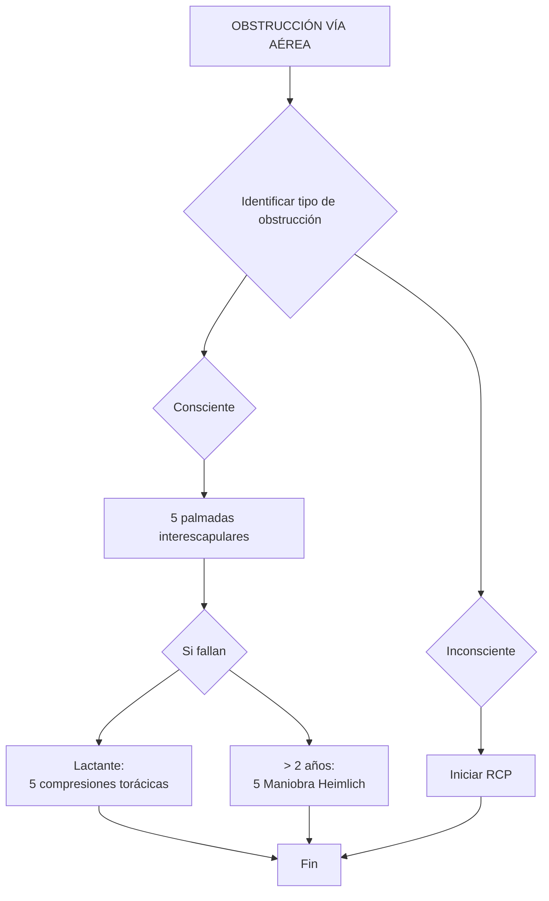

# Sanitario

El proceso inicial de atención a víctimas requiere priorizar la protección del interviniente y asegurar la seguridad del lugar antes de cualquier evaluación. En escenarios con múltiples víctimas, es fundamental determinar rápidamente si todos los afectados están conscientes y respiran antes de proceder con valoraciones secundarias. Para una clasificación detallada de la gravedad de los pacientes, se remite a la sección "Grandes emergencias y catástrofes" de la parte 2 del manual.

La valoración primaria tiene como objetivo identificar la gravedad del paciente y aplicar intervenciones rápidas para abordar riesgos vitales. Se emplea un algoritmo de evaluación rápida que comprende: A (Vía aérea), B (Respiración), C (Circulación), D (Evaluación de la función neurológica) y E (Exposición), garantizando una evaluación completa sin pasar por alto ninguna función vital. Un paciente se considera crítico si presenta alteraciones en cualquiera de los componentes ABC.

La primera acción al acercarse a la víctima es preguntar: "¿qué le ha pasado?". Una respuesta coherente con frases completas indica que:
*   La vía aérea es permeable.
*   La función respiratoria es adecuada para permitir el habla.
*   La perfusión cerebral y la función neurológica son razonables.

Si el paciente no responde, se inicia la valoración primaria.

**1.1. A - Vía aérea**

La permeabilidad de la vía aérea debe verificarse inicialmente.

| Estado de la vía aérea | Acciones |
| :---------------------- | :------- |
| **Abierta**             | - Respiración normal. <br> - Respiración ruidosa (posible obstrucción parcial; requiere apertura de vía aérea). |
| **Cerrada**             | - Apertura de vía aérea mediante maniobra frente-mentón. <br> - Elevación de la mandíbula. <br> - Extracción de objetos obstructivos. <br> - Aspiración de secreciones (sangre, saliva, etc.). <br> - Uso de cánula de Guedel. <br> - Uso de mascarilla laríngea. |

En casos de obstrucción de la vía aérea, ya sea parcial o total, se debe intentar desobstruirla. Para obtener más información sobre la secuencia de actuación en caso de sospecha de parada cardiorrespiratoria, consulte la sección correspondiente en esta misma parte del manual.

**Maniobras para la apertura de la vía aérea:**

*   **Sin sospecha de traumatismo (Maniobra frente-mentón):**
    1.  Con una mano sobre la frente, realice una suave hiperextensión de la cabeza.
    2.  Con los dedos índice y medio de la otra mano, eleve la mandíbula para abrir la vía aérea.

*   **Con sospecha de traumatismo cervical (Maniobra de elevación de la mandíbula):**
    1.  Evite la hiperextensión del cuello, manteniendo la cabeza en posición neutra.
    2.  Traccione la mandíbula hacia adelante, usando el pulgar de una mano dentro de la boca del paciente y la otra mano en la frente para evitar la hiperextensión cervical.

**Extracción de objetos y aspiración de secreciones:**

*   **Extracción de objetos:**
    *   Si el objeto es fácilmente visible y accesible, retírelo con los dedos con sumo cuidado para no introducirlo más.
    *   Evite el barrido a ciegas si el objeto no es visible.
    *   Utilice las maniobras específicas para la Obstrucción de la Vía Aérea por Cuerpo Extraño (OVACE). Para más detalles, consulte la sección "Obstrucción de la Vía Aérea por Cuerpo Extraño en adultos y niños" en este manual.

*   **Aspiración de secreciones:**
    *   Utilice un aspirador para eliminar secreciones bronquiales, saliva, sangre o contenido gástrico que obstruyan la vía aérea.
    *   Posicione al paciente con la cabeza ligeramente elevada para prevenir broncoaspiración por vómito. Si está inconsciente, colóquelo en la posición lateral de seguridad.
    *   Introduzca la sonda de aspiración (flexible o rígida tipo Yankauer) sin aplicar vacío.
    *   Conecte rápidamente el aspirador al vacío por un máximo de 5 segundos para facilitar la respiración.
    *   En niños, la presión negativa no debe exceder 100 mm de Hg.

**Colocación de la cánula de Guedel:**

*   Posicione la cabeza de la víctima en alineación neutra.
*   Mida la cánula desde el ángulo de la boca hasta el lóbulo de la oreja para seleccionar el tamaño correcto.
*   Abra la boca del paciente mediante la maniobra de avance de la mandíbula.
*   Introduzca la cánula con la concavidad hacia la parte superior de la cabeza hasta la mitad de su longitud.
*   Gire la cánula 180 grados para que se adapte a la anatomía de la cavidad oral.
*   La corona de la cánula debe apoyarse en la superficie externa de los dientes.

**Colocación de la mascarilla laríngea:**

*   Lubrique el extremo distal de la mascarilla, especialmente la parte posterior de las aberturas de ventilación.
*   Introduzca la mascarilla sosteniendo el tubo como un lápiz, con las aberturas hacia la lengua y deslizándola por el paladar.
*   Avance suavemente hasta que sienta resistencia.
*   Infle el balón con 20-40 ml de aire, lo que provocará un retroceso normal de la mascarilla.
*   Conecte el extremo a una bolsa autoinflable y confirme la elevación del tórax con cada insuflación.

Si, después de estas maniobras, la vía aérea se abre, el siguiente paso es evaluar la ventilación. En pacientes con sospecha de traumatismo, es crucial inmovilizar la columna cervical con un collarín y alinear la columna vertebral del paciente. Para más información, consulte el capítulo "Movilización e Inmovilización" en la sección de Urgencias Traumáticas y Grandes Emergencias.

**1.2. B - Ventilación**

El aporte adecuado de oxígeno a los pulmones y, por ende, a todas las células del cuerpo es vital para el mantenimiento de las constantes. Una dificultad respiratoria en pacientes conscientes se manifiesta rápidamente por la incapacidad de pronunciar una frase completa.

Para evaluar la respiración, se debe considerar:
*   La presencia de ruidos respiratorios, que pueden indicar una obstrucción parcial o total del flujo de aire.
*   La frecuencia respiratoria, según la siguiente clasificación:

| Frecuencia respiratoria | Denominación | Actuación |
| :---------------------- | :----------- | :-------- |
| Ausente                 | Apnea        | Iniciar RCP |
| < 12 respiraciones/min  | Bradipnea    | Lento     |
| 12-20 respiraciones/min | Eupnea       | Normal    |
| 20-30 respiraciones/min | Taquipnea    | Rápido    |
| > 30 respiraciones/min  | Taquipnea    | Muy rápido |

Además de la frecuencia, la calidad de la respiración puede evaluarse mediante la observación del movimiento torácico:
*   **Movimientos superficiales:** Indican respiración ineficaz.
*   **Movimientos muy profundos:** Acompañados de hundimiento costal, sugieren esfuerzo respiratorio.
*   **Movimientos asimétricos:** Apuntan a una alteración de la respiración si las dos partes del tórax no se mueven de manera coordinada.
*   **Heridas torácicas:** Si son profundas y "aspirantes", deben ocluirse con un apósito vaselinado, un plástico o papel de aluminio sellado por tres lados, dejando uno libre.

En pacientes inconscientes, la respiración puede iniciar rápida y superficialmente, para luego volverse profunda, forzada y jadeante; este patrón indica un estado grave que requiere traslado inmediato. Otro indicio de gravedad es la respiración con alternancia de ritmo y profundidad, con pausas apneicas de varios segundos, tras las cuales el paciente retoma un ciclo similar.

El pulsioxímetro es una herramienta para estimar la llegada de oxígeno a los tejidos periféricos. Si está disponible, se debe medir la saturación de oxígeno, procurando que sea superior al 90%. Un valor inferior a este umbral indica dificultad respiratoria.

**Actuaciones ante dificultad respiratoria:**
*   Coloque al paciente en una posición semisentada o con una inclinación de 30-45 grados si se requiere inmovilización de la columna vertebral.
*   Administre oxígeno a través de una mascarilla con reservorio a un flujo de 10-15 litros.
*   Si el paciente no mejora y su nivel de conciencia disminuye, es necesario colocar una cánula de Guedel y ventilar con una bolsa autoinflable (AMBU) conectada a una mascarilla facial.

**Técnica de ventilación con mascarilla facial y balón autoinflable:**
*   Coloque la mascarilla cubriendo boca y nariz de la víctima.
*   Sujete la mascarilla con una mano, posicionando los dedos tercero, cuarto y quinto alrededor de la mandíbula.
*   Con el pulgar, fije la parte superior de la mascarilla y con el índice la parte inferior, formando una "C".
*   Con la otra mano, aplique las ventilaciones utilizando el balón autoinflable.

En caso de que haya dos intervinientes, uno puede mantener la mascarilla mientras el otro realiza las ventilaciones.

**Técnica de ventilación con mascarilla laríngea:**
*   Colóquese por encima de la cabeza del paciente, estabilizando cabeza y cuello con las rodillas.
*   Una vez introducida la mascarilla laríngea, conecte el balón autoinflable y comience a ventilar.
*   Se debe ventilar al paciente a un ritmo de 15 respiraciones por minuto. Si el paciente no respira, se iniciarán las maniobras de RCP.

A continuación, se presenta un temario exhaustivo y original sobre intervenciones sanitarias en emergencias, desarrollado a partir de la información proporcionada.

### **Soporte Vital Básico en Adultos y Niños**

**1. Valoración Primaria y Secundaria del Paciente**

**1.1. Vía Aérea (A)**

Para asegurar la permeabilidad de la vía aérea en un paciente se pueden seguir los siguientes métodos:

*   **Apertura manual de la vía aérea:**
    *   **Maniobra de avance de la mandíbula:** Consiste en abrir la boca del paciente.
    *   **Introducción de la cánula de Guedel:** Se introduce la cánula con la parte cóncava hacia la parte superior de la cabeza, hasta la mitad. Luego, se gira 180 grados para que se adapte a la anatomía de la cavidad bucal. La parte externa de la cánula se apoya en la superficie dental.
    *   **Mascarilla Laríngea:**
        1.  Lubricar el extremo de la mascarilla que se introducirá en el paciente, específicamente la parte posterior a los orificios de ventilación.
        2.  Insertar la mascarilla sujetando el tubo como si fuera un lápiz, con los orificios orientados hacia la lengua y deslizándola por el paladar hasta que haga tope.
        3.  Inflar el balón de 20 a 40 ml, lo que provocará un retroceso normal de la mascarilla.
        4.  Conectar el extremo a una bolsa autoinflable y confirmar que el tórax se eleva con cada insuflación.

Una vez despejada la vía aérea, la atención se dirige a la evaluación de la ventilación.

*   **Consideración en pacientes traumatizados:** Si se sospecha de un traumatismo, es crucial inmovilizar la columna cervical con un collarín y alinear la columna vertebral del paciente.

**1.2. Ventilación (B)**

La adecuada llegada de oxígeno a los pulmones y, por consiguiente, al resto de las células y órganos del cuerpo, es esencial para el mantenimiento de las constantes vitales. La dificultad respiratoria en pacientes conscientes se manifiesta rápidamente por la incapacidad de pronunciar una frase completa.

Para evaluar la ventilación, se deben considerar:

*   **Ruidos respiratorios:** La presencia de ruidos durante la respiración puede indicar una obstrucción en el flujo de aire.
*   **Frecuencia respiratoria:**

    | Frecuencia Respiratoria | Interpretación           |
    | :---------------------- | :---------------------- |
    | Ausencia de respiración | Apnea                   |
    | Menos de 12 resp./min   | Bradipnea (Lento)       |
    | Entre 12-20 resp./min   | Eupnea (Normal)         |
    | Entre 20-30 resp./min   | Taquipnea (Rápido)      |
    | Más de 30 resp./min     | Taquipnea (Muy rápido) |

*   **Movimiento torácico:**
    *   **Superficiales:** Respiración ineficaz.
    *   **Muy profundos:** Indica esfuerzo respiratorio, a menudo con hundimiento costal.
    *   **Asimetría:** Movimiento desigual de ambos lados del tórax, indicando una alteración respiratoria.
*   **Heridas torácicas:** Si son profundas y "soplan", se deben ocluir con un apósito vaselinado, un plástico o papel de aluminio sellado por tres lados, dejando uno libre.
*   **En pacientes inconscientes:**
    *   Inicialmente, respiraciones rápidas y superficiales, que progresan a profundas, forzadas y jadeantes. Este patrón indica gravedad y necesidad de traslado urgente.
    *   Respiración con cambios de ritmo y profundidad, que puede cesar temporalmente (apnea) y luego reiniciarse de manera similar.
*   **Pulsioxímetro:** Si disponible, medir la saturación de oxígeno, buscando un valor superior al 90%. Un valor inferior sugiere dificultad respiratoria.

**Actuaciones ante dificultad respiratoria:**

*   **Posición:** Paciente semisentado o con una inclinación de 30-45° si la columna vertebral debe ser inmovilizada.
*   **Oxígeno:** Administrar oxígeno mediante una mascarilla con reservorio a un flujo de 10-15 litros.

**1.3. Circulación (C)**

La circulación sanguínea es fundamental para el transporte de oxígeno desde los pulmones a todas las células y órganos. Se deben vigilar:

*   **Hemorragias:** Controlarlas si están presentes.
*   **Pulso:**
*   **Color de la piel y mucosas:**

**1.3.1. El Pulso**

El pulso indica la actividad cardíaca y la suficiencia de la perfusión sanguínea. Un paciente que respira y habla normalmente tiene pulso. La presencia de pulso radial en un miembro no lesionado sugiere una tensión arterial aceptable. El pulso puede ser ausente o presente, y su intensidad puede ser fuerte o débil, indicando una posible hipotensión.

| Latidos del corazón (Frecuencia) | Interpretación                  |
| :------------------------------- | :----------------------------- |
| Menos de 60 latidos/minuto       | Bradicardia (lento)            |
| Entre 60-100 latidos/minuto      | Normal                         |
| Más de 100 latidos/minuto        | Taquicardia (rápido)           |

**1.3.2. El Color**

*   **Piel sonrosada:** Indica buena circulación.
*   **Piel pálida:** Sugiere disminución del flujo sanguíneo en la zona afectada.
*   **Piel azulada o cianótica:** Indica falta de oxígeno.

Para una valoración más precisa, especialmente en pieles con pigmentación variada, se observa el color de las mucosas, labios, encías y pulpejos de los dedos, ya que no están influenciados por la tonalidad de la piel.

**1.3.3. La Temperatura**

La hipotermia reduce la perfusión. La circulación inadecuada también puede causar una disminución de la temperatura tisular. Es vital evitar la pérdida de calor, retirando la ropa húmeda y abrigando al paciente.

*   **Mantas térmicas:** No generan calor, sino que previenen su pérdida. Se deben colocar sobre sábanas y mantas, con la parte plateada en contacto con el paciente, evitando zonas húmedas o frías.

**1.3.4. La Humedad**

La sudoración abundante puede indicar shock o una perfusión sanguínea insuficiente en órganos vitales.

**1.3.5. El Relleno Capilar**

Se evalúa presionando la uña y observando el tiempo que tarda en recuperar su color rosado. El valor normal es inferior a 2 segundos. Este valor puede verse afectado por el frío, ciertos fármacos o patologías preexistentes.

**1.3.6. Control de la Hemorragia**

El manejo de la hemorragia se realiza según sus características:

*   **Protección personal:** Usar guantes de látex o vinilo.
*   **Presión directa:** Aplicar gasas o compresas sobre la herida sangrante.
*   **Torniquete:** Si la hemorragia es pulsátil y se localiza en extremidades, se puede aplicar un torniquete por encima de la lesión, aflojándolo cada 10 minutos y volviéndolo a colocar.

En caso de sospecha de sangrado interno en tórax o abdomen, el traslado a un centro quirúrgico debe ser lo más rápido posible.

La falta de control de una hemorragia aumenta el riesgo de shock hipovolémico. El shock se produce cuando el oxígeno y los nutrientes no llegan a las células, y los productos de desecho no se eliminan, lo que puede llevar a la muerte celular.

**Signos tempranos de shock incluyen:**

*   Taquicardia, aumento de la frecuencia respiratoria, palidez y piel fría.
*   Alteraciones del estado mental: ansiedad, agitación, temblor, sed, cansancio. En fases avanzadas, apatía, somnolencia, confusión y coma.
*   Pulso débil y retraso en el llenado capilar.
*   Sudoración.

Si el pulso carotídeo está ausente, el paciente se encuentra en parada cardiorrespiratoria. Un pulso anormal (rápido o lento) puede indicar shock, pero también puede ser influenciado por factores emocionales o fisiológicos.

**1.4. Valoración Neurológica (D)**

Evaluar la función cerebral permite estimar el aporte de oxígeno al cerebro. Los pacientes combativos, agitados o poco colaboradores suelen presentar hipoxia. Es fundamental investigar la causa de esta agitación; si no hay una razón aparente, se considera una alteración neurológica.

Se busca determinar:

*   Si hubo pérdida de conciencia y su duración.
*   Consumo de sustancias tóxicas.
*   Problemas previos que puedan causar la pérdida de conciencia.
*   Diagnóstico de enfermedad psiquiátrica.
*   Capacidad de mover todas las extremidades.

Para evaluar el nivel de conciencia, se utiliza el sistema AVDNR:

| Nivel de Conciencia | Descripción                                                                |
| :------------------ | :------------------------------------------------------------------------- |
| **A**lerta          | Paciente despierto, atento y orientado.                                    |
| **V**erbal          | Responde solo a estímulos verbales (puede estar confuso o con preguntas). |
| **D**oloroso        | Responde solo a estímulos dolorosos.                                      |
| **N**o **R**esponde | No hay respuesta a ningún estímulo.                                        |

**Acciones ante una alteración neurológica:**

*   **Paciente consciente con alteración de la conciencia:** Administrar oxígeno e investigar la causa.
*   **Protección:** Asegurar que el paciente no se autolesione.
*   **Posición de la cabeza:** Mantenerla en línea media.
*   **Paciente inconsciente, respira y móvil:** Colocarlo en posición lateral de seguridad.

**1.5. Exposición (E)**

Para detectar todas las lesiones, se debe retirar la ropa del paciente, siguiendo estas precauciones:

*   **Espacio cerrado:** Realizar la exposición en un lugar cerrado para evitar la pérdida de calor (ej. en la ambulancia).
*   **Cubrir:** Volver a cubrir al paciente lo antes posible tras la evaluación.

**2. Valoración Secundaria**

Una vez controlados los problemas vitales, se procede a la valoración secundaria. Este examen detallado busca identificar lesiones o problemas no detectados en la valoración primaria.

*   Puede realizarse durante el traslado al hospital, sin demorar la evacuación.
*   **Paciente consciente:** Se utiliza la regla mnemotécnica OPUMA para recabar información:

    | Letra | Significado                       |
    | :---- | :-------------------------------- |
    | **O** | **O**currido (¿Qué le ha ocurrido? ¿Desde cuándo tiene?) |
    | **P** | **P**ersonales (Antecedentes personales) |
    | **U** | **Ú**ltima comida (¿Cuándo ha sido la última comida? ¿Por última vez?) |
    | **M** | **M**edicamentos (¿Toma medicamentos?) |
    | **A** | **A**lergias (¿Alergias? ¿Patologías previas?) |

*   **Reevaluación de constantes vitales:** Cada 5 minutos se deben reevaluar el pulso, la frecuencia respiratoria, el color de la piel, la temperatura y la movilidad y sensibilidad de las extremidades.

**2.1. Cabeza y Cara**

**a) Atención a:**

*   **Deformidades y asimetrías:** De los huesos craneales y faciales.
*   **Hematomas:** Alrededor de los ojos (ojos de mapache) o detrás de las orejas (signo de Battle) pueden indicar una fractura de la base del cráneo.
*   **Debilidad o ausencia de movimientos faciales:** Puede ser un indicio de lesión cerebral.
*   **Contusiones, erosiones, heridas.**
*   **Hemorragias o salida de líquido claro por nariz u oídos:** Pueden indicar lesiones internas en la cabeza.
*   **Anomalías:** En párpados, pabellones auriculares, mandíbula, boca, etc.
*   **Pupilas:** Comprobar tamaño, simetría y reacción a la luz; diferencias o tamaños anormales pueden indicar lesión cerebral.

**b) Actuación:**

*   **Monitorización:** Vigilar ABC.
*   **Traslado:** Preferiblemente en colchón de vacío.
*   **Alineación:** Mantener el cuerpo alineado.
*   **Posición:** Paciente en una inclinación de 30° con la cabeza elevada.
*   **Rapidez:** Traslado lo más rápido posible a un centro sanitario.

**2.2. Cuello**

**a) Atención a:**

*   **Venas del cuello dilatadas:** Indica circulación anómala.
*   **Esfuerzo excesivo de la musculatura del cuello:** Durante la respiración, sugiere dificultad respiratoria.
*   **Heridas.**
*   **Deformidades vertebrales con dolor a la palpación:** Sospecha de lesión de la columna cervical.
*   **Edema o inflamación en el cuello:** Puede obstruir la vía respiratoria.
*   **Crepitancia:** Sensación de burbujas bajo la piel a la palpación en la pared torácica, indicando fuga de aire.

### PARTE 1: Valoración Primaria y Secundaria del Paciente

**2.6. Espalda (Continuación)**

a) **Aspectos a Observar:**
    *   Contusiones, erosiones, heridas, hematomas, entre otros.

b) **Procedimiento:**
    *   Vigilar el estado general del paciente (ABC).
    *   Movilizar al paciente con extrema precaución.
    *   Considerar el traslado utilizando un colchón de vacío.

**2.7. Extremidades**

a) **Aspectos a Observar:**
    *   Capacidad de movimiento espontáneo de todas las extremidades.
    *   Fuerza de las extremidades y su simetría.
    *   Sensibilidad en las extremidades.
    *   Circulación (evaluando el color y la temperatura de la piel).
    *   Presencia de pulsos en las extremidades.
    *   Heridas.
    *   Hematomas.
    *   Edemas y deformidades.
    *   Dolor.

b) **Procedimiento:**
    *   Vigilar el estado general del paciente (ABC).
    *   Movilizar al paciente con extrema precaución.
    *   Considerar el traslado utilizando un colchón de vacío.

---

### PARTE 1: Soporte Vital Básico en Adultos y Niños

**1. Introducción**

La **parada cardiorrespiratoria (PCR)** se define como una interrupción repentina e imprevista, con potencial de reversión, de las funciones respiratoria y circulatoria espontáneas.

La **reanimación cardiopulmonar (RCP)** comprende un conjunto de maniobras destinadas a revertir la PCR. Su objetivo es restaurar la función respiratoria y cardíaca para asegurar una perfusión sanguínea adecuada a órganos vitales como el cerebro, corazón y riñones.

El **soporte vital básico (SVB)** abarca las maniobras de RCP esenciales para garantizar la función ventilatoria y circulatoria, cruciales para la supervivencia del paciente.

La **Cadena de Supervivencia** es una secuencia de acciones que deben activarse ante una parada cardiorrespiratoria:
1.  Reconocimiento de la PCR y alerta temprana a los servicios de emergencias (es crucial no colgar el teléfono hasta haber proporcionado todos los detalles del incidente).
2.  Inicio de las maniobras de RCP.
3.  Desfibrilación precoz.
4.  Traslado urgente al hospital.
5.  Cuidados post-resucitación.

**2. Secuencia de Actuación ante Sospecha de Parada Cardiorrespiratoria**

Frente a la sospecha de una PCR, se deben seguir los siguientes pasos:
1.  **Asegurar la escena:** Verificar que no existan riesgos para la víctima ni para el interviniente.
2.  **Comprobar la consciencia:** Evaluar la respuesta del paciente.
3.  **Abrir la vía aérea:** Garantizar la permeabilidad.
4.  **Comprobar la respiración:** Determinar si es efectiva.
5.  **Solicitar ayuda:** Llamar al 112 y conseguir un Desfibrilador Externo Automático (DEA).
6.  **Iniciar RCP:** Comenzar las compresiones torácicas y ventilaciones.

**2.1. Asegurar la Escena**

Es fundamental operar en un entorno seguro, evaluando que no haya riesgos para el afectado ni para el personal de intervención.

**2.2. Comprobar Consciencia**

Para evaluar la consciencia, sacudir suavemente los hombros del paciente y preguntar: "¿Está usted bien?".

| Si responde:              | Si no responde:            |
| :------------------------ | :------------------------- |
| Paciente consciente       | Paciente inconsciente      |
| *   Preguntar qué le ha ocurrido. | *   Continuar con el algoritmo de actuación. |
| *   Asegurarse de si necesita ayuda. |                            |

**2.3. Abrir Vía Aérea**

En un paciente inconsciente, existe la posibilidad de obstrucción de la vía aérea debido a la relajación del tono muscular, lo que provoca que la lengua caiga hacia atrás y bloquee la respiración.

a) **Si no se sospecha de traumatismo:**
    *   **Maniobra frente-mentón:** Inclinar suavemente la cabeza hacia atrás con una mano en la frente, mientras con la otra mano se eleva la mandíbula utilizando los dedos índice y medio para despejar la vía aérea.

b) **Si se sospecha de traumatismo con posible lesión cervical:**
    *   Es crucial evitar la hiperextensión del cuello y mantener la cabeza en posición neutra. Se procederá con la siguiente maniobra:
    *   **Avance de la mandíbula:** Traccionar la mandíbula hacia adelante, colocando el dedo pulgar de una mano dentro de la boca del paciente y la otra mano sobre su frente, evitando la hiperextensión del cuello.

El **paro cardiorrespiratorio (PCR)** se define como la interrupción súbita, inesperada y potencialmente reversible de las funciones respiratoria y circulatoria espontáneas. La **reanimación cardiopulmonar (RCP)** comprende un conjunto de maniobras destinadas a revertir el PCR, restableciendo las funciones respiratoria y cardíaca para asegurar una perfusión sanguínea adecuada a órganos vitales como el cerebro, corazón y riñones. El **soporte vital básico (SVB)** engloba las maniobras de RCP esenciales para mantener la función ventilatoria y circulatoria, siendo fundamentales para la supervivencia del paciente.

La **Cadena de Supervivencia** representa la secuencia de acciones que deben activarse ante un PCR:
1.  Identificación del PCR y aviso a los servicios de emergencia (SEM). Es crucial no finalizar la llamada hasta haber proporcionado todos los detalles sobre la ubicación del incidente.
2.  Inicio de las maniobras de RCP.
3.  Desfibrilación temprana.
4.  Traslado urgente al hospital.
5.  Cuidados post-reanimación.

**Secuencia de actuación ante sospecha de PCR:**
Frente a la sospecha de un PCR, se deben seguir los siguientes pasos:

1.  **Asegurar el lugar:** Evaluar el entorno para garantizar la seguridad tanto de la víctima como del interviniente.
2.  **Verificar la consciencia:** Agitar suavemente los hombros del paciente y preguntar "¿Está usted bien?".
    *   Si el paciente responde: se considera consciente. Se le preguntará qué ha sucedido y si necesita ayuda.
    *   Si el paciente no responde: se considera inconsciente y se procederá con el algoritmo de actuación.
3.  **Abrir la vía aérea:** En un paciente inconsciente, la obstrucción de la vía aérea es común debido a la relajación del tono muscular y la caída de la lengua hacia atrás.
    *   **Sin sospecha de traumatismo:** Realizar la **maniobra frente-mentón**. Consiste en hiperextender suavemente la cabeza con una mano en la frente y elevar la mandíbula con los dedos índice y medio de la otra mano para abrir la vía aérea.
    *   **Con sospecha de traumatismo cervical:** Se debe evitar la hiperextensión del cuello, manteniendo la cabeza en posición neutra. Se realizará la **maniobra de elevación de la mandíbula**, traccionando la mandíbula hacia adelante con el pulgar de una mano dentro de la boca del paciente y la otra mano sobre la frente, impidiendo la hiperextensión cervical.

**Continuación de apertura de vía aérea (si maniobra frente-mentón no abre la vía aérea):**

*   **Triple maniobra modificada:** Se colocan ambas manos bajo los ángulos de la mandíbula, empujándola hacia arriba y adelante, manteniendo la cabeza sin hiperextensión.

**Extracción de objetos de la vía aérea:**

*   Si el objeto es fácilmente accesible, se extraerá con los dedos, con precaución de no introducirlo más.
*   Si el objeto no es visible, no se debe realizar un barrido a ciegas.
*   Se utilizarán las maniobras específicas para la Obstrucción de la Vía Aérea por Cuerpo Extraño (OVACE).

**Aspiración de secreciones:**

*   Se empleará un aspirador, que genera presión negativa para extraer secreciones bronquiales, saliva, sangre o contenido gástrico de boca, nariz y laringe, despejando la vía aérea.
*   **Instrucciones de uso:**
    *   Colocar al paciente con la cabeza ligeramente elevada para evitar broncoaspiración por estimulación del vómito. Si el paciente está inconsciente, se colocará en la posición lateral de seguridad.
    *   Introducir la sonda de aspiración (flexible o rígida tipo yankauer) sin aspirar, conectando el aspirador rápidamente y aplicando vacío por un máximo de 5 segundos para permitir la respiración. En niños, la presión negativa no debe exceder los 100 mm de Hg.

**Cánula de Guedel:**
Para su inserción:

*   Colocar la cabeza de la víctima en posición neutra.
*   Medir el tamaño adecuado de la cánula (equivalente a la distancia desde el ángulo de la boca hasta el lóbulo de la oreja).
*   Abrir la boca con la maniobra de avance de la mandíbula.
*   Introducir la cánula hasta la mitad, con la parte cóncava hacia arriba, y luego girar 180º para que se adapte a la anatomía de la cavidad.
*   La corona de la cánula debe apoyarse en la superficie externa de los dientes.

**Mascarilla laríngea:**
Para su colocación:

*   Lubricar el extremo que se introduce al paciente, en la parte posterior a los agujeros de ventilación.
*   Introducir la mascarilla, sujetando el tubo como un lápiz, con los agujeros hacia la lengua y deslizándola por el paladar hasta hacer tope.
*   Inflar el balón con 20-40 ml (la mascarilla retrocederá normalmente).
*   Conectar el extremo a una bolsa autoinflable y verificar que el tórax se eleva con cada insuflación.

Si tras estas maniobras la vía aérea está permeable, la atención se centrará en la ventilación.
Si el paciente ha sufrido un traumatismo, es prioritario inmovilizar la columna cervical con un collarín y alinear la columna vertebral.

**2.4. Comprobar respiración:**
Esta evaluación debe ser rápida, no excediendo los 10 segundos. Se realiza acercando la cara a la del paciente y observando el tórax.

*   **Identificación de la respiración agónica (gasping):** No debe confundirse con la respiración normal. Ocurre inmediatamente después de un paro cardíaco en más del 40% de los casos. La víctima apenas respira, con dificultad o ruidosamente, o "boquea". Debe considerarse un signo de paro cardíaco.
*   **Evaluación de la respiración:**
    *   **Ver:** Movimiento del tórax que indique entrada y salida de aire.
    *   **Oír:** Ruidos respiratorios.
    *   **Sentir:** Exhalación de aire espirado en la cara.
*   Si no hay ninguno de estos signos, se deben iniciar las maniobras de RCP.

**Situaciones post-valoración de la respiración:**

*   **Paciente inconsciente que respira:** Se colocará en **posición lateral de seguridad**.
    *   **Técnica de posición lateral de seguridad:**
        1.  Elevar el brazo del paciente más cercano al reanimador.
        2.  Flexionar el brazo contralateral, colocando la palma de la mano contra la cara del paciente.
        3.  Flexionar la pierna contralateral. Sujetar la pierna con la mano caudal y el hombro del paciente con la otra mano, girando a la posición lateral.
        4.  En esta posición, se controlarán las constantes vitales y se esperará la llegada de los servicios de emergencia.
    *   Esta maniobra reduce al mínimo el movimiento de la víctima, mantiene la alineación corporal, evita la obstrucción de la vía aérea y facilita el drenaje de fluidos en caso de vómitos.
*   **Paciente inconsciente que no respira:** Iniciar RCP.

**2.5. Iniciar RCP (Reanimación Cardiopulmonar):**
Consiste en la combinación de 30 compresiones cardíacas externas y 2 ventilaciones artificiales.

*   **Técnica de masaje cardíaco:**
    1.  Colocar el talón de una mano en el centro del tórax (línea intermamaria).
    2.  Colocar la otra mano encima, entrelazando los dedos.
    3.  Comprimir el tórax:
        *   Frecuencia: 100-120 compresiones por minuto.
        *   Profundidad: 5 cm.
        *   Tiempo de compresión y relajación equitativo.
        *   Minimizar las interrupciones.
*   **Técnica de ventilación:** Se puede realizar mediante:
    *   Boca a boca.
    *   Boca-nariz.
    *   A través del estoma en pacientes con traqueotomía.
    *   Siempre utilizando sistemas de barrera y protección.

**Realizar dos ventilaciones:**

*   Pinzar la nariz.
*   Realizar una inspiración normal.
*   Sellar la boca con los labios y soplar, verificando que el pecho se eleva durante un segundo.
*   Separar los labios y permitir que el pecho descienda.
*   Repetir.

La forma óptima de ventilar durante las maniobras de RCP es con un balón autoinflable con bolsa reservorio (AMBU), conectado a una fuente de oxígeno a 15 litros, y preferiblemente tras la inserción de una cánula de Guedel. Si hay dos intervinientes, uno puede sujetar la mascarilla mientras el otro aplica las ventilaciones.

**Algoritmo RCP básica en adultos:**

1.  **Comprobar la seguridad en la zona y de las personas.**
2.  **Hablar en voz alta, sacudir suavemente:**
    *   **Comprobar la inconsciencia:**
        *   **Si responde:** Preguntar qué le pasa y si necesita ayuda.
        *   **Si no responde:** Gritar pidiendo ayuda.
3.  **Abrir la vía aérea:**
    *   Considerar maniobra frente-mentón o tracción/elevación mandibular si se sospecha lesión cervical.
    *   **Comprobar respiración efectiva:**
        *   **Si no respira o está boqueando (gasping):** Pedir ayuda, llamar al 112, conseguir un DEA.
        *   **Si no respira, jadea o boquea:** No presenta signos vitales.

**A partir de "No presenta signos vitales" (durante 1 minuto de RCP 30:2):**

*   **Lactante (<1 año):**
    *   5 ventilaciones de rescate.
    *   Compresiones: 1/3 del diámetro anteroposterior del tórax, 4 cm, centro del tórax, con compresión anteroposterior o con dos dedos.
    *   Al menos 100 compresiones/minuto.
    *   Minimizar las interrupciones entre compresiones torácicas.
*   **Niño (de 1 año a la pubertad):**
    *   5 ventilaciones de rescate.
    *   Compresiones: 1/3 del diámetro anteroposterior del tórax, 4 cm, centro del tórax, con una o dos manos.
    *   Al menos 100 compresiones/minuto.
    *   Minimizar las interrupciones entre compresiones torácicas.

**Continuar RCP hasta que llegue el DEA, el Soporte Vital Avanzado (SVA) o la víctima se recupere.**
Se recomienda cambiar de reanimador cada 2 minutos.
Si no se puede o no se quiere ventilar, continuar solo con las compresiones.

**3. OVACE - Obstrucción de la Vía Aérea por Cuerpo Extraño en el adulto:**

*   **Paciente consciente y capaz de toser:**
    *   Animar a seguir tosiendo y observar la evolución.
    *   **No** dar golpes en la espalda, ya que podría incrustar el cuerpo extraño más profundamente.
*   **Paciente consciente pero incapaz de toser:**
    *   Realizar **5 palmadas interescapulares** con el talón de la mano, inclinando al paciente hacia adelante.
    *   Si las palmadas no eliminan la obstrucción, realizar **5 compresiones abdominales** (maniobra de Heimlich): rodear al paciente por detrás, colocar una mano sobre la otra en forma de puño justo debajo del esternón, y realizar una compresión hacia adentro y hacia arriba.
*   **Paciente inconsciente o en PCR:** Iniciar RCP.

**Algoritmo OVACE adulto (resumen de actuación):**

*   **Obstrucción grave (tos inefectiva):**
    *   Si el paciente está inconsciente, iniciar RCP.
*   **Obstrucción leve (tos efectiva):**
    *   Animar a toser y continuar evaluando la efectividad de la tos y la respiración.

**4. Soporte Vital Básico pediátrico:**
La principal causa de PCR en niños es de origen respiratorio.

*   **Cadena de Supervivencia Pediátrica (elementos específicos):**
    1.  Reconocer PCR y alertar SEM.
    2.  Iniciar RCP.
    3.  Desfibrilación precoz.
    4.  Uso de asientos de seguridad para niños.
    5.  Iniciar maniobras de RCP.
    6.  Avisar al servicio de emergencias.
    7.  Soporte vital avanzado.
    8.  Cuidados post-resucitación.


-

## 3. Obstrucción de la Vía Aérea por Cuerpo Extraño (OVACE) en Adultos

Cuando un paciente adulto presenta una Obstrucción de la Vía Aérea por Cuerpo Extraño (OVACE), se debe proceder a una evaluación y actuación rápida siguiendo una secuencia de pasos:

*   **Paciente consciente con tos efectiva:** Se le debe animar a continuar tosiendo y se observará su evolución. Es crucial **no aplicar golpes en la espalda**, ya que esto podría agravar la situación desplazando el cuerpo extraño más profundamente.
*   **Paciente consciente con tos inefectiva:** Se realizarán las siguientes maniobras:
    1.  **Cinco palmadas interescapulares:** Aplicar con el talón de la mano entre los omóplatos del paciente, inclinándolo previamente hacia delante.
    2.  **Cinco compresiones abdominales (Maniobra de Heimlich):** Si las palmadas interescapulares no logran desobstruir la vía aérea, rodear al paciente por detrás, colocar una mano cerrada en forma de puño justo debajo del esternón y la otra mano sobre ella. Realizar compresiones rápidas y firmes hacia adentro y hacia arriba.
*   **Paciente inconsciente o en Parada Cardiorrespiratoria (PCR):** Se iniciarán de inmediato las maniobras de Reanimación Cardiopulmonar (RCP).

A continuación se detalla el algoritmo para la actuación en OVACE en adultos:

### Algoritmo de Actuación ante Obstrucción de la Vía Aérea por Cuerpo Extraño (OVACE) en Adultos

```mermaid
graph TD
    A[OBSTRUCCIÓN VÍA AÉREA] --> B{Identificar tipo de obstrucción}
    B --> C{Obstrucción grave<br>(tos inefectiva)}
    B --> D{Obstrucción leve<br>(tos efectiva)}
    C --> E{Paciente inconsciente}
    C --> F{Paciente consciente}
    E --> G[Iniciar RCP]
    F --> H[5 palmadas interescapulares]
    F --> I[5 compresiones abdominales<br>(Maniobra de Heimlich)]
    D --> J[Anime a toser y continúe evaluando la efectividad de la tos y respiración]
    G --> A_END[Fin (si se resuelve)]
    I --> A_END
    J --> A_END
    G --> B
    I --> B
    J --> B
```

## 4. Soporte Vital Básico Pediátrico

La principal causa de parada cardiorrespiratoria (PCR) en niños es de origen respiratorio.

Los elementos fundamentales de la cadena de supervivencia pediátrica son:

1.  Reconocer la PCR y alertar a los servicios de emergencias.
2.  Iniciar las maniobras de Reanimación Cardiopulmonar (RCP).
3.  Proporcionar desfibrilación precoz.
4.  Utilizar asientos de seguridad adecuados para niños.
5.  Iniciar las maniobras de Reanimación Cardiopulmonar (RCP) (repetido en el texto original).
6.  Avisar al servicio de emergencias (repetido en el texto original).
7.  Aplicar Soporte Vital Avanzado.
8.  Proporcionar cuidados post-resucitación.

**Nota importante:** Es crucial no finalizar la llamada a los servicios de emergencias hasta que se hayan proporcionado todos los datos relevantes sobre la ubicación del incidente.

## Algoritmo de Reanimación Cardiopulmonar (RCP) Básica en Niños

El siguiente algoritmo detalla la secuencia de actuación para RCP básica en lactantes y niños:

```mermaid
graph TD
    A[COMPRUEBE LA SEGURIDAD<br>EN LA ZONA Y DE PERSONAS] --> B[COMPRUEBE LA<br>INCONSCIENCIA]
    B --> C{GRITE PIDIENDO AYUDA}
    C --> D[HABLARLE EN VOZ ALTA<br>ESTIMULAR<br>(Lactante)]
    C --> E[HABLARLE EN VOZ ALTA<br>SACUDIRLE<br>PELLIZCARLE<br>(Niño)]

    D --> F[a) MANIOBRA FRENTE MENTÓN SIN HIPEREXTENSIÓN<br>b) TRACCIÓN O ELEVACIÓN MANDIBULAR]
    E --> F

    F --> G[ABRIR LA VÍA AÉREA]
    G --> H[COMPROBAR RESPIRACIÓN<br>EFECTIVA]
    H --> I{NO RESPIRA JADEA O BOQUEA}
    H --> J{NO PRESENTA SIGNOS VITALES}

    I --> K[PIDA AYUDA<br>LLAME AL 112<br>CONSIGA UN DEA]
    J --> K

    K --> L[5 VENTILACIONES DE<br>RESCATE]
    L --> M[RCP 30:2 DURANTE 1 MIN]

    M --> N[CONTINUAR RCP<br>30:2 (UN REANIMADOR)<br>15:2 (DOS REANIMADORES)]

    N --> O{SI NO QUIERE O NO<br>PUEDE VENTILAR,<br>SIGA CON LAS<br>COMPRESIONES}

    O --> P[HASTA QUE LLEGUE<br>EL DEA, EL SVA O<br>LA VÍCTIMA SE<br>RECUPERE]

    P --> Q[MINIMIZAR LAS INTERRUPCIONES<br>ENTRE COMPRESIONES TORÁCICAS]

    M --> R[1/3 DEL DIÁMETRO AP DEL TÓRAX<br>4CM CENTRO DEL TÓRAX<br>(Lactante)]
    M --> S[1/3 DEL DIÁMETRO AP DEL TÓRAX<br>4CM CENTRO DEL TÓRAX<br>(Niño)]

    R --> T[COMPRESIÓN ANTEROPOSTERIOR<br>O CON DOS DEDOS]
    S --> U[COMPRESIÓN CON<br>UNA O DOS MANOS]

    T --> N
    U --> N

    N --> V[Al menos 100<br>compresiones /minuto]
    V --> P
    V --> Q
```

## 5. Técnicas de Ventilación y Masaje Cardíaco en Lactantes

La técnica de ventilación para lactantes se efectúa mediante la maniobra boca-nariz.

El masaje cardíaco se aplica de la siguiente manera, según la edad:

*   **Recién nacidos:** Las compresiones se realizan abarcando el diámetro antero-posterior del tórax, utilizando los dos dedos pulgares en la mitad del esternón.
*   **Niños menores de 1 año:** Las compresiones cardíacas se efectúan con dos dedos en la mitad inferior del esternón, deprimiendo el tórax un tercio de su diámetro. Esto equivale aproximadamente a 4 cm para lactantes y 5 cm para niños.
*   **Niños mayores de 1 año:** Las compresiones cardíacas se realizan con una o dos manos, según sea necesario para alcanzar una profundidad adecuada.

## 6. Obstrucción de la Vía Aérea por Cuerpo Extraño (OVACE) en el Niño

El siguiente algoritmo describe la actuación en casos de OVACE en niños:

### Algoritmo de Actuación ante Obstrucción de la Vía Aérea por Cuerpo Extraño (OVACE) en Niños



## 7. Desfibrilador Externo Automático (DEA)

En la Parada Cardiorrespiratoria (PCR) del adulto, es fundamental para la supervivencia del paciente disponer y aplicar un tratamiento eléctrico precoz. Una vez que el Desfibrilador Externo Automático (DEA) esté disponible, se deben seguir estos pasos:

Colocar el DEA en la cabecera del paciente. El dispositivo analizará el ritmo cardíaco y proporcionará las instrucciones necesarias en cada momento.

1.  **Colocación de Electrodos:** Los electrodos se sitúan en el pecho desnudo de la víctima: uno debajo de la clavícula derecha y el otro en el costado izquierdo.
2.  **Análisis del Ritmo:** Durante el análisis del ritmo, es crucial que nadie toque al paciente. Los ritmos cardíacos considerados desfibrilables son la Fibrilación Ventricular (FV) y la Taquicardia Ventricular Sin Pulso (TVSP).
3.  **Administración de la Descarga:** Es imperativo que todos se mantengan alejados del paciente. Asegurarse de que nadie está en contacto con la víctima y, a continuación, aplicar la descarga si el DEA lo indica.
4.  **Reinicio de RCP:** Después de la descarga, se debe reiniciar la Reanimación Cardiopulmonar (RCP) con una secuencia de 30 compresiones y 2 ventilaciones (30:2) durante 2 minutos, siguiendo las indicaciones del DEA. Posteriormente, se evaluará el pulso y se registrará la actividad del DEA.
5.  **Ritmos no Desfibrilables:** Si el DEA informa que el ritmo no es desfibrilable, se continuará con las maniobras de RCP.

### Parte 1: Soporte Vital
#### Capítulo 2: Soporte Vital Básico en Adultos y Niños

**9. Soporte Vital Básico (SVB) en Situaciones Especiales**

Todas las situaciones de parada cardiorrespiratoria (PCR) deben gestionarse de acuerdo con el algoritmo de Reanimación Cardiopulmonar (RCP) vigente. Sin embargo, algunas circunstancias especiales requieren acciones adicionales específicas debido a sus características.

**9.1. SVB en Pacientes Embarazadas**

En una PCR de una mujer gestante, la actuación tiene un doble impacto, ya que involucra dos vidas. La intervención debe ser rápida y organizada hasta la llegada de los servicios de emergencias médicas.

**9.1.1. Adaptaciones en el SVB para Embarazadas**

A partir de la **semana 20 de gestación**, el crecimiento uterino puede comprimir la vena cava inferior y la aorta, lo que afecta el retorno venoso y el gasto cardíaco. Por ello, se realizarán las siguientes modificaciones:
*   **Desplazamiento manual del abdomen:** Mover el abdomen de la embarazada hacia la izquierda para aliviar la compresión de la vena cava.
*   **Posicionamiento de la paciente:** Colocar a la paciente en decúbito lateral izquierdo, con una inclinación de **15º-20º** respecto al suelo.
*   **Obstrucción de la vía aérea por cuerpo extraño (OVACE):** En estados avanzados de gestación, la maniobra de Heimlich no debe realizarse. En su lugar, se aplicarán **5 compresiones torácicas** en la parte media del esternón.
*   **Ventilación:** El riesgo de hipoxia (falta de oxígeno) es más elevado en embarazadas. Por lo tanto, el soporte ventilatorio con **oxígeno al 100%** debe iniciarse muy rápidamente, utilizando una mascarilla y un resucitador manual (AMBÚ) con bolsa reservorio conectado a una fuente de oxígeno con un flujo máximo de **15 litros**.
*   **Compresiones torácicas:** Las manos para el masaje cardíaco deben situarse en la mitad del esternón, debido a la elevación del diafragma por el útero.
*   **Desfibrilación:** Se llevará a cabo siguiendo las recomendaciones actuales para el Desfibrilador Externo Automático (DEA), ya que no hay evidencia de que las descargas eléctricas causen efectos adversos en el corazón del feto.

Ante una PCR en una gestante, siempre debe considerarse la realización de una **cesárea de emergencia** por parte de los equipos sanitarios en los primeros **5 minutos**. La extracción rápida del feto aumenta la probabilidad de supervivencia tanto de la madre como del feto, si este último es viable (a partir de las **24-25 semanas de gestación**).

**9.2. SVB en Pacientes con Hipotermia**

La hipotermia confiere protección al cerebro y a otros órganos vitales al mejorar la tolerancia a la hipoxia. No obstante, evaluar una PCR en un paciente hipotérmico puede ser complicado, ya que el pulso puede ser lento, débil e irregular, y la tensión arterial (TA) indetectable.

*   Es fundamental recordar que la muerte por PCR en un paciente hipotérmico no se confirmará hasta que el paciente haya sido recalentado o los intentos de elevar su temperatura corporal hayan fallado, requiriendo, por lo tanto, una **RCP prolongada** en estas circunstancias.

**9.2.1. Adaptaciones en el SVB para Pacientes Hipotérmicos**
*   **Vía aérea y respiración:** Abrir la vía aérea y verificar la respiración. Si no respira, ventilar con oxígeno a alta concentración. En entornos sanitarios, se recomienda oxígeno caliente y humidificado.
*   **Pulso:** Buscar el pulso en la carótida. Si es posible, aplicar rápidamente el DEA para identificar el ritmo cardíaco. Si no se detectan signos de actividad cardíaca, iniciar de inmediato las compresiones torácicas.
*   **RCP:** Realizar RCP con una relación de **30 compresiones por 2 ventilaciones**, similar a un paciente normotérmico, pero de forma más prolongada.
*   **Calentamiento:** Iniciar maniobras de calentamiento del paciente (utilizando mantas, fuentes de calor, manta térmica) mientras se espera la llegada de los servicios sanitarios.
    *   Para más detalles sobre las maniobras de calentamiento, consultar la sección "Patología por calor y frío" en la Parte 3 de este manual.
*   La hipotermia puede inducir arritmias, como la **fibrilación ventricular (FV)**, por lo que es esencial monitorizar al paciente con un DEA lo antes posible.

**9.3. SVB en Pacientes con Hipertermia**

El riesgo de daño cerebral se incrementa por cada grado de temperatura superior a **37 ºC**. Ante un paciente con hipertermia que sufre una PCR, se debe iniciar la RCP básica y avanzada estándar, junto con medidas de enfriamiento del paciente.
*   Para más detalles sobre las maniobras de enfriamiento, consultar la sección "Patología por calor y frío" en la Parte 3 de este manual.
*   No hay datos definitivos sobre el impacto de la hipertermia en el umbral de desfibrilación, por lo que se seguirán las indicaciones del DEA.
*   Los tratamientos intravenosos son más efectivos para este proceso, pero deben ser administrados exclusivamente por personal sanitario.

**9.4. SVB en Ahogados**

La complicación más grave y perjudicial en un ahogado es la falta de oxígeno (hipoxia). La duración de esta hipoxia es el factor pronóstico más importante para la evolución del paciente y las posibles secuelas.

**9.4.1. Adaptaciones en el SVB para Pacientes Ahogados**
*   **Rescate del agua:** Retirar a la víctima del agua lo antes posible para iniciar las maniobras de RCP, minimizando los riesgos tanto para los rescatadores como para la víctima.
*   **Inmovilización cervical:** No está indicada, a menos que se tenga conocimiento de una precipitación o existan signos de traumatismo. La incidencia de lesión medular en ahogados es baja, y las técnicas de inmovilización en el rescate de una persona ahogada retrasarían el inicio de la RCP. Si se sospecha lesión cervical, en un ahogado sin pulso y con apnea, se debe extraer del agua rápidamente, limitando la flexo-extensión del cuello.
*   **Ventilación:** Suministrar oxígeno y ventilar lo antes posible. Inicialmente, se administran **5 ventilaciones de rescate**. La técnica más sencilla es boca-nariz; sin embargo, si se dispone de un equipo AMBÚ con mascarilla y bolsa reservorio, junto con una fuente de oxígeno a alto flujo (**15 litros**), esta será la forma más adecuada.
*   **Aspiración de vía aérea:** No es necesario aspirar la vía aérea, ya que la mayoría de los ahogados aspiran una pequeña cantidad de agua que se absorbe rápidamente.
*   **Compresiones abdominales:** No deben realizarse compresiones abdominales para eliminar el agua que el paciente haya tragado, ya que esto podría causar broncoaspiraciones, dificultando la RCP.
*   **Compresiones torácicas:** Deben realizarse fuera del agua, sobre una superficie rígida. Las compresiones en el agua pueden ser ineficaces, salvo si son realizadas por personal entrenado con los medios adecuados.
*   **Desfibrilación:** Secar el tórax del ahogado, aplicar el DESA y administrar las descargas, siguiendo siempre sus instrucciones.

**9.5. SVB en Pacientes Electrocutados**

Las principales causas de muerte en pacientes electrocutados son:
*   Paro respiratorio, debido a la parálisis del centro respiratorio o de los músculos implicados en la respiración.
*   Arritmias, especialmente la **fibrilación ventricular (FV)**.
*   Infarto, provocado por el espasmo de las arterias coronarias.
    *   Para más detalles sobre las lesiones por electrocución, consultar la sección "Traumatismos eléctricos" en la Parte 3 de este manual.

**9.5.1. Adaptaciones en el SVB para Pacientes Electrocutados**
*   **Seguridad de la escena:** Verificar que cualquier fuente de alimentación eléctrica esté desconectada y no acercarse al paciente hasta que el lugar sea completamente seguro. Luego, iniciar el SVB.
*   **Inmovilización cervical:** Es imperativo inmovilizar la columna cervical con un collarín cervical en todo paciente electrocutado, ya que se debe sospechar la posibilidad de politraumatismo debido a que la descarga eléctrica puede haber proyectado a la víctima.
*   **Arritmia más frecuente:** La arritmia más común es la **fibrilación ventricular (FV)**.
    *   En caso de electrocución por **alto voltaje de corriente continua**, la arritmia es generalmente FV. Se trata con desfibrilación precoz, monitorizando al paciente con el DEA y siguiendo sus indicaciones.
    *   En caso de electrocución por **corriente alterna**, la PCR suele presentarse como asistolia (un ritmo no desfibrilable). No obstante, siempre que se disponga de un DEA, se debe monitorizar al paciente y seguir sus instrucciones.
*   Recordar que un paciente en PCR por electrocución puede presentar **quemaduras en la vía respiratoria**, lo que podría requerir intubación rápida por personal cualificado.

**A RECORDAR**
*   Una **RCP bien realizada** es crucial para salvar vidas.
*   Una RCP avanzada de calidad se fundamenta en una RCP básica de calidad.
*   Es fundamental actuar con **precocidad** en la activación del Sistema de Emergencias Médicas (SEM) y en la obtención de un Desfibrilador Externo Automático (DEA).
*   Se deben **minimizar los tiempos muertos** sin masaje cardíaco.
*   El intervalo entre el cese de las compresiones torácicas y la administración de una descarga indicada por el DEA debe ser **inferior a 5 segundos**.
*   Después de una descarga, se deben realizar **2 minutos de RCP** antes de la siguiente descarga, según la indicación del DEA.
*   En caso de duda, siempre se debe realizar **masaje cardíaco**.

**A EVITAR**
*   No iniciar las maniobras de reanimación sin haber verificado previamente la **seguridad** del interviniente y de la víctima.
*   No demorar la llamada al **112** para activar el SEM y obtener un DEA.
*   No perder tiempo en revaluar el pulso cardíaco tras una descarga del DEA; se debe continuar con la **RCP durante 2 minutos** y luego reevaluar el ritmo y el pulso.

### CONVIENE RECORDAR
La **valoración primaria** tiene como objetivo identificar aquellos parámetros o funciones del paciente que, si están alterados, representan un peligro para su vida.

*   **A: Comprobar vía aérea y control cervical** (con collarín).
*   **B: Frecuencia respiratoria:** Si se observa dificultad, colocar al paciente en posición semifowler y administrar oxígeno.
*   **C: Circulación:** Evaluar pulso, relleno capilar, color y temperatura de la piel. Controlar hemorragias y vigilar signos de shock.
*   **D: Nivel de conciencia:** Si el paciente está inconsciente pero respira, colocarlo en **posición lateral de seguridad**.
*   **E: Exposición:** Evitar la pérdida de calor.

La **valoración secundaria** se realiza después de asegurar las funciones vitales. Consiste en un examen detallado del paciente, de cabeza a pies (incluyendo cuello, tórax, abdomen, espalda, pelvis y genitourinario, y extremidades), con una reevaluación continua del ABC.

La **reanimación cardiopulmonar (RCP)** se lleva a cabo cuando la víctima sufre un paro cardiorrespiratorio (PCR), definido como la interrupción brusca, inesperada y potencialmente reversible de la respiración y circulación espontáneas. El **soporte vital básico (SVB)** comprende el conjunto de maniobras destinadas a revertir una PCR mediante la sustitución artificial de la respiración y circulación, con el fin de restaurar estas funciones vitales de forma espontánea.

El concepto de soporte vital se vincula a la **cadena de supervivencia**, que es una serie de acciones ordenadas, consecutivas y ejecutadas en el menor tiempo posible para lograr una reanimación exitosa. Los pasos clave son:
1.  Reconocimiento de la PCR y alerta temprana.
2.  Inicio de las maniobras de RCP.
3.  Desfibrilación precoz.
4.  Traslado urgente al hospital.
5.  Cuidados post-resucitación.

El protocolo de actuación ante una PCR en adultos incluye:
1.  Asegurar un entorno seguro para el paciente y el interviniente.
2.  Determinar el nivel de conciencia del paciente.
3.  Abrir las vías aéreas.
4.  Verificar la presencia o ausencia de respiración.
5.  Iniciar RCP si el paciente está inconsciente, no respira eficazmente y no se localiza pulso central:
    *   **Masaje cardíaco externo:** **30 compresiones** efectivas, a una frecuencia de **100-120 por minuto** y una profundidad de **5 cm**.
    *   **Respiración artificial:** **2 ventilaciones**, utilizando sistemas de barrera y protección si se decide ventilar.

Las técnicas de RCP en lactantes o niños tienen especificidades:
*   Si la respiración está ausente, comprobar el **pulso braquial** (en lactantes) o el **pulso carotídeo** (en niños mayores de **2 años**).
*   La ventilación en lactantes se realiza mediante la **maniobra boca-nariz**.
*   **Compresiones cardíacas:**
    *   En niños de **3 meses a 2 años**: Se realizan con **dos dedos** en la mitad inferior del esternón, deprimiendo el tórax **4 cm** en lactantes y **5 cm** en niños mayores de **2 años**.
*   En recién nacidos, las compresiones se realizan abarcando el diámetro antero-posterior del tórax y comprimiendo con los **dos dedos pulgares** en la mitad del esternón.

La **obstrucción de la vía aérea por un cuerpo extraño (OVACE)** es una causa de muerte accidental potencialmente tratable. En adultos, los pasos a seguir son:
*   Si está consciente y puede toser: animar a seguir tosiendo. No dar golpes en la espalda; continuar valorando si se deteriora o se resuelve la obstrucción.
*   Si está consciente y no puede toser: **5 golpes interescapulares**; si son ineficaces, **5 compresiones abdominales** (Maniobra de Heimlich).
*   Si está inconsciente: iniciar RCP.

En la **OVACE pediátrica**, si el niño está consciente y no puede toser, se administran **5 palmadas interescapulares**. Si no funcionan:
*   **Lactantes:** **5 compresiones torácicas**.
*   Niños mayores de **2 años:** **5 maniobras de Heimlich**.

La **precocidad** en la activación del SEM y en la obtención del **desfibrilador externo automático (DEA)** es vital para la supervivencia del paciente adulto en PCR. Este dispositivo analiza el ritmo cardíaco y proporciona instrucciones sobre cómo proceder.

En el SVB, existen situaciones especiales que requieren acciones adicionales específicas:
*   **Embarazadas** después de la **semana 20 de gestación**.
*   Pacientes con **hipotermia**.
*   Pacientes con **hipertermia**.
*   Pacientes **ahogados**.
*   Pacientes **electrocutados**.

También es crucial recordar que, en emergencias por **anafilaxia** (reacción alérgica grave), el reconocimiento temprano y el tratamiento inmediato con **adrenalina intramuscular** son fundamentales para prevenir consecuencias graves. Se debe informar al médico del **112** si el personal no es facultativo.

El siguiente temario abarca los procedimientos de intervención sanitaria en emergencias, incluyendo soporte vital, manejo de traumatismos y la prevención de riesgos.

## RESUMEN DE SOPORTE VITAL BÁSICO Y EMERGENCIAS

### Obstrucción de Vía Aérea por Cuerpo Extraño (OVACE)
En casos de OVACE, la intervención varía según el estado del paciente:
*   **Adultos:**
    *   Si el paciente está consciente y puede toser, se le debe animar a continuar tosiendo y observar su evolución, evitando golpes en la espalda para no enclavar más el cuerpo extraño.
    *   Si el paciente está consciente pero no puede toser, se aplicarán 5 palmadas interescapulares. Si estas no son efectivas, se realizarán 5 compresiones abdominales (maniobra de Heimlich).
    *   Si el paciente está inconsciente, se debe iniciar la Reanimación Cardiopulmonar (RCP).
*   **Pediátrico:**
    *   Si el paciente está consciente y no puede toser, se administrarán 5 palmadas interescapulares. Si estas fallan:
        *   Para lactantes, se efectuarán 5 compresiones torácicas.
        *   Para niños mayores de 2 años, se aplicará la maniobra de Heimlich 5 veces.

### Desfibrilador Externo Automático (DEA)
La rapidez en la activación del Sistema de Emergencias Médicas (SEM) y la obtención de un DEA es crítica para la supervivencia del paciente adulto en Parada Cardiorrespiratoria (PCR). El DEA analiza el ritmo cardiaco del paciente y proporciona instrucciones sobre cómo proceder.

### Soporte Vital Básico (SVB) en Situaciones Especiales
El manejo de la PCR requiere la aplicación del algoritmo de RCP vigente, con consideraciones específicas para las siguientes situaciones:
*   Embarazadas (más allá de la semana 20 de gestación).
*   Pacientes con hipotermia.
*   Pacientes con hipertermia.
*   Ahogados.
*   Electrocuciones.

### Anafilaxia
Es fundamental el reconocimiento temprano y la administración inmediata de adrenalina intramuscular para prevenir complicaciones graves en situaciones de emergencia por anafilaxia (reacción alérgica severa). Se debe informar al personal médico del 112 si no se cuenta con capacitación facultativa.

## PARTE 2: URGENCIAS TRAUMÁTICAS Y GRANDES EMERGENCIAS

### Capítulo 1: Atención Inicial al Paciente Politraumatizado

#### 1. Definición y Enfoque Integral
El paciente politraumatizado se define como aquel que presenta lesiones en múltiples sistemas corporales, siendo al menos una de ellas potencialmente mortal. La asistencia integral para estos pacientes requiere un abordaje sistemático, ordenado y planificado, similar a una cadena asistencial, que cubre desde la prevención hasta la rehabilitación. La atención prehospitalaria es crucial para la supervivencia a corto plazo y la reducción de la morbimortalidad en el lugar del accidente. Sus objetivos son: restablecer o mantener las funciones vitales, iniciar el tratamiento temprano de lesiones primarias (según la capacitación del interviniente y el material disponible) y prevenir lesiones secundarias. Una metodología de valoración y tratamiento eficaz, como el ABCDE (evaluación primaria y secundaria), es indispensable para detectar y resolver situaciones de riesgo vital y realizar una evaluación pormenorizada.

A nivel prehospitalario, la premisa es "no omitir lo indispensable ni realizar lo innecesario". Un balance entre la provisión de atención necesaria y el transporte rápido al hospital es vital, ya que la demora en el tratamiento quirúrgico puede ser perjudicial para pacientes politraumatizados inestables.

#### 1.1. Distribución Trimodal de la Mortalidad en el Paciente Politraumatizado
La mortalidad por traumatismos sigue un patrón trimodal:
*   **Fase más precoz (muerte inmediata):** Ocurre en segundos o minutos tras el accidente. Las causas incluyen laceraciones cerebrales, de tronco cerebral, medulares altas, cardiacas o roturas de aorta y grandes vasos. La supervivencia es baja, destacando la importancia de la prevención y educación sanitaria.
*   **Segunda fase (muerte temprana):** Se produce en las primeras horas post-incidente. Las causas incluyen hematomas craneales (subdurales o epidurales), hemoneumotórax, rotura de bazo, laceración hepática, fracturas pélvicas y lesiones múltiples asociadas con hemorragia grave. Una intervención adecuada en esta etapa puede modificar significativamente el pronóstico del paciente, haciendo que las acciones del primer evaluador y tratador sean cruciales para el resultado final.
*   **Tercera fase (muerte tardía):** Ocurre días o semanas después del traumatismo, principalmente debido a sepsis (infección grave y generalizada) o fallo multiorgánico. Una gestión inicial apropiada puede contribuir a la reducción de estas muertes.

El "periodo crítico" o "hora de oro" se refiere al lapso entre el accidente y la recepción de cuidados definitivos en el hospital. Según el Dr. Adams Cowley, si la hemorragia no se controla y la oxigenación tisular no se restablece en una hora tras la lesión, las probabilidades de supervivencia disminuyen. Este periodo crucial puede variar en duración según el paciente.

#### 2. Seguridad de la Escena
Al abordar una o varias víctimas de traumatismo, es fundamental reconocer que la escena puede presentar riesgos similares a los que causaron el accidente (ej., hielo, fuego, humo, electricidad).

La conducta recomendada es **PAS (Proteger, Alertar, Socorrer)**. Una evaluación rápida de la seguridad de la escena antes de asistir a las víctimas es indispensable para evitar el "efecto túnel", centrándose exclusivamente en el paciente y omitiendo los peligros del entorno. Los objetivos de esta valoración son:
*   Identificar peligros potenciales para la seguridad del personal y de las víctimas.
*   Determinar el número de víctimas y el tipo de lesiones médico-clínicas.
*   Evaluar la necesidad de ayuda adicional.

La escena de un traumatismo es dinámica; los peligros pueden surgir o cambiar durante la intervención, por lo que es esencial mantenerse alerta.

Una vez evaluada la escena, se asegura el acceso a las víctimas para proceder con la valoración primaria y secundaria.

##### Elementos a Considerar en la Valoración de la Seguridad de la Escena:
*   Derrumbes.
*   Combustible en el suelo.
*   Fuego o humo.
*   Posibilidad de caída de objetos o mobiliario urbano.
*   Estabilidad del vehículo en accidentes de tráfico.
*   Gases o sustancias químicas.
*   Cables eléctricos en el suelo.

### Parte 2: Urgencias Traumáticas y Grandes Emergencias

#### Capítulo 1: Atención Inicial al Paciente Politraumatizado

**1. Definición del Paciente Politraumatizado y Asistencia Integral**

Un paciente politraumatizado se define como aquella víctima que ha sufrido un traumatismo con afectación en múltiples sistemas corporales, donde al menos una de estas lesiones compromete su vida. La asistencia integral de estos pacientes se basa en un conjunto de acciones sistemáticas, ordenadas y planificadas para asegurar una atención adecuada. Este enfoque integral se asemeja a una cadena, en la que cada eslabón debe estar preparado para ofrecer la mejor ayuda en todos los entornos asistenciales, desde la prevención hasta la rehabilitación y la reincorporación del paciente a su vida diaria.

La atención prehospitalaria es un componente fundamental de la asistencia integral del paciente traumatizado. Su objetivo es implementar medidas de eficacia probada para garantizar la supervivencia a corto plazo y reducir la morbimortalidad, comenzando en el lugar del accidente. Se busca restaurar o mantener las funciones vitales, iniciar tempranamente el tratamiento de las lesiones primarias (según la capacitación del interviniente y el material disponible) y prevenir lesiones secundarias. Para lograrlo, es indispensable conocer y aplicar una metodología de valoración y tratamiento que permita detectar y resolver rápidamente situaciones que amenazan la vida del paciente, y que asegure una evaluación exhaustiva para evitar pasar por alto lesiones (el protocolo ABCDE de valoración primaria y secundaria, desarrollado en secciones previas, es crucial).

Es vital en el entorno prehospitalario actuar con un equilibrio: no se debe omitir ninguna acción indispensable ni realizar procedimientos innecesarios. Tanto la inacción como el exceso de intervenciones que retrasen el traslado hospitalario pueden ser perjudiciales, especialmente en pacientes politraumatizados inestables que a menudo requieren cirugía inmediata.

**1.1. Distribución Trimodal de la Mortalidad en el Paciente Politraumatizado**

La mortalidad en traumatismos sigue un patrón trimodal:

*   **Primera Fase (Muerte Inmediata):** Ocurre en los primeros segundos o minutos tras el accidente. Las causas más comunes incluyen laceraciones cerebrales, de tronco cerebral, medulares altas, lesiones cardíacas y roturas de grandes vasos. La supervivencia de estos pacientes es muy baja, lo que resalta la importancia de la prevención y la educación sanitaria.
*   **Segunda Fase (Muerte Temprana):** Se manifiesta en las primeras horas después del incidente. Las causas incluyen hematomas craneales (subdurales o epidurales), hemoneumotórax, rotura de bazo, laceración hepática, fracturas de pelvis o lesiones múltiples con hemorragia severa. Una intervención adecuada en esta fase puede modificar significativamente la evolución del paciente. Por lo tanto, el primer interviniente tiene un impacto directo en el resultado final.
*   **Tercera Fase (Muerte Tardía):** Sobrevienen días o semanas después del traumatismo, usualmente debido a sepsis (infección grave y generalizada) o fallo multiorgánico. Una gestión inicial adecuada puede contribuir a la reducción de estas muertes.

El "periodo crítico", también conocido como la "hora de oro", es el lapso desde el momento del accidente hasta que el paciente recibe atención definitiva en un hospital. El Dr. Adams Cowley estableció que si la hemorragia y la oxigenación tisular no se controlan en la primera hora post-lesión, las probabilidades de supervivencia disminuyen. Este periodo es ahora denominado "crítico" porque su duración puede variar: algunos pacientes disponen de menos de una hora, mientras que otros tienen un margen de tiempo más extenso.

**1.2. Seguridad de la Escena**

Al abordar uno o varios traumatismos, es fundamental reconocer que, a menudo, el acercamiento a las víctimas puede exponer a los intervinientes a los mismos peligros que causaron el accidente (como hielo, fuego, humo o electricidad). Por ello, es imperativo establecer un entorno seguro para las víctimas y los intervinientes antes de cualquier acción.

La conducta a seguir en este contexto se denomina **PAS**:

*   **P**roteger
*   **A**lertar
*   **S**ocorrer

Al aproximarse a la escena de un accidente, se debe realizar una evaluación rápida de su seguridad para evitar el "efecto túnel" (centrarse solo en el paciente sin considerar los peligros circundantes). La escena de un traumatismo es dinámica; una situación inicialmente segura puede volverse peligrosa. Por tanto, la alerta debe mantenerse constante.

Los objetivos de la valoración de la escena son:
*   Identificar posibles peligros para la seguridad del personal.
*   Determinar el número de víctimas y las lesiones médico-clínicas.
*   Evaluar la necesidad de solicitar ayuda adicional.

Una vez completada la valoración de la escena, se debe verificar la situación y asegurar el acceso a las víctimas para iniciar las valoraciones primaria y secundaria.

**2.1. Mecanismo Lesional. Cinemática**

Un aspecto crucial en la evaluación de la escena es el mecanismo lesional, una vez descartadas las patologías que comprometen la vida a corto plazo (ABC). Es fundamental recabar la mayor información posible sobre cómo ocurrió el accidente. Esta información, obtenida de la víctima consciente, testigos o las particularidades del entorno, permite anticipar posibles lesiones no evidentes, priorizar actuaciones y el traslado según la gravedad de las heridas.

Algunos traumatismos se consideran inherentemente graves:
*   Traumatismos por desaceleración brusca, incluyendo precipitados, colisiones de alta energía o eyecciones de vehículos.
*   Explosiones.
*   Atropellos.
*   Incarceraciones prolongadas.
*   Traumatismos con fallecimiento en el lugar del incidente.

En cualquier colisión, se producen al menos dos o incluso tres impactos diferenciados:
1.  **Impacto de los objetos entre sí**: Es la colisión inicial entre dos vehículos, una persona contra el suelo en una caída, o un vehículo contra una persona en un atropello.
2.  **Impacto de las víctimas en el habitáculo**: Sucede cuando la víctima golpea las estructuras internas del vehículo (volante, salpicadero, cristales) durante un accidente de tráfico.
3.  **Impacto de los órganos vitales**: Se debe a la desaceleración tras la colisión, que provoca el desplazamiento e impacto de los órganos internos contra las estructuras corporales (ej., caja torácica, cráneo).

Por tanto, es fundamental conocer la dirección del traumatismo, la cantidad de energía liberada y las características de la escena y las estructuras involucradas, ya que estos factores influyen en la evolución y gravedad de las lesiones.

En el caso de caídas desde altura (precipitados), es importante conocer la altura de la caída. Se consideran graves las caídas desde una altura tres veces mayor que la de la víctima. El tipo de superficie de impacto (rigidez o capacidad de deformidad) y la parte del cuerpo que impacta primero también condicionan las lesiones.

En un atropello, es útil conocer la velocidad del vehículo, su altura y la postura de la víctima en el momento del impacto. A menudo, se observan lesiones contralaterales: unas por el impacto del vehículo y otras por la caída al asfalto. En niños, las lesiones por atropello suelen afectar partes más altas del cuerpo (pelvis, tórax, cabeza), siendo menos numerosas pero más graves. Además, los niños, debido a su menor peso, pueden no golpear el capó o parabrisas, sino acabar bajo el vehículo y ser arrastrados.

En accidentes de tráfico, es crucial determinar si la colisión fue frontal, lateral o posterior, ya que esto influye en el tipo de lesiones. Un parabrisas con patrón de "tela de araña" sugiere un impacto craneal. El tipo de vehículo, los daños que presenta, el uso del cinturón de seguridad y la activación de los airbags también ofrecen información sobre la gravedad del traumatismo.

**2.3. Precauciones Personales Universales**

Estas son medidas de protección y prevención esenciales para evitar el contagio de enfermedades al entrar en contacto con una víctima. Incluyen mecanismos de barrera para prevenir el contacto directo con la sangre o mucosas, ya que el riesgo biológico es común en pacientes traumatizados.

Los **guantes** son un elemento de protección indispensable en la atención de traumatismos. Deben reemplazarse si se dañan durante un procedimiento. Después de retirarlos, se debe realizar un lavado de manos exhaustivo con agua y jabón, preferiblemente líquido. Los antisépticos con base alcohólica son útiles pero no sustituyen el lavado adecuado.

Otras protecciones, como las **mascarillas** y los **protectores oculares (gafas de protección)**, pueden ser necesarias para prevenir infecciones por transmisión aérea o salpicaduras, situaciones frecuentes en el ámbito prehospitalario.

Finalmente, los intervinientes en un traumatismo deben usar **ropa reflectante** para garantizar su seguridad, especialmente en colisiones de vehículos, atropellos o cualquier incidente en zonas con tráfico rodado.

**2.4. Tórax**

a) Se prestará atención a:
*   Movimientos respiratorios (superficiales o profundos).
*   Movimientos asimétricos, que pueden indicar fracturas costales o volet costal.
*   Movimientos de tiraje (depresión de la piel en el tórax durante la inhalación, entre costillas, esternón), que sugieren dificultad respiratoria.
*   Heridas, contusiones o erosiones que podrían indicar lesiones internas.
*   Objetos clavados.
*   Crepitantes (sensación de burbujas bajo la piel) al palpar la pared torácica, indicando fuga de aire.

b) Actuación:
*   Vigilar el ABC (Vía aérea, Respiración, Circulación).
*   En caso de dificultad respiratoria y si la víctima está consciente: administrar oxígeno.
*   Si el paciente no respira: ventilar con balón autoinflable conectado a oxígeno.
*   Elevar el tórax del paciente a posición semifowler.
*   No extraer objetos clavados.
*   Trasladar urgentemente a un centro sanitario.

## TEMARIO: SOPORTE VITAL, URGENCIAS TRAUMÁTICAS, GRANDES EMERGENCIAS Y PREVENCIÓN

### PARTE 2: URGENCIAS TRAUMÁTICAS Y GRANDES EMERGENCIAS

#### CAPÍTULO 2: TRAUMATISMOS

**1. Traumatismo Craneoencefálico (TCE)**

El traumatismo craneoencefálico es la principal causa de mortalidad y discapacidad en personas menores de 40 años en los países occidentales, representando el 70% de las muertes por traumatismos. Un diagnóstico y manejo rápido y adecuado incrementan significativamente las posibilidades de supervivencia. La evaluación de estas víctimas puede ser compleja debido a factores como la intoxicación etílica, la agitación post-accidente, la ausencia de heridas abiertas o la presencia de shock.

Los TCE se clasifican en:
*   **Primarios:** Ocurren en el momento del impacto directo e incluyen fracturas óseas, contusiones cerebrales y hemorragias significativas. Suelen tener una menor probabilidad de supervivencia.
*   **Secundarios:** Son lesiones con mayores posibilidades de recuperación si la intervención es rápida y apropiada. Se desarrollan como respuesta del organismo al traumatismo horas, días o semanas después del incidente. Ejemplos incluyen el edema cerebral, el aumento de la presión intracraneal (PIC) o procesos sistémicos como la hipotensión, hipoxia, hipoglucemia y convulsiones, que pueden provocar daño cerebral.

**1.2. Valoración**

Es crucial considerar a todo paciente traumatizado, especialmente aquellos con TCE, como un posible lesionado medular. Por lo tanto, la inmovilización adecuada del cuello debe realizarse desde el primer momento. Tras descartar alteraciones en la valoración primaria (ABC), se procede a evaluar el nivel de consciencia utilizando la escala AVDN.

**Valoración del Nivel de Consciencia (AVDN):**

| Categoría | Descripción                                                                                   |
| :-------- | :-------------------------------------------------------------------------------------------- |
| **A**     | **Alerta:** Consciente, responde verbalmente a preguntas.                                     |
| **V**     | **Verbal:** Responde solo a estímulos verbales.                                              |
| **D**     | **Dolor:** Responde únicamente a estímulos dolorosos.                                         |
| **N**     | **No responde:** No reacciona a ningún estímulo. Implica inconsciencia del paciente.         |

La reevaluación periódica del nivel de consciencia es fundamental, ya que el estado de un paciente alerta puede deteriorarse rápidamente, indicando una alteración neurológica. Otros signos relevantes de traumatismo craneal incluyen:
*   Agitación desproporcionada al incidente.
*   Conducta repetitiva.
*   Confusión o aturdimiento.
*   Amnesia post-traumática.
*   Pérdida de sensibilidad o fuerza en las extremidades.
*   Vómitos o convulsiones de inicio súbito.
*   Recuperación de la inconsciencia tras un breve período.

Otro aspecto vital es la evaluación de las pupilas: su tamaño, simetría y reacción a la luz. La asimetría (anisocoria), un tamaño anómalo o una disminución de la reactividad a la luz pueden ser indicativos de edema cerebral, inflamación o lesión nerviosa.

Después de la valoración primaria, se realiza una evaluación secundaria detallada de la cabeza y cara para identificar:
*   Heridas o desgarros (por ejemplo, del cuero cabelludo).
*   Hematomas periorbitarios (ojos de mapache) o retroauriculares (signo de Battle), que pueden sugerir una fractura en la base del cráneo.
*   Hundimientos o deformidades óseas.
*   Crepitación al tacto, lo que indica una posible fractura.
*   Salida de sangre (otorragia) o líquido cefalorraquídeo (LCR) por nariz u oídos, lo que también sugiere una fractura de la base del cráneo.

**1.3. Actuación**

La intervención ante un TCE se centra en la detección, corrección y prevención de lesiones cerebrales o su agravamiento.
*   La inmovilización cervical manual o con collarín es el aspecto más crítico desde el primer momento.
*   Debe asegurarse la función respiratoria y circulatoria (ABC).
*   Se administrará oxígeno a todos los pacientes con sospecha de TCE.
*   El traslado debe realizarse con la columna alineada e inmovilizada, preferentemente en decúbito supino sobre un plano rígido o colchón de vacío.
*   Se controlará el pulso y la respiración, reevaluando la función cerebral durante el traslado.
*   En caso de heridas, se controlará la hemorragia con presión manual y gasas estériles. Si el cuero cabelludo está desprendido (scalp), se reposicionará la piel antes de aplicar presión.
*   Si ocurren convulsiones, se protegerá a la víctima de autolesiones y se administrará oxígeno a alta concentración.
*   No debe impedirse la salida natural de sangre o LCR por oídos o nariz.

**Signos y Síntomas de Traumatismo Craneal:**

*   Pérdida de consciencia.
*   Amnesia traumática.
*   Lesiones en el cuero cabelludo (scalp).
*   Alteraciones en tamaño, simetría o reacción de pupilas.
*   Alteraciones en la sensibilidad o fuerza de las extremidades.
*   Hematomas (ojos de mapache o signo de Battle).
*   Agitación.
*   Vómitos.
*   Hundimientos, crepitación o deformidades óseas.
*   Confusión o mareo.
*   Convulsiones.
*   Salida de sangre (otorragia) o LCR por nariz u oídos.

**Actuación General en TCE:**

1.  Inmovilizar la columna cervical desde el primer momento.
2.  Valoración primaria y soporte del ABC.
3.  Administrar oxígeno siempre que sea posible.
4.  Controlar hemorragias con presión manual y gasas estériles.
5.  En caso de scalp, reposicionar la piel y aplicar presión para controlar la hemorragia.
6.  Reevaluar el ABC y la función cerebral.
7.  Trasladar en decúbito supino con la columna alineada e inmovilizada.
8.  Proteger a la víctima de lesiones en caso de convulsiones.
9.  No taponar en caso de otorragia o salida de LCR.

**2. Traumatismo Maxilofacial**

Los traumatismos maxilofaciales pueden variar de leves, afectando solo tejidos blandos sin hemorragias significativas, a graves, con fracturas, hemorragias o hematomas que comprometen la vía aérea. Traumatismos de alta energía suelen asociarse a alteraciones del nivel de consciencia, fracturas de la base del cráneo u otras lesiones encefálicas.

**2.1. Traumatismos Nasales**

Las fracturas nasales son las lesiones maxilofaciales más comunes, pudiendo ocurrir de forma aislada o junto a otras lesiones faciales. Se manifiestan con:
*   Dolor intenso.
*   Edema e hinchazón de la nariz.
*   Deformidad o desviación de la línea media nasal.
*   Equimosis o hematoma.
*   Hemorragia, aunque no siempre presente.
*   Crepitación a la palpación.

**2.2. Traumatismos de Mandíbula, Malar y Maxilar**

Las fracturas de mandíbula son comunes en traumatismos faciales de alta energía. Dada su forma, es frecuente que se fracturen en múltiples puntos, con riesgo de desplazamiento de fragmentos que obstruyan la vía aérea. Se caracterizan por:
*   Deformidad.
*   Crepitación.
*   Impotencia funcional (incapacidad para cerrar la boca) si el paciente está consciente.

**2.2.1. Valoración**

Las fracturas de maxilar y malar requieren una gran energía. Pueden afectar la maxila (hasta la base nasal), la base ocular o incluso separar los huesos faciales del cráneo. Los síntomas incluyen:
*   Dolor intenso y sensación de hormigueo o adormecimiento (parestesias) si el paciente está consciente.
*   Hematomas y heridas con hemorragia.
*   Asimetría facial.
*   Crepitación a la palpación.
*   Posible compromiso de la vía aérea debido a hemorragias, hematomas o desplazamiento óseo.

**2.2.2. Actuación**

La intervención ante estos traumatismos debe seguir los siguientes pasos:
1.  Evaluar el ABC (Vía aérea, Respiración, Circulación).
2.  Controlar las hemorragias y limpiar las heridas.
3.  Determinar si hubo pérdida de consciencia y monitorizar las alteraciones neurológicas durante el traslado.
4.  Inmovilizar las estructuras afectadas en la medida de lo posible, evitando inmovilizar directamente sobre la zona fracturada.
5.  Trasladar al paciente a un centro hospitalario con vigilancia estricta de la vía aérea, ya que puede obstruirse por sangre o coágulos.
6.  Si se sospecha fractura de mandíbula, prevenir la caída de la lengua hacia atrás, que puede ser causada por el desprendimiento de la base de la lengua. Si es factible y no se agrava la posible fractura, se puede utilizar una cánula de Guedel, evitando el decúbito supino.

**2.3. Traumatismos Oculares**

Las lesiones oculares suelen ser consecuencia de traumatismos directos. Pueden afectar el ojo o los párpados; en este último caso, se debe sospechar un traumatismo asociado del globo ocular.

**2.3.1. Valoración**

Los síntomas de traumatismos oculares son:
*   Dolor.
*   Lagrimeo y dificultad para mantener los ojos abiertos.
*   Hemorragia visible en la conjuntiva o dentro del iris (hifema).
*   Sensación de cuerpo extraño.
*   Pupilas distorsionadas, lo que podría indicar una rotura del globo ocular.

**2.3.2. Actuación**

Para actuar ante estos traumatismos, se debe:
*   Cubrir el ojo con un parche o gasas fijadas a la órbita.
*   Trasladar al paciente a un centro hospitalario. Si presenta hifema, se recomienda trasladar sentado si es posible.
*   No se deben aplicar pomadas, instilar medicamentos tópicos ni manipular los ojos durante la valoración.

**3. Traumatismo Medular**

Los traumatismos de columna deben ser identificados y tratados de inmediato. La falta de cuidados adecuados puede resultar en daños irreparables, incluida la parálisis.

La columna vertebral se compone de 33 vértebras que soportan el peso corporal. Dentro de las vértebras, el agujero vertebral contiene la médula espinal, que se extiende desde las vértebras cervicales hasta la segunda vértebra lumbar (canal vertebral).

La médula espinal, una extensión del cerebro, es responsable de transmitir las sensaciones desde todas las partes del cuerpo al cerebro y los impulsos motores del cerebro a todo el cuerpo, permitiendo el movimiento.

La columna vertebral es capaz de soportar fuerzas considerables, pero en ocasiones, las fuerzas generadas por accidentes de tráfico, deportivos o caídas por precipitación superan con creces esta capacidad. Estas fuerzas pueden causar lesiones como:
*   Fracturas por compresión de las vértebras (aplastamiento).
*   Fracturas vertebrales con fragmentos que se introducen en el canal medular.
*   Subluxación (pérdida de alineación de una o más vértebras).
*   Sobreestiramiento o desgarro de ligamentos y músculos circundantes, provocando movilidad vertebral (columna inestable).

Estas lesiones pueden, a su vez, provocar:
*   Compresión de la médula espular.
*   Estiramiento de la médula.
*   Inestabilidad de la columna. Inicialmente, la médula puede no estar dañada, pero una movilización incorrecta del paciente puede llevar a la sección medular.

**3.1. Clasificación**

Los traumatismos medulares se clasifican en:
*   **Conmoción medular:** Cese temporal de las funciones medulares tras la aplicación de una fuerza.
*   **Contusión medular:** Hematoma o hemorragia en la médula, resultando en pérdida temporal de funciones y shock medular.
*   **Compresión medular:** Causada por inflamación en la médula que provoca presión, isquemia y posible pérdida definitiva de funciones si no se resuelve.
*   **Laceración medular:** Desgarro o sección del tejido medular. Las alteraciones funcionales pueden recuperarse si la laceración es leve.
*   **Sección medular:** Puede ser:
    *   **Completa:** Pérdida total de funciones distales a la lesión.
    *   **Incompleta:** Se mantienen algunas funciones motoras o sensitivas.

**3.2. Valoración**

*   Se realizará la valoración primaria ABCDE. Es vital evaluar la respiración del paciente, ya que lesiones medulares a nivel de las vértebras cervicales C1-C2 pueden paralizar la musculatura respiratoria.
*   Se colocará un collarín cervical.
*   Se considerará la presencia de dolor en cuello o espalda, deformidad en la columna vertebral, rigidez de los músculos del cuello o espalda, entumecimiento, hormigueo o debilidad.

A continuación, se presenta un temario técnico y exhaustivo sobre intervenciones sanitarias en emergencias, redactado a partir del contenido original, manteniendo toda la información relevante y los datos numéricos o legales.

### PARTE 2: URGENCIAS TRAUMÁTICAS Y GRANDES EMERGENCIAS

#### Capítulo 2: Traumatismos (continuación)

**3. Traumatismo medular (continuación)**

La columna vertebral posee una notable capacidad para resistir fuerzas, pero los impactos derivados de accidentes de tráfico, deportivos o caídas desde altura pueden superarla. Las lesiones resultantes pueden clasificarse como:

*   **Fracturas por compresión vertebral:** Implican el aplastamiento de las vértebras.
*   **Fracturas vertebrales con fragmentación:** Producen la intrusión de fragmentos óseos en el canal medular.
*   **Subluxación:** Una o más vértebras pierden su alineación.
*   **Sobreestiramiento o desgarro de ligamentos y músculos:** Resulta en movilidad vertebral anormal o inestabilidad de la columna.

Estas lesiones pueden generar diversas afecciones medulares:

*   **Sección de la médula espinal.**
*   **Compresión de la médula espinal.**
*   **Estiramiento de la médula espinal.**
*   **Inestabilidad de la columna:** Es crucial destacar que una lesión medular puede no ser evidente inicialmente, pero un movimiento inadecuado del paciente *después* del accidente puede causar una sección medular.

**3.1. Clasificación del Traumatismo Medular**

El traumatismo medular se clasifica en varias categorías:

*   **Conmoción medular:** Cese temporal de las funciones de la médula tras la aplicación de una fuerza, con recuperación variable.
*   **Contusión medular:** Presencia de hematoma o hemorragia en la médula, lo que provoca pérdida temporal de funciones y shock medular.
*   **Compresión medular:** Ocurre por inflamación medular que genera presión e isquemia (aporte sanguíneo insuficiente). Una resolución tardía puede llevar a la pérdida permanente de funciones.
*   **Laceración medular:** Desgarro o seccionamiento del tejido medular. La recuperación funcional es posible si la laceración es leve.
*   **Sección medular:**
    *   **Completa:** Se pierde la totalidad de las funciones distales al punto de la lesión.
    *   **Incompleta:** Se mantienen parcialmente algunas funciones motoras o sensitivas.

**3.2. Valoración del Traumatismo Medular**

En la valoración inicial de un paciente con sospecha de traumatismo medular, se aplica la **Valoración Primaria (ABCDE)**. Es fundamental evaluar la respiración, ya que lesiones medulares a nivel de las vértebras cervicales C1-C2 pueden paralizar la musculatura respiratoria.

Adicionalmente, se debe considerar la colocación de un collarín cervical desde el primer momento.

Los signos y síntomas que sugieren un traumatismo medular incluyen:
*   Dolor en el cuello o la espalda.
*   Deformidad palpable en la columna vertebral.
*   Rigidez de los músculos del cuello o la espalda.
*   Entumecimiento.
*   Hormigueo.
*   Debilidad.

**3.3. Actuación ante Traumatismo Medular**

Si se sospecha una lesión medular, la prioridad es el **traslado precoz** a un centro con servicio de neurocirugía, evitando agravar las lesiones existentes o causar nuevas.

*   **Insuficiencia respiratoria:** Si el paciente presenta insuficiencia respiratoria, especialmente ante sospecha de lesión medular cervical, se debe administrar oxígeno según las indicaciones del apartado de valoración primaria y secundaria. Se evitará la administración de oxígeno si no hay insuficiencia respiratoria.
*   **Reevaluación continua:** El estado general del paciente puede variar significativamente, por lo que es esencial una reevaluación frecuente.
*   **Control de la temperatura:** Los pacientes con lesiones medulares pueden tener comprometida su capacidad de termorregulación, por lo que se debe controlar su temperatura corporal.
*   **Inmovilización de la columna:** La inmovilización de la columna es obligatoria en cualquier traumatismo si:
    *   El paciente presenta una alteración del nivel de conciencia (según escala AVDN). Se inmovilizará siempre a un paciente inconsciente.
    *   Existen signos o síntomas de traumatismo raquimedular.
    *   El mecanismo lesional incluye fuerzas de aceleración o deceleración, rotura de casco, caídas sobre pies o cabeza, caídas en personas mayores, flexión, extensión o rotación excesivas, inclinación lateral brusca o alargamiento excesivo de la columna.
    *   El paciente muestra signos de intoxicación (alcohol o drogas).
    *   El paciente presenta lesiones graves que puedan distraer la atención del traumatismo medular (ej., hemorragias, dolor intenso).
    *   La comunicación con el lesionado no es clara o fluida.
    *   Existe traumatismo penetrante con signos de lesión medular.
    *   Existe la mínima duda sobre una posible lesión medular.
*   **Traslado:** Si se sospecha lesión medular, el traslado debe realizarse con el paciente inmovilizado en bloque, preferentemente en un colchón de vacío. La conducción del vehículo debe ser suave.
*   **Prevención de úlceras por presión:** Debido a la vasodilatación asociada a la lesión medular, estos pacientes son más susceptibles a úlceras por presión. Se deben evitar tiempos prolongados (más de 2 horas) sobre superficies duras.
*   **Apoyo psicológico:** Se debe proporcionar apoyo psicológico al paciente, informando de forma asertiva y veraz, sin mentir, y ofreciendo esperanza.

**4. Traumatismo torácico**

**4.1. Consideraciones generales**

Los traumatismos torácicos son una causa significativa de mortalidad en pacientes traumatizados. Los órganos dentro de la caja torácica son cruciales para la respiración y la circulación sanguínea, que a su vez son indispensables para el transporte de oxígeno a todos los tejidos del cuerpo. Por lo tanto, un traumatismo torácico requiere una evaluación rápida y un tratamiento adecuado para asegurar el mantenimiento de la oxigenación, la ventilación y el transporte de oxígeno.

**4.1.1. Valoración del Traumatismo Torácico**

Los pacientes con traumatismo torácico, ya sean lesiones abiertas, penetrantes o cerradas, pueden presentar los siguientes síntomas generales:

*   **Dolor:** Intenso en la zona del traumatismo, que se agrava con la respiración y el movimiento.
*   **Disnea:** Dificultad para mantener una respiración adecuada.
*   **Cianosis:** Coloración azulada de la piel y mucosas (especialmente labios y uñas) debido a una concentración insuficiente de oxígeno en la sangre.
*   **Asimetría torácica:** Movimiento asimétrico del tórax durante la respiración.
*   **Palidez y mareo:** Indicativos de transporte inadecuado de oxígeno o shock.
*   **Taquicardia y/o hemoptisis:** Presencia de sangre al toser.

**4.1.2. Actuación ante Traumatismo Torácico**

La ausencia de los síntomas anteriores no descarta la presencia de lesiones. Las recomendaciones generales de actuación incluyen:

*   **Constantes vitales:** Realizar una toma de constantes vitales, buscando signos de alarma. Una frecuencia respiratoria elevada (taquipnea, > 20 respiraciones por minuto) o superficial (polipnea) en un paciente con traumatismo torácico debe hacer sospechar una lesión subyacente.
*   **Pulsioximetría:** Si está disponible, medir la saturación de oxígeno, procurando que sea superior al 90%. Si el valor es inferior, se debe administrar oxígeno en alta concentración para minimizar daños secundarios.
*   **Traslado:** Toda víctima con traumatismo torácico debe ser trasladada de forma confortable, preferiblemente en posición semisentada.

**4.2. Fracturas Costales**

Las fracturas costales son comunes en traumatismos torácicos, siendo más frecuentes las inferiores. Las costillas superiores son más gruesas y están mejor protegidas por la musculatura y los hombros, por lo que requieren mayor energía para fracturarse y a menudo se asocian con lesiones más graves, como la rotura de grandes vasos. En adultos, las fracturas costales simples no suelen ser vitales, pero pueden causar lesiones en órganos cercanos como el hígado o el bazo.

**4.2.1. Valoración de Fracturas Costales**

Pueden presentar pocos síntomas:

*   **Dolor:** Intenso y localizado sobre la fractura, que aumenta con el movimiento y las respiraciones profundas.
*   **Polipnea:** Respiración rápida y superficial.
*   **Hipersensibilidad y crepitaciones:** Al tacto en la zona de la fractura.
*   **Signos vitales:** Evaluar, especialmente la frecuencia respiratoria y la saturación de oxígeno.

**4.2.2. Actuación ante Fracturas Costales**

El objetivo primordial es el **control del dolor**.

*   **Tranquilizar al paciente.**
*   **Inmovilización:** Acolchar la zona para proporcionar confort durante el traslado y reducir el dolor.
*   **Posición de traslado:** Semisentado si es posible.
*   **Respiración:** Animar al paciente a realizar respiraciones profundas para prevenir lesiones pulmonares secundarias (atelectasia o colapso de alvéolos).
*   **Reevaluación:** Monitorizar al paciente durante el traslado para detectar cualquier deterioro de la ventilación o la circulación.

**4.3. Volet Costal o Tórax Batiente**

Se produce cuando **dos o más costillas consecutivas se fracturan en dos o más puntos**. El segmento fracturado de la pared torácica queda libre y se mueve de forma paradójica (en dirección opuesta al resto del tórax) durante la respiración, lo que impide una ventilación pulmonar eficaz en esa zona. Es frecuente que este traumatismo se asocie a una contusión pulmonar.

**4.3.1. Valoración del Volet Costal**

Los síntomas incluyen:

*   **Dolor intenso:** Que se incrementa con el movimiento y las respiraciones profundas.
*   **Polipnea:** Respiración rápida.
*   **Cianosis:** Si el paciente presenta hipoxia.
*   **Movimiento paradójico:** Característico del segmento fracturado, que puede ser sutil o poco evidente al principio.
*   **Crepitaciones:** Se evidencian a la palpación, junto con hipersensibilidad. El movimiento paradójico puede ser más fácil de detectar en un tórax inestable.
*   **Constantes vitales:** Especial atención a la frecuencia respiratoria y pulsioximetría.

**4.3.2. Actuación ante Volet Costal**

El objetivo principal es el control del dolor.

*   **Administración de oxígeno.**
*   **Monitoreo:** Vigilar constantes vitales, especialmente los parámetros respiratorios y la saturación de oxígeno.
*   **Traslado:** Realizar el traslado en camilla, sobre el lado afectado, para estabilizar el segmento fracturado, facilitar la respiración espontánea y aumentar el confort del paciente.

**4.4. Contusión Pulmonar**

Es frecuente en traumatismos torácicos cerrados de alta energía. Se caracteriza por la acumulación de sangre y edema en el espacio alveolar, lo que dificulta el intercambio gaseoso. Puede ser una lesión grave y rápidamente mortal, o evolucionar a insuficiencia respiratoria severa en 24 horas.

**4.4.1. Valoración de Contusión Pulmonar**

El diagnóstico inicial puede ser difícil y depende de la extensión del pulmón afectado. Es crucial conocer la biomecánica del traumatismo y sospecharlo si hay lesiones torácicas, siendo muy común en víctimas con volet costal.

**4.4.2. Actuación ante Contusión Pulmonar**

*   **Administración de oxígeno.**
*   **Reevaluación:** de la frecuencia respiratoria y la saturación de oxígeno. Puede requerir ventilación con mascarilla y bolsa autoinflable, o intubación endotraqueal si es posible y si hay personal cualificado.

**4.5. Neumotórax**

Se define como la presencia de aire en el espacio pleural, un espacio virtual que, fisiológicamente, está delimitado por las dos pleuras que cubren el pulmón. Tras un traumatismo, estas pleuras pueden romperse (ocurre en el 20% de los traumatismos torácicos graves), permitiendo que el aire entre en este espacio y desplace el pulmón hasta colapsarlo.

El temario sobre traumatismos incluye una sección detallada sobre lesiones torácicas, abdominales, pélvicas y genitourinarias, así como técnicas de inmovilización y clasificación de víctimas en emergencias.

**4.5.2. Neumotórax Abierto**
Esta condición se origina cuando el aire del exterior ingresa al espacio pleural a través de una herida en la pared torácica, conocida como herida torácica aspirante. El mecanismo implica la entrada de aire durante la inspiración y la imposibilidad de su salida durante la espiración, lo que crea un efecto de válvula y puede derivar en un neumotórax a tensión. Si la herida es amplia, el aire circula libremente, provocando el colapso pulmonar y una ventilación ineficaz. La figura de un neumotórax abierto ilustra un pulmón parcialmente colapsado con aire en el espacio pleural debido a una lesión en la pared torácica.

*   **Valoración:** Se reconoce fácilmente por una herida torácica que expulsa aire con un sonido de "soplo", acompañada de dificultad respiratoria progresiva.
*   **Actuación:**
    *   El tratamiento definitivo es quirúrgico.
    *   Inicialmente, se debe cubrir la herida con un apósito, preferiblemente de plástico, sellándolo por tres de sus cuatro lados para crear un efecto valvular que permita la salida de aire en la espiración, aliviando la presión pulmonar. Existen dispositivos comercializados, como los parches de Asherman.
    *   Es crucial monitorear continuamente las constantes vitales durante el traslado, ya que la medida inicial puede ser insuficiente y el neumotórax puede evolucionar a tensión.
    *   El traslado debe ser rápido y, si es posible, con el paciente en posición semisentada.
    *   Se debe administrar oxígeno si la saturación es inferior al 94%.
    *   Si hay un objeto clavado en el tórax, no se debe retirar; en su lugar, se debe fijar para evitar que se mueva y cause más lesiones durante el transporte.

**4.5.3. Neumotórax a Tensión**
Constituye una emergencia médica crítica que puede provocar la muerte en cuestión de minutos. Generalmente, surge de un neumotórax simple o abierto que no ha sido resuelto y se ha complicado. El aire que entra en el espacio pleural durante la inspiración no puede salir durante la espiración, lo que causa la acumulación de aire y el colapso progresivo del pulmón. Si esta presión no se libera, el pulmón colapsado desplaza el mediastino, ejerciendo presión sobre el pulmón contralateral y el corazón, lo que compromete la circulación de las grandes venas hacia el corazón y conduce rápidamente a la muerte.

*   **Valoración:** La sintomatología es progresiva, incluyendo signos iniciales y tardíos si no se resuelve.

| Categoría de Signos | Manifestaciones |
| :---------------- | :------------------------------------------------------------------------------------------------------------------------------------------------ |
| **Precoces**      | Dificultad respiratoria o disnea. |
|                   | Hipoventilación audible en el pulmón afectado (por auscultación reducida). |
|                   | Cianosis. |
|                   | Taquicardia y taquipnea. |
|                   | Enfisema subcutáneo (presencia de aire bajo la piel, palpable con sensación de "pisar nieve"). |
| **Tardíos**       | Desviación de la tráquea de su eje normal. |
|                   | Ingurgitación yugular (dilatación de las venas del cuello). |
|                   | Timpanismo en el pulmón afectado (ventilación inaudible). |
|                   | Disminución de la Tensión Arterial y shock. |

**4.6. Hemotórax**
Se define como la acumulación de sangre en el espacio pleural. Puede ser un hemotórax simple (autolimitado, sin gran cantidad de sangre) o un hemotórax masivo, que es una emergencia vital con riesgo de desangrado rápido. Es común que se asocie a neumotórax, tanto en traumatismos torácicos cerrados como penetrantes.

*   **Valoración:** Los síntomas son similares a los del neumotórax a tensión, pero predominan los signos cardíacos y vasculares debido a la pérdida de sangre. La presentación inicial más frecuente es el shock, a diferencia del neumotórax a tensión, donde predomina la cianosis.
*   **Actuación:**
    *   En caso de hemotórax simple, no es una emergencia vital; se traslada al paciente con oxígeno a un centro para drenaje.
    *   En hemotórax masivo, es esencial la reposición de volumen, la descompresión torácica lo antes posible y el tratamiento quirúrgico definitivo de la lesión. El traslado debe ser inmediato.

**4.7. Taponamiento Cardíaco**
Es una condición causada por traumatismos torácicos (cerrados o penetrantes) que lesionan una de las cámaras del corazón (aurículas o ventrículos), resultando en una hemorragia que se acumula en el saco pericárdico. Esta sangre ejerce presión sobre el corazón, impidiendo su movimiento normal.

*   **Valoración:** Los síntomas pueden confundirse con los de un neumotórax. Se manifiesta por la **Triada de Beck**: ingurgitación yugular (venas del cuello dilatadas), hipotensión arterial y un pulso débil o lento. Una herida penetrante en el tórax debe hacer sospechar esta condición, incluso si no todos los síntomas están presentes. Un signo característico es el pulso paradójico, donde el pulso radial disminuye o desaparece durante la inspiración; su detección puede ser difícil y no debe retrasar la intervención.
*   **Actuación:** Es una urgencia vital que requiere descompresión del pericardio por personal experto lo antes posible, seguida de reparación quirúrgica definitiva. El traslado al hospital debe ser inmediato.

**4.8. Rotura de Grandes Vasos**
Esta patología es una de las principales causas de muerte casi inmediata después de un accidente, especialmente cuando la rotura es total, siendo la rotura de la aorta la más grave y rápida.

*   **Valoración:** Los síntomas son difíciles de detectar. Se sospecha por la biomecánica del accidente y puede manifestarse por una diferencia de pulsos entre las extremidades inferiores (izquierda y derecha) y una diferencia de tensión arterial entre el brazo derecho e izquierdo.
*   **Actuación:** Es una emergencia que causa la muerte en el 90% de los casos. La evaluación y el índice de sospecha deben ser rápidos para permitir un traslado inmediato a un centro hospitalario.

**5. Traumatismo Abdominal**
El no reconocimiento de las lesiones abdominales en un paciente traumatizado es una de las principales causas de mortalidad.

**5.1. Cavidad Abdominal**
La cavidad abdominal está delimitada por:
1.  Diafragma.
2.  Pared abdominal anterior.
3.  Huesos pélvicos.
4.  Columna vertebral y músculos paravertebrales.
5.  Músculos del abdomen.
6.  Flancos.

En el abdomen se encuentran diversos compartimentos que contienen órganos y estructuras vasculares:
*   **Cavidad Intraperitoneal:**
    *   **Superior:** Incluye el diafragma, hígado, bazo, estómago y colon transverso.
    *   **Inferior:** Contiene el intestino delgado, el resto del colon y los órganos sexuales femeninos.
*   **Espacio Retroperitoneal:** Abarca la aorta abdominal, vena cava inferior, duodeno, páncreas, riñones, uréteres y la porción posterior del colon ascendente y descendente.
*   **Cavidad Pélvica:** Incluye el recto, vejiga, vasos ilíacos y órganos genitales internos.

### 6. Traumatismo Pélvico y Genitourinario

Las lesiones genitales poseen la particularidad de generar hemorragias significativas. La intervención se centrará en:
*   **Control de la hemorragia:** De modo similar a otras heridas.
*   **Manejo cuidadoso del paciente:** Para prevenir dolor adicional o nuevas lesiones.
*   **Traslado:** A un centro hospitalario que cuente con cirugía especializada.
*   **Posición confortable:** Colocar al paciente en una postura que minimice el dolor.
*   **Evisceración:** Si hay salida de órganos, cubrirlos con una compresa o gasa humedecida en suero salino o agua.
*   **Prevención de hipotermia:** Evitar el enfriamiento del paciente.
*   **Objetos empalados:** No retirarlos; fijarlos con gasas o toallas enrolladas y esparadrapo.

En la atención de urgencia a las lesiones de extremidades, una vez estabilizado el paciente primariamente, es fundamental abordar la región corporal afectada. Esto se hará empleando los métodos de inmovilización más adecuados hasta el traslado al hospital para el diagnóstico y tratamiento definitivos. El objetivo es minimizar posibles lesiones vasculonerviosas y sus secuelas, además de reducir significativamente el dolor del paciente.

#### Recomendaciones y prohibiciones en caso de traumatismo pélvico y genitourinario:

| RECORDAR                                     | EVITAR                                         |
| :------------------------------------------- | :--------------------------------------------- |
| Trasladar con la máxima celeridad posible.  | Ofrecer bebidas o alimentos.                     |
| Administrar oxígeno si es necesario.         | Estimular al paciente.                           |
| Movilizar al paciente con extrema precaución. | Extraer objetos clavados.                        |
| Proteger los órganos eviscerados.            | Reintroducir las vísceras.                       |
|                                              | Exponer al paciente al enfriamiento.             |

El traumatismo pélvico y genitourinario puede considerarse una categoría específica dentro de los traumatismos abdominales, con particularidades propias. La pelvis ósea es una estructura clave que protege los órganos abdominales y transmite fuerzas y el peso corporal. Está formada por dos huesos coxales (cada uno subdividido en ilion, isquion y pubis), el sacro y el coxis, además de numerosos ligamentos. Las fracturas de pelvis son frecuentes tras traumas de alta energía y a menudo se asocian con lesiones viscerales y vasculares. La fractura ósea en sí misma puede causar hemorragias importantes, capaces de provocar shock hemorrágico, lo que requiere intervención rápida para prevenir la muerte del paciente.

### 6.1. Traumatismo Pélvico

La pelvis, al ser una estructura anular, comúnmente sufre fracturas en dos o más puntos.

#### 6.1.1. Valoración del Traumatismo Pélvico

Se debe prestar atención a:
*   Presencia de dolor en la zona pélvica.
*   Cualquier deformidad visible.
*   Diferencia en la longitud de las extremidades inferiores.
*   Rotación de las extremidades inferiores sin fractura aparente en la pierna.

#### 6.1.2. Actuación ante Traumatismo Pélvico

*   **Traslado:** Ante la sospecha de fractura de pelvis, el paciente debe ser trasladado a la brevedad posible a un hospital con capacidad de cirugía traumatológica y vascular.
*   **Movilización:** Realizar la movilización del paciente con extremo cuidado.
*   **Inmovilización:** Utilizar un colchón de vacío para inmovilizar al paciente durante el traslado.

### 6.2. Traumatismo Genitourinario

El aparato genitourinario, que incluye los órganos urinarios y reproductores, a menudo se ve afectado conjuntamente en los traumatismos debido a su cercanía. Las lesiones genitourinarias suelen ser causadas por golpes directos o traumatismos penetrantes en el retroperitoneo, pelvis, periné o pene.

#### 6.2.1. Valoración del Traumatismo Genitourinario

Se debe observar y evaluar:
*   Dolor costovertebral o abdominal, indicativo de lesiones renales.
*   Dolor suprapúbico, perineal o genital, que sugiere lesiones en la uretra o vejiga.
*   Dolor asociado a la micción o incapacidad para orinar en algunos casos.
*   Náuseas y vómitos, relacionados con el dolor.
*   Presencia de sangre en la uretra.
*   Hematuria (sangre en la orina), que puede señalar una lesión en cualquier punto del sistema urinario.
*   Manifestación de signos de shock, como taquicardia, pulso débil, sudoración fría, palidez, etc., si hay hemorragia.
*   Hematomas, contusiones, abrasiones y laceraciones en la zona.
*   Evisceración.
*   Globo vesical, una retención urinaria significativa en la vejiga que causa dolor y se detecta por palpación suprapúbica.
*   Priapismo (erección persistente), que puede ser un indicador de lesión medular.

#### 6.2.2. Actuación ante Traumatismo Genitourinario

Las lesiones genitales, en particular, son propensas a sangrados importantes. La actuación incluye:
*   **Control de la hemorragia:** Aplicando presión sobre la herida.
*   **Manejo cuidadoso:** Para evitar más dolor o lesiones.
*   **Traslado:** A un centro hospitalario con capacidad quirúrgica.
*   **Posición del paciente:** En una posición cómoda que minimice el dolor.
*   **Evisceración:** En caso de órganos expuestos, no intentar reintroducirlos; cubrirlos con una compresa o gasa humedecida en suero salino o agua.
*   **Prevención de enfriamiento:** Evitar la hipotermia del paciente.
*   **Objetos empalados:** No retirarlos; fijarlos con gasas o toallas enrolladas y esparadrapo.

### 7. Traumatismo Osteo-Articular

Ante lesiones en las extremidades, es fundamental sospechar y buscar activamente la existencia de lesiones óseas, sin ignorar posibles afectaciones musculares, vasculares o nerviosas asociadas al traumatismo.

**Recomendaciones para la atención de urgencia en lesiones de extremidades:** Una vez estabilizado el paciente con la valoración primaria, es crucial tratar la extremidad afectada en las mejores condiciones posibles mediante distintos métodos de inmovilización, hasta que se realice el diagnóstico y tratamiento definitivos en el hospital. El objetivo es minimizar las lesiones vasculares-nerviosas que puedan derivar en secuelas y reducir considerablemente el dolor del paciente.

#### 7.1. Fracturas

Una fractura se define como la pérdida de continuidad del tejido óseo. Aunque su causa principal es un traumatismo mecánico, puede originarse por sobreestiramiento, fatiga o patologías que alteran la estructura y composición del hueso.

Existen diversas clasificaciones de fracturas según diferentes parámetros:

| Categoría                                    | Descripción                                                                               |
| :------------------------------------------- | :---------------------------------------------------------------------------------------- |
| **En función de la integridad de la piel**   |                                                                                           |
| Cerradas                                     | Fractura ósea sin compromiso de la piel.                                                   |
| Abiertas                                     | El fragmento óseo fracturado rompe la piel, creando una herida que comunica el hueso con el exterior. |
| **Dependiendo del desplazamiento de los fragmentos óseos** |                                                                                           |
| Desplazada                                   | Los fragmentos óseos se separan, provocando deformidad o acortamiento.                   |
| No desplazada                                | Los fragmentos óseos mantienen su alineación sin deformidad.                             |
| **En función del grado de afectación del hueso** |                                                                                           |
| Completa                                     | Afecta la totalidad del espesor del hueso.                                                |
| Incompleta                                   | Solo implica una parte del espesor del hueso (fisuras).                                   |
| **Según el mecanismo de producción**         |                                                                                           |
| Traumáticas o accidentales                   | Causadas por un evento traumático.                                                        |
| Espontáneas o de fatiga                      | Producidas por microtraumatismos repetidos sobre el hueso.                               |
| Patológicas                                  | Ocurren en un hueso previamente debilitado por enfermedades como tumores u osteoporosis. |

A continuación, se presenta un temario técnico y exhaustivo sobre las intervenciones sanitarias en emergencias, basado en la información proporcionada.

### **Tema X: Lesiones de Tejidos Blandos y Síndromes Post-Traumáticos**

**7.6. Amputaciones**

Una amputación se define como la resección total o parcial de una extremidad, lo que compromete la supervivencia del paciente debido al sangrado. El objetivo principal es controlar la hemorragia y prevenir infecciones. El traslado de estos pacientes a un centro hospitalario debe realizarse con la máxima celeridad posible.

Las amputaciones se clasifican según:

*   **Mecanismo de Producción:**
    *   **Primaria o Traumática:** Causada directamente por un traumatismo.
    *   **Secundaria o Quirúrgica:** Programada mediante cirugía, a menudo debido a neoplasias o enfermedades vasculares.
*   **Separación del Segmento:**
    *   **Total:** El miembro está completamente separado.
    *   **Parcial:** Queda una conexión remanente de tejidos blandos.

**Actuación ante una amputación:**

1.  Verificar las constantes vitales del paciente para asegurar su supervivencia.
2.  Calmar y tranquilizar al paciente, ya que las amputaciones son dolorosas y atemorizantes.
3.  Controlar la hemorragia aplicando presión sobre la herida.
4.  Conservar cualquier parte del cuerpo que haya sido seccionada.
5.  Limpiar o retirar cualquier material ajeno de la herida.
6.  Envolver la sección amputada en un apósito limpio y humedecido con suero fisiológico.
7.  Colocar el apósito con la parte amputada en una bolsa de plástico sellada y sumergirla en agua fría con hielo.
8.  La viabilidad del miembro seccionado mantenido en agua fría es de hasta 18 horas, en contraste con las 4-6 horas si no se conserva de este modo.
9.  Traslado inmediato al hospital.

**Lo que NO se debe hacer:**

*   Olvidar que la prioridad es la vida del paciente antes de la conservación del segmento amputado.
*   Intentar recolocar la parte amputada en su lugar.
*   Colocar el miembro amputado en contacto directo con líquidos o hielo.
*   Utilizar hielo seco debido al riesgo de congelación y lesión de la parte afectada.
*   Envolver el miembro en algodón.
*   Colocar un torniquete, a menos que el sangrado sea potencialmente mortal, ya que puede dañar la extremidad completamente.

**7.7. Otros Síndromes**

**7.7.1. Síndrome de Aplastamiento**

Este síndrome se caracteriza por compromiso circulatorio, edema e inestabilidad hemodinámica con shock, y se presenta en pacientes que han sufrido grandes compresiones mecánicas en partes o la totalidad de su cuerpo.

**7.7.2. Síndrome Compartimental**

Es una condición que afecta a los miembros superiores e inferiores, más comúnmente en el antebrazo y la región inferior de la pierna, caracterizada por un aumento de presión en el compartimento muscular.

**Causas:**

*   Aplastamientos.
*   Compresión prolongada (causada por un cuerpo externo, férulas o vendajes).
*   Fracturas.

**Signos y síntomas:**

*   Dolor intenso, a veces desproporcionado respecto al traumatismo, que se agrava con el movimiento pasivo.
*   Entumecimiento y hormigueo.
*   Palidez cutánea o cianosis.
*   Disminución de la sensibilidad.
*   Debilidad muscular.
*   Pulsos disminuidos.

**Actuación:**

*   Ante la sospecha de síndrome compartimental, se debe trasladar al paciente al centro hospitalario de inmediato para reducir las complicaciones.

### **Capítulo 3: Heridas y Lesiones de Tejidos Blandos**

Una herida se define como la interrupción o pérdida de la continuidad de la piel debido a un traumatismo o agresión, que puede afectar no solo los tejidos cutáneos, sino también planos musculares, nervios y vasos sanguíneos.

**Causas de las heridas:**

*   **Físicas:** Traumatismos, cirugía, calor y frío.
*   **Químicas:** Contacto con ácidos o bases fuertes que provocan quemaduras y pérdida de continuidad de la piel.

**1. Clasificación de las Heridas**

Las heridas se clasifican según los siguientes criterios:

*   **Por su Profundidad:**
    *   **Heridas superficiales:** Afectan solo la epidermis (arañazos).
    *   **Heridas profundas:** Involucran heridas penetrantes en tórax y abdomen, o fracturas abiertas.
*   **Por su Forma:**
    *   Puntiformes, lineales, estrelladas, arqueadas y en colgajo (como el *scalp*).
*   **Según el Carácter del Agente Vulnerable:**
    *   **Herida punzante:** Producida por objetos puntiagudos (ej., estilete, clavos). Presentan una pequeña puerta de entrada, pero pueden causar lesiones profundas.
    *   **Herida incisa:** Producida por objetos cortantes y afilados (ej., cuchillo, bisturí). La piel se rompe.
    *   **Herida contusa:** Producida por un golpe violento con gran energía y un objeto romo, no afilado. Puede causar compresión y aplastamiento de los tejidos, con solución o pérdida de continuidad de la piel.
    *   **Herida inciso-contusa:** Combina factores de las heridas incisas y contusas, como las mordeduras de animales.
*   **Por el Riesgo de Infección:**
    *   **Herida limpia:** El mecanismo de producción está controlado y no implica riesgo de infección (ej., heridas quirúrgicas en condiciones de asepsia).
    *   **Herida contaminada:** Presencia de bacterias en su superficie sin producir infección. La mayoría de las heridas son contaminadas, excepto las producidas por mordeduras de animales.
    *   **Herida infectada:** Contiene gérmenes patógenos (ej., mordeduras).

**Otros tipos de heridas:**

*   **a) Abrasiones o quemaduras:** Se producen cuando la piel entra en contacto con agentes físicos externos (calor seco o húmedo, reacciones químicas, radiaciones, electricidad o rayos). Son heridas cutáneas frecuentes en accidentes de moto por fricción con el asfalto.
*   **b) Empalamiento:** La víctima es atravesada por un objeto.
*   **c) Avulsión:** Se produce la separación de la piel del tejido subyacente (ej., *scalp* cuando la piel del cuero cabelludo se separa del cráneo).
*   **d) Amputación:** Una resección total o parcial de una extremidad que compromete la supervivencia del paciente por sangrado. El objetivo principal es controlar la hemorragia y prevenir infecciones. El traslado a un centro hospitalario debe ser lo más rápido posible.

**2. Signos y Síntomas**

*   **Dolor:** Más intenso si la herida es causada por un objeto romo que por uno afilado.
*   **Hemorragia:** Es el problema más grave, influye en el estado general del paciente y puede provocar shock hipovolémico.
*   **Infección:** Signos incluyen piel roja y caliente alrededor de la herida, edema, aumento de temperatura, inflamación, dolor y exudado purulento.
*   **Shock:** Causado por hemorragias significativas.

**3. Actuación ante Heridas**

1.  **Valoración primaria (ABC)** en pacientes con heridas graves.
2.  **Valoración secundaria.**

Siempre se respetarán las medidas de higiene: lavado y desinfección de manos, uso de guantes quirúrgicos y desinfección o lavado del material de curas. La seguridad en el escenario del accidente es siempre una prioridad.

**Primeros auxilios para heridas leves:**

*   Limpiar la herida con gasas estériles y suero fisiológico: desde el centro hacia la periferia para heridas superficiales; con suero fisiológico a presión para heridas profundas. El lavado busca arrastrar cuerpos extraños (tierra, piedras).
*   Desinfectar con antisépticos como clorhexidina (si disponible).
*   Si los bordes de la herida son limpios y poco separados, se pueden unir con puntos adhesivos de papel, asegurando que estén bien enfrentados y sin tensión.
*   Cubrir con un apósito estéril y vendaje compresivo para prevenir hematomas.

**Primeros auxilios para heridas graves:**

*   Comprobar constantes vitales y asegurar la estabilidad hemodinámica del paciente.
*   Controlar la hemorragia y prevenir el shock.
*   Si hay un objeto enclavado, fijarlo para evitar movimiento y mayor daño durante el traslado.
*   Cubrir la herida con un apósito estéril y trasladar al paciente en la posición indicada para prevenir daños secundarios.
*   Manipular cuidadosamente los fragmentos desprendidos:
    *   Cubrir con gasas humedecidas en suero fisiológico.
    *   Almohadillar con paquetes de gasas.
    *   Evitar torsiones utilizando férulas de estabilización, si es necesario.
*   Usar torniquete como último recurso en hemorragias masivas que pongan en peligro la vida del paciente (aflojando cada 10 minutos).

**e) Evisceraciones:** Se caracterizan por una herida que permite la salida de vísceras abdominales al exterior.
**f) Laceración:** Una herida abierta que afecta la piel y los tejidos profundos. Dependiendo de su ubicación, puede impactar vasos sanguíneos y nervios.

**4. Complicaciones**
Las complicaciones comunes incluyen hemorragia, edema/hematoma e infección. Su gravedad depende de la intensidad del mecanismo lesional. Es crucial prestar atención a los daños sistémicos, especialmente en casos de exposición a altas temperaturas, inhalación o ingestión de productos tóxicos, o incidentes con onda expansiva.

**5. Lesiones por Onda Expansiva (Blast Injury)**
Estas lesiones son resultado de la propagación de una onda expansiva generada por una explosión.

**Lesiones que puede provocar una explosión:**
*   **Mecánicas:** Politraumatismo craneal, torácico y abdominal.
*   **Rotura:** Puede causar la rotura de la pared de órganos huecos (como las vísceras del tubo digestivo).
*   **Desgarros:** Desgarro de paquetes vasculares grandes.
*   **Síndrome de aplastamiento:** Debido a derrumbamientos.
*   **Traumatismos penetrantes.**
*   **Amputaciones traumáticas.**
*   **Quemaduras.**
*   **Lesiones por inhalación de humo.**

Este tipo de lesiones constituyen una emergencia que requiere una evaluación rápida de la vía aérea, respiración y circulación (ABC) y la evacuación inmediata a un centro hospitalario.

**Lesiones viscerales causadas por onda expansiva:**

*   **Torácicas y pulmonares:**
    *   Contusión.
    *   Hemorragia.
    *   Neumohemotórax.
    *   Embolias gaseosas cerebrales y coronarias.
*   **Abdominales:**
    *   Dolor abdominal y defensa muscular a la palpación.
    *   Náuseas y vómitos.
    *   Hematemesis (vómitos con sangre).
    *   Dolor testicular (especialmente en explosiones acuáticas).
*   **Neurológicas:**
    *   Aturdimiento.
    *   Agitación.
    *   Crisis convulsivas.
    *   Hemorragias cerebrales.
    *   Trastornos del nivel de conciencia, desde obnubilación hasta coma profundo.
*   **Oculares y auditivas:**
    *   Contusión ocular.
    *   Rotura timpánica.
    *   Ruidos en los oídos (acúfenos).
    *   Vértigo.
    *   Otorragia (hemorragia por el oído).

**Acciones NO recomendadas en caso de heridas:**

*   No utilizar alcohol como desinfectante, ya que puede causar lesiones en los tejidos.
*   No usar antisépticos colorantes.
*   No emplear algodón, ya que sus restos pueden generar infecciones.
*   No dejar la herida descubierta durante las primeras 24-48 horas.
*   No aplicar vendajes que restrinjan la circulación sanguínea.
*   No extraer cuerpos extraños que se encuentren clavados.

El presente manual de intervenciones sanitarias en emergencias aborda la preparación técnica esencial para profesionales. El contenido está estructurado para maximizar la retención de información y la aplicación práctica en situaciones críticas.

### 4. Complicaciones

Las posibles complicaciones en heridas, que incluyen hemorragias, edemas/hematomas e infecciones, están directamente relacionadas con la intensidad del mecanismo lesional y los daños sistémicos. Es crucial prestar especial atención a los efectos producidos por exposiciones a altas temperaturas, inhalación o ingestión de sustancias tóxicas, o la presencia de una onda expansiva.

### 5. Lesiones por Onda Expansiva (Blast Injury)

Las lesiones por onda expansiva son el resultado de la propagación de una fuerza generada por una explosión en el organismo.

Las lesiones que puede ocasionar una explosión son:
*   **Lesiones mecánicas:** Politraumatismo craneal, torácico y abdominal.
*   **Rotura de órganos huecos:** Afectación de las vísceras del tubo digestivo.
*   **Desgarros vasculares:** Ruptura de paquetes vasculares y arrancamiento de grandes vasos.
*   **Síndrome de aplastamiento:** Consecuencia de derrumbamientos.
*   **Traumatismos penetrantes.**
*   **Amputaciones traumáticas.**
*   **Quemaduras.**
*   **Lesiones por inhalación de humo.**

Este tipo de lesiones representan una emergencia que demanda una valoración rápida del ABC (Vía aérea, Respiración, Circulación) y una evacuación inmediata a un centro hospitalario.

Las lesiones viscerales ocasionadas por una onda expansiva se manifiestan como:
*   **Torácicas y pulmonares:**
    *   Contusión.
    *   Hemorragia.
    *   Neumohemotórax.
    *   Embolias gaseosas cerebrales y coronarias.
*   **Abdominales:**
    *   Dolor abdominal y rigidez ("defensa") a la palpación.
    *   Náuseas y vómitos.
    *   Hematemesis (vómitos con sangre).
    *   Dolor testicular, especialmente si la explosión ocurrió en el agua.
*   **Neurológicas:**
    *   Aturdimiento.
    *   Agitación.
    *   Crisis convulsivas.
    *   Hemorragias cerebrales.
    *   Trastornos del nivel de conciencia, desde obnubilación hasta coma profundo.
*   **Oculares y auditivas:**
    *   Contusión ocular.
    *   Rotura timpánica.
    *   Ruidos en los oídos (acúfenos).
    *   Vértigo.
    *   Otorragia (hemorragia por el oído).

### CAPÍTULO 4: Movilización e Inmovilización

#### 1. Inmovilización y Volteo

El **collarín** es la herramienta principal para la inmovilización de pacientes politraumatizados, debiendo cumplir los siguientes requisitos:
*   Ser **rígido** para asegurar una inmovilización correcta.
*   Poseer **cuatro puntos de apoyo**: mentoniano, esternal, occipital y cervico-dorsal.
*   Disponer de un **orificio frontal** que permita el acceso a la vía aérea quirúrgica y la palpación de pulsos carotídeos.
*   Ser **radiotransparente**.

##### 1.1. Técnica de Inmovilización Cervical

Los pasos para la inmovilización cervical son:

1.  **Inmovilización manual de la columna cervical:** Se sujeta la cabeza del paciente con ambas manos, alineando la columna cervical a una posición neutra. Se deben limitar los movimientos de flexo-extensión, laterales y rotacionales con movimientos suaves y una ligera tracción.
    *   Si esta maniobra genera espasmos musculares del cuello, aumenta el dolor, o aparecen/exacerban signos neurológicos o comprometen la vía aérea/ventilación, se debe abandonar la maniobra e inmovilizar al paciente en su posición inicial, ya sea manualmente o con un colchón de vacío.
2.  **Liberación de la base del cuello:** Retirar cualquier elemento que interfiera con la colocación del collarín, como ropa (abrigos, chaquetas, bufandas, colgantes) y pelo, desplazándolo hacia arriba.
3.  **Exploración del cuello:** Buscar lesiones y signos que puedan comprometer el ABC, según lo detallado en el capítulo previo.
4.  **Cálculo de la talla del collarín:** Es esencial elegir el tamaño adecuado para evitar agravar las lesiones existentes. Un collarín demasiado corto puede provocar flexión significativa, mientras que uno largo podría causar hiperextensión excesiva.
    *   Para determinar la talla, con el paciente inmovilizado manualmente en posición neutra, se mide la distancia entre el ángulo de la boca y el lóbulo de la oreja, o del hombro a la rama inferior de la mandíbula, utilizando el ancho de la palma de la mano o los dedos. Esta medida se traslada al collarín para seleccionar el más ajustado.
    *   Si el paciente se encuentra entre dos tallas, se probará primero la más pequeña.
    *   En situaciones donde no se encuentra una talla adecuada (cuellos muy cortos o gruesos), se debe mantener una tracción y estabilización manual continua.
5.  **Colocación del collarín cervical:**
    *   Si el paciente está sentado, se coloca primero la parte anterior, subiéndola desde la región esternal hasta el apoyo mentoniano, y luego se ajusta la parte posterior.
    *   Si el paciente está en decúbito supino, se coloca primero la parte posterior aprovechando el espacio natural, luego se ajusta la parte anterior y se cierra con el velcro.
    *   Si el paciente está en decúbito prono, primero se le posiciona en decúbito supino mediante la técnica de volteo antes de colocar el collarín.
6.  **Comprobación de la colocación del collarín:** Asegurarse de que los medios de fijación estén firmes y con una presión de cierre adecuada. El collarín debe limitar los movimientos pero permitir la apertura de la boca (para intubación, aspiración de secreciones o salida de vómito). Las orejas deben quedar fuera del collarín, y se debe tener precaución con los pendientes.
    *   Un collarín flojo es ineficaz para limitar el movimiento de la cabeza y puede dificultar el manejo de la vía aérea.
    *   Una presión excesiva puede dificultar el retorno venoso del cuello, aumentando la Presión Intracraneal (PIC).
    *   Una fijación no firme conlleva el riesgo de que el collarín se suelte durante el traslado.
7.  **Completar la inmovilización cervical:** Se complementa con un inmovilizador lateral de cabeza fijado a una tabla larga o ajustando un colchón de vacío para restringir los movimientos laterales. Si no se dispone de estos elementos, se debe mantener la inmovilización manual para limitar los movimientos laterales y rotacionales.

##### 1.1.1. Retirada de Casco

Es recomendable retirar el casco a todo paciente politraumatizado para facilitar el acceso a la vía aérea y asegurar una inmovilización cervical adecuada. El paciente debe estar en posición de decúbito supino; si se encuentra en otra posición, se debe realizar la técnica de volteo primero. La retirada del casco se lleva a cabo entre dos rescatadores:

1.  El primer rescatador alinea la cabeza, cuello y tronco del paciente. Coloca ambas manos sobre el casco, sujetando la mandíbula del paciente con los dedos para evitar el desplazamiento del casco.
2.  El segundo rescatador desabrocha o corta la correa de fijación del casco.
3.  Una vez liberada la correa de fijación, el segundo rescatador coloca una mano en la nuca del paciente y la otra en la mandíbula, ejerciendo una leve tracción e inmovilizando firmemente el cuello.
4.  Con el cuello inmovilizado manualmente, el primer rescatador retira el casco sujetándolo lateralmente con ambas manos, realizando un ligero balanceo para facilitar la extracción.
5.  Para evitar obstruir la nariz del paciente, el casco se bascula ligeramente hacia la parte anterior.
6.  Durante la retirada del casco, el segundo rescatador mantiene firmemente inmovilizada la región cervical, prestando especial atención al liberar la cabeza ya que esta quedará suspendida.
7.  Tras la extracción del casco, el primer rescatador continúa con la inmovilización manual de la cabeza, mientras el segundo coloca un collarín cervical según la técnica descrita.

##### 1.2. Técnica de Volteo

La técnica de volteo se utiliza para pasar al paciente de decúbito prono a decúbito supino, especialmente antes de colocar un collarín cervical en esta última posición. Para su aplicación, se requiere un mínimo de 3 rescatadores, siendo 4 lo ideal.

Los roles de los rescatadores son:

1.  **Primer rescatador (a la cabeza):** Es el más experimentado.
    *   Dirige la maniobra, asegurándose de que el equipo esté listo y dando órdenes claras para que los movimientos se realicen en bloque y simultáneamente.
    *   Determina el lado hacia el que se rotará al paciente, considerando las lesiones y el espacio disponible. Se prefiere el lado opuesto a la cara.
    *   Mantiene la estabilización manual de la cabeza y la región cervical, sujetando la cabeza como se indicó anteriormente, y asegurando la posición de los brazos para evitar cruces al rodar al paciente.

2.  **Segundo rescatador (extremidades superiores):**

### PARTE 2: URGENCIAS TRAUMÁTICAS Y GRANDES EMERGENCIAS
#### Capítulo 4: Movilización e inmovilización

**1. Inmovilización y Volteo**

La inmovilización de pacientes politraumatizados emplea principalmente el collarín, que debe cumplir los siguientes requisitos:
*   Ser rígido para asegurar una correcta inmovilización.
*   Disponer de cuatro puntos de apoyo: mentón, esternón, occipital y cervicodorsal.
*   Incluir una abertura frontal para facilitar el acceso a la vía aérea quirúrgica y la palpación de pulsos carotídeos.
*   Ser radiotransparente.

**1.1. Técnica de Inmovilización Cervical**

Los pasos para la inmovilización cervical son:

1.  **Inmovilización Manual de la Columna Cervical:**
    *   Sujetar la cabeza del paciente con ambas manos, alineando la columna cervical hasta lograr una posición neutra.
    *   Limitar los movimientos de flexo-extensión, laterales y rotacionales, aplicando movimientos suaves y una tracción ligera.
    *   Si esta maniobra provoca espasmos cervicales, aumento del dolor, aparición o exacerbación de signos neurológicos o compromiso de la vía aérea o ventilación, se debe abandonar la tracción y se inmoviliza en la posición inicial con un collarín de vacío o, en su defecto, manualmente.

2.  **Liberación de la Base del Cuello:**
    *   Retirar cualquier elemento que impida el apoyo firme del collarín (ropa, bufandas, colgantes, pelo).

3.  **Exploración del Cuello:**
    *   Buscar lesiones y signos que puedan comprometer el ABC, según lo detallado en el capítulo correspondiente.

4.  **Cálculo de la Talla del Collarín:**
    *   Elegir la talla adecuada es crucial para evitar el agravamiento de lesiones. Un collarín corto puede causar flexión excesiva, mientras que uno largo puede provocar hiperextensión.
    *   Para ajustar la talla, el paciente debe estar inmovilizado manualmente en posición neutra. Se mide la distancia entre el hombro y la rama inferior de la mandíbula con la palma de la mano (en traveses de dedo) y se traslada esta medida al collarín.
    *   Si el paciente se encuentra entre dos tallas, se probará primero la más pequeña. En caso de no encontrar una talla adecuada (cuellos muy cortos o gruesos), se mantendrá la tracción y estabilización manual continua.

5.  **Colocación del Collarín Cervical:**
    *   Si el paciente está sentado, se coloca primero la parte anterior, subiéndola desde la región esternal hasta el apoyo mentoniano, y luego se ajusta la parte posterior.
    *   Si el paciente está en decúbito supino, se coloca primero la parte posterior, aprovechando el espacio natural, y luego se ajusta la parte anterior, cerrando el velcro.
    *   Si el paciente está en decúbito prono, se le pasará a decúbito supino mediante la técnica de volteo antes de colocar el collarín.

6.  **Comprobación y Fijación del Collarín:**
    *   Verificar la correcta colocación y asegurar que los medios de fijación estén firmes y con presión adecuada. El collarín debe limitar los movimientos, pero permitir que el paciente abra la boca para manejar la vía aérea (intubación, aspiración de secreciones, salida de vómito). Las orejas deben quedar fuera del collarín, y se debe tener precaución con pendientes para evitar cortes.
    *   Un collarín suelto es ineficaz para limitar el movimiento de la cabeza y puede cubrir el mentón, boca y nariz, dificultando el manejo de la vía aérea y la aspiración.
    *   Una presión excesiva puede dificultar el retorno venoso cervical, aumentando la presión intracraneal (PIC).
    *   Si la fijación no es firme, existe riesgo de que se suelte durante el traslado.

7.  **Completar Inmovilización Cervical:**
    *   Utilizar un inmovilizador lateral de cabeza fijado a la tabla larga o ajustar el colchón de vacío para prevenir movimientos laterales. En ausencia de estos elementos, la inmovilización manual debe mantenerse continuamente.

**1.1.1. Retirada de Casco**

Es recomendable retirar el casco a todo paciente politraumatizado para acceder a la vía aérea y asegurar una inmovilización cervical correcta. El paciente debe estar en decúbito supino para la retirada del casco; si está en otra posición, se le moverá a esta mediante la técnica de volteo.

El proceso de retirada del casco requiere la participación de dos rescatadores:

1.  **Primer Rescatador:** Alinea la cabeza, cuello y tronco del paciente. Sujeta el casco con ambas manos, apoyando los dedos en la mandíbula para evitar el desplazamiento del casco.
2.  **Segundo Rescatador:** Una vez fijados el casco y la cabeza manualmente, desabrocha o corta la correa de fijación.

**1.2. Técnica de Volteo**

Si el paciente se encuentra en decúbito prono, debe pasarse a decúbito supino utilizando la técnica de volteo antes de colocar el collarín cervical, ya que un collarín en decúbito prono puede causar hiperextensión cervical y agravar lesiones. Para esta maniobra se necesitan al menos 3 rescatadores, aunque 4 son ideales.

**Funciones de los Rescatadores:**

1.  **Primer Rescatador (el más experimentado):**
    *   Se sitúa en la cabeza del paciente.
    *   Lidera la maniobra, asegurando que el equipo esté listo y dando órdenes claras para movimientos sincronizados en bloque.
    *   Determina el lado de rotación del paciente según las lesiones y el espacio disponible, preferiblemente hacia el lado opuesto a la cara.
    *   Mantiene la estabilización manual de la cabeza y la región cervical, sujetando la cabeza como se describió anteriormente, pero calculando la posición de los brazos para evitar cruces al rodar al paciente.

2.  **Segundo Rescatador:**
    *   Alinea las extremidades superiores, articulación por articulación, con movimientos suaves y sin forzar.
    *   Coloca el brazo contrario al lado de giro pegado al tronco con la palma hacia arriba.
    *   Extiende el brazo del lado de giro hacia arriba con la palma hacia abajo.
    *   Se posiciona al costado del paciente en el lado de giro y sujeta el hombro y la cadera contrarios, incluyendo el brazo del paciente con la mano que sujeta la cadera.

3.  **Tercer Rescatador:**
    *   Alinea las extremidades inferiores.
    *   Se coloca junto al segundo rescatador, sujetando la pelvis y la rodilla.

**Pasos de la Maniobra de Volteo:**

1.  **Primer Paso (a la orden del primer rescatador):** Mover al paciente de decúbito prono a decúbito lateral en bloque. Aprovechar este momento para colocar el tablero espinal en la espalda del paciente.

2.  **Segundo Paso:** Los rescatadores 2 y 3 ajustan sus posiciones. El rescatador 1 da la orden para mover al paciente de decúbito lateral a decúbito supino, completando la maniobra con ayuda del tablero espinal.

3.  **Posicionamiento Final:** Desde esta posición, se coloca el collarín cervical como se describió y se fija al paciente en el tablero espinal utilizando cinchas o un sistema de "araña".

**2.2.2. Puente Holandés (3 rescatadores)**

1.  El tablero espinal se sitúa junto al paciente.
2.  El rescatador 1 se coloca en la cabeza del paciente, mirando hacia los pies, y sujeta la cabeza, cuello y hombros. Sus manos se posicionan en la región escapular, y la cabeza y cuello se sujetan con la parte interna de los antebrazos. Este rescatador lidera la maniobra.
3.  El rescatador 2 se coloca con las piernas abiertas sobre el paciente y el tablero espinal, mirando al rescatador 1, y sujeta la pelvis.
4.  El rescatador 3 se coloca de manera similar al rescatador 1 y sujeta las piernas.
5.  A la orden del rescatador 1, el paciente se moviliza en bloque y se coloca sobre el tablero.

**2.2.3. Puente Simple (4 rescatadores)**

1.  Similar a la técnica anterior, el paciente se levanta en bloque mientras un cuarto rescatador desliza el tablero espinal desde los pies a la cabeza. El rescatador 1 indica cuándo el tablero está en la posición correcta.
2.  En un segundo paso, el paciente se baja en bloque sobre el tablero espinal, siempre a la orden del primer rescatador.

**2.2.4. Puente Mejorado (5 rescatadores)**

Esta técnica es similar al puente simple, pero con una distribución de tareas más específica:
*   El primer rescatador se encarga exclusivamente de la inmovilización de cabeza y cuello.
*   El segundo rescatador sujeta los hombros.
*   El tercer rescatador sujeta la pelvis.
*   El cuarto rescatador sujeta las piernas.
*   El quinto rescatador desliza el tablero.

**2.2.5. Método de Cuchara**

Este método está indicado únicamente cuando el paciente es accesible por un solo lado y debe ser trasladado a la camilla. Requiere un mínimo de 3 rescatadores, que se colocan en el lado accesible del paciente con las rodillas flexionadas.

1.  El rescatador 1 sujeta el cuello con una mano y los hombros con la otra, liderando la maniobra. Si hay un cuarto rescatador, el primero inmoviliza cabeza y cuello y el cuarto sujeta los hombros.
2.  El rescatador 2 sujeta la zona lumbar (aprovechando el hueco natural) con una mano y la pelvis con la otra.
3.  El rescatador 3 sujeta los muslos con una mano y los gemelos con la otra.
4.  En un primer paso, se levanta al paciente en bloque hasta la posición de rodillas flexionadas.
5.  En un segundo paso, el paciente es levantado y llevado al pecho de los rescatadores.
6.  En un tercer paso, se moviliza al paciente hasta la camilla o tablero espinal.
7.  En un cuarto paso, se baja al paciente en bloque, flexionando las rodillas e invirtiendo los movimientos, para depositarlo sobre el tablero espinal.

**2.3. Camilla de Cuchara, de Palas, Telescópica o de Tijera**

Es un dispositivo de soporte fabricado en metal o plástico (polietileno), radiotransparente. Consiste en dos ramas simétricas longitudinales, ligeramente cóncavas, que se ajustan a la longitud del paciente mediante anclajes telescópicos y están articuladas en sus extremos superior e inferior con un sistema de cierre.

Para movilizar a un paciente con una camilla de cuchara, se sigue el siguiente proceso:

1.  **Colocación del Paciente:** El paciente se coloca en decúbito supino con una inmovilización cervical correcta. El primer rescatador se centra en la cabeza y cuello y lidera la maniobra.
2.  **Ajuste de las Palas:** Las palas se ajustan a la longitud del paciente utilizando los anclajes telescópicos, colocándolas en paralelo al paciente.

### PARTE 2: URGENCIAS TRAUMÁTICAS Y GRANDES EMERGENCIAS
#### Capítulo 4: Movilización e Inmovilización

**1. Inmovilización y Volteo**

El collarín es la principal herramienta para la inmovilización del paciente politraumatizado y debe cumplir los siguientes requisitos:
*   Ser rígido para una inmovilización adecuada.
*   Contar con 4 puntos de apoyo: mentoniano, esternal, occipital y cervicodorsal.
*   Disponer de un orificio frontal para acceso a la vía aérea quirúrgica y palpación de pulsos carotídeos.
*   Ser radiotransparente.

**1.1. Técnica de Inmovilización Cervical**

Los pasos para inmovilizar la columna cervical son:

1.  **Inmovilización Manual de la Columna Cervical:**
    *   Sujetar la cabeza del paciente con ambas manos, alineando la columna cervical hasta una posición neutra.
    *   Limitar los movimientos de flexo-extensión, laterales y rotacionales con movimientos muy suaves y una tracción ligera.
    *   Si esta maniobra genera espasmos musculares del cuello, aumento del dolor, aparición o exacerbación de signos neurológicos, o compromiso de la vía aérea o ventilación, se debe abandonar y se inmoviliza en la posición inicial con un collarín de vacío o, si no se dispone, manualmente.

2.  **Liberación de la Base del Cuello:**
    *   Retirar cualquier elemento que interfiera con la colocación del collarín, como ropa (abrigos, chaquetas, bufandas, colgantes) y pelo (retirarlo hacia arriba), para asegurar un apoyo firme.

3.  **Exploración del Cuello:**
    *   Buscar lesiones y signos que puedan comprometer el ABC, según lo expuesto en el capítulo correspondiente.

4.  **Cálculo de la Talla del Collarín:**
    *   Elegir la talla adecuada es crucial para evitar agravar lesiones. Un collarín corto permitirá una flexión significativa, mientras que uno largo causará hiperextensión excesiva.
    *   Para ajustar la talla, el paciente debe estar inmovilizado manualmente en posición neutra. Se mide la distancia desde el hombro hasta la rama inferior de la mandíbula con la palma de la mano (en traveses de dedo) y se traslada esta medida al collarín.
    *   Si el paciente está entre dos tallas, se probará primero la más pequeña. En ocasiones, si no se encuentra una talla adecuada (cuellos excesivamente cortos o gruesos), se debe mantener una tracción y estabilización manual continua.

5.  **Colocación del Collarín Cervical:**
    *   Si el paciente se encuentra en sedestación, se coloca primero la parte anterior, subiéndola desde la región esternal hasta el apoyo mentoniano, y luego se ajusta la parte posterior.
    *   Si el paciente está en decúbito supino, se coloca primero la parte posterior, aprovechando el hueco natural, y luego se ajusta la parte anterior, cerrando el velcro.
    *   Si el paciente está en decúbito prono, se le pasará a decúbito supino con la técnica de volteo antes de colocar el collarín.

6.  **Comprobación de la Colocación del Collarín:**
    *   Asegurar que los medios de fijación estén firmes y con la presión adecuada. El collarín debe limitar los movimientos, pero permitir que el paciente abra la boca para manejar correctamente la vía aérea (intubación, aspiración de secreciones, salida de vómito). Las orejas deben quedar fuera del collarín. Se debe tener precaución con pendientes para evitar cortes accidentales.
    *   Un collarín flojo no es efectivo para limitar el movimiento de la cabeza y puede cubrir el mentón, boca y nariz, dificultando el manejo de la vía aérea y la aspiración.
    *   Una presión excesiva puede dificultar el retorno venoso cervical, aumentando la presión intracraneal (PIC).
    *   Si la fijación no es firme, corre el riesgo de soltarse durante el traslado, retirándose bruscamente la inmovilización.

7.  **Completar la Inmovilización Cervical:**
    *   Utilizar un inmovilizador lateral de cabeza fijado a la tabla larga o ajustar el colchón de vacío para impedir los movimientos laterales. Si no se dispone de estos elementos, se debe mantener la inmovilización manual en todo momento para limitar los movimientos laterales y rotacionales.

**1.1.1. Retirada de Casco**

Es aconsejable retirar el casco a todo paciente politraumatizado para acceder a la vía aérea y proceder a una correcta inmovilización cervical. Para ello, el paciente debe encontrarse en posición de decúbito supino. Si está en otra posición, se le moverá a esta mediante la técnica de volteo.

El proceso de retirada del casco debe ser realizado por 2 rescatadores:

1.  **Primer Rescatador:** Alineará la cabeza, cuello y tronco del paciente. Colocará ambas manos en el casco, sujetando la mandíbula del paciente con los dedos para evitar que el casco se desplace bruscamente.
2.  **Segundo Rescatador:** Una vez fijados el casco y la cabeza manualmente, desabrochará o cortará la correa de fijación.
3.  **Tercer Paso:** Una vez liberada la correa de fijación, el segundo rescatador colocará una mano en la nuca del paciente y la otra en la mandíbula, ejerciendo una leve tracción e inmovilizando firmemente el cuello.
4.  **Cuarto Paso:** Con el cuello inmovilizado manualmente, el rescatador 1 retirará el casco. Para ello, sujetará el casco lateralmente con ambas manos, separando los bordes para facilitar el desplazamiento, al tiempo que realiza un ligero balanceo.
5.  **Quinto Paso:** Para salvar la nariz, se basculará ligeramente el casco hacia la parte anterior.
6.  **Sexto Paso:** Durante la retirada del casco, el rescatador 2 inmovilizará firmemente la región cervical, prestando especial atención al liberar la cabeza, ya que esta quedará suspendida en el aire.
7.  **Séptimo Paso:** Tras la extracción del casco, el rescatador 1 se encargará de la inmovilización manual de la cabeza del paciente, y el rescatador 2 procederá a la inmovilización con collarín cervical según la técnica descrita.

**1.2. Técnica de Volteo**

Si el paciente se encuentra en decúbito prono, se le pasará a decúbito supino mediante la técnica de volteo antes de colocar el collarín (nunca se debe colocar un collarín en decúbito prono debido a una posible hiperextensión cervical). Esta maniobra requiere al menos 3 rescatadores, siendo ideal 4.

**Funciones de los Rescatadores:**

1.  **Primer Rescatador (el más experimentado):**
    *   Se sitúa a la cabeza del paciente.
    *   Lidera la maniobra, asegurándose de que el equipo esté preparado y dando órdenes claras para que todos los movimientos se realicen en bloque y al mismo tiempo.
    *   Determina el lado hacia el que se rotará al paciente en función de las lesiones y el espacio disponible, preferiblemente hacia el lado opuesto a la cara.
    *   Se encarga de la estabilización manual de la cabeza y la región cervical. Sujetará la cabeza como en el caso anterior, pero colocando los brazos de manera que se eviten cruces al rodar al paciente.

2.  **Segundo Rescatador:**
    *   Alineará las extremidades superiores, articulación por articulación, con movimientos suaves y sin forzarlas.
    *   Colocará el brazo contrario al lado de giro pegado al tronco con la palma hacia arriba y el brazo del lado de giro extendido hacia arriba con la palma hacia abajo.
    *   Después, se colocará en el costado del paciente en el lado de giro y sujetará el hombro y la cadera contrarios, cogiendo también el brazo del paciente con la mano que sujeta la cadera.

3.  **Tercer Rescatador:**
    *   Alineará las extremidades inferiores.
    *   Se colocará junto al rescatador 2, sujetando la pelvis y la rodilla.

**Pasos de la Maniobra de Volteo:**

1.  **Primer Paso:** A la orden del primer rescatador, se moverá al paciente de decúbito prono a decúbito lateral en bloque. En este momento, se aprovechará para colocar el tablero espinal sobre la espalda del paciente.

2.  **Segundo Paso:** Los rescatadores 2 y 3 ajustarán su posición, y el rescatador 1 dará la orden para mover al paciente de decúbito lateral a decúbito supino, ayudándose con el tablero espinal.

3.  **Fijación Final:** Desde esta posición, se procederá a la colocación del collarín, como se describió en el apartado anterior, y se fijará al paciente en el tablero mediante cinchas o un sistema de "araña".

**2.2.2. Puente Holandés (3 rescatadores)**

1.  El tablero espinal se coloca junto al paciente.
2.  El rescatador 1 se posiciona a la cabeza del paciente mirando hacia los pies y sujeta la cabeza, el cuello y los hombros. Colocará sus manos en la región escapular del paciente y sujetará la cabeza y el cuello con la cara interna de sus antebrazos. Liderará la maniobra.
3.  El rescatador 2 se sitúa con las piernas abiertas sobre el paciente y el tablero espinal, mirando al rescatador 1, y sujeta la pelvis.
4.  El rescatador 3 se coloca de forma similar al rescatador 1 y sujeta las piernas.
5.  A la orden del rescatador 1, el paciente se moviliza en bloque y se coloca sobre el tablero.

**2.2.3. Puente Simple (4 rescatadores)**

1.  De manera similar a la técnica anterior, se levantará al paciente en bloque mientras un cuarto rescatador desliza el tablero espinal desde los pies a la cabeza, hasta que el rescatador 1 indique que está en la posición correcta.
2.  En un segundo paso, siempre a la orden del primer rescatador, se baja al paciente en bloque para colocarlo sobre el tablero espinal.

**2.2.4. Puente Mejorado (5 rescatadores)**

Esta técnica es similar al puente simple, pero el primer rescatador se encarga únicamente de la inmovilización de cabeza y cuello. El segundo se ocupa de los hombros, el tercero de la pelvis, y el cuarto de las piernas. El quinto rescatador desliza el tablero.

**2.2.5. Método de Cuchara**

Indicado únicamente cuando el paciente es accesible solo por uno de sus lados y es necesario trasladarlo a la camilla. Requiere un mínimo de 3 rescatadores, que se colocan en el lado accesible del paciente con la rodilla flexionada.

1.  El rescatador 1 sujetará el cuello con una mano y los hombros con la otra, liderando la maniobra. Si hay un cuarto rescatador, el primero inmovilizará la cabeza y el cuello, y el cuarto sujetará los hombros.
2.  El rescatador 2 sujetará la zona lumbar (aprovechando el hueco natural) con una mano y la pelvis con la otra.
3.  El rescatador 3 sujetará los muslos con una mano y los gemelos con la otra.
4.  En un primer paso, se levantará al paciente en bloque hasta la posición de rodillas flexionadas.
5.  En un segundo paso, el paciente será levantado y llevado al pecho de los rescatadores.
6.  En un tercer paso, se movilizará al paciente hasta la camilla o tablero espinal.
7.  En un cuarto paso, se bajará al paciente en bloque, flexionando las rodillas e invirtiendo los movimientos realizados hasta ese momento, para depositarlo sobre el tablero espinal.

**2.3. Camilla de Cuchara, de Palas, Telescópica o de Tijera**

Es un soporte radiotransparente, metálico o de plástico (polietileno), compuesto por dos ramas longitudinales simétricas y ligeramente cóncavas. Estas ramas se ajustan a la longitud del paciente mediante anclajes telescópicos y se articulan en sus extremos superior e inferior con un sistema de cierre.

Para movilizar a un paciente con una camilla de cuchara, se seguirá el siguiente proceso:

1.  **Colocación del Paciente:** Colocar al paciente en decúbito supino, asegurando una inmovilización cervical correcta. El primer rescatador se encargará de la cabeza y el cuello, y dirigirá la maniobra.
2.  **Ajuste de las Palas:** Ajustar las palas a la longitud del paciente mediante los anclajes telescópicos, situándolas en paralelo al cuerpo del paciente.

**Dispositivos de Inmovilización y Traslado**

**2.3. Camilla de Cuchara, de Palas, Telescópica o de Tijera**

Este elemento es un soporte fabricado de metal o polietileno, con características radiotransparentes. Consiste en dos ramas simétricas longitudinales, ligeramente cóncavas, que se adaptan a la longitud del paciente mediante anclajes telescópicos. Sus extremos superior e inferior están articulados con un sistema de cierre.

Para trasladar a un paciente utilizando la camilla de cuchara, se debe seguir el siguiente procedimiento:

1.  Posicionar al paciente en decúbito supino, asegurando una inmovilización cervical adecuada. El primer socorrista se encargará de mantener la cabeza y el cuello del paciente inmovilizados, dirigiendo toda la maniobra.
2.  Ajustar las palas de la camilla a la medida del paciente, utilizando los anclajes telescópicos, y colocarlas paralelas al cuerpo.
3.  Separar ambas mitades de la camilla, evitando pasarlas por encima del paciente. La sección más ancha debe recoger la cabeza y el tronco, mientras que la parte más estrecha se destina a las piernas.
4.  Introducir cada pala suavemente por un lateral del paciente. Para facilitar esta acción, se debe voltear al paciente ligeramente primero hacia un lado y luego hacia el otro, siempre manteniendo la alineación cabeza-cuello-tronco como se indicó en la técnica de volteo. Es fundamental ajustar la ropa del paciente para que no se enganche y dificulte el cierre de la camilla.
5.  Una vez colocadas las palas, se procede a cerrar la camilla, anclando primero la sección de la cabeza y luego la de los pies. Es crucial evitar pellizcar la piel del paciente al cerrar. Se debe verificar que el anclaje se ha realizado correctamente, dado el riesgo de que se abra durante el traslado y provoque una caída.
6.  La inmovilización se completa fijando al paciente a la camilla con cinturones o un sistema de “araña”.
7.  Si no se utilizó un inmovilizador de cabeza, se debe mantener un control cervical manual continuo hasta que el paciente esté asegurado en la camilla de transporte o colchón de vacío.
8.  La camilla de cuchara debe retirarse antes de iniciar el traslado, ya que incrementa las vibraciones y el impacto de las irregularidades del terreno, haciéndola desaconsejable para el transporte.

**2.4. Férula Espinal (Dispositivo de Extracción de Kendrick)**

Este dispositivo es un chaleco semirrígido, que incorpora bandas metálicas recubiertas de plástico. Su diseño permite una colocación vertical que abraza la cabeza y el tronco del paciente con flexibilidad horizontal, manteniendo a la vez la rigidez vertical.

El ajuste al cuerpo se realiza mediante cinturones con código de colores y cintas de velcro. Al momento de colocar el chaleco, es importante asegurarse de que los cinturones torácicos estén plegados en zigzag y las correas inguinales recogidas hacia arriba o hacia atrás para evitar que se enganchen durante la maniobra.

La férula espinal incluye una almohadilla plana para mantener la cabeza en posición neutra, previniendo una hiperextensión excesiva, especialmente en pacientes con cifosis. También cuenta con dos asideros que facilitan la lateralización y el agarre posterior durante la extracción.

Este dispositivo se emplea para la extracción de pacientes adultos con sospecha de lesiones cervico-espinales que se encuentran en sedestación. Para su colocación, se deben seguir los pasos:

1.  El primer socorrista dirigirá la maniobra y realizará la inmovilización manual de la columna cervical. Antes de colocar el chaleco de extracción, se aplicará un collarín cervical según las instrucciones previas.
2.  Manteniendo al paciente en posición erguida, se le inclinará suavemente hacia delante para generar espacio entre la víctima y el asiento, asegurando que el chaleco se asiente completamente.
3.  Las solapas torácicas del chaleco se ajustan alrededor del paciente, deslizándolas hasta que estén en contacto con las axilas, dejando los brazos fuera.
4.  Ajustar las correas inguinales: se pasan desde atrás hacia delante, bajo el muslo y la nalga del paciente, hasta que queden alineadas con el pliegue interglúteo. Luego se abrochan de delante a atrás en el mismo lado de origen, como un arnés. Se debe prestar atención para que no cubran los genitales, sino que queden a los lados.
5.  Las correas torácicas se ajustan según su color. La correa superior puede dejarse sin ajustar temporalmente si dificulta la ventilación en un paciente con traumatismo torácico. Una vez abrochadas, se aprietan firmemente para asegurar el chaleco.
6.  Ajustar la almohadilla de la cabeza para mantener una postura neutra.
7.  Posicionar las solapas de la cabeza de manera que no sobrepasen la mandíbula, evitando obstruir o dificultar el acceso a la vía aérea.
8.  Fijar las cinchas de la cabeza: la superior en la frente y la inferior en el apoyo mentoniano del collarín.

**2.5. Colchón de Vacío**

Este dispositivo consiste en un colchón relleno de pequeñas esferas de poliespán, equipado con una válvula de apertura y cierre que, al hacer el vacío, permite que el colchón se amolde al cuerpo del paciente, inmovilizándolo.

Está indicado para el traslado de pacientes politraumatizados, tanto por vía aérea como terrestre, ya que es capaz de absorber las vibraciones durante el transporte.

El procedimiento para su uso es el siguiente:

1.  Extender el colchón, asegurándose de que la válvula quede en la zona de los pies del paciente y de que el contenido (las esferas) esté uniformemente distribuido.
2.  Colocar al paciente centrado sobre el colchón, utilizando una camilla de cuchara o un tablero espinal. La manipulación debe realizarse siempre en bloque, respetando el eje cabeza-cuello-tronco y manteniendo la inmovilización cervical en todo momento.
3.  Ajustar el colchón al paciente utilizando las cinchas y las asas.
4.  Crear el vacío abriendo la válvula y aspirando el aire con una bomba o un aspirador de secreciones, de forma que el colchón adopte la forma del paciente y lo inmovilice.
5.  Verificar la firmeza del colchón y cerrar la válvula cuando el molde del paciente sea estable.
6.  Asegurar al paciente al colchón con cinchas y al conjunto a la camilla de transporte.
7.  Comprobar periódicamente la dureza del colchón, ya que puede perder rigidez debido a las condiciones atmosféricas (especialmente en traslados aéreos) o a posibles fugas.
8.  Es importante recordar que el colchón de vacío es un sistema de inmovilización, no de movilización. Si se necesita mover al paciente, se debe colocar un tablero espinal o una camilla de cuchara debajo del colchón. Esto evita que el colchón se arquee, lo que podría aumentar las lesiones.

**2.6. Férulas de Miembros**

Existen diversos tipos de férulas para extremidades. Las más comunes en el ámbito prehospitalario son:

**2.6.1. Férulas Hinchables**

Son fabricadas de material plástico o caucho. Son útiles exclusivamente para la inmovilización de miembros en posición anatómica, no siendo adecuadas para fracturas en posiciones anómalas. Disponen de varias cámaras de aire para evitar complicaciones circulatorias y pueden ser utilizadas para asistir en la hemostasia. Se inflan con una bomba o soplando.

**2.6.2. Férulas de Vacío**

Están hechas de un material similar al colchón de vacío. Son indicadas para inmovilizar fracturas tanto en posición anatómica como en posición anómala. El mecanismo de vacío permite que la férula cree un molde del miembro inmovilizado. Para su aplicación, se distribuye uniformemente el contenido de la férula, se ajusta con cinchas al miembro lesionado y se procede al vacío con una bomba o el aspirador de secreciones.

## Parte 2: Urgencias Traumáticas y Grandes Emergencias

### Capítulo 4. Movilización e Inmovilización

#### 2. Dispositivos de Inmovilización y Transporte

##### 2.1. Inmovilizador Lateral de Cabeza

Este dispositivo se compone de tres elementos:
*   Una base rectangular con cierres de velcro en los tercios exteriores y cintas incorporadas para fijar el dispositivo a un tablero espinal o camilla de cuchara.
*   Dos piezas trapezoidales, provistas de velcro en una de sus caras para anclaje a la base. Estas piezas incluyen un orificio a la altura de las orejas de la víctima, permitiendo la observación de la salida de líquidos (sangre o líquido cefalorraquídeo) del oído (otorragia u otorrea) y facilitando la comunicación auditiva con el paciente.
*   Cinchas para la sujeción de la cabeza.

**Procedimiento de colocación del inmovilizador lateral:**
Siempre se coloca después de haber instalado un collarín cervical.
1.  Fijar la base del dispositivo al tablero espinal.
2.  Centrar la cabeza del paciente sobre la base.
3.  Asegurar las piezas laterales con velcro a la base, una a cada lado, sin ejercer presión.
4.  Fijar las correas pasando una por la frente y la otra por el apoyo mentoniano del collarín.

##### 2.2. Tablero Espinal Largo

Es una superficie rígida, ya sea de madera o plástico (polietileno), radiotransparente, con una longitud de aproximadamente 170-190 cm y un peso ligero. Dispone de orificios laterales para el ajuste de correas y para utilizarlo como asidero durante la movilización del paciente.

**Indicaciones:**
*   Movilizar a pacientes con sospecha de lesión vertebral.
*   No proporciona protección para la lesión cervical, por lo que es esencial realizar una inmovilización cervical adecuada previamente.
*   Una vez el paciente está sobre el tablero, se asegura con cinturones o un sistema de "araña".

**Consideraciones de uso:**
*   Se puede emplear para transportes cortos como método de inmovilización, pero el paciente no debe permanecer sobre él más de 2 horas debido al riesgo de lesiones por presión.

**Procedimiento de colocación del paciente sobre el tablero espinal:**
Siempre se debe colocar al paciente en decúbito supino. Si se encuentra en otra posición, se utilizará la técnica de volteo. Una vez en decúbito supino, se pueden emplear diversas técnicas para transferirlo al tablero espinal.

###### 2.2.1. Volteo Lateral (4 rescatadores)

1.  **Primer rescatador:** Se posiciona en la cabeza del paciente y lidera la maniobra.
    *   Dirige la operación, asegurando que el equipo esté listo y dando órdenes claras para que los movimientos se realicen en bloque y simultáneamente.
    *   Define hacia qué lado se rotará al paciente, considerando las lesiones y el espacio disponible. Se prefiere el lado opuesto a la cara.
    *   Mantiene la estabilización manual de la cabeza y la región cervical. Sujeta la cabeza del paciente de la misma manera que antes, pero con la previsión de la posición de los brazos para evitar cruces que impidan la maniobra al girar al paciente.
2.  **Segundo rescatador:** Se alinea con las extremidades superiores, movilizándolas suavemente y sin forzar hasta dejar el brazo opuesto al lado de giro pegado al tronco con la palma hacia arriba, y el brazo del lado de giro extendido hacia arriba con la palma hacia abajo. Luego, se coloca en el costado del paciente, en el lado hacia donde se girará, y sujeta el hombro y la cadera contrarios. Con la mano que sostiene la cadera, también sujeta el brazo del paciente.
3.  **Tercer rescatador:** Se alinea con las extremidades inferiores del paciente y se sitúa junto al segundo rescatador, sujetando la pelvis y la rodilla.
4.  **Primer paso del volteo:** A la señal del primer rescatador, se gira al paciente de decúbito prono a decúbito lateral en bloque. En este momento, se aprovecha para deslizar el tablero espinal debajo de la espalda del paciente.
5.  **Segundo paso del volteo:** Los rescatadores 2 y 3 ajustan sus posiciones, y el rescatador 1 da la orden para mover al paciente de decúbito lateral a decúbito supino, completando la maniobra con la ayuda del tablero espinal.
6.  **Fijación:** Desde esta posición, se coloca el collarín cervical según la técnica previamente descrita y se fija al paciente al tablero mediante cinchas o el sistema de "araña".

###### 2.2.2. Puente Holandés (3 rescatadores)

1.  El tablero espinal se coloca al lado del paciente.
2.  El rescatador 1 se posiciona en la cabeza del paciente, mirando hacia los pies, y sujeta la cabeza, cuello y hombros. Para ello, coloca sus manos en la región escapular del paciente y sujeta la cabeza y el cuello con la parte interna de sus antebrazos. Lidera la maniobra.
3.  El rescatador 2 se coloca con las piernas abiertas sobre el paciente y el tablero espinal, mirando al rescatador 1, y sujeta la pelvis.
4.  El rescatador 3 se sitúa como el rescatador 1 y sujeta las piernas.
5.  A la orden del rescatador 1, el paciente se moviliza en bloque y se coloca sobre el tablero.

###### 2.2.3. Puente Simple (4 rescatadores)

1.  Esta técnica es similar a la anterior, pero el paciente se levanta en bloque mientras un cuarto rescatador desliza el tablero espinal desde los pies hacia la cabeza, hasta que el rescatador 1 confirme que está en la posición correcta.
2.  En un segundo paso, el paciente se baja en bloque sobre el tablero espinal, siempre a la orden del primer rescatador.

###### 2.2.4. Puente Mejorado (5 rescatadores)

Similar a la técnica anterior, pero con una distribución de tareas más específica: el primer rescatador se encarga únicamente de la inmovilización de cabeza y cuello; el segundo de los hombros; el tercero de la pelvis; y el cuarto de las piernas. El quinto rescatador se encarga de deslizar el tablero.

###### 2.2.5. Método de Cuchara

Este método está indicado exclusivamente cuando el paciente es accesible solo por uno de sus lados y necesita ser trasladado a la camilla. Requiere un mínimo de 3 rescatadores, que se colocan en el lado accesible del paciente con la rodilla flexionada.
1.  El rescatador 1 sujeta el cuello con una mano y los hombros con la otra, liderando la maniobra. Si hay un cuarto rescatador, el primero inmoviliza cabeza y cuello, y el cuarto sujeta los hombros.
2.  El rescatador 2 sujeta la zona lumbar, aprovechando el hueco natural, y con la otra mano sujeta la pelvis.
3.  El rescatador 3 sujeta los muslos con una mano y los gemelos con la otra.
4.  En el primer paso, se levanta al paciente en bloque hasta la rodilla flexionada.
5.  En el segundo paso, se eleva al paciente y se acerca al pecho de los rescatadores.
6.  En el tercer paso, se moviliza al paciente hasta la camilla o tablero espinal.
7.  En el cuarto paso, se baja al paciente en bloque, flexionando las rodillas e invirtiendo los movimientos previos, para depositarlo sobre el tablero espinal.

#### 2.3. Camilla de Cuchara, de Palas, Telescópica o de Tijera

Es un soporte rígido, de metal o plástico (polietileno), radiotransparente, compuesto por dos ramas longitudinales simétricas y ligeramente cóncavas. Se ajusta a la longitud del paciente mediante anclajes telescópicos y se articula en sus extremos superior e inferior con un sistema de cierre.

**Procedimiento para movilizar a un paciente con una camilla de cuchara:**
1.  Colocar al paciente en decúbito supino, asegurando una correcta inmovilización cervical. El primer rescatador se encargará exclusivamente de la cabeza y cuello, y dirigirá la maniobra.
2.  Ajustar las palas de la camilla a la longitud del paciente mediante los anclajes telescópicos, situándolas en paralelo al paciente.

La técnica de extracción rápida conocida como "boa o anaconda" se lleva a cabo mediante la siguiente secuencia de pasos:

1.  **Paso 2:** La sábana se pasa por debajo de las axilas del paciente y se extiende hacia la espalda. (Imagen 99)
2.  **Paso 3:** Se levanta y gira al paciente utilizando los extremos enrollados de la sábana, de manera que su espalda quede centrada en la puerta del vehículo. (Imagen 100)
3.  **Paso 4:** El primer rescatador sujeta los extremos de la sábana que pasan por las axilas del paciente, mientras que el segundo rescatador desplaza la parte inferior del tronco, la pelvis y las piernas. (Imagen 101)
4.  **Paso 6:** Un tercer rescatador posiciona un tablero con un extremo en el asiento, debajo de la región glútea, y sujeta el otro extremo. El paciente se desliza sobre el tablero con la ayuda de la sábana. (Imagen 102)

**PARTE 2: URGENCIAS TRAUMÁTICAS Y GRANDES EMERGENCIAS**

**Capítulo 5: Grandes emergencias y catástrofes. Triage**

El manejo de desastres y grandes emergencias exige coordinación y planificación entre los servicios de emergencia para una respuesta rápida y organizada. Estas situaciones se definen como eventos inesperados donde el número de víctimas supera la capacidad local, requiriendo asistencia adicional, incluso externa o internacional.

Cuando esta desproporción es temporal (incidente con múltiples víctimas), el sistema de emergencias puede colapsar transitoriamente, pero los recursos permiten controlar la situación tras una reorganización. Ejemplos incluyen accidentes de tráfico múltiples, accidentes aéreos o ferroviarios.

Una característica de las catástrofes es el caos inicial. La clave es una actuación organizada, priorizando salvar el mayor número de vidas y evacuando a los heridos que puedan ser salvados a centros hospitalarios.

Las catástrofes se clasifican según el número de víctimas:
*   **Leve:** De 25 a 99 víctimas.
*   **Media:** De 100 a 999 víctimas.
*   **Grave:** Más de 1000 víctimas.

**1. Organización táctica de la escena**

Para abordar estas situaciones, se requiere una organización y coordinación de intervinientes, mediante un Plan de Emergencia que prepare y gestione recursos. Cuando se activa, este plan es dirigido por el Director del Plan desde un Centro de Coordinación Operativa (CECOP).

La estructura organizativa integra mandos de los siguientes Grupos de Acción en el Puesto de Mando Avanzado (PMA) en la zona del incidente:
*   **Grupo de Intervención:** Bomberos y personal de rescate.
*   **Grupo de Seguridad:** Fuerzas y Cuerpos de seguridad.
*   **Grupo Sanitario:** Servicios de emergencias, Cruz Roja, Protección Civil.
*   **Grupo Técnico:** Protección Civil, técnicos especializados.
*   **Grupo Logístico:** Protección Civil, Cruz Roja.

Los cuerpos de seguridad del Estado delimitan y aseguran la zona para víctimas e intervinientes. Los bomberos garantizan la seguridad del punto de incidente y rescatan a las víctimas. El personal sanitario se encarga de la clasificación, tratamiento y evacuación de los heridos. (Imagen 103: Estructura del plan de Emergencias)

El Grupo Sanitario se organiza jerárquicamente en el terreno bajo la autoridad del Mando Sanitario (MS), que se integra en el PMA. El Mando Médico Operativo (MMO), subordinado al MS, coordina a los jefes de los distintos niveles asistenciales para asegurar una cadena asistencial adecuada.

Se denomina "primeros intervinientes" al grupo de personas que llegan primero al lugar de un incidente con múltiples víctimas. Generalmente son testigos o supervivientes, pero también pueden ser el primer equipo de respuesta. Los primeros equipos médicos en una catástrofe deben priorizar la organización y el control del caos sobre la asistencia inmediata, con los siguientes objetivos:
*   Evaluar la seguridad de la escena para proteger a intervinientes y víctimas.
*   Realizar una valoración global de la escena para identificar víctimas no detectadas o evitar evacuaciones indiscriminadas.
*   Determinar y comunicar al centro coordinador el número aproximado de lesionados y los recursos adicionales necesarios.
*   Identificar ubicaciones adecuadas para el puesto de mando avanzado, zonas de clasificación y agrupación de víctimas, puesto médico avanzado, organización de ambulancias y evacuación de heridos.
*   Concentrar a los ilesos y a las víctimas capaces de caminar en una zona segura, ya que no pasarán por el puesto médico avanzado y serán los últimos en recibir asistencia.

**2. Sectorización**

La sectorización consiste en delimitar y dividir la escena del incidente en áreas funcionales para los intervinientes. Esto organiza las zonas de actuación, mejora la seguridad y facilita el trabajo. Generalmente, se establecen tres zonas principales:

**2.1. Zona caliente o área de salvamento o rescate (zona roja)**

Esta es la ubicación donde ocurrió el incidente, con la mayoría de las víctimas. Aquí se lleva a cabo la búsqueda y rescate de las víctimas y su traslado a una zona segura (nido de heridos) para su clasificación y atención. En esta zona solo operan rescatadores (bomberos). El personal sanitario no debe acceder sin ser solicitado, ya sea para asistir a víctimas atrapadas o para una clasificación inicial (triage por colores). En esta zona no se brinda atención médica a los heridos, limitándose a medidas salvadoras como la apertura de la vía aérea o la compresión de hemorragias.

El primer movimiento de heridos se inicia desde la zona de salvamento, formando la "primera noria" o "noria de rescate o de camilleros". Esta noria asegura un movimiento continuo y unidireccional de las víctimas hacia la zona de socorro, donde se les proporcionará una estabilización adecuada antes del traslado. El traslado se realiza a pie, en camillas o con otros medios que garanticen la alineación de la columna cervical, si es posible.

**2.2. Zona templada o área de socorro o asistencial (zona amarilla)**

Esta es una zona segura, cercana al área de salvamento, donde se despliegan los servicios de asistencia sanitaria a las víctimas. Incluye el "nido de heridos", el "Puesto de Mando Sanitario (PMSAN)", el "área de clasificación o triage" y el "Puesto Médico Avanzado (PMA)".

a) **Nido de heridos:** Se localiza en el límite entre la zona de impacto y la zona de socorro. Es un área segura donde se agrupan las personas rescatadas a la espera de ser clasificadas según su gravedad y prioridad de asistencia, si no se realizó previamente.

b) **Puesto de Mando Sanitario (PMSAN):** Debe ser establecido por el primer equipo de emergencia. Se ubica en una zona próxima al área de salvamento. Aquí opera el Mando Médico Operativo (MMO), quien dirige al personal sanitario, organiza el despliegue de las áreas asistenciales y mantiene la comunicación con el Centro Coordinador del Sistema Sanitario. También coordina con los jefes de otros servicios. Cada equipo sanitario que llega a la zona del siniestro se contacta con el MMO para recibir instrucciones.

c) **Área de Clasificación o de Triage:** Debe desplegarse lo antes posible, bajo la dirección de un responsable de triage. Se sitúa cerca del nido de heridos, en una zona visible, segura y espaciosa para recibir a las víctimas tras la primera noria de rescate. Aquí se realiza un segundo triage o triage avanzado, asignando una tarjeta de color que indica la prioridad de estabilización (amarillo o rojo), ya que las víctimas clasificadas como verdes se dirigen directamente a la zona de evacuación. Esta clasificación es efectuada por personal sanitario capacitado y puede diferir del primer triage (triage básico).

d) **Puesto Médico Avanzado (PMA):** Se ubica en un área segura, próxima a la zona de impacto, según lo determine el Mando Médico Operativo. Puede establecerse en tiendas de campaña o carpas, o al aire libre si no se dispone de ellas. Su despliegue temprano es crucial para la asistencia a los heridos.

El PMA suele dividirse en dos áreas: una para los heridos clasificados como "rojos" y otra para los "amarillos". Tras el segundo triage, las víctimas estabilizadas reciben tratamiento según la prioridad establecida.

## TEMARIO DE OPOSICIONES DE BOMBEROS Y EMERGENCIAS: GESTIÓN DE INCIDENTES CON MÚLTIPLES VÍCTIMAS Y TRIAGE

### 1. Organización táctica y sectorización de la escena

En el abordaje de desastres y grandes emergencias, la gestión eficaz de la escena requiere una coordinación y planificación exhaustiva entre los diferentes servicios intervinientes. Esto se logra mediante la creación de un Plan de Emergencia que define y organiza los recursos. Cuando este plan se activa, un Director del Plan, que opera desde un Centro de Coordinación Operativa (CECOP), asume el mando.

La estructura operativa en la zona del incidente se articula en un Puesto de Mando Avanzado (PMA), que agrupa a los mandos de diversos Grupos de Acción:
*   **Grupo de Intervención:** Integrado por bomberos y personal de rescate.
*   **Grupo de Seguridad:** Compuesto por fuerzas y cuerpos de seguridad.
*   **Grupo Sanitario:** Conformado por servicios de emergencias, Cruz Roja y Protección Civil.
*   **Grupo Técnico:** Incluye personal de Protección Civil y otros técnicos especialistas.
*   **Grupo Logístico:** Constituido por Protección Civil y Cruz Roja, entre otros.

En esta estructura, las fuerzas de seguridad del Estado se encargan de acordonar la zona y asegurar la integridad tanto de las víctimas como del personal de rescate. Los bomberos se responsabilizan de controlar la seguridad en el punto de incidente y de efectuar el rescate de los afectados. Por su parte, el personal sanitario se ocupa de la clasificación, tratamiento y evacuación de los heridos.

El Grupo Sanitario opera jerárquicamente bajo la supervisión de un Mando Sanitario (MS) en el terreno, integrado en el PMA. El MS coordina a los jefes de los diferentes niveles asistenciales para asegurar una cadena de asistencia adecuada.

Los "primeros intervinientes" son las personas que llegan inicialmente al lugar de un incidente con múltiples víctimas (IMV). Aunque pueden ser testigos o supervivientes, el término se refiere al primer equipo de respuesta. Para los equipos médicos que llegan a una catástrofe, es crucial priorizar la organización y el control del caos antes de la asistencia y el tratamiento individual de los pacientes. Sus objetivos iniciales incluyen:
*   Evaluar la seguridad de la escena para proteger tanto a los intervinientes como a las víctimas.
*   Realizar una valoración global de la escena para evitar que víctimas pasen desapercibidas, se pierdan o sean evacuadas sin un orden establecido por los testigos.
*   Determinar y comunicar al centro coordinador el número estimado de lesionados y los recursos adicionales necesarios.
*   Identificar las ubicaciones apropiadas para el PMA (junto a los responsables de otros estamentos), las zonas de clasificación y agrupación de víctimas, el puesto médico avanzado y la organización de ambulancias y personal sanitario para la evacuación.
*   Concentrar a los ilesos y a las víctimas capaces de caminar en una zona segura, ya que estos no pasarán necesariamente por el puesto médico avanzado y serán los últimos en recibir asistencia.

### 2. Sectorización de la escena

La sectorización implica la delimitación y división de la escena de un incidente en áreas funcionales para los distintos estamentos que participan. Este enfoque mejora la organización, la seguridad y facilita el trabajo de los servicios de emergencia. Generalmente, se establecen tres zonas principales:

#### 2.1. Zona Caliente o Área de Salvamento o Rescate (Zona Roja)
Es el lugar inicial del incidente, donde se encuentran la mayoría de las víctimas. Aquí se efectúa la búsqueda y el rescate de las víctimas, trasladándolas a una zona segura (nido de heridos) para su clasificación y posterior socorro. En esta área, solo operan los rescatadores (bomberos); el personal sanitario no debe acceder a menos que sea solicitado para asistir conjuntamente a víctimas atrapadas o para realizar un triage inicial por colores según la gravedad. La asistencia sanitaria en esta zona se limita a medidas vitales como la apertura de la vía aérea o la compresión de hemorragias.

Desde la zona de salvamento, se inicia la "noria de rescate" o "noria de camilleros", un movimiento continuo y unidireccional de las víctimas hacia la zona de socorro. Este traslado, realizado a pie, en camillas o con otros medios improvisados, debe garantizar la alineación de la columna cervical si es posible.

#### 2.2. Zona Templada o Área de Socorro o Asistencial (Zona Amarilla)
Esta es una zona segura, contigua al área de salvamento, donde se despliegan los servicios sanitarios:
*   **Nido de Heridos:** Ubicado en el límite entre la zona de impacto y la de socorro, es un área segura donde se concentran las personas rescatadas para ser clasificadas según su gravedad y prioridad.
*   **Puesto de Mando Sanitario (PMSAN):** Desplegado por el primer equipo de emergencia, se sitúa cerca de la zona de salvamento. Aquí, el Mando Médico Operativo (MMO) organiza al personal sanitario, coordina el despliegue de áreas asistenciales y mantiene la comunicación con el Centro Coordinador del Sistema Sanitario. Cada equipo sanitario que llega debe contactar con el MMO para recibir instrucciones.
*   **Área de Clasificación o Triage:** Debe establecerse lo antes posible, bajo la dirección de un responsable de triage. Se sitúa cerca del nido de heridos, en un lugar visible, seguro y espacioso, para recibir a las víctimas de la primera noria de rescate. Aquí se realiza un segundo triage (triage avanzado), clasificando a los pacientes con una tarjeta que determina su prioridad de estabilización (amarillo o rojo). Las víctimas clasificadas como verdes pasan directamente a una zona próxima al área de evacuación. Este triage es realizado por personal sanitario entrenado y puede no coincidir con la categoría asignada en el triage inicial.
*   **Puesto Médico Avanzado (PMA):** Se ubica en un área segura, cercana a la zona de impacto, y su localización la determina el MMO. Puede consistir en tiendas de campaña o carpas, o realizarse al aire libre. Su despliegue precoz es crucial para la asistencia a los heridos. Generalmente, se divide en dos áreas: una para los clasificados como "rojos" y otra para los "amarillos". Tras el triage avanzado, los pacientes son estabilizados y tratados según su prioridad.

Desde el PMA, se realiza un último triage o clasificación para determinar el orden de evacuación. El flujo de heridos e intervinientes en el PMA debe ser unidireccional para evitar aglomeraciones. A la salida del PMA se establece el Puesto de Carga, donde las ambulancias esperan para evacuar. Si el número de heridos es alto, el Puesto de Carga puede ubicarse aparte, permitiendo que las víctimas estabilizadas esperen su traslado sin bloquear el PMA. La "segunda noria de camilleros" o "noria de evacuación" traslada a los pacientes del PMA al Puesto de Carga. En este último, un jefe registra a los pacientes evacuados y su destino, organizando la disponibilidad de ambulancias. Se debe evitar la evacuación indiscriminada de víctimas en vehículos no sanitarios.

En el área de asistencia también se encuentran otras estructuras como el **redil**, donde se concentran ilesos y pacientes leves (categoría verde) para su traslado en vehículos no sanitarios, desplegándose cerca del PMA y de los pacientes amarillos. La **morgue**, reservada para los fallecidos, se sitúa preferiblemente cerca del PMA y alejada de los pacientes verdes.

#### 2.3. Zona Fría o Área de Base o Apoyo (Zona Verde)
Es la zona más segura y limita con el área de salvamento. Aquí se ubica el Puesto de Mando Avanzado, compuesto por los responsables de los grupos de intervención, orden público y sanitario. También se encuentran los grupos de apoyo logístico y la zona de estacionamiento de ambulancias, con fácil acceso para su flujo.

### 3. Triage

#### 3.1. Concepto
El triage es la clasificación de heridos en incidentes con múltiples víctimas según su gravedad y pronóstico. Su propósito es establecer la prioridad de tratamiento y evacuación para salvar el mayor número de vidas posible con los recursos disponibles, priorizando el interés colectivo sobre el individual y evitando el uso ineficaz de recursos en casos no salvables a tiempo.

El triage debe ser anterógrado (progresivo), dinámico y continuo, implicando un flujo unidireccional de víctimas y una reevaluación constante para asegurar la continuidad asistencial. Es una tarea compleja bajo presión emocional y con tiempo limitado, por lo que las herramientas y procedimientos deben ser precisos, rápidos, sencillos y completos. La categorización y el etiquetado con códigos de colores universales (rojo, amarillo, verde y negro) son esenciales para indicar el pronóstico vital y el tiempo máximo de espera.

#### 3.2. Tipos de triage

Los métodos de triage se pueden clasificar según su ubicación y el personal que los realiza:

| Tipo de Triage          | Triage básico o primario                                       | Triage avanzado o secundario                                                                                             |
| :---------------------- | :------------------------------------------------------------- | :----------------------------------------------------------------------------------------------------------------------- |
| **Ubicación**           | Zona de impacto o nido de heridos.                             | Puesto Médico Avanzado.                                                                                                |
| **Personal**            | Personal con formación básica sanitaria o no sanitario entrenado. | Personal sanitario de los equipos de emergencia.                                                                         |
| **Categorización**      | Cintas de colores para prioridad inicial de traslado al PMA, según gravedad y probabilidad de supervivencia. | Tarjetas de triage sujetas al brazo, pierna o cuello del paciente.                                                       |
| **Objetivo (Triage de Estabilización o Tratamiento)** | No aplicable directamente.                                     | Establece la prioridad de tratamiento para cada categoría.                                                               |
| **Objetivo (Triage de Evacuación)**    | No aplicable directamente.                                     | Determina el orden de evacuación tras la estabilización y tratamiento.                                                    |

Se utilizan cuatro categorías principales, representadas por colores:
*   **ROJO (Prioridad 1, Muy Grave, Inmediato):** Pacientes con riesgo vital que requieren asistencia inmediata. Pueden presentar complicaciones en el ABC, traumatismos torácicos o abdominales graves, inconsciencia o bajo nivel de consciencia, o amputaciones por encima del codo o rodilla. Serán los primeros en ser atendidos y evacuados.
*   **AMARILLO (Prioridad 2, Grave, Diferido):** Necesitan atención médica urgente, pero no inmediata. Pueden tener lesiones abdominales hemodinámicamente estables, heridas profundas con hemorragias controladas, fracturas abiertas o cerradas de miembros inferiores, traumatismo craneoencefálico leve o moderado con constantes vitales estables, o amputaciones distales con hemorragia controlada. Serán los segundos en ser evacuados.
*   **VERDE (Prioridad 3, Leve, Menor):** No requieren atención urgente. Se caracterizan por heridas menores, contusiones, erosiones, pequeñas quemaduras, y signos vitales estables. Pueden deambular y ser atendidos por voluntarios, personal no sanitario, o incluso colaborar en el cuidado de otros heridos.
*   **NEGRO (Prioridad 4, Moribundo, Expectante):** Pacientes fallecidos o con nulas posibilidades de supervivencia.

#### 3.3. Métodos de triage

La diversidad de modelos de triage y las preferencias de cada país dificultan su clasificación. Sin embargo, los métodos más comunes se basan en el número de opciones de clasificación o en los signos vitales, lesiones y capacidades fisiológicas de las víctimas.

##### 3.3.1. Según su polaridad
*   **Bipolar:** Distingue a las víctimas en dos categorías, como consciente-inconsciente, deambula-no deambula, o vivo-muerto. Es el método más simple y rápido, pero menos preciso. Es útil en grandes emergencias con muchos heridos o en zonas inseguras.
*   **Tripolar:** Más preciso que el bipolar, utiliza tres variables, incluyendo una categoría para los fallecidos. Ejemplo: muerto-deambula-no deambula.
*   **Tetrapolar:** Es el más extendido, utilizando las cuatro categorías clásicas (rojo, amarillo, verde y negro) previamente descritas.
*   **Pentapolar:** Menos común, añade una quinta categoría (azul o gris) para pacientes moribundos que requieren recursos excesivos con un pronóstico desfavorable, siendo reevaluados tras atender a los pacientes con mayor probabilidad de supervivencia.

##### 3.3.2. Según sus lesiones y alteraciones fisiopatológicas
Se utilizan diversos métodos y escalas de gravedad, como el método SHORT y el método START, que se detallan a continuación.

**Método S.H.O.R.T. (Simple Triage And Rapid Treatment)**

Este gráfico representa el algoritmo de triage para personal sanitario prehospitalario en incidentes con múltiples víctimas:

1.  **¿Puede caminar?**
    *   **SÍ:** Verde (Lesión Leve)
    *   **NO:** Continuar.
2.  **¿Habla sin dificultad y obedece órdenes sencillas?**
    *   **SÍ:** Amarillo (Lesión Grave).
    *   **NO:** Continuar.
3.  **¿Respira? (¿Signos de circulación?)**
    *   **SÍ:** Rojo (Atención Inmediata).
    *   **NO:** Negro (Fallecido).
4.  **Taponar hemorragias:** Esta acción se aplica tanto a la categoría Roja como Amarilla.

**Significado de las categorías del método S.H.O.R.T.:**
*   **S:** Sale caminando (Verde)
*   **H:** Habla sin dificultad (Amarillo)
*   **O:** Obedece órdenes (Amarillo)
*   **R:** Respira (Rojo)
*   **T:** Taponar hemorragias (Rojo/Amarillo)

**Método S.T.A.R.T. (Simple Triage And Rapid Treatment)**

Este gráfico representa el algoritmo de triage básico para niños:

1.  **¿Puede andar?**
    *   **SÍ:** LEVE (Verde)
    *   **NO:** Continuar.
2.  **Frecuencia respiratoria:**
    *   **Ninguna:** MUERTO (Negro).
    *   **¿Respira tras abrir vía aérea?**
        *   **SÍ:** MUERTO (Negro).
        *   **NO:** Continuar a evaluar la frecuencia respiratoria (si es menor de 30 por minuto, seguir; si es mayor o igual a 30 por minuto, ATENCIÓN INMEDIATA (Rojo)).
3.  **¿Tiene pulso radial?**
    *   **SÍ:** Continuar.
    *   **NO:** ATENCIÓN INMEDIATA (Rojo).
4.  **¿Responde dos órdenes sencillas?**
    *   **SÍ:** ATENCIÓN INMEDIATA (Rojo).
    *   **NO:** ATENCIÓN INMEDIATA (Rojo).

**Acciones adicionales en el método S.T.A.R.T.:**
*   **¡Atención!** Se debe abrir la vía aérea, verificar la respiración y los signos vitales, y esperar la asistencia médica.
*   **Urgente:** Implica la necesidad de atención inmediata.

#### 3.4. Cadena asistencial de los heridos

En resumen, la cadena asistencial para los heridos en incidentes con múltiples víctimas sigue los siguientes pasos:
1.  **Clasificación inicial (Triage básico):** Realizada por personal no sanitario en la zona de impacto, asignando un color a cada víctima.
2.  **Víctimas verdes:** Pacientes ambulatorios que se dirigen directamente a una zona segura (redil).
3.  **Víctimas negras:** Permanecen en el área de salvamento y son las últimas en ser trasladadas. En esta fase de triage básico, se pueden realizar medidas salvadoras como la apertura de la vía aérea, el control de hemorragias y la colocación en posición lateral de seguridad.
4.  **Traslado de víctimas rojas y amarillas:** Son transferidas a la zona de clasificación.
5.  **Primer triage avanzado (Triage de estabilización):** Realizado por personal sanitario (enfermeros o médicos) en el Puesto Médico Avanzado (PMA). Se registran los datos del paciente, las lesiones y el tratamiento en una tarjeta de triage.
6.  **Tercer triage (Triage de evacuación):** Preferiblemente a cargo de un médico con experiencia en cirugía en el PMA. Se establece el orden de evacuación de las víctimas estabilizadas, registrando la información en la tarjeta de triage.
7.  **Traslado final:** Desde el PMA, los pacientes son llevados al Puesto de Evacuación (si se ha desplegado) y, desde allí, al hospital correspondiente.

### Aspectos clave en la atención de emergencias: Un resumen técnico

Este compendio presenta una guía fundamental para la intervención en diversas situaciones de emergencia, abarcando desde traumatismos específicos hasta la gestión de grandes catástrofes y aspectos médico-legales. Se enfatiza la importancia de una actuación protocolizada y la protección tanto del paciente como del interviniente.

#### Traumatismos

*   **Traumatismos Abdominales:** Se clasifican en cerrados, penetrantes, por desaceleración o por compresión. La prioridad es el control de hemorragias. La intervención implica el traslado rápido del paciente, la administración de oxígeno si es necesaria, la flexión de las piernas y la prevención de la pérdida de temperatura. No se debe ofrecer comida ni bebida.
*   **Traumatismos Pélvicos:** A menudo se asocian con lesiones viscerales y vasculares. Las fracturas óseas pélvicas son una fuente significativa de hemorragias. Es crucial la inmovilización y el traslado inmediato del paciente a un centro médico.
*   **Traumatismos Osteoarticulares:** Requieren la inmovilización de la extremidad afectada hasta el diagnóstico y tratamiento definitivos en el hospital. Incluyen fracturas, luxaciones y esguinces. La actuación consiste en inmovilizar al paciente y el miembro afectado, elevarlo y aplicar frío. En casos de amputaciones, la prioridad es controlar la hemorragia, limpiar la herida, conservar el miembro amputado en frío y realizar un traslado rápido.
*   **Heridas y Lesiones de Tejidos Blandos:** Pueden ser de origen físico o químico, y se clasifican por profundidad (superficiales, profundas), forma (puntiformes, incisas, contusas, abrasiones, evisceraciones, empalamientos, laceraciones) y riesgo de infección. La gestión incluye el lavado y desinfección de manos y material, uso de guantes, control de hemorragias, fijación de objetos clavados (sin extraerlos), cobertura de la herida y traslado.
*   **Collarín Cervical:** Es la herramienta principal para la inmovilización del paciente politraumatizado. La inmovilización cervical debe realizarse en decúbito supino, utilizando un collarín de la talla adecuada. Si el paciente se encuentra en decúbito prono, debe realizarse un volteo previo para colocarlo en posición supina.

#### Movilización e inmovilización

*   **Retirada de Casco:** Debe ser realizada por dos rescatadores. El procedimiento implica alinear la cabeza y el tronco, sujetar la mandíbula del paciente y retirar el casco suavemente.
*   **Dispositivos de Inmovilización y Transporte:** Se utilizan inmovilizadores laterales de cabeza, tableros espinales largos (para depositar al herido con diversas técnicas), camillas de cuchara (de palas, telescópicas o de tijera), férulas espinales (para inmovilización en posición vertical), colchones de vacío y férulas de miembros (hinchables, de vacío o de tracción). Todos deben usarse siguiendo procedimientos específicos.
*   **Extracciones Rápidas:** Se indican cuando el riesgo de mantener al paciente en el lugar supera el riesgo de movilizarlo (situaciones de riesgo vital, necesidad de acceder a otras víctimas, o un escenario inseguro). Estas extracciones se realizan mediante diversas técnicas y maniobras.

#### Grandes Emergencias y Catástrofes

*   **Coordinación y Planificación:** Es fundamental una coordinación y planificación exhaustivas entre los servicios de emergencias para garantizar una respuesta rápida y organizada. Se implementa un Plan de Emergencias que gestiona y prepara los recursos necesarios. En este plan, el Grupo Sanitario opera bajo la autoridad del Mando Sanitario (MS), que coordina con el Mando Médico Operativo (MMO) los niveles asistenciales.
*   **Sectorización de la Escena:** La escena se divide en zonas funcionales:
    *   **Zona Caliente (Roja):** Área de salvamento y rescate, donde se encuentran la mayoría de las víctimas. Se realizan la búsqueda y rescate, y el traslado a una zona segura. Solo trabajan rescatadores (bomberos), y los sanitarios acceden solo si son solicitados para asistencia conjunta en víctimas atrapadas o para un primer triage por colores. La asistencia se limita a medidas salvadoras como la apertura de vía aérea o la compresión de hemorragias.
    *   **Zona Templada (Amarilla):** Área de socorro o asistencial. Aquí se despliegan el nido de heridos, el Puesto de Mando Sanitario (PMSAN), el área de clasificación (triage) y el Puesto Médico Avanzado (PMA). El nido de heridos es un lugar seguro para concentrar a las víctimas rescatadas. El PMSAN, dirigido por el Mando Médico Operativo, organiza al personal sanitario y mantiene las comunicaciones. El área de clasificación realiza un segundo triage, asignando tarjetas de prioridad (amarillo o rojo). El PMA, cerca de la zona de impacto, estabiliza y trata a los heridos clasificados.
    *   **Zona Fría (Verde):** Área de base o apoyo. Es la zona más segura, donde se ubica el Puesto de Mando Avanzado (compuesto por responsables de intervención, orden público y sanidad), los grupos de apoyo logístico y el estacionamiento de ambulancias, con acceso fácil para el flujo de vehículos.
*   **Triage:** Proceso de clasificación de heridos en incidentes con múltiples víctimas según su gravedad y pronóstico. Su objetivo es salvar el mayor número de vidas con los recursos disponibles, priorizando el interés colectivo sobre el individual. Se utiliza un código internacional de colores (rojo, amarillo, verde, negro) para categorizar la prioridad y el tiempo máximo de espera. El triage debe ser anterógrado, dinámico y continuo, con reevaluación constante.

### Urgencias Médicas


#### Capítulo 1: Primeros Auxilios en Urgencias Médicas

## Temario de Oposiciones de Bomberos y Emergencias: Asistencia en Urgencias Médicas

### Parte 3: Urgencias Médicas

#### Capítulo 1: Primeros Auxilios en Urgencias Médicas

**1. Urgencias Respiratorias**

Las urgencias respiratorias abarcan todas aquellas situaciones donde se altera el delicado equilibrio del sistema respiratorio. Estas pueden manifestarse desde una simple sensación de falta de aire en reposo hasta condiciones graves como el broncoespasmo o el edema agudo de pulmón, que pueden comprometer la vida del paciente. La respiración involucra tres procesos esenciales:
*   **Ventilación:** El transporte de oxígeno hacia los pulmones y de dióxido de carbono hacia el exterior, lo que constituye la mecánica respiratoria.
*   **Perfusión respiratoria:** El flujo de sangre a través de los capilares pulmonares.
*   **Difusión respiratoria:** El intercambio de gases (oxígeno y dióxido de carbono) entre los alvéolos y los capilares.

Cualquier disfunción en estos procesos puede generar patologías respiratorias diversas. Es crucial que el personal no médico reconozca los signos y síntomas de alarma para garantizar una intervención y traslado adecuados.

**1.1. Disnea**

La disnea se define como la sensación subjetiva de falta de aire experimentada por un individuo. Es un síntoma, no una enfermedad, y puede tener orígenes cardiacos o neurológicos además de respiratorios.

**1.1.1. Valoración de la Disnea**
La disnea suele ir acompañada de otras manifestaciones clínicas:
*   **Cianosis:** Coloración azulada de la piel y las mucosas, indicativa de una concentración insuficiente de oxígeno.
*   **Alteraciones en la frecuencia respiratoria:** Comúnmente un aumento, pero también puede haber una disminución.
*   **Aleteo nasal:** Movimiento de las aletas nasales durante la inspiración para incrementar el flujo de aire, más frecuente en niños menores de 3 años y notable en lactantes (hasta los 4-6 meses respiran por la nariz).
*   **Tiraje:** Es el esfuerzo de la musculatura accesoria de la respiración en el cuello y tórax. En lactantes, se debe observar el abdomen ya que utilizan el diafragma para respirar; los movimientos torácicos se hacen más evidentes a medida que el niño crece.
*   **Diaforesis:** Sudoración fría y profusa.
*   **Alteración del nivel de consciencia:** Puede presentarse en casos graves.

**1.1.2. Actuación ante la Disnea**
1.  Realizar una valoración primaria (ABC).
2.  Administrar oxigenoterapia y trasladar al paciente a un hospital para identificar la causa de la disnea y su tratamiento. El traslado debe realizarse con el paciente sentado si es posible para facilitar la respiración.
3.  Reevaluar frecuentemente y buscar signos de alarma como:
    *   Agitación o disminución del nivel de consciencia.
    *   Frecuencia respiratoria elevada (>40 respiraciones por minuto) acompañada de cianosis y sudoración.
    *   Signos de obstrucción parcial o completa de la vía aérea.

**1.2. Insuficiencia Respiratoria**

La insuficiencia respiratoria implica un desequilibrio en las concentraciones sanguíneas de oxígeno y dióxido de carbono, causado por la alteración de los procesos respiratorios (ventilación, perfusión o difusión). Puede ser provocada por diversas condiciones no respiratorias, como accidentes cerebrovasculares (ACV o ICTUS), enfermedades neuromusculares, traumatismos torácicos o intoxicaciones por alcohol, drogas o humo.

**1.2.1. Valoración de la Insuficiencia Respiratoria**
Los síntomas incluyen:
*   Cianosis.
*   Diaforesis.
*   Respiración rápida y superficial (polipnea).
*   Sonidos respiratorios anormales:
    *   **Estertores:** Ruidos burbujeantes audibles durante la inspiración, indicativos de que el aire abre espacios cerrados, a menudo por acumulación de secreciones.
    *   **Sibilancias:** Ruidos agudos similares a un silbido durante la espiración, producidos por la obstrucción de las vías aéreas estrechas (bronquios).
    *   **Roncus:** Ruidos similares a ronquidos, generalmente causados por la obstrucción del aire en vías aéreas de gran calibre.
    *   **Estridor:** Ruido agudo, comparable a la sibilancia durante la inspiración, originado por la obstrucción del flujo de aire a nivel de la tráquea o faringe.
*   Tendencia a la somnolencia y alteraciones de la consciencia.

**1.2.2. Actuación ante la Insuficiencia Respiratoria**
1.  Realizar una valoración primaria (ABC).
2.  Administrar oxígeno, preferiblemente si la saturación de oxígeno medida es inferior al 90%.
3.  Trasladar al paciente a un centro hospitalario si el proceso es agudo y requiere tratamiento, colocándolo en posición sentada si es posible.
4.  Reevaluar al paciente durante el traslado.

**1.3. Edema Agudo de Pulmón**

El edema agudo de pulmón es una emergencia grave con potencial mortalidad a corto plazo, caracterizada por la acumulación de líquido en los alvéolos. Esto generalmente es causado por problemas cardíacos que impiden un bombeo sanguíneo eficiente (como arritmias, isquemia miocárdica, crisis hipertensivas). La acumulación de líquido dificulta el intercambio gaseoso y el movimiento de aire, resultando en dificultad respiratoria severa.

**1.3.1. Valoración del Edema Agudo de Pulmón**
Los síntomas incluyen:
*   Disnea en reposo, que se agrava en posición supina.
*   Taquipnea (frecuencia respiratoria superior a 40 respiraciones por minuto).
*   Ruidos respiratorios como roncus o sibilancias.
*   Tiraje intercostal o supraclavicular.
*   Posible expectoración de sangre o espuma sanguinolenta rosada, aunque no siempre.
*   Diaforesis y palidez o cianosis.
*   Dificultad para pronunciar frases completas debido a la dificultad respiratoria.
*   Ansiedad, nerviosismo o disminución del nivel de consciencia.
*   Puede haber edema en miembros inferiores por deficiente circulación sanguínea, e incluso venas yugulares dilatadas.

**1.3.2. Actuación ante el Edema Agudo de Pulmón**
El tratamiento se orienta a la causa subyacente y requiere atención médica inmediata. El traslado precoz es prioritario.
1.  Colocar al paciente sentado o semisentado, con las piernas colgando si es posible.
2.  Administrar oxígeno para asegurar una saturación de oxígeno superior al 94% (generalmente requieren altas concentraciones).
3.  Trasladar al paciente con la máxima celeridad. Si hay personal médico y material disponible en el lugar, colaborar con el equipo.

**1.4. Crisis Asmática**

El asma es una enfermedad caracterizada por la inflamación y estrechamiento de las vías respiratorias (bronquios), a menudo por hipersensibilidad a sustancias inhaladas o ingeridas (pelo de animales, polvo, conservantes alimenticios, polen), ejercicio físico o estrés.

**1.4.1. Valoración de la Crisis Asmática**
En individuos sensibles expuestos a desencadenantes, se producen crisis asmáticas autolimitadas (ceden espontáneamente) con los siguientes síntomas:
*   Disnea (leve o grave, aumenta con la actividad).
*   Tos seca o con expectoración de secreciones.
*   Síntomas respiratorios como estornudos y rinorrea.
*   Tiraje intercostal.
*   Sibilancias a la auscultación.
*   Palidez y sudoración.
*   Opresión en el pecho.

En situaciones donde la inflamación y el estrechamiento del flujo aéreo son considerables, el cuadro puede empeorar, llevando a la inconsciencia o la muerte. Por ello, es vital reconocer los signos de alarma:
*   Ausencia de ruidos respiratorios o presencia de ruidos anormales (sibilancias, roncus).
*   Cianosis.
*   Disnea severa.
*   Somnolencia, confusión o disminución del nivel de consciencia.
*   Tiraje severo.
*   Dolor torácico opresivo intenso.

**1.4.2. Actuación ante la Crisis Asmática**
1.  Realizar una valoración primaria (ABC), garantizando la permeabilidad de la vía aérea.
2.  Administrar oxígeno si la saturación es baja (<90%), preferiblemente con una mascarilla a baja concentración (24-28%).
3.  Si el paciente es asmático y dispone de medicación prescrita, colaborar en su administración.
4.  Trasladar al paciente si la crisis no cede, preferiblemente en posición sentada para facilitar la respiración y reducir la ansiedad.

**1.5. Tromboembolismo Pulmonar**

Es la obstrucción de la circulación sanguínea a nivel pulmonar por un trombo, generalmente originado en las extremidades inferiores. Esta reducción de la perfusión pulmonar produce una clínica poco específica, que puede ser grave e incluso con riesgo vital inmediato según el grado de obstrucción.

**1.5.1. Valoración del Tromboembolismo Pulmonar**
Los síntomas incluyen:
*   Disnea severa de aparición brusca.
*   Dolor torácico, generalmente pleurítico (punzante).
*   Tos y hemoptisis (expulsión de sangre al toser).
*   Taquicardia, taquipnea y palpitaciones.
*   Cianosis y sudoración.
*   Síncope y shock, que aunque son raros, indican compromiso hemodinámico grave y deben considerarse signos de alarma.

**1.5.2. Actuación ante el Tromboembolismo Pulmonar**
1.  Realizar una valoración primaria (ABC).
2.  Administrar oxígeno en caso de hipoxemia (saturación de oxígeno < 90%).
3.  Trasladar al paciente rápidamente, preferiblemente en posición sentada, y reevaluar durante el trayecto.

Dada la complejidad del diagnóstico diferencial de patologías respiratorias, es fundamental reconocer los signos de alarma para una intervención adecuada y un traslado rápido, que es crucial para la supervivencia del paciente.

**Tabla: SIGNOS DE ALARMA EN URGENCIAS RESPIRATORIAS**

| Signo de Alarma |
| :-------------------------------- |
| Disnea severa. |
| Signos de obstrucción parcial o completa de la vía aérea. |
| Taquipnea (Frecuencia Respiratoria > 40 por minuto) acompañada de cianosis y sudoración. |
| Tiraje severo, intercostal o supraclavicular. |
| Expectoración de sangre o espuma sanguinolenta rosada. |
| Dificultad para hablar con normalidad por la dificultad respiratoria. |
| Ansiedad, agitación, somnolencia, confusión, nerviosismo o disminución del nivel de consciencia. |
| Ingurgitación (dilatación) de venas yugulares. |
| Dolor torácico opresivo o punzante intenso. |
| Síncope y shock. |

**2. Urgencias Cardiacas**

El dolor torácico puede ser un síntoma de diversas condiciones, desde las benignas hasta las que ponen en riesgo la vida si no se tratan precozmente.

**2.1. Cardiopatía Isquémica**

La cardiopatía isquémica se produce por un desequilibrio entre el aporte y la demanda de oxígeno en el miocardio. Esta condición, causada por la obstrucción total o parcial de las arterias coronarias que irrigan el corazón, resulta en una deficiencia de sangre oxigenada en el tejido cardíaco, lo que lleva a isquemia, daño miocárdico y, finalmente, necrosis.

El siguiente temario aborda aspectos fundamentales de la atención en urgencias médicas, centrándose en patologías respiratorias, cardiovasculares, neurológicas, así como en la clasificación y manejo de síncopes y traumatismos.

**1. Urgencias Respiratorias**

**1.4. Crisis Asmática**

**1.4.1. Evaluación**
Las personas susceptibles, al exponerse a desencadenantes, experimentan crisis asmáticas o ataques que suelen ser autolimitados. Los síntomas típicos incluyen:
*   Disnea: Puede ser leve o grave, intensificándose con la actividad.
*   Tos: Seca o con expectoración de secreciones.
*   Síntomas respiratorios adicionales: Estornudos y rinorrea.
*   Signos de esfuerzo: Tiraje intercostal.
*   Hallazgos en la auscultación: Sibilancias.
*   Manifestaciones generales: Palidez y sudoración.
*   Sensación: Opresión en el pecho.

En ocasiones, la inflamación y el estrechamiento de las vías aéreas pueden reducir significativamente el flujo de aire, lo que podría agravar el cuadro y llevar a la inconsciencia o la muerte. Por ello, es crucial identificar los signos de alarma:
*   Ausencia de ruidos respiratorios o presencia de ruidos anormales (sibilancias, roncus).
*   Cianosis.
*   Disnea severa.
*   Somnolencia, confusión o disminución del nivel de consciencia.
*   Tiraje severo.
*   Dolor torácico opresivo intenso.

**1.4.2. Intervención**
1.  Realizar una valoración primaria (ABC), asegurando la permeabilidad de la vía aérea.
2.  Administrar oxígeno si la saturación es baja (<90%), preferentemente mediante mascarilla a baja concentración (24-28%).
3.  Si el paciente es asmático y dispone de medicación pautada, colaborar en su administración.
4.  Si la crisis no cede, trasladar al paciente en posición semisentada para facilitar la respiración y reducir la ansiedad.

**1.5. Tromboembolismo Pulmonar**

Se refiere a la obstrucción de la circulación sanguínea a nivel pulmonar, causada por un trombo, usualmente originado en las extremidades inferiores. Esta reducción en la perfusión pulmonar puede generar una clínica inespecífica, con riesgo vital inmediato dependiendo de la magnitud de la obstrucción.

**1.5.1. Evaluación**
Los síntomas son semejantes a los de un neumotórax a tensión, pero predominan los cardíacos y vasculares debido a la pérdida significativa de sangre, a diferencia del neumotórax a tensión donde los síntomas respiratorios son más evidentes. Las manifestaciones pueden incluir:
*   Disnea severa de aparición repentina.
*   Dolor torácico, generalmente pleurítico y punzante.
*   Tos y hemoptisis (expulsión de sangre al toser).
*   Taquicardia, taquipnea y palpitaciones.
*   Cianosis y sudoración.
*   Síncope y shock, que deben considerarse signos de alarma por su implicación hemodinámica.

**1.5.2. Intervención**
1.  Realizar una valoración primaria (ABC).
2.  Administrar oxígeno en caso de hipoxemia (saturación de oxígeno <90%).
3.  Traslado precoz, preferiblemente en posición semisentada, con reevaluación continua durante el transporte.

El diagnóstico diferencial de las patologías respiratorias puede ser complejo, por lo que es esencial identificar rápidamente los signos de alarma para una actuación y un traslado adecuados que garanticen la supervivencia del paciente.

**Signos de Alarma en Urgencias Respiratorias:**
*   Disnea severa.
*   Obstrucción parcial o completa de la vía aérea.
*   Taquipnea (frecuencia respiratoria superior a 40 por minuto) junto con cianosis y sudoración.
*   Tiraje severo, ya sea intercostal o supraclavicular.
*   Expectoración de sangre o espuma sanguinolenta rosada.
*   Dificultad para comunicarse con normalidad debido a la respiración.
*   Ansiedad, agitación, somnolencia, confusión, nerviosismo o disminución del nivel de consciencia.
*   Ingurgitación yugular (dilatación de venas del cuello).
*   Dolor torácico opresivo o punzante intenso.
*   Síncope y shock.

**2. Urgencias Cardíacas**

El dolor torácico puede variar desde una condición benigna hasta una patología grave y potencialmente mortal si no se aborda tempranamente.

**2.1. Cardiopatía Isquémica**

Representa un desequilibrio entre el suministro y la demanda de oxígeno al miocardio. Esto resulta en la muerte del tejido cardíaco, causada por la obstrucción total o parcial de las arterias coronarias que irrigan el corazón. Esta obstrucción conduce a una isquemia, seguida de lesión y, finalmente, necrosis del músculo cardíaco.

**2.2. Síndrome Coronario Agudo (SCA)**

El término SCA abarca desde la angina de pecho inestable hasta el infarto agudo de miocardio. Ambos comparten una base anatómica y un mecanismo de producción común: la ruptura de una placa de ateroma. Puede manifestarse como:
*   Angina de pecho.
*   Infarto agudo de miocardio (IAM).
*   Muerte súbita.

**Factores de Riesgo:**
*   Sedentarismo / Obesidad
*   Hiperlipidemia (niveles elevados de colesterol y triglicéridos)
*   Tabaco
*   Hipertensión arterial
*   Diabetes
*   Estrés

**2.2.1. Evaluación**

a) **Angina de pecho:**
*   Dolor: Opresivo torácico o retroesternal, con una duración inferior a 10-15 minutos.
*   Desencadenante: En ocasiones, se produce tras realizar un esfuerzo.
*   Irradiación: Puede extenderse al cuello, mandíbula, brazos, muñecas, espalda o epigastrio (estómago).
*   Síntomas asociados: Cortejo vegetativo (sudoración fría, náuseas y vómitos), disnea.
*   Alivio: Cede con el reposo y con la administración de cafinitrina sublingual.

b) **Infarto agudo de miocardio (IAM):**
*   Dolor: Similar al de la angina, pero de mayor intensidad.
*   Alivio: No cede con el reposo ni con cafinitrina.
*   Síntomas asociados: Taquicardia, taquipnea (sensación de fatiga), palpitaciones, sudoración, palidez, ansiedad y sensación de muerte inminente.
*   Presentación: En ocasiones, puede manifestarse como muerte súbita.

c) **Dolor torácico de características mecánicas:**
*   Dolor: Punzante y localizado, que se intensifica con la palpación del tórax y la inspiración profunda.
*   Pronóstico: No se considera peligroso.

**2.2.2. Intervención**
1.  Activar el Sistema de Emergencias Médicas (SEM) llamando al 112.
2.  Mantener al paciente en reposo, en posición semisentada, para mejorar la respiración.
3.  Administrar oxígeno si las saturaciones están por debajo del 95%.
4.  Tranquilizar al paciente, transmitiendo confianza en la actuación a realizar.
5.  Ayudar al paciente a tomar sus medicamentos pautados previamente (cafinitrina, aspirina). Si el dolor cede, se sospecha angina de pecho y se deriva a un centro médico (no necesariamente en ambulancia de urgencias, pudiendo ser trasladado por un familiar). Si el dolor persiste y los servicios sanitarios están avisados, se espera su llegada o se realiza un traslado urgente al hospital.
6.  Controlar las constantes vitales cada 15 minutos hasta el traslado o la asistencia sanitaria in situ.

**2.3. Síncope**

Se define como la pérdida repentina y transitoria de la conciencia y del tono muscular, seguida de una recuperación espontánea y completa en cuestión de segundos o pocos minutos. Es causado por una hipoperfusión cerebral (la interrupción repentina del flujo sanguíneo cerebral durante 6-8 segundos es suficiente para inducir la pérdida de conciencia).

El presíncope es una sensación subjetiva de pérdida de conciencia inminente, a menudo acompañada de mareo, aturdimiento, visión borrosa o dificultad para mantener la postura erguida, sin llegar a la pérdida total de conciencia. Requiere el mismo manejo que el síncope.

**Síncope Benigno vs. Maligno**

| Característica         | Síncope Benigno                        | Síncope Maligno                                    |
| :--------------------- | :------------------------------------- | :------------------------------------------------- |
| Inicio                 | Brusco                                 | Puede ser precedido de dolor torácico, disnea o cefalea |
| Duración               | Corta                                  | Prolongada                                         |
| Recuperación           | Espontánea y total                     | Puede haber focalidad neurológica posterior        |
| Desencadenante         | (No especificado en este contexto)     | En decúbito o tras esfuerzo                        |

**2.3.1. Clasificación y Actuación en los Síncopes**

| Tipo de Síncope     | Características                                                                                                                                                                                                                                                                                                 | Actuación / Recomendaciones

### Primeros Auxilios en Urgencias Médicas

**3. Urgencias Neurológicas**

**3.1. Accidente Cerebrovascular Agudo (ACVA)**

**3.1.2. Actuación**

1.  Se debe realizar una valoración ABC (vía aérea, respiración, circulación).
2.  Mantener al paciente en reposo absoluto, en posición anti-Trendelemburg (cabeza elevada 30º respecto a los pies), para facilitar la respiración.
3.  Controlar la temperatura corporal periódicamente. Si la temperatura excede los 38 ºC, iniciar medidas físicas de enfriamiento, vigilando no inducir hipotermia.
4.  Controlar la glucemia y actuar según lo especificado en el apartado correspondiente.
5.  Si el paciente presenta vómitos, sujetarlo lateralmente y colocarlo en posición lateral de seguridad para prevenir broncoaspiraciones, aspirando el contenido de la cavidad oral si es necesario.
6.  Actuar conforme a las pautas descritas para convulsiones.
7.  Actuar según lo indicado para pacientes en coma.
8.  El traslado al hospital debe ser sin demora para permitir un TAC precoz y un tratamiento específico temprano que minimice las secuelas. La prioridad es el transporte; los cuidados se realizarán durante el mismo. Es crucial no retrasar el traslado por exploraciones más exhaustivas.

**3.2. Vértigo Periférico**

Se define como una alteración

## Urgencias Médicas: Primeros Auxilios

### 3.7. Meningitis Infecciosa

La meningitis infecciosa es una emergencia médica que consiste en la inflamación de las meninges, membranas que cubren el cerebro y la médula espinal. Puede ser de origen viral (autolimitada y sin secuelas) o bacteriano (más grave y potencialmente mortal sin tratamiento temprano).

#### 3.7.1. Valoración
Los síntomas iniciales suelen ser inespecíficos, como somnolencia, irritabilidad, fiebre y dolores generalizados, pudiendo confundirse con condiciones benignas. A medida que la condición progresa, los síntomas más característicos incluyen:
*   Cefalea intensa.
*   Fotofobia (sensibilidad a la luz).
*   Rigidez de nuca.
*   Alteración del nivel de conciencia, que puede ir desde confusión hasta coma.
*   Petequias: pequeñas hemorragias subcutáneas que se manifiestan como puntos rojos que no desaparecen con la presión.
*   Otros síntomas neurológicos, como crisis convulsivas o alteraciones focales (similares a las descritas en el Accidente Cerebrovascular Agudo - ACVA), que pueden indicar abscesos cerebrales.

#### 3.7.2. Actuación
Ante la sospecha de meningitis, se deben seguir los siguientes pasos:
1.  **Medidas de Autoprotección**: El personal debe utilizar equipo de protección individual (mascarilla, guantes, gorro, gafas) para evitar el contagio. El paciente debe ser trasladado al hospital de inmediato.
2.  **Valoración ABC**: Durante el transporte, realizar una evaluación de las vías respiratorias, ventilación y circulación.
3.  **Monitorización de Saturación de Oxígeno**: Administrar oxígeno suplementario si la saturación de oxígeno (SaO2) lo requiere.
4.  **Control de Temperatura**: Vigilar la temperatura y aplicar medidas físicas de enfriamiento en caso de hipertermia superior a 38 °C, evitando inducir hipotermia.
5.  **Comprobación de Glucemia**: Evaluar los niveles de glucosa y actuar conforme a las pautas establecidas para el manejo de la glucemia.
6.  **Vigilancia del Nivel de Conciencia**: Mantener observación continua del nivel de conciencia y, si es necesario, colocar al paciente en posición lateral de seguridad.
7.  **Manejo de Vómitos**: En caso de vómitos y bajo nivel de conciencia, asistir al paciente en posición lateral para prevenir la broncoaspiración. Aspirar el contenido de la cavidad oral si es preciso.
8.  **Actuación ante Convulsiones**: Proceder según el protocolo establecido para las crisis convulsivas.
9.  **Quimioprofilaxis Post-Exposición**: Si se confirma una meningitis bacteriana en el hospital, el personal debe contactar al servicio de medicina preventiva para determinar la necesidad de quimioprofilaxis.

### 4. Urgencias Metabólicas y Endocrinas

#### 4.1. Diabetes Mellitus
La diabetes mellitus (DM) es una enfermedad crónica caracterizada por una alteración en los niveles de glucosa en sangre. La glucosa es esencial para el correcto funcionamiento celular, y su entrada en las células depende de la insulina, una hormona segregada por el páncreas.

Existen dos tipos principales:
*   **Diabetes Tipo 1**: Suele manifestarse en personas jóvenes, debido a la destrucción de las células beta del páncreas que producen insulina. La falta de insulina provoca acumulación de glucosa en la sangre (hiperglucemia) y, sin tratamiento, puede evolucionar a una cetoacidosis diabética grave.
*   **Diabetes Tipo 2**: Más común, aparece generalmente a partir de los 40 años. Los niveles de insulina son normales, pero el organismo no la utiliza eficazmente. Frecuentemente se asocia con la obesidad.

##### 4.1.1. Valoración
En caso de descompensación de la diabetes mellitus, se observan los siguientes signos:
*   **Glucemia**: Valores superiores a 250 mg/ml (medidos con glucómetro).
*   **Síntomas de Deshidratación**: Poliuria (micción abundante), polidipsia (sed intensa), nicturia (micción abundante nocturna), deshidratación e hipotensión (pulso radial débil o ausente).
*   **Síntomas Gastrointestinales**: Dolor abdominal, náuseas, vómitos, y aliento con olor a acetona.
*   **Piel y Respiración**: Piel caliente y seca, respiraciones profundas y rápidas.
*   **Nivel de Conciencia**: Alteraciones que van desde somnolencia, confusión y agitación hasta el coma.
*   **Musculares**: Calambres musculares.

##### 4.1.2. Actuación
1.  **Atención y Traslado Urgente**: El paciente requiere atención médica inmediata y traslado urgente.
2.  **Soporte Respiratorio**: Si hay alteraciones respiratorias, administrar oxígeno hasta alcanzar una saturación superior al 90%.
3.  **Hidratación (consciente)**: Si el paciente está consciente y no vomita, se le animará a beber agua.
4.  **Manejo de la Vía Aérea (inconsciente)**: Si el paciente está inconsciente y respira, se le colocará en posición lateral de seguridad.

#### 4.2. Hipoglucemia
La hipoglucemia se define por valores de glucosa en sangre inferiores a 55 mg/ml. La causa más común es un desequilibrio entre la dosis de insulina o antidiabéticos orales, los niveles de glucosa en sangre, o un ejercicio físico excesivo o no habitual.

##### 4.2.1. Valoración
Los síntomas de hipoglucemia incluyen:
*   **Cardiovasculares**: Palpitaciones.
*   **Psicológicos**: Ansiedad, excitación, irritabilidad, agresión, confusión, somnolencia, coma profundo.
*   **Físicos**: Palidez, temblor, sudoración, sensación de hambre, parestesias (hormigueo, acorchamiento, adormecimiento), dolor de cabeza, debilidad, ataxia (alteración de la coordinación de movimientos).
*   **Complicaciones**: En fases graves, puede llevar a la muerte.

##### 4.2.2. Actuación
*   **Paciente Consciente**:
    1.  Administrar líquidos azucarados y zumos hasta la normalización de los valores de glucosa.
    2.  No administrar líquidos si hay vómitos. Solicitar ayuda médica urgente.
*   **Paciente Inconsciente**:
    1.  No administrar líquidos por vía oral.
    2.  Colocar pequeñas cantidades de azúcar debajo de la lengua para evitar atragantamiento.
    3.  Realizar una valoración primaria (ABCD).
    4.  Si el paciente está inconsciente y respira, colocarlo en posición lateral de seguridad.
    5.  En ambos escenarios (paciente consciente o inconsciente), buscar ayuda médica urgente y trasladar a un centro sanitario.

#### 4.3. Crisis Mixedematosa o Crisis Hipotiroidea
La glándula tiroides es una glándula neuroendocrina ubicada delante de la tráquea, detrás de la nuez de Adán. Segrega hormonas tiroideas que regulan el metabolismo basal, el crecimiento y otras funciones corporales.

##### 4.3.1. Valoración
Cuando la producción de hormonas tiroideas es insuficiente (hipotiroidismo), el paciente presenta las siguientes manifestaciones:
*   Acumulación de líquido en el tejido subcutáneo.
*   Hipoventilación, voz ronca.
*   Obesidad, baja actividad motora.
*   Ojos hundidos, piel pálida y fría, vello corporal escaso, debilidad muscular.
*   Depresión nerviosa.
*   Actividad cardiaca reducida, bradicardia e hipotensión.
*   Disminución del nivel de conciencia, pensamiento lento.

Una crisis mixedematosa puede ocurrir en pacientes hipotiroideos no tratados adecuadamente, cuando coinciden con factores como estrés, exposición al frío, traumatismos o enfermedades, hipoglucemia, o el uso de fármacos como sedantes o narcóticos.

Los síntomas más acentuados en una crisis mixedematosa grave incluyen bradipnea (respiración lenta), bradicardia (ritmo cardiaco lento), bradipsiquia (lentitud en el pensamiento y acciones), hipotermia e hipotensión.

##### 4.3.2. Actuación
1.  **Administración de Oxígeno**: Suministrar oxígeno al paciente.
2.  **Calentamiento Progresivo**: Elevar la temperatura del paciente gradualmente, 0.5 °C por hora. Abrigar con mantas tibias y aplicar calor alrededor del cuerpo y sobre las mantas. Calentar el ambiente del vehículo. No aplicar calor directo (bolsas de agua caliente, mantas eléctricas) para evitar arritmias.
3.  **Hidratación (consciente)**: Si el paciente está consciente, ofrecer líquidos azucarados.
4.  **Traslado Urgente**: Trasladar rápidamente a un centro sanitario.

#### 4.4. Crisis Tirotóxica
Esta crisis se debe a una producción excesiva de hormonas tiroideas (hipertiroidismo).

##### 4.4.1. Valoración
El paciente manifiesta un metabolismo muy acelerado, lo que puede poner en riesgo su vida por disfunción de órganos o sistemas. Los síntomas incluyen:
*   Hipertermia (temperatura superior a 38 °C) y sudoración profusa.
*   Piel caliente y temblor fino.
*   Taquicardia, que puede progresar a insuficiencia ventricular.
*   Inquietud, agitación, labilidad emocional, confusión y delirio.
*   Náuseas, vómitos, diarrea.
*   En estadios avanzados, disminución del nivel de conciencia, pudiendo llegar al coma.

##### 4.4.2. Actuación
1.  **Valoración ABC**.
2.  **Oxigenoterapia**: Administrar oxígeno si la saturación es inferior al 90% o si hay taquipnea.
3.  **Enfriamiento Físico**: Reducir la temperatura corporal mediante medios físicos. Aplicar paños fríos sobre todo el cuerpo si la temperatura es superior a 39 °C.
4.  **Traslado Urgente**: Trasladar al paciente de inmediato a un centro sanitario.

#### 4.5. Crisis Addisoniana
Las glándulas suprarrenales, situadas encima de los riñones, producen hormonas vitales. Constan de dos partes:
*   **Corteza**: Produce mineralocorticoides (regulan el metabolismo de sodio y potasio, esenciales para la función celular) y glucocorticoides (controlan la glucosa en sangre), además de hormonas sexuales.

*   **Médula**: Segrega adrenalina (aumenta la frecuencia cardiaca, dilata los conductos respiratorios y contrae los vasos sanguíneos) y noradrenalina (aumenta la fuerza de contracción cardiaca, libera glucosa y aumenta el flujo sanguíneo muscular). Estas hormonas se activan en situaciones de estrés (respuesta de lucha o huida).

##### 4.5.1. Valoración
La crisis addisoniana se caracteriza por la ausencia o insuficiencia de hormonas suprarrenales debido a un mal funcionamiento glandular. Los síntomas incluyen:
*   Pulso radial débil o ausente.
*   Fatiga y debilidad extremas.
*   Fiebre alta.
*   Náuseas, vómitos y diarrea con dolor abdominal.
*   Confusión, letargo (relajación muscular y somnolencia).

##### 4.5.2. Actuación
1.  **Control del ABC**.
2.  **Traslado Urgente**: Trasladar al paciente de inmediato a un hospital.
3.  **Manejo de Hipoglucemia**: Si se presenta hipoglucemia, tratar según el protocolo establecido.

### Resumen de Actuación en Urgencias Metabólicas y Endocrinas

| Patología                                    | Actuación                                                                                                                                                                                                                               | A Evitar                                                                                              |
| :------------------------------------------- | :------------------------------------------------------------------------------------------------------------------------------------------------------------------------------------------------------------------------------------ | :---------------------------------------------------------------------------------------------------- |
| **HIPERGLUCEMIA** (Glucemia > 250 mg/dl)   | **Consciente**: Animar a beber. **Inconsciente**: Posición lateral de seguridad. Traslado urgente.                                                                                                                                      | Dar líquidos si hay vómitos o el paciente está inconsciente.                                         |
| **HIPOGLUCEMIA** (Glucemia < 55 mg/dl)     | **Consciente**: Animar a beber líquidos azucarados. **Inconsciente**: Colocar azúcar bajo la lengua. Posición lateral de seguridad. Ayuda médica urgente.                                                                               | Dar líquidos si hay vómitos o el paciente está inconsciente.                                         |
| **CRISIS MIXEDEMATOSA** (Crisis hipotiroidea) | Administrar oxígeno si precisa. Calentar al paciente. **Consciente**: Administrar líquidos. Traslado urgente.                                                                                                                          | Dar líquidos si hay vómitos o el paciente está inconsciente.                                         |
| **CRISIS TIROTÓXICA** (Crisis hipertiroidea) | Administrar oxígeno si precisa. Enfriar al paciente. Traslado urgente.                                                                                                                                                                |                                                                                                       |
| **CRISIS ADDISONIANA** (Déficit hormonas suprarrenales) | Traslado urgente. Tratar hipoglucemia si presente.                                                                                                                                                                            | Dar líquidos si hay vómitos o el paciente está inconsciente.                                         |

### 2. Intoxicación

Una intoxicación es la manifestación de signos y síntomas resultantes de la entrada de una sustancia tóxica en el organismo, ya sea de forma accidental o intencionada.

El tóxico puede ingresar al organismo por diversas vías:
*   **Parenteral**: Entrada directa a la circulación sanguínea mediante inyección intravenosa.
*   **Respiratoria**: Inhalación de sustancias tóxicas.
*   **Conjuntival**: Contacto con los ojos.
*   **Cutánea**: Absorción a través de la piel.
*   **Digestiva**: La vía de acceso más común para los tóxicos.

#### 2.1. Valoración
Cuando se sospecha o confirma una intoxicación, la valoración incluye:
*   **Evaluación Primaria del Paciente**.
*   **Recopilación de Información**: Crucial para disminuir la absorción del tóxico y guiar el tratamiento.
    *   **Fuentes de Información**: Preguntas directas al paciente, familiares o testigos.
    *   **Observación del Entorno**: Búsqueda de recipientes, olores inusuales, o indicios en cubos de basura o papeleras.
    *   **Datos Específicos del Tóxico**: Nombre, cantidad y concentración.
    *   **Circunstancias de la Exposición**: Momento del contacto, vía de entrada, lugar de la intoxicación, número de afectados.
    *   **Síntomas del Paciente**: Descripción de los síntomas.
    *   **Intención**: Determinar si la intoxicación fue accidental o provocada.
    *   **Causa**: Identificar el origen de la intoxicación.
    *   **Medidas de Descontaminación Aplicadas**: Conocer si se realizó alguna intervención.

Es fundamental no demorar el traslado del paciente por la recopilación exhaustiva de información.

En situaciones donde los detalles de la intoxicación son incompletos, la sospecha se basa en:
*   **Nivel de Conciencia**: Alteraciones (agitación, bradipsiquia, coma) sin causa conocida.
*   **Respiración**: Dificultad respiratoria inexplicada.
*   **Dolor Torácico**: En jóvenes y niños, incluso con parada cardiaca.
*   **Signos Físicos**: Marcas de pinchazos (en usuarios de drogas), autolesiones (cortes antiguos o recientes en antebrazos).
*   **Piel**: Coloración alterada, presencia de ampollas, sudoración intensa.
*   **Boca**: Lesiones y olores característicos (betún, productos de limpieza, insecticidas, almendras amargas, lejía, olor etílico).

#### 2.2. Actuación
1.  **Prioridad: Antídoto y Traslado**: La acción más importante es la administración del antídoto para restaurar funciones vitales (respiratorias, cardiovasculares, neurológicas). En ausencia de un equipo sanitario especializado, el traslado urgente a un centro médico es primordial.
2.  **Medidas In Situ y Durante el Traslado**: Realizar valoración primaria y aplicar medidas disponibles:
    *   **Vía Aérea**: Abrir la vía aérea.
    *   **Oxigenoterapia**: Administrar oxígeno si hay signos de insuficiencia respiratoria o saturación inferior al 90%.
    *   **Ventilación**: Si el paciente no respira, ventilar con bolsa autoinflable.
    *   **Posición ante Hipotensión**: Si hay hipotensión (pulsos radiales no detectables, palidez, sudoración, signos de shock), colocar al paciente consciente en posición de Trendelenburg a 30º o elevar las extremidades inferiores.
    *   **Posición Inconsciente**: Si el paciente está inconsciente, colocarlo en posición lateral de seguridad.

El temario se presenta a continuación:

**Capítulo 2. Intoxicaciones (Continuación)**

**3. Descontaminación**
La descontaminación implica un conjunto de acciones destinadas a reducir la absorción de una sustancia tóxica en el organismo. Las estrategias varían según la vía de entrada del tóxico:

*   **Vía parenteral:** Las medidas de descontaminación son ineficaces, ya que el tóxico se introduce directamente en el torrente sanguíneo del paciente, por ejemplo, mediante una inyección intravenosa.
*   **Vía respiratoria:** Es fundamental alejar a la víctima del ambiente contaminado y suministrar oxígeno.
*   **Vía conjuntival:** Se deben irrigar los ojos con suero fisiológico o agua durante al menos 15 minutos, pidiendo al paciente que parpadee de forma constante durante el proceso.
*   **Vía cutánea:** Consiste en retirar la ropa contaminada y lavar la piel con agua fría o mediante una ducha.
*   **Vía digestiva:** El vaciado gástrico es una medida eficaz de descontaminación, excepto en casos de intoxicación por agentes cáusticos como lejía, "agua fuerte" o amoniaco.
*   **Pacientes agitados o con intenciones suicidas:** Estos individuos pueden mostrar reacciones agresivas hacia sí mismos o hacia otros. Es crucial proteger tanto al paciente como al personal de intervención, intentando tranquilizar al afectado.

**2. Intoxicación por Humos**
La intoxicación por humos es causada principalmente por dos sustancias inhaladas:

*   **Monóxido de carbono (CO):** Este gas, altamente tóxico, se genera por la combustión incompleta de diversos materiales (carbón mineral, carbón vegetal, madera, gas natural, gasolina, fuel-oil, entre otros). Su afinidad por la hemoglobina es entre 200 y 300 veces superior a la del oxígeno, lo que impide el transporte adecuado de oxígeno a los tejidos.
*   **Cianuro de hidrógeno:** Producido por la combustión de materiales como plásticos, espumas de poliuretano, lana, seda, algodón o papel. Este compuesto interfiere con la capacidad de las células para utilizar oxígeno.

**2.1. Valoración de Intoxicación por Humos**
Los síntomas en una persona expuesta al humo incluyen:

*   **Síntomas iniciales:** Cefalea, vértigo, náuseas, vómitos, debilidad, irritabilidad, ansiedad y torpeza mental.
*   **Síntomas posteriores:** Acúfenos (ruidos internos en los oídos) y somnolencia.
*   **Intoxicación grave:** Puede manifestarse con coma, hiperventilación, rigidez e incluso convulsiones. La piel y mucosas pueden adquirir un tono rojo cereza.
*   **Saturación de oxígeno:** La saturación de oxígeno en el paciente puede permanecer en valores normales (superior al 90%).

**2.2. Actuación ante Intoxicación por Humos**
Los pasos a seguir son:

1.  **Garantizar la seguridad:** Asegurar la zona para todo el equipo de intervención, alejando a las personas de la fuente de intoxicación, a menos que estén protegidos. Se debe evitar la reanimación boca a boca a víctimas de intoxicación por humo para no inhalar el aire exhalado.
2.  **Solicitar ayuda:** Pedir asistencia urgente a los equipos sanitarios o un traslado de emergencia.
3.  **Evaluación del paciente:** Realizar una valoración primaria y secundaria del afectado.
4.  **Descontaminación cutánea y ocular:** Desnudar al paciente y lavar la piel y los ojos con suero fisiológico o agua para evitar mayor absorción del tóxico.
5.  **Administración de oxígeno:** Suministrar oxígeno a alto flujo, incluso si la saturación es normal.
    *   **Paciente consciente:** Oxígeno a alto flujo con mascarilla.
    *   **Paciente inconsciente y respirando:** Posición lateral de seguridad y oxígeno a alto flujo.
    *   **Paciente inconsciente y sin respiración:** Iniciar maniobras de Reanimación Cardiopulmonar (RCP).
6.  **Manejo del paciente:** Tratar al paciente afectado por un incendio como un politraumatizado en cuanto a movilización e inmovilización.

**Tabla de Consideraciones para la Intoxicación por Humos:**

| RECORDAR                                                   | EVITAR                                                                      |
| :--------------------------------------------------------- | :-------------------------------------------------------------------------- |
| Intentar identificar el agente tóxico.                     | Retrasar el traslado por recopilación de información.                       |
| Algunos tóxicos pueden tener un efecto retardado.          | Provocar el vómito si se desconoce el tóxico.                               |
| Muchos pacientes inconscientes recuperan la respiración tras la apertura de la vía aérea. | Realizar boca a boca a pacientes intoxicados por humo.                    |
| La pulsioximetría no es un indicador fiable del nivel de oxígeno en pacientes intoxicados por humo. | La absorción del tóxico.                                                    |
| Evitar la descontaminación digestiva mediante vómitos.    |                                                                             |

**1. Enfermedades Tropicales**
Las enfermedades tropicales se definen como patologías infecciosas que surgen en regiones tropicales, causadas por parásitos, bacterias y virus.

**Características Epidemiológicas:**
Cada zona geográfica posee sus propias patologías endémicas. A pesar de que algunas de estas enfermedades presentan altas tasas de morbilidad y mortalidad, no suelen constituir una emergencia prehospitalaria directa, siendo tratadas como infecciones comunes. El diagnóstico diferencial suele requerir pruebas de laboratorio hospitalarias. Por tanto, se enfocará en medidas de protección para el equipo de intervención y pautas generales para un traslado seguro.

**Clasificación por Transmisión:**
Las enfermedades tropicales se pueden clasificar según su mecanismo de transmisión.

**1.1. Transmisibles por Insectos**

**1.1.1. Malaria**
La malaria es una enfermedad endémica predominante en la mayoría de los países africanos y es la principal causa de mortalidad en la zona ecuatorial. Está causada por el parásito *Plasmodium*, específicamente *P. falciparum* en España.

*   **Transmisión:**
    *   Picadura de la hembra infectada del mosquito *Anopheles*.
    *   Contagio directo entre humanos por transfusiones sanguíneas de donantes infectados.
    *   Transmisión placentaria de madre embarazada a feto.
    *   El contagio en la asistencia a un paciente es muy improbable.

*   **Síntomas:**
    *   Fiebre
    *   Sudoración
    *   Escalofríos
    *   Cefalea o dolor de cabeza
    *   Náuseas, vómitos, dolores musculares
    *   Alteraciones en la coagulación sanguínea
    *   En etapas avanzadas puede presentarse shock, trastornos del sistema nervioso central y coma.

**1.1.2. Fiebre Amarilla**
La fiebre amarilla es una enfermedad hemorrágica viral, transmitida por mosquitos infectados del género *Aedes*, y no se transmite por contacto directo.

*   **Síntomas de la forma leve:**
    *   Fiebre elevada
    *   Escalofríos
    *   Dolor de cabeza
    *   Puede incluir dolores musculares, náuseas y vómitos.

### Patologías Tropicales. Picaduras y Mordeduras

**1. Enfermedades Tropicales**

Las enfermedades tropicales se definen como patologías infecciosas que tienen su origen en regiones tropicales y son causadas por parásitos, bacterias o virus.

Epidemiológicamente, cada zona geográfica posee sus propias patologías endémicas. Aunque algunas de estas enfermedades presentan una alta morbilidad y mortalidad, raramente constituyen una urgencia prehospitalaria y se tratan como cualquier infección. Su diagnóstico diferencial requiere pruebas de laboratorio hospitalarias. En este contexto, se implementan medidas de protección para el personal interviniente y se garantiza un traslado apropiado.

A continuación, se describen algunas de las enfermedades tropicales más comunes, clasificadas según su mecanismo de transmisión.

**1.1. Transmisibles por Insectos**

**Malaria**
La malaria es una enfermedad endémica prevalente en la mayoría de los países africanos y la principal causa de mortalidad en las zonas ecuatoriales. Es provocada por el parásito *Plasmodium falciparum*. Su transmisión ocurre principalmente por la picadura de la hembra del mosquito *Anopheles*, o por contacto directo entre humanos a través de transfusiones sanguíneas de donantes infectados, o por vía placentaria de una madre al feto. Por lo tanto, el riesgo de contagio durante la asistencia a un paciente es muy bajo.

Los síntomas de la malaria incluyen:
*   Fiebre.
*   Sudoración.
*   Escalofríos.
*   Cefalea.
*   Náuseas, vómitos y dolores musculares.
*   Defectos en la coagulación sanguínea.
*   En etapas avanzadas, puede manifestarse como shock, trastornos del sistema nervioso central y coma.

**Fiebre Amarilla**
Es una fiebre hemorrágica de etiología viral transmitida por mosquitos infectados del género *Aedes*, sin que ocurra transmisión directa entre personas. Existe una forma leve con los siguientes síntomas:
*   Fiebre elevada.
*   Escalofríos.
*   Cefalea.
*   Además, pueden aparecer dolores musculares, náuseas y vómitos.

La presentación grave de la fiebre amarilla se caracteriza por un período inicial similar al de la forma leve, pero con posible sangrado nasal profuso (epistaxis), seguido de una disminución de la fiebre que luego reaparece con síntomas más severos:
*   Ictericia (coloración amarillenta de la piel).
*   Insuficiencia hepática o renal.
*   Paladar punteado.
*   Vómitos con sangre negra o coagulada.
*   Un signo distintivo es la presencia de pulso normal o bradicardia (pulso lento) a pesar de la fiebre elevada (signo de Faget).

**Esquistosomiasis**
Esta enfermedad es transmitida por larvas del parásito *Schistosoma* que penetran a través de la piel desde agua dulce contaminada; no hay contagio directo entre personas. Puede ser intestinal o genitourinaria. La forma intestinal se manifiesta con:
*   Dolor abdominal.
*   Diarrea.
*   Sangre en las heces.
La forma genitourinaria se presenta con hematuria (sangre en la orina).

**Tripanosomiasis Africana (Enfermedad del Sueño)**
Se trata de una enfermedad infecciosa causada por el parásito *Trypanosoma*, utilizando la mosca tsetse como vector (transmisor intermedio) tras la infección previa de personas o animales. Inicialmente, los síntomas pueden ser inexistentes o sutiles, como:
*   Fiebre.
*   Cefaleas.
*   Dolores articulares.
*   Prurito.
Cuando la enfermedad se cronifica, los parásitos infectan el sistema nervioso central, causando:
*   Trastornos del sueño.
*   Confusión.
*   Trastornos de la sensibilidad.
*   Falta de coordinación.

**Oncocercosis**
Es causada por el parásito *Onchocerca Volvulus* y se transmite por la picadura de moscas negras infectadas que habitan en ríos y arroyos. Una vez en el organismo, evolucionan a pequeñas larvas que pueden desplazarse a través de la piel. Afecta principalmente la piel y los ojos, aunque puede dañar otros órganos. En ocasiones, el desplazamiento de las filarias bajo la piel y los ojos puede observarse.

Los síntomas incluyen:
*   Prurito intenso (erupción cutánea).
*   Edema (inflamación).
*   Enrojecimiento, hematomas y nódulos subcutáneos.
*   Si se desplazan a los ojos, pueden provocar ceguera permanente, conocida como "ceguera de los ríos".
No existe contagio directo entre humanos. Se recomienda acudir a un centro hospitalario para recibir tratamiento.

**1.2. Transmisión por Personas o Alimentos**

**Virus de la Inmunodeficiencia Humana (VIH)**
El VIH es el causante del Síndrome de Inmunodeficiencia Adquirida (SIDA). Pertenece al grupo de los "retrovirus" y afecta el sistema inmunológico, provocando una disminución de las defensas al destruir los linfocitos T4, que son células esenciales para la inmunidad. Actualmente no existe una vacunación, pero sí tratamientos farmacológicos eficaces.

La sintomatología de la infección por VIH varía según el estadio de la enfermedad. Inicialmente, puede pasar desapercibida, pero a medida que el sistema inmunitario se debilita, pueden aparecer síntomas como cansancio, malestar generalizado, pérdida de peso, náuseas, fiebre, entre otros. En ausencia de tratamiento, pueden surgir infecciones respiratorias (neumonía) o digestivas (diarreas).

En el ámbito extrahospitalario, el contagio se produce por cortes o pinchazos accidentales y por vía parenteral. La transmisión también ocurre por relaciones sexuales con una persona infectada, transfusiones de sangre contaminada, uso compartido de agujas o de madre a hijo durante el embarazo, el parto y la lactancia. Aunque el contagio por heridas es poco frecuente, es crucial tomar precauciones (guantes, gafas de protección) al asistir a víctimas con hemorragias significativas.

**Hepatitis A**
El virus de la hepatitis A se transmite por la ingestión de alimentos o bebidas contaminados o insalubres, o por contacto directo con una persona infectada.

Los síntomas de la hepatitis A pueden ser graves y su severidad aumenta con la edad:
*   Fiebre.
*   Malestar general.
*   Pérdida de apetito.
*   Diarrea y náuseas.
*   Molestias abdominales.
*   Coloración oscura de la orina.
*   Ictericia (coloración amarillenta de la piel y ojos).
No todos los individuos infectados presentan todos estos síntomas.

**Fiebre Tifoidea**
Es una infección bacteriana causada por *Salmonella typhi*, transmitida a través de alimentos o bebidas contaminadas. Cursa con diarrea y una erupción cutánea (pequeños puntos rojos en el abdomen y el tórax).

Los síntomas principales son:
*   Fiebre alta (superior a 39,5 ºC en etapas avanzadas).
*   Malestar general y debilidad.
*   Dolor abdominal.
*   Diarrea abundante.
*   Sensibilidad abdominal.

Otros síntomas menos frecuentes incluyen:
*   Agitación o alucinaciones.
*   Heces con sangre.
*   Escalofríos.
*   Confusión.
*   Déficit de atención.
*   Delirio.
*   Sangrado nasal.
Sin un tratamiento adecuado, pueden surgir complicaciones como hemorragias o perforaciones intestinales y peritonitis.

**1.3. Actuación General ante Patologías Tropicales**
El diagnóstico de estas patologías a nivel prehospitalario es muy difícil, ya que suelen comenzar con síntomas inespecíficos como fiebre o cefalea.

Ante cualquier paciente que presente fiebre, es fundamental:
1.  Mantener una protección adecuada del equipo (uso de guantes).
2.  Trasladar al hospital a los pacientes con síntomas graves para su diagnóstico y tratamiento.
3.  Reconocer los signos de alarma en casos graves o avanzados, que incluyen:
    *   Shock.
    *   Confusión, trastornos de la sensibilidad, falta de coordinación, inconsciencia u otros trastornos neurológicos.
    *   Epistaxis (sangrado nasal abundante), hematuria o hemorragias de consideración.
    *   Ictericia.
    *   Vómitos de sangre negra o coagulada, o sangre en las heces o al toser.

**2. Mordeduras**

Las mordeduras son incidentes comunes y las causadas por mamíferos pueden transmitir enfermedades debido a la abundancia y variedad de gérmenes en su boca.

**2.1. Mordeduras de Mamíferos**

**2.1.1. Valoración**
Mamíferos como perros, gatos, monos, murciélagos y ratas pueden transmitir la rabia. Por ello, además de atender las heridas, es esencial identificar signos de alarma de posibles complicaciones infecciosas.
Los síntomas de alarma en mordeduras de mamíferos son:
*   Cefalea o dolor de cabeza.
*   Rigidez de mandíbula.
*   Náuseas o vómitos.
*   Inconsciencia o cualquier otro síntoma neurológico.
Se recomienda el traslado a un centro hospitalario si la víctima presenta alguno de estos síntomas.

**2.1.2. Actuación General ante Mordeduras de Mamíferos**
La severidad y el tratamiento dependen de la localización de la mordedura y del estado del mamífero y la víctima. Generalmente, se recomienda:
1.  Soporte vital básico (ABC).
2.  Control de la hemorragia y limpieza de la herida (referirse al capítulo de heridas).
3.  Inmovilización del miembro afectado si es posible.
4.  Traslado a un centro sanitario para tratamiento antibiótico, antirrábico y antitetánico.
Otros animales endémicos pueden causar mordeduras que transmiten diversas infecciones, con síntomas similares y, a menudo, neurológicos variados.

**2.2. Mordeduras de Serpientes**
Existen alrededor de 600 especies de serpientes venenosas en el mundo, muchas habitando en África tropical y el sudeste asiático. Las mordeduras de serpientes suelen identificarse por incisiones, que pueden ser dos o más, pero siempre pares y simétricas debido a su dentición.

El veneno de las serpientes venenosas puede ser hemotóxico (afecta a los glóbulos rojos) o neurotóxico (afecta al sistema nervioso central). Los venenos neurotóxicos son más peligrosos, ya que pueden causar parálisis rápida y parada cardiorrespiratoria (PCR).

**2.2.1. Valoración de Envenenamiento por Serpiente**
Es crucial reconocer los signos de envenenamiento, que en su mayoría aparecen en pocos minutos, aunque algunos pueden tardar varias horas.
Los síntomas iniciales incluyen:
*   Dolor intenso, generalmente inmediato.
*   Hemorragia persistente.
*   Edema (inflamación) y hematomas en la zona de la mordedura.
*   Parestesias (sensaciones extrañas, desde hormigueo hasta punzadas en dedos o extremidades).
*   Dificultad respiratoria.
*   Náuseas, vómitos, diarrea y dolor abdominal.
*   Sabor metálico en la boca y sed intensa.

Los síntomas avanzados pueden incluir:
*   Temblores, convulsiones, parálisis.
*   Inconsciencia y PCR.

**2.2.2. Actuación ante Mordeduras de Serpientes**
Se prioriza el mayor beneficio para el paciente sin causar daño, evitando prácticas ineficaces o perjudiciales.
Los pasos a seguir son:
*   Realizar soporte vital básico (ABC).
*   Tranquilizar a la víctima, quien frecuentemente experimenta ansiedad.
*   Vigilar y reconocer los signos de envenenamiento.
*   Retirar anillos, pulseras, relojes o collares que puedan comprimir el miembro en caso de inflamación.
*   Limpiar y desinfectar la herida o mordedura.
*   Inmovilizar el miembro afectado si es posible.
*   Trasladar al centro hospitalario lo antes posible para la administración de suero antiofídico específico.
*   Reevaluar a la víctima durante el traslado en busca de signos de envenenamiento.

**Acciones a EVITAR:**
*   Retrasar el traslado.
*   Realizar un torniquete.
*   Hacer incisiones sobre la herida.
*   Aspirar el veneno.
*   Aplicar frío, ya que, aunque puede aliviar parcialmente el dolor, puede causar mayor daño a los tejidos.

### 3. Picaduras

Las picaduras, originadas por insectos o arácnidos, pueden ser vehículos para la transmisión de enfermedades o pueden provocar reacciones alérgicas que, en casos extremos, pueden resultar letales. Sin embargo, en víctimas no alérgicas, la sintomatología local suele ser leve.

#### 3.1. Valoración

En caso de una reacción alérgica, los siguientes signos y síntomas pueden observarse:
*   Inflamación severa en la zona de la picadura.
*   Prurito intenso, ya sea localizado o generalizado.
*   Hinchazón facial y labial.
*   Ronquera, lo cual es un indicio grave de inflamación inminente y potencial obstrucción de la vía aérea.
*   Dificultad respiratoria (disnea).
*   Dolor abdominal, acompañado de vómitos y diarrea.
*   Alteraciones en la frecuencia cardíaca, como taquicardia o bradicardia (pulsaciones superiores a 100 o inferiores a 60 por minuto).
*   Desmayo (síncope).
*   Estado de shock, o incluso parada cardiorrespiratoria (PCR).

Cuando no existe una alergia conocida al veneno, los síntomas suelen ser leves y generales, aunque pueden variar según la especie:
*   Prurito (enrojecimiento de la zona).
*   Edema leve.
*   Dolor de intensidad y duración variable según la especie.
*   Pueden observarse señales de la picadura; en el caso de arañas y pulgas, a menudo aparecen varias en línea.
*   Las picaduras de escorpiones pueden manifestarse con hematoma, enrojecimiento y sensación de hormigueo.
*   Ciertas especies de arañas y grandes hormigas tropicales pueden causar entumecimiento, pinchazos, hormigueo y temblores.

#### 3.2. Actuación

El procedimiento a seguir ante una picadura es el siguiente:
1.  Verificar si la víctima tiene alguna alergia conocida a insectos. En caso afirmativo, se debe trasladar al paciente de inmediato, incluso si no presenta síntomas graves.
2.  Si la persona es alérgica y posee una jeringa de adrenalina precargada, se le debe asistir con la inyección si comienza a manifestar síntomas.
3.  Es crucial reconocer los signos de alarma, tales como dolor de cabeza, rigidez de mandíbula, náuseas, vómitos, inconsciencia o cualquier otro síntoma neurológico.
4.  Realizar la limpieza y desinfección del área de la picadura.
5.  Inmovilizar el miembro afectado si es posible, y retirar cualquier objeto que pueda comprimirlo en caso de inflamación (anillos, pulseras, relojes).
6.  Si se encuentra un aguijón clavado, retirarlo raspando cuidadosamente con un objeto plano para evitar liberar más veneno; no exprimir el aguijón.
7.  Si el insecto permanece en la piel, aplicar alcohol o aceite para facilitar su muerte y posterior extracción con pinzas desde la cabeza.
8.  Trasladar al paciente a un centro sanitario.

### Tabla: Mordedura de Serpiente

| SIGNOS Y SÍNTOMAS                       | ACTUACIÓN                                                                                                                                                                                                                                                                     | NO SE DEBE                                                                                                                                                                                                                               |
| :-------------------------------------- | :-------------------------------------------------------------------------------------------------------------------------------------------------------------------------------------------------------------------------------------------------------------------------- | :------------------------------------------------------------------------------------------------------------------------------------------------------------------------------------------------------------------------------------- |
| *   Dolor intenso.                      | *   Soporte ABC.                                                                                                                                                                                                                                                          | *   Retrasar el traslado.                                                                                                                                                                                                              |
| *   Hemorragia.                         | *   Tranquilizar a la víctima.                                                                                                                                                                                                                                            | *   Realizar torniquete.                                                                                                                                                                                                               |
| *   Edema.                              | *   Vigilar signos de envenenamiento.                                                                                                                                                                                                                                     | *   Hacer incisiones sobre la herida.                                                                                                                                                                                                  |
| *   Parestesias.                        | *   Retirar objetos que puedan comprimir el miembro.                                                                                                                                                                                                                      | *   Aspirar el veneno.                                                                                                                                                                                                                 |
| *   Dificultad respiratoria.            | *   Limpieza y desinfección de la mordedura.                                                                                                                                                                                                                              | *   Aplicar frío.                                                                                                                                                                                                                      |
| *   Náuseas, vómitos, diarrea y dolor abdominal. | *   Inmovilizar el miembro.                                                                                                                                                                                                                                               | *   Shock eléctrico sobre la herida.                                                                                                                                                                                                   |
| *   Sabor metálico en la boca.          | *   Trasladar a un centro hospitalario lo antes posible.                                                                                                                                                                                                                  | *   Capturar a la serpiente.                                                                                                                                                                                                           |
| *   Sed intensa.                        | *   Reevaluar a la víctima durante el traslado.                                                                                                                                                                                                                           |                                                                                                                                                                                                                                        |
| *   Temblores o convulsiones.           |                                                                                                                                                                                                                                                                           |                                                                                                                                                                                                                                        |
| *   Parálisis, inconsciencia y PCR.     |                                                                                                                                                                                                                                                                           |                                                                                                                                                                                                                                        |

### Tabla: Picaduras

| Signos de alarma (alergia)                                                                                                                                   | Actuación general                                                                                                                                                                                                                                                                                                                                                                                                                                                                                                                                                                                                                            |
| :----------------------------------------------------------------------------------------------------------------------------------------------------------- | :------------------------------------------------------------------------------------------------------------------------------------------------------------------------------------------------------------------------------------------------------------------------------------------------------------------------------------------------------------------------------------------------------------------------------------------------------------------------------------------------------------------------------------------------------------------------------------------------------------------------------------------- |
| *   Edema intenso en la zona de la picadura.                                                                                                                | *   Si el paciente tiene alguna alergia conocida a insectos, trasladarlo de inmediato.                                                                                                                                                                                                                                                                                                                                                                                                                                                                                                                                                       |
| *   Picor intenso generalizado.                                                                                                                              | *   Realizar una valoración primaria (ABC).                                                                                                                                                                                                                                                                                                                                                                                                                                                                                                                                                                                                   |
| *   Inflamación de cara y labios.                                                                                                                            | *   Si es alérgico y porta una adrenalina precargada, asistirle en su inyección.                                                                                                                                                                                                                                                                                                                                                                                                                                                                                                                                                             |
| *   Ronquera.                                                                                                                                                | *   Limpiar y desinfectar la zona de la picadura.                                                                                                                                                                                                                                                                                                                                                                                                                                                                                                                                                                                            |
| *   Disnea.                                                                                                                                                  | *   Inmovilizar el miembro si es posible.                                                                                                                                                                                                                                                                                                                                                                                                                                                                                                                                                                                                    |
| *   Dolor abdominal, vómitos y diarrea.                                                                                                                      | *   Retirar cualquier elemento que pueda causar compresión.                                                                                                                                                                                                                                                                                                                                                                                                                                                                                                                                                                                  |
| *   Taquicardia o bradicardia.                                                                                                                               | *   Si hay un aguijón clavado, retirarlo raspando con delicadeza.                                                                                                                                                                                                                                                                                                                                                                                                                                                                                                                                                                            |
| *   Síncope.                                                                                                                                                 | *   Si el insecto permanece en la piel, aplicar alcohol o aceite y luego retirarlo con pinzas desde la cabeza.                                                                                                                                                                                                                                                                                                                                                                                                                                                                                                                                |
| *   Shock, o incluso PCR.                                                                                                                                    | *   Trasladar al paciente a un centro sanitario.                                                                                                                                                                                                                                                                                                                                                                                                                                                                                                                                                                                             |

### Capítulo 4. Asistencia al Parto Extrahospitalario

#### 1. Valoración Inicial

El parto se considera un proceso natural, y en aproximadamente el 90% de los casos se trata de un parto normal (eutócico), donde el personal actúa como observador activo, asistiendo a la madre y al bebé con tranquilidad, guía y sujeción. Un parto de urgencia es aquel que ocurre de forma inesperada, sin tiempo suficiente para llegar a un hospital.

Al realizar la valoración inicial de la mujer embarazada, es fundamental detectar posibles complicaciones. Para ello, se recabará información sobre:
*   **Gestación a término o pre-término:** Un parto que se produce antes de las semanas 34-36 de gestación alerta sobre posibles complicaciones para el neonato, como problemas respiratorios, hipoglucemia o hipotermia, requiriendo preparación para la reanimación neonatal.
*   **Paridad (primípara o multípara):** En multíparas, el parto tiende a ser más rápido, lo que debe considerarse al estimar el tiempo de llegada al hospital.
*   **Ruptura de la bolsa:** Se debe valorar el color del líquido expulsado. Un color claro es normal; cualquier alteración indica un signo de alarma, que requiere traslado urgente al hospital por posibles complicaciones fetales y neonatales.
*   **Sangrado vaginal:** Es un signo de alarma que sugiere una posible complicación y exige traslado urgente al hospital.
*   **Signos de parto inminente:**
    *   Abombamiento perineal.
    *   Coronación fetal.
    *   Contracciones rítmicas e intensas con una duración de 60-90 segundos cada 2-3 minutos, indicando trabajo de parto.
    *   Necesidad imperiosa de pujar.
    *   Emisión de heces coincidiendo con la contracción.

#### 2. Actuación

##### 2.1. Ante Posibles Complicaciones

La asistencia al parto en el entorno extrahospitalario se realizará únicamente si el parto es inminente, salvo que se sospechen complicaciones graves, que incluyen:
*   **Presentación no cefálica:** Cuando se presentan nalgas, un pie o una mano.
*   **Prolapso de cordón:** El cordón umbilical sale antes de la cabeza.
*   **Parto pretérmino:** Gestaciones inferiores a 34-36 semanas.

En presencia de estas complicaciones, se intentará frenar la evolución del parto mediante:
*   Colocación de la paciente en posición de Trendelenburg, en decúbito lateral izquierdo.
*   Evitar que la paciente puje.
*   Traslado urgente al hospital.

**Lo que NO se debe hacer:** Una vez iniciado el parto, nunca se intentará detenerlo juntando las piernas de la paciente o empujando la presentación hacia el interior. Esto podría generar numerosas complicaciones.

##### 2.2. Preparación del Parto

Si se decide proceder con el parto, se deben seguir los siguientes pasos:
1.  **Controlar las contracciones:** Registrar el tiempo entre ellas y su duración.
2.  **Ambiente cálido:** Asegurar un entorno con temperatura entre 28-32 ºC para el recién nacido, ya que la pérdida de calor puede causar problemas respiratorios, disminución de la saturación de oxígeno (SaO2), hipoglucemia y bradicardia.
3.  **Apoyo emocional:** Ofrecer confianza, calmar la ansiedad y respetar la intimidad de la paciente.
4.  **Preparación del equipo de parto:** Debe incluir:
    *   Guantes estériles, mascarilla, bata y gafas de protección.
    *   Compresas, gasas y empapadores sanitarios.
    *   Dos pinzas de cordón.
    *   Tijeras.
    *   Una bolsa de plástico.
    *   Manta y gorrito para el bebé.

### Asistencia al Parto Extrahospitalario y Valoración del Neonato

La asistencia al parto en un entorno extrahospitalario se rige por la premisa de que el parto es un fenómeno fisiológico natural. En aproximadamente el 90% de los casos, el parto es eutócico (normal), requiriendo de los intervinientes una función de apoyo activo para la madre, que incluye tranquilizarla, guiarla y asegurar el recién nacido.

Un parto se considera de urgencia cuando ocurre de manera imprevista, sin que haya tiempo suficiente para que la paciente llegue a un centro hospitalario.

**1. Valoración Inicial de la Gestante**

Al evaluar inicialmente a la mujer gestante, es crucial identificar posibles complicaciones. Para ello, se debe recabar información sobre los siguientes aspectos:

*   **Estado del embarazo:** Determinar si el embarazo es a término o no. Un parto que se produce cuatro semanas antes de la fecha prevista puede alertar sobre posibles complicaciones neonatales como problemas respiratorios, hipoglucemia o hipotermia, lo que requiere preparación para una reanimación adecuada del neonato.
*   **Historial de partos:** Conocer si es el primer parto (primípara) o si la mujer ha tenido partos previos (multípara). En multíparas, el proceso suele ser más rápido, lo que debe considerarse para estimar el tiempo disponible hasta la llegada al hospital.
*   **Rotura de membranas:** Si la bolsa amniótica se ha roto, es fundamental evaluar el color del líquido expulsado. Un líquido claro es lo normal. Si el líquido no es claro, se considera un signo de alarma y justifica un traslado hospitalario urgente debido a posibles complicaciones fetales y neonatales.
*   **Sangrado vaginal:** La presencia de sangrado vaginal es un signo de alarma que indica una posible complicación, requiriendo un traslado hospitalario urgente.
*   **Signos de parto inminente:**
    *   Abombamiento perineal.
    *   Coronación fetal.
    *   Contracciones uterinas rítmicas e intensas, que ocurren cada 2-3 minutos con una duración de 60-90 segundos, indicativas de trabajo de parto avanzado.
    *   Sensación imperiosa de empujar.
    *   Emisión de heces concomitante con las contracciones.

**2. Actuación**

**2.1. Gestión de Posibles Complicaciones**

La asistencia al parto en un ambiente extrahospitalario se realizará únicamente si existen signos de parto inminente. Se suspenderá la asistencia in situ y se priorizará el traslado hospitalario si se sospecha de alguna de las siguientes complicaciones:

*   **Presentación no cefálica:** Esto incluye presentaciones de nalgas, pie o mano.
*   **Prolapso de cordón:** Cuando el cordón umbilical emerge antes de la cabeza fetal.
*   **Parto pretérmino:** Un parto que ocurre entre las 34 y 36 semanas de gestación.

En situaciones donde se busca frenar la progresión del parto, se debe:

*   Colocar a la paciente en posición de Trendelenburg con decúbito lateral izquierdo.
*   Evitar que la paciente realice esfuerzos de pujo.
*   Garantizar un traslado hospitalario urgente.

**Advertencia Crítica:** Una vez que el parto ha comenzado, **nunca** se debe intentar detenerlo. Esto incluye abstenerse de juntar las piernas de la paciente o de empujar la presentación fetal hacia el interior, ya que tales acciones pueden generar numerosas y graves complicaciones.

**2.2. Preparación del Parto**

Si se decide asistir al parto en el lugar de la emergencia, se deben seguir estos pasos:

1.  **Monitorización de contracciones:** Registrar la frecuencia y duración de las contracciones.
2.  **Mantenimiento de temperatura:** Asegurar un ambiente cálido para el parto (idealmente entre 28-32 °C) para prevenir la pérdida de calor en el recién nacido, ya que la hipotermia puede causar problemas respiratorios, disminución de la saturación de oxígeno (SaO2), hipoglucemia y bradicardia.
3.  **Apoyo emocional:** Brindar confianza, calmar el miedo y la ansiedad de la paciente, y respetar su intimidad.
4.  **Preparación del equipo:** Disponer del siguiente material:
    *   Guantes estériles.
    *   Mascarilla.
    *   Bata.
    *   Gafas de protección.
    *   Compresas y gasas.
    *   Empapadores sanitarios.
    *   Dos pinzas de cordón.
    *   Tijeras.
    *   Bolsa de plástico.
    *   Manta y gorrito para el bebé.

**5. Preparación de la Paciente**

*   Respetar la postura que la paciente adopte según sus preferencias o costumbres culturales.
*   Realizar la desinfección del periné y establecer un campo estéril.

**2.3. Proceso del Parto**

**2.3.1. Nacimiento de la Cabeza**

1.  A medida que la cabeza fetal progresa, el periné se distiende y la cabeza se hace visible, estirando gradualmente la vagina y la vulva hasta que rodean el diámetro mayor de la cabeza fetal, momento conocido como coronación.
2.  La cabeza debe alumbrarse lentamente. Se puede acompañar suavemente este movimiento con las manos para evitar una expulsión brusca, pero sin forzarla ni intentar frenarla, permitiendo que la cabeza nazca de forma natural.

**2.3.2. Cabeza Fuera**

1.  Una vez que la cabeza ha salido, se debe limpiar la cara del recién nacido con un paño.
2.  Si el líquido amniótico está teñido de meconio (una sustancia pastosa, viscosa, de color verde o negro), se debe limpiar la boca del neonato con una gasa y proceder a un traslado hospitalario urgente, ya que esto indica una complicación grave.
3.  Tras la salida de la cabeza, es crucial verificar si el cordón umbilical está enrollado alrededor del cuello.
    *   Se debe deslizar un dedo sobre la nuca para identificar si hay una o varias vueltas de cordón. Si el cordón está flojo, se desliza cuidadosamente por encima de la cabeza.
    *   Si el cordón está muy apretado, se debe clampar con dos pinzas y cortarlo entre ellas.

**2.3.3. Desprendimiento de los Hombros**

1.  La cabeza rotará espontáneamente 90º hacia uno de los lados. Se puede pedir a la paciente que empuje suavemente, coincidiendo con una contracción, para facilitar el movimiento.
2.  En la mayoría de los casos, los hombros se desprenden de manera espontánea.

**2.3.4. Desprendimiento del Resto del Cuerpo**

1.  Normalmente, el resto del cuerpo sigue la salida de los hombros sin dificultad.
2.  Se debe sujetar al recién nacido para evitar que se caiga. El uso de una manta puede ayudar a evitar que resbale. Es importante evitar colocar los dedos en las axilas para minimizar posibles lesiones.

**2.3.5. Pinzamiento del Cordón**

*   Una vez que el recién nacido ha salido, se debe colocarlo piel con piel sobre el vientre de la madre, secarlo y arroparlo.
*   **No se debe cortar el cordón umbilical inmediatamente al nacer.** Mientras el cordón tenga latido, proporciona sangre oxigenada al bebé, ayudándolo en la adaptación al medio extrauterino. Por ello, es recomendable retrasar el pinzamiento hasta que el cordón deje de latir.
*   El cordón se seccionará entre dos pinzas, la primera colocada a 1,5 cm del bebé y la segunda a 2,5 cm. Es fundamental dejar un muñón suficiente para la aplicación de técnicas de Soporte Vital Avanzado (SVA), si fueran necesarias.

**2.3.6. Después de Cortar el Cordón**

1.  Colocar al recién nacido en contacto piel con piel con la madre para prevenir la pérdida de calor y fomentar la lactancia materna.
2.  Secar al recién nacido con una toalla, prestando especial atención a la cabeza, que debe cubrirse con un gorrito. La madre y el bebé deben cubrirse con toallas secas y una manta térmica. Mantener el contacto piel con piel es clave para evitar la pérdida de calor durante el traslado.
3.  **No se debe esperar la expulsión de la placenta** para iniciar el traslado al centro hospitalario, ya que el alumbramiento puede tardar hasta 30 minutos, y es tiempo que se ganaría para llegar al hospital.

**2.3.7. Alumbramiento**

1.  Para identificar los signos de desprendimiento placentario, se utiliza el "signo de Credé": con el cordón umbilical ligeramente tenso, se coloca una mano a la altura de la sínfisis del pubis (por debajo del ombligo). Si al presionar la sínfisis el cordón se tensa y se introduce hacia el útero, significa que la placenta aún no se ha desprendido.
    *   El primer signo observable al palpar el vientre de la paciente es un útero globuloso y duro, debido a su contracción constante.
    *   Se observará un sangrado de color oscuro a través de la vagina.
    *   El cordón umbilical se desplazará hacia el exterior y perderá su tensión.
2.  Se solicitará a la madre que empuje nuevamente.
3.  Una vez que la placenta llegue al introito, se extraerá con cuidado para evitar la ruptura de las membranas y se trasladará junto con la paciente.

**Advertencia Crítica:** **Nunca** se debe tirar fuertemente del cordón umbilical, ya que esto conlleva el riesgo de inversión uterina, una de las complicaciones más graves del parto.

**2.4. Complicaciones en el Parto**

**2.4.1. Presentación de Nalgas**

Ante un parto inminente con presentación de nalgas en un lugar sin la posibilidad de realizar una cesárea, pueden surgir graves dificultades, exacerbadas por la falta de experiencia. En esta situación, si es posible, debe evitarse el parto, pero si ya se ha iniciado, no se debe impedir la salida del bebé.

1.  **No ejercer tracción:** Abstenerse de traccionar hasta que las nalgas hayan aparecido. Nunca se debe traccionar hacia abajo de una pierna. Una presentación de pies, donde el pie emerge a través de un cérvix no completamente dilatado, no constituye un parto inminente y generalmente permite tiempo para el traslado hospitalario. Por lo general, si la salida fetal no ha llegado hasta el ombligo del niño, hay tiempo para trasladar a la paciente.
2.  **Tracción suave:** Si el ombligo ya ha salido, se debe traccionar muy suavemente para evitar la compresión del tórax.
3.  **Maniobra de Bracht:** Si, transcurridos unos minutos desde la salida de los hombros, la cabeza no ha salido, se deben levantar delicadamente las piernas del bebé hacia el techo sin traccionar de él. Esta maniobra consiste en aplicar una presión suave y hacia abajo en la parte superior del vientre materno (nunca apretando hacia adentro, para evitar contracciones del cuello uterino y retención de la cabeza). Se debe sostener el tronco y los muslos del feto con las manos y levantarlo sin tirar.

**2.4.2. Prolapso de Cordón**

El prolapso de cordón ocurre cuando el cordón umbilical sale por delante de la cabeza fetal, lo que puede provocar su compresión y una interrupción del riego sanguíneo al feto. Puede detectarse palpando el cordón en el cuello uterino, la vagina, o visualizándose a través de la vulva (si está exteriorizado, se debe cubrir con una gasa húmeda).

1.  **Posición de Trendelenburg:** Colocar a la paciente en posición de Trendelenburg con decúbito lateral izquierdo y evitar que puje.
2.  **Rechazo de la presentación:** Empujar suavemente la presentación fetal hacia el fondo uterino.
3.  **Comprobar pulso:** Verificar la presencia de pulso en el cordón. **Nunca** se debe empujar el cordón para intentar devolverlo al útero.
4.  **Administración de Oxígeno (O2).**
5.  **Preaviso y traslado urgente a un hospital.**

**2.4.3. Distocia de Hombros**

La distocia de hombros es la incapacidad de los hombros fetales para atravesar la pelvis de forma espontánea después de la salida de la cabeza. Es una complicación grave del parto, impredecible, por lo que es esencial estar preparado para enfrentarla.

1.  **Maniobra de McRobert:** Consiste en la hiperflexión de las piernas de la parturiente sobre su propio abdomen para disminuir el ángulo de inclinación de la pelvis. Esta maniobra no aumenta las dimensiones pélvicas, pero facilita la liberación del hombro anterior impactado.
2.  **Evitar maniobras agresivas:** No se deben realizar presiones agresivas sobre el fondo uterino ni tracciones desesperadas, ya que aumentan el riesgo de traumatismos y complicaciones.
3.  **Traslado urgente:** El traslado a un hospital es imprescindible.

**2.5. Valoración inicial del Neonato**

1.  **Medida inicial:** La primera acción con un neonato es secarlo y calentarlo, siguiendo las indicaciones de atención al parto.
2.  **Estimulación respiratoria:** Si el neonato no inicia la respiración espontáneamente, se debe estimular frotando la espalda o dando pequeños golpes en la planta de los pies. Si la respiración sigue sin iniciarse, se deben seguir las indicaciones de reanimación neonatal.

**3. Test de Apgar**

3.  Si es posible, se debe realizar el test de Apgar al primer y quinto minuto de vida del neonato como primera evaluación. Sin embargo, su realización no debe retrasar el traslado hospitalario.

| Signo           | 0            | 1                 | 2                 |
| :-------------- | :----------- | :---------------- | :---------------- |
| **A: Apariencia (color piel)** | Azul/pálido  | Cuerpo sonrosado, extremidades azules | Completamente sonrosado |
| **P: Pulso**         | Ausente      | <100              | >100              |
| **G: Gesticulación** | Ausente      | Mueca             | Llanto            |
| **A: Actividad (tono muscular)** | Flácido      | Cierta flexión EE | Movimientos activos |
| **R: Esfuerzo Respiratorio** | Ausente      | Lento irregular   | Llanto enérgico   |

A continuación, se presenta un temario elaborado con la información proporcionada, estructurado de manera rigurosa y técnica, sin omisiones ni resúmenes del contenido original.

**CAPÍTULO 4: ASISTENCIA AL PARTO EXTRAHOSPITALARIO**

**2.5. Valoración Inicial del Neonato**

1.  **Primera medida:** La acción inicial es secar y calentar al neonato, siguiendo las directrices de la atención al parto.
2.  **Estimulación respiratoria:** Si el neonato no inicia la respiración espontánea, se debe estimular frotando su espalda o dando golpecitos en la planta de los pies. En caso de que la respiración no comience, se deben seguir las indicaciones de reanimación neonatal.
3.  **Test de Apgar:** Cuando sea factible, se recomienda realizar la prueba de Apgar al primer y quinto minuto como evaluación inicial del neonato, siempre que esto no retrase el traslado.

    | Signo                    | 0              | 1                        | 2                       |
    | :----------------------- | :------------- | :----------------------- | :---------------------- |
    | **A: Aspecto (color piel)** | Azul/pálido    | Cuerpo sonrosado (EE azules) | Completamente sonrosado |
    | **P: Pulso**             | Ausente        | <100                     | >100                    |
    | **G: Gesticulación**     | Ausente        | Mueca                    | Llanto                  |
    | **A: Actividad (tono muscular)** | Flácido        | Cierta flexión de EE     | Movimientos activos     |
    | **R: Esfuerzo Respiratorio** | Ausente        | Lento irregular          | Llanto enérgico         |

**CAPÍTULO 5: PATOLOGÍA POR CALOR Y FRÍO**

**1. Síndromes Hipertérmicos**

El organismo responde al calor mediante vasodilatación periférica (enrojecimiento y calor de la piel), un mecanismo de defensa para disipar el calor. Al aumentar el flujo sanguíneo hacia las extremidades, la sangre se enfría más rápidamente.

La patología por calor surge cuando el cuerpo acumula calor (externo o endógeno) a una velocidad superior a su capacidad para eliminarlo. Un fallo en la termorregulación fisiológica eleva la temperatura central, pudiendo conducir a un fallo multiorgánico. La complicación más grave es el golpe de calor.

**1.1. Calambres por Calor**

Son contracciones musculares espasmódicas, predominantemente en las piernas, causadas por deshidratación y pérdida de sales.

**1.1.1. Valoración**
Estos calambres suelen durar 15 minutos o más y tienen un curso benigno. A veces se acompañan de cefalea, debilidad o náuseas.

**1.1.2. Actuación**
1.  Trasladar al paciente a un lugar fresco.
2.  Administrar líquidos con sales (bebidas isotónicas).

**1.2. Síncope por Calor**

Se refiere a una pérdida de consciencia transitoria debido a la vasodilatación excesiva que el organismo produce en un intento de disipar calor, lo que reduce el flujo sanguíneo cerebral. Generalmente, ocurre en personas que permanecen de pie en temperaturas elevadas durante períodos prolongados.

**1.2.1. Valoración**
Los síntomas incluyen fatiga extrema, mareo, vómitos y pérdida de consciencia. La piel puede estar fría y húmeda, o caliente y seca. El pulso suele ser débil y rápido, y la tensión arterial baja.

**1.2.2. Actuación**
1.  Trasladar al paciente a un lugar fresco.
2.  Realizar valoración del ABC (vía aérea, respiración, circulación), tomar la tensión arterial (TA), frecuencia cardíaca (FC) y control de temperatura (Tª).
3.  Mantener al paciente en posición de decúbito supino con las piernas elevadas.
4.  Administrar líquidos con sales (bebidas isotónicas) únicamente si el paciente mantiene un nivel de consciencia adecuado.

**1.3. Golpe de Calor**

Es una emergencia médica con una mortalidad entre el 30% y el 50%, la cual puede aumentar hasta el 70% si el tratamiento se retrasa más de 2 horas. El reconocimiento y tratamiento precoz son esenciales para mejorar el pronóstico. En esta situación, los mecanismos de termorregulación del organismo fallan, llevando a un fallo multiorgánico que pone en peligro la vida del paciente. Los síntomas pueden manifestarse tras la exposición al calor.

**1.3.1. Valoración**
Debe sospecharse siempre ante el antecedente de exposición a temperaturas elevadas. Los pacientes de riesgo incluyen ancianos polimedicados, niños y aquellos que realizan ejercicio físico intenso en ambientes de alta temperatura.

Los síntomas pueden incluir:
*   Calambres musculares.
*   **Digestivos:** Dolor abdominal, náuseas, vómitos.
*   **Neurológicos:** Cefalea (dolor de cabeza), confusión, agitación, desorientación, convulsiones, pérdida de tono muscular, estupor, coma.
*   **Frecuencia cardíaca:** Taquicardia superior a 130 pulsaciones por minuto (pxm).
*   **Frecuencia respiratoria:** Taquipnea (respiración rápida).
*   **Temperatura central:** Aumento por encima de 40.1 ºC (medida rectal).
*   **Trastornos de coagulación:** Púrpura petequial (puntos de sangre en la piel que no desaparecen a la presión), hemorragias en mucosas y nariz (epistaxis), sangre en orina (hematuria), hemorragia conjuntival, esputos con sangre (hemoptisis), y sangre en heces (rectorragia, melenas).
*   **Pérdida de conocimiento:** Una duración superior a 2 horas con una temperatura central mayor de 42.2 ºC indica un pronóstico muy desfavorable.

**1.3.2. Actuación**
1.  Trasladar al paciente a un lugar fresco.
2.  Realizar valoración ABC.
3.  Monitorizar frecuencia cardíaca (FC), frecuencia respiratoria (FR), tensión arterial (TA), saturación de oxígeno (SaO2) y temperatura central (Tª, tomada en recto).
4.  Iniciar un enfriamiento precoz mediante medidas físicas. Los fármacos antitérmicos no son efectivos en estos casos.
    *   Registrar la hora de inicio del enfriamiento y reevaluar cada 5-10 minutos.
    *   El objetivo es reducir la temperatura en 0.1-0.2 ºC por minuto. Un enfriamiento excesivamente rápido podría causar escalofríos y convulsiones, disminuyendo la pérdida de calor.
    *   Desnudar completamente al paciente y colocarlo en decúbito lateral en posición fetal para maximizar la superficie de evaporación.
    *   Rociar con agua todo el cuerpo y aplicar compresas de agua fría, especialmente en ingles, axilas y tórax.
    *   Emplear ventiladores para favorecer la pérdida de calor y la aireación.
    *   Masajear vigorosamente la piel para contrarrestar la vasoconstricción inducida por el frío, facilitando así el retorno de la sangre enfriada y la disipación de calor.
5.  Trasladar urgentemente y sin demoras a un centro hospitalario para iniciar medidas invasivas de enfriamiento.
6.  Suspender las medidas de enfriamiento activo cuando la temperatura central sea inferior a 38,8 ºC.
7.  **NO** aplicar bolsas de hielo ni realizar inmersión en agua fría debido al riesgo de un enfriamiento demasiado brusco que podría provocar complicaciones.

**PATOLOGÍA POR CALOR**

**Traslado a un lugar fresco**

**Valoración ABC**

**Monitorización de constantes**

**Valorar síntomas**

| **Si el paciente presenta:**                                                                                                                                                                                                                                                                                                        | **Actuación**                                                                                                                                                                                                                                                                                                                                                                                                                           |
| :---------------------------------------------------------------------------------------------------------------------------------------------------------------------------------------------------------------------------------------------------------------------------------------------------------------------------------- | :------------------------------------------------------------------------------------------------------------------------------------------------------------------------------------------------------------------------------------------------------------------------------------------------------------------------------------------------------------------------------------------------------------------------ |
| - Pérdida momentánea de consciencia, mareo, fatiga<br/>- Hipotensión arterial<br/>- Pulso débil y rápido                                                                                                                                                                                                                            | **Síncope por calor**<br/>- Colocar al paciente en decúbito supino con piernas elevadas<br/>- Aflojar la ropa<br/>- Si mantiene un nivel de consciencia adecuado, administrar bebidas isotónicas<br/>**TRASLADO SIN DEMORAS AL HOSPITAL AL TIEMPO QUE SE CONTINÚAN LAS MEDIDAS DE ENFRIAMIENTO**                                                                                                                                  |
| - No presencia de síntomas neurológicos<br/>- Calambres musculares principalmente en piernas                                                                                                                                                                                                                                             | **Calambres por calor**<br/>- Bebidas isotónicas                                                                                                                                                                                                                                                                                                                                                                                                      |
| - Alteración del nivel de consciencia (desde la confusión al coma)<br/>- Convulsiones o hipotonía muscular<br/>- Dolor abdominal, náuseas, vómitos<br/>- Taquicardia, taquipnea y temperatura superior a 40,1 ºC                                                                                                                      | **SOSPECHAR GOLPE DE CALOR**<br/>- Desnudar al paciente<br/>- Inicio precoz de medidas de enfriamiento con medidas físicas<br/>- Control de temperatura central anotando la hora de inicio. Se suspenderá el enfriamiento cuando la temperatura sea menor de 38,8 ºC                                                                                                                                                                      |

**2. Quemaduras**

Las quemaduras son lesiones tisulares causadas por agentes físicos (térmicos, eléctricos, por fricción, radiaciones) o químicos (ácidos, álcalis). El pronóstico de una quemadura depende de varios factores:
*   **Edad:** El pronóstico es menos favorable en niños y ancianos.
*   **Extensión:** A mayor extensión de la quemadura, mayor es la gravedad y el riesgo de complicaciones. Se considera de peor pronóstico una superficie corporal quemada superior al 20% en adultos, al 10% en niños, o al 5% si es de tercer grado.
*   **Profundidad:** Las quemaduras de segundo y tercer grado conllevan un peor pronóstico.
*   **Localizaciones especiales:** Las quemaduras en manos, pies, cara, periné, articulaciones o las quemaduras circunferenciales que afectan a miembros o al tórax, tienen un pronóstico más desfavorable y deben ser tratadas en unidades especializadas.
*   **Afectación de las vías respiratorias:** Puede comprometer la vida del paciente.
*   **Causa:** Las quemaduras eléctricas y químicas tienen un peor pronóstico.
*   **Patología previa del paciente:** Un paciente pluripatológico (por ejemplo, diabéticos, con EPOC u obesidad) tendrá un peor pronóstico ante una quemadura.

**2.1. Valoración**

**2.1.1. Valorar la profundidad**

| **Profundidad de la Quemadura**                                          | **Características**                                                                                                                                                                                                                                                               | **Evolución**                                   |
| :----------------------------------------------------------------------- | :---------------------------------------------------------------------------------------------------------------------------------------------------------------------------------------------------------------------------------------------------------------- | :---------------------------------------------- |
| **Primer grado**<br/>(afectan a la epidermis)                            | - Piel enrojecida<br/>- Muy dolorosas y sensación de calor<br/>- No ampollas                                                                                                                                                                                      | Cura sin secuelas en 3-4 días                   |
| **Segundo grado**                                                        |                                                                                                                                                                                                                                                                   |                                                 |
| *Superficial*<br/>(afectan a dermis superficial)                         | - Piel enrojecida<br/>- Dolorosas<br/>- Ampollas de líquido claro<br/>- Al tirar del pelo no se arranca y produce fuerte dolor                                                                                                                                   | Cura sin secuelas a los 10-15 días              |
| *Profundo*<br/>(afectan a dermis profunda)                              | - Aspecto similar a quemadura de segundo grado superficial<br/>- Más pálidas por afectación de capilares<br/>- Menos dolorosas por afectación de terminaciones nerviosas<br/>- Al tirar del pelo se arrancará con facilidad sin causar dolor |                                                 |
| **Tercer grado**<br/>(afecta a epidermis, dermis e hipodermis)           | - Aspecto seco, blanco intenso (posiblemente zonas amarillentas o marrones)<br/>- Consistencia acartonada<br/>- Indolorosas por afectación de las terminaciones nerviosas<br/>- No hay pelos (folículo piloso quemado)                                          | Cicatrización con secuelas a las 3 semanas.<br/>Puede requerir amputación |
| **Cuarto grado**<br/>(afectan a piel, tejido subdérmico, músculos e incluso huesos) | - Zonas negras, calcinadas                                                                                                                                                                                                                                        | Precisa amputación a las 2-3 semanas            |

## Quemaduras

Las quemaduras son lesiones tisulares originadas por diversos agentes físicos, como el calor (térmico), la electricidad, la fricción, o radiaciones, así como por agentes químicos (ácidos o álcalis). El pronóstico de estas lesiones varía significativamente según varios factores:

*   **Edad:** El pronóstico es más desfavorable en niños y personas mayores.
*   **Extensión:** A mayor superficie corporal quemada, mayor es la gravedad y el riesgo de complicaciones. Se considera un pronóstico notablemente peor si se supera el 20% de la superficie corporal total en adultos, el 10% en niños, o el 5% si las quemaduras son de tercer grado.
*   **Localizaciones especiales:** Las quemaduras que afectan manos, pies, cara, periné, articulaciones, o aquellas de tipo circunferencial en extremidades o tronco, conllevan un pronóstico más grave y requieren tratamiento en unidades especializadas.
*   **Afectación de las vías respiratorias:** Puede comprometer gravemente la vida del paciente.
*   **Causa:** Las quemaduras eléctricas y químicas presentan un peor pronóstico.
*   **Patología previa del paciente:** Aquellos pacientes con enfermedades preexistentes (como diabetes, EPOC u obesidad) tienen un pronóstico más desfavorable.

### Clasificación de la profundidad de las quemaduras

| Grado         | Afectación tisular     | Características clínicas                                       | Evolución y curación                        |
| :------------ | :--------------------- | :------------------------------------------------------------- | :------------------------------------------ |
| **Primer**    | Epidermis              | Enrojecimiento de la piel. Dolor intenso y sensación de calor. Ausencia de ampollas. | Cura sin dejar secuelas en 3-4 días.        |
| **Segundo**   |                        |                                                                |                                             |
| _Superficial_ | Dermis superficial     | Enrojecimiento e hinchazón de la piel. Ampollas con líquido claro. Dolor intenso. El pelo no se desprende al tirar. | Cura sin dejar secuelas en 10-15 días.      |
| _Profundo_    | Dermis profunda        | Aspecto similar a las superficiales, pero más pálidas. Afectación de capilares. Menos dolorosas por afectación nerviosa. El pelo se desprende fácilmente al tirar. | Cicatrización con secuelas en 3 semanas. Puede requerir amputación. |
| **Tercer**    | Epidermis, dermis, hipodermis | Aspecto seco, color blanco intenso (puede haber tonos amarillentos o marrones). Consistencia acartonada. Indoloras por afectación nerviosa. Ausencia de pelo debido a la destrucción del folículo piloso. | Cicatrización con secuelas en 3 semanas. Puede requerir amputación. |
| **Cuarto**    | Piel, tejido subdérmico, músculos, huesos | Zonas negras, calcinadas.                                      | Siempre requiere amputación, generalmente en 2-3 semanas. |

### Valoración de la extensión

La estimación de la extensión de las quemaduras se realiza mediante la **Regla de los Nueves de Wallace**, que asigna porcentajes de la superficie corporal total (SCT) a distintas áreas anatómicas:

*   **Adultos:**
    *   Cabeza y cuello: 9%
    *   Cada brazo: 9%
    *   Tórax (anterior): 18%
    *   Abdomen (anterior): 18%
    *   Espalda (posterior del tronco): 18%
    *   Cada pierna: 18%
    *   Perineo: 1%
*   **Niños:**
    *   Cabeza: 18%
    *   Cada brazo: 9%
    *   Tórax (anterior): 18%
    *   Abdomen (anterior): 18%
    *   Cada pierna: 14%
    *   Perineo: 1%

### Actuación ante quemaduras

#### Quemaduras térmicas

En el manejo de quemaduras producidas por llama directa, líquidos o sólidos calientes, o calor radiante:

1.  **Retirada del agente causal:** Es fundamental alejar al paciente de la fuente de calor lo antes posible para prevenir una mayor progresión del daño tisular. El rescatador debe asegurar su propia seguridad utilizando equipos de protección adecuados.
    *   Apartar al paciente del foco.
    *   Retirar toda la vestimenta quemada con sumo cuidado, evitando arrancar cualquier tejido adherido a la piel.
    *   Remover joyas, especialmente anillos, de forma precoz, ya que pueden retener calor o dificultar la circulación debido al edema.
2.  **Valoración inicial (ABC):** Prestar especial atención a la posible afectación de la vía aérea. Se debe sospechar una lesión inhalatoria en presencia de:
    *   Quemaduras en la cara o cuello, vello nasal o de cejas chamuscado, o hollín en la mucosa oral.
    *   Ronquera, estridor o esputo carbonáceo.
    *   Paciente inconsciente.
    *   Quemaduras ocurridas en espacios cerrados.
    *   Si se sospecha lesión inhalatoria, el traslado urgente al hospital es prioritario para el aislamiento temprano y ventilación mecánica. Estos pacientes deben ser trasladados en posición de Fowler o semi-Fowler (cabeza elevada) para minimizar el edema que pueda comprometer la vía aérea. Se debe vigilar estrechamente al paciente por riesgo de paro cardiorrespiratorio.
3.  **Administración de oxígeno:** Suministrar oxígeno al 100% incluso si la saturación de oxígeno es normal, para prevenir el síndrome de inhalación de monóxido de carbono (que no altera la pulsioximetría).
4.  **Enfriamiento de las lesiones:** Irrigar las quemaduras con suero fisiológico o agua. Esta medida puede reducir la profundidad de la lesión y aliviar el dolor. Se debe realizar con precaución para evitar la hipotermia.
5.  **Cobertura de las heridas:** Cubrir las lesiones con gasas estériles empapadas en suero fisiológico, asegurándose de que el paciente no desarrolle hipotermia.
6.  **Traslado:** El traslado a un centro hospitalario debe ser urgente.

**Acciones a evitar en quemaduras térmicas:**

*   Demorar el traslado ante la sospecha de afectación de la vía aérea, incluso si la gravedad no es aparente.
*   Aplicar pomadas.
*   Cortar ampollas, ya que estas actúan como mecanismo de protección.

#### Quemaduras químicas (causticación)

En el manejo de quemaduras causadas por ácidos o bases (como productos de limpieza, disolventes o cementos):

1.  **Seguridad del rescatador:** El rescatador debe actuar siempre con equipos de protección individual adecuados (bata, guantes, gafas). Es importante considerar que los guantes comunes (nitrilo, látex) podrían no ofrecer protección suficiente contra algunas sustancias químicas.
2.  **Retirada del agente causal:** Alejar al paciente de la sustancia química que está causando la quemadura, ya que la sustancia continúa dañando los tejidos mientras está en contacto con la piel.
3.  **Valoración inicial (ABC) y de las lesiones.**
4.  **Desvestir al paciente:** Retirar completamente toda la ropa, incluyendo zapatos y calcetines, para evitar que la sustancia química quede impregnada y cause lesiones adicionales por la acumulación de agua de lavado.
5.  **Irrigación abundante:** Lavar la zona afectada con abundante agua hasta la llegada al hospital para diluir la sustancia. Si el agente es un polvo, primero cepillar la mayor cantidad posible antes de irrigar. No se deben utilizar neutralizantes químicos por el riesgo de reacciones exotérmicas que aumentarían la lesión. La irrigación debe iniciarse lo antes posible. El rescatador debe evitar salpicarse.
6.  **Afectación ocular:** Si la quemadura afecta un ojo, irrigar con abundante suero fisiológico o agua durante al menos 15 minutos, asegurándose de que el flujo no contamine el otro ojo. La irrigación continua es crucial hasta la llegada al hospital, pudiendo requerir dos rescatadores para mantener los párpados abiertos y controlar al paciente.
7.  **Traslado urgente:** El traslado al hospital debe ser urgente. Intentar identificar el agente causal y, si se dispone de la hoja de seguridad del material, llevarla consigo al hospital.
8.  **Pre-alerta hospitalaria:** Informar al hospital con antelación para que puedan continuar con la irrigación al recepcionar al paciente.

**Acciones a evitar en quemaduras químicas:**

*   Comenzar la actuación sin el equipo de protección adecuado.
*   Utilizar neutralizantes químicos.

### Traumatismos eléctricos

Los traumatismos eléctricos se producen cuando el cuerpo forma parte de un circuito eléctrico. Pueden ser causados por corrientes de bajo o alto voltaje, o por rayos (fulguraciones).

#### Valoración

Los efectos de la electricidad son multisistémicos:

*   **Quemaduras con necrosis y destrucción de tejidos:** Las quemaduras eléctricas son térmicas; la resistencia de los tejidos convierte la energía eléctrica en calor. Cuanto menor es el área de contacto, mayor es la lesión. Por ejemplo, manos, pies, dedos y antebrazos suelen sufrir mayores lesiones que el tronco.
*   **Lesiones musculoesqueléticas:** El paso de la electricidad provoca contracciones musculares violentas que pueden causar fracturas. Es común que las víctimas sean proyectadas, por lo que se debe sospechar un politraumatismo asociado. Todo paciente con traumatismo eléctrico debe ser tratado como politraumatizado.
*   **A nivel cardíaco:** Puede provocar paro cardiorrespiratorio (PCR) debido a arritmias ventriculares o roturas cardíacas.
*   **Lesiones neurológicas:** Incluyen alteraciones del sueño, amnesia, vértigo, descoordinación, convulsiones y coma.

Las lesiones dependen del recorrido de la corriente en el cuerpo. En corrientes de bajo voltaje, la electricidad sigue el camino de menor resistencia, creando puntos de entrada y salida. En corrientes de alto voltaje o fulguraciones, la corriente siempre se dirige a tierra.

**Recorridos más frecuentes y su mortalidad asociada:**

*   **Mano-Mano (mortalidad 60%):** Quemaduras, posible lesión medular cervical, lesión cardíaca y muscular respiratoria, alto riesgo de PCR.
*   **Mano-Pie (mortalidad 20%):** Quemaduras, posibles fracturas, alto riesgo de arritmias y PCR.
*   **Cabeza-Pie:** Quemaduras, convulsiones, hemorragias cerebrales, lesiones medulares, fracturas y luxaciones, alto riesgo de arritmias y PCR.
*   **Cabeza-Mano:** Quemaduras, convulsiones, hemorragias cerebrales, lesiones medulares cervicales, fracturas y luxaciones, alto riesgo de arritmias y PCR.
*   **Pie-Pie (poco frecuente y casi nunca mortal):** Quemaduras, fracturas y luxaciones.

#### Actuación

El grado de lesión depende de la cantidad de corriente y la duración de la exposición.

1.  **Medidas de autoprotección:** Es crucial verificar que el paciente ya no está en contacto con la fuente eléctrica antes de tocarlo.
    *   **Fulguración (impacto de rayo):** Se puede tocar al paciente sin peligro inmediato, pero hay que asegurar que no hay riesgo de un nuevo impacto.
    *   **Electrocución por alto voltaje:** La corriente puede viajar hasta 20 metros (arco voltaico). No acercarse al paciente hasta que la situación eléctrica esté controlada.
    *   **Vehículo con cable de alta tensión caído:** No permitir la salida de los ocupantes del vehículo, ya que este actúa como aislante y es el lugar más seguro. En caso de riesgo de incendio, indicarles que salten sin tocar el vehículo y el suelo simultáneamente.
    *   **Electrocución por bajo voltaje (si el corte de electricidad no es posible):** Retirar al paciente utilizando una superficie aislante (taburete de plástico seco, madera seca) y sin tocar directamente a la víctima (usar una pértiga de madera seca o material plástico).
2.  **Valoración inicial (ABC):** Una vez controlada la situación eléctrica, realizar una valoración ABC, asumiendo la posibilidad de un politraumatismo y sospechando siempre una lesión medular cervical.
3.  **Manejo de PCR:** Si el paciente presenta PCR, iniciar maniobras de RCP precozmente con las siguientes consideraciones:
    *   Las maniobras pueden requerir una duración prolongada, ya que el músculo cardíaco puede mantener una contractilidad baja por un tiempo variable, incluso hasta 2 horas post-accidente.
    *   En lesiones eléctricas, se puede priorizar la atención a pacientes en PCR sobre aquellos con otros signos de vida, ya que es poco común que un paciente sin PCR tras el accidente la desarrolle posteriormente.
4.  **Traslado urgente:** Trasladar al paciente urgentemente a un centro hospitalario con inmovilización adecuada, tratándolo como un politraumatizado. Todos los pacientes electrocutados deben ser trasladados para una evaluación completa.

**Acciones a evitar en traumatismos eléctricos:**

*   Subestimar las lesiones, ya que el daño tisular profundo puede no ser visible externamente.
*   Tocar al paciente antes de que la situación eléctrica esté controlada.

### Hipotermia

La hipotermia se define como una temperatura central del cuerpo inferior a 35 °C, medida por vía rectal.

**Factores predisponentes y supervivencia:**

*   La exposición al frío (empeorada por el viento y la humedad ambiental), la hipoglucemia y el abuso de alcohol son responsables del 80% de los casos.
*   Los ancianos, niños y personas desnutridas son más susceptibles a la hipotermia y presentan una mayor mortalidad.
*   La pérdida de calor es 5 veces mayor si la piel está húmeda. Una inmersión prolongada en agua a una temperatura inferior a 24 °C puede provocar una rápida pérdida de calor.
*   El tiempo de supervivencia aproximado en agua fría es de 10 minutos a 0 °C, 30 minutos a 5 °C, 90 minutos a 10 °C y unas 6 horas a 15 °C.

#### Valoración (Grados de Hipotermia)

Se clasifican en tres grados, con una mortalidad que aumenta con la severidad: 21% en moderada, y más del 50% en grave.

| Grado       | Rango de Temperatura | Signos y síntomas                                                                                                                                                                                                                                                                                                                                                                                                                                                      |
| :---------- | :------------------- | :--------------------------------------------------------------------------------------------------------------------------------------------------------------------------------------------------------------------------------------------------------------------------------------------------------------------------------------------------------------------------------------------------------------------------------------------------------------------- |
| **Leve**    | 35-32 ºC             | **35-36 ºC:** Vasoconstricción periférica (extremidades frías). Escalofríos y temblor intenso, que pueden detenerse voluntariamente.                                                                                                                                                                                                                                                                                                                                                        |
|             |                      | **35-32 ºC:** Temblor intenso que no puede detenerse voluntariamente. Movimientos lentos y torpes (dificultad para subir cremalleras, tropiezos al caminar). Confusión. Conductas irracionales (ej. quitarse la ropa a pesar del frío).                                                                                                                                                                                                                                              |
| **Moderada** | 32-28 ºC             | **30-32 ºC:** Desaparición de escalofríos y temblor (pérdida de capacidad para producir calor). Piel azulada. Apatía, confusión, delirio y conductas irracionales. Pulso radial no palpable. Incapacidad para caminar. Posición fetal para conservar calor.                                                                                                                                                                                                                            |
|             |                      | **28-30 ºC:** Disminución de la frecuencia cardíaca (bradicardia). Alto riesgo de arritmias ventriculares graves. Disminución de la frecuencia respiratoria (bradípnea). Disminución del nivel de consciencia desde estupor a coma. Dilatación pupilar que reacciona a la luz.                                                                                                                                                                                                                |
| **Grave**   | <28 ºC               | **28-19 ºC:** Coma. Frecuencia cardíaca y respiratoria irregulares. Pupilas dilatadas que no reaccionan a la luz. Pulso carotídeo posiblemente no palpable.                                                                                                                                                                                                                                                                                                                         |
|             |                      | **<19 ºC:** Electroencefalograma (EEG) plano.                                                                                                                                                                                                                                                                                                                                                                                                                                          |
|             |                      | **<15 ºC:** Electrocardiograma (ECG) plano (asistolia).                                                                                                                                                                                                                                                                                                                                                                                                                                |

#### Actuación

1.  **Retirar al paciente de la exposición al frío:** Trasladar al paciente a un ambiente cálido y protegido (habitación a 27 ºC o interior de ambulancia con calefacción). Movilizar al paciente con extrema suavidad y, preferiblemente, en posición horizontal, debido al riesgo de arritmias ventriculares ante movimientos bruscos.
2.  **Retirar ropa húmeda y secar la piel:** Cortar la ropa húmeda para evitar manipulaciones excesivas de las extremidades. Evitar el recalentamiento periférico, que aumentaría la demanda de oxígeno del corazón (ya deprimido por la hipotermia) y la recirculación de sangre fría hacia los órganos vitales, lo que eleva el riesgo de arritmias y PCR.

### Quemaduras

Las quemaduras son lesiones tisulares provocadas por agentes externos, que pueden ser físicos (térmicas, eléctricas, por fricción, radiaciones) o químicos (ácidos, álcalis). El pronóstico de una quemadura se determina por la interacción de diversos factores:

*   **Edad:** La afectación es más grave en niños y personas mayores.
*   **Extensión:** Una mayor superficie corporal quemada incrementa la severidad y el riesgo de complicaciones. Un pronóstico significativamente peor se observa en adultos con más del 20% de superficie corporal total (SCT) quemada, en niños con más del 10% de SCT quemada, o en cualquier paciente con más del 5% de quemaduras de tercer grado.
*   **Localizaciones especiales:** Las quemaduras en manos, pies, cara, perineo, articulaciones, o aquellas circunferenciales en extremidades o tronco, conllevan un pronóstico más desfavorable y requieren manejo especializado.
*   **Compromiso de vías respiratorias:** La afectación de las vías aéreas puede ser potencialmente mortal.
*   **Etiología:** Las quemaduras eléctricas y químicas generalmente presentan un pronóstico más grave.
*   **Estado de salud previo:** Pacientes con patologías previas (multimorbilidad, diabetes, EPOC, obesidad) tienen un peor pronóstico.

#### Clasificación por profundidad

| Grado de Quemadura | Capa de la piel afectada | Características clínicas                                                                                                                                                   | Evolución y pronóstico de curación                                                                 |
| :------------------ | :----------------------- | :------------------------------------------------------------------------------------------------------------------------------------------------------------------------- | :------------------------------------------------------------------------------------------------- |
| **Primer grado**    | Epidermis                | Piel enrojecida. Sensación de calor y dolor intenso. Ausencia de ampollas.                                                                                                 | Cicatriza sin secuelas en 3-4 días.                                                                |
| **Segundo grado**   |                          |                                                                                                                                                                            |                                                                                                    |
| _Superficial_       | Dermis superficial       | Piel enrojecida e hinchada. Presencia de ampollas llenas de líquido claro. Dolor intenso. El vello no se desprende al tirar de él, pero el dolor es fuerte.                    | Cicatriza sin secuelas en 10-15

## Urgencias Médicas: Patología por Calor y Frío

### 5. Congelaciones

Las congelaciones son lesiones causadas por temperaturas inferiores a 0 ºC, afectando generalmente a extremidades como los pies y manos, así como a la cara (nariz y orejas). Diversos factores incrementan la predisposición a sufrir congelaciones, incluyendo fatiga, deshidratación, humedad, consumo de tabaco o alcohol, diabetes mellitus, heridas infectadas, restricciones circulatorias (como calzado ajustado, calcetines o anillos), o haber sufrido congelaciones previamente.

#### 5.1. Valoración de las Congelaciones

En una evaluación inicial, muchas lesiones por congelación pueden simularse como tumefacción, torpeza o pérdida de sensibilidad. Sin embargo, tras el recalentamiento, se clasifican en cuatro grados distintos, con las siguientes características y pronósticos de curación:

| Grado de Congelación | Características | Pronóstico y Tiempo de Recuperación |
| :------------------- | :-------------- | :---------------------------------- |
| **SUPERFICIALES** |                 |                                     |
| **Primer Grado**     | Piel enrojecida e hinchada. Sin ampollas. Sensación de pinchazos o quemazón. | Curación sin secuelas en 3-4 días. |
| **Segundo Grado**    | Piel enrojecida e hinchada. Ampollas con líquido claro o lechoso aparecen en las primeras 24 horas (nunca sangrantes u oscuras). Disminución de la sensibilidad y de la sensación de frío y molestias. | Curación sin secuelas en 10-15 días. |
| **PROFUNDAS**    |                 |                                     |
| **Tercer Grado**     | Piel azulada (cianótica). Ampollas hemorrágicas que se transforman en escaras en 2 semanas. | Cicatrización con secuelas en 3 semanas. Puede requerir amputación. |
| **Cuarto Grado**     | Tejido frío y muerto (necrosis). Ausencia de ampollas. | Requiere amputación en 2-3 semanas. |

#### 5.2. Actuación ante Congelaciones

El procedimiento de actuación ante congelaciones incluye los siguientes pasos:

1.  **Traslado a un lugar seguro:** Mover al paciente a un ambiente protegido del frío.
2.  **Valoración inicial:** Realizar una evaluación ABC. Descartar la presencia de hipotermia; si se confirma, tratarla prioritariamente. Descartar cualquier otra lesión asociada.
3.  **Retirada de ropa:** Remover cuidadosamente la ropa húmeda o cualquier prenda que pueda dificultar la circulación, cortándola si es necesario.
4.  **Evitar traumatismos:** Prevenir cualquier daño mecánico adicional en las zonas afectadas.
5.  **Reposo:** Asegurar que el paciente repose y evitar cualquier carga sobre las áreas lesionadas.
6.  **Protección:** Colocar gasas estériles en los espacios interdigitales para prevenir la maceración.
7.  **Elevación:** Elevar el miembro congelado para reducir el edema.
8.  **Traslado:** Trasladar al hospital sin demoras.
9.  **No recalentamiento activo in situ:** Evitar iniciar el recalentamiento activo hasta llegar al hospital, especialmente si no se puede asegurar que la zona no se volverá a congelar, ya que esto podría agravar la lesión.

**Acciones NO recomendadas en caso de congelación:**
*   Calentar las zonas congeladas de manera abrupta con calor seco o fuego.
*   Realizar masajes en una zona congelada.
*   Cortar las ampollas.

### 2.1.2. Valorar la extensión de quemaduras

La extensión de las quemaduras se evalúa utilizando la regla de los nueves de Wallace, que distribuye el porcentaje de superficie corporal en adultos y niños de la siguiente manera:

| Región Corporal  | Adultos | Niños   |
| :--------------- | :------ | :------ |
| Cabeza           | 9%      | 18%     |
| Tronco (anterior)| 18%     | 18%     |
| Tronco (posterior)| 18%     | 18%     |
| Cada extremidad superior | 9%      | 9%      |
| Cada extremidad inferior | 18%     | 14%     |
| Genitales        | 1%      | 1%      |

#### 2.2. Actuación ante Quemaduras

##### 2.2.1. En caso de quemaduras térmicas

Las quemaduras producidas por llama directa, líquidos calientes, contacto con sólidos calientes o calor radiante (por cercanía a fuentes de calor como fundiciones o calderas) requieren la siguiente actuación:

1.  **Retirar del agente causal:** Alejar al paciente de la fuente de quemadura para prevenir mayor daño tisular. El rescatador debe operar en condiciones seguras y con equipo adecuado para evitar daños.
    *   Alejar al paciente del foco.
    *   Retirar con sumo cuidado toda la ropa alrededor de la quemadura, evitando tirar de tejidos adheridos.
    *   Quitar joyas, especialmente anillos, ya que pueden retener calor o dificultar la circulación si se produce hinchazón por edema o desplazamiento de líquidos.

2.  **Valoración ABC y vía aérea:** Prestar especial atención a la afectación de la vía aérea. Se debe sospechar compromiso presente o potencial de la vía aérea (quemadura inhalatoria) si se observan:
    *   Quemaduras faciales y cervicales con afectación de labios o pelos de la cara.
    *   Presencia de hollín en fosas nasales o mucosa bucal.
    *   Ronquera, estridor o tos con esputos carbonáceos.
    *   Paciente quemado inconsciente.
    *   Quemaduras en lugares cerrados.
    Ante la sospecha de afectación de la vía aérea, el traslado hospitalario debe ser urgente y sin demora. Durante el transporte, el paciente se colocará con la cabeza elevada (posición de Fowler o semifowler) para minimizar el edema y reducir el riesgo de obstrucción o dificultad en la intubación orotraqueal. Si bien inicialmente no aparentan gravedad, estos pacientes con riesgo de obstrucción de vía aérea deben ser vigilados estrechamente, y el personal debe estar preparado para iniciar la reanimación cardiopulmonar (RCP).

3.  **Administración de oxígeno:** Suministrar oxígeno al 100% incluso con saturaciones de O2 normales para prevenir el síndrome de inhalación de monóxido de carbono, ya que la pulsioximetría no detecta esta intoxicación.

4.  **Enfriamiento de lesiones:** Irrigar las quemaduras con suero fisiológico o agua. Este proceso puede reducir la profundidad de la lesión y aliviar el dolor. Se debe realizar con precaución para evitar una disminución excesiva de la temperatura corporal.

5.  **Cobertura de lesiones:** Cubrir las quemaduras con gasas estériles empapadas en suero fisiológico, asegurando que el paciente no desarrolle hipotermia.

6.  **Traslado urgente:** Trasladar al paciente al hospital sin demora.

**Acciones NO recomendadas en caso de quemaduras térmicas:**
*   Demorar el traslado ante la sospecha de afectación de la vía aérea, incluso si el paciente no parece grave.
*   Aplicar pomadas de ningún tipo sobre las lesiones.
*   Cortar las ampollas, ya que actúan como mecanismo de protección.

##### 2.2.2. En caso de quemaduras químicas (causticación)

Ante quemaduras producidas por ácidos o bases con pH extremos (como productos de limpieza, disolventes o cementos), se debe actuar de la siguiente manera:

1.  **Seguridad del rescatador:** El rescatador debe operar siempre con equipo de protección adecuado (bata, guantes, gafas) para evitar daños. Es importante considerar que guantes comunes (nitrilo, látex) podrían no ofrecer protección suficiente contra ciertas sustancias químicas.
2.  **Retirar del agente causal:** Alejar al paciente de la sustancia química que está causando la quemadura, ya que el agente seguirá dañando el tejido mientras esté en contacto.
3.  **Valoración:** Realizar una evaluación ABC y de las lesiones.
4.  **Desvestir al paciente:** Quitar completamente la ropa al paciente, incluyendo zapatos y calcetines, para evitar que la sustancia química impregnada en la ropa o el agua de lavado cause más lesiones.
5.  **Lavado abundante:** Lavar al paciente con abundante agua hasta su recepción en el hospital para diluir la sustancia. Si la sustancia es un polvo, primero se debe cepillar para eliminar la mayor cantidad posible antes del lavado. El lavado siempre se realizará con agua. No se deben usar neutralizantes químicos, ya que pueden causar reacciones exotérmicas (producción de calor) que agravarían la lesión. El lavado debe iniciarse lo más pronto posible, y el rescatador debe evitar mojarse o salpicarse para no convertirse en víctima.

El siguiente temario aborda aspectos fundamentales de la asistencia sanitaria en emergencias, con especial énfasis en la valoración y manejo de pacientes pediátricos, así como en las consideraciones especiales para traumatismos y diversas urgencias médicas en este grupo de edad. También se detalla el contenido esencial de un maletín de primeros auxilios.

### Urgencias pediátricas

#### 1. Valoración

La evaluación de un paciente pediátrico sigue los mismos principios que en el adulto, pero incorporando consideraciones específicas infantiles:

*   **Primera Impresión:** Es crucial observar el estado mental del niño (nivel de alerta), su postura, tono muscular, aspecto e interacción con los padres. Un niño que no reconoce a sus progenitores o cuya respuesta es lenta indica gravedad. La aproximación debe ser lenta, utilizando un lenguaje tranquilizador y comprensible para el infante.
    *   **Dato Importante:** Se recomienda permitir la presencia de un familiar o cuidador para generar confianza y obtener información detallada.
*   **Apertura de la Vía Aérea:** En niños menores de 3 a 4 años, la prominencia de la región occipital (parte posterior de la cabeza) puede provocar que, al estar en decúbito supino, el cuello se flexione hacia adelante, ocluyendo la vía aérea.
    *   Para mantener la permeabilidad, basta con posicionar la cabeza en una postura neutra, utilizando una almohadilla o toalla doblada desde los hombros hasta la pelvis, asegurando la alineación de la columna y la vía respiratoria. La hiperextensión del cuello, por otro lado, puede colapsar los anillos traqueales, que son muy flexibles a esta edad.
*   **Valoración de la Respiración:**
    *   La frecuencia respiratoria en niños es fisiológicamente más elevada que en adultos. Un esfuerzo respiratorio notable puede llevar a un agotamiento rápido y a la aparición de apneas.
    *   El estado mental del niño es un indicador sensible de su situación respiratoria.
    *   Los lactantes con dificultad respiratoria pueden rechazar las tomas, ya que no pueden succionar y respirar simultáneamente.
    *   Un niño que muestre signos de esfuerzo respiratorio, incapacidad para hablar debido a problemas respiratorios o apneas, indica gravedad.
    *   **Signos de Esfuerzo Respiratorio en Niños:**
        *   **Aleteo nasal:** Ampliación de las ventanas de la nariz, predominante en menores de 3 años y especialmente en lactantes (hasta los 4-6 meses respiran por la nariz).
        *   **Cabeceo:** Elevación e inclinación de la cabeza hacia atrás durante la inspiración, y caída hacia adelante en la espiración.
        *   **Tiraje:** Hundimiento de la piel (supraesternal, supraclavicular, intercostal o subcostal) durante la inspiración. En lactantes, que usan el diafragma para respirar, debe observarse el abdomen. Los movimientos de la región torácica se hacen más evidentes a medida que el niño crece.
        *   **Ruidos respiratorios audibles sin fonendoscopio:**
            *   **Quejido:** Sonido gutural emitido al espirar.
            *   **Estridor:** Sonido agudo audible en la inspiración, indicando afectación de la vía respiratoria alta, inflamación y edema con obstrucción parcial. Puede mejorar en un ambiente fresco y húmedo (abrigar al niño, abrir ventanas o sacarlo al balcón).
            *   **Otros sonidos:** Sibilancias (sonido agudo en espiración, asociado a broncoespasmo, común en asmáticos); Roncus (sonido líquido por moco en vías de gran calibre, frecuente en infecciones respiratorias bajas); Borboteo (sonido burbujeante audible en inspiración y espiración, indicando líquido en la vía aérea, puede significar descompensación cardíaca en cardiopatías congénitas).
        *   **Cianosis labial y de lengua.**
        *   **Posición de trípode:** Sentado, con el cuerpo y el cuello extendidos hacia adelante, la mandíbula también extendida y los brazos apoyados, para favorecer el uso de la musculatura accesoria. Esta posición es muy típica de inflamaciones severas de la vía aérea alta (epiglotitis aguda) y representa una emergencia médica potencialmente mortal por obstrucción completa.
    *   **Actuación:** Ante signos y síntomas de esfuerzo respiratorio, el traslado urgente al hospital es prioritario, administrando oxígeno en posición de Fowler.
    *   **Advertencia:** No se debe retrasar el traslado por valoraciones innecesarias ni introducir objetos en la boca (depresores, cánulas orofaríngeas) si se sospecha inflamación severa de la vía aérea alta, ya que esto podría empeorar el edema y el llanto aumentaría la inflamación glótica, favoreciendo la obstrucción completa.

#### Valoración de la Circulación

*   **Estado Circulatorio:** No subestimar el estado circulatorio de un niño, ya que compensan mejor las fases iniciales del shock que los adultos (shock compensado). Sin embargo, el agotamiento de los mecanismos compensatorios puede llevar a un deterioro muy brusco y difícil de revertir (shock descompensado).
*   **Pulsos Centrales:** En niños menores de 1 año, se palpará el pulso braquial o femoral en lugar del carotídeo, ya que el cuello es más voluminoso y dificulta una valoración precisa. La comparación entre pulsos centrales y periféricos puede indicar hipoperfusión compensada (signo precoz de shock), aunque también puede deberse a un ambiente frío. La ausencia de pulsos centrales indica una fase avanzada del shock (descompensado).
*   **Color de la Piel:** En niños de piel oscura, el color de los labios, la lengua, las palmas de las manos y las plantas de los pies son indicadores. Un color pálido, azulado o moteado sugiere gravedad.
*   **Relleno Capilar:** Un tiempo de relleno capilar superior a 2 segundos indica gravedad. En niños pequeños, este se puede valorar en la planta del pie o el talón debido a su dificultad para mantener la temperatura corporal bajo estrés.
*   **Frecuencia Cardíaca:** Los límites normales varían con la edad (entre 60 y 160 latidos por minuto). Se puede estimar con la fórmula: FC = 150 - (5 x edad del niño). Una disminución de la frecuencia cardíaca en la inspiración y un aumento en la espiración (arritmia respiratoria fisiológica) requiere contar los latidos durante al menos 30 segundos. Una frecuencia cardíaca inferior a 60 latidos por minuto en lactantes y niños pequeños indica PCR, requiriendo el inicio de maniobras de RCP.
*   **Tensión Arterial:** La toma de tensión arterial no es prioritaria en la valoración pediátrica y no debe retrasar el transporte, ya que el procedimiento puede agitar al niño y falsear los resultados. Los pulsos y el color de la piel son indicadores más relevantes.

#### 2. Consideraciones especiales al trauma pediátrico

A diferencia de los adultos, donde la causa principal de parada cardiorrespiratoria suele ser cardíaca, en los niños la causa más común son los traumatismos (accidentes de tráfico, caídas de bicicleta, lesiones deportivas).

*   **Lesiones Internas:** En niños, los traumatismos cerrados son los más habituales, seguidos por los craneoencefálicos y abdominales. No se deben subestimar las lesiones por una aparente normalidad. Las vísceras abdominales ocupan un espacio proporcionalmente mayor y los músculos abdominales son más delgados y débiles, haciéndolos más vulnerables a lesiones internas significativas con hemorragias importantes. Aunque los niños compensan bien las fases iniciales del shock, los hematomas abdominales aparecen tardíamente. Ante la sospecha de traumatismo abdominal, **NUNCA DEMORAR EL TRASLADO**. La respiración en niños pequeños, que utilizan principalmente el diafragma, puede verse comprometida por lesiones abdominales, llegando a requerir ventilación mecánica.
*   **Flexibilidad Ósea:** Los huesos de los niños son más flexibles. Un impacto de alta energía que en un adulto causaría una fractura completa, en un niño puede solo doblar o astillar el hueso, con lesiones internas torácicas importantes aparentemente no afectadas.
*   **Lesiones Medulares:** Las lesiones medulares pueden estar enmascaradas. La cabeza de los niños es proporcionalmente más grande, lo que favorece mecanismos de aceleración/desaceleración. La columna vertebral es más elástica, con vértebras menos osificadas y un tejido laxo que permite el desplazamiento sin lesión ósea, pero sí medular. Por ello, un niño con traumatismo de riesgo debe ser manipulado con una inmovilización espinal correcta, incluso sin síntomas neurológicos iniciales.
*   **Hipertensión Intracraneal en Lactantes:** Los signos de hipertensión intracraneal secundaria a traumatismos craneoencefálicos pueden ser tardíos, ya que los huesos de la cabeza no están completamente soldados y las fontanelas liberan el exceso de presión. Es crucial palpar las fontanelas; una fontanela abombada y tensa es un signo de gravedad.
*   **Mecanismos Lesionales de Alto Riesgo en Niños:**
    *   Niños sin sujeción en un vehículo: Múltiples lesiones internas.
    *   Niños sujetos solo con la banda pélvica del cinturón: lesiones abdominales y vertebrales (la banda queda a nivel abdominal).
    *   Niños en asiento delantero con airbag activado: Aunque estén correctamente anclados en un sistema de retención infantil homologado y orientado a contramarcha, el impacto del airbag puede golpear el respaldo del asiento, causando lesiones graves en cabeza y cuello. También pueden sufrir quemaduras faciales y oculares por la pólvora cáustica liberada.
    *   Atropello en un niño: Más grave que en un adulto debido a su baja estatura. Mientras que en un adulto el parachoques impacta las piernas, en un niño el primer impacto ocurre en el abdomen, pelvis o tercio proximal del fémur. La inclinación hacia el capó puede causar lesiones torácicas, y ser lanzado al suelo delante del vehículo puede provocar impacto en la cabeza y lesiones adicionales.
    *   Precipitaciones: Caídas desde una altura más del doble de la estatura del niño se consideran graves. Un lactante puede sufrir un traumatismo craneoencefálico grave por caer desde 1 metro (ej. desde un cambiador).
    *   Caídas de bicicleta con impacto del manillar en el abdomen, o caídas con TCE sin casco.

#### 3. Inmovilización del paciente pediátrico

Cuando no se dispone de un sistema de inmovilización pediátrico, el niño puede ser inmovilizado con un chaleco de extricación (Kendrick o Ferno-Ked) siguiendo estos pasos:

1.  **Colocar un collarín pediátrico adecuado para inmovilización cervical.**
2.  **Posicionar al niño sobre el Ferno con movimientos en bloque.** En niños pequeños, se recomienda un almohadillado de 2-3 cm desde los hombros hasta la pelvis para mantener la vía aérea permeable.
3.  **Doblar las solapas toraco-abdominales hacia adentro**, asegurando que el tórax y el abdomen queden visibles y accesibles para evitar comprometer la respiración.
4.  **Ajustar las solapas con las cinchas de colores.** Si el niño es muy pequeño, las cinchas pueden quedar inutilizadas al doblar las solapas y se fijarán con esparadrapo.
5.  **Extender las solapas de la cabeza hacia adentro si es necesario**, para evitar que tapen la cara del niño.
6.  **Colocar las cinchas de la cabeza sobre la frente y el apoyo mentoniano del collarín.**
7.  **Trasladar al niño a la camilla de la ambulancia.**

#### 4. Otras urgencias médicas en el paciente pediátrico

##### 4.1. Fiebre

Es uno de los síntomas más frecuentes en la edad pediátrica, definida como una temperatura corporal superior a 38 ºC. Puede ser causada por infecciones, efectos secundarios de fármacos, exposición prolongada al calor, cuadros inflamatorios o tumorales.

*   **4.1.1. Valoración:**
    *   La fiebre por sí misma no es grave, pero algunas patologías críticas pueden cursar con fiebre. Se debe valorar cuidadosamente y detectar signos de peligro:
        *   Temperatura rectal superior a 40 ºC, o superior a 38 ºC en un lactante menor de 3 meses.
        *   Alteración del estado mental (desde confusión hasta coma).
        *   Dificultad respiratoria.
        *   Signos de shock.
        *   Antecedentes de crisis convulsivas recientes.
        *   Petequias: pequeñas hemorragias bajo la piel que se ven como puntos rojos que no desaparecen con la presión.
        *   Rigidez de nuca.
        *   Fontanela anterior abombada.
        *   Pacientes con antecedentes de enfermedades graves (malaria, VIH, tumores, leucemias, etc.).
        *   Fiebre secundaria a golpe de calor o sospecha de cuadro médico grave (meningitis, neumonía, etc.).
*   **4.1.2. Actuación:**
    1.  Valoración ABC y control de la temperatura corporal. Preguntar a la familia si se administraron antitérmicos.
    2.  Detectar signos de peligro. Si están presentes, trasladar al hospital sin demora, manteniendo la asistencia durante el traslado.
    3.  Desnudar al paciente y mantenerlo en un ambiente fresco. Iniciar medidas físicas de enfriamiento con paños fríos en frente, axilas y región inguinal. Vigilar la temperatura para evitar la hipotermia, especialmente en el lactante, que no tiene capacidad de producir escalofríos.
    4.  Si la familia tiene una prescripción médica de fármacos antitérmicos, ayudar a administrarlos a la dosis prescrita por su pediatra habitual.
    5.  Si el paciente no presenta signos de peligro, remitir a un centro sanitario para valoración de la causa subyacente.

##### 4.2. Gastroenteritis Aguda

Es una consulta muy frecuente en la edad pediátrica, generalmente debida a procesos infecciosos. Se caracteriza por un aumento de deposiciones blandas o líquidas, náuseas, vómitos, dolor abdominal de tipo cólico y fiebre. En estos niños, las pérdidas de líquidos por heces y vómitos pueden ser significativas y no compensadas por la ingesta, provocando deshidratación grave. Se requiere traslado rápido al hospital para rehidratación intravenosa.

*   **Signos de Deshidratación Aguda Moderada/Grave:**
    *   Boca y lengua secas.
    *   Nivel de consciencia disminuido (desde confuso e irritable hasta obnubilación y coma).
    *   Ojos hundidos.
    *   Ojos secos: llanto sin lágrima o con muy escasa lágrima.
    *   Muy sediento: en fase grave, bebe poco o es incapaz de beber. Los lactantes, aunque sedientos, no pedirán agua, lo que los convierte en un grupo de alto riesgo de deshidratación grave.
    *   Signo del pliegue positivo: al pellizcar la piel del paciente, esta tardará en volver a su posición inicial.
    *   Lactantes: fontanela deprimida.
    *   Orina muy disminuida: pañales secos.
    *   Extremidades frías, cianóticas. Aumento del relleno capilar.
    *   Aumento de la frecuencia cardíaca y respiratoria.
    *   Pulsos débiles.

##### 4.3. Convulsiones

Son un motivo frecuente de consulta en la edad pediátrica (especialmente entre 1 y 3 años), a menudo causadas por subidas bruscas de temperatura. Las crisis febriles generalmente se recuperan sin secuelas, pero, dado que pueden ser indicativas de otras enfermedades más graves, se recomienda el traslado al hospital.

##### 4.4. Meningitis

Es una emergencia médica. Los síntomas y signos generales son similares a los de los adultos. Sin embargo, en lactantes, los síntomas pueden ser muy confusos, incluyendo dificultad para despertar, rechazo de las tomas, irritabilidad significativa y dificultad para controlar. En estos casos, se debe prestar atención a la fontanela anterior: si está tensa y abombada, es un signo de irritación meníngea y se considerará una emergencia con traslado prioritario. El traslado debe realizarse con medidas de autoprotección para evitar el contagio, y los cuidados se llevarán a cabo durante el movilización.

##### 4.5. Dolor Torácico

En la edad pediátrica, el dolor torácico suele ser un síntoma muy inespecífico y, a diferencia de los adultos, rara vez es de origen cardiovascular. Generalmente, se debe a causas musculoesqueléticas, traqueobronquiales, pleurales o esofágicas. No obstante, en niños con antecedentes de cardiopatías congénitas, se debe asumir un origen cardíaco del dolor y realizar un traslado urgente al hospital con monitorización mediante un Desfibrilador Externo Automático (DEA).

Una mención especial se hace a los niños con antecedentes de drepanocitosis (anemia falciforme). En regiones donde el paludismo es endémico, la prevalencia de drepanocitosis es mayor debido a la protección que ofrece contra esta enfermedad (siendo el paludismo más grave que la propia drepanocitosis), lo que genera una selección natural. En estos niños, el dolor torácico puede indicar una crisis drepanocítica, donde los hematíes alterados se agregan, ocluyendo pequeños vasos y provocando infartos pulmonares. Esta es una emergencia médica que requiere tratamiento hospitalario inmediato.

### Capítulo 6. Urgencias Pediátricas

**4.1. Fiebre**

La fiebre es una manifestación muy común en la infancia, definida como una temperatura corporal que excede los 38 ºC. Sus causas son diversas e incluyen infecciones, efectos secundarios de medicamentos, exposición prolongada al calor, procesos inflamatorios o tumores.

**4.1.1. Valoración**

Aunque la fiebre en sí misma no siempre denota una condición grave, es crucial una evaluación minuciosa para identificar posibles patologías críticas asociadas. Se deben buscar signos de alarma en un niño febril:
*   Temperatura rectal superior a 40 ºC.
*   Temperatura superior a 38 ºC en lactantes menores de 3 meses.
*   Alteración del estado mental, desde confusión hasta coma.
*   Dificultad respiratoria.
*   Signos de *shock*.
*   Antecedentes de crisis convulsivas recientes.
*   Petequias: pequeñas hemorragias cutáneas que no desaparecen con la presión.
*   Rigidez de nuca.
*   Fontanela anterior abombada.
*   Pacientes con enfermedades graves preexistentes (malaria, VIH, tumores, leucemias, etc.).
*   Fiebre asociada a golpe de calor o a la sospecha de una patología médica grave como meningitis o neumonía.

**4.1.2. Actuación**

1.  Realizar una valoración inicial siguiendo el esquema ABC (Vía aérea, Respiración, Circulación) y controlar la temperatura corporal. Es importante preguntar a la familia si se han administrado antitérmicos.
2.  Identificar la presencia de signos de peligro. Si existen, trasladar al paciente al hospital sin demora, continuando la asistencia durante el trayecto.

**4.2. Gastroenteritis Aguda**

La gastroenteritis aguda es una causa frecuente de consulta pediátrica, usualmente de origen infeccioso. Se caracteriza por un incremento en la frecuencia y disminución de la consistencia de las deposiciones, acompañada de náuseas, vómitos, dolor abdominal tipo cólico y fiebre. Las pérdidas de líquidos por heces y vómitos pueden ser significativas y no siempre se compensan con la ingesta oral, lo que conduce a deshidratación severa.

Para casos de deshidratación aguda moderada a grave, el traslado hospitalario es prioritario para iniciar rehidratación intravenosa. Los signos de deshidratación incluyen:
*   **Boca y Lengua Secas:** Indicadores orales de falta de hidratación.
*   **Nivel de Consciencia Disminuido:** Puede variar de confusión o irritabilidad a obnubilación y coma.
*   **Ojos Hundidos y Secos:** Ausencia o escasez de lágrimas.
*   **Sed:** Paciente muy sediento, pero incapaz o con dificultad para beber. En lactantes, la ausencia de solicitud de agua no excluye la sed, considerándolos de alto riesgo.
*   **Signo del Pliegue Positivo:** La piel tarda en volver a su posición inicial tras ser pellizcada.
*   **Fontanela Deprimida:** En lactantes.
*   **Orina Disminuida:** Pañales secos.
*   **Extremidades Frías y Cianóticas:** Con aumento del relleno capilar.
*   **Incremento de Frecuencia Cardíaca y Respiratoria:** Signos vitales alterados.
*   **Pulsos Débiles:** Indicador de compromiso circulatorio.

**4.3. Convulsiones**

Las convulsiones son una causa común de consulta en pediatría, especialmente en niños entre 1 y 3 años, frecuentemente asociadas a aumentos repentinos de la temperatura corporal. Las crisis febriles generalmente se resuelven sin dejar secuelas, pero si se sospechan otras enfermedades más graves, el traslado al hospital es necesario.

**4.4. Meningitis**

Los signos y síntomas de la meningitis en niños son similares a los observados en adultos. Sin embargo, en lactantes, las manifestaciones pueden ser más confusas, incluyendo dificultad para despertar, rechazo a las tomas, irritabilidad marcada y dificultad de control. La presencia de una fontanela anterior tensa y abombada es un signo clave de irritación meníngea en lactantes, considerándose una emergencia con traslado prioritario. Durante el traslado, se deben aplicar medidas de autoprotección para evitar el contagio y continuar con los cuidados pertinentes.

**4.5. Dolor Torácico**

En la edad pediátrica, el dolor torácico es un síntoma a menudo inespecífico y, a diferencia de los adultos, rara vez es de origen cardiovascular. Comúnmente se asocia con causas musculoesqueléticas, traqueobronquiales, pleurales o esofágicas. No obstante, se debe prestar especial atención a los niños con antecedentes de cardiopatías congénitas, en quienes se asumirá un origen cardíaco del dolor y se realizará un traslado urgente al hospital con monitorización mediante un desfibrilador externo automático (DEA).

Se hace una mención particular a los niños con drepanocitosis (anemia falciforme). En regiones donde la malaria es endémica, la drepanocitosis es prevalente, ya que confiere protección contra la malaria (una enfermedad más grave). En estos pacientes, el dolor torácico puede indicar una crisis drepanocítica, en la que los hematíes alterados se agrupan, ocluyendo pequeños vasos y causando infartos pulmonares. Esta situación es una emergencia médica que requiere tratamiento hospitalario.

### Capítulo 7. Maletín de Primeros Auxilios

**1. Material de Patología Respiratoria**

El maletín de primeros auxilios para patología respiratoria debe contener:
1.  **Guantes de exploración:** Para protección del interviniente.
2.  **Bala pequeña de O2 con caudalímetro:** Suministro de oxígeno.
3.  **Dispositivos para administración de O2:**
    *   a) Gafas nasales: para uso en pacientes adultos y pediátricos.
    *   b) Mascarilla de nebulización: para uso en pacientes adultos y pediátricos.
    *   c) Mascarilla tipo Venturi: para uso en pacientes adultos y pediátricos.
    *   d) Mascarilla de alta concentración con bolsa reservorio: para uso en pacientes adultos y pediátricos.
4.  **Mascarillas laríngeas:**
    *   a) Tallas pediátricas: números 0-1-2. Tallas adulto: números 3-4-5.
    *   b) Jeringuilla: de 20 ml para inflar el balón de la mascarilla.
    *   c) Lubricante hidrosoluble: para facilitar la inserción de la mascarilla laríngea.
5.  **Cánulas orofaríngeas:** Números 0-1-2-3-4-5.
6.  **Bolsa autoinflable con bolsa reservorio, mascarilla y alargadera de O2:**
    *   a) Neonatal: 250 ml.
    *   b) Lactante (hasta 2 años): 500 ml.
    *   c) A partir de 2 años - adulto: 1500-2000 ml.
7.  **Parche de Asherman:** Para sellar heridas torácicas aspirantes.

**2. Material de Curas**

El maletín de curas debe incluir:
1.  **Guantes:** Para protección.
2.  **Gasas:** Para limpieza y cobertura de heridas.
3.  **Compresas:** Para aplicación de presión.
4.  **Vendas elásticas de algodón:** Para vendajes y soporte.
5.  **Esparadrapo de papel y tela:** Para fijación de apósitos y vendajes.
6.  **Antiséptico tópico:** Clorhexidina.
7.  **Tijeras:** Para cortar ropa o vendajes.
8.  **Suero fisiológico:** Para lavado de heridas.
9.  **Mantas térmicas:** Para control de la temperatura del paciente.

**3. Kit de Partos**

El kit de partos debe contener:
1.  **Equipo de autoprotección:**
    *   a) Guantes estériles.
    *   b) Mascarilla quirúrgica.
    *   c) Bata de quirófano.
    *   d) Gafas de protección.
2.  **Material para cortar el cordón umbilical:**
    *   a) 2 pinzas de cordón.
    *   b) Tijeras.
3.  **Material para calentamiento del bebé:**
    *   a) Manta.
    *   b) Manta térmica.
    *   c) Gorrito del bebé.
    *   d) Pañal.
4.  **Gasas, compresas y empapadores sanitarios:** Para limpieza y absorción.

**4. Material para Toma de Constantes**

El equipo para la toma de constantes vitales incluye:
1.  **Toma de TA (Tensión Arterial):**
    *   a) Esfigmomanómetro.
    *   b) Manguitos de distintas tallas: pediátricos, adulto normal, obesos.
    *   c) Fonendoscopio.
2.  **Control de glucemia:**
    *   a) Glucómetro.
    *   b) Tiras reactivas.
    *   c) Lancetas.
3.  **Control de Saturación de O2:**
    *   a) Pulsioxímetro.
    *   b) Sensor para adultos y pediátricos.
4.  **Control de temperatura:**
    *   a) Termómetro digital.

El temario de oposiciones de bomberos y emergencias aborda los siguientes aspectos:

**I. Maletín de Primeros Auxilios: Material para Toma de Constantes**

El equipamiento esencial para la monitorización de constantes vitales incluye:

1.  **Medición de la Tensión Arterial (TA):**
    *   Esfigmomanómetro.
    *   Manguitos de diversas dimensiones, adaptados para pacientes pediátricos, adultos con tamaño normal y obesos.
    *   Fonendoscopio.
2.  **Control de Glucemia:**
    *   Glucómetro.
    *   Tiras reactivas.
    *   Lancetas.
3.  **Monitoreo de Saturación de Oxígeno (SaO2):**
    *   Pulsioxímetro.
    *   Sensores específicos para adultos y pacientes pediátricos.
4.  **Verificación de Temperatura:**
    *   Termómetro digital.

---

**II. Resumen de Soporte Vital Básico en Emergencias (CONVIENE RECORDAR)**

Este compendio subraya consideraciones fundamentales en la atención de diversas urgencias, la prevención de riesgos y aspectos médico-legales.

**A. Urgencias Respiratorias**
Abarcan condiciones como la disnea (sensación de falta de aire), la insuficiencia respiratoria (desequilibrio de oxígeno y dióxido de carbono en sangre), el edema agudo de pulmón (acumulación de líquido alveolar), las crisis asmáticas (inflamación y estrechamiento de vías respiratorias por hipersensibilidad) y el tromboembolismo pulmonar (obstrucción de la circulación pulmonar por un coágulo). Todas exigen la administración de oxígeno y un traslado rápido a un centro hospitalario.

**B. Urgencias Cardíacas**
Se presentan con dolor torácico, señalando condiciones como la cardiopatía isquémica (desequilibrio entre la oferta y la demanda de oxígeno miocárdico, que puede conducir a necrosis cardiaca por obstrucción coronaria), el síndrome coronario agudo (ruptura de placa de ateroma manifestada como angina de pecho, infarto o muerte súbita) y el síncope (pérdida súbita de conciencia y tono muscular por hipoperfusión cerebral). La intervención prioritaria es un traslado ágil al hospital.

**C. Urgencias Neurológicas**
Pueden manifestarse como un accidente cerebrovascular agudo (ACVA) (déficit neurológico súbito por oclusión o rotura arterial cerebral), vértigo periférico (alteración del órgano del equilibrio en el oído interno), cefalea (de origen tensional, vascular u orgánico), alteraciones del nivel de conciencia (confusión, obnubilación, coma), síncope (pérdida transitoria de conciencia con recuperación espontánea), crisis convulsivas (episodios convulsivos prolongados o dos o más repeticiones sin recuperación) o meningitis infecciosa (infección del sistema nervioso central afectando las meninges). La diversidad etiológica y clínica demanda una actuación muy específica según la evaluación del problema.

**D. Urgencias Metabólicas y Endocrinas**
Incluyen problemas como la diabetes mellitus (alteración de los valores de glucosa en sangre), hipoglucemia (niveles de glucosa inferiores a 55 mg/dl), la crisis mixedematosa o hipotiroidea (producción insuficiente de hormonas tiroideas), la crisis tirotóxica (producción excesiva de hormonas tiroideas) y la crisis addisoniana (deficiencia o insuficiencia de hormonas suprarrenales).

**E. Intoxicaciones**
Se definen como el conjunto de signos y síntomas resultantes de la introducción de una sustancia tóxica en el organismo, ya sea accidental o intencionada. Las vías de entrada pueden ser respiratoria, parenteral, conjuntival, cutánea o digestiva. Es fundamental identificar el tóxico para administrar el antídoto adecuado o realizar la descontaminación.

**F. Enfermedades Tropicales**
Son afecciones infecciosas endémicas en regiones tropicales, causadas por parásitos, bacterias y virus. Se transmiten a través de insectos (malaria, fiebre amarilla, esquistosomiasis, enfermedad del sueño, oncocercosis), por contacto entre personas o alimentos (VIH, hepatitis A, fiebre tifoidea), y por mordeduras (de mamíferos o serpientes) o picaduras.

**G. Asistencia Extrahospitalaria al Parto**
Se prioriza la valoración de posibles complicaciones, intentando detener el proceso si es factible. En caso de parto inminente, se asiste el nacimiento de la cabeza, el desprendimiento de hombros y el resto del cuerpo, el pinzamiento y corte del cordón umbilical, y la expulsión de la placenta. Se debe estar atento a complicaciones como la presentación de nalgas, el prolapso del cordón o la distocia de hombros.

**H. Patología por Calor y Frío**
Incluye síndromes hipertérmicos (calambres, síncope, golpe de calor) y condiciones por frío como la hipotermia y las congelaciones. Se presta especial atención a las quemaduras (evaluando extensión, profundidad, causa y patologías previas) y los traumatismos eléctricos debido a su prevalencia.

**I. Urgencias Pediátricas**
Aunque siguen principios similares a las urgencias en adultos, presentan especificidades. Es crucial la "primera impresión" (estado mental, alerta, postura, tono muscular e interacción con padres, pues la falta de reconocimiento de estos denota gravedad). La evaluación de la respiración es vital (frecuencia elevada, agotamiento rápido, pausas de apnea, aleteo nasal, cabeceo, tiraje, ruidos respiratorios anormales, cianosis) y el estado mental es un indicador sensible. En lactantes, el rechazo a las tomas puede indicar dificultad respiratoria. La circulación se valora por pulsos centrales, color y relleno capilar, y frecuencia cardíaca, siendo la tensión arterial una medición menos prioritaria. Las características del organismo infantil (huesos más blandos, vísceras más expuestas) requieren atención. La inmovilización debe realizarse con sistemas pediátricos. Las urgencias pediátricas comunes incluyen fiebre, gastroenteritis, convulsiones y dolor torácico.

**J. Prevención y Apoyo Psicológico**
Para mitigar el impacto psicológico en intervinientes, víctimas y familiares, se recomiendan:

1.  **Acciones Positivas:**
    *   Transmitir calma y seguridad.
    *   Escuchar con atención.
    *   Aceptar las emociones y el dolor.
    *   Evitar dar falsas esperanzas.
    *   Resaltar las capacidades de las personas para afrontar la situación.
    *   Cuidar el lenguaje verbal y no verbal al comunicar malas noticias.
    *   Ofrecer apoyo a quienes reciben noticias difíciles.
    *   Garantizar condiciones laborales y personales que faciliten el afrontamiento del estrés.
    *   Aceptar las propias limitaciones.
    *   Comprender que el estrés puede incapacitar a las personas.

2.  **Acciones a Evitar:**
    *   Iniciar la interacción con trámites burocráticos.
    *   Forzar la intimidad de las víctimas.
    *   Juzgar el comportamiento de las víctimas.
    *   Adoptar posturas autoritarias o impositivas.
    *   Centrarse en aspectos negativos.
    *   Minimizar lo ocurrido.
    *   Esperar una recuperación psicológica inmediata.
    *   Ignorar amenazas de suicidio u homicidio.
    *   Mentir.
    *   Mostrar ansiedad.
    *   Dejarse afectar por la irritación u hostilidad de la víctima.

3.  **Medidas de Prevención de Riesgos:** Estas son esenciales para la seguridad del personal y para reducir la incidencia de lesiones, enfermedades e infecciones asociadas a los riesgos inherentes al entorno sanitario (posturales, físicos, químicos, biológicos y psicológicos).
    *   **Riesgo Eléctrico:** Debido al material y equipamiento de las ambulancias, es fundamental la incompatibilidad de electricidad con humedad, la revisión constante de enchufes y cables, evitar sobrecargas, realizar mantenimiento periódico, utilizar Equipos de Protección Individual (EPI), asegurar el aislamiento y protección de los cables, y evitar desconectar tirando de ellos.
    *   **Riesgo de Contaminación Química:** Implica identificar los tipos de agentes químicos más comunes y sus mecanismos de acción (consultando etiquetas), disponer de las fichas de seguridad de todos los productos químicos en la ambulancia, y asegurar su uso, almacenamiento y manipulación adecuados.
    *   **Riesgo Biológico:** Se produce principalmente por vías aérea y cutáneo-mucosa. La estrategia de protección fundamental incluye la vacunación (Hepatitis B, varicela, tétanos), el cumplimiento de normas de higiene personal (cubrir heridas, lavado de manos, evitar comer/beber/fumar en áreas de trabajo), el uso de barreras físicas (guantes, mascarillas, batas y otros EPI), y extremar la precaución con objetos punzantes y cortantes (durante y después de su uso, con desecho en contenedores especiales).
    *   **Enfermedades Infecciosas Relevantes:** Las más frecuentes para el personal sanitario son Hepatitis B y C, tuberculosis y VIH.
    *   **Limpieza, Desinfección y Esterilización del Material Sanitario:** Estas prácticas, junto con la higiene de manos, son las medidas más eficaces para prevenir infecciones.
        *   **Limpieza:** Consiste en eliminar residuos orgánicos e inorgánicos de las superficies, que actúan como soporte físico y nutritivo para microorganismos, empleando agua y detergentes.
        *   **Propiedades del Detergente Ideal:** Debe poseer poder detergente (capacidad para desincrustar la suciedad), poder humectante (facilitar el contacto con la superficie), poder solubilizante (disolver la suciedad), poder dispersante (mantener la suciedad emulsionada para su fácil eliminación mediante el aclarado), ser compatible con soluciones desinfectantes, y ser biodegradable.

## Temario de Oposiciones de Bomberos y Emergencias: Soporte Psicológico y Prevención de Riesgos

### PARTE 4: Prevención y Apoyo Psicológico

**CAPÍTULO 1: Apoyo psicológico a las víctimas y a los intervinientes**

En situaciones de emergencia, las víctimas no solo experimentan un sufrimiento físico, sino también un desbordamiento emocional que requiere atención. Los intervinientes son clave para normalizar las reacciones y acelerar la recuperación de los afectados. En toda emergencia participan tres grupos principales: las víctimas, el público en general y el personal de los servicios de emergencia. Cualquier persona involucrada en un incidente grave e inesperado puede sufrir una crisis psíquica o estrés, una reacción normal que, si bien puede superarse con recursos personales y comunitarios, también puede derivar en secuelas psicológicas que requieran intervención especializada.

El soporte psicológico temprano en el lugar del incidente es fundamental por varias razones:
*   Ayudar a las víctimas a recuperar su equilibrio emocional.
*   Disminuir el riesgo de secuelas psicológicas permanentes.
*   Permitir a los intervinientes gestionar mejor la situación controlando las reacciones emocionales.

**1. Valoración de Alteraciones Psicológicas**

Las manifestaciones psicológicas en víctimas, familiares e intervinientes pueden incluir:
*   Embotamiento.
*   Reducción de la conciencia.
*   Limitación de la atención.
*   Incapacidad para procesar estímulos.
*   Desorientación.
*   Aislamiento de la realidad.
*   Negación.
*   Hiperactividad.
*   Amnesia (fallos de memoria).
*   Signos vegetativos (palpitaciones, sudoración, temblores, sensación de ahogo, opresión en el pecho, mareo o desmayo, sensación de irrealidad o despersonalización, miedo a perder el control o a volverse loco, miedo a morir, entumecimiento u hormigueo, escalofríos o sofocaciones).
*   Aturdimiento.
*   Agitación.
*   Pensamiento lento.

**2. Actuación en Intervención Psicológica Temprana**

La intervención psicológica temprana en emergencias se estructura en tres fases:

**2.1. Fase de Aproximación**
*   **Acercamiento a la víctima:** Utilizar lenguaje verbal y no verbal que transmita tranquilidad, honestidad y amabilidad (mantener contacto visual, tacto suave, tono de voz calmado).
*   **Identificación:** Explicar claramente quiénes somos y cuál es nuestro propósito para generar confianza.
*   **Preguntar sobre el suceso:** Permitir a la víctima expresar su experiencia y sentimientos si desea hacerlo, sin forzarla. Si la víctima está muy afectada, explicar lo que se cree que ha sucedido para fortalecer la confianza.

**2.2. Fase de Escucha**
*   **Escuchar activamente:** Prestar atención tanto a los mensajes verbales como a los no verbales (gestos, tono de voz, mirada, orientación corporal, contacto físico).
*   **Organización del relato:** Intervenir para ayudar a la víctima a organizar su narrativa.
*   **Fomentar la expresión:** Animar a hablar y reflexionar, evitando presionar o dar respuestas que no se tienen.
*   **Validación:** Repetir lo que se ha comprendido para que la víctima se sienta entendida.
*   **Preservar la intimidad:** Respetar la necesidad de distancia o cercanía física de cada persona.

**2.3. Fase de Ayuda**
*   **Ofrecer apoyo:** Solo si la víctima lo desea.
*   **Aceptación:** Aceptar los sentimientos y limitaciones de la persona.
*   **Información veraz:** Proporcionar información verdadera, dosificándola si es necesario, pero nunca mintiendo.
*   **Aceptar lo ocurrido:** Transmitir la necesidad de aceptar los hechos, ya que son inalterables.
*   **Fomentar la confianza y seguridad:** Resaltar las cualidades de la persona.
*   **Identificar necesidades:** Preguntar qué necesita y ayudar a conseguirlo (acompañamiento, contacto familiar, higiene, alimento).
*   **Atención al equipo:** Prestar atención a las necesidades del propio equipo de emergencias.

**3. Comunicación de Malas Noticias**

Una mala noticia es aquella que modifica negativamente las expectativas de futuro de una persona. La forma de comunicarla es crucial para la adaptación del receptor.

**3.1. Pautas para comunicar la noticia**
*   **Comunicador:** Debe ser una persona designada. Otros profesionales deben remitir a esta persona.
*   **Lugar:** En un espacio apropiado y aislado, que permita la expresión de emociones.
*   **Preparación:** Informar previamente (si es posible) y localizar un lugar adecuado para reducir la ansiedad.
*   **Lenguaje corporal y apoyo emocional:** Son esenciales.
*   **Identificación y sondeo:** Identificarse y preguntar con delicadeza si el receptor ya conoce la situación o la está negando.
*   **Lenguaje verbal:** Evitar frases de culpabilización, vacías, minimizadoras o triviales.
*   **Información preparada:** Tener información recabada para responder preguntas y mantener la credibilidad.
*   **Preparación para reacciones:** Estar listos para ansiedad, miedo, tristeza, agresión o negación.
*   **Veracidad y respeto:** Proporcionar información verdadera, sin crudeza ni paternalismos. Utilizar lenguaje verbal sencillo, sin eufemismos y lenguaje no verbal respetuoso.
*   **Empatía:** No aparentar más empatía de la que se siente.
*   **Respetar dolor:** Respetar las manifestaciones de dolor, a menos que exista riesgo de autoagresión.
*   **Comunicación familiar conjunta:** Es recomendable para que los miembros de la familia se apoyen mutuamente.

**4. Cuidado Psicológico de los Intervinientes**

El contacto continuo con emergencias, catástrofes y situaciones de estrés puede generar ansiedad sostenida en los profesionales. El estrés en emergencias es normal y necesario para un desempeño eficaz, pero si persiste tras la resolución del incidente, se convierte en estrés no adaptativo, causando un desgaste emocional crónico.

**4.1. Valoración de Estrés No Adaptativo**

Este tipo de estrés puede manifestarse en alteraciones psíquicas y físicas:
*   **Físicas:** Problemas cardiorrespiratorios, jaquecas, gastritis, úlceras, insomnio y mareos.
*   **Psíquicas:** Estados de ansiedad y depresión, que pueden evolucionar a drogodependencias.
*   **Profesionales:** Puede llevar a un deterioro del rendimiento y al abandono del puesto de trabajo.

Los factores que influyen en cómo se afronta el estrés incluyen:
*   **Personales:** Experiencias previas, autoestima, motivación, tolerancia a la frustración, relaciones sociales.
*   **Ambientales:** Magnitud del incidente, presencia de menores, si la situación fue causada por negligencia o voluntad.
*   **Laborales/Profesionales:** Buena coordinación y cohesión del equipo, definición clara de jerarquías y funciones, acceso adecuado a recursos materiales y humanos, ausencia de presiones en el trabajo, turnos de trabajo apropiados, y comunicación entre los miembros del equipo sobre experiencias y emociones.

**4.2. Actuación para el cuidado psicológico**

Es crucial prevenir el estrés no adaptativo e intervenir profesionalmente si aparece. Factores como la preparación, el entrenamiento, la experiencia, la autoestima, la tolerancia a la frustración y la motivación laboral condicionan la respuesta.

Es importante buscar ayuda profesional (psicólogos, compañeros con experiencia y formación) para fortalecer los valores personales y desarrollar estrategias de afrontamiento adaptativas. También es fundamental la atención continua a los trabajadores, garantizando condiciones laborales que ayuden a manejar el estrés.

Los principios de actuación profesional para una buena adaptación al estrés incluyen:
*   **Aceptar limitaciones propias:** Conocer las capacidades individuales para establecer un plan de acción realista, beneficiando también a las víctimas.
*   **Respetar los sentimientos ajenos:** Entender las emociones humanas en eventos traumáticos e inesperados.
*   **Reconocer la incapacidad de la víctima:** Aceptar que el sufrimiento puede incapacitar a la víctima y afectar su capacidad de reacción y toma de decisiones.
*   **Reavivar los recursos de la víctima:** Identificar y potenciar las habilidades y recursos psicológicos del afectado para iniciar su recuperación.

**Recapitulación de Apoyo Psicológico en Emergencias**

Para mitigar el impacto psicológico en intervinientes, víctimas y sus familiares, se recomienda:

*   **Acciones a Realizar:**
    *   Transmitir una sensación de calma.
    *   Escuchar con atención.
    *   Aceptar las emociones y manifestaciones de dolor.
    *   Evitar dar esperanzas falsas.
    *   Destacar las fortalezas de las personas para afrontar la situación.
    *   Utilizar un lenguaje verbal y no verbal adecuado al comunicar malas noticias.
    *   Proveer apoyo a quienes reciben malas noticias.
    *   Garantizar condiciones personales y laborales que faciliten el afrontamiento del estrés.
    *   Reconocer las propias limitaciones.
    *   Aceptar que las personas bajo estrés pueden experimentar incapacidad.

*   **Acciones a Evitar:**
    *   Comenzar la interacción con trámites burocráticos.
    *   Forzar la intimidad de las víctimas.
    *   Juzgar el comportamiento de las víctimas.
    *   Adoptar una postura autoritaria o impositiva.
    *   Enfocarse en los aspectos negativos de la situación.
    *   Minimizar la gravedad de lo ocurrido.
    *   Esperar una recuperación psicológica inmediata.
    *   Ignorar amenazas de suicidio u homicidio.
    *   Mentir.
    *   Mostrar ansiedad.
    *   Dejarse afectar por la irritación u hostilidad de la víctima.

**Síntesis de Intervenciones Sanitarias en Emergencias**

Se destacan los siguientes puntos clave en la atención sanitaria de emergencia:

*   **Asistencia extrahospitalaria al parto:**
    *   Es fundamental evaluar posibles complicaciones que puedan requerir detener el proceso.
    *   Si se procede al parto, se debe preparar adecuadamente el equipo y a la paciente.
    *   Las fases del parto incluyen el nacimiento de la cabeza, el desprendimiento de los hombros, la salida del resto del cuerpo, el pinzamiento y corte del cordón umbilical, y la expulsión de la placenta.
    *   Se deben considerar complicaciones como presentaciones anómalas (de nalgas), prolapso del cordón umbilical, o distocia de hombros.

*   **Patologías por calor y frío:**
    *   Es crucial abordar los síndromes hipertérmicos, que se manifiestan como calambres, síncope o golpe de calor, originados por la reacción corporal al calor y la vasodilatación periférica.
    *   Las quemaduras, cuya gravedad varía según la extensión, profundidad, causa (térmica o química) y la afectación de las vías respiratorias, requieren especial atención.
    *   El frío puede causar hipotermia o congelaciones.
    *   También es vital considerar los traumatismos eléctricos por su frecuencia y las implicaciones graves que pueden tener.

*   **Urgencias pediátricas:**
    *   Aunque el proceso es similar al de adultos, se deben tener en cuenta particularidades específicas de los niños.
    *   La "primera impresión" y la evaluación de la respiración son de suma importancia.
    *   La circulación se evalúa mediante pulsos centrales, coloración de la piel y relleno capilar, así como la frecuencia cardíaca.
    *   El organismo infantil presenta características como huesos más flexibles y vísceras más expuestas, lo que exige una valoración y una intervención cuidadosas.
    *   La inmovilización debe realizarse con sistemas pediátricos específicos.
    *   Se debe prestar especial atención a urgencias pediátricas comunes como fiebre, gastroenteritis, convulsiones y dolor torácico.

**Prevención y Apoyo Psicológico: Protección y Prevención de Riesgos en la Emergencia**

El entorno laboral, especialmente en el sector sanitario, conlleva la exposición a diversos riesgos que pueden afectar la salud de los trabajadores. La identificación y gestión de estos riesgos son fundamentales para garantizar la seguridad y minimizar incidentes, lesiones, enfermedades e infecciones.

**Categorías de Riesgos en el Ámbito Sanitario:**

*   **Posturales:** Relacionados con las posiciones adoptadas durante el trabajo.
*   **Físicos:** Incluyen ruido, vibraciones (como las generadas por sirenas), calor (por transmisión de energía térmica), caídas, choques, y la manipulación de cargas. El riesgo eléctrico se considera el más relevante.
*   **Químicos:** Derivados de la exposición a sustancias químicas.
*   **Biológicos:** Asociados a la interacción con agentes biológicos.
*   **Psicológicos:** Relacionados con el estrés y el impacto emocional del trabajo.

**Legislación de Referencia:**

La normativa que rige la prevención de riesgos laborales en España es la **Ley 31/1995 de Prevención de Riesgos Laborales (LPRL)**, modificada por la **Ley 54/2003, de 12 de diciembre**. Esta legislación establece principios generales como:

*   La prevención de riesgos profesionales.
*   La eliminación o reducción de los riesgos derivados del trabajo.
*   La provisión de información, consulta, participación y formación para los trabajadores en materia preventiva.

**1. Riesgos Físicos y su Prevención**

El **riesgo eléctrico** se define como la posibilidad de que el cuerpo humano entre en contacto con la corriente eléctrica, pudiendo causar lesiones desde quemaduras (tanto externas como internas, dependiendo de la gravedad) hasta la muerte. Este contacto puede ser:

*   **Directo:** Cuando una persona toca directamente un conductor eléctrico, como un enchufe.
*   **Indirecto:** Cuando el contacto no es directo, sino a través de elementos metálicos o de otro tipo.

**Riesgos Eléctricos en Ambulancias:**

Las ambulancias incorporan elementos de conexión de **12V** (corriente alterna con menor energía eléctrica) y **220V** (corriente continua con mayor energía eléctrica), además de aparatos como desfibriladores. Tanto los desfibriladores externos automáticos (DEA) como los manuales conllevan riesgo, siendo mayor en los manuales debido a la manipulación de las palas de descarga.

**1.1. Medidas Preventivas para Riesgos Físicos (incluido el eléctrico):**

*   Mantener la incompatibilidad entre electricidad y humedad, prestando atención durante la limpieza y desinfección de la ambulancia.
*   Revisar enchufes y cables regularmente, reemplazando aquellos que estén en mal estado.
*   Evitar la sobrecarga de conexiones mediante adaptadores.
*   Realizar mantenimiento y revisión periódica de las instalaciones y equipos eléctricos.
*   Utilizar equipos de protección individual (EPI) y herramientas específicas para trabajos eléctricos de mantenimiento y reparación.
*   Asegurarse de que todos los cables estén aislados y protegerlos de zonas de paso para prevenir su deterioro.
*   Evitar desconectar equipos tirando directamente de los cables.

**2. Riesgos Químicos y su Prevención**

Un **contaminante químico** es una sustancia orgánica o inorgánica, natural o sintética, que puede incorporarse al medio ambiente en forma de polvo, humo, gas o vapor durante su fabricación, manejo, uso o transporte. Estas sustancias pueden tener efectos irritantes, corrosivos, asfixiantes o tóxicos, y son capaces de dañar la salud de las personas expuestas.

La toxicidad de un contaminante está influenciada por factores como:

*   La vía de entrada (respiratoria, cutánea, digestiva).
*   La sensibilidad individual del expuesto (edad, sexo, patologías previas, factores genéticos).
*   La dosis y concentración del contaminante.
*   El tiempo de exposición.
*   La forma de presentación.
*   La toxicidad inherente del propio contaminante.

La gestión de la seguridad y la salud en el entorno laboral es fundamental en cualquier actividad profesional, incluyendo la sanitaria, debido a los potenciales daños que pueden surgir. A este potencial peligro se le denomina **riesgo**.

El ámbito sanitario es propenso a riesgos laborales. Los profesionales de la salud se enfrentan a los siguientes tipos de riesgos:
*   Posturales.
*   Físicos.
*   Químicos.
*   Biológicos.
*   Psicológicos.

Cada una de estas categorías de riesgos puede originar trastornos específicos o generales que afectan la salud física y psicológica. Por ello, es imperativo realizar una evaluación inicial de los riesgos y establecer medidas preventivas para mitigar sus repercusiones. Las normas que rigen la seguridad de los trabajadores y la disminución de lesiones, enfermedades e infecciones se establecen en la Ley 31/1995 de Prevención de Riesgos Laborales (LPRL), la cual fue modificada por la Ley 54/2003, de 12 de diciembre. Esta legislación establece los siguientes principios generales:
*   La prevención de riesgos profesionales.
*   La eliminación o reducción de los riesgos inherentes al trabajo.
*   La información, consulta, participación y capacitación de los empleados en materia preventiva.

## 1. Riesgos Físicos y su Prevención

Los riesgos físicos pueden manifestarse como ruido, vibraciones (por ejemplo, de sirenas), incendios (transmisión de energía térmica por calor), caídas, golpes y manipulación de cargas, así como accidentes. Sin embargo, el **riesgo eléctrico** es de especial relevancia. Se define como la probabilidad de contacto del cuerpo humano con la corriente eléctrica, pudiendo ser de tipo:
*   **Directo**: contacto directo con un conductor eléctrico (ej. enchufes).
*   **Indirecto**: no hay contacto directo con un conductor, sino con elementos metálicos o cualquier otro que se haya energizado accidentalmente.

Las lesiones resultantes del contacto eléctrico abarcan desde quemaduras (externas o internas, cuya gravedad varía) hasta la muerte.

En las ambulancias, se utilizan sistemas de conexión de 12V de corriente alterna y 220V de corriente continua. Estos equipos, junto con aparatos eléctricos como los desfibriladores externos automáticos (DEA), conllevan riesgos. Los DEA, al igual que los manuales, implican riesgo, siendo mayor en los manuales por la manipulación de las palas de descarga.

### 1.1. Medidas Preventivas (Riesgos Físicos)
*   **Incompatibilidad de electricidad y humedad**: Mantener cuidado durante la limpieza y desinfección de la ambulancia.
*   **Inspección de enchufes y cables**: Sustituir los que estén en mal estado.
*   **Evitar sobrecarga**: No exceder la capacidad de las conexiones con adaptadores.
*   **Mantenimiento preventivo**: Realizar revisión y mantenimiento periódico de las instalaciones y equipos eléctricos.
*   **Equipos de protección individual (EPI)**: Usar EPI y herramientas específicas para electricidad en tareas de mantenimiento y reparación.
*   **Aislamiento de cables**: Todos los cables deben estar recubiertos con material aislante y protegidos de zonas de paso o deterioro.
*   **Desconexión segura**: No desconectar los equipos tirando de los cables.

## 2. Riesgos Químicos y su Prevención

Un **contaminante químico** es cualquier sustancia orgánica o inorgánica, natural o sintética, que, durante su fabricación, manipulación, uso o transporte, puede incorporarse al medio ambiente en forma de polvo, humo, gas o vapor. Estos contaminantes pueden causar efectos irritantes, corrosivos, asfixiantes o tóxicos, y pueden lesionar la salud de las personas expuestas.

La toxicidad de un contaminante está influenciada por diversos factores.

### 2.1. Clasificación de los Contaminantes

Los contaminantes se clasifican según su toxicidad y sus propiedades.

#### 2.1.1. Toxicidad

| Clasificación de Toxicidad | Descripción                                                                                                                                                             |
| :------------------------- | :---------------------------------------------------------------------------------------------------------------------------------------------------------------------- |
| **Muy tóxicos**            | Productos que, por inhalación, ingestión o penetración cutánea en muy pequeña cantidad, pueden provocar efectos muy graves, agudos, crónicos o incluso la muerte.    |
| **Tóxicos**                | Productos que, por inhalación, ingestión o penetración cutánea en pequeña cantidad, pueden provocar efectos muy graves, agudos, crónicos o incluso la muerte.       |
| **Nocivos**                | Productos que, por inhalación, ingestión o penetración cutánea, pueden provocar efectos muy graves, agudos, crónicos o incluso la muerte.                            |
| **Irritantes**             | Productos no corrosivos que, en contacto breve, prolongado o repetido con tejidos vivos, pueden provocar una reacción inflamatoria.                               |
| **Corrosivos**             | Productos que, en contacto con tejidos vivos, pueden ejercer una acción destructiva de los mismos. Suelen ser ácidos o álcalis.                                        |
| **Sensibilizantes**        | Sustancias que pueden provocar una reacción de hipersensibilidad.                                                                                                       |
| **Carcinógenos**           | Productos que pueden producir cáncer o aumentar su frecuencia.                                                                                                          |
| **Mutagénicos**            | Pueden provocar alteraciones genéticas hereditarias.                                                                                                                   |
| **Tóxicos para la reproducción** | Pueden afectar de forma negativa a la capacidad reproductora.                                                                                                           |

#### 2.1.2. Según sus Propiedades

| Clasificación por Propiedad | Descripción                                                                                                                                                                                                                                                                                                                             |
| :-------------------------- | :-------------------------------------------------------------------------------------------------------------------------------------------------------------------------------------------------------------------------------------------------------------------------------------------------------------------------------------- |
| **Explosivos**              | Sustancias líquidas, sólidas o gaseosas que, incluso sin oxígeno atmosférico, pueden reaccionar de forma exotérmica (desprendiendo energía en forma de luz o calor) con rápida formación de gases, que pueden explotar rápidamente.                                                                                               |
| **Comburentes**             | Sustancias que tienen la capacidad de incendiar otras sustancias, facilitando la combustión e impidiendo el control del fuego.                                                                                                                                                                                                          |
| **Inflamables**             | Sustancias y preparados líquidos cuyo punto de ignición es mayor a 21 ºC y menor o igual a 55 ºC.                                                                                                                                                                                                                                          |
| **Extremadamente inflamables** | Sustancias y preparados líquidos que tengan un punto de ignición inferior a 0 ºC y un punto de ebullición igual o inferior a 35 ºC; y las sustancias y preparados gaseosos, que a una temperatura de 18-21 ºC y una presión normal (760 mm Hg), sean inflamables en contacto con el aire. |
| **Fácilmente inflamables**  | Sustancias y preparados que:<ul><li>Pueden calentarse e inflamarse en el aire a temperatura ambiente, sin necesidad de calentarse.</li><li>Sólidos que pueden inflamarse tras un breve contacto con un punto de ignición.</li><li>Líquidos cuyo punto de ignición sea inferior a 21 ºC.</li><li>En contacto con aire húmedo o agua, desprenden gases inflamables en cantidades peligrosas.</li></ul>                                              |

### 2.2. Medidas Preventivas Antes de Usar Productos Químicos

Antes de emplear cualquier producto químico, es esencial identificar el contaminante y tomar las siguientes precauciones:
*   Consultar el etiquetado y las fichas de seguridad (FDS).
*   Seguir las recomendaciones proporcionadas en las FDS.

#### 2.2.1. Etiquetado de los Productos Químicos

Todo producto químico debe llevar una etiqueta visible en su envase, conforme a la normativa. Estas etiquetas deben incluir:
*   Nombre de la sustancia.
*   Nombre, dirección y teléfono del fabricante.
*   Símbolos e indicaciones de peligro normalizadas.
*   **Frases R (Frases de Riesgo)**: Permiten identificar y complementar los riesgos. Su redacción está normalizada.
    *   R1: Explosivo en estado seco.
    *   R2: Riesgo de explosión por choque, fricción, fuego u otras fuentes de ignición.
*   **Frases S (Frases de Seguridad)**: Establecen medidas preventivas para la manipulación y uso del producto. Su redacción también está normalizada.
    *   S12: No cerrar el recipiente herméticamente.
    *   S24: Evítese el contacto con la piel.
*   Número de registro de la sustancia en la UE.

#### 2.2.2. Fichas de Datos de Seguridad (FDS)

Las FDS son documentos que ofrecen información complementaria y más detallada que la etiqueta, incluyendo los componentes peligrosos. Su propósito es identificar riesgos y establecer medidas preventivas oportunas. Deben contener los siguientes datos:
*   Composición.
*   Identificación de los peligros.
*   Primeros auxilios.
*   Medidas de lucha contra incendios.
*   Medidas en caso de vertido accidental.
*   Manipulación y almacenamiento.
*   Propiedades físico-químicas.
*   Estabilidad-reactividad.
*   Información toxicológica.
*   Consideraciones relativas a la eliminación.
*   Información relativa al transporte.
*   Otra información.

### 2.3. Medidas Preventivas Generales (Riesgos Químicos)
*   **Almacenamiento**: No guardar productos abiertos.
*   **Disponibilidad de FDS**: Tener todas las FDS.
*   **Cumplimiento de recomendaciones**: Seguir las indicaciones de las FDS.
*   **Verificación de etiquetas**: Comprobar las etiquetas de los envases.
*   **Consideración de peligrosidad e incompatibilidades**: Evaluar las características de peligrosidad y las incompatibilidades de los productos, tanto en su uso como en su almacenamiento.
*   **No almacenar sustancias incompatibles**.
*   **Inventario y clasificación**: Realizar un inventario de los productos, identificándolos y clasificándolos.
*   **Registro actualizado**: Mantener un registro actualizado de los productos almacenados.
*   **Caducidad**: Tener en cuenta la caducidad de los productos.
*   **Limitación de exposición**: Reducir el tiempo de exposición.
*   **EPI**: Disponer de equipos de protección individual.
*   **Actuación en vertidos**: Actuar con rapidez consultando la FDS.

## 3. Riesgos Biológicos y su Prevención

Los **riesgos biológicos** son aquellos asociados a la exposición a agentes biológicos que pueden causar y transmitir enfermedades infecciosas. Se consideran agentes biológicos a todos los seres vivos (de origen animal o vegetal) o sustancias derivadas presentes en el lugar de trabajo que puedan tener efectos negativos sobre la salud de los trabajadores.

### 3.1. Clasificación de Agentes Biológicos

Los agentes biológicos se clasifican en grupos según la probabilidad de causar enfermedades y el riesgo de propagación, así como la disponibilidad de tratamiento eficaz:

| Grupo | Probabilidad de causar enfermedades en el hombre | Probabilidad de que la infección se propague | Consecuencias de la enfermedad para el trabajador | Existencia o no de tratamiento para la enfermedad | Ejemplos                                |
| :---- | :------------------------------------------------ | :------------------------------------------- | :---------------------------------------------- | :------------------------------------------------ | :-------------------------------------- |
| **1** | Poco probable                                   | N/A                                          | N/A                                             | N/A                                             |                                         |
| **2** | Puede causar enfermedad                           | Es poco probable                             | Puede suponer un peligro para los trabajadores  | Existen mecanismos preventivos o tratamiento eficaz | Cándida, Salmonelosis                   |
| **3** | Puede causar enfermedad grave                     | Hay riesgo de propagación                    | Presenta un serio peligro para los trabajadores | Existen mecanismos preventivos o tratamiento eficaz | Tuberculosis, Gripe A                   |
| **4** | Causan enfermedad grave                           | Muchas posibilidades de propagación          | Presenta un serio peligro para los trabajadores | No existen mecanismos preventivos o tratamiento eficaz | Ébola                                   |

La exposición a riesgos biológicos en ambulancias ocurre principalmente por:
*   Vía aérea.
*   Vía cutáneo-mucosa: salpicaduras de sangre u otros fluidos corporales, pinchazos, mordeduras, cortes, etc.

### 3.2. Medidas Preventivas (Riesgos Biológicos)

Las medidas preventivas incluyen:
*   **Evaluación de riesgos**: Evaluar los riesgos biológicos en el trabajo y planificar las acciones preventivas.
*   **Señalización**: Colocar señalización de riesgos biológicos.
*   **Gestión de residuos**: Manejar adecuadamente los residuos sanitarios (Grupos II, III y IV).
*   **Formación e información**: Capacitar e informar a los trabajadores sobre estos riesgos.
*   **Limpieza y desinfección**: Realizar una limpieza y desinfección exhaustiva de la ambulancia y su equipamiento.

#### 3.2.1. Precauciones Universales

Las precauciones universales son una estrategia fundamental para la prevención contra microorganismos infecciosos. Se basan en considerar que la sangre y otros fluidos corporales son potencialmente peligrosos e infecciosos. Es crucial que el personal:
*   Esté informado sobre estas precauciones.
*   Comprenda la razón de su implementación.

**a) Vacunaciones**
El personal sanitario está expuesto a diversas bacterias, virus y hongos. Para su prevención, se deben disponer de vacunas contra:
*   Hepatitis B.
*   Varicela.
*   Tétanos.

**b) Normas de higiene personal**
*   **Cubrir heridas**: Las heridas y lesiones deben cubrirse con apósitos impermeables.
*   **Evitar contacto directo**: Si las heridas no pueden cubrirse, se evitará el contacto directo con los pacientes.
*   **Lavado de manos**: Lavarse las manos antes y después de cada jornada, y antes y después de cada procedimiento.
*   **No comer, beber ni fumar** en el área de trabajo.

**c) Elementos de protección barrera**
Los equipos de protección individual (EPI) son barreras físicas que deben usarse al realizar actividades con contacto directo con sangre u otros fluidos corporales:
*   **Guantes**: Su uso es obligatorio en caso de heridas, lesiones, cortes, procedimientos invasivos, contacto con piel y mucosas, o contacto con fluidos corporales.
*   **Mascarillas**: Se emplearán cuando se prevean salpicaduras de sangre u otros fluidos o en pacientes infecciosos.
*   **Batas**: En situaciones donde pueda haber contacto con sangre u otros fluidos que afecten la vestimenta del trabajador.

**d) Cuidado con objetos punzantes y cortantes**
*   **Precauciones de manipulación**: Tomar precauciones al manipular este tipo de material, antes, durante y después de su uso.
*   **Disposición**: Depositar los objetos punzantes y cortantes en contenedores especiales para su eliminación.

**e) Desinfección y esterilización correcta de instrumental y superficies**
*   **Limpieza y desinfección**: Limpiar y desinfectar todas las superficies potencialmente contaminadas.
*   **Productos de desinfección**: Deben tener un amplio espectro de actividad, ser estables, de acción rápida e irreversible.
*   **Técnica adecuada**: Aplicar la técnica de desinfección o esterilización apropiada según el material o la superficie.
*   **Limpieza exhaustiva previa**: Antes de desinfectar y esterilizar, realizar una limpieza minuciosa.
*   **Consulta de FDS**: Consultar las FDS de cada desinfectante (algunos son tóxicos para humanos) para adoptar las medidas preventivas adecuadas.
*   **Instrucciones del fabricante**: Seguir las instrucciones del fabricante.

### Prevención y Apoyo Psicológico: Capítulo 4

#### 2.2. Medidas Preventivas Antes de Usar
Antes de utilizar cualquier producto químico, es esencial identificar el contaminante y aplicar las precauciones pertinentes. Esto implica:
*   Consultar el etiquetado y las fichas de seguridad del producto.
*   Adherirse a las recomendaciones especificadas en las fichas de seguridad.

##### 2.2.1. Etiquetado de los Productos Químicos
Todo envase de producto químico debe llevar un etiquetado visible conforme a la normativa, el cual debe incluir:
*   **Nombre de la sustancia.**
*   **Nombre, dirección y teléfono del fabricante.**
*   **Símbolos e indicaciones de peligro normalizadas.**
*   **Frases R:** Describen y complementan los riesgos. Su redacción está normalizada.
    *   R1: Explosivo en estado seco.
    *   R2: Riesgo de explosión por choque, fricción, fuego u otras fuentes de ignición.
*   **Frases S:** Establecen medidas preventivas para la manipulación y uso del producto.
    *   S12: No cerrar el recipiente herméticamente.
    *   S24: Evitar el contacto con la piel.
*   **Número de registro de la sustancia en la UE.**

##### 2.2.2. Fichas de Datos de Seguridad
Las Fichas de Datos de Seguridad (FDS) complementan la información del etiquetado de los productos con detalles más exhaustivos, incluyendo sus componentes peligrosos. Permiten identificar riesgos y establecer medidas preventivas. Una FDS debe contener:
*   Composición.
*   Identificación de los peligros.
*   Primeros auxilios.
*   Medidas de lucha contra incendios.
*   Medidas en caso de vertido accidental.
*   Manipulación y almacenamiento.
*   Propiedades físico-químicas.
*   Estabilidad-reactividad.
*   Información toxicológica.
*   Consideraciones relativas a la eliminación.
*   Información relativa al transporte.
*   Otra información relevante.

#### 2.3. Medidas Preventivas Generales
*   No almacenar los productos con los envases abiertos.
*   Disponer de todas las FDS.
*   Seguir las recomendaciones de las FDS.
*   Comprobar los etiquetados de los envases.
*   Considerar las características de peligrosidad y las incompatibilidades de los productos, tanto en su uso como en su almacenamiento.
*   No almacenar sustancias incompatibles.
*   Realizar un inventario de los productos, clasificándolos e identificándolos.
*   Mantener un registro actualizado de los productos almacenados.
*   Considerar la caducidad de los productos.
*   Limitar el tiempo de exposición.
*   Disponer de equipos de protección individual.
*   En situaciones de vertido, actuar con rapidez y consultar la FDS.

### Riesgos Biológicos y su Prevención

Los riesgos biológicos se refieren a la exposición a agentes que pueden causar enfermedades infecciosas o ser transmitidas. Los agentes biológicos son seres vivos (de origen animal o vegetal) o sustancias derivadas presentes en el lugar de trabajo, capaces de provocar efectos negativos en la salud de los trabajadores.

#### 3.1. Clasificación
Los agentes biológicos se clasifican en grupos según su peligrosidad, basándose en la combinación de factores de riesgo:

*   **Grupo 1:**
    *   Probabilidad de que causen enfermedades en el hombre: Poco probable.
*   **Grupo 2:**
    *   Probabilidad de que causen enfermedades en el hombre: Puede causar enfermedad, puede suponer un peligro para los trabajadores.
    *   Probabilidad de que la infección se propague: Es poco probable que se propague a la colectividad.
    *   Existen mecanismos preventivos o tratamiento eficaz.
    *   Ejemplos: Cándida, salmonelosis.
*   **Grupo 3:**
    *   Probabilidad de que causen enfermedades en el hombre: Puede causar una enfermedad grave en el hombre, presenta un serio peligro para los trabajadores.
    *   Probabilidad de que la infección se propague: Hay riesgo que se propague a la colectividad.
    *   Existen mecanismos preventivos o tratamiento eficaz.
    *   Ejemplos: Tuberculosis, gripe A.
*   **Grupo 4:**
    *   Probabilidad de que causen enfermedades en el hombre: Causan una enfermedad grave en el hombre, presentan un serio peligro para los trabajadores.
    *   Probabilidad de que la infección se propague: Existen muchas posibilidades que se propague a la colectividad.
    *   Existencia o no de tratamiento para la enfermedad: No existen mecanismos preventivos o tratamiento eficaz.
    *   Ejemplo: Ébola.

En las ambulancias, la exposición a riesgos biológicos ocurre principalmente por:
*   Vía aérea.
*   Vía cutáneo-mucosa: Salpicaduras de sangre u otros fluidos corporales, pinchazos, mordeduras, cortes, etc.

#### 3.2. Medidas Preventivas
*   Evaluar los riesgos biológicos en el entorno laboral y planificar las acciones preventivas correspondientes.
*   Señalizar los riesgos biológicos.
*   Realizar una gestión adecuada de los residuos sanitarios (Grupos II, III y IV).
*   Proporcionar formación e información a los trabajadores sobre estos riesgos.
*   Implementar limpieza y desinfección exhaustiva de la ambulancia y de su equipamiento.

##### 3.2.1. Precauciones Universales
Estas precauciones constituyen una estrategia fundamental para prevenir la transmisión de microorganismos infecciosos. Se basan en considerar la sangre y otros fluidos corporales como potencialmente peligrosos e infecciosos. Es importante que el personal esté informado y comprenda la razón de estas precauciones.

a) **Vacunaciones:** El personal sanitario está expuesto a múltiples riesgos biológicos (bacterias, virus, hongos) y debe contar con vacunas de prevención, como las de hepatitis B, varicela y tétanos.

b) **Normas de higiene personal:**
*   Cubrir heridas y lesiones con apósitos impermeables.
*   Evitar el contacto directo con pacientes si las heridas no pueden cubrirse.
*   Lavarse las manos antes y después de cada jornada, y antes y después de cada procedimiento.
*   No comer, beber ni fumar en el área de trabajo.

c) **Elementos de protección barrera:** Se refiere a los equipos de protección individual, que son obligatorios al realizar actividades que impliquen contacto directo con sangre u otros fluidos corporales. Se incluyen:
*   **Guantes:** Su uso es obligatorio en situaciones como:
    *   Cuando el personal sanitario tenga heridas, lesiones o cortes.
    *   Al realizar procedimientos invasivos.
    *   Al entrar en contacto con piel y mucosas.
    *   Al entrar en contacto con fluidos corporales.
*   **Mascarillas:** Se emplearán cuando se prevean salpicaduras de sangre u otros fluidos, o con pacientes infecciosos.
*   **Batas:** Se usarán en situaciones donde pueda haber contacto con sangre u otros fluidos y afectar la vestimenta del trabajador.

d) **Cuidado con objetos punzantes y cortantes:**
*   Tomar precauciones durante la manipulación de este tipo de material, tanto antes como durante y después de su uso.
*   Depositar los objetos punzantes y cortantes en contenedores especiales para su eliminación.

e) **Desinfección y esterilización correcta de instrumental y superficies:**
*   Limpiar y desinfectar las superficies potencialmente contaminadas.
*   El producto de desinfección debe tener un amplio espectro de actividad, ser estable y de acción rápida e irreversible.
*   Aplicar la técnica adecuada de desinfección o esterilización según el material o la superficie.
*   Antes de desinfectar y esterilizar, realizar una limpieza exhaustiva.
*   Consultar la FDS de cada desinfectante (ya que algunos son tóxicos para humanos) para aplicar las medidas preventivas adecuadas.
*   Seguir las instrucciones del fabricante.

### Parte 3. Urgencias Médicas: Capítulo 3

#### 1. Enfermedades Bacterianas

##### 1.1. Meningitis
La meningitis meningocócica es una grave infección bacteriana que afecta las membranas que envuelven el cerebro y la médula espinal. Puede causar daño cerebral significativo y tiene una tasa de mortalidad del 50% en casos no tratados. Existen diversas bacterias causantes de meningitis, siendo *Neisseria meningitidis* una de ellas, capaz de generar grandes epidemias. La transmisión de la bacteria se produce entre personas mediante gotículas de secreciones respiratorias o de la garganta.

##### 1.2. Tuberculosis
La tuberculosis, o bacilo de Koch, es una enfermedad causada por la bacteria *Mycobacterium tuberculosis*. Estas bacterias generalmente afectan los pulmones. Sin un tratamiento adecuado, la tuberculosis puede ser fatal.

##### 1.3. Neumonía
La neumonía, o pulmonía, es una infección del tracto respiratorio donde microorganismos se desarrollan en el interior de los alvéolos, provocando inflamación y daño pulmonar. El contagio es por vía aérea, a través de la tos o estornudos, y tiende a propagarse rápidamente en epidemias estacionales.

#### 2. Enfermedades Víricas

##### 2.1. Hepatitis B y C
La hepatitis B y C son infecciones virales que causan inflamación del hígado.
La infección por hepatitis B puede transmitirse a través de:

| Mecanismo de Transmisión del Virus de la Hepatitis B |
| :---------------------------------------------------- |
| Sangre y derivados orgánicos infectados              |
| Transfusiones sanguíneas                             |
| Agujas o jeringuillas compartidas                     |
| Contacto sexual con una persona infectada            |
| Tatuajes o acupuntura                                |
| Contacto directo en situaciones de asistencia médica |
| Agujas compartidas durante el consumo de drogas     |
| Compartir objetos personales (cepillo de dientes, cuchillas de afeitar) con una persona infectada |

Las vías de transmisión que no propagan la infección por hepatitis B son:
*   Besos.
*   Estornudos y tos.
*   Hablar.

Además, la transmisión de la hepatitis B puede ocurrir de la madre al bebé durante el parto (vía placentaria) si la madre está infectada.

**Comparativa de Hepatitis B y C**

| Patología    | Vacuna | Síntomas                                                | Complicaciones                                |
| :----------- | :----- | :------------------------------------------------------ | :-------------------------------------------- |
| HEPATITIS B  | Sí     | Fiebre, Ictericia (color amarillento), Náuseas, Fatiga, Inflamación del hígado | Insuficiencia hepática, Cirrosis hepática, Cáncer |
| HEPATITIS C  | No     |                                                         |                                               |

##### 2.2. VIH (Virus de la Inmunodeficiencia Humana)
El Virus de la Inmunodeficiencia Humana (VIH) es el agente causal del Síndrome de Inmunodeficiencia Adquirida (SIDA). Este retrovirus ataca el sistema inmunológico, debilitando las defensas del organismo al destruir los linfocitos T4, células cruciales para la inmunidad. Actualmente no existe una vacuna, pero sí una medicación eficaz.

El mecanismo de transmisión del VIH es por contacto directo:
*   **Vía parenteral (sangre):** Transfusiones, uso de agujas o jeringuillas compartidas.
*   **Contacto sexual:** A través del semen y las secreciones vaginales.
*   **Vía placentaria (madre a hijo):** Durante el embarazo, el parto o la lactancia.

En el ámbito extrahospitalario, el contagio suele ocurrir por cortes o pinchazos accidentales y por vía parenteral.

Los síntomas de la infección por VIH varían según el estadio. Las fases iniciales pueden ser asintomáticas, pero a medida que el sistema inmunitario se debilita, pueden aparecer otros signos como cansancio, malestar generalizado, pérdida de peso, náuseas y fiebre. En ausencia de tratamiento, son comunes las infecciones respiratorias (neumonía) y digestivas (diarreas).

##### 2.3. Gripe
La gripe es una infección vírica de transmisión aérea, que afecta principalmente la nariz, la garganta, los bronquios y, en ocasiones, los pulmones. El virus se propaga fácilmente entre personas a través de microgotas y pequeñas partículas expulsadas al toser o estornudar, causando frecuentemente epidemias estacionales.

### Contraindicaciones y Complicaciones en Heridas

**1. Actuaciones Prohibidas en el Manejo de Heridas**
Al tratar heridas, se deben evitar las siguientes prácticas:
*   Emplear alcohol como desinfectante, ya que puede causar daño tisular.
*   Utilizar antisépticos con colorantes.
*   Aplicar algodón, dado que sus fibras pueden provocar infecciones.
*   Dejar la herida expuesta durante las primeras 24 a 48 horas.
*   Aplicar vendajes que restrinjan la circulación sanguínea.
*   Extraer objetos que se encuentren clavados.

**2. Complicaciones de Heridas**
Las complicaciones, tales como hemorragias, edemas, hematomas e infecciones, están ligadas a la intensidad del mecanismo que originó la lesión. Es crucial prestar especial atención a los daños sistémicos, particularmente cuando ha habido:
*   Exposición a altas temperaturas.
*   Inhalación o ingestión de sustancias tóxicas.
*   Contacto con productos químicos.
*   Exposición a una onda expansiva.

**3. Lesiones por Onda Expansiva (Blast Injury)**
Estas lesiones son el resultado de la propagación de una onda expansiva generada por una explosión en el organismo.
Las lesiones que pueden ser provocadas por una explosión incluyen:
*   **Lesiones mecánicas**: Se manifiestan como politraumatismos craneales, torácicos o abdominales.
*   **Rotura de órganos huecos**: Afecta las paredes de vísceras como el tubo digestivo.
*   **Desgarros vasculares**: Incluyen paquetes vasculares y grandes vasos.
*   **Síndrome de aplastamiento**: Causado por derrumbamientos.
*   **Traumatismos penetrantes**.
*   **Amputaciones traumáticas**.
*   **Quemaduras**.
*   **Lesiones por inhalación de humo**.

Las lesiones por onda expansiva constituyen una emergencia que demanda una evaluación rápida del ABC (Vía aérea, Respiración, Circulación) y un traslado inmediato a un centro hospitalario.

Las lesiones viscerales resultantes de una onda expansiva pueden clasificarse como:
*   **Torácicas y pulmonares**: Contusión, hemorragia, neumohemotórax, y embolias gaseosas cerebrales y coronarias.
*   **Abdominales**: Dolor abdominal acompañado de defensa a la palpación, náuseas, vómitos, hematemesis (vómitos con sangre), y dolor testicular, especialmente si la explosión ocurrió en el agua.
*   **Neurológicas**: Aturdimiento, agitación, crisis convulsivas, hemorragias cerebrales, y alteraciones del nivel de conciencia que pueden ir desde la obnubilación hasta el coma profundo.
*   **Oculares y auditivas**: Contusión ocular, rotura timpánica, acúfenos (ruidos en los oídos), vértigo, y otorragia (hemorragia por el oído).

### Capítulo 4. Limpieza y Desinfección de Material

**1. Conceptos Fundamentales en Saneamiento**

La limpieza, desinfección y esterilización del equipamiento y la ambulancia son cruciales para la asistencia sanitaria y el traslado de pacientes, ya que el material puede contaminarse.

Las técnicas de saneamiento no son excluyentes entre sí:
*   La limpieza es una etapa previa e indispensable para la descontaminación del material, pero nunca reemplaza la desinfección o la esterilización.
*   Desinfectar antes de limpiar es ineficaz y aumenta los costos.
*   Siempre que se esterilice, primero se debe realizar una limpieza adecuada para reducir significativamente la carga microbiana inicial.
*   Un material puede estar desinfectado pero no estéril; sin embargo, todo material estéril está desinfectado.

Otros conceptos clave incluyen:

| Concepto       | Descripción                                                          |
| :------------- | :------------------------------------------------------------------- |
| Sepsis         | Contaminación                                                        |
| Asepsia        | Ausencia de materia séptica. Método para evitar la contaminación.    |
| Antisepsia     | Método para destruir o inhibir la contaminación.                     |
| Descontaminación | Reducción de microorganismos a un nivel aceptable.                   |

**2. Clasificación del Material Sanitario**

El material sanitario se clasifica según dos criterios: su utilización y su peligrosidad.

| Criterio         | Tipo de Material        | Uso y Nivel de Desinfección                                       | Ejemplos                                |
| :--------------- | :---------------------- | :---------------------------------------------------------------- | :-------------------------------------- |
| **Según su utilización** | Fungible o desechable   | Desechado después de un único uso.                                | Catéteres, agujas, jeringas             |
|                  | Reutilizable            | Limpieza, desinfección, esterilización y reutilización.           | Laringoscopio, termómetro, fonendos   |
| **Según su peligrosidad** | No crítico              | Contacto con la piel, sin contacto con mucosas. Desinfección de bajo o intermedio. | Fonendoscopio, desfibrilador, termómetro, electrocardiógrafo |
|                  | Semicrítico             | Contacto con mucosas. Desinfección de alto nivel.                 | Sistemas de suero, sondas               |
|                  | Crítico                 | Contacto con tejidos o sistema vascular. Esterilización.          | Endoscopio, instrumental quirúrgico     |

**3. Limpieza del Material Sanitario**

El objetivo principal de la limpieza es mantener la higiene y prevenir la transmisión de microorganismos.

**3.1. Productos de Limpieza**

Principalmente, se utilizan agua y detergentes.
*   **Agua**: Debe ser de calidad, preferiblemente blanda y con pH neutro. El aclarado debe realizarse con agua destilada.
*   **Detergentes**: Sustancias químicas disueltas en agua, formando una solución detergente. Su eficacia depende de la dosis, el tiempo de inmersión y la temperatura, por lo que es esencial seguir las instrucciones del fabricante. Para reducir el riesgo de contaminación, los detergentes deben poseer las siguientes cualidades:
    *   **Poder detergente**: Capacidad para desincrustar la suciedad.
    *   **Poder humectante**: Capacidad para facilitar el contacto con la superficie.
    *   **Poder solubilizante**: Capacidad para disolver la suciedad.
    *   **Poder dispersante**: Capacidad para mantener la suciedad emulsionada en la superficie, facilitando su eliminación mediante el aclarado.
    *   **Compatibilidad**: Con soluciones desinfectantes.
    *   **Biodegradabilidad**.

Los detergentes, según su composición y propósito, pueden ser:
*   **Surfactantes**: Disminuyen la tensión superficial del agua y mejoran la disolución de grasas.
*   **Sustancias alcalinas**: Favorecen la eliminación de grasas.
*   **Biocidas**: Contienen sustancias que potencian el poder de desinfección.
*   **Enzimáticas**: Facilitan la descomposición de proteínas, que forman la mayor parte de los residuos orgánicos.

**3.2. Fases de la Limpieza**

La limpieza se lleva a cabo en las siguientes etapas:
1.  **Prelavado**: Lavado inicial con abundante agua (no superior a 35 °C) para arrastrar la materia orgánica.
2.  **Lavado**: Con agua templada y detergente.
3.  **Aclarado**: Con agua fría y destilada para eliminar residuos.
4.  **Secado**: Con paños que no dejen residuos o con aire caliente. Esta fase es vital, ya que la humedad propicia el crecimiento de microorganismos.

**3.3. Métodos de Limpieza**

*   **Por inmersión**: El material se sumerge en una solución detergente, seguido de un aclarado con abundante agua.
*   **En seco**: Con un paño humedecido en solución detergente, se frota el material. Luego se aclara con otro paño limpio y seco. También puede realizarse mediante pulverización en forma de spray.
*   **Mecánica**: Se realiza con máquinas, incluyendo:
    *   **Lavadoras**.
    *   **Lavado por ultrasonidos**: El instrumental se sumerge en una cubeta con un líquido de limpieza adecuado. Las ondas de alta frecuencia se transmiten a través del líquido, provocando vibraciones que desprenden la materia orgánica.

**4. Desinfección y Clasificación**

**4.1. Cualidades de un Desinfectante Efectivo**

Un buen desinfectante debe cumplir con las siguientes características:
*   **Amplio espectro**: Capaz de destruir una gran variedad de microorganismos.
*   **Estable**.
*   **Fácilmente soluble**.
*   **Acción rápida y permanente**.
*   **No tóxico ni irritante**.
*   **No corrosivo**.
*   **Eficaz a bajas concentraciones**.
*   **Económico**.
*   **Biodegradable**.

Los desinfectantes pueden aplicarse mediante:
*   **Inmersión**: Sumergiendo el material en la solución desinfectante.
*   **Loción**: Empapando paños o bayetas en solución desinfectante para aplicarlos en superficies como suelos, paredes o mobiliario.
*   **Aerosoles**: Introduciendo el desinfectante en un equipo que lo proyecta en forma de microgotas.

**4.2. Clasificación de Desinfectantes**

Los desinfectantes se clasifican según dos criterios principales:

**Clasificación por Acción:**

| Tipo de Acción               | Efecto                                                                |
| :--------------------------- | :-------------------------------------------------------------------- |
| Bactericidas, fungicidas o viricidas | Destruyen bacterias, hongos o virus.                                  |
| Bacteriostáticos, fungistáticos o virustáticos | Impiden el crecimiento de bacterias, hongos o virus al detener procesos fisiológicos. |

**Clasificación por Tipo de Microorganismo Destruido:**

| Nivel de Desinfección | Efecto                                                                |
| :-------------------- | :-------------------------------------------------------------------- |
| Bajo Nivel            | Elimina la mayoría de bacterias, algunos virus y hongos, pero no bacilos tuberculosos ni esporas. |
| Medio Nivel           | Elimina la mayoría de bacterias, virus y hongos, y a veces bacilos tuberculosos, pero no esporas. |
| Alto Nivel            | Elimina todas las bacterias, virus y hongos (incluyendo el bacilo tuberculoso), y algunas esporas bacterianas. |

### 5. Métodos de Desinfección (Continuación desde pág. 174)

**5.1. Desinfección Física**
*   **Desinfección Térmica (calor húmedo)**: Utiliza el calor como agente desinfectante. El agua alcanza temperaturas entre 65 °C y 95 °C, sin superar los 100 °C. Este método se conoce como "Pasteurización".
*   **Radiación Ultravioleta**: Eficaz solo en superficies directamente expuestas a la fuente de radiación UV. La luz UV tiene poca capacidad de penetración en la materia, por lo que solo los microorganismos en la superficie de los objetos expuestos son destruidos.
*   **Cubeta de Ultrasonidos**: Dispositivo para limpiar material delicado (como instrumental quirúrgico) utilizando ultrasonidos en una solución adecuada.

**5.2. Desinfección Química**
Se realiza con desinfectantes o antisépticos:
*   **Alcoholes**: Se emplean alcohol etílico e isopropílico. Son desinfectantes de potencia intermedia que actúan deshidratando y desnaturalizando proteínas. El alcohol de 70° tiene acción inmediata pero de corta duración. Se usa para desinfección de material no crítico y como antiséptico cutáneo antes de inyecciones o extracciones.
*   **Compuestos Yodados**: Derivados del yodo, son desinfectantes de nivel medio que alteran proteínas y ácidos nucleicos. Se usan para material no crítico, en preoperatorios y para heridas, así como para lavado antiséptico. Corroen metales y se inactivan en presencia de materia orgánica, reduciendo su efecto antiséptico y rapidez. Son fotosensibles.
*   **Derivados del Amonio Cuaternario**: Como el cloruro de benzalconio, actúan como tensioactivos. Su acción bacteriana es limitada, empleándose principalmente como agentes de limpieza.
*   **Biguanidas**: La clorhexidina es el más conocido, actuando como desinfectante y antiséptico de nivel intermedio. Altera la membrana bacteriana y se utiliza en desinfección de material, piel y mucosas, así como en lavado quirúrgico y tratamiento odontológico. Tiene un efecto rápido y una duración de hasta 6 horas. Se inactiva con aguas duras y jabones, y puede causar deshidratación si no se aclara bien la piel antes de su uso.
*   **Oxidantes**: El peróxido de hidrógeno (agua oxigenada) es un desinfectante de nivel intermedio; en altas concentraciones se considera de alto nivel (gas plasma). Provoca la desnaturalización de proteínas y enzimas. Se utiliza para desinfección leve de instrumental y limpieza de heridas. Irrita piel y mucosas, y su acción es corta.
*   **Derivados del Cloro**: El hipoclorito sódico (lejía) es el más utilizado. Tiene un amplio espectro de acción contra microorganismos y es un desinfectante de nivel medio según la concentración. Desnaturaliza proteínas e inactiva ácidos nucleicos. Se usa comúnmente para la desinfección de material no crítico, superficies y tratamiento de aguas. Es sensible a la luz y al calor, corrosivo y tóxico en contacto con la piel y mucosas.
*   **Aldehídos**:
    *   **Glutaraldehído**: Desinfectante de alto nivel. Altera proteínas y ácidos nucleicos. Se emplea en solución acuosa al 2% para desinfección de material crítico y semicrítico. Es irritante y muy tóxico, y de alto coste.
    *   **Formaldehído**: Desinfectante de alto nivel. Solución acuosa al 37% generalmente. Es corrosivo, tóxico y cancerígeno.

**6. Procedimientos de Limpieza y Desinfección**

**6.1. Normas Generales**
*   Verificar la disponibilidad de Equipos de Protección Individual (EPI) adecuados, como guantes y gafas.
*   Realizar lavado de manos antes y después de cada procedimiento.
*   El uso de guantes es obligatorio.
*   Clasificar el material y los equipos según el grado de contaminación (no crítico, semicrítico y crítico) para su limpieza y desinfección posterior.
*   Realizar limpieza húmeda; no barrer para evitar la dispersión de polvo.
*   La limpieza y desinfección del habitáculo asistencial se efectuará con ventanas y puertas abiertas. Se realizará una limpieza general diaria y una limpieza profunda mensual. Se limpiarán suelos, paredes, ventanas, repisas y cajones.
*   Se recomienda el uso de paños desechables (para limpieza en seco).
*   Preferentemente, utilizar una solución acuosa con detergente enzimático y lejía para la desinfección.

## Parte 4: Prevención y Apoyo Psicológico

### Capítulo 4: Limpieza y Desinfección de Material

#### 1. Conceptos Fundamentales en Saneamiento

La limpieza, desinfección y esterilización de equipos, materiales y ambulancias son procedimientos cruciales, dado el riesgo de contaminación durante la asistencia sanitaria o el transporte de pacientes.

Estos procesos no son mutuamente excluyentes:
*   La limpieza es una etapa previa e indispensable para una descontaminación efectiva, pero no reemplaza la desinfección ni la esterilización.
*   Desinfectar antes de limpiar es ineficiente y eleva los costos.
*   Todo proceso de esterilización debe precederse de una limpieza adecuada para reducir significativamente la carga microbiana inicial del producto.
*   Un objeto puede estar desinfectado sin estar estéril, mientras que todo material estéril se considera desinfectado.

Otros conceptos relevantes incluyen:
*   **Asepsia**: Ausencia de microorganismos patógenos.
*   **Sepsia**: Presencia de microorganismos.
*   **Antisepsia**: Método para inhibir o destruir microorganismos sobre tejidos vivos, limitando la contaminación.

#### 2. Clasificación del Material Sanitario

El material sanitario se clasifica de dos maneras, según su uso y peligrosidad:

| Tipo según Uso           | Método de Procesamiento                                  | Ejemplos                                     |
| :----------------------- | :------------------------------------------------------- | :------------------------------------------- |
| Material fungible o desechable | Se descarta después de un único uso.                     | Catéteres, agujas, jeringas                  |
| Material reutilizable    | Se limpia, desinfecta y esteriliza para su reutilización. | Laringoscopio, termómetro, fonendoscopio   |

| Tipo según Peligrosidad | Características de Contacto                                                               | Nivel de Procesamiento                  | Ejemplos                                         |
| :---------------------- | :---------------------------------------------------------------------------------------- | :-------------------------------------- | :----------------------------------------------- |
| Material no crítico     | Entra en contacto con la piel, no con mucosas.                                            | Desinfección de nivel bajo o intermedio. | Fonendoscopio, desfibrilador, termómetro, electrocardiógrafo |
| Material semicrítico    | Entra en contacto con las mucosas.                                                        | Desinfección de alto nivel.             | Sistemas de suero, sondas                        |
| Material crítico        | Entra en contacto con tejidos o sistema vascular.                                         | Esterilización.                         | Endoscopio, instrumental quirúrgico              |

#### 3. Limpieza del Material Sanitario

La limpieza tiene como propósito mantener la higiene y prevenir la transmisión de microorganismos.

##### 3.1. Productos de Limpieza
Fundamentalmente, se emplean agua y detergentes.
*   **Agua**: Debe ser de buena calidad, preferentemente blanda y con pH neutro. El aclarado debe realizarse con agua destilada.
*   **Detergentes**: Son sustancias químicas que, al disolverse en agua, forman una solución detergente. Su eficacia depende de la dosis, el tiempo de inmersión y la temperatura, por lo que es esencial seguir las instrucciones del fabricante. Para reducir el riesgo de contaminación, los detergentes deben cumplir con las siguientes cualidades:
    *   **Poder detergente**: Capacidad para desprender la suciedad.
    *   **Poder humectante**: Capacidad para facilitar el contacto con la superficie.
    *   **Poder solubilizante**: Capacidad para disolver la suciedad.
    *   **Poder dispersante**: Capacidad para mantener la suciedad emulsionada y facilitar su eliminación por aclarado.
    *   **Ser compatible** con soluciones desinfectantes.
    *   **Biodegradable**.

Los detergentes se clasifican según su composición y función:
*   **Surfactantes**: Reducen la tensión superficial del agua y disuelven las grasas.
*   **Sustancias alcalinas**: Facilitan la eliminación de grasas.
*   **Biocidas**: Contienen sustancias que incrementan el poder desinfectante.
*   **Enzimáticas**: Favorecen la descomposición de proteínas y residuos orgánicos.

##### 3.2. Fases de la Limpieza
El proceso de limpieza consta de las siguientes fases:
1.  **Prelavado**: Lavado inicial con abundante agua a una temperatura no superior a 35 °C para arrastrar la suciedad orgánica.
2.  **Lavado**: Con agua templada y detergente.
3.  **Aclarado**: Con agua fría y destilada para eliminar los residuos.
4.  **Secado**: Con paños que no dejen residuos o con aire caliente. Esta fase es crítica para prevenir el crecimiento de microorganismos, ya que la humedad los favorece.

##### 3.3. Métodos de Limpieza
*   **Limpieza por inmersión**: El material se sumerge en una solución detergente y luego se aclara con abundante agua.
*   **Limpieza en seco**: Se frota el material con un paño previamente humedecido en solución detergente, y luego se aclara y seca con otro paño limpio. También se puede aplicar en spray.
*   **Limpieza mecánica**: Se realiza mediante maquinaria:
    *   **Lavadoras**.
    *   **Lavado por ultrasonidos**: El instrumental se sumerge en una cubeta donde ondas de alta frecuencia, transmitidas a través de un líquido de limpieza, desprenden la materia orgánica.

#### 4. Desinfección y Clasificación

##### 4.1. Cualidades de un Desinfectante Efectivo
Un buen desinfectante debe poseer las siguientes características:
*   **Amplio espectro**: Capaz de destruir una gran variedad de microorganismos.
*   **Estable**.
*   **Fácilmente soluble**.
*   **Rápida acción y persistente**.
*   **No tóxico ni irritante**.
*   **No corrosivo**.
*   **Eficaz** a bajas concentraciones.
*   **Económico**.
*   **Biodegradable**.

Un desinfectante puede aplicarse mediante:
*   **Inmersión**: Sumergiendo el material en la solución desinfectante.
*   **Loción**: Humedeciendo paños o bayetas en solución desinfectante para aplicar sobre superficies (suelos, paredes, mobiliario).
*   **Aerosoles**: El desinfectante se proyecta en microgotas mediante un equipo.

##### 4.2. Clasificación
Los desinfectantes se clasifican según dos criterios:

**Clasificación por Acción:**

| Tipo de Acción         | Efecto                                                                 |
| :--------------------- | :--------------------------------------------------------------------- |
| Bactericidas, fungicidas o viricidas | Destruyen bacterias, hongos o virus.                                  |
| Bacteriostáticos, fungistáticos o virustáticos | Dificultan o inhiben el crecimiento de bacterias, hongos o virus al detener procesos fisiológicos. |

**Clasificación por Tipo de Microorganismo que Destruyen:**

| Nivel de Desinfección | Microorganismos Eliminados                                                                                                                              |
| :-------------------- | :------------------------------------------------------------------------------------------------------------------------------------------------------ |
| Bajo nivel            | Elimina la mayoría de bacterias, algunos virus y hongos. No es eficaz contra el bacilo tuberculoso ni esporas.                                         |
| Medio nivel           | Elimina la mayoría de bacterias, virus y hongos. A veces es eficaz contra el bacilo tuberculoso. No es eficaz contra esporas.                      |
| Alto nivel            | Elimina todas las bacterias, virus y hongos, incluido el bacilo tuberculoso. Elimina algunas esporas bacterianas.                                     |

### Capítulo 5: Esterilización y Material Sanitario

#### 1. Definición

La esterilización es la técnica de saneamiento que logra la eliminación total de microorganismos patógenos, incluyendo las esporas. No obstante, su eficacia está condicionada por una correcta reducción de la carga microbiana inicial. Por lo tanto, la esterilización se considera la etapa final de una serie de operaciones destinadas a la descontaminación del material.

Un método de esterilización debe cumplir con las siguientes características:
*   Poseer la máxima capacidad destructiva.
*   Ser seguro, fácil de manejar.
*   No ser perjudicial para los profesionales.
*   Tener una acción rápida.
*   Idealmente, debe mantener un equilibrio entre coste y beneficio del proceso.

#### 2. Métodos de Esterilización

Los métodos de esterilización se dividen principalmente en térmicos y radiaciones. Dentro de los métodos térmicos, se distinguen el calor seco y el calor húmedo.

##### 2.1. Métodos Químicos
La esterilización química emplea sustancias como el glutaraldehído, el formaldehído y el óxido de etileno, este último en forma de gas (puro o en mezcla). El óxido de etileno actúa alterando los ácidos nucleicos celulares.

El material esterilizado con óxido de etileno requiere una aireación forzada en cabinas debido a su alta toxicidad.

Los inconvenientes del óxido de etileno son:
*   Su uso se limita a materiales termosensibles.
*   La temperatura máxima de aplicación es de 50 °C.
*   Es altamente tóxico y tiene efectos cancerígenos.
*   Puede causar irritación en la piel y mucosas.

##### 2.2. Métodos Físicos
Dentro de los métodos físicos, se encuentran:

###### 2.2.1. Calor Seco
*   **Flameado**: Consiste en aplicar una llama directamente sobre el objeto, utilizado, por ejemplo, en laboratorios de microbiología.
*   **Incineración**: Empleado en hornos crematorios para la eliminación de residuos, más que para esterilizar.
*   **Hornos Pasteur**: Utilizado para material específico de laboratorio como cerámica o vidrio. Su principal inconveniente es la prolongada duración del proceso.

###### 2.2.2. Calor Húmedo (Autoclave o Estufa de Vapor)
Es la opción preferente a nivel hospitalario. Un autoclave es un recipiente sellado de acero inoxidable, con variabilidad de tamaños según su función.

Su mecanismo de acción se basa en el calor húmedo, donde el agua cambia de estado a vapor, elevando la temperatura. Es fundamental controlar la temperatura, el tiempo y la presión.

Las temperaturas usuales en el autoclave son de 121 °C y 134 °C.
*   Para alcanzar 120-126 °C, el tiempo requerido es de 15-20 minutos.
*   Para 134-140 °C (material clínico), el tiempo oscila entre 3-7 minutos (conocido como "tiempo de meseta").
*   El tiempo total del ciclo, desde el inicio hasta que la temperatura se homogeneiza en la cámara, puede ser de 45-60 minutos.

El material a esterilizar en autoclave debe ir sellado herméticamente en bolsas plásticas especiales, utilizando máquinas termoselladoras.

###### 2.2.3. Radiaciones
Se emplean radiaciones ionizantes por su potente efecto letal y germicida.

## Esterilización y Material Sanitario

### 1. Definición

La esterilización es un proceso de saneamiento que busca la eliminación total de microorganismos patógenos, incluyendo las esporas. Es crucial destacar que la eficacia de la esterilización depende de una adecuada reducción inicial de la carga microbiana; por lo tanto, una descontaminación y limpieza previas son indispensables. La esterilización representa la etapa final de una serie de operaciones destinadas a asegurar una descontaminación completa del material.

Un método de esterilización eficaz debe poseer las siguientes características:
*   Máximo poder destructivo.
*   Seguridad, simplicidad y facilidad de manejo.
*   No ser nocivo para los profesionales.
*   Rapidez en la acción.
*   Un equilibrio óptimo entre el coste y el beneficio del proceso.

### 2. Métodos de Esterilización

Los métodos de esterilización se clasifican principalmente en químicos y físicos.

#### 2.1. Métodos Químicos

Se emplean sustancias químicas para la esterilización, como el glutaraldehído, el formaldehído y el óxido de etileno. Este último se presenta en forma gaseosa (pura o en mezcla) y actúa alterando los ácidos nucleicos celulares.

La esterilización con óxido de etileno requiere un proceso de aireación forzada en cabinas específicas debido a su elevada toxicidad.

**Inconvenientes del óxido de etileno:**
*   Se utiliza en materiales termosensibles.
*   Temperatura máxima de 50 ºC.
*   Es altamente tóxico y puede tener efectos cancerígenos.
*   Puede provocar irritación cutánea y de mucosas.

#### 2.2. Métodos Físicos

Comprenden principalmente métodos térmicos y de radiación.

##### 2.2.1. Calor Seco

*   **Flameado:** Consiste en aplicar una llama directamente sobre el objeto, común en laboratorios de microbiología.
*   **Incineración:** Se emplea para eliminar ciertos residuos en hornos crematorios, siendo su función principal la eliminación más que la esterilización.
*   **Hornos Pasteur:** Usados para materiales de laboratorio específicos como cerámica o vidrio. Su principal desventaja es la prolongada duración del proceso.

##### 2.2.2. Calor Húmedo (Autoclave o Estufa de Vapor)

Es la opción preferente en entornos hospitalarios. El autoclave es un recipiente de acero inoxidable, cerrado, disponible en varios tamaños según su uso.

Su funcionamiento se basa en un cambio de estado físico del agua, que se convierte en vapor, elevando la temperatura. Es fundamental controlar la temperatura, el tiempo y la presión.

*   **Temperaturas usuales:** 121 ºC y 134 ºC.
*   **Tiempo de esterilización (120-126 ºC):** 15-20 minutos.
*   **Tiempo de esterilización (134-140 ºC, para material clínico):** 3-7 minutos.
*   El "tiempo de meseta" es el periodo de esterilización efectivo, que comienza cuando la temperatura es homogénea en toda la cámara, lo que extiende la duración total del ciclo a entre 45 y 60 minutos.
*   El material a esterilizar en autoclave debe estar herméticamente sellado en bolsas plásticas especiales, mediante máquinas termoselladoras.

##### 2.2.3. Radiaciones

Se emplean radiaciones ionizantes por su potente efecto letal y germicida. Su principal desventaja reside en su potencial carcinogénico y en la necesidad de instalaciones especializadas y costosas.

### 3. Controles de la Esterilización

Los controles son esenciales para verificar la correcta ejecución de cada ciclo de esterilización.

*   **Controles Físicos:** Se realizan en cada ciclo, monitoreando parámetros como tiempo, temperatura y presión. No garantizan por sí solos la esterilización al 100%.
*   **Controles Químicos:** Se llevan a cabo en cada ciclo. Utilizan dispositivos o tiras reactivas que cambian de color con la temperatura. Se colocan tanto en el exterior como en el interior de los paquetes de material. Estos controles químicos deben ser complementados y confirmados con controles biológicos.
*   **Controles Biológicos:** Son los controles más fiables de esterilidad, ya que informan sobre la eficacia letal de un ciclo específico. Su frecuencia depende de los protocolos hospitalarios, generalmente diarios, seleccionando un ciclo al azar. Se emplean esporas bacterianas encapsuladas, que se introducen en el autoclave. Al finalizar el ciclo, estas esporas se cultivan en un medio adecuado durante 24 horas. Si el cultivo resulta positivo, todo el material esterilizado en ese equipo desde el último control biológico negativo se considera no estéril y debe recuperarse, si es posible, para su re-esterilización.

---

### 4. El Cuidado Psicológico de las Víctimas y los Intervinientes

La exposición continuada a situaciones de emergencia, catástrofes y estrés puede generar ansiedad persistente en los profesionales.

El estrés en una emergencia es una respuesta necesaria para el desempeño efectivo, preparando al organismo para la acción. Cuando el estrés no remite tras la situación, se convierte en un estrés no adaptativo, que provoca un desgaste emocional crónico.

**Variables que influyen en el afrontamiento del estrés:**
*   **Personales:** Experiencias previas, autoestima, motivación, tolerancia a la frustración, redes de apoyo social.
*   **Ambientales:** Magnitud del incidente, presencia de niños, situaciones causadas por negligencia o voluntad.
*   **Profesionales:** Condiciones laborales que facilitan el afrontamiento, como:
    *   Buena coordinación y cohesión del equipo.
    *   Claridad en jerarquías, actividades y funciones.
    *   Acceso adecuado a recursos materiales y humanos.
    *   Cargas de trabajo razonables.
    *   Turnos de trabajo apropiados.
    *   Comunicación abierta de experiencias y emociones entre el equipo.

**Manifestaciones del estrés no adaptativo:**
*   **Salud física:** Alteraciones cardiorrespiratorias, jaquecas, gastritis, úlceras, insomnio, mareos.
*   **Salud psíquica:** Estados de ansiedad, depresión, y riesgo de drogodependencias.
*   **Ámbito profesional:** Deterioro del rendimiento, que puede llevar al abandono del puesto de trabajo.

#### 4.2. Actuación

La prevención del estrés no adaptativo y la intervención profesional son fundamentales. Es importante identificar factores que condicionan la respuesta, como la preparación, el entrenamiento, la experiencia, la autoestima, la tolerancia a la frustración y la motivación laboral. Se debe buscar ayuda profesional (psicólogos, compañeros con experiencia, formación) para adoptar estrategias de afrontamiento.

Se requiere una atención continua a los trabajadores de emergencias, asegurando el cumplimiento de las condiciones laborales que mitigan el estrés.

**Principios de actuación profesional:**
*   **Aceptar limitaciones propias:** Reconocer las capacidades individuales para establecer planes de acción realistas que beneficien a las víctimas.
*   **Respetar los sentimientos ajenos:** Comprender las emociones humanas en un evento traumático e inesperado es fundamental.
*   **Aceptar la incapacidad de la víctima:** Entender que el sufrimiento puede afectar la capacidad de reacción y toma de decisiones de la víctima.
*   **Reactivar los recursos de la víctima:** Identificar y utilizar las habilidades y recursos psicológicos de la víctima para iniciar su recuperación.

---

### A RECORDAR (Apoyo Psicológico)

**Debemos:**
*   Transmitir tranquilidad.
*   Escuchar atentamente.
*   Aceptar los sentimientos y manifestaciones de dolor.
*   Evitar dar falsas esperanzas.
*   Destacar las cualidades personales para afrontar la situación.
*   Cuidar el lenguaje verbal y no verbal al comunicar malas noticias.
*   Apoyar a quienes reciben malas noticias.
*   Proporcionar condiciones personales y laborales que faciliten el afrontamiento del estrés.
*   Aceptar las limitaciones propias.
*   Aceptar que las personas en situación de estrés pueden sentirse incapacitadas.

**A EVITAR:**
*   Iniciar la relación con tareas burocráticas.
*   Forzar la intimidad de las víctimas.
*   Juzgar el comportamiento de las víctimas.
*   Ser autoritarios o impositivos.
*   Centrarse en los aspectos negativos de la situación.
*   Minimizar lo sucedido.
*   Esperar una recuperación psicológica inmediata.
*   Pasar por alto las amenazas de suicidio u homicidio.
*   Mentir.
*   Mostrar ansiedad.
*   Dejarse afectar por la irritación o la hostilidad de la víctima.

---

### Capítulo 6. Aspectos Médico-Legales

#### 1. Atención al Ciudadano

La legislación sanitaria define el **acto médico** como el conjunto de acciones realizadas por profesionales de la salud con el objetivo de recuperar la salud del paciente. Esto incluye la administración de oxígeno, técnicas de inmovilización, maniobras de Reanimación Cardiopulmonar (RCP) y traslados sanitarios, y está sujeto a la legislación vigente.

**Responsabilidad criminal o delito:**
*   Existe **dolo** cuando hay intención o deseo explícito de causar daño, con conciencia y voluntad.
*   Existe **culpa** cuando se actúa negligentemente, por falta de prudencia o desconocimiento de técnicas, causando un daño previsible sin intención.
*   La omisión de una actuación que hubiese prevenido un daño o lesión puede constituir un delito de **"comisión por omisión"**.

El personal es responsable de los efectos personales del paciente hasta su entrega a la autoridad o persona designada. Es esencial conocer la **Ley 41/2002 de 14 de Noviembre**, que regula la autonomía del paciente, sus derechos y obligaciones respecto a la información y documentación clínica, así como el secreto profesional y la protección de datos. Se debe respetar el derecho del paciente a no ser trasladado, documentando el rechazo y comunicándolo a la autoridad competente.

#### 2. La Ley

La **Ley 41/2002, de 14 de noviembre**, reguladora de la autonomía del paciente y de los derechos y obligaciones en materia de información y documentación clínica, establece los siguientes puntos.

##### 2.1. Derecho a la Información

Todos los pacientes tienen derecho a recibir información completa sobre su estado de salud, presentada de manera comprensible.

**¿A quién se debe informar (Artículo 5.1)?**
*   Al paciente, incluyendo menores de edad o personas con discapacidad, utilizando un lenguaje adaptado a su comprensión.
*   A personas autorizadas por el paciente, con su consentimiento expreso.
*   Al paciente y a su representante legal en casos de incapacidad o menores de 16 años sin capacidad intelectual o emocional para entender la intervención.

**¿Quién debe informar (Artículo 4.3)?**
*   Todos los profesionales involucrados en la atención o aplicación de técnicas específicas al paciente.

**¿Qué información se debe proporcionar (Artículo 4.1)?**
*   Identificación de los profesionales responsables de la actuación y el servicio al que pertenecen.
*   Identificación, objetivos y beneficios del procedimiento a realizar.

El temario de oposiciones de bomberos y emergencias aborda en esta sección los aspectos médico-legales, la atención al ciudadano, las implicaciones legales de la asistencia sanitaria y los protocolos ante situaciones de lesiones, malos tratos, agresiones sexuales, muerte violenta y controles de alcoholemia.

**I. Aspectos Médico-Legales**

Se define el *acto médico* como el conjunto de intervenciones sanitarias realizadas a un paciente en los servicios de salud con el objetivo de restaurar su bienestar. Estas acciones, llevadas a cabo por profesionales sanitarios (médicos, enfermeros, técnicos), abarcan desde la administración de oxígeno hasta técnicas de inmovilización, maniobras de reanimación cardiopulmonar (RCP) y traslados, y están sujetas a la legislación vigente. Es crucial considerar las variaciones entre la legislación española y, si aplica, la guineana.

**II. Atención al Ciudadano**

1.  **Obligación de asistencia:** El personal de emergencias tiene la obligación legal de proporcionar asistencia al paciente.
2.  **Principios de actuación:** Toda intervención debe basarse en el respeto a la dignidad y a la vida del individuo, sin discriminación por raza, sexo, ideología o condición social.
3.  **Calidad de la asistencia:** La atención debe ser técnicamente competente, prudente, idónea, humanitaria y eficaz.
    *   **Responsabilidad criminal o delito:**
        *   **Dolo:** Se incurre en dolo cuando hay una intención expresa y consciente de causar daño.
        *   **Culpa:** Se produce por una actuación negligente, imprudente o por desconocimiento de las técnicas aplicadas, resultando en un daño previsible sin intención directa.
    *   **Delito de omisión:** Si la falta de asistencia o la omisión de una acción que pudiera haber evitado un daño o lesión resulta en perjuicio para el paciente, se podría incurrir en un delito de "comisión por omisión".
4.  **Responsabilidad sobre efectos personales:** El personal es responsable de los objetos personales del paciente hasta que estos sean entregados a la autoridad o persona designada.
5.  **Conocimiento legal:** Es fundamental conocer las responsabilidades establecidas por la Ley 41/2002, de 14 de noviembre, referente a la autonomía del paciente, la libertad de decisión, el secreto profesional y la protección de datos. Se debe respetar la negativa del paciente a ser trasladado, documentando el hecho y comunicándolo a la autoridad competente.

**III. Marco Legal: Ley 41/2002, de 14 de Noviembre**

Esta ley, que regula la autonomía del paciente y sus derechos y obligaciones en información y documentación clínica, destaca:

1.  **Derecho a la información:** Los pacientes tienen derecho a conocer toda la información sobre su estado de salud, la cual debe ser comunicada de forma comprensible.
    *   **Receptores de la información (Artículo 5.1):**
        *   El propio paciente, incluyendo menores de edad o personas con discapacidad, utilizando un lenguaje adaptado a su capacidad de comprensión.
        *   Personas autorizadas por el paciente.
        *   El paciente y su representante legal en casos de incapacidad o en menores de 16 años sin suficiente madurez intelectual o emocional para comprender la intervención.
    *   **Personal responsable de informar (Artículo 4.3):** Cualquier profesional que atienda al paciente o aplique una técnica.
    *   **Contenido de la información (Artículo 4.1):**
        *   Identificación del profesional y del servicio.
        *   Objetivos y beneficios del procedimiento.
        *   Consecuencias previsibles de la realización y no realización del procedimiento.
        *   Riesgos, tanto frecuentes como poco frecuentes, pero graves.
        *   Alternativas razonables al procedimiento.
    *   **Omisión de información (Artículos 5.4, 9.1 y 9.2):**
        *   **Necesidad terapéutica o privilegio terapéutico:** Actuar profesionalmente sin informar si el conocimiento de la situación podría perjudicar gravemente la salud del paciente.
        *   **Urgencia vital:** Informar a familiares o allegados si es posible; de lo contrario, se actúa sin informar.
        *   **Renuncia del paciente:** La negativa del paciente a recibir información debe ser documentada. Esta negativa puede limitarse si afecta la salud del paciente, de terceros o la salud pública.

2.  **Consentimiento Informado:** Se define como la manifestación libre, voluntaria y consciente del paciente, con pleno uso de sus facultades, tras recibir información adecuada, para que se realice una intervención que afecte su salud (Artículo 3).
    *   **Forma del consentimiento (Artículo 8.2):** Generalmente verbal, con constancia en el informe asistencial. El consentimiento escrito se requiere solo para procedimientos diagnósticos/terapéuticos invasivos o quirúrgicos, o aquellos que impliquen un riesgo significativo o repercusiones negativas para la salud.
    *   **Validez:** Requiere que el paciente haya comprendido la información y accedido libremente.
    *   **Excepciones al consentimiento informado (Artículo 9):**
        *   Riesgo para la salud pública.
        *   Existencia de necesidad terapéutica.
        *   Riesgo inmediato grave para la integridad física o psíquica.
        *   Documento de voluntades anticipadas: Se debe respetar la voluntad expresa del paciente que impida una medida terapéutica determinada, incluso en una urgencia vital (ej. no RCP si está especificado).
        *   **Incapacidad para consentir:**
            *   **Incapacitados:** La decisión la toma el tutor legal.
            *   **Menores de edad:**
                *   Menores de 16 años o no emancipados judicialmente: Decide el representante legal (generalmente los padres, cuyo consentimiento debe ser bilateral). En caso de desacuerdo, se notifica al fiscal para obtener autorización judicial. Si el menor ha cumplido 12 años, su opinión debe ser escuchada.
                *   Mayores de 16 años o emancipados judicialmente: El paciente da el consentimiento. Si hay dudas sobre capacidad/madurez, se puede solicitar valoración psiquiátrica.
                *   La ley restringe la capacidad de consentir si el menor carece de capacidad intelectual o emocional para comprender la intervención; en tal caso, el representante legal consiente tras escuchar al menor (si tiene 12+).
    *   **Revocación (Artículo 8):** El consentimiento otorgado puede revocarse en cualquier momento, siempre que se haga por escrito. Tras la revocación escrita, el acto consentido no puede iniciarse ni continuar.

3.  **Alta Voluntaria:** Cuando un paciente se niega a una intervención, el equipo asistencial debe ofrecer alternativas, documentando la negativa en el informe (Artículo 2.4).
    *   En caso de negativa reiterada, con el paciente plenamente informado y capaz de comprender las consecuencias, se propone el alta voluntaria. El paciente asume la responsabilidad de su decisión.
    *   Si el paciente se niega a firmar, se contacta al director del servicio para dictar el alta obligatoria, informando a la autoridad judicial para su confirmación o revocación.
    *   **Traslado forzoso (Artículo 763 de la Ley 1/2000, de 7 de enero, de Enjuiciamiento Civil):** Un facultativo puede ordenar un internamiento psiquiátrico urgente si el paciente no puede decidir y representa un peligro para sí mismo o terceros.
        *   La contención mecánica (inmovilización terapéutica con correas) solo se realiza bajo prescripción facultativa, como último recurso en situaciones extremas para garantizar la seguridad, informando inmediatamente a un facultativo (Recomendación del Comité de Ministros, 22 de septiembre de 2004).

4.  **Derecho a la Intimidad y Confidencialidad:** Toda persona tiene derecho a la confidencialidad de sus datos de salud, sin acceso no autorizado (Artículo 7).
    *   El profesional sanitario tiene la obligación de mantener la confidencialidad. La revelación de secretos o la infidelidad en la custodia de documentos se tipifican como delito en el Código Penal (artículos 197-201 y 413-418).
    *   **Conductas penalizadas:**
        *   Apoderarse, usar o modificar datos personales registrados.
        *   Revelar o ceder datos a terceros con conocimiento de su origen ilícito.
        *   Revelar secretos obtenidos por la profesión.
        *   Permitir acceso a profesionales no autorizados para custodia de documentos secretos.
    *   **Revelación de datos sin consentimiento:**
        *   Cuando lo autoriza una ley.
        *   A solicitud del Defensor del Pueblo, Ministerio Fiscal, jueces/tribunales, o Tribunal de Cuentas.
        *   A instituciones autonómicas con funciones similares.
        *   A Fuerzas y Cuerpos de Seguridad del Estado si es necesario para prevenir un peligro real y grave para la seguridad pública o reprimir delitos, y es absolutamente necesario para una investigación específica.
        *   A solicitud de la Policía Judicial en una investigación judicial, debidamente acreditada.
        *   A solicitud de las Fuerzas de Seguridad para delitos/faltas (Ley de Enjuiciamiento Criminal) que requieran juicio rápido (amenazas, coacciones, hurto, robo, lesiones, violencia física/psíquica, delitos de tráfico). Se debe solicitar justificación documental, identidad del receptor, firma y fecha.
        *   La negativa del profesional a la solicitud de las Fuerzas de Seguridad es delito (Artículo 412 del Código Penal).

**IV. Asistencia en Casos Específicos**

1.  **Lesiones:** El ámbito legal se rige por el Artículo 147 del Código Penal.
    *   **Definición:** Cualquier alteración de la integridad corporal o salud física/mental causada por agentes mecánicos (arma blanca, fuego, automóvil), físicos (calor, frío), químicos (gases, hidrocarburos), biológicos (toxiinfecciones) o psicológicos (agresiones, amenazas).
    *   **Falta por lesiones:** Requiere solo primera asistencia, sin necesidad de tratamiento médico/quirúrgico posterior. Una segunda valoración facultativa para seguimiento no eleva la calificación penal.
    *   **Delito por lesiones:** Requiere tratamiento médico/quirúrgico posterior a la primera asistencia. Las lesiones que precisan sutura se consideran delito por jueces y tribunales.
    *   **Lesiones que requieren valoración facultativa con consentimiento del paciente:**
        *   Agresiones y peleas.
        *   Intentos autolíticos y autolesiones.
        *   Accidentes de tráfico y atropellos.
        *   Violencia de género e intrafamiliar.
        *   Accidentes laborales y deportivos.
        *   Mordeduras de animales.
        *   Abortos clandestinos.
        *   Intoxicaciones no deseadas.
        *   Lesiones en detenidos.
        *   Agresiones sexuales.
        *   Lesiones por arma blanca o de fuego.

2.  **Malos Tratos:** En casos de violencia intrafamiliar (ataques intencionales a la integridad física o psíquica de miembros vulnerables de la familia) o violencia de género (conductas agresivas de hombres hacia mujeres en relaciones de pareja):
    *   Se requiere consentimiento para informar al Juez de Guardia.
    *   Traslado a un servicio de urgencias para que un facultativo emita un parte de lesiones.

3.  **Agresión Sexual:** Cualquier acto sexual sin consentimiento pleno.
    *   Se requiere consentimiento para informar al Juez de Guardia.
    *   Se debe evitar la manipulación innecesaria de muestras y ropas.
    *   Traslado a un servicio de ginecología para el médico forense.

4.  **Muerte Violenta:** Si el fallecimiento es consecuencia de una lesión que podría constituir un delito, o por cualquier causa violenta, se debe solicitar la presencia de un facultativo.
    *   **Si se realiza RCP, precauciones:**
        *   Respetar las manos (evitar tocar pulpejos, surcos, lechos ungueales) y orificios naturales, especialmente si hay lesiones o restos.
        *   Cortar ropas solo si es necesario, respetando las marcas del mecanismo de lesión.
        *   Si se desnuda, la ropa se guarda en una bolsa y se entrega a la policía, documentando en el informe.
        *   Separar el material de reanimación si puede confundirse con la causa de la muerte (ej. jeringuillas por sobredosis).
    *   **Si no se realiza RCP:**
        *   No tocar el lugar de los hechos ni depositar materiales ajenos.
        *   No utilizar otras dependencias del lugar.
        *   Custodiar al paciente en todo momento.
    *   El informe asistencial debe incluir la descripción inicial y el aspecto del cadáver, así como cualquier modificación o técnica realizada.
    *   El médico forense realizará la autopsia judicial.

5.  **Controles de Alcoholemia:** Un conductor consciente implicado en un accidente de tráfico puede ser requerido por los agentes de tráfico para realizar pruebas de determinación alcohólica en aire espirado.
    *   La negativa constituye un delito de desobediencia grave (Artículo 556 del Código Penal).
    *   Si el conductor está consciente pero clínicamente incapaz de realizar la prueba de aire, tiene derecho a una prueba de sangre voluntaria y debe colaborar con las autoridades.
    *   La Ley sobre Tráfico, Circulación de Vehículos a Motor y Seguridad Vial y el Reglamento de Circulación, aprobado por Real Decreto 1428/2003, de 21 de noviembre, establecen la obligatoriedad de la colaboración del personal sanitario.

## Aspectos Médico-Legales en la Intervención de Emergencias

### Controles de Alcoholemia

En el contexto de la atención a pacientes, el informe asistencial debe incluir la descripción del estado inicial y el aspecto del cadáver, detallando si hubo modificaciones durante la intervención o si se aplicaron técnicas como la Reanimación Cardiopulmonar (RCP). Adicionalmente, es obligatorio que el médico forense realice una autopsia judicial.

En relación con los controles de alcoholemia, si un conductor implicado en un accidente de tráfico está consciente, las autoridades de tráfico pueden solicitarle someterse a pruebas de detección de alcohol en aire espirado. La negativa a realizar estas pruebas constituye un delito de desobediencia grave, conforme al Artículo 556 del Código Penal.

Si el conductor está consciente pero su condición médica le impide realizar la prueba de aire espirado, tiene derecho a solicitar voluntariamente pruebas de detección en sangre. En este caso, debe colaborar con los agentes de la autoridad para el traslado al centro sanitario adecuado. La Ley sobre Tráfico, Circulación de Vehículos a Motor y Seguridad Vial, junto con el Reglamento General de Circulación, aprobado por el Real Decreto 1428/2003, de 21 de noviembre, establece la colaboración obligatoria del personal sanitario en estas situaciones.

---

## RESUMEN: PREVENCIÓN Y APOYO PSICOLÓGICO Y LIMPIEZA Y DESINFECCIÓN

### Prevención y Apoyo Psicológico

Para mitigar el impacto de posibles alteraciones psicológicas en intervinientes, víctimas y sus familiares, se recomienda:

**Actuaciones Esenciales (Debemos):**
*   Transmitir una sensación de calma.
*   Escuchar con atención.
*   Aceptar las emociones y manifestaciones de dolor.
*   Evitar generar falsas expectativas.
*   Resaltar las fortalezas de las personas para afrontar la situación.
*   Emplear un lenguaje verbal y no verbal cuidadoso al comunicar malas noticias.
*   Ofrecer apoyo a quienes reciben malas noticias.
*   Asegurar condiciones personales y laborales que ayuden a gestionar el estrés.
*   Reconocer las propias limitaciones.
*   Comprender que las personas bajo estrés pueden sentirse inhabilitadas.

**Actuaciones a Evitar (No Debemos):**
*   Iniciar la interacción con trámites burocráticos.
*   Forzar la intimidad de las víctimas.
*   Juzgar el comportamiento de las víctimas.
*   Actuar de manera autoritaria o impositiva.
*   Concentrarse únicamente en los aspectos negativos.
*   Minimizar la gravedad de lo ocurrido.
*   Esperar una recuperación psicológica inmediata.
*   Ignorar las amenazas de suicidio u homicidio.
*   Mentir.
*   Mostrar ansiedad.
*   Dejarse afectar por la irritación o la hostilidad de la víctima.

Es crucial conocer y aplicar las medidas preventivas que aseguren la seguridad de los trabajadores y reduzcan la incidencia de lesiones, enfermedades e infecciones asociadas a los riesgos presentes en el entorno sanitario laboral (posturales, físicos, químicos, biológicos y psicológicos).

### Prevención de Riesgos Específicos

*   **Riesgo Eléctrico**: En el uso de material y equipos en ambulancias, es fundamental recordar la incompatibilidad entre electricidad y humedad. Se debe prestar especial atención a la revisión de enchufes y cables, evitar sobrecargar las conexiones y utilizar el equipo de protección individual (EPI) adecuado en tareas de mantenimiento y reparación.
*   **Contaminación Química**: Para prevenirla, es importante identificar los tipos de agentes químicos más comunes y sus mecanismos de acción (consultando las etiquetas de los productos). Se deben tener a disposición las fichas de seguridad de todos los productos químicos en la ambulancia y seguir las pautas de uso, almacenamiento y manipulación correctos.
*   **Riesgo Biológico**: La exposición principal es por vías aérea y cutáneo-mucosa. No solo los pacientes presentan riesgos, sino también las maniobras o procedimientos. La estrategia fundamental incluye la vacunación apropiada, el cumplimiento de normas de higiene personal, el uso de barreras físicas (guantes, mascarillas, batas y otros EPI), extremar la precaución con objetos punzantes y cortantes (antes, durante y después de su uso) y la correcta desinfección y esterilización del instrumental y superficies de trabajo.
*   **Enfermedades Infecciosas Relevantes**: Las más frecuentes a las que se exponen los profesionales sanitarios son la Hepatitis B y C, la tuberculosis y el virus del VIH.
*   **Limpieza, Desinfección y Esterilización**: Estas prácticas, junto con la higiene de manos, son esenciales para la prevención de infecciones.
    *   **Limpieza**: Implica la eliminación de residuos orgánicos e inorgánicos de las superficies. Para ello, se utiliza agua y detergentes. El detergente ideal posee propiedades de detergency, humectabilidad y solubilización. Además, debe ser compatible con soluciones desinfectantes y biodegradable.
    *   **Desinfección**: Su propósito es destruir organismos patógenos (excluyendo esporas). Un desinfectante ideal es de amplio espectro, estable, soluble, de acción rápida y permanente. Debe ser no tóxico, no irritante, no corrosivo, eficaz a bajas concentraciones, económico y biodegradable. El nivel de desinfección (bajo, medio o alto) varía según el tipo de microorganismo a eliminar.
    *   **Esterilización**: Elimina completamente toda forma de vida microbiana, incluidas las esporas. Se emplean métodos químicos (muy tóxicos, solo para materiales termosensibles) y físicos (calor seco, calor húmedo, radiaciones). El proceso de esterilización se controla mediante indicadores físicos, químicos y biológicos para asegurar la eficacia letal del ciclo.

### Acto Médico y Marco Legal

*   **El Acto Médico**: Este, realizado por médicos u otros profesionales de la salud, está regulado por la Ley 41/2002, de 14 de noviembre, que establece la autonomía del paciente y sus derechos y obligaciones en información y documentación clínica. Es vital para el personal sanitario comprender este marco legal y los derechos ciudadanos en relación con:
    *   **Derecho a la Información**: Incluye a quién se debe informar, quién es responsable de informar, qué tipo de información debe proporcionarse y en qué circunstancias puede omitirse.
    *   **Consentimiento Informado**: La conformidad libre, voluntaria y consciente del paciente, otorgada tras recibir información adecuada, es fundamental para cualquier actuación que afecte su salud. Existen excepciones como voluntades anticipadas, incapacidad, edad (menores y mayores de 16 años), y la posibilidad de revocar el consentimiento por escrito.
    *   **Alta Voluntaria**: El paciente tiene derecho a rechazar el tratamiento prescrito (salvo riesgos para la salud pública o su propia integridad grave). Si se niega el tratamiento, se le debe proponer el alta voluntaria. Si el paciente se niega a firmarla, el médico responsable puede emitir un alta obligatoria, informando a la autoridad judicial competente. El traslado forzoso o la contención mecánica solo se permiten bajo prescripción facultativa.
    *   **Derecho a la Intimidad y Confidencialidad**: Los datos de salud son confidenciales. La divulgación de secretos y la infidelidad en la custodia de documentos son delitos según el Código Penal. La información solo se puede revelar sin consentimiento en casos previstos por ley (ej. solicitudes judiciales, prevención de riesgos públicos graves).
    *   **Asistencia en Casos Legales**: Es necesario conocer el marco legal para:
        *   **Lesiones**: Diferenciar entre falta (solo primera asistencia) y delito (requiere tratamiento posterior, ej. suturas). Las lesiones que impliquen agresiones, accidentes, violencia, etc., deben ser derivadas para valoración facultativa con consentimiento del paciente.
        *   **Malos Tratos y Abuso Sexual**: En casos de violencia intrafamiliar, de género o abuso sexual, se debe obtener consentimiento para informar al Juez de Guardia, evitar manipulaciones innecesarias de muestras/ropas y trasladar a servicios de ginecología con médico forense.
        *   **Muerte Violenta**: Si un paciente fallece por una lesión que podría constituir delito, o por causa violenta, se debe solicitar la presencia de un facultativo. Si se realiza RCP, se deben tomar precauciones para preservar pruebas (no tocar pulpejos, orificios naturales, cortar ropa respetando marcas, separar material de reanimación). Si no se procede a RCP, no se debe tocar nada de la escena ni introducir materiales ajenos, custodiando al paciente en todo momento.